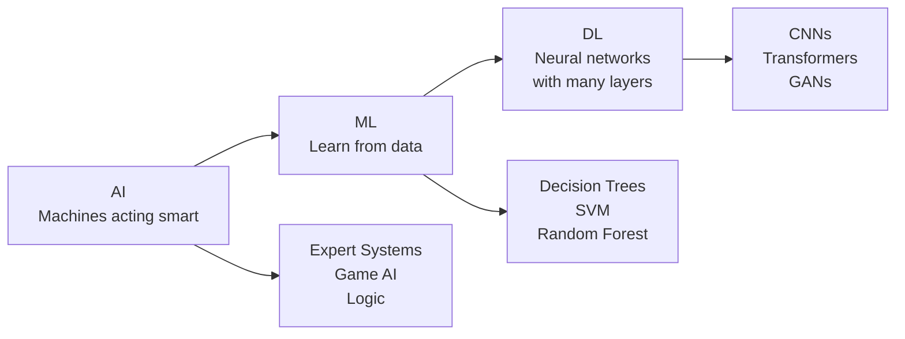

# AI vs ML vs Deep Learning

> Author: **Tamilselvan** · ✉️ tamilselvan.sde@gmail.com · 🔗 [LinkedIn](https://www.linkedin.com/in/tamilselvan-ai/)
>

## 1. What is it?

**ELI5:** Artificial Intelligence (AI) is the grand idea of machines acting smart. Machine Learning (ML) is teaching machines to learn from data without explicit programming. Deep Learning (DL) is a subset of ML using brain-like neural networks with many layers.



**Simple Explanation:** Think of AI as the entire field of "making computers do smart things." ML is a approach where computers learn patterns from data rather than following hard-coded rules. DL is a more sophisticated ML technique using multi-layered neural networks that automatically discover features.

**Technical Definition:**
- **AI (1956):** The simulation of human intelligence by machines. Encompasses reasoning, learning, perception, and problem-solving. Includes both symbolic AI (rule-based) and modern statistical approaches.
- **ML (1959 - Arthur Samuel):** "Field of study that gives computers the ability to learn without being explicitly programmed." Algorithms improve performance at some task `T` with experience `E` and performance measure `P`.
- **DL (2012 - AlexNet breakthrough):** ML algorithms using artificial neural networks with ≥2 hidden layers. Leverages hierarchical feature learning where higher layers learn abstract representations from lower-level features.


*AI is the broadest field, ML is a subset of AI, and Deep Learning is a subset of ML.*

## 2. Why do we need it?

**Problem Solved:** Traditional programming requires humans to specify every rule. For tasks like image recognition, sentiment analysis, or game playing, writing explicit rules is impossible (consider: how would you write rules to identify a cat in any pose, lighting, or angle?).

**Pain Without It:**
- Rule-based spam filters fail against novel patterns
- Hand-crafted translation rules produce brittle, unnatural language
- Fraud detection misses zero-day attack patterns
- Recommendation systems cannot surface serendipitous content

**Why Companies Invest:**
- **ROI:** ML models at Netflix save $1B/year through churn prediction
- **Automation:** Google uses DL to reduce data center cooling costs by 40%
- **Accuracy:** Deep Learning beats humans at ImageNet classification (3.57% vs 5.1% top-5 error)
- **Scale:** Manual review of 1M daily transactions is impossible; ML handles it

## 3. Real-world Example

| Layer | Company | Application |
|-------|---------|-------------|
| AI | Amazon | Alexa: combines NLU, speech recognition, knowledge graphs, planning |
| ML | Spotify | Collaborative filtering for Discover Weekly (200M users) |
| DL | Google | AlphaFold2 predicts protein structures (200M proteins) |
| DL | OpenAI | GPT-4: 1.8T parameters trained on 13T tokens |
| ML | Uber | ML forecasting for ETA prediction across 10M+ daily trips |
| DL | Tesla | Vision-only autopilot with 8 cameras, 48 neural networks |

**Netflix Example:**
- **AI Goal:** Maximize subscriber retention and engagement
- **ML Layer:** Matrix factorization (SVD) predicts user ratings (2000-2009)
- **DL Layer:** Neural collaborative filtering + CNN-based artwork personalization (2016+)
- **Result:** $1B/year saved through reduced churn, 80% of watched content comes from recommendations

## 4. Architecture Diagram (ASCII)

```
┌───────────────────────────────────────────────────────────────────────┐
│                       ARTIFICIAL INTELLIGENCE                         │
│  ┌─────────────┐ ┌──────────────┐ ┌──────────┐ ┌──────────────────┐ │
│  │ Expert      │ │ Natural      │ │ Computer │ │ Robotics         │ │
│  │ Systems     │ │ Language     │ │ Vision   │ │                  │ │
│  │ ┌─────────┐ │ │ Processing   │ │ ┌──────┐ │ │ ┌──────────────┐ │ │
│  │ │ Rule    │ │ │ ┌─────────┐  │ │ │Face  │ │ │ │ Path         │ │ │
│  │ │ Engine  │ │ │ │Sentiment│  │ │ │Detect│ │ │ │ Planning     │ │ │
│  │ └─────────┘ │ │ └─────────┘  │ │ └──────┘ │ │ └──────────────┘ │ │
│  └─────────────┘ └──────────────┘ └──────────┘ └──────────────────┘ │
│                                                                       │
│  ┌───────────────────────────────────────────────────────────────┐   │
│  │                   MACHINE LEARNING                            │   │
│  │  ┌────────────┐  ┌────────────┐  ┌────────────┐             │   │
│  │  │ Supervised │  │ Unsupervised│  │Reinforcement│            │   │
│  │  │ Regression │  │ Clustering  │  │ Q-Learning  │            │   │
│  │  │ Classifier │  │ Dimensional │  │ Policy Grad │            │   │
│  │  │ SVM, RF    │  │ Reduction   │  │ AlphaGo     │            │   │
│  │  └────────────┘  └────────────┘  └────────────┘             │   │
│  │                                                               │   │
│  │  ┌──────────────────────────────────────────────────────┐    │   │
│  │  │              DEEP LEARNING                           │    │   │
│  │  │  ┌──────────┐ ┌──────────┐ ┌──────────┐ ┌────────┐ │    │   │
│  │  │  │   CNN    │ │   RNN    │ │Transform │ │   GAN  │ │    │   │
│  │  │  │ LeNet-5  │ │  LSTM    │ │ GPT, BERT│ │DALL-E  │ │    │   │
│  │  │  │ ResNet   │ │  GRU      │ │ ViT      │ │StyleGAN│ │    │   │
│  │  │  └──────────┘ └──────────┘ └──────────┘ └────────┘ │    │   │
│  │  └──────────────────────────────────────────────────────┘    │   │
│  └───────────────────────────────────────────────────────────────┘   │
└───────────────────────────────────────────────────────────────────────┘
```

## 5. Internal Working

**AI System Pipeline (Modern Agent):**
1. **Perception:** Sensor/data input → Feature extraction
2. **Reasoning:** Knowledge representation → Inference engine
3. **Learning:** Training data → Model update → Validation
4. **Action:** Decision → Execution → Feedback loop

**ML Training Pipeline:**
1. Data collection → cleaning → feature engineering
2. Split into train/val/test (typically 80/10/10)
3. Select algorithm → Train model → Hyperparameter tuning
4. Evaluate on held-out test set → Deploy
5. Monitor for drift → Retrain

**DL Training Pipeline:**
1. Raw data (images, text, audio) → minimal feature engineering
2. Feed-forward through layers with non-linear activations (ReLU, GELU)
3. Compute loss (Cross-entropy, MSE) → Backpropagate gradients
4. Optimizer (Adam, SGD) updates weights
5. Repeat for epochs until convergence
6. Key difference: hierarchical feature learning automates feature engineering

## 6. Production Flow

```
Request → Preprocessor → ML/DL Model → Postprocessor → Response
                          ↑
                    Feature Store
                          ↑
                    Model Registry
                          ↑
                    Training Pipeline
```

**Production ML System Components:**
- **Feature Store (Feast/Tecton):** Centralized feature computation and serving
- **Model Registry (MLflow):** Versioned model artifacts with lineage
- **Prediction Service (KServe/Seldon):** Model serving with autoscaling
- **Monitoring (Prometheus/Grafana):** Data drift, model degradation
- **A/B Testing:** Shadow traffic → Canary → Full rollout
- **Retraining Trigger:** Performance degradation or schedule-based

## 7. HLD (High-Level Design)

```
┌─────────────────────────────────────────────────────────────────┐
│                    ML Platform (HLD)                            │
│                                                                 │
│  ┌──────────┐  ┌──────────┐  ┌──────────┐  ┌──────────┐       │
│  │ Data     │→ │ Feature  │→ │ Training │→ │ Model    │       │
│  │ Pipeline │  │ Pipeline │  │ Pipeline │  │ Registry │       │
│  └──────────┘  └──────────┘  └──────────┘  └──────────┘       │
│       │              │              │              │            │
│       ▼              ▼              ▼              ▼            │
│  ┌──────────┐  ┌──────────┐  ┌──────────┐  ┌──────────┐       │
│  │ Data Lake│  │ Feature  │  │ Compute  │  │ Model    │       │
│  │ (S3/GCS) │  │ Store    │  │ (GPU/TPU)│  │ Artifacts│       │
│  └──────────┘  └──────────┘  └──────────┘  └──────────┘       │
│                                                                 │
│  ┌──────────────────────────────────────────────────────┐      │
│  │              Serving Layer                            │      │
│  │  ┌──────────┐  ┌──────────┐  ┌──────────┐           │      │
│  │  │ API      │→ │ Predict  │→ │ Monitor  │           │      │
│  │  │ Gateway  │  │ Service  │  │ (Drift)  │           │      │
│  │  └──────────┘  └──────────┘  └──────────┘           │      │
│  └──────────────────────────────────────────────────────┘      │
└─────────────────────────────────────────────────────────────────┘
```

## 8. LLD (Low-Level Design)

```python
# Core abstractions for ML/DL system
from abc import ABC, abstractmethod
from dataclasses import dataclass
from typing import Any, Optional
import numpy as np

@dataclass
class ModelConfig:
    model_name: str
    version: str
    runtime: str  # "sklearn", "pytorch", "tensorflow"
    max_batch_size: int = 32
    timeout_ms: int = 500
    gpu_memory_gb: float = 16.0

@dataclass
class PredictionRequest:
    features: dict[str, Any]
    request_id: str
    use_cache: bool = True

@dataclass
class PredictionResponse:
    predictions: list[Any]
    confidence: float
    latency_ms: float
    model_version: str

class FeatureStore(ABC):
    @abstractmethod
    def get_features(self, entity_ids: list[str], feature_names: list[str]) -> dict: ...
    @abstractmethod
    def compute_features(self, raw_data: dict) -> dict: ...

class ModelRegistry(ABC):
    @abstractmethod
    def get_model(self, name: str, version: Optional[str] = None) -> Any: ...
    @abstractmethod
    def register_model(self, name: str, version: str, artifact: Any): ...

class MLModel(ABC):
    @abstractmethod
    def predict(self, features: np.ndarray) -> np.ndarray: ...
    @abstractmethod
    def train(self, X: np.ndarray, y: np.ndarray): ...
    @abstractmethod
    def evaluate(self, X: np.ndarray, y: np.ndarray) -> dict: ...

class DeepLearningModel(MLModel):
    @abstractmethod
    def forward(self, x: Any) -> Any: ...
    @abstractmethod
    def backward(self, loss: Any) -> None: ...
```

## 9. Python Implementation

```python
# ai_vs_ml_vs_dl.py - Production-grade comparison using FastAPI
import time
import uuid
import logging
from typing import Optional
import numpy as np
from fastapi import FastAPI, HTTPException
from pydantic import BaseModel, Field
from prometheus_client import Histogram, Counter, Gauge
from contextlib import asynccontextmanager

logging.basicConfig(level=logging.INFO)
logger = logging.getLogger(__name__)

# Prometheus metrics
PREDICTION_LATENCY = Histogram("prediction_latency_seconds", "Prediction latency", ["model_type"])
PREDICTION_COUNT = Counter("predictions_total", "Total predictions", ["model_type", "status"])
MODEL_ACCURACY = Gauge("model_accuracy", "Current model accuracy", ["model_type"])

app = FastAPI(title="AI/ML/DL Platform", version="1.0.0")

# ─── Pydantic Models ───
class PredictRequest(BaseModel):
    features: list[float] = Field(..., description="Input features")
    model_type: str = Field("ml", pattern="^(ai|ml|dl)$")
    use_cache: bool = True

class PredictResponse(BaseModel):
    prediction: list[float]
    model_type: str
    confidence: float
    latency_ms: float
    request_id: str

# ─── Rule-based AI (Symbolic) ───
class RuleBasedSystem:
    """Expert system using hand-crafted rules."""
    def __init__(self):
        self.rules = {
            "high_risk": lambda f: f[0] > 0.8 and f[1] < 0.2,
            "medium_risk": lambda f: 0.5 < f[0] <= 0.8,
            "low_risk": lambda f: f[0] <= 0.5,
        }

    def predict(self, features: list[float]) -> tuple[list[float], float]:
        for risk, rule in self.rules.items():
            if rule(features):
                confidence = 1.0 if risk == "low_risk" else 0.8
                return [[0.9 if risk == "high_risk" else 0.5 if risk == "medium_risk" else 0.1]], confidence
        return [[0.5]], 0.5

# ─── ML Model (Scikit-learn style) ───
class MLModel:
    """Traditional ML with feature engineering."""
    def __init__(self):
        self.weights: Optional[np.ndarray] = None
        logger.info("Initialized MLModel (traditional ML)")

    def train(self, X: np.ndarray, y: np.ndarray):
        # Closed-form solution: w = (X^T X)^(-1) X^T y
        self.weights = np.linalg.inv(X.T @ X) @ X.T @ y
        logger.info("ML model trained on %d samples", X.shape[0])

    def predict(self, features: list[float]) -> tuple[list[float], float]:
        if self.weights is None:
            raise RuntimeError("Model not trained")
        x = np.array(features)
        prediction = x @ self.weights
        # Simple sigmoid confidence
        confidence = float(1 / (1 + np.exp(-np.abs(prediction))))
        return [[float(prediction)]], confidence

# ─── DL Model (Neural Network) ───
class DLModel:
    """Deep Learning with multi-layer neural network."""
    def __init__(self, layers: list[int]):
        self.layers = layers
        self.params = self._initialize_weights()
        logger.info("Initialized DLModel with layers: %s", layers)

    def _initialize_weights(self) -> list[dict]:
        params = []
        for i in range(len(self.layers) - 1):
            params.append({
                "W": np.random.randn(self.layers[i], self.layers[i+1]) * 0.01,
                "b": np.zeros((1, self.layers[i+1])),
            })
        return params

    def _relu(self, x: np.ndarray) -> np.ndarray:
        return np.maximum(0, x)

    def _softmax(self, x: np.ndarray) -> np.ndarray:
        exp_x = np.exp(x - np.max(x, axis=1, keepdims=True))
        return exp_x / np.sum(exp_x, axis=1, keepdims=True)

    def forward(self, x: np.ndarray) -> np.ndarray:
        a = x
        for i, layer in enumerate(self.params):
            z = a @ layer["W"] + layer["b"]
            a = self._relu(z) if i < len(self.params) - 1 else self._softmax(z)
        return a

    def predict(self, features: list[float]) -> tuple[list[float], float]:
        x = np.array(features).reshape(1, -1)
        output = self.forward(x)
        confidence = float(np.max(output))
        return output.tolist(), confidence

# ─── Model Factory ───
class ModelFactory:
    _instances = {}

    @classmethod
    def get_model(cls, model_type: str):
        if model_type not in cls._instances:
            if model_type == "ai":
                cls._instances[model_type] = RuleBasedSystem()
            elif model_type == "ml":
                model = MLModel()
                X_train = np.random.randn(100, 4)
                y_train = np.random.randn(100)
                model.train(X_train, y_train)
                cls._instances[model_type] = model
            elif model_type == "dl":
                cls._instances[model_type] = DLModel([4, 64, 32, 3])
            logger.info("Created %s model instance", model_type)
        return cls._instances[model_type]

# ─── API Endpoints ───
@app.post("/predict", response_model=PredictResponse)
async def predict(request: PredictRequest):
    start = time.perf_counter()
    request_id = str(uuid.uuid4())

    try:
        model = ModelFactory.get_model(request.model_type)
        prediction, confidence = model.predict(request.features)
        latency = (time.perf_counter() - start) * 1000

        PREDICTION_LATENCY.labels(model_type=request.model_type).observe(latency / 1000)
        PREDICTION_COUNT.labels(model_type=request.model_type, status="success").inc()

        return PredictResponse(
            prediction=prediction,
            model_type=request.model_type,
            confidence=confidence,
            latency_ms=round(latency, 2),
            request_id=request_id,
        )
    except Exception as e:
        PREDICTION_COUNT.labels(model_type=request.model_type, status="error").inc()
        logger.error("Prediction failed: %s", str(e))
        raise HTTPException(status_code=500, detail=str(e))

@app.get("/health")
async def health():
    return {"status": "healthy", "models": list(ModelFactory._instances.keys())}

if __name__ == "__main__":
    import uvicorn
    uvicorn.run(app, host="0.0.0.0", port=8000)
```

## 10. Folder Structure

```
ml-platform/
├── api/
│   ├── __init__.py
│   ├── routes.py          # FastAPI endpoints
│   ├── schemas.py         # Pydantic models
│   └── middleware.py      # Auth, rate limiting
├── models/
│   ├── __init__.py
│   ├── base.py            # Abstract base classes
│   ├── symbolic_ai.py     # Rule-based AI
│   ├── traditional_ml.py  # Random Forest, SVM, etc.
│   └── deep_learning.py   # Neural networks
├── training/
│   ├── pipeline.py        # Training orchestration
│   ├── data_loader.py     # Data ingestion
│   └── evaluator.py       # Model evaluation
├── serving/
│   ├── inference.py       # Prediction service
│   ├── batch.py           # Batch inference
│   └── model_registry.py  # MLflow integration
├── monitoring/
│   ├── metrics.py         # Prometheus metrics
│   ├── drift_detection.py # Data/model drift
│   └── alerts.py          # Alert manager
├── config/
│   ├── production.yaml
│   └── staging.yaml
├── tests/
│   ├── test_ai.py
│   ├── test_ml.py
│   └── test_dl.py
├── Dockerfile
├── docker-compose.yml
├── requirements.txt
└── README.md
```

## 11. Configuration

```yaml
# config/production.yaml
platform:
  name: "ml-platform"
  environment: "production"
  log_level: "INFO"

models:
  symbolic_ai:
    enabled: true
    rules_path: "/etc/rules/fraud_detection.json"
    fallback_action: "manual_review"

  traditional_ml:
    enabled: true
    algorithm: "xgboost"
    hyperparameters:
      max_depth: 7
      learning_rate: 0.01
      n_estimators: 1000
      subsample: 0.8
    feature_store: "feast"
    features:
      - "user_tenure_days"
      - "transaction_amount_7d_avg"
      - "login_frequency"

  deep_learning:
    enabled: true
    architecture: "transformer"
    layers: [768, 12, 12]  # hidden, num_layers, num_heads
    batch_size: 32
    precision: "bfloat16"
    gpu:
      count: 4
      type: "A100"
      memory_gb: 80

serving:
  api:
    host: "0.0.0.0"
    port: 8080
    workers: 4
    timeout_seconds: 30
    max_batch_size: 64
    rate_limit: 1000  # requests/second

  caching:
    enabled: true
    backend: "redis"
    ttl_seconds: 300
    max_size_mb: 1024

monitoring:
  metrics_port: 9090
  tracing: "opentelemetry"
  alert_channels:
    - type: "pagerduty"
      severity_threshold: "critical"
    - type: "slack"
      severity_threshold: "warning"

retraining:
  schedule: "0 3 * * 0"  # Weekly Sunday 3 AM
  trigger_on_drift: true
  max_training_hours: 48
  auto_deploy: false  # Requires manual approval
```

## 12. Flowchart

```
                    ┌──────────────┐
                    │  Raw Data    │
                    └──────┬───────┘
                           │
                    ┌──────▼───────┐
                    │ Feature Eng? │
                    └──────┬───────┘
                           │
              ┌────────────┼────────────┐
              │            │            │
         ┌────▼───┐  ┌────▼───┐  ┌────▼───┐
         │ Rule   │  │ ML     │  │ DL     │
         │ Engine │  │ Model  │  │ Network│
         └────┬───┘  └────┬───┘  └────┬───┘
              │            │            │
         ┌────▼───┐  ┌────▼───┐  ┌────▼───┐
         │Hand-   │  │Feature │  │Auto    │
         │crafted │  │Eng     │  │Feature │
         │Rules   │  │+ RF/GBM│  │Learning│
         └────┬───┘  └────┬───┘  └────┬───┘
              │            │            │
              └────────────┼────────────┘
                           │
                    ┌──────▼───────┐
                    │  Prediction  │
                    └──────┬───────┘
                           │
                    ┌──────▼───────┐
                    │  Decision    │
                    │  (Threshold) │
                    └──────┬───────┘
                           │
              ┌────────────┼────────────┐
              │            │            │
         ┌────▼───┐  ┌────▼───┐  ┌────▼───┐
         │ Accept │  │ Review │  │ Reject │
         └────────┘  └────────┘  └────────┘
```

## 13. Sequence Diagram

```
Client          API Gateway        Model Service       Feature Store      Monitor
  │                   │                   │                   │              │
  │── POST /predict ──►                  │                   │              │
  │                   │── Auth Check ──►  │                   │              │
  │                   │◄── OK ────────────│                   │              │
  │                   │                   │                   │              │
  │                   │── Get Features ──────────────────────►│              │
  │                   │◄── Features ──────────────────────────│              │
  │                   │                   │                   │              │
  │                   │── Select Model ──►│                   │              │
  │                   │   (AI/ML/DL)      │                   │              │
  │                   │                   │── Forward Pass ──►│              │
  │                   │                   │◄── Result ────────│              │
  │                   │                   │                   │              │
  │                   │── Record Metrics ───────────────────────────────►   │
  │                   │◄── OK ──────────────────────────────────────────    │
  │                   │                   │                   │              │
  │◄── Response ──────│                   │                   │              │
  │                   │                   │                   │              │
```

## 14. Pros

| Aspect | AI (Rule-based) | ML | DL |
|--------|-----------------|-----|-----|
| Interpretability | 10/10 — rules are explicit | 7/10 — feature importance | 2/10 — black box |
| Data Requirement | None | 1K-100K samples | 1M+ samples |
| Training Time | Zero | Minutes-Hours | Days-Weeks |
| Hardware | CPU only | CPU/GPU | GPU/TPU required |
| Feature Engineering | Manual | Semi-automated | Fully automated |
| Performance on Complex Tasks | Poor | Good | Excellent |
| Maintenance | High (rules brittle) | Moderate | Low (retrain only) |

## 15. Cons

**AI (Rule-based):**
- Cannot handle unseen patterns
- Explosion of rules for complex domains
- Maintainer must anticipate every edge case
- No learning from data — static knowledge

**ML (Traditional):**
- Requires expert feature engineering
- Feature interactions must be manually specified
- Plateaus after certain complexity threshold
- Struggles with unstructured data (images, text, audio)

**DL (Deep Learning):**
- Requires massive labeled datasets
- Expensive training ($1M+ for GPT-4 scale)
- Hard to debug and interpret
- Overfitting on small datasets
- Environmentally costly (300t CO2 for large model training)
- Brittle to adversarial examples

## 16. Alternatives

| Approach | When to Use | When NOT to Use |
|----------|-------------|-----------------|
| Symbolic AI | Fixed domains, compliance-heavy, explainability critical | Complex pattern recognition |
| Random Forest | Tabular data, small datasets, needs interpretability | Image/speech/text |
| XGBoost/LightGBM | Structured tabular, Kaggle competitions | Unstructured data |
| SVMs | High-dimensional sparse data, text classification | Large-scale datasets |
| CNNs | Image/video processing | Sequential/tabular data |
| RNNs/LSTMs | Time series, sequential data | Long sequences (use Transformer) |
| Transformers | NLP, vision, multi-modal | Low-latency edge deployment |
| GANs | Image generation, data augmentation | Tasks requiring stable training |
| Hybrid (Neuro-symbolic) | Reasoning + learning combined | Either alone works sufficiently |

## 17. Performance Considerations

**Training Performance:**
- **AI:** O(R) where R = number of rules — negligible compute
- **ML:** O(n * d * k) where n = samples, d = features, k = trees
- **DL:** O(n * p * l) where p = parameters, l = layers — GPU-bound
- **Tip:** Use mixed precision training (FP16/BF16) for 2x DL speedup

**Inference Performance:**
- **AI:** Sub-millisecond (pure logic)
- **ML:** 1-10ms (scikit-learn, XGBoost)
- **DL:** 10-100ms (GPU) or 100-1000ms (CPU)
- **Optimization:** ONNX Runtime, TensorRT, or quantization (INT8)

**Memory:**
- **AI:** Minimal (rules in RAM)
- **ML:** Moderate (forest of trees: ~1GB for 1000 trees)
- **DL:** Large (GPT-3: 350GB in FP32, 175GB in FP16)
- **Solution:** Model parallelism, offloading, KV cache

**Throughput (batched):**
- **AI:** 100K+ req/s per CPU core
- **ML:** 10K-100K req/s
- **DL:** 100-10K req/s per GPU (batch-dependent)

## 18. Scaling to Millions

**AI (Rule-based):**
- Horizontally scale stateless rule engines behind load balancer
- Redis rule cache for hot paths
- DAG-based execution for composable rules

**ML (Traditional):**
- Feature store (Feast) for online feature serving
- Model parallelism: partition trees across workers
- Batch inference via Spark on 1000+ node clusters

**DL (Deep Learning):**
- **Data Parallelism:** Split batch across N GPUs, sync gradients
- **Model Parallelism:** Split layers across GPUs (pipeline parallelism)
- **Tensor Parallelism:** Split individual operations across GPUs (Megatron-LM)
- **Expert Parallelism:** MoE routes tokens to specialized experts

**Google-scale Example:**
- Pathways system: 6144 TPUv4 chips for PaLM training
- 3D parallelism (data + pipeline + tensor)
- Dynamic shape batching for inference
- Automatic model sharding (GSPMD)

## 19. Failure Scenarios

| Scenario | Impact | Mitigation |
|----------|--------|------------|
| **Data Drift** | Accuracy drops silently | Monitor feature distributions, retrain triggers |
| **Concept Drift** | Relationships change | Windowed training, online learning |
| **GPU OOM** | Crash, dropped requests | Dynamic batch sizing, gradient checkpointing |
| **Model Crash** | 5xx errors | Circuit breaker, fallback to simpler model |
| **Cache Stampede** | Backend overload | Request collapsing, jittered TTLs |
| **Cold Start** | High latency on new models | Pre-warming, model keep-alive |
| **Spike in Traffic** | Throttling | Autoscaling, rate limiting, queue |
| **Stale Model** | Outdated predictions | Model version pinning, A/B shadow testing |

**Example Incident (Uber ML Platform, 2019):**
- Symptom: ETA predictions suddenly inaccurate by 40%
- Root Cause: Feature pipeline change silently corrupted coordinate normalization
- Fix: Feature validation + statistical monitoring at every pipeline stage
- Lesson: ML is only as reliable as the data pipeline feeding it

## 20. Security

| Layer | Threat | Mitigation |
|-------|--------|------------|
| **API** | Model theft via repeated queries | Rate limiting, per-user quotas, auth |
| **Data** | PII leakage in training data | Differential privacy (DP-SGD), data masking |
| **Model** | Adversarial attacks | Input validation, adversarial training |
| **Inference** | Model inversion | Gradient sanitization, output perturbation |
| **Supply Chain** | Malicious model weights | Model signing, hash verification |
| **Infrastructure** | GPU-side channels | Secure enclaves, tenant isolation |

```python
# Security middleware example
from fastapi import Request, HTTPException
import hashlib
import hmac
import time

class SecurityMiddleware:
    def __init__(self, secret_key: str):
        self.secret_key = secret_key
        self.rate_limiter = RateLimiter(max_requests=100, window_seconds=60)

    async def verify_request(self, request: Request):
        # API key validation
        api_key = request.headers.get("X-API-Key")
        if not self.validate_api_key(api_key):
            raise HTTPException(status_code=401, detail="Invalid API key")

        # Request signing
        signature = request.headers.get("X-Signature")
        payload = await request.body()
        expected = hmac.new(self.secret_key.encode(), payload, hashlib.sha256).hexdigest()
        if signature != expected:
            raise HTTPException(status_code=403, detail="Invalid signature")

        # Rate limiting
        client_id = request.headers.get("X-Client-ID", "unknown")
        if not self.rate_limiter.check(client_id):
            raise HTTPException(status_code=429, detail="Rate limit exceeded")
```

## 21. Monitoring

```yaml
# Prometheus metrics to track
metrics:
  latency:
    - name: prediction_latency_ms
      type: histogram
      buckets: [5, 10, 25, 50, 100, 250, 500, 1000, 5000]
    - name: training_duration_hours
      type: gauge

  throughput:
    - name: requests_per_second
      type: gauge
    - name: batch_size_avg
      type: histogram

  model_health:
    - name: prediction_accuracy
      type: gauge
      labels: [model_name, version]
    - name: data_drift_score
      type: gauge
      labels: [feature_name]
    - name: model_staleness_days
      type: gauge

  infrastructure:
    - name: gpu_utilization
      type: gauge
    - name: gpu_memory_used_gb
      type: gauge
    - name: model_cache_hit_ratio
      type: gauge
    - name: error_rate
      type: counter
      labels: [model_type, error_code]

# Grafana dashboards:
# - Model Performance: latency, throughput, errors, cache hit ratio
# - Data Quality: drift scores, missing values, feature distributions
# - Infrastructure: GPU utilization, memory, temperature, power
# - Business: prediction volume, accuracy trends, cost per prediction
```

## 22. Interview Questions

**Beginner:**
- Q: What is the difference between AI, ML, and DL?
  A: AI is the broad field of intelligent machines. ML is a subset that learns from data. DL is a subset of ML using deep neural networks.

- Q: When would you use a Random Forest instead of a neural network?
  A: For tabular data < 100K rows, when interpretability matters, or when you have limited compute.

**Intermediate:**
- Q: Why did deep learning become popular only after 2012?
  A: Three factors converged: (1) Big data (ImageNet, web-scale text), (2) GPU computing (100x speedup), (3) Better algorithms (ReLU, dropout, batch norm, Adam).

- Q: What is the bias-variance tradeoff in ML vs DL?
  A: ML models typically trade off bias for variance (simple models underfit, complex overfit). DL models can be "interpolation-threshold" — large enough to memorize but generalize due to implicit regularization from SGD.

**Senior:**
- Q: Your ML model has 99% accuracy on test data but fails in production. Diagnose.
  A: Possible causes: data drift, concept drift, training-serving skew, label leakage, non-representative test set, or adversarial inputs. Solution: monitor feature distributions, maintain golden dataset, implement shadow testing.

- Q: Design a system to serve 100 different ML models at 10K QPS with 99.9% uptime.
  A: Use model registry, adaptive batching, dynamic GPU routing, model warm-up, circuit breakers, multi-model serving (NVIDIA Triton), autoscaling based on queue depth.

**Staff Engineer:**
- Q: A team wants to use deep learning for all problems. How do you push back?
  A: Framework: compute TCO = training cost + inference cost + maintenance + opportunity cost. DL costs 100x more to train, needs 1000x more data, is harder to debug, and requires specialized talent. For 80% of business problems, a well-tuned XGBoost with good features beats a poorly-tuned neural net.

- Q: Design a platform that supports AI/ML/DL models with consistent serving APIs, monitoring, and lifecycle management.
  A: Reference: Uber's Michelangelo or Google's TFX. Key components: feature store, training pipeline, model registry, deployment service, prediction service, monitoring infrastructure. Abstract model interface so any paradigm plugs in.

**Architect:**
- Q: Your company wants to replace their 500-rule fraud detection system with ML. How do you approach this?
  A: (1) Audit existing rules — encode as features. (2) Graduated deployment: run ML in shadow mode, compare decisions. (3) Hybrid: rules handle edge cases, ML handles majority. (4) Monitor for "rules overrides ML" rate to prune rules over time. (5) Plan for 6-12 month transition with A/B testing.

- Q: Design a multi-tenant ML platform for 50 squads across 3 continents.
  A: (1) Tenant isolation: per-squad model serving namespaces. (2) Governance: model review process, approval gates, compliance checks. (3) Cost allocation: GPU compute tagging, chargeback. (4) Federation: global model registry, local feature computation. (5) ML Ops: CI/CD for models, automated canary, rollback.

## 23. Cheat Sheet

```
┌─────────────────────────────────────────────────────────────────────┐
│                    AI / ML / DL CHEAT SHEET                         │
├─────────────────────────────────────────────────────────────────────┤
│                                                                    │
│  AI = Any machine that exhibits intelligence                       │
│    ├─ Rule-based: Expert systems, decision trees (hand-crafted)    │
│    ├─ Knowledge: Graphs, ontologies, reasoning engines             │
│    └─ Planning: STRIPS, PDDL, Monte Carlo tree search              │
│                                                                    │
│  ML = Learning from data without explicit programming              │
│    ├─ Supervised: Regression, Classification (RF, SVM, XGBoost)    │
│    ├─ Unsupervised: Clustering (K-Means, DBSCAN), PCA, t-SNE       │
│    └─ Reinforcement: Q-Learning, PPO, DQN (AlphaGo, robotics)      │
│                                                                    │
│  DL = Multi-layer neural networks learning hierarchies             │
│    ├─ CNNs: Conv → Pool → FC (ResNet, EfficientNet, YOLO)          │
│    ├─ RNNs: LSTM, GRU (time series, sequences)                     │
│    └─ Transformers: Attention is All You Need (GPT, BERT, ViT)     │
│                                                                    │
│  QUICK DECISION:                                                    │
│  ┌─────────────────────────────────────────────────────────┐       │
│  │ Data < 10K?       → XGBoost / Random Forest             │       │
│  │ Unstructured data? → DL (CNN for images, Transformer    │       │
│  │                       for text)                         │       │
│  │ Need interpretability? → Rule-based or Linear/Logistic  │       │
│  │ Compliance-critical?  → Symbolic AI + ML hybrid         │       │
│  │ Need pure accuracy?   → DL with massive data            │       │
│  │ Edge deployment?      → Distilled/quantized model       │       │
│  └─────────────────────────────────────────────────────────┘       │
└─────────────────────────────────────────────────────────────────────┘
```

## 24. Common Mistakes

1. **Using DL on small datasets (<10K samples)**
   - Neural nets overfit dramatically. Use linear models or tree-based methods.
   
2. **Ignoring feature engineering even with DL**
   - DL automates some feature engineering but structured features + good encoding matter.

3. **Confusing correlation with causation**
   - ML finds correlations, not causes. A/B testing needed for causal claims.

4. **Treating ML as a one-time project**
   - Models decay. Data drift, concept drift, and environment changes require ongoing monitoring.

5. **Skipping baseline models**
   - Always start with a simple heuristic or linear model. If DL doesn't beat it, rethink.

6. **Overfitting to leaderboard metrics**
   - Optimizing for online metrics vs offline metrics are different games.

7. **Not versioning data and models together**
   - Reproducibility requires data + code + model configuration tied to a hash.

8. **Deploying without monitoring**
   - Silent model failure is worse than explicit crash. Monitor predictions, features, and business outcomes.

## 25. Production Best Practices

1. **Start Simple, Iterate:** Logistic Regression → Gradient Boosting → DL. Each step needs 10x ROI justification.

2. **Feature Store First:** Centralize feature computation. Tecton, Feast, or custom — consistency between train and serve is critical.

3. **Train-Serve Skew Detection:** Log feature distributions at prediction time. Compare with training distribution in real-time.

4. **Shadow Deployment:** Run new model parallel to production. Compare outputs for N days before switching traffic.

5. **Model CI/CD:** Automated tests: data integrity, feature expectations, performance thresholds, bias fairness checks.

6. **Retraining Strategy:**
   - **Scheduled:** Weekly for stable environments
   - **Triggered:** On drift detection for volatile domains
   - **Online:** Continuous learning for real-time adaptation

7. **Cost Governance:** Track GPU hours, inference costs, data storage. Set budgets per team/model.

8. **Observability Triad:** Metrics (Prometheus) + Logging (ELK) + Tracing (OpenTelemetry) for every prediction.

9. **Fallback Chain:** Primary DL → Secondary ML → Rule-based → Static default. Graceful degradation.

10. **Human-in-the-Loop:** For high-stakes decisions (medical, financial), route low-confidence predictions to human review.
