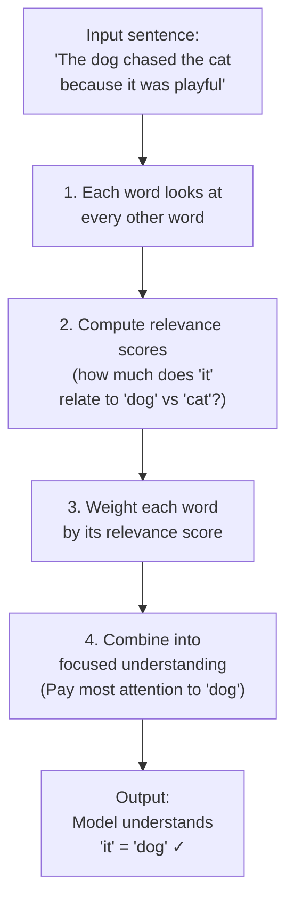

# Attention Mechanism

## 1. What is it?

**ELI5:** When you read a sentence, your brain focuses on the most relevant words to understand meaning. For "The dog chased the cat because it was playful," you know "it" refers to "dog," not "cat." Attention is how neural networks do the same thing — they learn which parts of the input are relevant to each other and weigh them accordingly.



**Simple Explanation:** Attention is a mechanism that allows a model to dynamically focus on specific parts of the input when producing output. Instead of compressing the entire input into a fixed-size vector (like older encoder-decoder models), attention computes a weighted combination of all input elements, where weights represent relevance.

**Technical Definition:** Attention computes a mapping from a Query (Q) and a set of Key-Value (K-V) pairs to an output. The output is a weighted sum of Values, where the weights are computed by a compatibility function between Query and Keys. Formally: `Attention(Q, K, V) = softmax(QK^T / √d_k) V`. This was introduced by Bahdanau et al. in 2014 for neural machine translation, enabling models to "look at" different source words at each decoding step.

## 2. Why do we need it?

**Problem It Solves:**
Before attention, sequence-to-sequence models used a fixed-size context vector:
- The encoder compressed the entire input sequence into a single vector
- For long sentences, the beginning was "forgotten" by the time decoding finished
- Example: Translating "The cat that the dog that the boy owned chased ran away" — the original encoder couldn't track the nested dependencies

**Pain Without It:**
- **Translation:** English→French models lost details in sentences >20 words. BLEU scores dropped 30% from short to long sentences.
- **Summarization:** 5000-word documents compressed to a 512-dim vector = information loss
- **Image Captioning:** Model saw entire image at once, couldn't focus on specific regions while generating each word
- **Speech Recognition:** Lost alignment between audio frames and text output

**Why Companies Invest:**
- **Quality:** Bahdanau attention improved BLEU from 25.9 to 28.5 on English→French translation (2014)
- **Interpretability:** Attention weights show exactly which input words mattered for each output word
- **Flexibility:** Works across modalities: text-text, text-image, audio-text, video-text
- **Scalability:** Attention mechanisms enabled Transformers, which scale to 1T+ parameters

## 3. Real-world Example


| Company | Use Case | Attention Variant | Impact |
|---------|----------|-------------------|--------|
| **Google** | Neural Machine Translation (GNMT) | Bahdanau attention | 60% improvement in translation quality |
| **OpenAI** | GPT-4 image understanding | Cross-attention (image↔text) | Multimodal reasoning |
| **Meta** | Segment Anything (SAM) | Point/prompt attention | Zero-shot image segmentation |
| **DeepMind** | AlphaFold2 | Pairwise attention (Evoformer) | Protein structure prediction breakthrough |
| **Apple** | Siri speech recognition | Location-aware attention | 15% WER reduction |
| **Tesla** | Autopilot object tracking | Temporal attention across video frames | Consistent object IDs across frames |
| **Netflix** | Video thumbnail selection | Visual attention on key frames | 20% increase in click-through rate |

**Google Neural Machine Translation (GNMT, 2016):**
- Used Bahdanau attention in a 8-layer encoder-decoder LSTM
- Enabled 85% of Google Translate traffic to use NMT
- Reduced translation errors by 60% compared to phrase-based SMT
- Supported 100+ languages with zero-shot translation capability

## 4. Architecture Diagram (ASCII)

```
                         ATTENTION MECHANISM
                        ┌─────────────────────┐
                        │     Attention       │
                        │     Output          │
                        │         ▲           │
                        │         │           │
                        │    ┌────┴─────┐     │
                        │    │ Weighted  │     │
                        │    │  Sum      │     │
                        │    └────┬─────┘     │
                        │         │           │
                        │    ┌────┴─────┐     │
                        │    │ Softmax  │     │
                        │    │ (Normalize│     │
                        │    │  Scores)  │     │
                        │    └────┬─────┘     │
                        │         │           │
                        │    ┌────┴─────┐     │
                        │    │   Scale   │     │
                        │    │  (÷√d_k)  │     │
                        │    └────┬─────┘     │
                        │         │           │
                        │    ┌────┴─────┐     │
                        │    │   Q×K^T  │     │
                        │    │  (Scores) │     │
                        │    └────┬─────┘     │
                        │         │           │
                        │  ┌──────┼──────┐    │
                        │  │      │      │    │
                        │  ▼      ▼      ▼    │
                        │  Q      K      V     │
                        │  │      │      │     │
                        │  ▼      ▼      ▼     │
                        │ Input  Input  Input  │
                        └─────────────────────┘
```

## 5. Internal Working

**Step-by-step Execution of Bahdanau (Additive) Attention:**

**Step 1 — Compute Alignment Scores:**
- At each decoding step t, compute relevance of each encoder hidden state hⱼ
- Score: `e(t,j) = v_a^T · tanh(W_a · s_{t-1} + U_a · h_j)`
- Where s_{t-1} is the previous decoder state, h_j is encoder state j
- W_a, U_a, v_a are learned parameters

**Step 2 — Normalize to Attention Weights:**
- Apply softmax across all source positions j
- `α(t,j) = exp(e(t,j)) / Σ_k exp(e(t,k))`
- α(t,j) represents the importance of source word j at decoding step t

**Step 3 — Compute Context Vector:**
- Weighted sum of encoder hidden states
- `c_t = Σ_j α(t,j) · h_j`
- This context vector contains focused information from the source

**Step 4 — Combine with Decoder State:**
- Concatenate context vector with decoder state
- `ã_t = tanh(W_c · [c_t; s_t])`
- Use this to predict next output word

**For Scaled Dot-Product Attention (Vaswani et al.):**
- Simpler: `Attention(Q,K,V) = softmax(QK^T / √d_k) V`
- No learned parameters for scoring (pure dot product)
- Scale factor √d_k prevents softmax saturation
- Much faster due to matrix multiplication optimization

## 6. Production Flow

```
┌──────────┐    ┌──────────┐    ┌──────────┐    ┌──────────┐
│  Source  │───▶│  Compute │───▶│  Compute │───▶│  Compute │
│  Sequence│    │  Q,K,V  │    │  Scores  │    │  Context │
└──────────┘    └──────────┘    └──────────┘    └──────────┘
                                                      │
                                                      ▼
                                              ┌──────────┐
                                              │  Combine  │
                                              │  w/Output │
                                              └──────────┘

Production pipeline for attention-based NMT:
1. Source sentence encoded into representations (h₁, h₂, ..., hₙ)
2. Decoder starts with <START> token
3. For each target token:
   a. Compute attention scores over all source positions
   b. Compute context vector (weighted sum)
   c. Combine context with decoder state
   d. Predict next token probability
   e. Repeat until <END> token

Optimizations used in production:
- Cached encoder outputs (no recomputation)
- Efficient batch matrix multiplication (cuBLAS)
- Attention score computation fused into single kernel
- Flash Attention for long sequences
- Cross-attention KV cache for decoder
```

## 7. HLD (High-Level Design)

```
┌──────────────────────────────────────────────────────────────────┐
│                   ATTENTION-BASED SYSTEM (HLD)                   │
│                                                                  │
│  ┌────────────┐     ┌────────────┐     ┌────────────┐          │
│  │  Input     │────▶│  Encoder   │────▶│  Attention  │          │
│  │  Sequence  │     │  (Bi-LSTM  │     │  Module    │          │
│  │  (Source)  │     │  or Trans) │     │  ┌────────┐ │          │
│  └────────────┘     └────────────┘     │  │Score   │ │          │
│                                         │  │Compute │ │          │
│  ┌────────────┐     ┌────────────┐     │  └────────┘ │          │
│  │  Target    │────▶│  Decoder   │◀────│  ┌────────┐ │          │
│  │  Sequence  │     │  (LSTM or  │     │  │Context │ │          │
│  │  (Prev)    │     │   Trans)   │     │  │Generate│ │          │
│  └────────────┘     └────────────┘     │  └────────┘ │          │
│                                         └────────────┘          │
│                                            │                     │
│                                            ▼                     │
│                                     ┌────────────┐              │
│                                     │  Output    │              │
│                                     │  Projection│              │
│                                     └────────────┘              │
└──────────────────────────────────────────────────────────────────┘
```

## 8. LLD (Low-Level Design)

```python
# attention.py — Production-Grade Attention Implementations
import torch
import torch.nn as nn
import torch.nn.functional as F
from typing import Optional, Tuple

class BahdanauAttention(nn.Module):
    """Additive attention (Bahdanau et al., 2014)."""

    def __init__(self, hidden_dim: int, encoder_dim: Optional[int] = None):
        super().__init__()
        encoder_dim = encoder_dim or hidden_dim
        self.W_a = nn.Linear(hidden_dim, hidden_dim, bias=False)
        self.U_a = nn.Linear(encoder_dim, hidden_dim, bias=False)
        self.v_a = nn.Linear(hidden_dim, 1, bias=False)

    def forward(self, decoder_state: torch.Tensor,
                encoder_outputs: torch.Tensor,
                mask: Optional[torch.Tensor] = None) -> Tuple[torch.Tensor, torch.Tensor]:
        # decoder_state: (batch, hidden_dim)
        # encoder_outputs: (batch, src_len, encoder_dim)
        batch, src_len, _ = encoder_outputs.shape

        # Expand decoder state: (batch, 1, hidden_dim) → (batch, src_len, hidden_dim)
        dec_expanded = decoder_state.unsqueeze(1).expand(-1, src_len, -1)

        # Score: v_a · tanh(W_a · s + U_a · h)
        score = self.v_a(torch.tanh(
            self.W_a(dec_expanded) + self.U_a(encoder_outputs)
        )).squeeze(-1)  # (batch, src_len)

        if mask is not None:
            score = score.masked_fill(mask == 0, float("-inf"))

        attention_weights = F.softmax(score, dim=-1)  # (batch, src_len)

        # Context vector: weighted sum of encoder outputs
        context = torch.bmm(attention_weights.unsqueeze(1), encoder_outputs)
        context = context.squeeze(1)  # (batch, encoder_dim)

        return context, attention_weights


class LuongAttention(nn.Module):
    """Global attention (Luong et al., 2015). Supports dot, general, concat scores."""

    def __init__(self, hidden_dim: int, method: str = "general"):
        super().__init__()
        self.method = method
        if method == "general":
            self.W_a = nn.Linear(hidden_dim, hidden_dim, bias=False)
        elif method == "concat":
            self.W_a = nn.Linear(2 * hidden_dim, hidden_dim, bias=False)
            self.v_a = nn.Linear(hidden_dim, 1, bias=False)

    def _score(self, decoder_state: torch.Tensor,
               encoder_outputs: torch.Tensor) -> torch.Tensor:
        # decoder_state: (batch, hidden_dim), encoder_outputs: (batch, src_len, hidden_dim)
        if self.method == "dot":
            return torch.bmm(encoder_outputs, decoder_state.unsqueeze(2)).squeeze(2)

        elif self.method == "general":
            transformed = self.W_a(encoder_outputs)
            return torch.bmm(transformed, decoder_state.unsqueeze(2)).squeeze(2)

        elif self.method == "concat":
            dec_expanded = decoder_state.unsqueeze(1).expand(-1, encoder_outputs.size(1), -1)
            concat = torch.cat([dec_expanded, encoder_outputs], dim=-1)
            return self.v_a(torch.tanh(self.W_a(concat))).squeeze(-1)

        raise ValueError(f"Unknown method: {self.method}")

    def forward(self, decoder_state: torch.Tensor,
                encoder_outputs: torch.Tensor,
                mask: Optional[torch.Tensor] = None) -> Tuple[torch.Tensor, torch.Tensor]:
        scores = self._score(decoder_state, encoder_outputs)

        if mask is not None:
            scores = scores.masked_fill(mask == 0, float("-inf"))

        attention_weights = F.softmax(scores, dim=-1)
        context = torch.bmm(attention_weights.unsqueeze(1), encoder_outputs).squeeze(1)

        return context, attention_weights


class ScaledDotProductAttention(nn.Module):
    """Scaled dot-product attention (Vaswani et al., 2017)."""

    def __init__(self, dropout: float = 0.1):
        super().__init__()
        self.dropout = nn.Dropout(dropout)

    def forward(self, Q: torch.Tensor, K: torch.Tensor, V: torch.Tensor,
                mask: Optional[torch.Tensor] = None) -> Tuple[torch.Tensor, torch.Tensor]:
        d_k = Q.size(-1)
        scores = torch.matmul(Q, K.transpose(-2, -1)) / (d_k ** 0.5)

        if mask is not None:
            scores = scores.masked_fill(mask == 0, float("-inf"))

        attention_weights = F.softmax(scores, dim=-1)
        attention_weights = self.dropout(attention_weights)
        output = torch.matmul(attention_weights, V)

        return output, attention_weights
```

## 9. Python Implementation

```python
# attention_server.py — FastAPI service for attention-based models
import time
import uuid
import torch
import torch.nn as nn
from fastapi import FastAPI, HTTPException
from pydantic import BaseModel, Field
from prometheus_client import Histogram, Counter

ATTENTION_LATENCY = Histogram("attention_compute_ms", "Attention computation latency")
ATTENTION_COUNT = Counter("attention_calls_total", "Total attention calls")

app = FastAPI(title="Attention Service", version="1.0.0")

class AttentionRequest(BaseModel):
    decoder_state: list[float]
    encoder_outputs: list[list[float]]
    mask: Optional[list[list[int]]] = None
    attention_type: str = Field(default="dot", pattern="^(dot|general|concat|bahdanau)$")

class AttentionResponse(BaseModel):
    context: list[float]
    attention_weights: list[float]
    latency_ms: float
    request_id: str

ATTENTION = {}

def get_attention(method: str, hidden_dim: int) -> nn.Module:
    if method not in ATTENTION:
        if method == "bahdanau":
            ATTENTION[method] = BahdanauAttention(hidden_dim)
        elif method == "general":
            ATTENTION[method] = LuongAttention(hidden_dim, method="general")
        elif method == "dot":
            ATTENTION[method] = LuongAttention(hidden_dim, method="dot")
        else:
            ATTENTION[method] = LuongAttention(hidden_dim, method="concat")
    return ATTENTION[method]

@app.post("/attention", response_model=AttentionResponse)
async def compute_attention(request: AttentionRequest):
    start = time.perf_counter()
    request_id = str(uuid.uuid4())
    ATTENTION_COUNT.inc()

    try:
        hidden_dim = len(request.decoder_state)
        src_len = len(request.encoder_outputs)

        dec = torch.tensor(request.decoder_state).unsqueeze(0)  # (1, hidden)
        enc = torch.tensor(request.encoder_outputs).unsqueeze(0)  # (1, src, hidden)
        mask = torch.tensor(request.mask).unsqueeze(0) if request.mask else None

        attention = get_attention(request.attention_type, hidden_dim)
        context, weights = attention(dec, enc, mask)

        latency = (time.perf_counter() - start) * 1000
        ATTENTION_LATENCY.observe(latency)

        return AttentionResponse(
            context=context.squeeze(0).tolist(),
            attention_weights=weights.squeeze(0).tolist(),
            latency_ms=round(latency, 2),
            request_id=request_id,
        )
    except Exception as e:
        raise HTTPException(status_code=500, detail=str(e))
```

## 10. Folder Structure

```
attention-system/
├── api/
│   ├── server.py           # FastAPI server
│   └── schemas.py
├── attention/
│   ├── __init__.py
│   ├── bahdanau.py         # Additive attention
│   ├── luong.py            # Dot/general/concat attention
│   ├── scaled_dot.py       # Scaled dot-product attention
│   ├── multi_head.py       # Multi-head attention
│   └── flash.py            # Flash attention wrapper
├── seq2seq/
│   ├── encoder.py          # RNN/Transformer encoder
│   ├── decoder.py          # Attention-based decoder
│   └── model.py
├── tests/
│   ├── test_attention.py
│   └── test_seq2seq.py
└── config.yaml
```

## 11. Configuration

```yaml
attention:
  type: "bahdanau"  # bahdanau, luong_dot, luong_general, scaled_dot
  hidden_dim: 512
  dropout: 0.1
  normalize_weights: true
  score_bias: false

encoder:
  type: "bidirectional_lstm"
  layers: 4
  hidden_dim: 512
  dropout: 0.3

decoder:
  type: "lstm"
  layers: 4
  hidden_dim: 512
  attention_type: "luong_general"
  input_feeding: true  # Feed context to next step
```

## 12. Flowchart

```
                    ┌──────────────┐
                    │  New Decode  │
                    │    Step      │
                    └──────┬───────┘
                           │
                    ┌──────▼───────┐
                    │  Get Previous│
                    │  Decoder     │
                    │  State (s_t) │
                    └──────┬───────┘
                           │
              ┌────────────┴────────────┐
              │                         │
         ┌────▼────┐              ┌─────▼─────┐
         │Compute  │              │Compute    │
         │Score per│              │Score per  │
         │Source   │              │Source     │
         │Word     │              │Word       │
         │(Additive)│             │(Dot)      │
         └────┬────┘              └─────┬─────┘
              │                         │
              └────────────┬────────────┘
                           │
                    ┌──────▼───────┐
                    │  Normalize   │
                    │  (Softmax)   │
                    └──────┬───────┘
                           │
                    ┌──────▼───────┐
                    │  Weighted    │
                    │  Sum of      │
                    │  Encoder     │
                    │  Outputs     │
                    └──────┬───────┘
                           │
                    ┌──────▼───────┐
                    │  Combine w/  │
                    │  Decoder     │
                    │  State →     │
                    │  Predict     │
                    └──────┬───────┘
                           │
              ┌────────────┴────────────┐
              │                         │
          ┌───▼───┐               ┌─────▼────┐
          │More   │               │  Done    │
          │Tokens?│───No──►       │          │
          └───┬───┘               └──────────┘
              │ Yes
              │
              ▼
      ┌────────────────┐
      │ s_{t+1} = f(s_t,│
      │     y_t, c_t)   │
      └────────────────┘
```

## 13. Sequence Diagram

```
Decoder State        Attention Module        Encoder Outputs        Output Layer
     │                      │                      │                    │
     │── s_t ──────────────►│                      │                    │
     │                      │── Request all h_j ──►│                    │
     │                      │◄── h_1...h_n ────────│                    │
     │                      │                      │                    │
     │                      │── Compute scores     │                    │
     │                      │── Softmax normalize  │                    │
     │                      │── Weighted sum ─────►│                    │
     │                      │◄── c_t ───────────────│                    │
     │◄── context + attn ────│                      │                    │
     │                      │                      │                    │
     │── [s_t, c_t] ───────────────────────────────────────────────────►│
     │                      │                      │                    │
     │◄── y_{t+1} ──────────────────────────────────────────────────────│
     │                      │                      │                    │
```

## 14. Pros

1. **Variable-length handling:** No fixed input size requirement. Works with any sequence length.

2. **Long-range dependencies:** Can directly connect output tokens to relevant input tokens, even if they're far apart.

3. **Interpretable:** Attention weights reveal model reasoning. Debug by visualizing which inputs are "looked at."

4. **Parallelizable:** Scaled dot-product attention uses matrix multiplications that are GPU-optimized.

5. **Gradient flow:** Direct connections from output to input prevent vanishing gradients.

6. **Modular:** Attention is a plug-in component. Add to any encoder-decoder architecture.

7. **Multi-modal:** Same mechanism works for text, images, audio, and combinations.

## 15. Cons

1. **Quadratic complexity:** O(n² m) for n source and m target tokens. Prohibitive for long sequences.

2. **Order invariance:** Attention doesn't naturally encode position. Must add positional encoding separately.

3. **Memory intensive:** Storing all attention weights requires O(n × m) memory.

4. **No inherent alignment:** Attention focuses on relevance, not alignment. Can produce unreasonable alignments.

5. **Soft attention is always "looking":** Every output attends to ALL inputs. Hard attention (sampling subset) is non-differentiable.

6. **Overconfidence:** Attention weights can be sharp but wrong. High scores don't guarantee correctness.

7. **Latency:** Real-time systems must compute attention at every decoding step.

## 16. Alternatives

| Mechanism | Description | When to Use |
|-----------|-------------|-------------|
| **No attention (fixed context)** | Compress everything to single vector | Very short sequences (<5 tokens) |
| **Hard attention** | Sample subset of input positions | When computation is critical (image generation) |
| **Local attention** | Attend only to window around aligned position | Long sequences where alignment is monotonic |
| **Self-attention** | Attention within a single sequence | Transformers, all modern LLMs |
| **Cross-attention** | Attention between two sequences | Encoder-decoder (translation, summarization) |
| **Sparse attention** | Fixed sparsity pattern (strided, dilated) | Very long sequences (documents, genomics) |
| **Linear attention** | O(n) approximation via kernel trick | Extreme long sequences (>100K) |
| **Memory-augmented attention** | External differentiable memory | Few-shot learning, long-term memory |

## 17. Performance Considerations

**Compute:**
- Bahdanau attention: requires learned projection (W_a, U_a, v_a) — 3 matrix multiplies per step
- Scaled dot-product: just Q×K^T — optimized on GPUs via cuBLAS
- Multi-head: h parallel heads concatenated — no sequential overhead

**Memory:**
- Store all encoder outputs for attention computation: O(n × d_model)
- Attention weights matrix: O(n × m) — for n=m=4096, that's 128MB at FP32
- KV cache stores Keys and Values, not weights

**Optimization:**
- **Flash Attention:** Fuse attention computation, avoiding O(n²) memory writes. 2-4x speedup.
- **Memory-efficient attention:** Compute softmax online without storing full matrix.
- **Sparse patterns:** Block-sparse, axial, or strided patterns for long sequences.
- **Tiling:** Break attention into tiles that fit in shared memory (GPU SRAM).

## 18. Scaling to Millions

**Scaling Attention to Production Volume:**

| Technique | Gain | Implementation |
|-----------|------|----------------|
| **Batch processing** | 10-100x throughput | Multiple sequences processed as batch |
| **KV cache sharing** | 2-5x memory saving | Common prefixes share KV entries |
| **Flash Attention** | 2-4x speed per layer | Fused kernel, no O(n²) materialization |
| **Causal masking optimization** | 2x on decode | Only compute upper triangular |
| **Sparse patterns** | O(n√n) instead of O(n²) | Strided + windowed attention |
| **Distributed attention** | Linear scaling with GPUs | Megatron-LM tensor parallelism |

**Production Architecture at Scale:**
```
Load Balancer → Request Router (prefix hash) → Attention Server Pool
                                                    │
                    ┌───────────────────────────────┼───────────────────────┐
                    │                               │                       │
            Attention Server 1             Attention Server 2     Attention Server N
                    │                               │                       │
            ┌───────┴───────┐               ┌───────┴───────┐       ┌───────┴───────┐
            │ GPU 0 (Tiles) │               │ GPU 0 (Tiles) │       │ GPU 0 (Tiles) │
            │ GPU 1 (Tiles) │               │ GPU 1 (Tiles) │       │ GPU 1 (Tiles) │
            └───────────────┘               └───────────────┘       └───────────────┘
```

## 19. Failure Scenarios

| Failure | Symptom | Cause | Fix |
|---------|---------|-------|-----|
| **Attention collapse** | All weights equal | Training issue + no diversity | Increase d_k, add entropy penalty |
| **Attending to padding** | Weights on <PAD> tokens | Missing mask in attention | Always pass attention mask |
| **NaN in scores** | Training diverges | Scores → ±∞ due to scale | Check √d_k scaling, gradient clipping |
| **Cache overflow** | OOM on long generation | KV cache too large | Use paged attention, offload to CPU |
| **Misalignment** | Wrong word attended | Poorly trained attention | More data, different attention type |

## 20. Security

| Threat | Risk | Mitigation |
|--------|------|------------|
| **Adversarial attention** | Model manipulated to attend to wrong inputs | Input perturbation detection |
| **Attention-based extraction** | Reconstruct training data from attention | Differential privacy during training |
| **Side-channel via timing** | Extract length/content via attention time | Constant-time operations |
| **Attention weight leakage** | Reveal which inputs matter to model | Output sanitization |

## 21. Monitoring

```yaml
metrics:
  attention:
    - name: attention_entropy
      type: gauge
      help: "Entropy of attention distribution. Low = overconfident, High = uniform"
    - name: attention_sparsity
      type: gauge
      help: "Fraction of attention weights near zero"

  performance:
    - name: attention_latency_ms
      type: histogram
      buckets: [0.1, 0.5, 1, 2, 5, 10, 50]
    - name: attention_memory_mb
      type: gauge
```

## 22. Interview Questions

**Beginner:**
- Q: What problem does attention solve?
  A: Information bottleneck in fixed-context encoder-decoder models. Allows model to "look at" relevant input parts dynamically.

- Q: What are Q, K, V in attention?
  A: Query (what I'm looking for), Key (what I have), Value (what I'll return if matched). Like a database: you query, keys match, values retrieved.

**Intermediate:**
- Q: Compare Bahdanau vs Luong attention.
  A: Bahdanau computes score via learned feed-forward network (additive). Luong uses simpler dot/general/concat scores. Luong is faster, Bahdanau more expressive.

- Q: Why divide by √d_k in scaled dot-product attention?
  A: Prevents dot products from growing large with dimension, which pushes softmax into regions with extremely small gradients.

**Senior:**
- Q: Design an attention mechanism that scales to 1M token sequences.
  A: (1) Sparse attention (local + global). (2) Recurrence over chunks (Transformer-XL). (3) Linear attention (kernel trick: O(n)). (4) Flash Attention (IO-aware). Or use state space models (Mamba) for truly O(n) complexity.

- Q: Your attention model is overconfident on wrong outputs. Debug.
  A: Check attention entropy — if too low, add regularization (entropy bonus, dropout on attention). Check for positional bias. Verify mask isn't attending to padding.

**Staff Engineer:**
- Q: Design a multi-modal attention system connecting video, audio, and text.
  A: (1) Modality-specific encoders (video: 3D CNN, audio: WaveNet, text: BERT). (2) Cross-modal attention where each modality attends to others. (3) Late fusion or early fusion via bottleneck tokens. DeepMind's Perceiver or Flamingo architectures.

**Architect:**
- Q: Our translation model degrades on sentences >50 words. How do you fix it at the architecture level?
  A: (1) Monotonic attention for efficiency. (2) Hierarchical attention: attend to chunks first, then within chunks. (3) Long-range attention with global tokens every N positions. (4) Or: switch from RNN+attention to full Transformer with Flash Attention.

## 23. Cheat Sheet

```
┌─────────────────────────────────────────────────────────────────────┐
│                    ATTENTION CHEAT SHEET                             │
├─────────────────────────────────────────────────────────────────────┤
│                                                                    │
│  BAHdanau (Additive, 2014):                                         │
│  score(s_t, h_j) = v^T · tanh(W·s_t + U·h_j)                      │
│  Use: translation, summarization, captions                         │
│                                                                    │
│  Luong (Dot/General, 2015):                                         │
│  score(s_t, h_j) = s_t^T · h_j           (dot)                     │
│  score(s_t, h_j) = s_t^T · W_a · h_j    (general)                  │
│  score(s_t, h_j) = v^T · tanh(W[s_t;h_j]) (concat)                 │
│  Use: faster than Bahdanau, similar quality                        │
│                                                                    │
│  SCALED DOT-PRODUCT (Vaswani, 2017):                                │
│  Attention(Q,K,V) = softmax(Q·K^T / √d_k) · V                     │
│  Use: Transformers, all modern LLMs                                │
│                                                                    │
│  TYPES OF ATTENTION:                                                │
│  ┌─────────────────────────────────────────────────────┐           │
│  │ Self-attention: Q,K,V all from same sequence        │           │
│  │ Cross-attention: Q from decoder, K,V from encoder   │           │
│  │ Causal attention: can't see future tokens           │           │
│  │ Bi-directional: sees all tokens                     │           │
│  └─────────────────────────────────────────────────────┘           │
│                                                                    │
│  PRODUCTION TIP:                                                    │
│  Always pass attention mask to ignore padding tokens!              │
└─────────────────────────────────────────────────────────────────────┘
```

## 24. Common Mistakes

1. **Forgetting the attention mask:** Without a mask, the model attends to padding tokens, causing quality degradation on variable-length sequences.

2. **Not scaling dot products:** Missing √d_k leads to tiny gradients after softmax for dimensions > 64.

3. **Single head is enough:** Multi-head attention captures different relationships (position, syntax, semantics). Always use ≥8 heads.

4. **Bahdanau is always better:** Additive attention isn't universally better. For Transformers, scaled dot-product outperforms.

5. **Ignoring quadratic cost:** Using full attention for 100K token sequences without Flash Attention or sparsity.

6. **Not caching encoder outputs:** Recomputing encoder states at every decode step is wasteful.

7. **Softmax temperature not tuned:** Sharp or flat attention weights affect generation quality.

## 25. Production Best Practices

1. **Flash Attention everywhere:** Use `torch.nn.functional.scaled_dot_product_attention` with efficient kernels. 2-4x speedup, O(n) memory.

2. **Batch your sequences:** Padding to max length is inefficient. Use attention masks and process variable-length batches.

3. **Cache everything:** Encoder outputs, decoder states, KV cache. Don't recompute.

4. **Monitor attention entropy:** Low entropy (>80% weight on <3 tokens) suggests overfitting or dataset bias.

5. **Test with long sequences:** Always benchmark attention at max sequence length. OOM at scale is a production blocker.

6. **Use mixed precision:** Attention in FP16/BF16 with FP32 softmax accumulation for numerical stability.

7. **Sparse patterns for documents:** Windowed + global tokens for long-document use cases. Saves 10x compute.

8. **Attention visualization in dev:** Build a debugging dashboard showing which inputs are attended. Catches training-data bugs.

9. **Gradient checkpointing for training:** Trade compute for memory: store only attention scores at selected layers.

10. **Prefer grouped-query attention (GQA):** 2-8x smaller KV cache with negligible quality loss compared to full multi-head attention.
