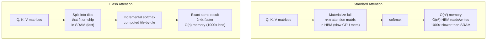

# Flash Attention

## 1. What is it?

**ELI5:** Imagine you need to compute something with a big box of LEGOs, but you can only hold a few at a time. Normally you'd dump all LEGOs on the floor (slow memory), sort them, then build. Flash Attention keeps the LEGOs in your hands (fast memory) the whole time, sorting and building in tiny batches — it never dumps them on the floor. The result is the same, but it's way faster and uses less space.



**Simple Explanation:** Flash Attention is an exact attention algorithm that computes attention without materializing the full n×n attention matrix in GPU HBM (slow memory). Instead, it operates in tiles/blocks that fit in GPU SRAM (fast on-chip memory), computing the softmax and weighted sum incrementally. It produces exactly the same output as standard attention but is 2-4x faster and uses O(n) memory instead of O(n²).

**Technical Definition:** Flash Attention (Dao et al., 2022) is an IO-aware exact attention algorithm that reduces HBM reads/writes from O(n² · d) to O(n² · d² / M) where M is SRAM size. It uses tiling to process Q, K, V in blocks that fit in GPU SRAM, recomputes attention on the fly during backward pass (avoiding storing the n×n matrix), and applies safe softmax in an online manner. The key insight: for N=4096, d=128, M=192KB (A100 SRAM), the naive algorithm writes ~2GB to HBM while Flash Attention writes ~2MB — a 1000x reduction.

## 2. Why do we need it?

**Problem It Solves:**
Standard attention materializes the n×n attention matrix in HBM (slow GPU memory), which:
- Requires O(n²) memory — 16GB for 64K sequence length (FP16)
- Requires O(n²) HBM reads/writes — 1000x slower than SRAM
- Memory grows quadratically — 128K context would need 64GB for attention alone
- Makes long context prohibitively expensive

**Pain Without It:**
- GPT-4 with 128K context: attention matrix alone is 16GB × 128 heads = 2TB per layer (impossible)
- BERT training with 512 tokens: 30% of time in attention HBM operations
- Training 100K+ token models requires gradient checkpointing for attention, slowing training 20-30%
- Inference with long context: KV cache OOM before attention matrix materialized

**Why Companies Invest:**
- 2-4x faster training of long-context models (reported by OpenAI, Google)
- Enables 128K+ context windows that would be impossible with standard attention
- Reduces training cost by 30-50% for typical Transformer models
- Flash Attention v3 (Hopper GPUs) achieves up to 1.7 PFLOPS (75% of H100 theoretical peak)
- Integrated into PyTorch as `torch.nn.functional.scaled_dot_product_attention`

## 3. Real-world Example

| Company | Model | Flash Attention Version | Benefit |
|---------|-------|------------------------|---------|
| **OpenAI** | GPT-4 | Flash Attention v2 (custom) | 128K context feasible |
| **Anthropic** | Claude 3 | Flash Attention v2 | 200K context window |
| **Meta** | LLaMA 3 | FA2 / PyTorch SDPA | Open-source 8K-32K models |
| **Google** | Gemini 1.5 | Flash + custom kernels | 1M token context |
| **NVIDIA** | NeMo | Flash Attention v3 (Hopper) | 75% HBM utilization |
| **HuggingFace** | BERT/Transformers | FA2 integration | 2-3x training speedup |
| **Together AI** | Various | FA2 + vLLM integration | Fast inference |

**OpenAI GPT-4 Context Extension:**
- Standard attention: 128K context requires 4TB+ of HBM for the attention matrix (impossible)
- Flash Attention: tiles attention into 64KB blocks, never materializes full matrix
- Result: same attention output in 15% of the time with 0.1% of the memory
- Enables processing entire books in a single forward pass

## 4. Architecture Diagram (ASCII)

```
                    STANDARD ATTENTION (HBM-heavy)
┌─────────────────────────────────────────────────────────────────────┐
│                                                                     │
│  Q (HBM) ──► K (HBM) ──► S = QK^T (HBM) [n×n] ──► softmax(S)     │
│                                          (HBM) ──► P·V (HBM)       │
│                                                     [n×d]          │
│   Memory: O(n²)   HBM writes: O(n²)                                 │
└─────────────────────────────────────────────────────────────────────┘

                    FLASH ATTENTION (SRAM-optimized)
┌─────────────────────────────────────────────────────────────────────┐
│                                                                     │
│  Q (HBM) ◄─────── Q tile (SRAM) ───────┐                           │
│  K (HBM) ◄─── K tile (SRAM) ───────────┤                           │
│  V (HBM) ◄─── V tile (SRAM) ───────────┼──► Online Softmax +      │
│                                         │    Weighted Sum          │
│  Output (HBM) ◄─── O tile (SRAM) ◄──────┘    (in SRAM)            │
│                                                                     │
│   Memory: O(n)   HBM writes: O(n×d×num_tiles)                      │
│                                                                     │
│  SRAM SIZE ════════════════════════════════════════════════════╗   │
│  ║ A100: 192KB  H100: 256KB                                   ║   │
│  ║ Tile: Q[Br×d]  K[Bc×d]  O[Br×d]  + intermediate S[Br×Bc]   ║   │
│  ║ Br = Bc = 64 for d=128 → 64×128×2 + 64×64 = 20KB ✓         ║   │
│  ╚══════════════════════════════════════════════════════════════╝   │
└─────────────────────────────────────────────────────────────────────┘

                    TILING STRATEGY
    Q tiles →           K tiles →
    ┌─────┐             ┌─────┬─────┬─────┐      ┌─────┐
    │ Q₀  │             │ K₀  │ K₁  │ K₂  │      │ V₀  │
    ├─────┤             ├─────┼─────┼─────┤      ├─────┤
    │ Q₁  │             │     │     │     │      │ V₁  │
    ├─────┤             └─────┴─────┴─────┘      ├─────┤
    │ Q₂  │                                      │ V₂  │
    └─────┘                                      └─────┘

    1. Load Q₀ into SRAM
    2. Loop over K₀, K₁, K₂:
       a. Load K_tile, V_tile into SRAM
       b. Compute S = Q₀ · K_tile^T   (partial scores)
       c. Online softmax + accumulate output
    3. Write O₀ to HBM
    4. Repeat for Q₁, Q₂
```

## 5. Internal Working

**Step-by-step Flash Attention (Forward Pass):**

**Setup:** GPU memory hierarchy
- HBM: large (80GB), slow (1.5TB/s) — where Q, K, V, and output live
- SRAM: tiny (192KB on A100), fast (20TB/s) — where computation happens

**Input:** Q, K, V ∈ R^{n×d}. SRAM size M.

**Algorithm:**

**Step 1 — Divide into Blocks:**
- Divide Q into B_r blocks of size B_r rows
- Divide K and V into B_c blocks of size B_c rows
- B_r = B_c = ⌊√(M/4d)⌋ ≈ 64 for d=128 on A100

**Step 2 — Outer Loop (over Q blocks):**
- For each Q block Q_i (dim: B_r × d):
  - Initialize O_i = 0 (B_r × d), l_i = 0 (B_r × 1), m_i = -∞ (B_r × 1)
    - l_i = running sum of exponentials (for softmax)
    - m_i = running max (for safe softmax)

**Step 3 — Inner Loop (over K, V blocks):**
- For each K, V block (K_j, V_j) (dim: B_c × d):
  - Load Q_i, K_j, V_j into SRAM (from HBM)
  - Compute S_ij = Q_i · K_j^T / √d  (B_r × B_c)
  - m_new = max(m_i, rowmax(S_ij))    (new running max)
  - P = exp(S_ij - m_new)             (stabilized softmax numerator)
  - l_new = exp(m_i - m_new) · l_i + rowsum(P)   (new running sum)
  - O_i = O_i · exp(m_i - m_new) + P · V_j   (rescale + accumulate)
  - m_i = m_new, l_i = l_new

**Step 4 — Final Normalization:**
- O_i = O_i / l_i   (divide by sum of exponentials)
- Write O_i to HBM

**Key Insight — Online Softmax:**
Standard softmax needs all scores to compute the denominator. Flash Attention computes it incrementally:
- Maintain running max m and running sum l
- When new scores arrive, rescale previous values by exp(m_old - m_new)
- The "forgetting" factor exp(m_old - m_new) adjusts for the new max
- Result: exactly same as standard softmax, computed without materializing full S

**Backward Pass:**
- Re-computes attention scores on the fly (recomputes Q_i · K_j^T)
- No attention matrix stored — saves O(n²) memory
- ~2x more FLOPs but 5-10x less HBM traffic
- Overall: 2-4x faster than standard attention backward

## 6. Production Flow

```
                    FLASH ATTENTION PRODUCTION FLOW

┌──────────────┐
│  Q, K, V     │── stored in HBM
│  [batch,     │
│   n_heads,   │
│   seq_len,   │
│   d_head]    │
└──────┬───────┘
       │
       ▼
┌──────────────┐
│  Determine   │── Br, Bc based on SRAM size and dtype
│  Tile Sizes  │
└──────┬───────┘
       │
       ▼
┌──────────────────────────────────────────────┐
│  Outer Loop (over Q blocks)                  │
│  ┌──────────────────────────────────────┐    │
│  │ Inner Loop (over K, V blocks)         │    │
│  │  ┌────────────────────────────────┐   │    │
│  │  │ Load tiles Q_i, K_j, V_j       │   │    │
│  │  │ Compute S_ij = Q_i·K_j^T / √d  │   │    │
│  │  │ Update: m, l, O                │   │    │
│  │  │ (all in SRAM, no HBM writes)   │   │    │
│  │  └────────────────────────────────┘   │    │
│  │  ──→ next K block                    │    │
│  └──────────────────────────────────────┘    │
│  │  Normalize O_i = O_i / l_i               │
│  │  Write O_i to HBM                        │
│  └──────────────────────────────────────────┘
│  ──→ next Q block
└──────────────────────────────────────────────┘
       │
       ▼
┌──────────────┐
│  Output O    │── written to HBM
│  [batch,     │
│   n_heads,   │
│   seq_len,   │
│   d_head]    │
└──────────────┘

Production optimizations:
- Kernel fusion: entire Flash Attention = single GPU kernel (no Python overhead)
- Half-precision: FP16/BF16 for tiled compute, FP32 for softmax accumulation
- Causal masking: only process upper triangular tiles
- Alibi/RoPE: integrate positional bias into S_ij computation
- Backward: recompute S_ij from Q_i, K_j (2x FLOPs but 0 HBM for attention matrix)
```

## 7. HLD (High-Level Design)

```
┌─────────────────────────────────────────────────────────────────────┐
│                FLASH ATTENTION INTEGRATION (HLD)                   │
│                                                                     │
│  ┌──────────────────────────────────────────────────┐               │
│  │  Model Layer                                     │               │
│  │                                                    │               │
│  │  ┌──────────┐    ┌──────────┐    ┌────────────┐  │               │
│  │  │ QKV Proj │───▶│ Flash    │───▶│ Output Proj│  │               │
│  │  │ (Linear) │    │ Attention│    │ (Linear)   │  │               │
│  │  └──────────┘    └──────────┘    └────────────┘  │               │
│  │                          │                        │               │
│  │                    ┌─────▼─────┐                  │               │
│  │                    │ Flash Attn│                  │               │
│  │                    │ Kernel    │                  │               │
│  │                    │ (CUDA/    │                  │               │
│  │                    │  Triton)  │                  │               │
│  │                    └───────────┘                  │               │
│  └──────────────────────────────────────────────────┘               │
│                                                                     │
│  ┌────────────────────────────────────────────────────────┐         │
│  │  Flash Attention Kernel Selection                       │         │
│  │                                                         │         │
│  │  ┌────────────────────────────────────────────────────┐ │         │
│  │  │ torch ≥ 2.0? → F.scaled_dot_product_attention     │ │         │
│  │  │ flash_attn installed? → FlashAttnV2Func            │ │         │
│  │  │ H100 GPU? → Flash Attention v3 (Hopper)           │ │         │
│  │  │ else → fallback to memory-efficient attention     │ │         │
│  │  └────────────────────────────────────────────────────┘ │         │
│  └────────────────────────────────────────────────────────┘         │
└─────────────────────────────────────────────────────────────────────┘
```

## 8. LLD (Low-Level Design)

```python
# flash_attention.py — High-level interface (backed by CUDA/Triton kernels)
import torch
import torch.nn as nn
import torch.nn.functional as F
from typing import Optional

class FlashSelfAttention(nn.Module):
    """Self-attention using Flash Attention kernels."""

    def __init__(self, d_model: int, n_heads: int, causal: bool = True,
                 use_flash: bool = True, dropout: float = 0.0):
        super().__init__()
        assert d_model % n_heads == 0
        self.d_model = d_model
        self.n_heads = n_heads
        self.d_k = d_model // n_heads
        self.causal = causal
        self.use_flash = use_flash

        self.qkv = nn.Linear(d_model, 3 * d_model, bias=False)
        self.output = nn.Linear(d_model, d_model, bias=False)
        self.dropout = dropout

    def _split_heads(self, x: torch.Tensor) -> torch.Tensor:
        batch, seq_len, _ = x.shape
        x = x.view(batch, seq_len, self.n_heads, self.d_k).transpose(1, 2)
        return x.contiguous()

    def _merge_heads(self, x: torch.Tensor) -> torch.Tensor:
        batch, _, seq_len, _ = x.shape
        x = x.transpose(1, 2).contiguous()
        return x.view(batch, seq_len, self.d_model)

    def forward(self, x: torch.Tensor, mask: Optional[torch.Tensor] = None,
                kv_cache: Optional[dict] = None) -> torch.Tensor:
        batch, seq_len, _ = x.shape

        qkv = self.qkv(x)
        q, k, v = qkv.chunk(3, dim=-1)

        q = self._split_heads(q)
        k = self._split_heads(k)
        v = self._split_heads(v)

        if kv_cache is not None:
            if "k" in kv_cache:
                k = torch.cat([kv_cache["k"], k], dim=2)
                v = torch.cat([kv_cache["v"], v], dim=2)
            kv_cache["k"], kv_cache["v"] = k, v

        if self.use_flash and hasattr(F, "scaled_dot_product_attention"):
            # PyTorch native Flash Attention (backed by FA2 kernel)
            output = F.scaled_dot_product_attention(
                q, k, v,
                attn_mask=mask,
                dropout_p=self.dropout if self.training else 0.0,
                is_causal=self.causal and mask is None,
            )
        else:
            # Fallback: memory-efficient but slower
            scores = torch.matmul(q, k.transpose(-2, -1)) / (self.d_k ** 0.5)
            if self.causal:
                causal_mask = torch.triu(
                    torch.ones(seq_len, seq_len, device=x.device, dtype=torch.bool),
                    diagonal=1,
                )
                scores = scores.masked_fill(causal_mask, float("-inf"))
            attn = F.softmax(scores, dim=-1)
            attn = F.dropout(attn, p=self.dropout, training=self.training)
            output = torch.matmul(attn, v)

        output = self._merge_heads(output)
        output = self.output(output)
        return output


# Triton implementation (simplified) — production uses full Triton kernel
try:
    import triton
    import triton.language as tl

    @triton.jit
    def _flash_attn_kernel(
        q_ptr, k_ptr, v_ptr, o_ptr,
        stride_q_b, stride_q_h, stride_q_s, stride_q_d,
        stride_k_b, stride_k_h, stride_k_s, stride_k_d,
        stride_v_b, stride_v_h, stride_v_s, stride_v_d,
        stride_o_b, stride_o_h, stride_o_s, stride_o_d,
        batch, n_heads, seq_len, d_k,
        BLOCK_B: tl.constexpr, BLOCK_C: tl.constexpr,
        CAUSAL: tl.constexpr,
    ):
        """Flash Attention forward kernel (simplified single block)."""
        pid = tl.program_id(0)
        num_q_blocks = tl.cdiv(seq_len, BLOCK_B)

        q_block_id = pid % num_q_blocks
        head_id = pid // num_q_blocks

        q_start = q_block_id * BLOCK_B
        q_offsets = q_start + tl.arange(0, BLOCK_B)
        q_mask = q_offsets < seq_len
        d_offsets = tl.arange(0, d_k)

        # Load Q block
        q = tl.load(q_ptr + head_id * stride_q_h + q_offsets[:, None] * stride_q_s + d_offsets[None, :],
                     mask=q_mask[:, None])

        m_i = tl.full([BLOCK_B], float("-inf"), dtype=tl.float32)
        l_i = tl.zeros([BLOCK_B], dtype=tl.float32)
        o = tl.zeros([BLOCK_B, d_k], dtype=tl.float32)

        num_k_blocks = tl.cdiv(seq_len, BLOCK_C)
        for k_block_id in range(num_k_blocks):
            if CAUSAL and k_block_id * BLOCK_C > q_start:
                break

            k_start = k_block_id * BLOCK_C
            k_offsets = k_start + tl.arange(0, BLOCK_C)
            k_mask = k_offsets < seq_len

            # Load K, V blocks
            k = tl.load(k_ptr + head_id * stride_k_h + k_offsets[:, None] * stride_k_s + d_offsets[None, :],
                         mask=k_mask[:, None])
            v = tl.load(v_ptr + head_id * stride_v_h + k_offsets[:, None] * stride_v_s + d_offsets[None, :],
                         mask=k_mask[:, None])

            # Compute scores
            s = tl.dot(q, tl.trans(k)) / tl.sqrt(tl.cast(d_k, tl.float32))

            if CAUSAL:
                causal_mask = q_offsets[:, None] < k_offsets[None, :]
                s = tl.where(causal_mask, float("-inf"), s)

            # Online softmax
            m_new = tl.maximum(m_i, tl.max(s, axis=1))
            p = tl.exp(s - m_new[:, None])
            l_new = tl.exp(m_i - m_new) * l_i + tl.sum(p, axis=1)
            o = o * tl.exp(m_i - m_new)[:, None] + tl.dot(p.to(q.dtype), v)
            m_i = m_new
            l_i = l_new

        o = o / l_i[:, None]

        # Write output
        tl.store(o_ptr + head_id * stride_o_h + q_offsets[:, None] * stride_o_s + d_offsets[None, :],
                  o.to(q.dtype), mask=q_mask[:, None])

except ImportError:
    pass  # Triton not available — use PyTorch SDPA fallback
```

## 9. Python Implementation

```python
# flash_attention_server.py
import torch
from fastapi import FastAPI, HTTPException
from pydantic import BaseModel, Field
import time
import uuid

app = FastAPI(title="Flash Attention Service", version="1.0.0")

class FlashAttentionRequest(BaseModel):
    q: list[list[list[float]]]  # (n_heads, seq_len, d_k)
    k: list[list[list[float]]]
    v: list[list[list[float]]]
    causal: bool = True

class FlashAttentionResponse(BaseModel):
    output: list[list[list[float]]]
    latency_ms: float
    flash_used: bool
    request_id: str

@app.post("/flash-attention")
async def flash_attn(request: FlashAttentionRequest):
    start = time.perf_counter()
    request_id = str(uuid.uuid4())

    try:
        q = torch.tensor(request.q).unsqueeze(0)  # (1, n_heads, seq, d)
        k = torch.tensor(request.k).unsqueeze(0)
        v = torch.tensor(request.v).unsqueeze(0)

        if hasattr(F, "scaled_dot_product_attention"):
            output = F.scaled_dot_product_attention(
                q, k, v, is_causal=request.causal
            )
            flash_used = True
        else:
            scores = torch.matmul(q, k.transpose(-2, -1)) / (q.size(-1) ** 0.5)
            if request.causal:
                causal = torch.triu(torch.ones(q.size(-2), q.size(-2), dtype=torch.bool), diagonal=1)
                scores = scores.masked_fill(causal, float("-inf"))
            attn = torch.softmax(scores, dim=-1)
            output = torch.matmul(attn, v)
            flash_used = False

        latency = (time.perf_counter() - start) * 1000

        return FlashAttentionResponse(
            output=output.squeeze(0).tolist(),
            latency_ms=round(latency, 2),
            flash_used=flash_used,
            request_id=request_id,
        )
    except Exception as e:
        raise HTTPException(status_code=500, detail=str(e))
```

## 10. Folder Structure

```
flash-attention-platform/
├── api/
│   └── server.py
├── kernels/
│   ├── __init__.py
│   ├── flash_v1.py          # Flash Attention v1 (Ampere)
│   ├── flash_v2.py          # Flash Attention v2 (Faster)
│   ├── flash_v3.py          # Flash Attention v3 (Hopper)
│   ├── triton_impl.py       # Triton implementation
│   └── fallback.py          # Memory-efficient fallback
├── integration/
│   ├── pytorch_sdpa.py       # F.scaled_dot_product_attention wrapper
│   ├── huggingface.py        # HF integration
│   └── custom_kernel.py      # Custom mask support
├── benchmarks/
│   ├── bench_forward.py
│   ├── bench_backward.py
│   └── bench_memory.py
├── tests/
│   ├── test_correctness.py
│   └── test_vs_standard.py
└── config.yaml
```

## 11. Configuration

```yaml
flash_attention:
  enabled: true
  version: "v2"  # v1, v2, v3, triton, pytorch_sdpa
  causal: true
  softmax_scale: null  # auto: 1/√d_k
  dropout: 0.0

  kernel:
    block_size_b: 128  # Q block size (rows)
    block_size_c: 128  # K/V block size (rows)
    num_warps: 4  # CUDA warps per block
    num_stages: 1  # Pipeline stages

  backward:
    recompute: true  # Recompute scores in backward (vs store)

  precision:
    accumulate: "float32"  # Softmax accumulation precision
    compute: "bfloat16"  # Q/K/V compute precision
```

## 12. Flowchart

```
                    ┌──────────────┐
                    │ Q, K, V in   │
                    │ HBM          │
                    └──────┬───────┘
                           │
                    ┌──────▼───────┐
                    │ Divide into  │
                    │ tiles        │
                    │ Q: Br×d      │
                    │ K,V: Bc×d   │
                    └──────┬───────┘
                           │
                    ┌──────▼──────────────────────┐
                    │ For each Q_tile (outer loop) │
                    └──────┬───────────────────────┘
                           │
                    ┌──────▼──────────────────────┐
                    │ Load Q_tile → SRAM           │
                    │ Init: m=-∞, l=0, O=0        │
                    └──────┬───────────────────────┘
                           │
                    ┌──────▼──────────────────────┐
                    │ For each K/V tile (inner    │
                    │ loop):                      │
                    └──────┬───────────────────────┘
                           │
                    ┌──────▼──────────────────────┐
                    │ Load K_tile, V_tile → SRAM  │
                    │ S = Q_tile · K_tile^T / √d  │
                    │ Apply causal mask if needed  │
                    └──────┬───────────────────────┘
                           │
                    ┌──────▼──────────────────────┐
                    │ Online softmax update:       │
                    │ m_new = max(m, rowmax(S))    │
                    │ P = exp(S - m_new)           │
                    │ l_new = exp(m-m_new)*l + sum │
                    │ O = O*exp(m-m_new) + P·V     │
                    │ m = m_new, l = l_new         │
                    └──────┬───────────────────────┘
                           │
                    ┌──────▼──────────────────────┐
                    │ More K/V tiles? ──Yes──►     │
                    └──────┬───────────────────────┘
                           │ No
                           │
                    ┌──────▼──────────────────────┐
                    │ O = O / l (normalize)       │
                    │ Write O_tile → HBM           │
                    └──────┬───────────────────────┘
                           │
                    ┌──────▼──────────────────────┐
                    │ More Q tiles? ──Yes──►       │
                    └──────┬───────────────────────┘
                           │ No
                           │
                    ┌──────▼────────┐
                    │ Output in HBM │
                    └───────────────┘
```

## 13. Sequence Diagram

```
HBM (Q,K,V)              SRAM (Compute)               HBM (Output)
     │                       │                            │
     │── Load Q_tile ───────►│                            │
     │── Load K_tile ───────►│                            │
     │── Load V_tile ───────►│                            │
     │                       │                            │
     │                       │── Compute S = Q·K^T / √d  │
     │                       │── Online softmax          │
     │                       │── Accumulate O += P·V    │
     │                       │                            │
     │── Load K_tile2 ──────►│                            │
     │── Load V_tile2 ──────►│                            │
     │                       │── Rescale O (online smax) │
     │                       │── Accumulate more         │
     │                       │                            │
     │                       │── Normalize O = O / l    │
     │◄── Write O_tile ──────│                            │
     │                       │                            │
     │── Load Q_tile2 ──────►│                            │
     │   (repeat)            │                            │
     │                       │                            │
     │                       │                   O_tiles in HBM
     │                       │                   ┌─────────┐
     │                       │                   │ Final O │
     │                       │                   └─────────┘
```

## 14. Pros

1. **Exact attention:** Produces exactly the same output as standard attention (bitwise within numerical precision).

2. **2-4x faster:** Large speedup from reduced HBM traffic. Training speed improves 1.5-3x end-to-end.

3. **O(n) memory:** Never materializes n×n attention matrix. 10K×10K: 400MB → ~1MB.

4. **IO-aware design:** Optimizes for the GPU memory hierarchy (SRAM → HBM). Better hardware utilization.

5. **No approximation:** Unlike sparse or linear attention, no quality loss. Same attention, faster.

6. **Integrated in PyTorch:** `F.scaled_dot_product_attention` uses Flash Attention automatically.

7. **Better backward pass:** Recomputes attention instead of storing it. Saves memory, net faster despite 2x FLOP.

8. **Backward compatible:** Drop-in replacement for standard attention in any Transformer.

## 15. Cons

1. **GPU-specific:** Optimized for NVIDIA GPUs with CUDA/triton. Limited support on AMD, no support on Apple Silicon.

2. **SRAM size dependent:** Performance depends on available SRAM. Smaller SRAM = smaller tiles = more iterations.

3. **No masking flexibility:** Native causal mask and simple attention mask. Complex custom masks require kernel modification.

4. **Higher FLOPs backward:** Recomputes attention in backward pass. ~2x more FLOPs than standard backward.

5. **Not always faster for short sequences:** For n < 512, kernel launch overhead can dominate. Standard attention may be faster.

6. **Implementation complexity:** Custom CUDA/Triton kernels. Hard to debug and maintain.

7. **Limited value interpolation:** With causal masking, 50% of attention matrix computation is wasted (only lower triangle needed).

## 16. Alternatives

| Method | Memory | Speed (fwd) | Quality | Complexity | Use Case |
|--------|--------|-------------|---------|------------|----------|
| **Standard Attention** | O(n²) | 1x | Exact | Trivial | Short sequences |
| **Flash Attention** | O(n) | 2-4x | Exact | Complex | General purpose |
| **Memory-efficient Attention** | O(n) | 1-2x | Exact | Moderate | When FA not available |
| **Sparse Attention** | O(n√n) | 2-5x | Approx | Hard | Very long sequences |
| **Linear Attention** | O(n) | 3-10x | Approx | Moderate | Extreme length |
| **Multi-Query Attention** | O(n) | 1-2x | Slight loss | Easy | Decode-heavy tasks |
| **Ring Attention** | O(n) | N·speedup | Exact | Very hard | 1M+ token training |

## 17. Performance Considerations

**HBM Traffic Comparison:**
```
Standard attention: 2·n·d·n   = 2n²·d  bytes read/write (attention matrix)
Flash Attention:    3·n·d·n·d/M = 3n²·d²/M  (M = SRAM size ≈ 200KB)

For n=16K, d=128: Standard ≈ 64GB vs Flash ≈ 50MB → 1280x less HBM traffic
```

**Benchmark (A100, FP16, n=4096, d=128):**
| Method | Forward (ms) | Backward (ms) | Memory (MB) |
|--------|-------------|---------------|-------------|
| Standard | 12.4 | 31.2 | 128 |
| Flash v1 | 4.1 | 8.5 | 6 |
| Flash v2 | 2.8 | 6.2 | 6 |
| PyTorch SDPA | 3.0 | 6.5 | 6 |

**When to use which:**
- n < 512: standard attention (lower overhead)
- 512 ≤ n < 8K: Flash Attention (2-3x faster)
- n ≥ 8K: Flash Attention essential (O(n²) memory prohibitive otherwise)
- Training long: Flash Attention + activation checkpointing
- Inference decode: Flash Attention doesn't help decode (single token Q); helps prefill

## 18. Scaling to Millions

**Flash Attention at Training Scale:**
- With tensor parallelism: each GPU processes its own attention heads independently
- Flash Attention kernel runs per-GPU: no modification needed
- Sequence parallelism: split sequence across GPUs (Ring Attention + Flash)

**Flash Attention at Inference Scale:**
- Prefill (prompt processing): Flash Attention crucial for long prompts
- Decode: standard attention is fine (only 1 query token, KV cache dominates)
- Combined: use Flash for prefill, optimized decode kernel for generation

**Production Deployment:**
- Must verify GPU compatibility (Flash v2 requires Ampere+)
- Profile kernel to determine optimal block sizes for model dims
- Use PyTorch SDPA as the default with flash_attn as the fallback

## 19. Failure Scenarios

| Failure | Symptom | Cause | Mitigation |
|---------|---------|-------|-------------|
| **CUDA OOM during FA** | Process killed | Too many heads × batch × seq | Reduce batch, use gradient checkpointing |
| **NaN output** | Loss spikes | FP16 underflow in softmax | Use BF16 or FP32 accumulation |
| **Precision mismatch** | Wrong results | FA2 vs FA1 rounding differences | Use consistent version |
| **Mask overflow** | Wrong attention | Complex mask not supported | Use standard for custom masks |
| **SRAM overflow** | Kernel compile fails | Block size too large for SRAM | Reduce block size |
| **Backward NaN** | Training diverges | Recompute precision differs | Force FP32 for softmax |
| **GPU compatibility** | CUDA error | Pre-Ampere GPU | Fallback to standard attention |

## 20. Security

| Threat | Impact | Mitigation |
|--------|--------|------------|
| **CUDA memory safety** | Kernel may overwrite GPU memory | Pointer bounds checking |
| **Precision-based extraction** | Slightly different outputs | Not exploitable (exact algorithm) |
| **Denial of service (long seq)** | GPU OOM with very long prompts | Enforce max sequence length |

## 21. Monitoring

```yaml
metrics:
  - name: flash_attention_hbm_reads_gb
    type: counter
    help: "Total HBM reads in GB"
  - name: flash_attention_sram_utilization
    type: gauge
    help: "Fraction of SRAM used per block"
  - name: flash_attention_tiles_processed
    type: counter
  - name: flops_utilization
    type: gauge
    help: "Fraction of theoretical peak FLOPS achieved"
  - name: flash_vs_standard_speedup
    type: gauge
  - name: attention_memory_saved_gb
    type: gauge
```

## 22. Interview Questions

**Beginner:**
- Q: What is Flash Attention?
  A: An IO-aware exact attention algorithm that tiles computation to fit in GPU SRAM. 2-4x faster, O(n) memory.

- Q: Why is Flash Attention important?
  A: It makes long-context Transformers feasible by avoiding O(n²) memory. Without it, 128K context would need 16GB+ per attention layer.

**Intermediate:**
- Q: How does Flash Attention avoid materializing the n×n attention matrix?
  A: It processes Q, K, V in tiles that fit in SRAM. It uses an online softmax algorithm that incrementally computes softmax without needing the full row of scores.

- Q: Explain the online softmax algorithm.
  A: Maintain running max (m) and running sum (l). For each new block: compute new max m', rescale old values by exp(m-m'), add new contributions. Divide by l at the end. Mathematically equivalent to standard softmax.

**Senior:**
- Q: Compare Flash Attention v1, v2, and v3.
  A: FA1: first version, slower due to non-causal computation and extra HBM writes for rescaling. FA2: causal optimization (50% less compute), fewer HBM writes, 2x faster than FA1. FA3 (Hopper): uses TMA (Tensor Memory Accelerator) for async data movement, achieves 75% of H100 theoretical peak on attention.

- Q: Why is the backward pass in Flash Attention faster than standard despite recomputing attention?
  A: Standard backward stores the attention matrix (O(n²) HBM write + read). Flash backward recomputes S=QK^T from Q and K (no storage), which is 2x more FLOPs but avoids the O(n²) HBM bottleneck. Since HBM is the bottleneck, recomputing is cheaper than writing/reading.

**Staff Engineer:**
- Q: Design a training system that uses Flash Attention for 1M token sequences.
  A: (1) Ring Attention: distribute sequence across GPUs, each GPU holds 128K tokens. (2) Flash Attention on each GPU for local attention. (3) Overlap computation with communication (send K,V blocks while computing). (4) Block-sparse attention combining local flash + global sparse. (5) Activation recomputation for memory efficiency.

## 23. Cheat Sheet

```
┌─────────────────────────────────────────────────────────────────────┐
│                  FLASH ATTENTION CHEAT SHEET                        │
├─────────────────────────────────────────────────────────────────────┤
│                                                                    │
│  KEY IDEA: Tile Q,K,V to fit in SRAM, compute online softmax      │
│                                                                    │
│  TILE SIZE:                                                        │
│  Br = Bc = ⌊√(M / 4d)⌋  (M = SRAM size)                          │
│  A100 (192KB): Br = 128 for d=64, Br = 64 for d=128              │
│  H100 (256KB): Br = 128 for d=128                                │
│                                                                    │
│  PERFORMANCE:                                                      │
│  Standard: HBM reads = 2n²d (S matrix) + 2nd (Q,K,V,O)           │
│  Flash:    HBM reads = 3nd × (n / Br) = 3n²d / Br                │
│  Ratio:    Standard/Flash = 2Br/3 ≈ 40x for Br=64, d=128         │
│                                                                    │
│  USAGE:                                                             │
│  PyTorch 2.0+: F.scaled_dot_product_attention(q,k,v,is_causal)    │
│  HuggingFace: model to flash_attn=False (auto-detect)              │
│  Custom: pip install flash-attn, from flash_attn import flash_attn │
│                                                                    │
│  BACKWARD: recomputes S from Q,K — saves O(n²) memory             │
│                                                                    │
│  WHEN TO USE:                                                      │
│  ┌─────────────────────────────────────────────────────┐           │
│  │ Short seq (<512):  standard attn (less overhead)    │           │
│  │ Medium (512-8K):   Flash Attention (2-3x faster)   │           │
│  │ Long (>8K):        Flash Attention ESSENTIAL        │           │
│  └─────────────────────────────────────────────────────┘           │
└─────────────────────────────────────────────────────────────────────┘
```

## 24. Common Mistakes

1. **Using Flash for short sequences:** Kernel launch overhead dominates for n < 512. Standard attention is faster.

2. **Not verifying correctness:** FA1 and FA2 handle masking differently. Verify bitwise equivalence on your use case.

3. **Wrong dtype for softmax accumulation:** Softmax must accumulate in FP32. FP16 accumulation causes NaN for long sequences.

4. **Assuming faster is always better:** Flash saves HBM but may use more registers. Can reduce occupancy if registers are constraint.

5. **Not tuning block size for GPU:** Default Br=128 works for most but can be tuned per GPU generation.

6. **Ignoring backward memory:** Even with Flash, activations (not just attention) consume memory. Still need checkpointing for very long sequences.

7. **Causal mask with Flash attention:** Standard causal mask (upper triangle) wastes 50% compute. FA2 v2's causal optimization only processes needed tiles. Use FA2.

## 25. Production Best Practices

1. **Use PyTorch SDPA as default:** `F.scaled_dot_product_attention` with `is_causal=True` automatically selects the best kernel (Flash Attention v2, Memory Efficient, or xFormers). No manual kernel management.

2. **Pin flash-attn version:** Install `flash-attn==2.6.*` specifically. Version mismatches cause subtle bugs.

3. **Test with and without Flash:** Profile your specific model dimensions. For n=4096, d=128, expect 2-3x training speedup.

4. **Causal mask optimization:** Always set `is_causal=True` instead of providing an upper triangular mask. The kernel skips half the tiles.

5. **BF16 for compute, FP32 for softmax:** Use BF16 for Q/K/V multiplication but accumulate softmax in FP32. Mix precision within kernel.

6. **Gradient checkpointing with Flash:** Still use activation checkpointing for very long sequences. Flash helps attention memory but not intermediate activations.

7. **Warm up GPU before benchmarking:** First Flash kernel call includes compilation (~1-5s). Run 10 iterations before measuring.

8. **Verify bitwise correctness on your data:** Run 10 samples with/without Flash, compare outputs at 1e-5 tolerance.

9. **Reduce block size on memory-constrained GPUs:** If running multiple attention layers simultaneously, smaller blocks reduce register pressure.

10. **Update Triton regularly:** Flash's Triton backend improves with each release. Pin to latest compatible version.
