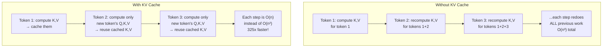

# KV Cache

## 1. What is it?

**ELI5:** Imagine you're writing a story one word at a time. Every time you add a new word, you need to remember what you wrote before. Before KV cache, you'd re-read the entire story from scratch for each new word. With KV cache, you keep a running notebook of what matters — when you add "the," you only figure out what's new, without re-reading everything.



**Simple Explanation:** KV Cache stores the Key and Value tensors from previous tokens in the autoregressive generation process. Instead of recomputing attention for the entire sequence at each step, we cache the K and V matrices from earlier tokens and only compute Q, K, V for the new token. This reduces the per-step computation from O(n²) to O(n) for the attention matrix size.

**Technical Definition:** In autoregressive Transformer decoding, at time step t, the model computes attention over all t tokens seen so far. Without caching, this requires O(t² · d) computation. KV cache stores the key and value projections from previous steps in GPU memory, so only the newest token's projections need computation. The attention computation becomes O(t · d) per step instead of O(t² · d), but memory grows as O(t · d · n_layers). For a 70B parameter model with 4096 token context, the KV cache requires ~40GB of GPU memory.


*Comparison of KV cache usage across different attention variants. Multi-head attention (MHA) uses the most cache, while grouped query attention (GQA), multi-query attention (MQA), and multi-head latent attention (MLA) progressively reduce it.*

## 2. Why do we need it?

**Problem It Solves:**
Autoregressive generation is sequential — you generate one token at a time, and each token needs to attend to all previous tokens. Without KV cache:
- Step 1: Process 1 token, compute 1×1 attention
- Step 2: Process 2 tokens, compute 2×2 attention (recompute first token's K,V)
- Step t: Process t tokens, compute t×t attention (recompute all previous K,V)
Total compute: O(n³) instead of O(n²)

**Pain Without It:**
- Generating 4096 tokens without cache: 4096 × (1² + 2² + ... + 4096²) / 2 ≈ 45T FLOPs
- With KV cache: 4096 × (1 + 2 + ... + 4096) × d ≈ 137B FLOPs (325x reduction)
- Without cache, GPT-4 would generate 1 token every 30+ seconds
- Real-time interaction would be impossible

**Why Companies Invest:**
- 10-100x inference speedup over naive implementation
- Enables real-time streaming chat applications (ChatGPT, Claude, Gemini)
- Reduces GPU cost per token by ~90%
- Makes long-context applications (128K tokens) feasible

## 3. Real-world Example

| Company | Model | KV Cache Size (per request) | Benefit |
|---------|-------|----------------------------|---------|
| **OpenAI** | GPT-4 | ~128GB for 128K context (FP16) | Enables 128K context window |
| **Anthropic** | Claude 3 | ~200GB for 200K context | Long document analysis |
| **Google** | Gemini 1.5 | >1TB for 1M context (sparse caching) | Million-token context |
| **Meta** | LLaMA 3 405B | ~80GB for 32K context | Open-source long context |
| **Mistral** | Mixtral 8x7B | ~8GB for 32K context | Efficient long-context serving |

**OpenAI GPT-4 KV Cache Challenge:**
- 1.8T parameters, 16 experts, 32K context (GPT-4 Turbo: 128K)
- KV cache per token: 2 × n_layers × d_model × 2 bytes (FP16)
- ~128 layers × 8192 dim × 2 bytes × 2 (K and V) = ~4MB per token
- 128K tokens × 4MB = 512GB per request
- Solution: KV cache quantization (FP8), PagedAttention, prefix caching

## 4. Architecture Diagram (ASCII)

```
                    KV CACHE IN AUTOREGRESSIVE DECODING

                    │        │        │         │
                    ▼        ▼        ▼         ▼
┌─────────┐   ┌─────────┐   ┌─────────┐   ┌─────────┐   ┌─────────┐
│ Token 1 │   │ Token 2 │   │ Token 3 │   │ Token 4 │   │ Token 5 │
└────┬────┘   └────┬────┘   └────┬────┘   └────┬────┘   └────┬────┘
     │              │             │             │              │
     ▼              ▼             ▼             ▼              ▼
┌───────────────────────────────────────────────────────────────┐
│                       KV CACHE (GPU Memory)                    │
│                                                                │
│  Layer 1: K: [k₁]      K: [k₁, k₂]    K: [k₁,k₂,k₃]         │
│           V: [v₁]      V: [v₁, v₂]    V: [v₁,v₂,v₃]         │
│  Layer 2: K: [k₁]      K: [k₁, k₂]    K: [k₁,k₂,k₃]         │
│           V: [v₁]      V: [v₁, v₂]    V: [v₁,v₂,v₃]         │
│  ...                  Appended each step                      │
│  Layer N: K: [k₁]      K: [k₁, k₂]    K: [k₁,k₂,k₃]         │
│           V: [v₁]      V: [v₁, v₂]    V: [v₁,v₂,v₃]         │
│                                                                │
└───────────────────────────────────────────────────────────────┘

    WITHOUT KV CACHE:                     WITH KV CACHE:
    ┌─────────────────┐                  ┌─────────────────┐
    │ Step 1: Q₁K₁V₁   │                  │ Step 1: Q₁K₁V₁   │
    │ Step 2: Q₁K₁V₁   │→ recomputed      │ Step 2: Cache K₁V₁│
    │         Q₂K₂V₂   │  from scratch    │         Q₂K₂V₂   │→ only Q₂, K₂, V₂
    │ Step 3: Q₁K₁V₁   │→ recomputed      │ Step 3: Cache K₁V₁│  computed
    │         Q₂K₂V₂   │  again           │         K₂V₂     │
    │         Q₃K₃V₃   │                  │         Q₃K₃V₃   │
    └─────────────────┘                  └─────────────────┘
```

## 5. Internal Working

**Step-by-step KV Cache Management:**

**Step 1 — Prefill (Prompt Processing):**
- Process all prompt tokens in parallel (no cache yet)
- For each layer, compute K_prompt, V_prompt for all prompt positions
- Store K_prompt, V_prompt in cache
- Shape: [n_layers, 2, batch, n_kv_heads, prompt_len, d_k]

**Step 2 — First Token Generation:**
- Compute Q for the new position (last token's representation enters attention)
- Retrieve cached K_prompt, V_prompt
- Attention: Q_new × K_cache^T (all positions)
- Generate first new token

**Step 3 — Append to Cache:**
- Compute K_new, V_new for the generated token (only one token's worth)
- Append K_new to K_cache: K_cache = [K_cache, K_new]
- Append V_new to V_cache: V_cache = [V_cache, V_new]

**Step 4 — Repeat:**
- For each subsequent token:
  1. Compute Q, K, V for new token only
  2. Append K, V to cache
  3. Attention: Q_new × K_cache^T (grows by 1 each step)

**Memory Formula:**
```
KV Cache size = 2 × n_layers × n_kv_heads × seq_len × d_k × bytes_per_elem

Example (LLaMA 2 70B, 4096 tokens, FP16):
  = 2 × 80 × 8 × 4096 × 128 × 2
  = 1.34B elements × 2 bytes = 2.68 GB per K or V
  = ~40 GB total KV cache per request
```

## 6. Production Flow

```
┌─────────────┐    ┌─────────────┐    ┌─────────────┐
│ Prefill     │───▶│ KV Cache    │───▶│ Decode (loop)│
│ (Prompt     │    │ Initialize  │    │             │
│  processing)│    │ K_cache,    │    │ For t in    │
│ Compute all │    │ V_cache from│    │ max_tokens: │
│ K,V for     │    │ prompt      │    │  Q = W_q·x_t│
│ prompt      │    └─────────────┘    │  K = W_k·x_t│
└─────────────┘                       │  V = W_v·x_t│
                                      │  K_cache⫽K  │
     ┌─────────────┐                  │  V_cache⫽V  │
     │ KV Cache    │◄─────────────────│  attn(Q,K_   │
     │ (GPU)       │                  │      cache,V_│
     │ Layer 0 K,V │                  │      cache)  │
     │ Layer 1 K,V │                  │  x_{t+1} =  │
     │ ...         │                  │    sample(   │
     │ Layer N K,V │                  │    logits)   │
     └─────────────┘                  └─────────────┘

Production considerations:
- Memory allocation: pre-allocate max cache at start to avoid fragmentation
- Cache eviction: LRU policy when GPU memory full
- Cache compression: FP8/INT4 quantization of cache entries
- Prefix caching: share KV cache across requests with same prompt prefix
- PagedAttention: virtual memory for KV cache (vLLM)
```

## 7. HLD (High-Level Design)

```
┌─────────────────────────────────────────────────────────────────────┐
│                    KV CACHE MANAGEMENT SYSTEM                       │
│                                                                     │
│  ┌──────────────┐  ┌──────────────┐  ┌──────────────┐              │
│  │ Request      │→│ Memory       │→│ KV Cache     │              │
│  │ Scheduler    │  │ Allocator    │  │ Store        │              │
│  └──────────────┘  └──────────────┘  └──────┬───────┘              │
│                                              │                       │
│  ┌──────────────┐  ┌──────────────┐  ┌──────▼───────┐              │
│  │ Prefix Cache │→│ Cache        │→│ GPU Memory   │              │
│  │ (System      │  │ Eviction     │  │ Pool         │              │
│  │  Prompts)    │  │ (LRU/LFU)    │  └──────────────┘              │
│  └──────────────┘  └──────────────┘                                 │
│                                                                     │
│  ┌──────────────┐  ┌──────────────┐                                │
│  │ Cache        │→│ Offload      │  CPU-side swap storage          │
│  │ Compression  │  │ Engine       │                                │
│  │ (FP8/INT4)   │  │ (CPU DRAM)   │                                │
│  └──────────────┘  └──────────────┘                                │
│                                                                     │
│  Components:                                                        │
│  - MemoryAllocator: PagedAttention-style virtual memory            │
│  - CacheEvictor: LRU priority queue per request                    │
│  - PrefixCache: Hash-based prefix deduplication                    │
│  - Compressor: FP8/INT4 quantization with per-token scaling        │
│  - OffloadEngine: PCIe transfer of cold cache entries to CPU       │
└─────────────────────────────────────────────────────────────────────┘
```

## 8. LLD (Low-Level Design)

```python
# kv_cache.py — Production-grade KV Cache management
from typing import Optional, Protocol
import torch
from dataclasses import dataclass

@dataclass
class KVCacheConfig:
    max_batch_size: int = 64
    max_seq_len: int = 8192
    n_layers: int = 80
    n_kv_heads: int = 8
    d_k: int = 128
    dtype: torch.dtype = torch.float16
    use_paged: bool = True
    block_size: int = 16
    use_fp8: bool = False
    offload_to_cpu: bool = False

class KVCacheBase(Protocol):
    """Protocol for KV cache implementations."""
    def store(self, layer: int, k: torch.Tensor, v: torch.Tensor, batch_idx: int, seq_start: int):
        ...
    def fetch(self, layer: int, batch_idx: int, seq_len: int) -> tuple[torch.Tensor, torch.Tensor]:
        ...
    def clear(self, batch_idx: int = None):
        ...

class ContiguousKVCache(KVCacheBase):
    """Contiguous KV cache — pre-allocated tensor, append-only."""

    def __init__(self, config: KVCacheConfig):
        self.config = config
        # Pre-allocate maximum cache size
        shape = (config.max_batch_size, config.n_layers, 2,
                 config.max_seq_len, config.n_kv_heads, config.d_k)
        self.cache = torch.zeros(shape, dtype=config.dtype)
        self.lengths = torch.zeros(config.max_batch_size, dtype=torch.long)

    def store(self, layer: int, k: torch.Tensor, v: torch.Tensor,
              batch_idx: int, seq_start: Optional[int] = None):
        seq_len = k.size(-2)
        pos = self.lengths[batch_idx] if seq_start is None else seq_start
        self.cache[batch_idx, layer, 0, pos:pos+seq_len] = k
        self.cache[batch_idx, layer, 1, pos:pos+seq_len] = v
        if seq_start is None:
            self.lengths[batch_idx] += seq_len

    def fetch(self, layer: int, batch_idx: int, seq_len: int) -> tuple:
        actual_len = min(self.lengths[batch_idx], seq_len)
        k = self.cache[batch_idx, layer, 0, :actual_len]
        v = self.cache[batch_idx, layer, 1, :actual_len]
        return k, v

    def clear(self, batch_idx: Optional[int] = None):
        if batch_idx is not None:
            self.lengths[batch_idx] = 0
        else:
            self.lengths.zero_()


class PagedKVCache:
    """PagedAttention-style KV cache — virtual memory blocks."""

    def __init__(self, config: KVCacheConfig):
        self.config = config
        self.block_size = config.block_size
        num_blocks = (config.max_seq_len * config.max_batch_size) // config.block_size

        # Physical block storage
        self.k_blocks = torch.zeros(
            (num_blocks, config.n_layers, config.n_kv_heads,
             config.block_size, config.d_k), dtype=config.dtype
        )
        self.v_blocks = torch.zeros_like(self.k_blocks)

        # Block table: maps logical → physical blocks per request
        self.block_table: dict[int, list[int]] = {}  # request_id → [block_ids]
        self.free_blocks: list[int] = list(range(num_blocks))
        self.allocated = torch.zeros(num_blocks, dtype=torch.bool)

    def allocate(self, request_id: int, num_blocks: int) -> list[int]:
        blocks = self.free_blocks[:num_blocks]
        self.free_blocks = self.free_blocks[num_blocks:]
        for b in blocks:
            self.allocated[b] = True
        self.block_table[request_id] = blocks
        return blocks

    def store(self, layer: int, k: torch.Tensor, v: torch.Tensor,
              request_id: int, block_id: int, block_offset: int):
        physical_block = self.block_table[request_id][block_id]
        seq_len = k.size(-2)
        self.k_blocks[physical_block, layer, :, :seq_len] = k
        self.v_blocks[physical_block, layer, :, :seq_len] = v

    def fetch(self, layer: int, request_id: int, num_tokens: int) -> tuple:
        blocks = self.block_table.get(request_id, [])
        k_list, v_list = [], []
        for b in blocks:
            k_list.append(self.k_blocks[b, layer])
            v_list.append(self.v_blocks[b, layer])
        return torch.cat(k_list, dim=1), torch.cat(v_list, dim=1)

    def clear(self, request_id: int):
        blocks = self.block_table.pop(request_id, [])
        for b in blocks:
            self.allocated[b] = False
        self.free_blocks.extend(blocks)


class KVCacheManager:
    """High-level manager handling multiple cache strategies."""

    def __init__(self, config: KVCacheConfig):
        self.config = config
        if config.use_paged:
            self.cache = PagedKVCache(config)
        else:
            self.cache = ContiguousKVCache(config)

    def init_request(self, request_id: int, prompt_len: int) -> int:
        """Initialize cache for new request. Returns blocks allocated."""
        if isinstance(self.cache, PagedKVCache):
            num_blocks = (prompt_len + self.config.block_size - 1) // self.config.block_size
            return len(self.cache.allocate(request_id, num_blocks))
        return 0

    def prefill(self, layer: int, k: torch.Tensor, v: torch.Tensor,
                request_id: int):
        """Store prefill KV into cache."""
        if isinstance(self.cache, PagedKVCache):
            seq_len = k.size(-2)
            for block_idx in range(seq_len // self.config.block_size + 1):
                start = block_idx * self.config.block_size
                end = min(start + self.config.block_size, seq_len)
                if start >= seq_len:
                    break
                self.cache.store(layer, k[:, start:end], v[:, start:end],
                                request_id, block_idx, 0)
        else:
            self.cache.store(layer, k, v, request_id)

    def decode(self, layer: int, k: torch.Tensor, v: torch.Tensor,
               request_id: int) -> tuple:
        """Store new token's KV, return full cached K,V."""
        if isinstance(self.cache, PagedKVCache):
            seq_len = self._get_cached_len(request_id)
            block_idx = seq_len // self.config.block_size
            offset = seq_len % self.config.block_size
            self.cache.store(layer, k, v, request_id, block_idx, offset)
        else:
            self.cache.store(layer, k, v, request_id)

        return self.cache.fetch(layer, request_id, -1)
```

## 9. Python Implementation

```python
# kv_cache_server.py — KV cache management service
from fastapi import FastAPI, HTTPException
from pydantic import BaseModel, Field
import time
import uuid

app = FastAPI(title="KV Cache Service", version="1.0.0")

class CacheStatsResponse(BaseModel):
    used_blocks: int
    free_blocks: int
    total_blocks: int
    utilization_pct: float
    active_requests: int
    cache_memory_gb: float

MANAGER = KVCacheManager(KVCacheConfig(max_batch_size=64, max_seq_len=8192))

@app.get("/cache/stats", response_model=CacheStatsResponse)
async def cache_stats():
    if isinstance(MANAGER.cache, PagedKVCache):
        total = len(MANAGER.cache.k_blocks)
        free = len(MANAGER.cache.free_blocks)
        used = total - free
        mem_gb = total * MANAGER.config.block_size * MANAGER.config.n_layers * \
                 MANAGER.config.n_kv_heads * MANAGER.config.d_k * 2 * 2 / 1e9
        return CacheStatsResponse(
            used_blocks=used, free_blocks=free, total_blocks=total,
            utilization_pct=round(used / total * 100, 2),
            active_requests=len(MANAGER.cache.block_table),
            cache_memory_gb=round(mem_gb, 2),
        )
    return CacheStatsResponse(used_blocks=0, free_blocks=0, total_blocks=0,
                              utilization_pct=0.0, active_requests=0, cache_memory_gb=0.0)
```

## 10. Folder Structure

```
kv-cache-system/
├── api/
│   └── server.py
├── cache/
│   ├── __init__.py
│   ├── contiguous.py       # Contiguous cache impl
│   ├── paged.py            # PagedAttention cache
│   ├── prefix.py           # Prefix caching
│   ├── quantization.py     # FP8/INT4 KV cache compression
│   └── offload.py          # CPU offloading engine
├── scheduler/
│   ├── admission.py        # Cache admission control
│   ├── eviction.py         # LRU/LFU eviction policies
│   └── preemption.py       # Request preemption handling
├── memory/
│   ├── allocator.py        # Block allocator
│   └── monitor.py          # Memory usage tracking
├── tests/
│   ├── test_contiguous.py
│   ├── test_paged.py
│   └── test_quantization.py
└── config.yaml
```

## 11. Configuration

```yaml
kv_cache:
  type: "paged"  # contiguous, paged
  max_batch_size: 256
  max_seq_len: 32768
  block_size: 16  # PagedAttention blocks
  dtype: "float16"  # float16, bfloat16, float8_e4m3fn

  memory:
    gpu_memory_utilization: 0.90  # Max % of GPU memory for KV cache
    swap_space_gb: 32  # CPU RAM for offloading
    eviction_policy: "lru"

  quantization:
    enabled: true
    dtype: "fp8"  # fp8, int4, nf4
    block_size: 32  # Per-block scaling factor granularity

  prefix_caching:
    enabled: true
    max_prefixes: 10000
    min_prefix_len: 64  # Only cache prefixes ≥ 64 tokens

  scheduling:
    policy: "fcfs"  # fcfs, priority, longest_first
    max_waiting_seqs: 1024
    preemption_mode: "swap"  # swap, recompute
```

## 12. Flowchart

```
                    ┌──────────────┐
                    │ New Request  │
                    └──────┬───────┘
                           │
                    ┌──────▼───────┐
                    │ Has Prefix   │
                    │ in Cache?    │
                    └──────┬───────┘
                           │
              ┌────────────┴────────────┐
              │                         │
          ┌───▼───┐               ┌─────▼─────┐
          │ Yes   │               │ No        │
          │ Share │               │ Full      │
          │ Cache │               │ Prefill   │
          └───┬───┘               └─────┬─────┘
              │                         │
              └────────────┬────────────┘
                           │
                    ┌──────▼───────┐
                    │ Allocate     │
                    │ Cache Blocks │
                    └──────┬───────┘
                           │
              ┌────────────┴────────────┐
              │                         │
          ┌───▼───┐               ┌─────▼─────┐
          │ Enough│               │ Not Enough│
          │ GPU   │               │ GPU Mem → │
          │ Mem   │               │ Evict/     │
          └───┬───┘               │ Offload   │
              │                    └─────┬─────┘
              │                         │
              └────────────┬────────────┘
                           │
                    ┌──────▼───────┐
                    │ Decode Loop  │
                    │ Append K,V   │
                    │ Per Step     │
                    └──────┬───────┘
                           │
              ┌────────────┴────────────┐
              │                         │
          ┌───▼───┐               ┌─────▼─────┐
          │ Done  │               │ Preempted │
          │ Free  │               │ → Recompute│
          │ Blocks│               │ or Swap Out│
          └───────┘               └───────────┘
```

## 13. Sequence Diagram

```
Generate Loop          KV Cache Manager           GPU Memory
     │                       │                       │
     │── Step t ────────────►│                       │
     │                       │                       │
     │                       │── Allocate block ────►│
     │                       │◄── block_id ──────────│
     │                       │                       │
     │── Compute K_t, V_t ──►│                       │
     │                       │── Write K_t, V_t ────►│
     │                       │   to block_id         │
     │                       │                       │
     │── Request full K,V ──►│                       │
     │                       │── Read blocks [0..t]──►│
     │                       │◄── K[0..t], V[0..t]──│
     │◄── K, V for attn ─────│                       │
     │                       │                       │
     │── Step t+1 (repeat) ──│─ Write to next block ─►│
     │                       │                       │
     │── Done ──────────────►│                       │
     │                       │── Free blocks ───────►│
     │                       │                       │
```

## 14. Pros

1. **10-100x speedup:** Reduces per-step attention compute from O(n²) to O(n).

2. **Incremental computation:** Only compute K,V for new tokens. Previous work reused.

3. **Simple implementation:** Append-only data structure. No complex recomputation logic.

4. **Prefill-decode separation:** Prompt processed once, generation iterates.

5. **Batch-friendly:** Multiple sequences can share cache management.

6. **Quantization compatible:** FP8/INT4 cache with minimal quality loss (2x-4x memory savings).

7. **Prefix sharing:** Requests with common prefixes share KV cache entries.

## 15. Cons

1. **Memory intensive:** 70B model with 32K context ≈ 40GB for KV cache per request.

2. **Fragmentation:** Contiguous allocation leads to 30%+ memory waste. PagedAttention solves this.

3. **Memory bound:** Decode is 80%+ memory bandwidth limited by reading KV cache.

4. **No easy batching:** Different sequences have different cache lengths → ragged tensors.

5. **Prefix caching complexity:** Hash-based prefix matching adds engineering overhead.

6. **Quantization errors:** FP8/INT4 cache can degrade quality on long sequences.

7. **Warm cache cost:** First request (cold) has no prefix cache benefit.

## 16. Alternatives

| Method | Memory | Speed | Quality | Complexity |
|--------|--------|-------|---------|------------|
| **Full KV Cache** | O(n·d·L) | Fastest | Best | Simple |
| **PagedAttention** | O(n·d·L) - 30% less frag | Fast | Best | Moderate |
| **Multi-Query Attention (MQA)** | O(n·d·L/k) - k=heads | Fast | Slightly lower | Easy |
| **Grouped-Query Attention (GQA)** | O(n·d·L/g) - g=4-8 | Fast | Near-best | Easy |
| **KV Cache Quantization (FP8)** | 2x less | Same | <1% loss | Moderate |
| **KV Cache Quantization (INT4)** | 4x less | Same | 2-3% loss | Hard |
| **CPU Offloading** | Unlimited | 10x slower | Best | Hard |
| **Sliding Window Cache** | O(w·d·L) | Fast | Good, loses far context | Moderate |
| **No Cache (recompute)** | 0 | 100x slower | Best | Trivial |

## 17. Performance Considerations

**Memory Bandwidth Analysis:**
- Decode step reads: model weights (~140GB for 70B) + KV cache (~40GB for 32K)
- A100 (80GB) bandwidth: 2TB/s (HBM) or 800GB/s (H100)
- Per token decode: ~180GB read / 2TB/s = 90ms (memory bound!)
- Solution: reduce KV cache size via quantization or GQA

**Cache Miss Analysis:**
- Cold start: no prefix cache → full prefill latency
- Hot prefix: 90%+ KV cache hit rate for system prompts
- Average cache hit ratio in production: 60-80%

**Throughput Optimization:**
- Larger batch size improves GPU utilization but increases KV cache memory
- Optimal batch size: fill GPU memory with KV cache, leaving 10% headroom
- For A100-80GB with 70B model: max batch ≈ 16 (32K context)

**KV Cache Quantization Overhead:**
- FP8: 1.0x compute, 0.5x memory (2x capacity)
- INT4: 1.2x compute (dequantize on read), 0.25x memory (4x capacity)
- Best practice: use FP8 for cache with recent GPUs (H100 native FP8 support)

## 18. Scaling to Millions

**Production-scale KV Cache Architecture:**
```
                    ┌──────────────────────┐
                    │  Global Prefix Cache  │
                    │  (Redis + GPU pool)   │
                    └──────────┬───────────┘
                               │
                    ┌──────────▼───────────┐
                    │  Request Router       │
                    │  (hash prompt prefix) │
                    └──┬───────────┬───────┘
                       │           │
              ┌────────▼──┐  ┌─────▼──────┐
              │ Server 1  │  │ Server 2   │
              │ ┌────────┐│  │ ┌────────┐ │
              │ │GPU 0-7 ││  │ │GPU 0-7 │ │
              │ │ Local  ││  │ │ Local  │ │
              │ │ Cache  ││  │ │ Cache  │ │
              │ └────────┘│  │ └────────┘ │
              └───────────┘  └────────────┘

Scaling strategies:
1. Request colocation: route requests with same prefix to same server
2. Cache-aware load balancing: prefer servers with warm caches
3. KV cache migration: move cached blocks between servers for load balance
4. Multi-tier: GPU → CPU DRAM → SSD for cold cache
5. Predictive prefetch: anticipate popular prefixes, pre-cache
6. Graceful degradation: reduce max_tokens when cache memory tight
```

## 19. Failure Scenarios

| Failure | Symptom | Cause | Mitigation |
|---------|---------|-------|------------|
| **Cache OOM** | Request rejected | Too many concurrent requests | Admission control, request queuing |
| **Fragmentation** | 50%+ memory wasted | Interleaved allocation/deallocation | PagedAttention defragmentation |
| **Eviction thrash** | Throughput collapse | Cache too small for workload | Increase GPU memory, reduce batch |
| **Prefix hash collision** | Wrong cached output | Hash collision in prefix cache | Content-addressed verification |
| **Offload latency** | Generation pauses | PCIe transfer to CPU slow | Async offload, overlap with compute |
| **Lossy cache** | Quality drops | FP8/INT4 accumulation errors | Per-token quantization calibration |
| **Memory leak** | Gradual GPU OOM | Cache not freed on request end | Reference counting, force GC |

## 20. Security

| Threat | Impact | Mitigation |
|--------|--------|------------|
| **Cache poisoning** | Inject corrupted K/V through shared prefix | Hash verification of cached entries |
| **Cross-request leakage** | One request sees another's cache | Strict isolation, per-request encryption |
| **Cache timing side-channel** | Extract prefix length from cache hit latency | Constant-time cache access |
| **Eviction-based information** | Infer other requests' content via eviction patterns | Randomized eviction timing |

## 21. Monitoring

```yaml
kv_cache_metrics:
  - name: kv_cache_usage_gb
    type: gauge
    labels: [gpu_id]
    help: "KV cache GPU memory consumption"
  - name: kv_cache_utilization
    type: gauge
    help: "Fraction of allocated KV cache blocks in use"
  - name: kv_cache_hit_ratio
    type: gauge
    help: "Prefix cache hit rate"
  - name: kv_cache_fragmentation
    type: gauge
    help: "Fraction of wasted memory from fragmentation"
  - name: kv_cache_evictions_total
    type: counter
    help: "Number of cache evictions"
  - name: kv_cache_allocation_latency_ms
    type: histogram

alerts:
  - condition: kv_cache_utilization > 0.95
    severity: warning
    description: "Near capacity — consider scaling or reducing batch"
  - condition: kv_cache_fragmentation > 0.30
    severity: warning
    description: "High fragmentation — trigger defragmentation"
  - condition: evictions_rate > 100/min
    severity: warning
    description: "Cache thrashing — increase cache size"
```

## 22. Interview Questions

**Beginner:**
- Q: What is KV cache and why is it needed?
  A: It stores Key and Value tensors from previous tokens during autoregressive generation, avoiding recomputation. Without it, generation would be 100x slower.

- Q: How much memory does KV cache use?
  A: 2 × n_layers × n_kv_heads × seq_len × d_k × bytes. For 70B model with 32K context: ~40GB.

**Intermediate:**
- Q: Compare contiguous vs paged KV cache.
  A: Contiguous is simple, pre-allocated tensor — wastes 30%+ due to fragmentation. PagedAttention (vLLM) uses block-based virtual memory — 0 fragmentation, enables sharing and swapping.

- Q: How does GQA reduce KV cache size?
  A: Grouped-Query Attention: 8 query heads share 1 KV head. KV cache is 8x smaller than full MHA with minimal quality loss.

**Senior:**
- Q: Design a KV cache for 128K context on consumer GPU (24GB VRAM).
  A: (1) Use INT4 quantization for 4x compression. (2) Sliding window: cache only recent 32K tokens, recompute far context with sparse attention. (3) CPU offloading: store infrequent KV blocks in RAM, prefetch to GPU. (4) Prefix caching for system prompts.

- Q: How does prefill-decode separation work with KV cache?
  A: Prefill: process prompt in one forward pass (parallel), store all KV. Then decode: generate tokens one at a time, append K,V to cache each step. This allows prompt processing at GPU-peak FLOPs while decode handles memory-bound step.

**Staff Engineer:**
- Q: Design a multi-tenant KV cache system for 1000+ concurrent requests.
  A: (1) PagedAttention with global block pool. (2) Copy-on-write for shared prefixes. (3) Prioritized admission for higher-paying tenants. (4) Automatic swapping based on LRU with tenant-aware weights. (5) Request queue with cache-aware scheduling. (6) Elastic scaling: add GPU nodes when cache pressure high.

## 23. Cheat Sheet

```
┌─────────────────────────────────────────────────────────────────────┐
│                    KV CACHE CHEAT SHEET                             │
├─────────────────────────────────────────────────────────────────────┤
│                                                                    │
│  MEMORY FORMULA: Cache = 2 × L × G × S × D_k × B                  │
│    L = layers, G = KV heads, S = seq_len, D_k = head_dim, B=bytes │
│    70B @ 32K: ~40GB (FP16), ~20GB (FP8), ~10GB (INT4)            │
│                                                                    │
│  SPEEDUP: O(n³) → O(n²) — 100x for 4096 tokens                    │
│                                                                    │
│  OPTIMIZATION TIERS:                                                │
│  Tier 1: GQA (4-8x reduction) — near-zero quality loss             │
│  Tier 2: FP8 quantization (2x) — <1% loss                          │
│  Tier 3: PagedAttention (30% less frag) — free                     │
│  Tier 4: INT4 quantization (4x) — <3% loss                         │
│  Tier 5: CPU offload — unlimited, 10x slower on cold              │
│                                                                    │
│  PRODUCTION SETUP:                                                  │
│  - PagedAttention (vLLM) as default                                │
│  - FP8 KV cache on H100, FP16 on A100                             │
│  - Prefix caching for system prompts                               │
│  - Monitor: utilization, hit ratio, eviction rate                  │
│  - Alert at >90% utilization                                       │
│                                                                    │
│  KEY INSIGHT: Decode is MEMORY-BOUND, not compute-bound            │
│  80%+ of decode time is reading KV cache from HBM                 │
└─────────────────────────────────────────────────────────────────────┘
```

## 24. Common Mistakes

1. **Using FP32 for KV cache:** 2x memory for zero quality gain. Use FP16/BF16 or FP8.

2. **Pre-allocating too much:** Over-reserving GPU memory for KV cache leaves less for model weights.

3. **Not using PagedAttention:** Contiguous cache wastes 30-50% GPU memory. vLLM-style paging is free.

4. **Ignoring prefix caching:** Without it, every request pays the full prefill cost. 90% of production traffic shares prefixes.

5. **Non-contiguous batch:** Different cache lengths make efficient batching hard. Use padding or vLLM-style scheduling.

6. **Cache not freed on error:** Memory leak leads to gradual GPU OOM. Always use try/finally or context managers.

7. **Assuming same memory for all layers:** Early layers process more tokens (due to KV cache growth). Account in memory budgeting.

8. **Overlooking INT4 calibration:** Direct INT4 quantization without per-token calibration degrades quality. Always calibrate on representative data.

## 25. Production Best Practices

1. **Use PagedAttention (vLLM):** Zero-waste KV cache with page-level sharing and swapping. De facto production standard.

2. **Implement prefix caching:** Hash system prompts and common prefixes. 80% of requests share prefixes → 50% latency reduction.

3. **Quantize KV cache:** FP8 on H100 (native support), INT4 with careful calibration on A100. 2-4x memory savings.

4. **Batch carefully:** Maximize batch size to fill GPU memory without going OOM. Monitor utilization.

5. **Non-blocking offload:** When cache exceeds GPU, offload cold blocks to CPU asynchronously. Overlap with model compute.

6. **Admission control:** Reject requests when cache >90% full. Better to reject than degrade all requests.

7. **Cache warmup:** Pre-cache popular system prompts at deployment time. Avoid cold start penalty.

8. **Copy-on-write for shared prefixes:** Multiple requests sharing a prefix share its KV cache blocks. New tokens get new blocks.

9. **Monitor fragmentation:** If contiguous allocation fragmentation >30%, switch to PagedAttention or trigger defrag.

10. **Profile memory before deployment:** Run a load test measuring KV cache usage at max context. Allocate headroom accordingly.
