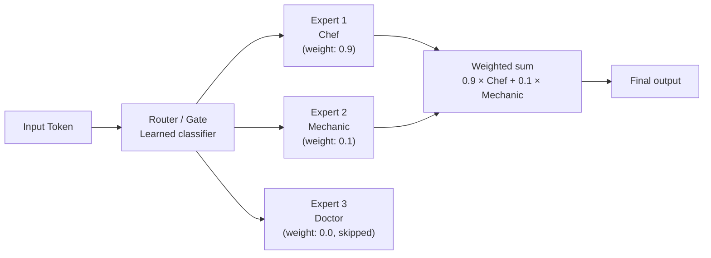

# Mixture of Experts (MoE)

## 1. What is it?

**ELI5:** Imagine you have a team of specialists: a chef, a mechanic, and a doctor. When someone asks "What's for dinner?", only the chef answers — the mechanic and doctor stay quiet. MoE does this for neural networks: it has many "expert" sub-networks, but only activates a few per input, saving massive compute while keeping high capacity.



**Simple Explanation:** Mixture of Experts is a neural network architecture where multiple "expert" feed-forward networks are used, but a learned router/gating mechanism selects only a subset (typically 1-2) of experts for each input token. This allows models to have billions of parameters but only use a fraction of them per forward pass.

**Technical Definition:** MoE replaces the standard feed-forward network (FFN) in each Transformer layer with multiple expert FFNs (typically 8-256). A learned router computes a probability distribution over experts and selects the top-k experts for each token. The output is a weighted sum of the selected experts' outputs:
```
Output = Σ_i G(x)_i · E_i(x)
G(x) = softmax(TopK(Router(x) · W_g + ϵ))
```
Where G(x) is the gating vector, E_i are expert networks, TopK zeros out all but k values, and ϵ is noise for load balancing. This enables models like Mixtral 8x7B to have 47B total parameters but only 13B active per token.

## 2. Why do we need it?

**Problem It Solves:**
Dense Transformer models (like GPT-3 175B) activate ALL parameters for every token. This is computationally wasteful:
- Scale model size → O(N) compute per token (N = total parameters)
- Training cost is proportional to total FLOPs
- Inference cost is proportional to parameter memory bandwidth

MoE decouples model capacity from computation cost:
- Total parameters = N (model capacity)
- Activated parameters = N/k (compute cost, where k = number of experts)
- For k=2 experts out of 64: 97% of parameters are "free" in terms of compute

**Pain Without It:**
- GPT-4 with dense 1.8T parameters would cost $10 per query in inference compute
- Training a dense 1T model costs $200M+ in GPU time
- Quality/compute Pareto frontier hits diminishing returns
- Each token pays for ALL model capacity even for simple tokens ("the", "a", "is")

**Why Companies Invest:**
- Mixtral 8x7B matches LLaMA 2 70B quality with 5x faster inference
- GPT-4 uses MoE to achieve 1.8T total but ~280B active per token
- MoE allows training models 4-10x larger for the same FLOP budget
- Inference cost: 5-10x cheaper per token than equivalent quality dense model

## 3. Real-world Example


| Company | Model | Expert Count | Active per Token | Total Params | Active Params |
|---------|-------|-------------|------------------|--------------|---------------|
| **OpenAI** | GPT-4 | ~16 (estimated) | ~2 | ~1.8T | ~280B |
| **Mistral** | Mixtral 8x7B | 8 | 2 | 47B | 13B |
| **Google** | Switch Transformer | 2048 | 1 | 1.6T | 0.85B |
| **Google** | GLaM | 64 | 2 | 1.2T | 97B |
| **Google** | Mixture-of-Depths | N/A | Dynamic | — | 50% tokens skip |
| **Microsoft** | DeepSpeed MoE | 256 | 2 | Multi-trillion | Variable |
| **NVIDIA** | Megatron-Turing NLG | 8 expert groups | 1 per group | 530B | — |

**Mixtral 8x7B (Mistral, 2023):**
- 8 experts, top-2 routing
- Matches or exceeds LLaMA 2 70B on most benchmarks
- Inference speed comparable to a 12B dense model
- Training cost: ~$50M estimated (vs $200M+ for comparable dense model)
- Opensource: entire architecture and weights released

**GPT-4 (OpenAI, 2023):**
- Believed to use 16 experts with top-2 routing (based on inference cost estimates)
- 1.8T total parameters → ~280B active per token
- Training cost: estimated $100-200M
- Each forward pass activates only 15% of total parameters
- Enables 128K context by freeing GPU memory from unused parameters

## 4. Architecture Diagram (ASCII)

```
                    MIXTURE OF EXPERTS LAYER

                   ┌─────────────────────────┐
                   │        INPUT (token)     │
                   └───────────┬─────────────┘
                               │
                    ┌──────────▼──────────┐
                    │       ROUTER        │
                    │  Gate(x) = softmax( │
                    │    TopK(x · W_g))    │
                    └──────┬──────┬───────┘
                           │      │
             ┌─────────────┤      ├──────────────┐
             │             │      │              │
        ┌────▼────┐  ┌────▼────┐  │  ┌────▼────┐
        │ Expert 1 │  │ Expert 2 │  │  │ Expert 8 │
        │  FFN     │  │  FFN     │  │  │  FFN     │
        │  (inactive) │  (active) │  │  │  (inactive)│
        └─────────┘  └────┬─────┘  │  └─────────┘
                          │        │
                          └───┬────┘
                              │
                    ┌─────────▼─────────┐
                    │   Weighted Sum    │
                    │  Output = Σ Gᵢ·Eᵢ│
                    └─────────┬─────────┘
                              │
                   ┌──────────▼──────────┐
                   │       OUTPUT        │
                   └─────────────────────┘


    ┌─────────────────────────────────────────────────────────────┐
    │           EXPERT PARALLELISM (across GPUs)                  │
    │                                                             │
    │  GPU 0: Experts [0-3]     GPU 1: Experts [4-7]             │
    │  GPU 2: Experts [8-11]    GPU 3: Experts [12-15]           │
    │                                                             │
    │  Token → Router → GPU 0 (expert 1) → GPU 3 (expert 14)     │
    │           ↕ all-to-all communication                        │
    └─────────────────────────────────────────────────────────────┘
```

## 5. Internal Working

**Step-by-step MoE Layer Execution:**

**Step 1 — Router Computation:**
- Input token x passes through a learned linear gate: h = x · W_g
- W_g shape: [d_model, n_experts]
- h shape: [n_experts] — logits for each expert

**Step 2 — Top-k Selection:**
- Add small noise for load balancing: h = h + ϵ · softplus(x · W_noise)
- Select top-k values: indices = TopK(h, k)
- Create gating vector G: all zeros except selected indices

**Step 3 — Softmax over Selected Experts:**
- Apply softmax only over selected expert logits
- G_i = softmax(h_i) for i in selected experts
- G_j = 0 for j not selected

**Step 4 — Expert Forward Pass:**
- Route input to each selected expert
- Expert is a standard FFN: E_i(x) = W_2_i · GELU(W_1_i · x)
- Each expert has its own W_1_i, W_2_i weights

**Step 5 — Combine Outputs:**
- Final output = Σ_{i in selected} G_i · E_i(x)
- Weighted sum where weights come from the router

**Load Balancing (auxiliary loss):**
- Without balancing, all tokens route to 1-2 "favorite" experts
- Add auxiliary loss: L_balance = α · n_experts · Σ_i f_i · P_i
  - f_i = fraction of tokens routed to expert i
  - P_i = average routing probability for expert i
- Encourages uniform expert utilization
- Typically α = 0.01 (small weight relative to main loss)

## 6. Production Flow

```
                    MoE INFERENCE FLOW

┌──────┐    ┌──────┐    ┌──────────┐    ┌───────────┐
│Token │───▶│ Layer│───▶│ Router   │───▶│ Dispatch  │
│Input │    │ Norm │    │ (gate)   │    │ Tokens to │
└──────┘    └──────┘    └──────────┘    │ Experts   │
                                         └─────┬─────┘
                                               │
                                    ┌──────────▼──────────┐
                                    │ Expert Computation  │
                                    │ (parallel on GPUs)  │
                                    └──────────┬──────────┘
                                               │
                                    ┌──────────▼──────────┐
                                    │ Combine (weighted   │
                                    │ sum of experts)     │
                                    └──────────┬──────────┘
                                               │
                                    ┌──────────▼──────────┐
                                    │ Residual + Next     │
                                    │ Layer               │
                                    └─────────────────────┘

1. Self-attention output → LayerNorm
2. Router computes expert assignment probabilities
3. All-to-all communication dispatches tokens to correct GPUs
4. Each GPU runs its local experts on assigned tokens
5. All-to-all communication gathers expert outputs
6. Weighted sum combines expert outputs
7. Residual connection + FFN continue to next layer

Production considerations:
- Expert parallelism: each GPU holds subset of experts
- Token dispatch uses all-to-all communication (bandwidth bottleneck)
- Capacity factor: max tokens per expert (typical: 1.0-2.0)
- Dropped tokens: if expert exceeds capacity, excess tokens skipped
- Pipeline balance: load balancing loss critical for production throughput
```

## 7. HLD (High-Level Design)

```
┌─────────────────────────────────────────────────────────────────────┐
│                    MoE TRAINING/SERVING (HLD)                      │
│                                                                     │
│  ┌──────────┐    ┌──────────┐    ┌─────────────────────────┐       │
│  │ Data     │───▶│ Tokenizer│───▶│  MoE Transformer        │       │
│  │ Pipeline │    │          │    │                         │       │
│  └──────────┘    └──────────┘    │  ┌───────────────────┐  │       │
│                                   │  │ Layer 0: SA + MoE │  │       │
│  ┌──────────┐                     │  │ Layer 1: SA + MoE │  │       │
│  │ Router   │──────┐             │  │ ...               │  │       │
│  │ Logging  │      │             │  │ Layer N: SA + MoE │  │       │
│  └──────────┘      │             │  └───────────────────┘  │       │
│                     ▼             └───────────┬─────────────┘       │
│              ┌──────────────┐                │                      │
│              │ Expert       │                ▼                      │
│              │ Utilization  │       ┌────────────────┐              │
│              │ Monitor      │       │ Load Balancing  │             │
│              └──────────────┘       │ Loss (α=0.01)  │             │
│                                      └────────────────┘              │
│                                                                     │
│  ┌──────────────────────────────────────────────────────┐           │
│  │  Distributed Training (Expert Parallelism)           │           │
│  │  ┌─────┐  ┌─────┐  ┌─────┐  ┌─────┐                │           │
│  │  │ GPU0│  │ GPU1│  │ GPU2│  │ GPU3│                │           │
│  │  │ E0-3│  │ E4-7│  │E8-11│  │E12-15│               │           │
│  │  └──┬──┘  └──┬──┘  └──┬──┘  └──┬──┘                │           │
│  │     └────────┴────┬───┴────────┘                    │           │
│  │                   │ all-to-all                       │           │
│  │              ┌────▼────┐                             │           │
│  │              │ Gradient │                             │           │
│  │              │ Allreduce│                             │           │
│  │              └─────────┘                              │           │
│  └──────────────────────────────────────────────────────┘           │
└─────────────────────────────────────────────────────────────────────┘
```

## 8. LLD (Low-Level Design)

```python
# moe.py — Production-grade Mixture of Experts
import torch
import torch.nn as nn
import torch.nn.functional as F
from typing import Optional, Tuple
import math

class MoELayer(nn.Module):
    """Mixture of Experts layer with top-k routing."""

    def __init__(self, d_model: int, n_experts: int, top_k: int = 2,
                 capacity_factor: float = 1.25, aux_loss_weight: float = 0.01,
                 d_ff: int = None):
        super().__init__()
        self.d_model = d_model
        self.n_experts = n_experts
        self.top_k = top_k
        self.capacity_factor = capacity_factor
        self.aux_loss_weight = aux_loss_weight
        d_ff = d_ff or 4 * d_model

        # Router
        self.router = nn.Linear(d_model, n_experts, bias=False)
        self.router_noise = nn.Linear(d_model, n_experts, bias=False)

        # Experts
        self.experts = nn.ModuleList([
            nn.Sequential(
                nn.Linear(d_model, d_ff, bias=False),
                nn.GELU(),
                nn.Linear(d_ff, d_model, bias=False),
            )
            for _ in range(n_experts)
        ])

    def _load_balance_loss(self, gate_logits: torch.Tensor, expert_indices: torch.Tensor) -> torch.Tensor:
        """Compute auxiliary load balancing loss."""
        batch, seq_len = expert_indices.shape[:2]

        # Fraction of tokens assigned to each expert
        expert_mask = F.one_hot(expert_indices, num_classes=self.n_experts)
        expert_mask = expert_mask.float().view(-1, self.n_experts)
        tokens_per_expert = expert_mask.mean(dim=0)  # (n_experts,)

        # Average routing probability per expert
        router_prob = F.softmax(gate_logits, dim=-1)
        router_prob = router_prob.view(-1, self.n_experts)
        avg_prob = router_prob.mean(dim=0)  # (n_experts,)

        # L_aux = n_experts * Σ (f_i * P_i)
        loss = self.n_experts * (tokens_per_expert * avg_prob).sum()
        return self.aux_loss_weight * loss

    def forward(self, x: torch.Tensor) -> torch.Tensor:
        # x: (batch, seq_len, d_model)
        batch, seq_len, d_model = x.shape
        original_shape = x.shape
        x_flat = x.view(-1, d_model)  # (batch*seq_len, d_model)

        # Router logits
        gate_logits = self.router(x_flat)  # (batch*seq_len, n_experts)
        noise = torch.randn_like(gate_logits) * F.softplus(self.router_noise(x_flat))
        gate_logits_noisy = gate_logits + noise  # Noise only during training

        # Top-k selection
        top_k_logits, top_k_indices = torch.topk(gate_logits_noisy, self.top_k, dim=-1)
        # top_k_indices: (batch*seq_len, top_k)

        # Create gating vector
        gate_weights = F.softmax(top_k_logits, dim=-1)

        # Load balancing loss
        aux_loss = self._load_balance_loss(gate_logits, top_k_indices)

        output = torch.zeros_like(x_flat)
        expert_counts = torch.zeros(self.n_experts, device=x.device)

        for expert_idx in range(self.n_experts):
            # Find tokens assigned to this expert
            mask = (top_k_indices == expert_idx)
            if not mask.any():
                continue

            # Get token positions and corresponding weights
            token_positions, k_positions = torch.where(mask)

            # Apply capacity factor
            capacity = int((x_flat.size(0) * self.top_k * self.capacity_factor) / self.n_experts)
            if len(token_positions) > capacity:
                # Drop excess tokens
                token_positions = token_positions[:capacity]
                k_positions = k_positions[:capacity]

            expert_input = x_flat[token_positions]
            expert_output = self.experts[expert_idx](expert_input)

            weights = gate_weights[token_positions, k_positions].unsqueeze(-1)
            output.index_add_(0, token_positions, expert_output * weights)
            expert_counts[expert_idx] = len(token_positions)

        # Track expert utilization for monitoring
        self.expert_utilization = expert_counts

        return output.view(batch, seq_len, d_model), aux_loss


class MoETransformerBlock(nn.Module):
    """Transformer block with MoE FFN."""

    def __init__(self, d_model: int, n_heads: int, n_experts: int,
                 top_k: int = 2, dropout: float = 0.1):
        super().__init__()
        self.attention = nn.MultiheadAttention(d_model, n_heads, dropout, batch_first=True)
        self.moe = MoELayer(d_model, n_experts, top_k)
        self.norm1 = nn.LayerNorm(d_model)
        self.norm2 = nn.LayerNorm(d_model)
        self.dropout = nn.Dropout(dropout)

    def forward(self, x: torch.Tensor, mask: Optional[torch.Tensor] = None) -> Tuple[torch.Tensor, torch.Tensor]:
        # Self-attention with residual
        attn_out, _ = self.attention(self.norm1(x), self.norm1(x), self.norm1(x),
                                      attn_mask=mask)
        x = x + self.dropout(attn_out)

        # MoE FFN with residual
        moe_out, aux_loss = self.moe(self.norm2(x))
        x = x + self.dropout(moe_out)

        return x, aux_loss
```

## 9. Python Implementation

```python
# moe_server.py — MoE inference service
import torch
from fastapi import FastAPI, HTTPException, BackgroundTasks
from pydantic import BaseModel, Field
import time
import uuid

app = FastAPI(title="MoE Inference Server", version="1.0.0")

class MoERequest(BaseModel):
    tokens: list[list[float]]
    top_k: int = 2

class MoEResponse(BaseModel):
    output: list[list[float]]
    expert_utilization: list[int]
    latency_ms: float
    request_id: str

# Initialize MoE layer (production: load from checkpoint)
MOE = MoELayer(d_model=4096, n_experts=8, top_k=2)
MOE.eval()

@app.post("/moe-forward", response_model=MoEResponse)
async def moe_forward(request: MoERequest):
    start = time.perf_counter()
    request_id = str(uuid.uuid4())

    try:
        x = torch.tensor(request.tokens).unsqueeze(0)
        with torch.no_grad():
            output, _ = MOE(x)

        latency = (time.perf_counter() - start) * 1000

        return MoEResponse(
            output=output.squeeze(0).tolist(),
            expert_utilization=MOE.expert_utilization.tolist(),
            latency_ms=round(latency, 2),
            request_id=request_id,
        )
    except Exception as e:
        raise HTTPException(status_code=500, detail=str(e))
```

## 10. Folder Structure

```
moe-platform/
├── api/
│   └── server.py
├── model/
│   ├── __init__.py
│   ├── moe_layer.py        # MoE FFN implementation
│   ├── router.py           # Top-k routing + noise
│   ├── experts.py          # Expert FFN modules
│   ├── transformer.py      # MoE Transformer block
│   └── config.py
├── distributed/
│   ├── expert_parallel.py  # Expert parallelism
│   ├── all_to_all.py       # Token dispatch
│   └── load_balance.py     # Auxiliary loss
├── training/
│   ├── trainer.py          # MoE-specific training
│   ├── capacity.py         # Capacity factor scheduling
│   └── checkpoint.py       # Expert checkpointing
├── serving/
│   ├── inference.py        # MoE inference
│   └── batch_scheduler.py  # Token-to-expert scheduling
├── monitoring/
│   ├── expert_util.py      # Expert utilization tracking
│   └── router_analysis.py  # Routing pattern analysis
├── tests/
│   ├── test_moe.py
│   ├── test_routing.py
│   └── test_load_balance.py
├── config.yaml
└── Dockerfile
```

## 11. Configuration

```yaml
moe:
  n_experts: 64
  top_k: 2
  capacity_factor: 1.25  # Train: 1.25, Inference: 1.0
  aux_loss_weight: 0.01
  d_ff: 14336  # Expert FFN hidden size
  router:
    type: "top_k"  # top_k, top_1, sinkhorn
    noise_std: 0.01
    jitter: true  # Input jittering for load balance
  expert_parallelism:
    enabled: true
    experts_per_gpu: 8
    dispatch_method: "all_to_all"  # all_to_all, scatter_gather
  capacity:
    train: 1.25
    inference: 1.0
    min_capacity: 4

training:
  z_loss: 0.001  # Stabilizes training
  router_z_loss: 0.001
  load_balance_warmup: 5000  # Steps to ramp up aux_loss_weight
```

## 12. Flowchart

```
                    ┌──────────────┐
                    │ Token Input  │
                    └──────┬───────┘
                           │
                    ┌──────▼───────┐
                    │ Layer Norm   │
                    └──────┬───────┘
                           │
              ┌────────────┴────────────┐
              │                         │
         ┌────▼────┐              ┌─────▼─────┐
         │ Router  │              │ Expert N  │
         │ Compute │              │ (inactive)│
         │ Gate    │              └───────────┘
         └────┬────┘
              │
         ┌────▼────┐
         │ Top-2   │
         │ Select  │
         └────┬────┘
              │
              ├──────────────────┐
              │                  │
         ┌────▼────┐       ┌────▼────┐
         │ Expert 3│       │ Expert 7│
         │ (active)│       │ (active)│
         └────┬────┘       └────┬────┘
              │                  │
              └────────┬─────────┘
                       │
                  ┌────▼────┐
                  │ Weighted│
                  │ Sum     │
                  └────┬────┘
                       │
                  ┌────▼────┐
                  │ Residual│
                  │ + Norm  │
                  └─────────┘
```

## 13. Sequence Diagram

```
Token            Router           Expert 0          Expert 7         Combine
 │                │                  │                  │              │
 │── x ──────────►│                  │                  │              │
 │                │                  │                  │              │
 │                │── Compute logits │                  │              │
 │                │── Softmax + TopK │                  │              │
 │                │                  │                  │              │
 │                │── Dispatch ────────────────────────────────────── ►│
 │                │                  │                  │              │
 │                │─────────────────►│  (active)        │              │
 │                │───────────────────────────────────►│  (active)    │
 │                │                  │                  │              │
 │                │                  │── E₃(x) ────────►│              │
 │                │                  │                  │── E₇(x) ────►│
 │                │                  │                  │              │
 │                │                  │                  │              │
 │◄───────────────┼────────────────────────────────────│── output ───│
 │                │                  │                  │              │
```

## 14. Pros

1. **Compute Efficiency:** 4-10x more parameters for same FLOPs. Mixtral 8x7B = 47B params, 13B active.

2. **Quality-Cost Pareto:** MoE models achieve dense-model quality at 2-5x lower inference cost.

3. **Specialized Experts:** Different experts learn different patterns (syntax, semantics, domain knowledge).

4. **Scaling:** Can scale to trillions of parameters with feasible training budgets.

5. **Flexible Capacity:** Not all tokens need the same compute. Simple tokens use fewer resources.

6. **Natural Sparsity:** MoE introduces structural sparsity without complex pruning.

7. **Ensemble Effect:** Expert combination acts as implicit ensemble, improving robustness.

## 15. Cons

1. **Communication Bottleneck:** All-to-all dispatch creates severe bandwidth requirements (up to 50% of training time).

2. **Load Imbalance:** Without auxiliary loss, tokens cluster on 1-2 experts, wasting capacity.

3. **Training Instability:** Router is hard to train — collapses to few experts early in training.

4. **Large Memory Footprint:** Total parameter count requires significant storage (even if only fraction is active).

5. **Co-adaptation:** Experts can become "too specialized" and fail to generalize.

6. **Expert Dropping:** Capacity factor causes token dropping at boundaries — lost information.

7. **Inference Complexity:** Requires sophisticated scheduling for batch inference across experts.

8. **Fine-tuning Difficulty:** Load balancing can break during fine-tuning. Requires careful adjustment.

## 16. Alternatives

| Method | Approach | Pros | Cons |
|--------|----------|------|------|
| **Dense FFN** | Single FFN per layer | Simple, high utilization | Limited capacity |
| **MoE with top-1** | Single expert per token | Fast dispatch | Lower quality |
| **Product Key Memory** | Memory-augmented FFN | Very large memory | Complex training |
| **Conditional Computation** | Activation sparsity | No expert overhead | Harder to optimize |
| **Layer Drop** | Skip some layers per token | Simple | Limited capacity gain |
| **Mixture of Depths** | Dynamic compute per layer | 50% tokens skip FFN | RNN-like sequential constraint |
| **Soft MoE** | All experts, soft assignment | Better gradient flow | Higher compute per token |

## 17. Performance Considerations

**Communication Cost (Training):**
```
Transfer size = n_tokens_per_gpu × top_k × d_model × 2 (send + receive)
For Mixtral 8x7B on 8 GPUs with batch=256, seq=4096:
  = 256 × 4096 / 8 × 2 × 4096 × 4 bytes × 2 ≈ 8 GB per layer
  32 layers → 256 GB per training step
  At 800 Gbps NVLink → 2.5 seconds just for communication per step
```

**Expert Utilization Monitoring:**
- Ideal: all experts have ~equal token counts (within 10% of uniform)
- Warning: any expert receives <50% of expected tokens
- Critical: any expert receives <10% of expected tokens

**Memory vs Compute Tradeoffs:**
- Total memory: O(n_experts × d_ff × d_model) per layer
- Active compute: O(top_k × d_ff × d_model) per token
- Ratio: active_params / total_params = top_k / n_experts

**Inference Optimization:**
- Expert parallelism: each GPU holds subset of experts
- Capacity factor = 1.0 at inference (no token dropping)
- Batch tokens to same expert together for efficient matmul
- Use smaller capacity factor for faster inference (fewer tokens per expert)
- Pre-compile expert FFN kernels

## 18. Scaling to Millions

**Training MoE at Scale (10K+ GPUs):**
1. **Expert parallelism:** 128 experts across 128 GPUs
2. **Data parallelism:** Each GPU processes different batch of tokens
3. **Hybrid parallelism:** DP within node, EP across nodes
4. **Gradient accumulation:** Large effective batch size
5. **Megatron-style tensor + expert + pipeline parallelism**

**Production Serving (100M+ daily requests):**
1. **Shard experts across GPU pool**
2. **Router as separate service** (small, fast, can run on CPU)
3. **Elastic expert scaling:** Add/remove expert replicas based on load
4. **Expert caching:** Most-used experts stay GPU-resident, least-used load on demand
5. **Multi-tenant MoE:** Different clients can share expert pool

**Cost Optimization:**
- **Spot GPU for batch, on-demand for interactive**
- **Expert prefetching:** Predict expert usage from request patterns
- **Adaptive top-k:** Use 1 expert for simple tokens, 3 for complex

## 19. Failure Scenarios

| Failure | Symptom | Cause | Mitigation |
|---------|---------|-------|------------|
| **Router collapse** | All tokens → expert 0 | Insufficient balance loss | Increase α to 0.05 |
| **Expert dropping** | 5%+ tokens not processed | Capacity factor too low | Increase to 1.25 |
| **Communication deadlock** | Training stalls | All-to-all order mismatch | Standardize dispatch order |
| **Expert underflow** | NaN in few experts | Learning rate too high | Lower LR for expert params |
| **Memory OOM (expert)** | GPU OOM | Too many experts per GPU | Reduce experts/GPU or use CPU offload |
| **Load imbalance spike** | 90% tokens to 10% experts | Pretrain loss spike | Restore from checkpoint, increase balance loss |
| **Synchronization drift** | All-to-all misalignment | Pipeline parallel mismatch | RCCL/MPI timeout, restart |

## 20. Security

| Threat | Impact | Mitigation |
|--------|--------|------------|
| **Expert spying** | Determine which expert handles which input | Expert index obfuscation |
| **Token dropping DoS** | Expert overload from specific input patterns | Rate limiting per pattern |
| **Router poisoning** | Manipulate router weights | Model signing, input validation |
| **Side-channel timing** | Extract routing decisions from timing | Consistent compute time across routes |

## 21. Monitoring

```yaml
metrics:
  expert:
    - name: expert_utilization
      type: gauge
      labels: [expert_id]
      help: "Fraction of tokens routed to each expert"
    - name: expert_balance_score
      type: gauge
      help: "Σ (f_i - 1/n)^2 — lower is more balanced"
    - name: expert_dropped_tokens
      type: counter
      labels: [expert_id]
      help: "Tokens dropped due to capacity limit"

  router:
    - name: router_entropy
      type: histogram
      help: "Router probability distribution entropy"
    - name: top_k_weight_ratio
      type: gauge
      help: "Weight ratio between top-1 and top-2 expert"

  performance:
    - name: all_to_all_latency_ms
      type: histogram
      help: "Token dispatch communication time"
    - name: expert_compute_latency_ms
      type: histogram
      labels: [expert_id]

alerts:
  - condition: expert_balance_score > 0.5 (100% concentration)
    severity: critical
    description: "Router collapse — all tokens to few experts"
  - condition: expert_dropped_tokens > 0.01 * total_tokens
    severity: warning
    description: "Excess token dropping — increase capacity factor"
  - condition: router_entropy < 0.1
    severity: warning
    description: "Router is overconfident — distribution collapse risk"
```

## 22. Interview Questions

**Beginner:**
- Q: What is MoE?
  A: Mixture of Experts — multiple FFN "experts" with a router that selects 1-2 per token. More parameters but same compute.

- Q: Why do MoE models use "top-2" routing?
  A: Top-1 is fast but lower quality (too few experts contribute). Top-3+ adds diminishing returns. Top-2 is the optimal quality/speed tradeoff.

**Intermediate:**
- Q: How does the auxiliary load balancing loss work?
  A: L_aux = α · n · Σ_i f_i · P_i where f_i is fraction of tokens to expert i and P_i is average routing probability. Minimizing this encourages uniform expert usage.

- Q: What is capacity factor and why does it matter?
  A: Capacity factor = max_tokens_per_expert / expected_tokens. >1.0 prevents token dropping but wastes compute. <1.0 drops tokens (information loss). 1.25 typical for training, 1.0 for inference.

**Senior:**
- Q: Your MoE model trains but all tokens route to one expert. Diagnose.
  A: (1) Router collapse — increase auxiliary loss weight. (2) Router initialization — use larger init for router bias. (3) Learning rate too high — lower LR for router parameters. (4) Add noise to router during training.

- Q: Design a serving system for a 64-expert MoE model across 8 GPUs.
  A: (1) Expert parallelism: 8 experts per GPU. (2) Router runs on CPU or dedicated GPU. (3) All-to-all communication for token dispatch. (4) Capacity factor 1.0 to avoid dropping. (5) Dynamic batching: batch tokens to same expert. (6) Overlap compute and communication.

**Staff Engineer:**
- Q: How would you train a Mixtral-scale MoE model from scratch?
  A: (1) Initialize experts differently (random seeds) to break symmetry. (2) Router noise for exploration (standard deviation 0.01, decay to 0.001). (3) Warm up load balancing loss over 5K steps. (4) Z-loss (router logit regularization) + auxiliary loss. (5) Expert parallelism across nodes, data+model parallelism within. (6) Checkpoint every 500 steps — router collapse recovery.

**Architect:**
- Q: MoE vs dense — when is MoE NOT the right choice?
  A: MoE is suboptimal when: (1) Interactive serving latency <50ms required (all-to-all adds 5-20ms). (2) GPU memory is constrained (MoE uses 4-10x more memory). (3) Fine-tuning on small datasets (load balance breaks). (4) Hardware has slow interconnects (no NVLink — communication dominates). (5) Deployment on consumer GPUs (24GB VRAM insufficient).

## 23. Cheat Sheet

```
┌─────────────────────────────────────────────────────────────────────┐
│                    MoE CHEAT SHEET                                  │
├─────────────────────────────────────────────────────────────────────┤
│                                                                    │
│  ARCHITECTURE: Router(x) → TopK → Experts[selected] → Weighted Sum │
│                                                                    │
│  TOTAL PARAMS = n_experts × expert_params                          │
│  ACTIVE PARAMS = top_k × expert_params (per token)                 │
│  COMPUTE SAVING = n_experts / top_k                               │
│                                                                    │
│  ROUTER:                                                           │
│  G(x) = softmax(TopK(x · W_g + noise, k))                         │
│  noise = ϵ · softplus(x · W_noise)                                 │
│                                                                    │
│  LOSS:                                                             │
│  L = L_main + α · L_balance + β · L_z                            │
│  L_balance = n · Σ f_i · P_i  (α = 0.01 typical)                 │
│  L_z = log(Σ exp(logits))^2  (β = 0.001, prevents logit growth)  │
│                                                                    │
│  BEST PRACTICES:                                                    │
│  - top_k = 2 for optimal quality/speed                             │
│  - n_experts = 8-256, larger = more capacity                       │
│  - capacity_factor: 1.25 train, 1.0 inference                      │
│  - Expert parallelism: all-to-all dispatch                         │
│  - Separate expert LR (lower than dense params)                   │
│  - Warm up balance loss over 5K steps                              │
│                                                                    │
│  PRODUCTION MODELS:                                                 │
│  ┌─────────────────────────────────────────────────────┐           │
│  │ GPT-4: 16 experts, top-2, ~1.8T total, ~280B active │           │
│  │ Mixtral 8x7B: 8 experts, top-2, 47B total, 13B act  │           │
│  │ Switch Transformer: 2048 experts, top-1, 1.6T total │           │
│  └─────────────────────────────────────────────────────┘           │
└─────────────────────────────────────────────────────────────────────┘
```

## 24. Common Mistakes

1. **No auxiliary load balancing loss:** Router collapses to 1-2 experts immediately without it.

2. **Router initialized too large:** Large router weights cause overpowered routing that ignores auxiliary loss.

3. **Skipping capacity factor:** Without capacity factor, expert OOM on imbalanced batches.

4. **Fine-tuning without balance loss:** The balance loss must be kept during fine-tuning or experts collapse.

5. **Too few experts:** <4 experts don't benefit from MoE. Use 8-64 for real gains.

6. **Incorrect all-to-all ordering:** Expert dispatch must match between sender and receiver GPUs.

7. **Ignoring expert utilization in monitoring:** Silent load imbalance degrades quality over time.

8. **Dropping too many tokens:** If >1% tokens dropped, increase capacity factor or reduce batch size.

## 25. Production Best Practices

1. **Separate optimizer for router:** Use different learning rate for router (1e-4 vs 1e-5 for experts). Router needs higher LR to learn routing, lower for experts to prevent collapse.

2. **Z-loss regularization:** Add z-loss = log(Σ exp(logits))² * β to prevent router logits from growing unbounded (β=0.001).

3. **Router input jittering:** Add small noise to router input during training. Prevents overfitting to routing patterns.

4. **Expert dropout:** Each expert independently. Experts learn to be robust without each other.

5. **Load test all-to-all bandwidth:** Communication is the bottleneck. Measure before scaling.

6. **Gradually increase capacity factor:** Start at 1.0, increase to 1.25 over first 10K steps.

7. **Monitor expert affinities:** Log which experts activate for which tokens. Detect specialization drift.

8. **Pre-shard for inference:** For production serving, pre-deploy expert shards with consistent hashing.

9. **Dynamic expert enabling:** At inference, disable experts with <5% utilization to save memory.

10. **Async dispatch:** Overlap all-to-all communication with expert computation to hide latency.
