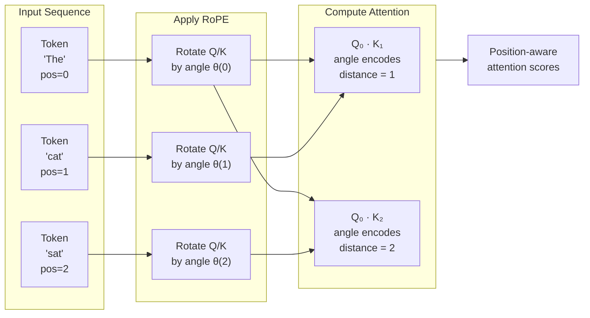

# Rotary Position Embedding (RoPE)

## 1. What is it?

**ELI5:** Imagine you have a compass needle that points to word positions. As you move along a sentence, the needle rotates. RoPE does this for AI — it rotates the Query and Key vectors by an angle proportional to their position. Words that are close together have similar rotation angles; far apart words have very different angles. The model can "feel" the distance between words by comparing their rotation.



**Simple Explanation:** Rotary Position Embedding (RoPE) encodes position by rotating the Query and Key vectors in attention before computing the dot product. The rotation angle depends on the token's position — tokens at different positions get different rotations. This allows the attention mechanism to directly capture relative position information through the angle between rotated vectors.

**Technical Definition:** RoPE (Su et al., 2021) is a position encoding method that applies a rotation matrix R(θ, pos) to the Query and Key vectors in self-attention. The rotation is defined as:
```
f{q,k}(x_m, m) = R_Θ(m) · W{q,k} · x_m
```
where R_Θ(m) is a block-diagonal rotation matrix:
```
R_Θ(m) = diag(
  [cos(mθ_0), -sin(mθ_0); sin(mθ_0), cos(mθ_0)],
  [cos(mθ_1), -sin(mθ_1); sin(mθ_1), cos(mθ_1)],
  ...
)
```
where θ_i = 10000^(-2i/d). The key property: the dot product between query at position m and key at position n depends only on their relative distance (m-n): <f_q(x_m, m), f_k(x_n, n)> = g(x_m, x_n, m-n).

## 2. Why do we need it?

**Problem It Solves:**
Absolute positional encoding (sinusoidal/learned) encodes positions but:
- Sinusoidal PE is added to embeddings, making the position signal additive rather than integrated into attention
- Learned PE cannot extrapolate to longer sequences
- Neither directly provides relative position information to the attention mechanism
- Adding PE to embeddings can interfere with the embedding signal

RoPE solves these because:
1. **Position is integrated into attention computation** — not a separate additive signal
2. **Relative position is naturally captured** — dot product of rotated Q/K depends on (m-n)
3. **Extrapolates well** — can handle sequences longer than training length
4. **Decay with distance** — long-range tokens get smaller attention weights naturally

**Pain Without It:**
- Sinusoidal PE: Quality degrades beyond 2x training length
- Learned PE: Cannot handle any sequence beyond training max
- Additive PE: Model must learn to separate positional signal from embedding semantics
- Poor length generalization: Every new deployment length requires retraining

**Why Companies Invest:**
- Deploy same model with longer context (LLaMA: 2K → 32K with RoPE scaling)
- Natural long-range decay (unlike absolute PE that treats all positions equally)
- No learned parameters for position — zero overhead
- Works with KV cache (rotation applied before caching)

## 3. Real-world Example

| Company | Model | RoPE Configuration | Extended Context |
|---------|-------|--------------------|------------------|
| **Meta** | LLaMA 1/2/3 | RoPE with θ=10000 | 2K → 32K (NTK) |
| **OpenAI** | GPT-4 | RoPE variant | 128K tokens |
| **Mistral** | Mistral 7B, Mixtral | RoPE + sliding window | 32K effective |
| **Anthropic** | Claude 3 | RoPE (proprietary) | 200K tokens |
| **Google** | Gemini | RoPE variant | 1M tokens |
| **Qwen** | Qwen 2 | RoPE with NTK | 128K tokens |

**Meta LLaMA 3 405B:**
- Base model trained with 8K context length
- RoPE base frequency adjusted for fine-tuning at 32K
- NTK-aware scaling enables 4x context extension without retraining
- Result: Single model serves both interactive (short) and analysis (long) use cases

## 4. Architecture Diagram (ASCII)

```
                    ROTARY POSITION EMBEDDING (RoPE)

    Without RoPE:                        With RoPE:
    Q·K^T = dot product                 Q_rot·K_rot^T = dot product
    (position-agnostic)                 (position-aware, depends on m-n)

    ┌─────────────────────────┐         ┌─────────────────────────┐
    │  Q(m) = W_q · x_m      │         │  Q(m) = R(m) · W_q · x_m │
    │  K(n) = W_k · x_n      │         │  K(n) = R(n) · W_k · x_n │
    │                         │         │                         │
    │  score = Q(m)·K(n)^T   │         │  score = Q(m)·K(n)^T    │
    │  (no position info)     │         │  = f(x_m, x_n, m-n)    │
    └─────────────────────────┘         └─────────────────────────┘


    ROTATION VISUALIZATION (2D slice):
    ┌────────────────────────────────────────────┐
    │                                            │
    │              Im (sin)                      │
    │                ▲                           │
    │                │                           │
    │        pos=3   │  pos=2                    │
    │          ●     │    ●                      │
    │           ╲   │   ╱                       │
    │            ╲  │  ╱                        │
    │             ╲ │ ╱                         │
    │            pos=0───●───────▶ Re (cos)     │
    │             ╱ │ ╲          pos=1          │
    │            ╱  │  ╲                        │
    │           ╱   │   ╲                       │
    │          ●    │    ●                      │
    │                                         │
    └────────────────────────────────────────────┘
    Each position rotates the vector by θ·pos radians
    The angle between pos=m and pos=n is θ·(m-n)

    BLOCK-DIAGONAL ROTATION MATRIX:
    ┌────────────────────────────────────────────┐
    │                                            │
    │  ┌──────────────────────────────────┐      │
    │  │ cos(mθ₀) -sin(mθ₀)              │      │
    │  │ sin(mθ₀)  cos(mθ₀)    0         │      │
    │  │──────────────────────────────────│      │
    │  │           cos(mθ₁) -sin(mθ₁)    │      │
    │  │    0      sin(mθ₁)  cos(mθ₁)    │      │
    │  │──────────────────────────────────│      │
    │  │                         ...      │      │
    │  └──────────────────────────────────┘      │
    └────────────────────────────────────────────┘
```

## 5. Internal Working

**Step-by-step RoPE Computation:**

**Step 1 — Compute Query and Key (without position):**
```
q = W_q · x_m    (token m's query)
k = W_k · x_n    (token n's key)
```
Both have shape [d_model], where d_model is even.

**Step 2 — Pre-compute Rotation Frequencies:**
```
For i in 0..d_model/2:
  θ_i = base^(-2i/d_model)   where base = 10000
  → Creates d_model/2 different rotation speeds
  → First dimensions rotate fast, later dimensions rotate slowly
```

**Step 3 — Apply Rotation to Query at Position m:**
```
For each pair (q[2i], q[2i+1]):
  q_rot[2i]   = q[2i] · cos(m·θ_i) - q[2i+1] · sin(m·θ_i)
  q_rot[2i+1] = q[2i] · sin(m·θ_i) + q[2i+1] · cos(m·θ_i)
```
This is the 2D rotation formula applied to each consecutive pair of dimensions.

**Step 4 — Apply Same Rotation to Key at Position n:**
```
For each pair (k[2i], k[2i+1]):
  k_rot[2i]   = k[2i] · cos(n·θ_i) - k[2i+1] · sin(n·θ_i)
  k_rot[2i+1] = k[2i] · sin(n·θ_i) + k[2i+1] · cos(n·θ_i)
```

**Step 5 — Compute Attention with Rotated Q/K:**
```
score = q_rot · k_rot^T
```
Key property: This score depends only on (m-n), not on absolute positions.

**Why This Works (Mathematical Reason):**
- Rotation is a linear operation preserved by dot product
- R(m) · R(n)^T = R(m-n) because rotation matrices compose
- Therefore: (R(m)q) · (R(n)k) = q · R(m-n) · k — depends only on (m-n)

## 6. Production Flow

```
┌──────────────┐
│  Token IDs   │
│  [pos: 0..n] │
└──────┬───────┘
       │
┌──────▼───────┐
│  Embedding   │
│  + Optional  │
│  Abs PE      │
└──────┬───────┘
       │
┌──────▼───────┐
│  Q/K Project │
│  q = W_q · x │
│  k = W_k · x │
└──────┬───────┘
       │
┌──────▼──────────────────────┐
│  RoPE Application           │
│                             │
│  for each dim pair:         │
│    angle = position * θ_i   │
│    cos_angle, sin_angle     │
│    apply 2D rotation        │
│                             │
│  Cache: pre-compute         │
│  cos/sin for all positions  │
└──────┬──────────────────────┘
       │
┌──────▼───────┐
│  Attention   │
│  Q_rot·K_rot │
└──────────────┘

Production optimization:
- Pre-compute cos/sin for all positions up to max_seq_len
- Cache in (max_len, d_model) buffer on GPU
- RoPE is applied BEFORE KV cache storage
- KV cache stores already-rotated K, V (no re-computation)
```

## 7. HLD (High-Level Design)

```
┌─────────────────────────────────────────────────────────────────────┐
│                    RoPE INTEGRATION ARCHITECTURE                    │
│                                                                     │
│  ┌──────────────┐                                                   │
│  │  Token       │── x ──────────────────────┐                      │
│  │  Embedding   │                            │                      │
│  └──────────────┘                            │                      │
│                                              ▼                      │
│  ┌──────────────┐                   ┌──────────────┐               │
│  │  Q/K Proj    │── q/k ──────►    │  RoPE Apply  │── q_rot/k_rot │
│  └──────────────┘                   └──────────────┘               │
│                                              │                      │
│  ┌──────────────┐                   ┌───────▼────────┐             │
│  │  cos/sin     │◄── position ─────│  PE Cache      │             │
│  │  Lookup      │                   │  [max_len × d] │             │
│  └──────────────┘                   └────────────────┘             │
│                                              │                      │
│  ┌──────────────┐                           │                      │
│  │  V Proj      │── v (no rotation) ────────┤                      │
│  └──────────────┘                           │                      │
│                                              ▼                      │
│                                     ┌──────────────┐               │
│                                     │  Attention   │               │
│                                     │  Compute     │               │
│                                     └──────────────┘               │
│                                              │                      │
│  ┌──────────────┐                           │                      │
│  │  KV Cache    │◄── store rotated k,v ─────┘                      │
│  └──────────────┘                                                  │
│  (Already rotated! No recompute needed)                            │
└─────────────────────────────────────────────────────────────────────┘
```

## 8. LLD (Low-Level Design)

```python
# rope.py — Production-grade RoPE implementation
import torch
import torch.nn as nn
import math
from typing import Optional, Tuple

class RotaryPositionEmbedding(nn.Module):
    """Rotary Position Embedding (RoPE)."""

    def __init__(self, dim: int, max_seq_len: int = 8192, base: float = 10000.0):
        super().__init__()
        self.dim = dim
        self.max_seq_len = max_seq_len
        self.base = base

        # Pre-compute cos/sin for all positions up to max_seq_len
        inv_freq = 1.0 / (self.base ** (
            torch.arange(0, dim, 2).float() / dim
        ))
        self.register_buffer("inv_freq", inv_freq, persistent=False)

        self._update_cos_sin_cache(max_seq_len)

    def _update_cos_sin_cache(self, seq_len: int):
        """Pre-compute cos/sin for all positions up to seq_len."""
        t = torch.arange(seq_len, device=self.inv_freq.device, dtype=self.inv_freq.dtype)
        freqs = torch.outer(t, self.inv_freq)  # (seq_len, dim/2)
        # Create (seq_len, dim) with pairs
        emb = torch.cat((freqs, freqs), dim=-1)  # (seq_len, dim)
        self.register_buffer("cos_cached", emb.cos().unsqueeze(0).unsqueeze(0), persistent=False)
        self.register_buffer("sin_cached", emb.sin().unsqueeze(0).unsqueeze(0), persistent=False)

    def forward(self, x: torch.Tensor, position_ids: Optional[torch.Tensor] = None) -> Tuple[torch.Tensor, torch.Tensor]:
        # x shape: (batch, n_heads, seq_len, dim_per_head)
        seq_len = x.size(2)
        max_len = self.cos_cached.size(-2)

        if seq_len > max_len:
            self._update_cos_sin_cache(seq_len)

        cos = self.cos_cached[:, :, :seq_len, :].to(x.dtype)
        sin = self.sin_cached[:, :, :seq_len, :].to(x.dtype)

        if position_ids is not None:
            # Gather cos/sin for specific positions
            cos = cos[:, :, position_ids, :]
            sin = sin[:, :, position_ids, :]

        return cos, sin


def rotate_half(x: torch.Tensor) -> torch.Tensor:
    """Rotate the second half of the last dimension."""
    x1 = x[..., :x.shape[-1] // 2]
    x2 = x[..., x.shape[-1] // 2:]
    return torch.cat((-x2, x1), dim=-1)


def apply_rotary_pos_emb(
    q: torch.Tensor,
    k: torch.Tensor,
    cos: torch.Tensor,
    sin: torch.Tensor,
) -> Tuple[torch.Tensor, torch.Tensor]:
    """Apply rotary position embedding to query and key.

    q, k: (batch, n_heads, seq_len, dim_head)
    cos, sin: (1, 1, seq_len, dim_head)
    """
    q_embed = (q * cos) + (rotate_half(q) * sin)
    k_embed = (k * cos) + (rotate_half(k) * sin)
    return q_embed, k_embed


class RoPEMultiHeadAttention(nn.Module):
    """Multi-head attention with RoPE."""

    def __init__(self, d_model: int, n_heads: int, max_seq_len: int = 8192,
                 rope_base: float = 10000.0, dropout: float = 0.1):
        super().__init__()
        assert d_model % n_heads == 0
        self.d_model = d_model
        self.n_heads = n_heads
        self.d_k = d_model // n_heads

        self.q_proj = nn.Linear(d_model, d_model, bias=False)
        self.k_proj = nn.Linear(d_model, d_model, bias=False)
        self.v_proj = nn.Linear(d_model, d_model, bias=False)
        self.o_proj = nn.Linear(d_model, d_model, bias=False)
        self.dropout = nn.Dropout(dropout)

        self.rope = RotaryPositionEmbedding(self.d_k, max_seq_len, rope_base)

    def forward(self, x: torch.Tensor, position_ids: Optional[torch.Tensor] = None,
                kv_cache: Optional[dict] = None, mask: Optional[torch.Tensor] = None) -> Tuple[torch.Tensor, Optional[dict]]:
        batch, seq_len, _ = x.shape

        q = self.q_proj(x).view(batch, seq_len, self.n_heads, self.d_k).transpose(1, 2)
        k = self.k_proj(x).view(batch, seq_len, self.n_heads, self.d_k).transpose(1, 2)
        v = self.v_proj(x).view(batch, seq_len, self.n_heads, self.d_k).transpose(1, 2)

        # Apply RoPE to Q and K
        cos, sin = self.rope(q, position_ids)
        q, k = apply_rotary_pos_emb(q, k, cos, sin)

        # KV Cache (store rotated K, already-rotated)
        if kv_cache is not None:
            if "k" in kv_cache:
                k = torch.cat([kv_cache["k"], k], dim=2)
                v = torch.cat([kv_cache["v"], v], dim=2)
            kv_cache["k"] = k
            kv_cache["v"] = v

        # Attention
        scores = torch.matmul(q, k.transpose(-2, -1)) / (self.d_k ** 0.5)
        if mask is not None:
            scores = scores.masked_fill(mask == 0, float("-inf"))

        attn_weights = self.dropout(torch.softmax(scores, dim=-1))
        output = torch.matmul(attn_weights, v)
        output = output.transpose(1, 2).contiguous().view(batch, seq_len, self.d_model)
        output = self.o_proj(output)

        return output, kv_cache
```

## 9. Python Implementation

```python
# rope_server.py — RoPE computation service
import torch
import math
from fastapi import FastAPI, HTTPException
from pydantic import BaseModel, Field
import time
import uuid

app = FastAPI(title="RoPE Service", version="1.0.0")

class RoPERequest(BaseModel):
    query: list[list[float]]
    key: list[list[float]]
    positions: list[int]

class RoPEResponse(BaseModel):
    rotated_query: list[list[float]]
    rotated_key: list[list[float]]
    latency_ms: float
    request_id: str

@app.post("/apply-rope", response_model=RoPEResponse)
async def apply_rope(request: RoPERequest):
    start = time.perf_counter()
    request_id = str(uuid.uuid4())

    try:
        q = torch.tensor(request.query)  # (seq_len, d_model)
        k = torch.tensor(request.key)
        positions = torch.tensor(request.positions)
        d_model = q.size(-1)

        # Compute RoPE
        inv_freq = 1.0 / (10000.0 ** (torch.arange(0, d_model, 2).float() / d_model))
        freqs = torch.outer(positions.float(), inv_freq)
        cos = torch.cat([freqs.cos(), freqs.cos()], dim=-1).unsqueeze(0)
        sin = torch.cat([freqs.sin(), freqs.sin()], dim=-1).unsqueeze(0)

        q_rot = (q * cos) + (torch.cat([-q[..., d_model//2:], q[..., :d_model//2]], dim=-1) * sin)
        k_rot = (k * cos) + (torch.cat([-k[..., d_model//2:], k[..., :d_model//2]], dim=-1) * sin)

        latency = (time.perf_counter() - start) * 1000

        return RoPEResponse(
            rotated_query=q_rot.squeeze(0).tolist(),
            rotated_key=k_rot.squeeze(0).tolist(),
            latency_ms=round(latency, 2),
            request_id=request_id,
        )
    except Exception as e:
        raise HTTPException(status_code=500, detail=str(e))
```

## 10. Folder Structure

```
rope-platform/
├── api/
│   └── server.py
├── rope/
│   ├── __init__.py
│   ├── rotary.py          # Core RoPE implementation
│   ├── ntk_scaling.py     # NTK-aware RoPE scaling
│   ├── interp.py          # Position interpolation
│   └── cache.py           # Pre-computed cos/sin cache
├── integration/
│   ├── attention.py       # RoPE + Multi-head attention
│   └── model.py           # Full model with RoPE
├── tests/
│   ├── test_rope.py
│   └── test_extrapolation.py
└── config.yaml
```

## 11. Configuration

```yaml
rope:
  dim_per_head: 128  # Applied per attention head
  base: 10000.0  # Frequency base
  max_seq_len: 8192  # Pre-computed cache size
  scaling:
    enabled: true
    method: "ntk"  # none, linear, ntk, dynamic_ntk
    factor: 4.0  # Context extension factor
    low_freq_factor: 1.0  # NTK: low frequency adjustment
    high_freq_factor: 4.0  # NTK: high frequency adjustment
    original_max_seq_len: 2048  # Training time context
```

## 12. Flowchart

```
                    ┌──────────────┐
                    │ Q/K Vectors  │
                    │ [n × d]      │
                    └──────┬───────┘
                           │
                    ┌──────▼───────┐
                    │  Split into  │
                    │  dim pairs   │
                    │ (q_2i, q_2i+1)│
                    └──────┬───────┘
                           │
                    ┌──────▼───────┐
                    │  Compute     │
                    │  position    │
                    │  angles      │
                    │  φ = pos·θ_i │
                    └──────┬───────┘
                           │
              ┌────────────┴────────────┐
              │                         │
         ┌────▼────┐              ┌─────▼─────┐
         │ cos φ   │              │ sin φ    │
         └────┬────┘              └─────┬─────┘
              │                         │
              └────────────┬────────────┘
                           │
              ┌────────────┴────────────┐
              │                         │
         ┌────▼────┐              ┌─────▼─────┐
         │ q_rot[2i]│              │ q_rot[2i+1]│
         │= q_2i·c │              │= q_2i·s   │
         │ - q_2i+1│              │ + q_2i+1·c│
         │ · s     │              │ · c       │
         └────┬────┘              └─────┬─────┘
              │                         │
              └────────────┬────────────┘
                           │
                    ┌──────▼───────┐
                    │ Reassembled  │
                    │ Q_rot / K_rot│
                    │ [n × d]      │
                    └──────┬───────┘
                           │
                    ┌──────▼───────┐
                    │  Attention   │
                    │ Q_rot·K_rot^T│
                    └──────────────┘
```

## 13. Sequence Diagram

```
Token Embedding        RoPE Module          Attention           KV Cache
     │                     │                    │                   │
     │── q, k ────────────►                     │                   │
     │                     │                    │                   │
     │                     │── Get cos/sin for  │                   │
     │                     │   positions [0..n] │                   │
     │                     │── Apply rotation ──►                   │
     │                     │                    │                   │
     │◄── q_rot, k_rot ────│                    │                   │
     │                     │                    │                   │
     │                     │    q_rot·k_rot^T ──►                   │
     │                     │                    │── Store k_rot ───►│
     │                     │                    │    (already       │
     │                     │                    │     rotated!)     │
     │                     │                    │                   │
     │  Next step:         │                    │                   │
     │── q_new, k_new ────►                     │                   │
     │                     │── Rotate at pos n+1│                   │
     │                     │                    │── Read k_cache ───│
     │                     │                    │   (no rotation    │
     │                     │                    │    needed on      │
     │                     │                    │    cached K)      │
```

## 14. Pros

1. **Captures relative position naturally:** The dot product between rotated Q and K depends only on (m-n), giving the model direct access to relative distance.

2. **Length extrapolation:** RoPE can generalize to sequences 2-4x longer than training length. With NTK scaling, up to 32x.

3. **No learned parameters:** Zero additional parameters for position encoding.

4. **Compatible with KV cache:** Rotation is applied before caching — cached keys don't need rotation at each step.

5. **Decay over distance:** Natural attention decay for far-away tokens (due to rotation angle increasing with distance).

6. **Linear time:** O(n × d) — same as other PE methods, negligible compared to O(n² × d) attention.

7. **Integrates with attention:** Position affects the attention score directly, not via additive embedding.

## 15. Cons

1. **Requires even d_model:** The 2D rotation pairing requires even-dimensional vectors. Generally satisfied in practice.

2. **Extra computation:** 2 additional element-wise operations per Q/K element per layer. ~2% overhead.

3. **Complex implementation:** More complex than simple PE addition. Requires careful handling of dimensions.

4. **Limited theoretical extrapolation:** Despite practical success, theoretical guarantees only hold for bounded m-n.

5. **Rotation angle wrapping:** For very large position differences, rotation can wrap around (angle > 2π), reducing distance distinguishability.

6. **Single base frequency:** The original design uses a single base (10000). Some tasks benefit from multi-scale RoPE.

7. **No content-based position:** Position is purely geometric. Cannot learn task-specific positional patterns.

## 16. Alternatives

| Method | Extrapolation | Complexity | Quality | Parameter Count |
|--------|--------------|------------|---------|-----------------|
| **RoPE** | Good (2-4x) | O(n·d) | Excellent | 0 |
| **ALiBi** | Excellent (32x+) | O(1) | Good | 0 |
| **Sinusoidal** | Moderate (2x) | O(n·d) | Good | 0 |
| **Learned absolute** | None | O(1) | Good | max_len × d |
| **T5 relative bias** | Good | O(n²) | Excellent | n_buckets |
| **NoPE** | N/A | 0 | Poor (short only) | 0 |
| **xPos** | Good | O(n·d) | Very good | 0 |
| **Lexicon (Cohere)** | N/A | O(n·d) | Excellent | d |

## 17. Performance Considerations

**Compute Overhead:**
- RoPE: 4 element-wise ops per dimension per Q/K per layer (2 cos/sin lookups, 2 multiply-adds)
- Total: ~2% of total Transformer forward pass
- Compared to sinusoidal PE: ~0.1% overhead (just addition)
- The trade-off: 2% overhead for 4x context extension capability

**Memory:**
- cos/sin cache: max_seq_len × d_model × 4 bytes (FP32)
- 8192 × 4096 × 4 = 128MB — negligible
- No additional KV cache overhead (rotation applied before caching)

**Optimization:**
- Fuse RoPE into QKV projection kernel
- Pre-compute all cos/sin up to max_seq_len
- Use FP16/BF16 cos/sin cache to halve memory
- Vendor kernels (FasterTransformer, vLLM) have optimized RoPE

## 18. Scaling to Millions

**Long Context Serving with RoPE:**
- Pre-compute cos/sin up to deployed max_seq_len (e.g., 128K)
- Apply RoPE during the single prefill phase
- Autoregressive decode reads cached, already-rotated key-value pairs
- For extended context (>training length): use NTK-aware RoPE scaling

**NTK-aware RoPE Scaling:**
```
θ_i = base^(-2i/d_model) · factor^((d_model/d_model-2i))
```
Where factor = extended_length / original_length

This adjusts the rotation frequencies so that high-frequency dimensions rotate at near-original speed while low-frequency dimensions slow down, preventing angle wrapping while preserving local resolution.

**For 1M+ token context:**
- RoPE with aggressive NTK scaling (factor=64+)
- Combined with position interpolation (YaRN)
- Ring attention to distribute across GPUs

## 19. Failure Scenarios

| Failure | Symptom | Cause | Mitigation |
|---------|---------|-------|------------|
| **Angle wrapping** | Quality drops at far positions | Rotation > 2π reduces distinguishability | NTK scaling, increase base |
| **Extrapolation failure** | Incoherent output >3x training length | Base frequency mismatch | Switch to ALiBi or use YaRN |
| **Precision loss** | All angles ≈ 0 for far positions | FP16 underflow at large positions | Use BF32 accumulation or NTK |
| **Cache mismatch** | Wrong cos/sin for position IDs | Off-by-one in position index | Unit test position alignment |
| **KV cache incompatibility** | Wrong cached values | Applying RoPE after cache instead of before | Apply RoPE before KV cache |
| **dim mismatch** | Shape error | d_model not divisible by 2 | Ensure even head dimension |

## 20. Security

| Threat | Impact | Mitigation |
|--------|--------|------------|
| **Position manipulation** | Adversarial token positions confuse model | Validate position IDs |
| **Cache poisoning (KV)** | Inject rotated vectors from wrong positions | Authenticated cache keys |
| **Timing side-channel** | Extract positions via rotation time | Constant-time operations |

## 21. Monitoring

```yaml
metrics:
  - name: rope_extrapolation_ratio
    type: gauge
    help: "Current sequence length / training max length"
  - name: rope_angle_max
    type: gauge
    help: "Maximum rotation angle in current batch"
  - name: rope_angle_wrapping_warns
    type: counter
    help: "Number of batches with angle > 2π"

alerts:
  - condition: extrapolation_ratio > 3.0
    severity: warning
    description: "Model operating far beyond training context length"
  - condition: angle_max > 2 * pi
    severity: info
    description: "Angle wrapping detected — consider NTK scaling"
```

## 22. Interview Questions

**Beginner:**
- Q: What is RoPE and why is it used?
  A: Rotary Position Embedding encodes position by rotating Q/K vectors. It's used because it captures relative positions naturally and extrapolates to longer sequences.

- Q: How does RoPE differ from sinusoidal PE?
  A: Sinusoidal PE adds position to embeddings. RoPE rotates Q/K vectors in attention. RoPE integrates position into the attention computation directly.

**Intermediate:**
- Q: Why does RoPE's dot product depend only on relative position?
  A: Because rotation matrices compose: R(m) · R(n)^T = R(m-n). So (R(m)q) · (R(n)k) = q · R(m-n) · k — depends only on (m-n).

- Q: How does RoPE enable context extension beyond training length?
  A: The rotation formula works for any position, so it naturally extends. With NTK scaling, frequencies are adjusted to prevent angle wrapping at long distances.

**Senior:**
- Q: Compare RoPE vs ALiBi for production deployment.
  A: RoPE (LLaMA, Mistral, GPT-4): integrates with attention, good quality, moderate extrapolation (2-4x). ALiBi (MPT, BLOOM): simpler, excellent extrapolation (32x+), but slightly lower quality on dense tasks. For most production LLMs, RoPE is preferred for quality. For extreme-length tasks, ALiBi or RoPE+NTK.

- Q: How would you extend a model's context from 2K to 32K using RoPE?
  A: (1) NTK-aware scaling: adjust base frequency. (2) Position interpolation: compress positions by factor 16. (3) YaRN: combine NTK scaling with partial interpolation and attention temperature adjustment. (4) Fine-tune with 32K examples for 1000 steps. BLAS (Mistral) or YaRN (Meta) are standard approaches.

**Staff Engineer:**
- Q: Design a RoPE variant for 3D position encoding (spatial + temporal).
  A: (1) Extend RoPE to have 3 frequency groups — one per dimension (x, y, t). (2) For each Q/K pair, apply three 2D rotations on separate dimension groups. (3) The dot product now captures 3D relative position. (4) AlphaFold2 uses a similar approach for 3D protein structure.

## 23. Cheat Sheet

```
┌─────────────────────────────────────────────────────────────────────┐
│                    ROPE CHEAT SHEET                                  │
├─────────────────────────────────────────────────────────────────────┤
│                                                                    │
│  CORE IDEA: Rotate Q/K by position-dependent angle                │
│                                                                    │
│  For each dim pair (2i, 2i+1):                                     │
│    φ = position · 10000^(-2i/d_model)                              │
│    q_rot[2i]   = q[2i]·cos(φ) - q[2i+1]·sin(φ)                   │
│    q_rot[2i+1] = q[2i]·sin(φ) + q[2i+1]·cos(φ)                   │
│                                                                    │
│  KEY PROPERTY: <q_m, k_n> = f(x_m, x_n, m-n)                      │
│  Dot product depends only on relative position (m-n)!              │
│                                                                    │
│  NTK-AWARE SCALING:                                                │
│  Extends context without retraining                                │
│  θ_i = base^(-2i/d) · factor^(d/(d-2i))                           │
│  factor = target_len / original_len                                │
│                                                                    │
│  USAGE PATTERN:                                                     │
│  1. Pre-compute cos/sin: [max_len, d_model]                        │
│  2. Apply to Q/K before attention                                  │
│  3. Store rotated K in KV cache                                    │
│  4. No recomputation for cached positions                          │
│                                                                    │
│  PERFORMANCE: +2% FLOPs vs non-RoPE, negligible memory            │
│  EXTRAPOLATION: 2-4x vanilla, 16-32x with NTK                    │
└─────────────────────────────────────────────────────────────────────┘
```

## 24. Common Mistakes

1. **Applying RoPE after caching K/V:** RoPE must be applied BEFORE storing in KV cache. Otherwise, cached KVs have wrong rotation for later positions.

2. **Not pre-computing cos/sin:** Computing trig functions per step adds GPU kernel launch overhead.

3. **Odd d_model:** RoPE requires even dimensions. Ensure d_model is even before use.

4. **Wrong angle direction:** The rotation formula must be consistent across all layers and tokens. Counter-clockwise rotation is standard.

5. **Forgetting to apply to both Q and K:** Applying to only one breaks the relative position property.

6. **Not scaling base for long context:** Using base=10000 for 100K context causes angle wrapping. Increase base or use NTK scaling.

7. **Assuming unlimited extrapolation:** Vanilla RoPE quality drops beyond 2-4x training length. Always validate with evals.

## 25. Production Best Practices

1. **Pre-compute cos/sin at init:** Compute up to deployed max_seq_len. Store as persistent buffer on GPU.

2. **Apply RoPE before KV cache storage:** This is critical. Once K is rotated and cached, no recomputation needed.

3. **Use NTK-aware scaling for extended context:** When deploying at longer context than training, adjust frequencies via NTK scaling. Don't just extend positions naively.

4. **Base frequency selection:** base=10000 is standard. For very long contexts (128K+), consider base=500000 (Code Llama uses this for 100K context).

5. **Fuse RoPE into attention kernel:** Use vendor kernels (Flash Attention v3, vLLM, TensorRT-LLM) that have integrated RoPE for maximum efficiency.

6. **Validate extrapolation:** Benchmark at 1x, 2x, 4x training length with standard evals (needle-in-haystack, long-range benchmarks).

7. **Mixed precision caution:** Compute cos/sin in FP32 even when model uses BF16/FP16 for stability. Cast to model dtype after multiplication.

8. **Position interpolation for short models:** For models trained with learned absolute PE (GPT-2, BERT), interpolate positions rather than extending — much better quality.

9. **Combine with sliding window:** For infinite-length streaming, use RoPE within each window + global memory tokens (Mistral's approach).

10. **Monitor angle statistics:** Log max rotation angle. If approaching 2π, implement NTK scaling preemptively.
