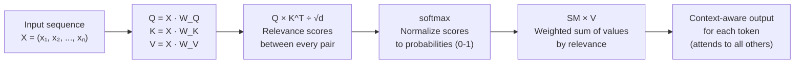

# Self-Attention

## 1. What is it?

**ELI5:** Imagine you're reading "The animal didn't cross the street because it was too tired." To understand what "it" refers to, you look back at "animal" and "street" and figure the most relevant one is "animal." Self-attention does this for EVERY word in a sentence simultaneously — each word looks at every other word to understand the context.



**Simple Explanation:** Self-attention is an attention mechanism where queries, keys, and values all come from the same source. For each token in a sequence, self-attention computes its relationship to every other token, producing a context-aware representation of each token. It's the core innovation of the Transformer architecture.

**Technical Definition:** Self-attention (also called intra-attention) is an attention mechanism that relates different positions within a single sequence to compute a representation of the sequence. Given an input sequence X = (x₁, x₂, ..., xₙ), self-attention computes:
- Q = X · W_Q (queries)
- K = X · W_K (keys)
- V = X · W_V (values)
- Output = softmax(Q · K^T / √d_k) · V

Each output vector is a weighted sum of all input vectors, weighted by how relevant each position is to the current position.


*Visualization of a single attention head computing softmax(Q·K^T)·V. Queries, Keys, and Values all come from the same input sequence.*

## 2. Why do we need it?

**Problem It Solves:**
Before self-attention, sequence modeling approaches had critical limitations:
- **RNNs/LSTMs:** Process tokens left-to-right. Token at position 100 depends on a hidden state that has compressed 99 previous tokens. Long-range information is lost.
- **CNNs:** Fixed receptive field. Must stack many layers to cover long distances. Still can't capture global context.
- **Fixed-window approaches:** Only see N tokens around each position. Can't capture dependencies beyond window.

Self-attention solves these because:
1. **Global receptive field:** Every token directly connects to every other token in one operation
2. **No sequential bottleneck:** All tokens processed in parallel, not step-by-step
3. **Dynamic computation:** Attention weights are computed based on content, not fixed positions

**Pain Without It:**
- **Coreference resolution:** "The trophy wouldn't fit in the suitcase because it was too [big/small]" — without self-attention, models couldn't resolve "it"
- **Sentiment with negation:** "The movie was not bad" — need to connect "not" to "bad" even though they're adjacent but work as a unit
- **Long document understanding:** Connecting the conclusion to evidence presented 5000 words earlier
- **Code understanding:** Matching a function call to its definition across hundreds of lines

**Why Companies Invest:**
- BERT's self-attention improved GLUE benchmark from 80.2 to 93.5 (state of the art)
- Self-attention enabled parallel training: GPT-3 trained in weeks instead of months
- Universal: Works on text, images (ViT), speech (Whisper), proteins (ESM-2)
- Interpretable: Attention weights provide insights into model reasoning

## 3. Real-world Example

| Company | Model | Self-Attention Use | Impact |
|---------|-------|--------------------|--------|
| **OpenAI** | GPT-4 | Decoder self-attention | Coherent multi-paragraph generation |
| **Google** | BERT | Encoder bidirectional self-attention | 10% of Google Search queries improved |
| **Google** | PaLM | Autoregressive self-attention with parallelism | 540B parameter coherent model |
| **Meta** | LLaMA 3 | Full causal self-attention | Open-source LLM competitive with GPT-4 |
| **DeepMind** | AlphaFold2 | Evoformer self-attention (pairwise) | Protein structure prediction solved |
| **NVIDIA** | Megatron-LM | Tensor-parallel self-attention | 530B parameter model training |
| **Microsoft** | DeBERTa | Disentangled self-attention (content+position) | SuperGLUE benchmark leader |

**Google BERT (Bidirectional Encoder Representations from Transformers):**
- Self-attention operates bidirectionally — each token attends to ALL tokens (left and right)
- Pre-trained with Masked Language Model (MLM): randomly mask 15% of tokens, predict them using full context
- Example: "I [MASK] you" → using self-attention over "I" and "you" to predict "love"
- 340M parameters, trained on 3.3B words
- Result: 11 NLP benchmarks broken on release, 10% of Google Search queries improved

**OpenAI GPT-4 (Decoder-only Transformer):**
- Causal self-attention: each token can only attend to itself and previous tokens
- Enables autoregressive generation: predict next token given previous tokens
- 1.8T parameters, 128K token context window
- Self-attention operates over entire context window for coherent long-form generation

## 4. Architecture Diagram (ASCII)

```
                            SELF-ATTENTION LAYER
┌─────────────────────────────────────────────────────────────────────┐
│                                                                     │
│  Sequence: [I] [love] [transformers]                                │
│            │    │       │                                            │
│            ▼    ▼       ▼                                            │
│  ┌───────────────────────────────┐                                  │
│  │       Linear Projections      │                                  │
│  │  W_Q  W_K  W_V  (learned)    │                                  │
│  └───────┬───────┬───────┬───────┘                                  │
│          │       │       │                                            │
│     ┌────┴───┐┌──┴────┐┌┴──────┐                                    │
│     │ Q [3×d]││K [3×d]││V [3×d]│                                    │
│     └────────┘└───────┘└───────┘                                    │
│          │       │       │                                            │
│          └───┬───┘       │                                            │
│              │           │                                            │
│         ┌────▼────┐      │                                            │
│         │  Q·K^T  │      │                                            │
│         │  [3×3]  │      │                                            │
│         │ scores  │      │                                            │
│         └────┬────┘      │                                            │
│              │           │                                            │
│         ┌────▼────┐      │                                            │
│         │ / √d_k  │      │                                            │
│         └────┬────┘      │                                            │
│              │           │                                            │
│         ┌────▼────┐      │                                            │
│         │ Softmax │      │                                            │
│         │ [3×3]   │      │                                            │
│         │ weights │      │                                            │
│         └────┬────┘      │                                            │
│              │           │                                            │
│              └─────┬─────┘                                            │
│                    │ (matrix multiply)                                │
│               ┌────▼────┐                                            │
│               │ Output  │                                            │
│               │ [3×d]   │                                            │
│               └────┬────┘                                            │
│                    │                                                  │
│  Output: [I'_0] [love'_1] [transformers'_2]                          │
│           Each is a weighted sum of all input vectors                 │
└─────────────────────────────────────────────────────────────────────┘

    Attention Weight Matrix (example):
              I    love  transformers
    I        0.9   0.05     0.05
    love     0.1   0.80     0.10
    transformers 0.05 0.15    0.80

    "I" mostly attends to itself
    "love" mostly attends to itself (+ some transformers)
    "transformers" mostly attends to itself (+ some love)
```

## 5. Internal Working

**Step-by-step Execution of Self-Attention:**

**Input:** Sequence of n tokens, each embedded as a d-dimensional vector
**Output:** Sequence of n context-aware vectors, same dimensions

**Step 1 — Create Q, K, V Projections:**
```
Input matrix X:     shape [n × d_model]
Query weights W_Q:  shape [d_model × d_k]
Key weights W_K:    shape [d_model × d_k]
Value weights W_V:  shape [d_model × d_v]

Q = X · W_Q  shape [n × d_k]
K = X · W_K  shape [n × d_k]
V = X · W_V  shape [n × d_v]
```

**Step 2 — Compute Attention Scores:**
```
Scores = Q · K^T    shape [n × n]
Scores[i][j] = dot product between query of token i and key of token j
Higher score = token i should pay more attention to token j
```

**Step 3 — Scale Scores:**
```
Scaled = Scores / √d_k
Prevents large values that push softmax into low-gradient regions
```

**Step 4 — Apply Mask (if causal):**
```
For causal/autoregressive self-attention:
  Mask[i][j] = -∞ if j > i  (can't attend to future)
  Scaled = Scaled + Mask
```

**Step 5 — Softmax Normalization:**
```
Weights = softmax(Scaled, dim=-1)    shape [n × n]
Each row sums to 1 — probability distribution over all tokens
```

**Step 6 — Weighted Sum of Values:**
```
Output = Weights · V    shape [n × d_v]
Output[i] = Σ_j Weights[i][j] · V[j]
Each output is a context-aware representation of token i
```

**Multi-Head Extension:**
- Do steps 1-6 with h different sets of W_Q, W_K, W_V (different heads)
- Concatenate all h outputs: shape [n × h·d_v]
- Final projection: Output · W_O, shape [n × d_model]
- Each head learns different relationship types: syntax, semantics, position

## 6. Production Flow

```
                      SELF-ATTENTION IN A TRANSFORMER
┌──────────────┐
│  Input Tokens │
│  (token IDs)  │
└──────┬───────┘
       │
┌──────▼───────┐
│  Embedding   │   Token → Vector lookup (vocab_size × d_model)
└──────┬───────┘
       │
┌──────▼───────┐
│  Positional  │   Add positional information (sinusoidal or RoPE)
│  Encoding    │
└──────┬───────┘
       │
┌──────▼───────┐
│  Layer Norm  │   Pre-norm: normalize before attention
└──────┬───────┘
       │
┌──────▼───────────────────┐
│  Self-Attention          │
│                          │
│  For each head (parallel):│
│  1. Project → Q, K, V    │
│  2. Q·K^T / √d_k         │
│  3. Apply mask            │
│  4. Softmax               │
│  5. × V                   │
│  6. Concat heads          │
│  7. Output projection     │
└──────┬────────────────────┘
       │
┌──────▼───────┐
│  + Residual  │   output = x + self_attention(x)
└──────┬───────┘
       │
┌──────▼───────┐
│  Feed-Forward │   Two-layer MLP (d_model → 4×d_model → d_model)
│  Network     │
└──────┬───────┘
       │
┌──────▼───────┐
│  + Residual  │   output = x + FFN(x)
└──────┬───────┘
       │
       ▼
  Next Layer (repeated N times)

Production optimizations:
- Flash Attention: fused kernel, O(n) memory, 2-4x speed
- Tensor parallelism: split heads across GPUs
- KV cache in autoregressive decoding
- Quantized Q/K/V projections (FP8/INT4)
```

## 7. HLD (High-Level Design)

```
┌───────────────────────────────────────────────────────────────────┐
│              SELF-ATTENTION SERVING ARCHITECTURE                  │
│                                                                   │
│  ┌──────────┐    ┌──────────┐    ┌───────────────────────┐       │
│  │  Token   │───▶│ Embedder │───▶│                      │       │
│  │  Service │    │          │    │   Self-Attention      │       │
│  └──────────┘    └──────────┘    │   Engine              │       │
│                                   │                       │       │
│  ┌──────────┐    ┌──────────┐    │  ┌─────────────────┐  │       │
│  │  Prefix  │───▶│ KV Cache │───▶│  │ Head 0: Q₀K₀V₀  │  │       │
│  │  Cache   │    │  Manager │    │  │ Head 1: Q₁K₁V₁  │  │       │
│  └──────────┘    └──────────┘    │  │ ...             │  │       │
│                                   │  │ Head h: QₕKₕVₕ  │  │       │
│  ┌──────────┐    ┌──────────┐    │  └────────┬────────┘  │       │
│  │  Memory  │───▶│ Scheduler│───▶│           │            │       │
│  │  Manager │    │(Continuous│   │    ┌──────▼───────┐    │       │
│  └──────────┘    │ Batching) │   │    │  Concat +    │    │       │
│                  └──────────┘    │    │  Output Proj │    │       │
│                                   │    └──────────────┘    │       │
│  ┌──────────────────────────────┐ │                       │       │
│  │  GPU Memory Pool             │ │                       │       │
│  │  ┌─────┬─────┬─────┬─────┐  │ └───────────────────────┘       │
│  │  │ GPU │ GPU │ GPU │ GPU │  │                                  │
│  │  │  0  │  1  │  2  │  3  │  │                                  │
│  │  └─────┴─────┴─────┴─────┘  │                                  │
│  └──────────────────────────────┘                                  │
└───────────────────────────────────────────────────────────────────┘
```

## 8. LLD (Low-Level Design)

```python
# self_attention.py — Production-grade self-attention implementation
import torch
import torch.nn as nn
import torch.nn.functional as F
from typing import Optional, Tuple

class MultiHeadSelfAttention(nn.Module):
    """Multi-head self-attention with optional KV caching."""

    def __init__(self, d_model: int, n_heads: int, dropout: float = 0.1,
                 causal: bool = True, use_flash: bool = True):
        super().__init__()
        assert d_model % n_heads == 0

        self.d_model = d_model
        self.n_heads = n_heads
        self.d_k = d_model // n_heads
        self.causal = causal
        self.use_flash = use_flash

        # Combined QKV projection for efficiency
        self.qkv = nn.Linear(d_model, 3 * d_model, bias=False)
        self.output = nn.Linear(d_model, d_model, bias=False)
        self.dropout = nn.Dropout(dropout)

        self._reset_parameters()

    def _reset_parameters(self):
        nn.init.xavier_uniform_(self.qkv.weight)
        nn.init.xavier_uniform_(self.output.weight)

    def _split_heads(self, x: torch.Tensor) -> torch.Tensor:
        """Split last dimension into (n_heads, d_k)."""
        batch, seq_len, _ = x.shape
        x = x.view(batch, seq_len, self.n_heads, self.d_k)
        return x.transpose(1, 2)  # (batch, n_heads, seq_len, d_k)

    def _combine_heads(self, x: torch.Tensor) -> torch.Tensor:
        """Inverse of split_heads."""
        batch, _, seq_len, _ = x.shape
        x = x.transpose(1, 2).contiguous()
        return x.view(batch, seq_len, self.d_model)

    def forward(
        self,
        x: torch.Tensor,
        mask: Optional[torch.Tensor] = None,
        kv_cache: Optional[dict] = None,
    ) -> Tuple[torch.Tensor, Optional[dict]]:
        batch, seq_len, _ = x.shape

        # Fused QKV projection
        qkv = self.qkv(x)
        q, k, v = qkv.chunk(3, dim=-1)

        q = self._split_heads(q)  # (batch, n_heads, seq_len, d_k)
        k = self._split_heads(k)
        v = self._split_heads(v)

        # KV Cache for autoregressive decoding
        if kv_cache is not None:
            if "k" in kv_cache:
                k = torch.cat([kv_cache["k"], k], dim=2)
                v = torch.cat([kv_cache["v"], v], dim=2)
            kv_cache["k"] = k
            kv_cache["v"] = v

        if self.use_flash and hasattr(F, "scaled_dot_product_attention"):
            # Flash Attention via PyTorch native
            attn_mask = None
            if self.causal and mask is None:
                attn_mask = torch.tensor(
                    ~torch.tril(torch.ones(seq_len, seq_len, device=x.device)).bool()
                )
            elif mask is not None:
                attn_mask = mask

            output = F.scaled_dot_product_attention(
                q, k, v,
                attn_mask=attn_mask,
                dropout_p=self.dropout.p if self.training else 0.0,
                is_causal=self.causal and mask is None,
            )
        else:
            # Manual implementation
            scores = torch.matmul(q, k.transpose(-2, -1)) / (self.d_k ** 0.5)

            if self.causal:
                # Causal mask: prevent attending to future
                causal_mask = torch.triu(
                    torch.ones(seq_len, seq_len, device=x.device, dtype=torch.bool),
                    diagonal=1,
                )
                scores = scores.masked_fill(causal_mask, float("-inf"))

            if mask is not None:
                scores = scores.masked_fill(mask == 0, float("-inf"))

            attn_weights = F.softmax(scores, dim=-1)
            attn_weights = self.dropout(attn_weights)
            output = torch.matmul(attn_weights, v)

        output = self._combine_heads(output)
        output = self.output(output)

        return output, kv_cache


class SelfAttentionLayer(nn.Module):
    """Complete Transformer layer with pre-norm."""

    def __init__(self, d_model: int, n_heads: int, d_ff: int = None,
                 dropout: float = 0.1, causal: bool = True):
        super().__init__()
        d_ff = d_ff or 4 * d_model

        self.norm1 = nn.LayerNorm(d_model)
        self.self_attn = MultiHeadSelfAttention(d_model, n_heads, dropout, causal)
        self.norm2 = nn.LayerNorm(d_model)
        self.ffn = nn.Sequential(
            nn.Linear(d_model, d_ff),
            nn.GELU(),
            nn.Dropout(dropout),
            nn.Linear(d_ff, d_model),
            nn.Dropout(dropout),
        )

    def forward(self, x: torch.Tensor, mask: Optional[torch.Tensor] = None,
                kv_cache: Optional[dict] = None) -> Tuple[torch.Tensor, Optional[dict]]:
        # Pre-norm: norm before attention (more stable than post-norm)
        attn_out, kv_cache = self.self_attn(self.norm1(x), mask, kv_cache)
        x = x + attn_out
        x = x + self.ffn(self.norm2(x))
        return x, kv_cache
```

## 9. Python Implementation

```python
# self_attention_server.py — FastAPI service
import torch
import torch.nn as nn
from fastapi import FastAPI, HTTPException
from pydantic import BaseModel, Field
from prometheus_client import Histogram, Counter
import time
import uuid

SA_LATENCY = Histogram("self_attention_latency_ms", "Self-attention compute latency")
SA_COUNT = Counter("self_attention_calls_total", "Total self-attention calls")

app = FastAPI(title="Self-Attention Service", version="1.0.0")

class SelfAttentionRequest(BaseModel):
    tokens: list[list[float]]  # (seq_len, d_model)
    causal: bool = True
    use_cache: bool = False

class SelfAttentionResponse(BaseModel):
    output: list[list[float]]
    latency_ms: float
    request_id: str

# Initialize model (production: load from checkpoint)
MODEL = MultiHeadSelfAttention(d_model=512, n_heads=8, causal=True)
MODEL.eval()

@app.post("/self-attention", response_model=SelfAttentionResponse)
async def compute_self_attention(request: SelfAttentionRequest):
    start = time.perf_counter()
    request_id = str(uuid.uuid4())
    SA_COUNT.inc()

    try:
        x = torch.tensor(request.tokens).unsqueeze(0)  # (1, seq_len, d_model)
        with torch.no_grad():
            output, _ = MODEL(x)

        latency = (time.perf_counter() - start) * 1000
        SA_LATENCY.observe(latency)

        return SelfAttentionResponse(
            output=output.squeeze(0).tolist(),
            latency_ms=round(latency, 2),
            request_id=request_id,
        )
    except Exception as e:
        raise HTTPException(status_code=500, detail=str(e))
```

## 10. Folder Structure

```
self-attention-platform/
├── api/
│   └── server.py
├── model/
│   ├── __init__.py
│   ├── self_attention.py   # MHA implementation
│   ├── flash_attention.py  # Flash attention wrapper
│   ├── causal_mask.py      # Causal mask utilities
│   └── config.py
├── engine/
│   ├── inference.py        # Generation loop
│   ├── kv_cache.py         # Cache management
│   └── batching.py         # Continuous batching
├── tests/
│   ├── test_self_attention.py
│   └── test_flash.py
├── config.yaml
└── Dockerfile
```

## 11. Configuration

```yaml
self_attention:
  d_model: 4096
  n_heads: 32
  n_kv_heads: 8  # Grouped-query attention
  dropout: 0.0
  causal: true
  use_flash_attn: true
  attention_bias: false
  layer_norm_epsilon: 1e-5

flash_attention:
  enabled: true
  kernel: "triton"  # triton, cutlass, or pytorch
  causal: true
  softmax_scale: null  # auto-compute from d_k
```

## 12. Flowchart

```
                       SELF-ATTENTION FLOW
                              │
                    ┌─────────▼──────────┐
                    │  Input Sequence X   │
                    │  [n × d_model]      │
                    └─────────┬──────────┘
                              │
              ┌───────────────┼───────────────┐
              │               │               │
         ┌────▼────┐    ┌────▼────┐    ┌────▼────┐
         │  Q =    │    │  K =    │    │  V =    │
         │ X · W_Q │    │ X · W_K │    │ X · W_V │
         └────┬────┘    └────┬────┘    └────┬────┘
              └───────┬──────┘              │
                      │                     │
                 ┌────▼────┐                │
                 │ Q·K^T   │                │
                 │ [n×n]   │                │
                 └────┬────┘                │
                      │                     │
                 ┌────▼────┐                │
                 │ ÷ √d_k   │                │
                 └────┬────┘                │
                      │                     │
                 ┌────▼────┐                │
                 │ Mask    │                │
                 │(Causal) │                │
                 └────┬────┘                │
                      │                     │
                 ┌────▼────┐                │
                 │Softmax  │                │
                 │ [n×n]   │                │
                 └────┬────┘                │
                      └──────────┬──────────┘
                                 │
                            ┌────▼────┐
                            │ × V     │
                            │ [n×d_v] │
                            └────┬────┘
                                 │
                            ┌────▼────┐
                            │ Output  │
                            │ [n×d_v] │
                            └─────────┘
```

## 13. Sequence Diagram

```
Token 1 (Query)          Token 2 (Key)         Token 3 (Value)         Output
     │                       │                       │                    │
     │── Compute Q₁ ────────►│                       │                    │
     │◄── K₁, K₂, K₃ ───────│                       │                    │
     │                       │                       │                    │
     │── Score: Q₁·K₁^T ────►│                       │                    │
     │── Score: Q₁·K₂^T ─────│──────────────────────►│                    │
     │── Score: Q₁·K₃^T ─────│───────────────────────│                   │
     │                       │                       │                    │
     │── Softmax ────────────│───────────────────────│                   │
     │                       │                       │                    │
     │── Weighted Sum ───────│───────────────────────│                   │
     │                       │                       │── Output₁ ───────►│
     │                       │                       │                    │
     │                       │                       │                    │
     │── Token 2 repeats ────│───────────────────────│─ Output₂ ────────►│
     │── For every token ────│───────────────────────│─ Output_n ───────►│
     │                       │                       │                    │
```

## 14. Pros

1. **Global Context:** Every token accesses ALL other tokens in one step. No information bottleneck.

2. **Parallel Computation:** Unlike RNNs, self-attention processes all tokens simultaneously. Training is embarrassingly parallel.

3. **O(1) Path Length:** The maximum path length between any two tokens is 1 (direct attention). RNNs have O(n) path length.

4. **Dynamic Weights:** Attention is content-based, not position-based. Tokens determine their own receptive field.

5. **Multi-head expressivity:** Each head learns different aspects (subject-verb agreement, coreference, semantics, syntax).

6. **Interpretable:** Attention weights visualized as heat maps reveal what the model "looks at."

7. **Stable Training:** Residual connections + layer norm + no recurrence → less prone to vanishing/exploding gradients.

## 15. Cons

1. **Quadratic Complexity:** O(n² × d) computation and memory for n tokens. 128K tokens → 16B attention scores.

2. **No Positional Information:** Self-attention is permutation-invariant. Must add position encoding separately.

3. **Memory Bandwidth Bound:** Autoregressive decoding needs to read all key-value pairs at each step.

4. **Over-attention to special tokens:** Models often attend disproportionately to separator/padding tokens.

5. **Single vector representation:** Each token is a single vector regardless of context complexity.

6. **Fixed-length attention span:** Must manage context window limits.

7. **Attention concentration:** Some tokens ("the", "a") get disproportionate attention weight.

## 16. Alternatives

| Mechanism | Complexity | Quality | Use Case |
|-----------|-----------|---------|----------|
| **Full self-attention** | O(n²) | Best | General purpose (n < 8192) |
| **Sliding window** | O(n × w) | Good | Streaming, local context |
| **Dilated sliding window** | O(n × w × log n) | Very good | Long documents |
| **Global + local** | O(n × (g + w)) | Excellent | Long-form generation |
| **Sinkhorn/Top-k** | O(nk) | Good | Sparse attention |
| **Linear attention** | O(n) | Adequate | Extreme long sequences |
| **Linformer** | O(n) | Good (up to 4K) | Document classification |
| **Performer (FAVOR+)** | O(n) | Good | Protein sequences |
| **State Space Models** | O(n) | Very good (2024) | Mamba, efficient alternatives |

## 17. Performance Considerations

**Compute Profile (70B Transformer inference):**
- **Prefill (prompt processing):** 95% time in self-attention (compute-bound)
- **Decode (token generation):** 80% time in self-attention KV cache reads (memory-bound)
- **FFN:** 20% of time in decode (weight read + compute)

**Optimization Strategies:**

| Technique | Speedup | Overhead |
|-----------|---------|----------|
| Flash Attention v1/v2/v3 | 2-4x | None (kernel replacement) |
| KV cache quantization | 2x memory, 1.2x speed | Minimal quality loss |
| Grouped-query attention | 2-8x KV cache reduction | <1% quality loss |
| Tensor parallelism | Linear scaling | Communication overhead |
| PagedAttention | 3x memory efficiency | None |
| Speculative decoding | 2-3x decode speed | Draft model overhead |

**Memory Breakdown (70B, 8192 context, FP16):**
- Weights: ~140GB
- KV cache: ~40GB
- Activations: ~20GB
- Total: ~200GB per GPU → requires 4x A100-80GB with tensor parallelism

## 18. Scaling to Millions

**Data Parallelism:**
```
┌─────────┐  ┌─────────┐  ┌─────────┐
│ GPU 0   │  │ GPU 1   │  │ GPU N-1 │
│ Batch 0 │  │ Batch 1 │  │ Batch N │
│ SA      │  │ SA      │  │ SA      │
└────┬────┘  └────┬────┘  └────┬────┘
     └──────┬──────┘           │
            │ All-reduce gradients
            ▼
       ┌─────────┐
       │ Optimizer│
       └─────────┘
```

**Tensor Parallelism (Megatron-LM style):**
Split heads across GPUs:
```
GPU 0: heads 0-7     GPU 1: heads 8-15
GPU 2: heads 16-23   GPU 3: heads 24-31

Each GPU computes its portion of self-attention
All-reduce for output projection (f_{g} barrier)
```

**Scaling to 10M+ daily requests:**
1. Model parallelism across 8+ GPUs per instance
2. Multiple instances behind load balancer
3. Prefix-based routing to reuse KV cache
4. Dynamic batching: 256+ requests per GPU batch
5. Autoscaling: target 70% GPU utilization
6. Cost optimization: spot instances for batch, on-demand for interactive

## 19. Failure Scenarios

| Failure | Symptom | Root Cause | Mitigation |
|---------|---------|------------|------------|
| **Attention collapse** | All weights uniform | Saturated softmax | Gradient clipping, check d_k |
| **Causal mask missing** | Model sees future tokens | Bug in mask construction | Unit test mask shapes |
| **Flash Attention NaN** | Loss spikes | Numerical overflow in FP16 | Use BF16, increase epsilon |
| **KV cache OOM** | Request rejected | Too many cached sequences | LRU eviction, admission control |
| **Position overflow** | Quality drops > max len | RoPE extrapolation fails | NTK-aware scaling, interpolation |
| **Head dimension mismatch** | Shape error | Config mismatch d_model/n_heads | Validation at model load |
| **Attention to BOS/EOS** | Degenerate output | Model learns positional bias | Drop BOS attentions, logging |

## 20. Security

| Threat | Impact | Mitigation |
|--------|--------|------------|
| **Attention manipulation** | Adversarial inputs control attention weights | Input sanitization, adversarial training |
| **Membership inference** | Determine if text was in training data | Differential privacy during training |
| **Prompt injection via attention** | Override system prompt | Perplexity filter, separate attention for system vs user |
| **Cache poisoning** | Inject malicious entries into KV cache | Cache key hashing, authenticated prefixes |
| **Side-channel timing** | Extract prompt length | Padding to fixed sizes |

## 21. Monitoring

```yaml
self_attention_metrics:
  - name: attention_entropy
    type: gauge
    help: "Entropy of attention distribution per head"
    labels: [layer, head]
  - name: attention_sparsity
    type: gauge
    help: "Fraction of weights < 0.01"
  - name: attention_max_weight
    type: gauge
    help: "Maximum attention weight"
  - name: kv_cache_usage_gb
    type: gauge
  - name: self_attention_latency_ms
    type: histogram
    labels: [method]  # prefill, decode
    buckets: [0.1, 0.5, 1, 2, 5, 10, 50, 100]

alerts:
  - condition: attention_entropy < 0.1 over 5m
    severity: warning
    description: "Attention collapse detected"
  - condition: kv_cache_usage_gb > 0.9 * total_gpu_memory
    severity: critical
    action: "Evict cache entries, reject new requests"
```

## 22. Interview Questions

**Beginner:**
- Q: What is self-attention?
  A: An attention mechanism where Q, K, V all come from the same sequence. Each token attends to all other tokens to build context-aware representations.

- Q: What's the difference between self-attention and regular attention?
  A: Regular attention is cross-attention (Q from one sequence, K,V from another). Self-attention has Q,K,V from the same sequence.

**Intermediate:**
- Q: Why is self-attention O(n²)?
  A: Each of n tokens computes a similarity score with every other token → n × n attention matrix. For 100K tokens: 10B scores.

- Q: What is multi-head self-attention?
  A: Running h independent self-attention operations in parallel, each with separate Q/K/V projections. Heads capture different relationship types. Outputs are concatenated and projected.

**Senior:**
- Q: How does causal masking work in self-attention?
  A: Upper triangular matrix of -∞ ensures token i can only attend to tokens j ≤ i. The mask is added to scores before softmax, so masked positions get zero attention weight.

- Q: Why does Flash Attention use tiling?
  A: To fit Q/K/V blocks in GPU shared memory (fast SRAM) instead of writing the full n×n attention matrix to HBM (slow). Reduces memory reads/writes from O(n²) to O(n).

**Staff Engineer:**
- Q: Design a self-attention mechanism that can handle 1M token context.
  A: Combine: (1) Sliding window attention (local context). (2) Global tokens every 128 positions. (3) Sparse attention with strided pattern. (4) Flash Attention for efficient compute. Or use Ring Attention to distribute across GPUs with overlapping compute and communication.

**Architect:**
- Q: Why did the industry converge on decoder-only self-attention instead of encoder-decoder?
  A: (1) Simpler architecture — one stack instead of two. (2) Casual LM objective scales better with data. (3) In-context learning emerges naturally from autoregressive training. (4) Encoder-decoder has cross-attention complexity penalty. (5) Pre-fill + decode pattern works well with KV caching.

## 23. Cheat Sheet

```
┌─────────────────────────────────────────────────────────────────────┐
│                    SELF-ATTENTION CHEAT SHEET                       │
├─────────────────────────────────────────────────────────────────────┤
│                                                                    │
│  FORMULA: Attention(Q,K,V) = softmax(Q·K^T / √d_k) · V            │
│                                                                    │
│  Q = X·W_Q,  K = X·W_K,  V = X·W_V  (all from same X)            │
│                                                                    │
│  KEY PARAMETERS:                                                    │
│  d_model  = hidden dimension                                       │
│  d_k      = d_model / n_heads (head dimension, typically 64-128)   │
│  n_heads  = number of attention heads                              │
│                                                                    │
│  COMPLEXITY: O(n² · d_k)  where n = sequence length                │
│                                                                    │
│  TYPES:                                                             │
│  ┌─────────────────────────────────────────────────────┐           │
│  │ Encoder: bidirectional (sees all tokens)            │           │
│  │ Decoder: causal (sees only past + current)          │           │
│  │ Prefix: causal within prefix, bidirectional beyond │           │
│  └─────────────────────────────────────────────────────┘           │
│                                                                    │
│  OPTIMIZATIONS:                                                     │
│  FlashAttention: fused kernel, no O(n²) memory writes              │
│  PagedAttention: vLLM, no fragmentation                            │
│  GQA/MQA: shared K,V across query heads                           │
│  KV Cache: store K,V for autoregressive reuse                      │
│                                                                    │
│  DEBUGGING:                                                        │
│  If attention entropy < 0.01: overconfidence, possible collapse    │
│  If attention entropy > 5.0 (normalized): underfitting, noisy      │
│  If max weight < 0.1: token is "ignoring" everything              │
└─────────────────────────────────────────────────────────────────────┘
```

## 24. Common Mistakes

1. **Confusing self-attention with cross-attention:** Self-attention operates within one sequence; cross-attention connects two sequences.

2. **Forgetting the causal mask:** Decoder self-attention without mask lets the model "cheat" by seeing future tokens.

3. **Wrong head dimension:** `d_k` must divide `d_model` evenly. 4096 dim with 33 heads fails.

4. **No dropout regularization on attention:** During training, dropout on attention weights prevents co-adaptation of heads. At inference, dropout must be 0.

5. **Inefficient single-head implementation:** Use combined QKV projection (one Linear layer, output = 3×d_model) instead of three separate layers.

6. **Not using Flash Attention:** Your self-attention is 2-4x slower and uses O(n²) memory unnecessarily.

7. **Applying softmax before masking:** Mask must be applied before softmax (set to -∞) not after (set to 0). Otherwise, the masked positions still "steal" probability mass.

8. **Assuming all heads are equally important:** Some heads can be pruned (at inference) with <1% quality loss. Always analyze head importance.

## 25. Production Best Practices

1. **Use Flash Attention always:** Replace manual self-attention with `torch.nn.functional.scaled_dot_product_attention` + `is_causal=True`. 2-4x faster, O(n) memory.

2. **Fused QKV projection:** Single Linear(3 × d_model) instead of three separate Linear(d_model) layers. 3x fewer memory reads.

3. **Grouped-Query Attention (GQA):** Use 8 KV heads for every 32 query heads. 4x smaller KV cache, near-zero quality loss.

4. **Prefill efficiently:** During prompt processing, compute self-attention on all prompt tokens at once (not autoregressively). This is compute-optimal.

5. **Continuous batching:** Don't wait for generation to finish. Use iteration-level scheduling (vLLM) to batch requests at different generation steps.

6. **KV cache eviction:** LRU policy for cached sequences. Target <80% GPU memory usage.

7. **Monitor per-head entropy:** If a head's entropy drops below 0.01 for 10K+ steps, it has "collapsed" — prune or reinitialize.

8. **Check numerical stability:** BF16 self-attention needs higher epsilon in layer norm (1e-5 vs 1e-12). Test with extreme sequence lengths.

9. **Profile attention time:** If self-attention is <30% of decode time, your batch size may be too small. If >70%, implement Flash Attention or reduce context length.

10. **Positional encoding matters for extrapolation:** RoPE with NTK-aware scaling extends context window 8-16x beyond training length.
