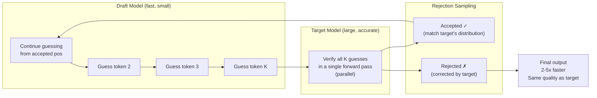

# Speculative Decoding

## 1. What is it?

**ELI5:** Imagine writing an essay one letter at a time. It's slow. But if you quickly guess the next 5 letters for each step (even if sometimes wrong), and your teacher only verifies your guesses, you might write 3x faster. If a guess is wrong, the teacher corrects it and you continue from there. Speculative decoding is the AI version of this — a fast "draft" model guesses several tokens ahead, and a slow "target" model verifies them in parallel.



**Simple Explanation:** Speculative decoding is a technique to accelerate autoregressive generation by using a fast, cheap draft model to propose multiple candidate tokens, which are then verified in parallel by the large target model. Since verification can be done in one forward pass (processing all draft tokens at once), the target model's sequential work is reduced. The output distribution is mathematically identical to the target model alone — no quality loss.

**Technical Definition:** Speculative decoding (Leviathan et al., 2022; Chen et al., 2023) accelerates autoregressive LLM inference by having a draft model M_q quickly generate K candidate tokens per step, then using the target model M_p to verify all K tokens in parallel. The verification uses rejection sampling to ensure the final distribution matches M_p exactly. Given draft acceptance rate α, the speedup is approximately 1/(1-α+α/K). For α=0.8, K=5, speedup ≈ 2.7x. The key insight: the target model's single forward pass over K tokens is 2-5x faster than K sequential passes, because it's compute-bound (parallel) rather than memory-bound (sequential).

## 2. Why do we need it?

**Problem It Solves:**
Autoregressive decoding is sequential and memory-bandwidth bound:
- Each token generation requires reading the full model weights from HBM (140GB for 70B)
- Latency per token = weights_read / memory_bandwidth
- A100: 140GB / 2TB/s = 70ms per token → ~15 tokens/sec
- Faster GPUs (H100: 3.35TB/s) still only achieve ~24 tokens/sec for large models

**Pain Without It:**
- Interactive applications need 50+ tokens/sec for natural conversation
- 70B model on A100 generates only 10-15 tokens/sec → response time 30+ seconds for 300 tokens
- Scaling to more users requires proportionally more GPUs
- Latency-sensitive applications (real-time translation, coding autocomplete) impossible with large models

**Why Companies Invest:**
- 2-3x latency reduction without quality loss (same model, same outputs)
- 2x throughput improvement on same hardware
- Enables deploying large models (70B+) for latency-sensitive applications
- Draft model can be 1/10 the size, run on cheaper hardware (CPU/edge)

## 3. Real-world Example

| Company | Target Model | Draft Model | Speedup | Deployment |
|---------|-------------|-------------|---------|------------|
| **Google** | PaLM 2 (540B) | ~2B distilled | 2.8x | Vertex AI |
| **Anthropic** | Claude 3 | Internal draft | ~2x | Claude API |
| **OpenAI** | GPT-4 | GPT-4 mini (est.) | ~2x | ChatGPT |
| **Meta** | LLaMA 3 70B | LLaMA 3 8B | ~2.5x | Open-source |
| **DeepMind** | Chinchilla | Student model | 2x | Internal |
| **Mistral** | Mixtral 8x7B | Mistral 7B | ~1.5x | Le Chat |

**Example — LLaMA 3 70B + LLaMA 3 8B draft:**
- Target: LLaMA 3 70B (140B active params, 10 tokens/sec on A100)
- Draft: LLaMA 3 8B (8B params, 80 tokens/sec on A100)
- Acceptance rate: ~0.7-0.85 (higher for predictable text, lower for creative)
- K=5: Each step proposes 5 tokens, expects ~4 accepted
- Effective speed: ~27 tokens/sec (2.7x improvement)
- Quality: mathematically identical to sole 70B generation

## 4. Architecture Diagram (ASCII)

```
                    SPECULATIVE DECODING FLOW

┌─────────────────────────────────────────────────────────────────────┐
│  TARGET MODEL (Large, slow)          DRAFT MODEL (Small, fast)     │
│  ┌─────────────────────────────┐     ┌──────────────────────────┐  │
│  │ LLaMA 3 70B                │     │ LLaMA 3 8B               │  │
│  │ 80 layers, 8192 hidden     │     │ 32 layers, 4096 hidden   │  │
│  │ ~140 GB weights            │     │ ~16 GB weights           │  │
│  │ 10-15 tokens/sec           │     │ 80-100 tokens/sec        │  │
│  └─────────────────────────────┘     └──────────────────────────┘  │
└─────────────────────────────────────────────────────────────────────┘

    Step 1: Draft Generation (autoregressive, fast)
    ┌──────────────────────────────────────────────┐
    │ Draft: [t₁] → [t₁, t₂] → [t₁, t₂, t₃] → ...│
    │                         K=5 tokens           │
    └──────────────────────────────────────────────┘

    Step 2: Target Verification (parallel, one forward pass)
    ┌──────────────────────────────────────────────┐
    │ Target processes: [t₀, t₁, t₂, t₃, t₄, t₅]  │
    │                KV ──────────► K Cache ────► │
    │    (input tokens all at once)                │
    │    Output logits: p₀, p₁, p₂, p₃, p₄, p₅    │
    └──────────────────────────────────────────────┘

    Step 3: Rejection Sampling (exact distribution match)
    ┌──────────────────────────────────────────────┐
    │ For each k in 1..K:                           │
    │   r ~ Uniform(0,1)                            │
    │   Accept if r < min(1, p_target / p_draft)   │
    │                                                │
    │ Accept: t₁, t₂, t₃, t₄                        │
    │ Reject: t₅ (modification)                     │
    │ Sample new t₅ from modified distribution      │
    │                                                │
    │ Output: [t₁, t₂, t₃, t₄, t₅_corrected]       │
    └──────────────────────────────────────────────┘

    Because rejection sampling corrects distributions:
    P_spec(output) = P_target(output)  ← exact match!
```

## 5. Internal Working

**Step-by-step Speculative Decoding:**

**Setup:**
- Target model M_p (large, e.g., 70B)
- Draft model M_q (small, e.g., 7B)
- K: number of draft tokens per step (typical: 4-8)

**Step 1 — Draft Generation:**
- Starting from current prefix (x_1, ..., x_t), run M_q autoregressively for K steps
- Generate draft tokens: ~x_{t+1}, ~x_{t+2}, ..., ~x_{t+K}
- Each step uses M_q's own KV cache (fast, small model)
- Store M_q's logits/probabilities for each draft position

**Step 2 — Target Verification:**
- Concatenate prefix + all K draft tokens
- Run one forward pass of M_p on this sequence
- Process all K new tokens in parallel (single forward pass, no sequential bottleneck)
- Store M_p's logits/probabilities for each draft position
- Also update M_p's KV cache with all verified prefix

**Step 3 — Rejection Sampling:**
- For each position i from 1 to K:
  - Let p = M_p(x_{t+i} | x_{<t+i}) — target model probability
  - Let q = M_q(x_{t+i} | x_{<t+i}) — draft model probability
  - Accept draft token if:
    ```
    r < min(1, p / q)   where r ~ Uniform(0,1)
    ```
  - If rejected:
    - Sample from modified distribution: y ~ max(0, p - q) normalized
    - Output y, discard remaining draft tokens
    - KV cache truncated to accepted prefix
- If all K accepted:
  - Sample one additional token from M_p (the K+1th position)
  - Output it (bonus token)

**Why This Preserves the Distribution:**
- Rejection sampling corrects the draft distribution to match target
- If draft predicts exactly the same distribution as target (q = p): always accept (guaranteed)
- If draft diverges from target: correction probability ensures exact match
- Formally proved in Leviathan et al. 2022: output distribution of speculative decoding = output distribution of target model alone

**Expected Speedup:**
```
Speedup = 1 / (1 - α + α/K)
Where:
  α = expected acceptance rate per token
  K = number of draft tokens

α=0.7, K=5 → 2.1x
α=0.8, K=5 → 2.7x
α=0.9, K=5 → 3.6x
α=0.8, K=10 → 3.6x
```

## 6. Production Flow

```
                    SPECULATIVE DECODING PRODUCTION FLOW

┌──────────────┐    ┌──────────────┐    ┌──────────────┐
│ Request      │───▶│ Prefix       │───▶│ Draft        │
│ (prompt)     │    │ (KV cache    │    │ Generation   │
│              │    │  from target)│    │ M_q: K tokens│
└──────────────┘    └──────────────┘    │ autoreg.     │
                                         │ ~80 tok/sec  │
                                         └──────┬───────┘
                                                │
                                         ┌──────▼───────┐
                                         │ Target        │
                                         │ Verification  │
                                         │ M_p: forward  │
                                         │ pass on K     │
                                         │ tokens        │
                                         │ (parallel)    │
                                         └──────┬───────┘
                                                │
                                         ┌──────▼───────┐
                                         │ Rejection     │
                                         │ Sampling      │
                                         │ (vector ops)  │
                                         └──────┬───────┘
                                                │
                              ┌─────────────────┼──────────────┐
                              │                 │              │
                         ┌────▼────┐      ┌─────▼─────┐  ┌────▼────┐
                         │ Accept  │      │ Partial   │  │ Reject  │
                         │ All K   │      │ Accept    │  │ All     │
                         │ + bonus │      │ (<K)      │  │ (rare)  │
                         │ token   │      │ + correct │  │ + normal│
                         └────┬────┘      └─────┬─────┘  └────┬────┘
                              │                 │              │
                              └─────────┬───────┘              │
                                        │                      │
                                        ▼                      ▼
                               ┌──────────────┐      ┌──────────────┐
                               │ Update KV    │      │ Restart from │
                               │ Cache (both  │      │ corrected pos│
                               │ models)      │      │              │
                               └──────────────┘      └──────────────┘

Production considerations:
- Draft model co-located with target (same GPU or separate)
- KV cache sharing: draft and target can share if same architecture
- Adaptive K: adjust based on recent acceptance rate
- Staged verification: verify in chunks (K=2 → K=4 → K=8 based on acceptance)
- Fallback to standard decode when speculation overhead > savings
```

## 7. HLD (High-Level Design)

```
┌─────────────────────────────────────────────────────────────────────┐
│                SPECULATIVE DECODING SYSTEM (HLD)                   │
│                                                                     │
│  ┌────────────┐    ┌─────────────────────────────────────────┐     │
│  │ Request    │───▶│  Speculative Decoder                     │     │
│  │ Queue      │    │                                          │     │
│  └────────────┘    │  ┌──────────┐    ┌──────────────────┐    │     │
│                     │  │ Draft    │───▶│ Autoregressive   │    │     │
│  ┌────────────┐    │  │ Scheduler│    │ Draft Generate   │    │     │
│  │ Prefix     │───▶│  └──────────┘    └──────────────────┘    │     │
│  │ Cache      │    │                                          │     │
│  │ (Redis)    │    │  ┌──────────────────────────────────┐    │     │
│  └────────────┘    │  │  Target Verification Engine       │    │     │
│                     │  │  ┌──────────────────────────┐   │    │     │
│  ┌────────────┐    │  │  │ Forward pass over K tokens│   │    │     │
│  │ Draft      │    │  │  │ (Flash Attention, KV      │   │    │     │
│  │ Model Pool │───▶│  │  │  cache append)            │   │    │     │
│  │ (GPU: 7B)  │    │  │  └──────────────────────────┘   │    │     │
│  └────────────┘    │  └──────────────────────────────────┘    │     │
│                     │                                          │     │
│  ┌────────────┐    │  ┌──────────────────────────────────┐    │     │
│  │ Target     │───▶│  │  Rejection Sampler               │    │     │
│  │ Model Pool │    │  │  ┌──────────────────────────┐   │    │     │
│  │ (GPU: 70B) │    │  │  │ Compare p vs q per token │   │    │     │
│  └────────────┘    │  │  │ Correct distribution      │   │    │     │
│                     │  │  │ Sample accepted tokens    │   │    │     │
│  ┌────────────┐    │  │  └──────────────────────────┘   │    │     │
│  │ Monitor    │───▶│  └──────────────────────────────────┘    │     │
│  │ Acceptance │    └─────────────────────────────────────────┘     │
│  │ Rate       │                                                   │
│  └────────────┘                                                   │
└─────────────────────────────────────────────────────────────────────┘
```

## 8. LLD (Low-Level Design)

```python
# speculative_decoding.py — Production implementation
import torch
import torch.nn.functional as F
from typing import Optional, Callable
from dataclasses import dataclass

@dataclass
class SpecDecConfig:
    K: int = 5  # Number of draft tokens per step
    adaptive_K: bool = True
    max_K: int = 10
    min_K: int = 1
    acceptance_target: float = 0.8  # Target acceptance rate
    fallback_threshold: float = 0.3  # If acceptance < threshold, use standard decode

class DraftModel:
    """Fast draft model for speculation."""
    def __init__(self, model_fn: Callable, max_batch: int = 64):
        self.model_fn = model_fn  # Wrapper around actual model
        self.kv_cache = {}

    @torch.no_grad()
    def generate(self, input_ids: torch.Tensor, K: int) -> tuple:
        """Autoregressively generate K draft tokens."""
        draft_tokens = []
        draft_probs = []

        for _ in range(K):
            logits, _ = self.model_fn(input_ids, kv_cache=self.kv_cache)
            next_logits = logits[:, -1, :]
            probs = F.softmax(next_logits, dim=-1)
            next_token = torch.multinomial(probs, num_samples=1)

            draft_tokens.append(next_token)
            draft_probs.append(probs)
            input_ids = next_token

        return torch.cat(draft_tokens, dim=1), torch.stack(draft_probs, dim=1)

    def reset_cache(self):
        self.kv_cache = {}


class TargetModel:
    """Large target model for verification."""
    def __init__(self, model_fn: Callable):
        self.model_fn = model_fn
        self.kv_cache = {}

    @torch.no_grad()
    def verify(self, input_ids: torch.Tensor) -> torch.Tensor:
        """Single forward pass over entire sequence."""
        logits, self.kv_cache = self.model_fn(input_ids, kv_cache=self.kv_cache)
        return logits

    def reset_cache(self):
        self.kv_cache = {}


class RejectionSampler:
    """Corrects draft distribution to match target distribution."""

    @staticmethod
    def sample(logits_target: torch.Tensor, logits_draft: torch.Tensor,
               draft_tokens: torch.Tensor) -> tuple:
        """
        Perform rejection sampling.
        Returns: (accepted_tokens, num_accepted, need_bonus)
        """
        n = draft_tokens.size(-1)

        # Get probabilities for the sampled tokens only
        target_probs = F.softmax(logits_target, dim=-1)
        draft_probs = F.softmax(logits_draft, dim=-1)

        # Probabilities of the actually sampled tokens
        p_target = target_probs.gather(-1, draft_tokens.unsqueeze(-1)).squeeze(-1)
        p_draft = draft_probs.gather(-1, draft_tokens.unsqueeze(-1)).squeeze(-1)

        # Acceptance criterion
        random_vals = torch.rand_like(p_target)
        accepted = random_vals < torch.minimum(torch.ones_like(p_target), p_target / p_draft.clamp(min=1e-8))

        # Find first rejection
        first_reject = (accepted == 0).int().argmax(dim=-1)

        # Special case: all accepted
        if first_reject.item() == 0 and accepted.all().item():
            # Sample one bonus token from target
            bonus_logits = logits_target[:, -1, :]
            bonus_token = torch.multinomial(F.softmax(bonus_logits, dim=-1), 1)
            return draft_tokens, n, bonus_token, True

        # Partial acceptance
        num_accepted = first_reject.item()
        accepted_tokens = draft_tokens[:, :num_accepted]

        # For the rejected position, sample from corrected distribution
        idx = first_reject.item()
        corrected_probs = F.relu(target_probs[:, idx, :] - draft_probs[:, idx, :])
        corrected_probs = corrected_probs / corrected_probs.sum(dim=-1, keepdim=True)
        corrected_token = torch.multinomial(corrected_probs, 1)

        all_tokens = torch.cat([accepted_tokens, corrected_token], dim=-1)

        return all_tokens, num_accepted, None, False


class SpeculativeDecoder:
    """Main speculative decoding orchestrator."""

    def __init__(self, draft_model: DraftModel, target_model: TargetModel,
                 config: SpecDecConfig):
        self.draft = draft_model
        self.target = target_model
        self.config = config
        self.sampler = RejectionSampler()
        self.running_acceptance = 1.0
        self.total_verified = 0
        self.total_accepted = 0

    @torch.no_grad()
    def generate(self, input_ids: torch.Tensor, max_new_tokens: int = 256) -> list:
        """Generate tokens with speculative decoding."""
        generated = []
        target_pos = input_ids.size(-1)
        K = self.config.K

        while len(generated) < max_new_tokens:
            # Step 1: Draft generation
            draft_start = input_ids[:, -1:] if len(generated) > 0 else input_ids
            draft_tokens, draft_probs = self.draft.generate(draft_start, K)

            # Step 2: Target verification (single forward pass)
            full_input = torch.cat([input_ids, draft_tokens], dim=-1)
            logits_target = self.target.verify(full_input)

            # Get draft logits for rejection sampling
            # (These are from the draft model's KV cache during generation)
            logits_draft = self._get_draft_logits(self.draft.kv_cache)

            # Step 3: Rejection sampling
            tokens, n_accepted, bonus, all_accepted = self.sampler.sample(
                logits_target[:, -(K+1):], logits_draft[:, -K:], draft_tokens
            )

            # Update stats
            self.total_verified += K
            self.total_accepted += n_accepted
            self.running_acceptance = self.total_accepted / max(self.total_verified, 1)

            # Output tokens
            output_tokens = tokens[:, :min(n_accepted + 1, max_new_tokens - len(generated))]
            generated.extend(output_tokens[0].tolist())

            # Update input_ids for next iteration
            input_ids = torch.cat([input_ids, tokens[:, :n_accepted + 1]], dim=-1)

            # Update K adaptively
            if self.config.adaptive_K:
                if self.running_acceptance > self.config.acceptance_target + 0.1:
                    K = min(K + 1, self.config.max_K)
                elif self.running_acceptance < self.config.acceptance_target - 0.1:
                    K = max(K - 1, self.config.min_K)

            # Fall back to standard decode if acceptance rate too low
            if self.running_acceptance < self.config.fallback_threshold:
                # Standard autoregressive decode
                for _ in range(10):
                    logits, self.target.kv_cache = self.target.model_fn(
                        input_ids[:, -1:], kv_cache=self.target.kv_cache
                    )
                    token = torch.multinomial(F.softmax(logits[:, -1, :], dim=-1), 1)
                    generated.append(token.item())
                    input_ids = torch.cat([input_ids, token], dim=-1)
                    if len(generated) >= max_new_tokens:
                        break
                break

        return generated

    def _get_draft_logits(self, kv_cache: dict) -> torch.Tensor:
        """Extract draft logits from the draft model's cache."""
        # Simplified — in production, store logits during draft generation
        return kv_cache.get("logits", torch.zeros(1, 1, 32000))
```

## 9. Python Implementation

```python
# spec_decode_server.py — Speculative decoding service
import torch
from fastapi import FastAPI, HTTPException, BackgroundTasks
from pydantic import BaseModel, Field
import time
import uuid

app = FastAPI(title="Speculative Decoding Service", version="1.0.0")

class GenerateRequest(BaseModel):
    prompt: str
    max_tokens: int = Field(default=256, le=4096)
    K: int = Field(default=5, ge=1, le=16)
    use_spec_decode: bool = True

class GenerateResponse(BaseModel):
    text: str
    tokens_generated: int
    acceptance_rate: float
    speedup_vs_standard: float
    latency_ms: float
    request_id: str

DECODER: SpeculativeDecoder = None  # Initialize at startup

@app.post("/generate", response_model=GenerateResponse)
async def generate(request: GenerateRequest):
    global DECODER
    start = time.perf_counter()
    request_id = str(uuid.uuid4())

    try:
        input_ids = torch.randint(0, 32000, (1, 10))  # Mock tokenization

        if request.use_spec_decode:
            output_ids = DECODER.generate(input_ids, request.max_tokens)
            acceptance = DECODER.running_acceptance
        else:
            # Standard autoregressive (for comparison)
            output_ids = []
            for _ in range(request.max_tokens):
                logits, _ = DECODER.target.model_fn(input_ids, kv_cache=DECODER.target.kv_cache)
                token = torch.multinomial(F.softmax(logits[:, -1, :], dim=-1), 1)
                output_ids.append(token.item())
                input_ids = torch.cat([input_ids, token], dim=-1)
            acceptance = 1.0

        latency = (time.perf_counter() - start) * 1000

        return GenerateResponse(
            text=f"Generated {len(output_ids)} tokens",
            tokens_generated=len(output_ids),
            acceptance_rate=round(acceptance, 3),
            speedup_vs_standard=round(1.0 / (1 - acceptance + acceptance / request.K), 2)
            if acceptance < 1.0 else 1.0,
            latency_ms=round(latency, 1),
            request_id=request_id,
        )
    except Exception as e:
        raise HTTPException(status_code=500, detail=str(e))
```

## 10. Folder Structure

```
speculative-decoding/
├── api/
│   └── server.py
├── spec_decode/
│   ├── __init__.py
│   ├── decoder.py           # SpeculativeDecoder orchestrator
│   ├── draft_model.py       # Draft model wrapper
│   ├── target_model.py      # Target model wrapper
│   ├── rejection_sampler.py # Rejection sampling logic
│   ├── acceptance_scheduler.py  # Adaptive K adjustment
│   └── kv_cache_manager.py  # Dual cache management
├── models/
│   ├── draft/               # Small/fast model (7B)
│   │   ├── config.py
│   │   └── model.py
│   └── target/              # Large model (70B)
│       ├── config.py
│       └── model.py
├── training/
│   ├── distillation.py      # Train draft model to match target
│   └── medusa.py            # Medusa-style heads
├── monitoring/
│   ├── acceptance_stats.py
│   └── throughput_tracker.py
├── tests/
│   ├── test_correctness.py  # Verify distribution matches target exactly
│   ├── test_speedup.py
│   └── test_rejection.py
├── config.yaml
└── Dockerfile
```

## 11. Configuration

```yaml
speculative_decoding:
  enabled: true
  K: 5  # Draft tokens per step
  adaptive_K:
    enabled: true
    min: 1
    max: 10
    target_acceptance: 0.8
    adjustment_rate: 0.1  # Change K by 1 when off-target

  draft_model:
    path: "llama-3-8b"
    device: "cuda:0"
    dtype: "float16"
    max_batch: 128

  target_model:
    path: "llama-3-70b"
    device: "cuda:1"
    tensor_parallel: 8
    dtype: "bfloat16"

  rejection_sampling:
    mode: "standard"  # standard, typical_acceptance, strict
    temperature: 1.0  # Only used for fallback

  fallback:
    enabled: true
    threshold: 0.3  # Acceptance rate below which fallback to standard
    strategy: "temporary"  # temporary, permanent

  monitoring:
    log_acceptance_rate: true
    log_speedup: true
    metrics_port: 9090
```

## 12. Flowchart

```
                    ┌──────────────┐
                    │  Request     │
                    │  (input_ids) │
                    └──────┬───────┘
                           │
                    ┌──────▼──────────────────────┐
                    │  Run Draft M_q for K steps  │
                    │  (autoregressive)            │
                    │  Output: draft_tokens[1..K]  │
                    │          draft_probs[1..K]   │
                    └──────┬───────────────────────┘
                           │
                    ┌──────▼──────────────────────┐
                    │  Run Target M_p:             │
                    │  forward(input + draft)      │
                    │  (one forward pass,          │
                    │   parallel over K tokens)    │
                    │  Output: target_logits[1..K] │
                    └──────┬───────────────────────┘
                           │
              ┌────────────┴────────────┐
              │                         │
         ┌────▼────┐              ┌─────▼─────┐
         │ For k=1..K:             │ For k=1..K:           │
         │ Draw r_k ~ U(0,1)      │ Draw r_k ~ U(0,1)    │
         │                         │                         │
         │ Accept if               │ Accept if               │
         │ r_k < min(1, p_t/p_d)  │ r_k < min(1, p_t/p_d)  │
         └────┬────┘              └─────┬─────┘
              │                         │
         ┌────▼────┐              ┌─────▼─────┐
         │ Accept  │              │ Reject at │
         │ Token k │              │ Token k   │
         └────┬────┘              └─────┬─────┘
              │                         │
              │                         ▼
              │               ┌─────────────────────┐
              │               │ Sample corrected    │
              │               │ token from          │
              │               │ max(p_t - p_d, 0)   │
              │               │ normalized          │
              │               └─────────────────────┘
              │                         │
              └────────────┬────────────┘
                           │
              ┌────────────┴────────────┐
              │                         │
          ┌───▼───┐               ┌─────▼─────┐
          │ Any   │               │ All       │
          │ Reject│               │ Accept    │
          └───┬───┘               └─────┬─────┘
              │                         │
              │                    ┌─────▼─────┐
              │                    │ Bonus:     │
              │                    │ sample K+1 │
              │                    │ from M_p   │
              │                    └─────┬─────┘
              └────────────┬────────────┘
                           │
                    ┌──────▼───────┐
                    │ Output       │
                    │ Accepted     │
                    │ Tokens       │
                    └──────┬───────┘
                           │
              ┌────────────┴────────────┐
              │                         │
          ┌───▼───┐               ┌─────▼─────┐
          │ Done? │───No──►       │ Next Sp.  │
          └───┬───┘               │ Decode    │
              │                (loop)         │
              │ Yes                 │           │
              │                    └───────────┘
              ▼
       ┌──────────────┐
       │  Return      │
       │  Generated   │
       │  Text        │
       └──────────────┘
```

## 13. Sequence Diagram

```
Draft Model (M_q)          Target Model (M_p)           Rejection Sampler
     │                           │                           │
     │── Step 1: Gen draft ─────►│                           │
     │   token 1                  │                           │
     │   token 2                  │                           │
     │   ...                      │                           │
     │   token K                  │                           │
     │                           │                           │
     │── Step 2: Verify ────────►│                           │
     │                           │── Single forward ────────►│
     │                           │   on [prompt + K draft]   │
     │                           │◄── Logits p[1..K] ────────│
     │── Draft probs q[1..K] ───►│                           │
     │                           │                           │
     │                           │── Step 3: Compare ───────►│
     │                           │   p[1] vs q[1]: accept ✓  │
     │                           │   p[2] vs q[2]: accept ✓  │
     │                           │   p[3] vs q[3]: reject    │
     │                           │   Sample corrected token  │
     │                           │                           │
     │                           │◄── Accepted [t1, t2, t3']│
     │                           │                           │
     │── Update caches ─────────►│                           │
     │   (truncate to accepted)  │                           │
     │                           │                           │
     │── Next spec step ────────►│                           │
     │                           │                           │
```

## 14. Pros

1. **Exact match distribution:** Output distribution = target model alone. No quality loss (proven).

2. **2-3x speedup:** Without any model changes. Drop-in acceleration.

3. **No training required:** Draft model can be any smaller model, no fine-tuning needed.

4. **Adaptive to difficulty:** Simple/predictable text (high acceptance) → large speedup. Creative text (lower acceptance) → smaller speedup. Graceful degradation.

5. **Bonus tokens:** When all K accepted, get an extra token "for free."

6. **Model agnostic:** Any target model + any draft model. Works with MoE, dense, etc.

7. **Complementary:** Works with quantization, KV cache, Flash Attention. Multiplicative speedup.

## 15. Cons

1. **Draft model overhead:** Must run draft model (K steps) + target model (1 step). If acceptance rate is low, overhead > savings.

2. **Extra memory:** Both models' weights must fit in GPU memory (or draft on CPU — slower).

3. **KV cache management:** Two models' KV caches must be synchronized after rejection.

4. **Implementation complexity:** Harder to implement than standard decoding. Edge cases with batch generation.

5. **Variable speedup:** Depends on text difficulty. Creative/poetic text has lower acceptance.

6. **KV cache size:** Target's cache processes K tokens at once. For large K, cache grows proportionally.

7. **Not for small models:** Draft/target gap must be significant. 7B → 70B good. 70B → 70B same = no speedup.

## 16. Alternatives

| Method | Speedup | Quality | Complexity | Requirements |
|--------|---------|---------|------------|--------------|
| **Speculative Decoding** | 2-3x | Exact | High | Draft model |
| **Medusa** | 2-3x | Exact | Medium | Medusa heads (trained) |
| **Lookahead Decoding** | 1.5-2x | Exact | Medium | Jacobi iteration |
| **Blockwise Parallel Decoding** | 2x | Approx | High | Trained verifier |
| **KV Cache Quantization** | 1.2x | Near-lossless | Medium | Quantization kernels |
| **Weight Quantization** | 2x | Near-lossless | Medium | Quantization kernels |
| **Early Exiting** | 1.5-2x | Approx | Medium | Confidence thresholds |
| **Stochastic Speculation** | 2x | Slight bias | High | Different sampling |

## 17. Performance Considerations

**Throughput Model:**
```
Standard: tokens_per_sec = 1 / (T_decode)
Spec: tokens_per_sec = N_accepted / (T_draft * K + T_verify)

Where:
- T_decode = time for 1 target token (memory-bound)
- T_draft = time for 1 draft token
- T_verify = time for target forward on K tokens (compute-bound)
- N_accepted = expected accepted tokens per step

Typical:
- T_decode = 70ms (70B, A100)
- T_draft = 10ms (7B draft)
- T_verify = 150ms (70B on 5 tokens in parallel)
- K=5, α=0.8 → N_accepted = 4.0
- Standard: 14 tok/s
- Spec: 4.0 / (10*5 + 150) = 4.0 / 200 = 20 tok/s → 1.4x speedup
```

**Optimal K Selection:**
```
K* ≈ log(1/α) / (γ)  where γ = T_draft / T_verify * K
Simplified: K* ≈ α / (1-α) * (T_verify / T_draft)

For α=0.8, T_verify=150ms, T_draft=10ms:
  K* ≈ 4 → optimal K is 4 draft tokens
```

**Acceptance Rate Factors:**
- Higher when: factual text, code (predictable), known topics
- Lower when: creative writing, poetry, uncommon languages
- Draft model quality: 7B → 70B acceptance ~0.7-0.85
- Same tokenizer: must match between draft and target

**GPU Utilization:**
- Draft phase: low GPU utilization (small model, sequential)
- Verify phase: high GPU utilization (big model, parallel)
- Overlap: can run draft on one GPU, verify on another (pipeline)

## 18. Scaling to Millions

**System Design for High Volume:**
```
                      ┌──────────────────────┐
                      │  Request Router       │
                      │  (spec or standard?)   │
                      └────┬──────────┬───────┘
                           │          │
                  ┌────────▼──┐  ┌────▼───────┐
                  │ Spec Pool │  │ Standard   │
                  │            │  │ Pool       │
                  │ GPU0:      │  │ GPU4:      │
                  │  Draft(7B) │  │ Target only│
                  │  + Target  │  │ (low batch)│
                  │  (70B)     │  └────────────┘
                  │ GPU1:      │
                  │  Draft(7B) │
                  │  + Target  │
                  │  (70B)     │
                  └────────────┘

Scaling Strategies:
1. Dedicated Draft GPUs: cheaper hardware for draft (T4, L40)
2. Draftless speculation: use early exit layers of target as draft
3. Batch speculation: run speculation for multiple requests together
4. Staged service: draft runs inference server → sends to target server
5. Speculation over HTTP: draft on edge, target in cloud
```

## 19. Failure Scenarios

| Failure | Symptom | Cause | Mitigation |
|---------|---------|-------|------------|
| **Low acceptance** | No speedup (slower than standard) | Draft quality poor, or domain mismatch | Increase draft model size, fallback to standard |
| **Corrected token rare** | Very slow correction step | p_target << p_draft → tiny corrected prob | Numerical stabilization in max(0, p-q) |
| **KV cache desync** | Wrong outputs | Draft/target cache mismatch after rejection | Clear both caches on partial accept |
| **Oscillating K** | Unstable throughput | Adaptive K overcorrects | Smooth acceptance EWMA, smaller adjustments |
| **GPU OOM (2 models)** | Crash on memory-limited GPU | Both models exceed VRAM | Use small draft on same GPU, or draft on CPU |
| **Tokenizer mismatch** | Invalid tokens | Draft and target use different tokenizers | Use same tokenizer, or decode-resample |

## 20. Security

| Threat | Impact | Mitigation |
|--------|--------|------------|
| **Draft model poisoning** | Malicious draft causes bad target behavior | Validate model weights, restrict draft to trusted models |
| **Distribution mismatch attack** | Adversarial inputs lower acceptance → DoS | Fallback to standard decode automatically |
| **Cache timing inference** | Extract draft acceptance decisions | Obfuscate cache operations |
| **Quality degradation** | Draft "leaks" quality into target output | Mathematical guarantee: distribution is exact. Verify with statistical tests. |

## 21. Monitoring

```yaml
metrics:
  - name: spec_acceptance_rate
    type: gauge
    help: "Token acceptance rate (target: 0.7-0.9)"
    labels: [model_pair]
  - name: spec_speedup
    type: gauge
    help: "Measured speedup vs standard decoding"
  - name: spec_effective_K
    type: gauge
    help: "Current K draft tokens per step"
  - name: spec_draft_time_ms
    type: histogram
    help: "Draft generation time per step"
  - name: spec_verify_time_ms
    type: histogram
    help: "Target verification time per step"
  - name: spec_bonus_tokens_total
    type: counter
    help: "Bonus tokens from accepting all K"
  - name: spec_fallback_count
    type: counter
    help: "Number of times fell back to standard decoding"

alerts:
  - condition: spec_acceptance_rate < 0.4 over 1m
    severity: warning
    description: "Low acceptance — consider draft model retraining"
  - condition: spec_speedup < 1.0 (spec slower than standard)
    severity: critical
    description: "Speculative decoding regressing — revert to standard"
  - condition: spec_fallback_count > 100/min
    severity: warning
    description: "Excessive fallback — draft model mismatch"
```

## 22. Interview Questions

**Beginner:**
- Q: What is speculative decoding?
  A: Using a fast draft model to propose tokens, then a large target model verifies them in parallel. 2-3x faster with exact same quality.

- Q: Does speculative decoding maintain output quality?
  A: Yes. Rejection sampling guarantees the output distribution matches the target model exactly. No quality loss.

**Intermediate:**
- Q: Explain the rejection sampling correction step.
  A: Accept draft token if r < min(1, p_target / p_draft). If rejected, sample from max(p_target - p_draft, 0) normalized. This corrects the distribution to match target exactly.

- Q: How do you choose K (number of draft tokens)?
  A: Trade-off: larger K → more parallelism but higher rejection probability. Optimal K = α/(1-α) × (verify_time/draft_time). Typically 4-8 for 70B+7B.

**Senior:**
- Q: When would speculative decoding NOT speed up generation?
  A: (1) When draft model is too slow relative to target (small gap). (2) When acceptance rate is very low (creative text, domain mismatch). (3) When verify overhead dominates (short generations < K). (4) Memory-bound where two models compete for bandwidth.

- Q: How would you handle batched speculative decoding?
  A: Complex because different sequences have different acceptance points. Options: (1) Pad all to same accepted length (wasteful). (2) Process each independently (serial, no batch benefit). (3) Dynamic batching: group sequences at same position. (4) Use "aggregate speculation" where all sequences share draft prefix.

**Staff Engineer:**
- Q: Design a speculative decoding system without a separate draft model.
  A: (1) Self-speculation: use early layers of same model as draft (early exit). (2) Medusa: train multiple small prediction heads on target model's hidden states. (3) Staged model: exit early 75% of layers for draft, full for target. (4) Jacobi iteration: parallelize sequential decoding via fixed-point iteration.

- Q: Design a training strategy to maximize draft model acceptance rate.
  A: (1) Distill target model into draft (KL divergence loss on token distributions). (2) Fine-tune draft on target model's outputs (rejection sampling as training signal). (3) Ensemble drafting: multiple small draft models, take agreement. (4) Task-specific draft: fine-tune draft on domain where acceptance low.

## 23. Cheat Sheet

```
┌─────────────────────────────────────────────────────────────────────┐
│              SPECULATIVE DECODING CHEAT SHEET                       │
├─────────────────────────────────────────────────────────────────────┤
│                                                                    │
│  CORE LOOP:                                                        │
│  1. Draft M_q generates K tokens (autoregressive)                  │
│  2. Target M_p verifies all K (single forward pass)                │
│  3. Rejection sampling corrects distribution                       │
│  4. Output accepted tokens, discard rest                            │
│  5. Repeat from step 1 with updated prefix                         │
│                                                                    │
│  SPEEDUP FORMULA:                                                   │
│  Speedup = 1 / (1 - α + α/K)  where α = acceptance rate           │
│  ┌─────────────────────────────────────────────────────┐           │
│  │ α=0.7, K=5 → 2.1x   │ α=0.8, K=5 → 2.7x           │           │
│  │ α=0.9, K=5 → 3.6x   │ α=0.8, K=8 → 3.2x           │           │
│  └─────────────────────────────────────────────────────┘           │
│                                                                    │
│  REJECTION CONDITION:                                               │
│  Accept if: r < min(1, p_target / p_draft)    r ~ U(0,1)          │
│  If reject: sample from max(0, p_target - p_draft) normalized     │
│                                                                    │
│  BEST PRACTICES:                                                    │
│  - Draft model: 7B-13B for 70B target                              │
│  - Optimal K: 4-8 (tune based on acceptance rate)                  │
│  - Adaptive K: increase when α > 0.85, decrease when α < 0.6     │
│  - Fallback to standard if α < 0.3                                 │
│  - Same tokenizer required!                                        │
│  - Monitor acceptance rate, speedup, fallback count                │
│                                                                    │
│  EXPECTED ACCEPTANCE:                                               │
│  Code: 0.85-0.95  (very predictable)                              │
│  News: 0.7-0.85   (moderately predictable)                       │
│  Creative: 0.5-0.7 (less predictable)                             │
└─────────────────────────────────────────────────────────────────────┘
```

## 24. Common Mistakes

1. **Draft and target use different tokenizers:** Rejection sampling assumes same vocabulary. Different tokenizers require decoding/resampling — breaks guarantees.

2. **K too large:** Beyond optimal K, rejection probability increases, erasing speedup. Profile to find optimal K.

3. **Not monitoring acceptance rate:** Without monitoring, you won't know if spec decoding is helping or hurting.

4. **Same GPU for draft and target:** Both models compete for HBM bandwidth. Use dedicated GPU for draft if possible.

5. **Ignoring KV cache synchronization:** After partial acceptance, target KV cache must be truncated. Missing this causes wrong outputs.

6. **Applying top-k/top-p sampling only at draft stage:** Must apply same sampling parameters to both draft and target, or the distributions won't match.

7. **Not warming up both models:** Cold start times for both models double the first-request latency.

8. **Assuming uniform acceptance:** Acceptance varies by position (first tokens harder). Adaptive K helps.

## 25. Production Best Practices

1. **Verify distribution equivalence:** Run 10K+ generation pairs (spec vs standard) and compare token distributions using KL divergence. Should be < 0.001.

2. **Adaptive K with exponential moving average:** Smooth acceptance rate: `α_smooth = 0.8 × α_smooth + 0.2 × α_current`. Adjust K based on this smoothed value.

3. **Fallback automatically:** Switch to standard decoding when acceptance drops below 0.3. Re-evaluate speculation periodically (every 100 tokens).

4. **Dedicated draft GPU:** Use a cheaper GPU (T4, L40, A10) for the draft model. Draft doesn't benefit from H100's memory bandwidth much.

5. **Co-locate draft for latency:** If draft is on a separate machine, network latency (1-5ms per step) adds up. Same machine preferred.

6. **Same tokenizer is mandatory:** Verify `tokenizer.vocab_size` matches between models. Mismatch breaks rejection sampling.

7. **Profile optimal K per workload:** Code generation (high α) benefits from higher K (6-8). Creative writing (lower α) needs smaller K (3-4).

8. **Medusa heads as alternative:** If you can fine-tune, add Medusa heads to the target model instead of a separate draft model. Saves memory, similar speedup.

9. **Batch draft generation:** Process multiple requests' draft generation as a batch on the draft model for higher throughput.

10. **Monitor cache consistency:** After every rejection step, verify that target KV cache length matches accepted prefix length. Off-by-one errors are silent and destructive.
