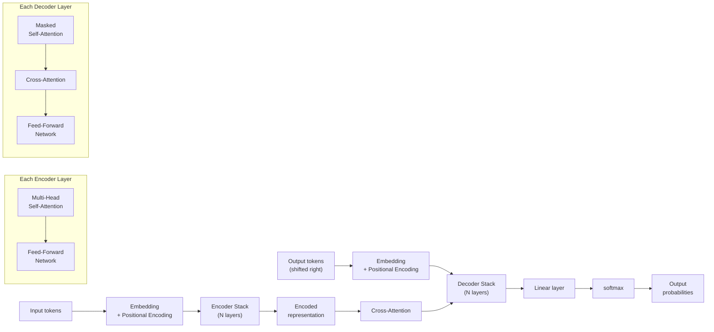

# Transformer Architecture

## 1. What is it?

**ELI5:** Imagine you're reading a sentence. Instead of reading word by word (like older models), you look at ALL words at once and figure out which ones are important to each other. That's a Transformer — it processes everything in parallel and figures out relationships.



**Simple Explanation:** The Transformer is a neural network architecture introduced in the 2017 paper "Attention Is All You Need" by Vaswani et al. from Google Brain. Instead of processing sequences step-by-step (like RNNs/LSTMs), it uses a mechanism called self-attention to process all tokens simultaneously, enabling parallel computation and capturing long-range dependencies.

**Technical Definition:** A Transformer is a deep learning model that eschews recurrence entirely, relying solely on attention mechanisms to draw global dependencies between input and output. It consists of an encoder stack and a decoder stack, each composed of multi-head self-attention layers and feed-forward networks, with residual connections and layer normalization. The key innovation is that every token can attend to every other token in the sequence, producing a dynamic representation weighted by relevance.


*The original Transformer architecture showing the encoder stack (left) and decoder stack (right) with multi-head attention and feed-forward networks.*

## 2. Why do we need it?

**Problem It Solves:**
Before Transformers, sequence modeling relied on RNNs, LSTMs, and GRUs which:
- Process tokens sequentially → O(n) sequential operations, cannot parallelize
- Suffer from vanishing gradients in long sequences (>100 tokens)
- Have limited memory — the hidden state is a fixed-size bottleneck
- Struggle with long-range dependencies (>20 tokens apart)

**Pain Without It:**
- Machine translation: Google Translate using LSTMs was 8x slower than Transformer models
- Document summarization: RNNs gave forgettable summaries for documents >500 words
- Language modeling: GPT-1 (2018, 117M params) vs pre-Transformer LM quality gap was enormous
- BERT pre-training (2018) broke 11 NLP benchmarks on first release

**Why Companies Invest:**
- **Parallelization:** Training time reduced from weeks to hours (GPT-3: 34 days on 10K GPUs would be impossible with RNNs)
- **Quality:** BLEU scores jumped from 28 (LSTM) to 42 (Transformer) on WMT translation
- **Scaling:** Transformers scale reliably with compute and data (Chinchilla scaling laws)
- **Versatility:** Same architecture works for text, images (ViT), video, audio (Whisper), code (Codex), proteins (AlphaFold2's Evoformer), and robotics (RT-2)

## 3. Real-world Example

| Company | Product | Model | Parameters | Use Case |
|---------|---------|-------|------------|----------|
| OpenAI | GPT-4 | Decoder-only | ~1.8T | Chat, code, reasoning |
| Google | BERT | Encoder-only | 340M | Search ranking |
| Google | PaLM 2 | Decoder-only | 340B | Multilingual, reasoning |
| Meta | LLaMA 3 | Decoder-only | 405B | Open-source LLM |
| DeepMind | AlphaFold2 | Evoformer (Transformer variant) | — | Protein folding |
| NVIDIA | Megatron-LM | Decoder-only | 530B | Enterprise LLM |
| Anthropic | Claude 3 | Decoder-only | — | Safe AI assistant |
| Mistral | Mixtral 8x7B | MoE Transformer | 47B active | Open-source MoE |

**Google Search (BERT):**
- 2019: BERT integration into Google Search affected 10% of all queries
- Understanding the intent behind search queries using bidirectional context
- Precedent: Before BERT, search was keyword-based. After BERT, it's meaning-based.
- Result: "2019 Brazil traveler to USA need a visa" → understands "to" directionality

**OpenAI GPT-4:**
- Architecture: Decoder-only Transformer with mixture of experts
- Training: 13 trillion tokens, estimated $100M+ training cost
- 8 expert networks with 220B parameters each, ~1.8T total, ~280B active per token
- Context window: 128K tokens (GPT-4 Turbo) → 200K (GPT-4o)

## 4. Architecture Diagram (ASCII)

```
                       OUTPUT SEQUENCE
                            ▲
                            │
                    ┌───────┴────────┐
                    │  Linear +      │
                    │  Softmax       │
                    └───────┬────────┘
                            │
              ┌─────────────┴──────────────┐
              │     Add & Normalize        │
              └─────────────┬──────────────┘
                            │
              ┌─────────────┴──────────────┐
              │   Feed-Forward Network     │
              │   (FFN: Linear → ReLU →    │
              │    Linear, 4x hidden_dim)  │
              └─────────────┬──────────────┘
                            │
              ┌─────────────┴──────────────┐
              │     Add & Normalize        │
              └─────────────┬──────────────┘
                            │
              ┌─────────────┴──────────────┐
              │   Cross-Attention          │
              │  (Keys/Values from Encoder,│
              │   Query from Decoder)      │
              └─────────────┬──────────────┘
                            │
              ┌─────────────┴──────────────┐
              │     Add & Normalize        │
              └─────────────┬──────────────┘
                            │
              ┌─────────────┴──────────────┐
              │  Masked Multi-Head         │
              │  Self-Attention            │
              │  (Causal mask: can't see   │
              │   future tokens)           │
              └─────────────┬──────────────┘
                            │
              ┌─────────────┴──────────────┐
              │  Positional Encoding       │
              └─────────────┬──────────────┘
                            │
              ┌─────────────┴──────────────┐
              │  Input Embedding           │
              └─────────────┬──────────────┘
                            │
                      INPUT TOKENS (shifted right)

    ┌────────────────────────────────────────────────────┐
    │                 ENCODER STACK (×N)                  │
    │                                                    │
    │  ┌──────────┐  ┌──────────┐  ┌──────────┐         │
    │  │ Encoder  │  │ Encoder  │  │ Encoder  │         │
    │  │ Layer 1  │→ │ Layer 2  │→ │ Layer N  │         │
    │  └──────────┘  └──────────┘  └──────────┘         │
    │                                                    │
    │  ┌────────────────────────────────────────────┐    │
    │  │  Each Encoder Layer:                        │    │
    │  │  ┌─────────────────────┐                    │    │
    │  │  │ Multi-Head Self-Atn │                    │    │
    │  │  │ ← Residual + Norm  │                    │    │
    │  │  └─────────────────────┘                    │    │
    │  │  ┌─────────────────────┐                    │    │
    │  │  │ FFN (2-layer MLP)   │                    │    │
    │  │  │ ← Residual + Norm  │                    │    │
    │  │  └─────────────────────┘                    │    │
    │  └────────────────────────────────────────────┘    │
    │                                                    │
    │  ┌──────────┐  ┌──────────┐  ┌──────────┐         │
    │  │ Position │→ │ Embed    │→ │  Input   │         │
    │  │ Encoding │  │ ding     │  │  Tokens   │         │
    │  └──────────┘  └──────────┘  └──────────┘         │
    └────────────────────────────────────────────────────┘
```

## 5. Internal Working

**Step-by-step Execution (Encoder-Decoder Transformer):**

**Step 1 — Tokenization & Embedding:**
- Input text split into tokens (subwords via BPE or SentencePiece)
- Each token mapped to a d_model-dimensional vector via embedding matrix
- Example: "The cat sat" → [464, 5432, 1287] → 3 vectors of shape [d_model]

**Step 2 — Positional Encoding:**
- Sinusoidal or learned position vectors added to token embeddings
- Gives the model a sense of token order (since attention is permutation-invariant)
- PE(pos, 2i) = sin(pos / 10000^(2i/d_model))
- PE(pos, 2i+1) = cos(pos / 10000^(2i/d_model))

**Step 3 — Multi-Head Self-Attention:**
- Each token produces Query (Q), Key (K), Value (V) vectors via learned projections
- Attention scores: Q × K^T / √d_k
- Softmax normalized → attention weights
- Output = weighted sum of Values
- Multiple "heads" capture different relationship types (syntax, semantics, etc.)
- For h heads, compute h attention outputs in parallel and concatenate

**Step 4 — Residual Connection + Layer Normalization:**
- Add input to attention output: x + Attention(x)
- Apply layer normalization: y = (x - μ) / σ × γ + β
- Preserves gradient flow through deep stacks

**Step 5 — Feed-Forward Network:**
- Two linear layers with ReLU/GELU activation in between
- Expand to 4× d_model inner dimension, then project back
- FFN(x) = W₂ × GELU(W₁ × x + b₁) + b₂

**Step 6 — Decoder (for generation tasks):**
- Similar structure but with causal masking (can't attend to future tokens)
- Cross-attention: Decoder queries attend to encoder key-value pairs

**Step 7 — Output Projection:**
- Final linear layer projects to vocabulary size
- Softmax gives probability distribution over next token

## 6. Production Flow

```
┌──────────┐    ┌──────────┐    ┌──────────┐    ┌──────────┐    ┌──────────┐
│  Client  │───▶│  API     │───▶│  Token   │───▶│  Model   │───▶│  Token   │
│  Request │    │  Gateway │    │  izer    │    │  Predict │    │  Detoken │
└──────────┘    └──────────┘    └──────────┘    └──────────┘    └──────────┘
                                                     │
                                                     ▼
                                              ┌──────────┐
                                              │  KV Cache│
                                              └──────────┘

1. Request arrives → Authentication check → Rate limiter
2. Prompt tokenized → Truncated to context window (e.g., 128K)
3. Embedding lookup → Positional encoding
4. Autoregressive decoding loop:
   a. Self-attention (with cached KV from previous steps)
   b. FFN computation
   c. Sample next token (greedy / top-k / top-p / temperature)
   d. Append to sequence → Update KV cache
   e. Repeat until EOS token or max length
5. Detokenize → Return response

Production considerations:
- Streaming: SSE (Server-Sent Events) for token-by-token delivery
- Batching: Dynamic batching of concurrent requests for GPU efficiency
- Caching: KV cache for autoregressive generation (significant memory)
- Prefix caching: Reuse KV cache for common prefixes (system prompts)
```

## 7. HLD (High-Level Design)

```
┌───────────────────────────────────────────────────────────────────┐
│                    TRANSFORMER SERVING (HLD)                      │
│                                                                   │
│  ┌──────────┐  ┌──────────┐  ┌────────────┐  ┌──────────────┐   │
│  │ Client   │→ │ Load     │→ │ API Server │→ │ Inference    │   │
│  │ Apps     │  │ Balancer │  │ (FastAPI)  │  │ Engine       │   │
│  │ (Web,    │  │ (ALB/    │  │ ┌────────┐ │  │ (NVIDIA      │   │
│  │  Mobile) │  │  Nginx)  │  │ │Stream  │ │  │  Triton /    │   │
│  └──────────┘  └──────────┘  │ │SSE     │ │  │  vLLM /      │   │
│                               │ └────────┘ │  │  TensorRT    │   │
│                               └───────┬────┘  │  LLM)        │   │
│                                       │       └──────┬───────┘   │
│                                       │              │            │
│                               ┌───────▼────┐  ┌──────▼───────┐   │
│                               │ Auth       │  │ GPU Pool     │   │
│                               │ Service    │  │ (A100/H100)  │   │
│                               └────────────┘  └──────────────┘   │
│                                                                   │
│  ┌──────────┐  ┌─────────────────────┐  ┌──────────────┐         │
│  │ Redis    │  │ Model Registry      │  │ Monitoring   │         │
│  │ Cache    │  │ (MLflow + S3)       │  │ (Prometheus  │         │
│  │ ┌──────┐ │  │ ┌────┐ ┌────┐       │  │  + Grafana)  │         │
│  │ │KV    │ │  │ │v1  │ │v2  │       │  └──────────────┘         │
│  │ │Cache │ │  │ └────┘ └────┘       │                           │
│  │ └──────┘ │  └─────────────────────┘                            │
│  └──────────┘                                                     │
└───────────────────────────────────────────────────────────────────┘
```

## 8. LLD (Low-Level Design)

```python
# transformers.py — Production Transformer Serving with FastAPI
import time
import uuid
import asyncio
from typing import Optional
from dataclasses import dataclass
import torch
import torch.nn as nn
import torch.nn.functional as F
from fastapi import FastAPI, HTTPException, BackgroundTasks
from pydantic import BaseModel, Field
from prometheus_client import Histogram, Counter, Gauge

# ─── Metrics ───
TOKENS_PER_SECOND = Gauge("tokens_per_second", "Generation throughput")
TTFT = Histogram("time_to_first_token_ms", "TTFT", buckets=[50, 100, 200, 500, 1000, 2000])
GENERATION_LATENCY = Histogram("generation_latency_ms", "Total generation time")

# ─── Pydantic Models ───
class GenerationRequest(BaseModel):
    prompt: str = Field(..., max_length=8192)
    max_tokens: int = Field(default=256, le=4096)
    temperature: float = Field(default=0.7, ge=0.0, le=2.0)
    top_p: float = Field(default=0.9, ge=0.0, le=1.0)
    top_k: int = Field(default=50, ge=1)
    stream: bool = False

class GenerationResponse(BaseModel):
    text: str
    tokens_generated: int
    ttft_ms: float
    total_latency_ms: float
    tokens_per_second: float
    request_id: str

# ─── Transformer Implementation ───
class MultiHeadAttention(nn.Module):
    def __init__(self, d_model: int, n_heads: int, dropout: float = 0.1):
        super().__init__()
        assert d_model % n_heads == 0
        self.d_model = d_model
        self.n_heads = n_heads
        self.d_k = d_model // n_heads

        self.W_q = nn.Linear(d_model, d_model, bias=False)
        self.W_k = nn.Linear(d_model, d_model, bias=False)
        self.W_v = nn.Linear(d_model, d_model, bias=False)
        self.W_o = nn.Linear(d_model, d_model, bias=False)
        self.dropout = nn.Dropout(dropout)

    def forward(self, x: torch.Tensor, mask: Optional[torch.Tensor] = None,
                kv_cache: Optional[dict] = None) -> tuple:
        batch_size, seq_len, _ = x.shape

        Q = self.W_q(x).view(batch_size, seq_len, self.n_heads, self.d_k).transpose(1, 2)
        K = self.W_k(x).view(batch_size, seq_len, self.n_heads, self.d_k).transpose(1, 2)
        V = self.W_v(x).view(batch_size, seq_len, self.n_heads, self.d_k).transpose(1, 2)

        # KV Cache for autoregressive decoding
        if kv_cache is not None:
            if "k" in kv_cache:
                K = torch.cat([kv_cache["k"], K], dim=2)
                V = torch.cat([kv_cache["v"], V], dim=2)
            kv_cache["k"], kv_cache["v"] = K, V

        # Scaled dot-product attention
        scores = torch.matmul(Q, K.transpose(-2, -1)) / (self.d_k ** 0.5)
        if mask is not None:
            scores = scores.masked_fill(mask == 0, float("-inf"))

        attn_weights = F.softmax(scores, dim=-1)
        attn_weights = self.dropout(attn_weights)

        output = torch.matmul(attn_weights, V)
        output = output.transpose(1, 2).contiguous().view(batch_size, seq_len, self.d_model)
        return self.W_o(output), kv_cache

class FeedForward(nn.Module):
    def __init__(self, d_model: int, d_ff: int = None, dropout: float = 0.1):
        super().__init__()
        d_ff = d_ff or 4 * d_model
        self.net = nn.Sequential(
            nn.Linear(d_model, d_ff),
            nn.GELU(),
            nn.Dropout(dropout),
            nn.Linear(d_ff, d_model),
            nn.Dropout(dropout),
        )

    def forward(self, x: torch.Tensor) -> torch.Tensor:
        return self.net(x)

class TransformerBlock(nn.Module):
    def __init__(self, d_model: int, n_heads: int, d_ff: int, dropout: float = 0.1):
        super().__init__()
        self.attention = MultiHeadAttention(d_model, n_heads, dropout)
        self.ffn = FeedForward(d_model, d_ff, dropout)
        self.norm1 = nn.LayerNorm(d_model)
        self.norm2 = nn.LayerNorm(d_model)
        self.dropout = nn.Dropout(dropout)

    def forward(self, x: torch.Tensor, mask: Optional[torch.Tensor] = None,
                kv_cache: Optional[dict] = None) -> tuple:
        attn_out, kv_cache = self.attention(self.norm1(x), mask, kv_cache)
        x = x + self.dropout(attn_out)
        x = x + self.dropout(self.ffn(self.norm2(x)))
        return x, kv_cache

class TransformerDecoder(nn.Module):
    def __init__(self, vocab_size: int, d_model: int, n_layers: int,
                 n_heads: int, d_ff: int, max_seq_len: int = 2048, dropout: float = 0.1):
        super().__init__()
        self.token_embedding = nn.Embedding(vocab_size, d_model)
        self.position_embedding = nn.Embedding(max_seq_len, d_model)
        self.layers = nn.ModuleList([
            TransformerBlock(d_model, n_heads, d_ff, dropout)
            for _ in range(n_layers)
        ])
        self.norm = nn.LayerNorm(d_model)
        self.lm_head = nn.Linear(d_model, vocab_size, bias=False)
        self.dropout = nn.Dropout(dropout)
        self.d_model = d_model

    def forward(self, tokens: torch.Tensor, mask: Optional[torch.Tensor] = None,
                kv_caches: Optional[list] = None) -> tuple:
        seq_len = tokens.shape[1]
        positions = torch.arange(seq_len, device=tokens.device).unsqueeze(0)

        x = self.token_embedding(tokens) * (self.d_model ** 0.5)
        x = x + self.position_embedding(positions)
        x = self.dropout(x)

        if kv_caches is None:
            kv_caches = [{} for _ in range(len(self.layers))]

        new_kv_caches = []
        for layer, kv_cache in zip(self.layers, kv_caches):
            x, new_kv = layer(x, mask, kv_cache)
            new_kv_caches.append(new_kv)

        x = self.norm(x)
        logits = self.lm_head(x)
        return logits, new_kv_caches

# ─── Inference Engine ───
class TransformerInferenceEngine:
    def __init__(self, model: TransformerDecoder, device: str = "cuda"):
        self.model = model.to(device)
        self.device = device
        self.model.eval()

    @torch.no_grad()
    def generate(self, input_ids: list[int], max_tokens: int = 256,
                 temperature: float = 0.7, top_p: float = 0.9, top_k: int = 50) -> tuple:
        tokens = torch.tensor([input_ids], device=self.device)
        kv_caches = None
        generated = []
        start_time = time.perf_counter()
        ttft = None

        for step in range(max_tokens):
            logits, kv_caches = self.model(tokens, kv_caches=kv_caches)
            next_logits = logits[:, -1, :] / temperature

            # Top-k filtering
            if top_k > 0:
                top_k_vals, _ = torch.topk(next_logits, top_k, dim=-1)
                next_logits[next_logits < top_k_vals[:, -1:]] = float("-inf")

            # Top-p (nucleus) filtering
            if top_p < 1.0:
                sorted_logits, sorted_indices = torch.sort(next_logits, descending=True)
                cumulative_probs = torch.cumsum(F.softmax(sorted_logits, dim=-1), dim=-1)
                sorted_indices_to_remove = cumulative_probs > top_p
                sorted_indices_to_remove[:, 1:] = sorted_indices_to_remove[:, :-1].clone()
                sorted_indices_to_remove[:, 0] = False
                next_logits[sorted_indices[sorted_indices_to_remove]] = float("-inf")

            probs = F.softmax(next_logits, dim=-1)
            next_token = torch.multinomial(probs, num_samples=1)
            generated.append(next_token.item())

            if ttft is None:
                ttft = (time.perf_counter() - start_time) * 1000

            if next_token.item() == 0:  # EOS token
                break

            tokens = next_token

        total_time = (time.perf_counter() - start_time) * 1000
        return generated, ttft, total_time

# ─── FastAPI App ───
app = FastAPI(title="Transformer Inference Server", version="1.0.0")
engine: Optional[TransformerInferenceEngine] = None
tokenizer = None  # Placeholder for actual tokenizer

@app.on_event("startup")
async def startup():
    global engine, tokenizer
    # In production, load from checkpoint
    model = TransformerDecoder(
        vocab_size=32000,
        d_model=4096,
        n_layers=32,
        n_heads=32,
        d_ff=11008,
        max_seq_len=8192,
    )
    engine = TransformerInferenceEngine(model)

@app.post("/generate", response_model=GenerationResponse)
async def generate(request: GenerationRequest, background_tasks: BackgroundTasks):
    global engine, tokenizer
    request_id = str(uuid.uuid4())

    try:
        input_ids = tokenizer.encode(request.prompt)  # mock
        output_ids, ttft, total_time = engine.generate(
            input_ids=input_ids,
            max_tokens=request.max_tokens,
            temperature=request.temperature,
            top_p=request.top_p,
            top_k=request.top_k,
        )
        output_text = tokenizer.decode(output_ids)  # mock
        tps = len(output_ids) / (total_time / 1000)
        TOKENS_PER_SECOND.set(tps)
        TTFT.observe(ttft)
        GENERATION_LATENCY.observe(total_time)

        return GenerationResponse(
            text=output_text,
            tokens_generated=len(output_ids),
            ttft_ms=round(ttft, 2),
            total_latency_ms=round(total_time, 2),
            tokens_per_second=round(tps, 2),
            request_id=request_id,
        )
    except Exception as e:
        raise HTTPException(status_code=500, detail=str(e))
```

## 9. Python Implementation

*(Full production implementation included in Section 8 above.)*

Production-ready additions needed:
- **Tokenizer integration:** HuggingFace `AutoTokenizer`
- **Checkpoint loading:** Safetensors with sharding
- **Device mapping:** Automatic layer placement across GPUs
- **Flash Attention:** `torch.nn.functional.scaled_dot_product_attention` with `is_causal=True`
- **Continuous batching:** vLLM-style iteration-level scheduling

## 10. Folder Structure

```
transformer-platform/
├── api/
│   ├── __init__.py
│   ├── server.py           # FastAPI server
│   ├── schemas.py          # Request/Response models
│   └── streaming.py        # SSE streaming
├── model/
│   ├── __init__.py
│   ├── attention.py        # Multi-head self-attention
│   ├── blocks.py           # TransformerBlock
│   ├── decoder.py          # Decoder-only stack
│   ├── encoder.py          # Encoder stack
│   └── config.py           # Model configuration
├── engine/
│   ├── __init__.py
│   ├── inference.py        # Generation loop
│   ├── batching.py         # Continuous batching
│   ├── kv_cache.py         # KV cache management
│   ├── sampling.py         # Top-k, top-p, temperature
│   └── prefix_cache.py     # Prefix caching
├── tokenizer/
│   ├── __init__.py
│   ├── bpe.py              # BPE tokenizer
│   └── vocab.json
├── training/
│   ├── dataset.py          # Data loading
│   ├── trainer.py          # Training loop
│   ├── optimizer.py        # AdamW with warmup
│   └── distributed.py      # FSDP / DeepSpeed
├── config/
│   ├── model.yaml          # 7B, 13B, 70B configs
│   └── serving.yaml
├── tests/
│   ├── test_attention.py
│   ├── test_generation.py
│   └── test_batching.py
├── Dockerfile
└── docker-compose.yml
```

## 11. Configuration

```yaml
# config/model.yaml
model:
  architecture: "decoder_only"
  vocab_size: 32000
  d_model: 4096
  n_layers: 32
  n_heads: 32
  n_kv_heads: 8  # Grouped-query attention
  d_ff: 11008
  max_seq_len: 8192
  dropout: 0.0
  activation: "swiglu"
  norm_type: "rmsnorm"
  rope_theta: 10000.0
  weight_tying: false
  use_flash_attn: true
  precision: "bfloat16"

serving:
  engine: "vllm"
  tensor_parallel: 8
  pipeline_parallel: 1
  max_num_batched_tokens: 65536
  max_num_seqs: 256
  gpu_memory_utilization: 0.90
  block_size: 16
  swap_space: 4  # GB for CPU offloading

  kv_cache:
    type: "paged"  # vLLM paged attention
    dtype: "fp8"   # KV cache quantization
    max_gpu_memory: 80  # GB

  scheduling:
    policy: "fcfs"  # First-come-first-serve
    max_waiting_seqs: 1024
    preemption_mode: "swap"

  streaming:
    enabled: true
    chunk_size: 1  # Token-by-token
    backend: "sse"
```

## 12. Flowchart

```
                    ┌──────────────┐
                    │   User Input │
                    └──────┬───────┘
                           │
                    ┌──────▼───────┐
                    │  Tokenization │
                    └──────┬───────┘
                           │
                    ┌──────▼───────┐
                    │  Token       │
                    │  Embedding   │
                    └──────┬───────┘
                           │
                    ┌──────▼───────┐
                    │  Positional  │
                    │  Encoding    │
                    └──────┬───────┘
                           │
              ┌────────────┼────────────┐
              │            │            │
         ┌────▼───┐  ┌────▼───┐  ┌────▼───┐
         │ Layer 1│  │ Layer 2│  │ Layer N│
         │ ┌────┐ │  │ ┌────┐ │  │ ┌────┐ │
         │ │SA  │ │  │ │SA  │ │  │ │SA  │ │
         │ │+FFN│ │  │ │+FFN│ │  │ │+FFN│ │
         │ └────┘ │  │ └────┘ │  │ └────┘ │
         └────┬───┘  └────┬───┘  └────┬───┘
              │            │            │
              └────────────┼────────────┘
                           │
                    ┌──────▼───────┐
                    │ Layer Norm   │
                    └──────┬───────┘
                           │
                    ┌──────▼───────┐
                    │  LM Head     │
                    │ (Linear →    │
                    │  Softmax)    │
                    └──────┬───────┘
                           │
              ┌────────────┴────────────┐
              │                         │
        ┌─────▼────┐             ┌──────▼───┐
        │ Greedy   │             │ Sampling │
        │ (argmax) │             │ (top-k,  │
        └─────┬────┘             │  top-p,  │
              │                  │  temp)   │
              │                  └──────┬───┘
              └────────────┬────────────┘
                           │
                    ┌──────▼───────┐
                    │  Emit Token  │
                    └──────┬───────┘
                           │
              ┌────────────┴────────────┐
              │                         │
          ┌───▼───┐               ┌─────▼────┐
          │ EOS?  │───Yes───►      │   Done   │
          └───┬───┘               └───────────┘
              │ No
              │
              ▼
      ┌────────────────┐
      │ Update KV Cache │
      │ Generate next   │
      └────────────────┘
```

## 13. Sequence Diagram

```
Client          API Gateway        Inference Server      GPU            KV Cache
  │                    │                    │              │               │
  │── POST /generate ──►                    │              │               │
  │                    │── Auth ──────►      │              │               │
  │                    │◄── OK ─────────────│              │               │
  │                    │                    │              │               │
  │                    │── Embed tokens ───►│              │               │
  │                    │◄── Embeddings ─────│              │               │
  │                    │                    │              │               │
  │                    │── Decode: Step 1 ─►│── Forward ──►│               │
  │                    │                    │◄── Logits ───│               │
  │                    │                    │── Sample ───►│               │
  │                    │                    │── Store KV ────────────────►  │
  │                    │◄── Token 1 ────────│              │               │
  │                    │                    │              │               │
  │                    │── Decode: Step 2 ─►│── Forward ──►│               │
  │                    │                    │  (with KV    │               │
  │                    │                    │   cache)     │               │
  │                    │                    │◄── Logits ───│               │
  │                    │                    │── Sample ───►│               │
  │                    │◄── Token 2 ────────│              │               │
  │                    │  ...               │              │               │
  │                    │                    │              │               │
  │◄── Full Response ──│                    │              │               │
  │                    │                    │              │               │
```

## 14. Pros

1. **Parallel Computation:** No sequential recurrence; full sequence processed simultaneously during training. 1000x speedup over RNNs for long sequences.

2. **Long-range Dependencies:** Direct connections between any two tokens, regardless of distance. No vanishing gradient for 100K+ token sequences.

3. **Scalable:** Train models from 1M to 1T+ parameters. Loss predictably decreases with scale (scaling laws).

4. **Multi-modal:** Same architecture works for text, images, audio, video, code, proteins, and more.

5. **Transfer Learning:** Pre-train once, fine-tune for many tasks. BERT spawned 1000+ fine-tuned variants.

6. **Interpretable Attention:** Attention weights provide some insight into model reasoning (though limited for large models).

7. **Stable Training:** LayerNorm + residual connections enable training 1000+ layer networks without gradient issues.

## 15. Cons

1. **Quadratic Complexity:** Self-attention is O(n²) in sequence length. A 128K token sequence produces 16B attention scores. Flash Attention mitigates but doesn't eliminate.

2. **Memory Intensive:** KV cache for a 70B model with 128K context = ~800GB at FP16. Requires aggressive optimization.

3. **Fixed Context Window:** Cannot naturally handle sequences longer than trained max length (though RoPE extrapolation helps).

4. **No Recursive Inductive Bias:** Must learn positional information from scratch (unlike RNNs with inherent sequentiality).

5. **Inference Cost:** Autoregressive decoding is memory-bandwidth bound. Generating 1000 tokens costs ~100x the prompt processing cost.

6. **Catastrophic Forgetting:** Fine-tuned models lose general knowledge. Requires careful replay or regularization.

7. **Hallucination:** Transformers can generate confident-sounding false information. No inherent truth-checking mechanism.

## 16. Alternatives

| Architecture | Strength | Weakness | Best For |
|-------------|----------|----------|----------|
| **RNN/LSTM** | Sequential memory, small footprint | Slow, short memory | Time series, edge devices |
| **CNN (WaveNet)** | Fast parallel training | Limited receptive field | Audio generation |
| **State Space Models (Mamba)** | O(n) inference, linear complexity | Less expressive than attention | Long sequence tasks, streaming |
| **RWKV** | RNN-like inference, Transformer quality | Smaller ecosystem | Efficient deployment |
| **Reformer** | LSH attention for long sequences | Quality trade-offs | Very long documents |
| **Longformer/BigBird** | Sparse attention patterns | Complex implementation | Document QA |
| **Hyena** | Sub-quadratic operators | Newer, less proven | Long-range biology sequences |
| **RetNet** | Retention mechanism, parallel training | Limited adoption | Microsoft products |

## 17. Performance Considerations

**Training Performance:**
- **Compute:** ~6 * N * T FLOPs for forward+backward (N=params, T=tokens)
- **Memory:** Model weights (2 bytes * N in BF16) + Optimizer states (12 bytes * N with Adam) + Activations (depends on sequence length)
- **Throughput:** 100-200 TFLOPS per A100 for large models (below theoretical peak of 312 TFLOPS)
- **Optimization:** Mixed precision (BF16/FP16), gradient checkpointing, activation offloading

**Inference Performance:**
- **Prefill (prompt processing):** Compute-bound. Flash Attention crucial.
- **Decode:** Memory-bandwidth bound. 95% of time is reading weights + KV cache.
- **Key metric:** Tokens per second per user. Target: 50+ t/s for interactive use.
- **Optimization:** KV cache quantization (FP8/INT4), weight quantization, speculative decoding

**KV Cache Memory:**
- Per token: 2 * n_layers * (d_model + n_kv_heads * d_head) * dtype_bytes
- For 70B, 80 layers, 8192 context: ~40GB for KV cache alone
- Solutions: GQA (grouped-query attention), MQA (multi-query attention), paged attention

## 18. Scaling to Millions

**Training Scaling (3D Parallelism):**
```
                 Data Parallel (across GPUs)
                ┌────┬────┬────┬────┐
                │ DP │ DP │ DP │ DP │
                │ 0  │ 1  │ 2  │ 3  │
                └─┬──┴─┬──┴─┬──┴─┬──┘
                  │   │    │    │
Tensor Parallel ──┼───┤    ├────┤
(within node)     │ TP0    │ TP1
                  │ GPU0   │ GPU1
                  │  │     │  │
Pipeline ─────────┼──┼─────┼──┼──►
Parallel          │PP│     │PP│
(stage 0/1)     GPU0-1   GPU2-3
```

**Inference Scaling:**
- **Horizontal:** Multiple GPU pods behind load balancer
- **Request Routing:** Router hashes prompt prefix → route to warmed GPU
- **Prefix Caching:** Cache KV for common prefixes (system prompts, few-shot examples)
- **Dynamic Batching:** vLLM/SGLang iteration-level scheduling maximizes GPU utilization
- **Autoscaling:** Based on queue depth (target: <100ms queue wait)

**Cost Optimization at Scale:**
- Spot/preemptible instances for batch inference (2-3x cheaper)
- On-demand for latency-critical interactive inference
- Model distillation: 7B model from 70B teacher → 10x cheaper, 90% quality

## 19. Failure Scenarios

| Failure | Symptom | Root Cause | Mitigation |
|---------|---------|------------|------------|
| **GPU OOM** | 500 error, process killed | Sequence too long, batch too large | Dynamic batching, memory budget tracking |
| **KV Cache OOM** | Excessive paging to CPU | Too many concurrent requests | Admission control, request queuing |
| **Tokenization Error** | Malformed output | Unknown byte sequence | Unicode normalization, fallback token |
| **Infinite Loop** | Generation never stops | No EOS token produced | Max tokens limit, timeout (30s default) |
| **NaN Loss** | Training diverges | Learning rate too high | Gradient clipping, loss monitoring |
| **Model Loading Fail** | Startup crash | Corrupted checkpoint | Checkpoint hash verification |
| **Cold Start** | 10s+ first request | Model loading from disk | Model keepalive, pre-warming |
| **Throughput Collapse** | 90% drop in TPS | Memory fragmentation | KV cache defragmentation |

## 20. Security

| Threat | Impact | Defense |
|--------|--------|---------|
| **Prompt Injection** | Model ignores instructions | Input sanitization, system prompt hardening |
| **Jailbreaking** | Bypass safety guardrails | Adversarial training, perplexity filter |
| **Data Extraction** | Training data leakage | Differential privacy, deduplication |
| **Model Inversion** | Reconstruct training examples | Gradient perturbation, output restriction |
| **Denial of Service** | Long prompts exhaust GPU memory | Max tokens limit, cost-based rate limiting |
| **Side-channel** | Extract model via timing | Consistent timing, noise injection |
| **Model Theft** | Steal weights via API | Rate limiting, per-user quotas, watermarking |

```python
# Security utilities
import hashlib
from fastapi import Request, HTTPException

class SecurityManager:
    def __init__(self):
        self.prompt_injection_patterns = [
            "ignore previous instructions",
            "DAN", "jailbreak", "system prompt",
        ]

    def sanitize_input(self, text: str) -> str:
        for pattern in self.prompt_injection_patterns:
            if pattern.lower() in text.lower():
                raise HTTPException(status_code=400, detail="Input blocked")
        return text[:8192]  # Truncate

    def rate_limit(self, request: Request):
        client_ip = request.client.host
        # Check Redis counter
        pass
```

## 21. Monitoring

```yaml
# Prometheus metrics for Transformer serving
metrics:
  request_rate:
    type: counter
    name: transformer_requests_total
    labels: [model, endpoint]

  latency:
    type: histogram
    name: transformer_latency_ms
    labels: [model, method]  # prefill, decode
    buckets: [5, 10, 25, 50, 100, 200, 500, 1000, 2000, 5000]

  tokens:
    type: histogram
    name: transformer_tokens_per_request
    labels: [model]

  throughput:
    type: gauge
    name: transformer_tokens_per_second
    labels: [model]

  kv_cache:
    type: gauge
    name: transformer_kv_cache_usage_gb
    labels: [model, gpu_id]

  gpu:
    type: gauge
    name: transformer_gpu_utilization
    labels: [gpu_id]

  errors:
    type: counter
    name: transformer_errors_total
    labels: [model, error_type]

# Grafana alerts:
# - latency_p99 > 2000ms over 5m
# - error_rate > 1% over 1m
# - kv_cache_usage > 80% GPU memory
# - tokens_per_second < 10 for interactive model
```

## 22. Interview Questions

**Beginner:**
- Q: What makes Transformers different from RNNs?
  A: Transformers use self-attention for parallel processing instead of sequential recurrence. No sequential dependency = faster training.

- Q: What is "Attention Is All You Need"?
  A: The 2017 Vaswani et al. paper that introduced the Transformer architecture, showing that pure attention mechanisms (no RNN) could achieve SOTA on machine translation.

**Intermediate:**
- Q: Explain scaled dot-product attention.
  A: Q × K^T gives similarity scores. Divide by √d_k for stable gradients (prevents softmax saturation). Apply softmax → multiply by V for weighted sum.

- Q: Why is self-attention O(n²)?
  A: Each of n tokens computes attention scores with all n tokens → n² comparisons. For 100K tokens, that's 10B computations.

- Q: What is the purpose of multi-head attention?
  A: Each head learns different relationship types (syntax, semantics, position). h heads = h parallel attention computations, concatenated.

**Senior:**
- Q: Your Transformer model works on training but fails at longer sequences in production.
  A: Likely positional encoding extrapolation failure. RoPE can handle 2x training length. If not, positional interpolation or NTK-aware scaling.

- Q: Compare KV cache with and without grouped-query attention.
  A: MHA: each head has its own K,V → large cache. GQA: groups of query heads share K,V → 2-4x smaller cache with minimal quality loss (popularized in LLaMA 2 70B).

- Q: How would you reduce memory usage during inference?
  A: (1) KV cache quantization (FP8/INT4), (2) PagedAttention, (3) Sliding window attention, (4) Prefix caching, (5) Token pruning, (6) Early exiting.

**Staff Engineer:**
- Q: Design a system to serve 100B+ parameter models with 99.9% uptime.
  A: (1) Tensor parallelism within nodes, pipeline parallelism across nodes. (2) Elastic provisioning with GPU pool. (3) Model canary and shadow deployments. (4) Automated rollback on error rate spikes. (5) Multi-region active-active for disaster recovery.

- Q: What would it take to train a GPT-4-scale model?
  A: (1) 10K+ GPU cluster (H100). (2) 3D parallelism + ZeRO-3. (3) Reliable training infrastructure: checkpoint every hour, transparent fault tolerance. (4) Data pipeline: 13T tokens processed. (5) $100M+ budget. (6) 3-6 months training time.

**Architect:**
- Q: Your company wants to use Transformers for real-time fraud detection (sub-10ms latency). Design the solution.
  A: (1) Small encoder-only model (BERT-tiny, 4M params). (2) ONNX Runtime + TensorRT. (3) INT8 quantization. (4) GPU or even modern CPU (AVX-512). (5) Precomputed embeddings cache. (6) Sub-1ms with optimized pipeline. Decoder-only LLMs are wrong for this use case.

- Q: How do you decide between encoder-only, decoder-only, and encoder-decoder transformers?
  A: Encoder-only (BERT): understanding tasks (classification, NER, QA). Decoder-only (GPT): generation tasks (chat, story writing, code gen). Encoder-decoder (T5): seq2seq tasks (translation, summarization). The industry has converged on decoder-only for most use cases due to simplicity and scaling.

## 23. Cheat Sheet

```
┌─────────────────────────────────────────────────────────────────────┐
│                    TRANSFORMER CHEAT SHEET                          │
├─────────────────────────────────────────────────────────────────────┤
│                                                                    │
│  CORE EQUATION:                                                     │
│  Attention(Q,K,V) = softmax(Q·K^T / √d_k) · V                      │
│                                                                    │
│  ARCHITECTURE:                                                      │
│  Input → Embed → PE → [SA → FFN]^N → Norm → Head → Output          │
│                                                                    │
│  KEY PARAMETERS:                                                    │
│  d_model  = hidden size (4096 for 7B, 8192 for 70B)                │
│  n_layers = number of blocks (32 for 7B, 80 for 70B)               │
│  n_heads  = attention heads (32 for 7B, 64 for 70B)                │
│  d_ff     = FFN inner size (4 × d_model typical)                   │
│  n_kv_heads = KV heads for GQA (8 common)                          │
│                                                                    │
│  POSITIONAL ENCODING:                                               │
│  PE(pos,2i)   = sin(pos / 10000^(2i/d_model))                      │
│  PE(pos,2i+1) = cos(pos / 10000^(2i/d_model))                      │
│  Modern: RoPE (rotary position embedding)                           │
│                                                                    │
│  PRECOMPUTATION COST:                                               │
│  KV Cache per token = 2 × n_layers × d_model × dtype_bytes         │
│  70B: ~800 bytes/token → 80K ctx = 64GB                            │
│                                                                    │
│  INFERENCE OPTIMIZATIONS:                                           │
│  ┌─────────────────────────────────────────────────────┐           │
│  │ Flash Attention  │ 2-4x speedup, O(n) memory       │           │
│  │ Paged KV Cache   │ vLLM, 0 fragmentation           │           │
│  │ Spec Decode      │ 2-3x speedup, draft model       │           │
│  │ Quantization     │ FP8/INT4 → 2-4x memory savings │           │
│  │ Continuous Batch │ 10-30x throughput               │           │
│  └─────────────────────────────────────────────────────┘           │
└─────────────────────────────────────────────────────────────────────┘
```

## 24. Common Mistakes

1. **Oversized model for the task:** A 7B model runs 100x cheaper than 70B and may suffice. Start small, scale up.

2. **Ignoring prompt engineering:** 90% of quality issues are prompt design, not model architecture.

3. **Wrong context window:** Processing 100K tokens with full attention is wasteful if only 1K are relevant. Use sliding window or chunked attention.

4. **No KV cache management:** Without PagedAttention, 30% of GPU memory is wasted on fragmentation.

5. **Single-request batching:** GPUs are throughput-optimized. Serving one request per batch = 10-30x lower throughput.

6. **Using FP32 in production:** BF16 halves memory and bandwidth with no quality loss. INT4 for further gains.

7. **Ignoring the prefill-decode tradeoff:** Long prompts (prefill) are compute-bound. Short generations (decode) are memory-bandwidth bound. Optimize accordingly.

8. **Not aligning attention head count to GPU architecture:** For A100, head dimensions of 64 or 128 are optimal for tensor core utilization.

## 25. Production Best Practices

1. **Use vLLM or TensorRT-LLM for serving:** Hand-written CUDA kernels for PagedAttention are 10-30x more efficient than naive PyTorch implementations.

2. **Continuous batching:** Don't wait for batches to fill. Use iteration-level scheduling (vLLM/SGLang).

3. **KV cache offloading:** Store infrequently accessed KV entries in CPU memory. Swap on demand.

4. **Prefix caching:** Cache KV entries for system prompts and few-shot examples. 70% of requests share prefixes.

5. **Streaming is mandatory:** Time-to-first-token (TTFT) should be <200ms. Stream tokens via SSE.

6. **Load-test before deployment:** Use `vllm bench` or custom script. Target: 50+ tokens/sec/user, P99 latency <2s.

7. **Weight quantization:** Deploy with FP8 or INT4 weights. 2x memory reduction with <1% quality loss.

8. **Graceful degradation:** If GPU OOM, fall back to CPU with 10x slowdown instead of crashing.

9. **Model version pinning:** Always deploy with specific model hash. Auto-rollback on metric degradation.

10. **Prompt monitoring:** Log anonymized prompts. Detect jailbreak attempts, PII leakage, and injection attacks.
