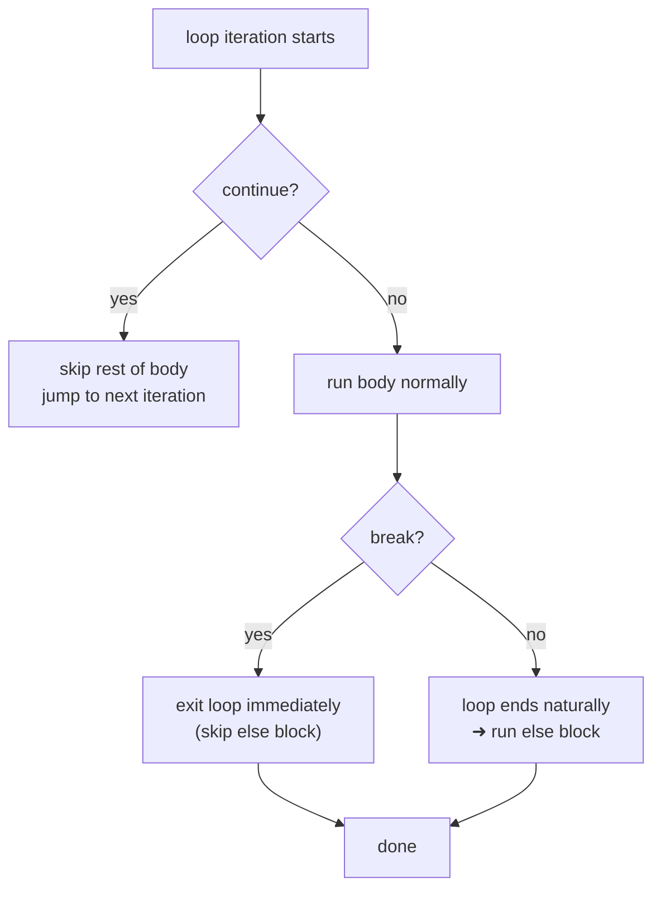

# break, continue, pass — Loop Control Statements

> Author: **Tamilselvan** · ✉️ tamilselvan.sde@gmail.com · 🔗 [LinkedIn](https://www.linkedin.com/in/tamilselvan-ai/)
> Section: 03 — Control Flow
> 🔗 Related: [if_else.md](./if_else.md) · [for_loop.md](./for_loop.md) · [while_loop.md](./while_loop.md) · Back to [README](../README.md)

## 1. What is it?

Three control-flow verbs used inside loops (or function/class bodies):

- **`break`**     — immediately exits the **enclosing** loop.
- **`continue`**  — skips the rest of the current iteration, jumps to the next.
- **`pass`**      — a no-op placeholder; does nothing (used for empty bodies).

They interact closely with `for-else` / `while-else`: that `else` block only fires
if the loop terminated **without** hitting a `break`.

```python
for i in range(10):
    if i == 3: continue
    if i == 6: break
    print(i)
# prints 0 1 2 4 5
```

## 2. Why do we use it?

- To **early-exit** search/found-type loops (`break`).
- To **skip** bad items without terminating the loop (`continue`).
- To **stub** class/function bodies during refactoring (`pass`).
- To make the loop **handle edge cases inline** without nesting ifs.

## 3. When should I choose it? (decision table)

| Situation | Use | Avoid |
|-----------|-----|-------|
| "Found it" — stop scanning | `break` | `return` only if you're inside a function |
| Skip this element, go on | `continue` | wrapping body with `if not bad:` (also fine, more indentation) |
| Child loop should also stop | set **flag variable** OR `return` | `break` only exits innermost |
| Empty body required syntactically | `pass` (or `...` literal) | comment-only body (SyntaxError) |
| "Not found in any element" signal | `for-else` / `while-else` | external `found` flag |
| Want to exit nested outer too | raise custom exception OR extract to function and `return` | labelled break (Python doesn't have labels) |

## 4. Syntax

```python
# break — exit entire loop immediately
for x in seq:
    if cond: break           # terminates the for

# continue — skip current iteration
for x in seq:
    if cond: continue        # jumps to next x

# pass — placeholder
def todo():
    pass                     # function with empty body is OK

# break + else (the famous "else runs only if no break")
for x in seq:
    if x == target:
        found = True
        break
else:
    found = False            # executes only when no break occurred

# nested break only breaks inner
for row in matrix:
    for cell in row:
        if cell < 0: break          # exits only the inner loop
    # outer continues normally

# flag pattern — to break out of the outer loop too
found = False
for i in range(n):
    for j in range(m):
        if matrix[i][j] == target:
            found = True
            break
    if found: break

# return-as-break inside a function
def contains(seq, target):
    for x in seq:
        if x == target:
            return True
    return False
```

## 5. Basic Example

```python
# break in a search
def find_first_positive(nums):
    for x in nums:
        if x > 0:
            print("first positive:", x)
            break
    else:
        print("no positive number")

find_first_positive([-1, -2, 3, 4])     # first positive: 3
find_first_positive([-1, -2])           # no positive number

# continue — sum only even numbers
nums = [1, 2, 3, 4, 5, 6]
total = 0
for x in nums:
    if x % 2 != 0:
        continue
    total += x
print(total)             # 12

# pass placeholder
def not_implemented_yet():
    pass
```

## 6. Step-by-Step Dry Run

Code:
```python
for i in range(6):
    if i == 1: continue
    if i == 4: break
    print(i)
print("done")
```

| Iter | `i` | Action | Output |
|------|-----|--------|--------|
| 0 | 0 | none → print | `0` |
| 1 | 1 | `continue` — skip rest | — |
| 2 | 2 | none → print | `2` |
| 3 | 3 | none → print | `3` |
| 4 | 4 | `break` — exit loop | — |
| — | — | fall through | `done` |

Final output:
```
0
2
3
done
```

## 7. Built-in Methods / Idioms

### `break`
- **Purpose:** exit enclosing loop completely.
- **Syntax:** `break`.
- **Example:** linear search `for x in arr: if x == t: break`.
- **Complexity:** O(1) to terminate; loop's prior cost is what matters.
- **Interview use:** early-exit search, stop expansion (DFS), best-case short-circuits.
- **Mistakes:** expecting `break` to exit function — use `return` for that.
- **Shortcut:** If you're inside a function and `break` is followed by another check before `return`, replace both with a single `return`.

### `continue`
- **Purpose:** skip the rest of the body and start the next iteration.
- **Syntax:** `continue`.
- **Example:** `for x in xs: if x is None: continue; process(x)`.
- **Complexity:** O(1) for skipping.
- **Interview use:** filters in BFS/DFS — skip visited nodes, out-of-bound indices.
- **Mistakes:** `continue` inside a `while` body that doesn't have the state advancement at the top → can loop forever (advance BEFORE the `if cond: continue`).
- **Shortcut:** "guard clauses" at the top of the body are clearer than wrapping body in big `if`.

### `pass`
- **Purpose:** no-op placeholder for empty blocks.
- **Syntax:** `pass`.
- **Example:** `class MyError(Exception): pass`.
- **Complexity:** O(1).
- **Interview use:** stub subclasses, placeholder before code is written.
- **Mistakes:** using `pass` instead of `continue` in a loop (no error but effectively the same; choose the clearer word).
- **Shortcut:** ellipsis `...` is also valid and reads more "stub-like".

### `return` as break inside functions
- **Purpose:** early-exit function AND the loop in one statement.
- **Syntax:** `def f(...): for ...: if cond: return x`.
- **Example:** search inside a function — no flag variable needed.
- **Complexity:** O(1) jump.
- **Interview use:** most-search functions naturally early-`return` on hit.
- **Mistakes:** forgetting a fallback `return None` at function end.
- **Shortcut:** design search functions to `return` on hit; reserve `break` only when caller still needs to act.

### Flag variable (for nested break)
- **Purpose:** signal outer loop when inner found result.
- **Syntax:** `found = False ... if cond: found = True; break ... if found: break`.
- **Example:** 2-D matrix search.
- **Complexity:** O(n·m) worst.
- **Interview use:** without custom exceptions or function extraction, this is the standard idiom.
- **Mistakes:** forgetting to reset `found` for outer iteration in some algorithms.
- **Shortcut:** extract the inner search into a function — `return` early, eliminating flags altogether.

### Exception-as-break (escape from deep nested loops)
- **Purpose:** break out of multiple loops using custom exception.
- **Syntax:** `class Found(Exception): pass ... try: ...; raise Found() except Found: ...`.
- **Example:** 3-D grid search with deep nesting.
- **Complexity:** exception overhead small in modern CPython.
- **Interview use:** NOT common; prefer function `return`. Mention when interview labels a labelled break need.
- **Mistakes:** using generic `Exception` — always subclass.
- **Shortcut:** prefer extracting a function — clearer intent.

## 8. Interview Example

**Prime test using `for-else` (the textbook `break`+`else` combo)**

```python
def is_prime(n: int) -> bool:
    if n < 2:
        return False
    for i in range(2, int(n**0.5) + 1):
        if n % i == 0:
            return False        # found a factor — early exit
    return True                # not hit in the loop, so it's prime
```

This pattern is also commonly written with `for-else` instead:

```python
def is_prime(n):
    if n < 2: return False
    for i in range(2, int(n**0.5) + 1):
        if n % i == 0:
            break              # break occurs → else skipped
    else:
        return True            # only runs if no break
    return False
```

Either form is idiomatic; the first is more Pythonic in modern style.

**LeetCode 448. Find All Numbers Disappeared in an Array** — `continue` for skipping already-correctly-placed items:

```python
def findDisappearedNumbers(nums):
    for i in range(len(nums)):
        idx = abs(nums[i]) - 1
        if nums[idx] > 0:
            nums[idx] = -nums[idx]
    return [i + 1 for i, v in enumerate(nums) if v > 0]
```

Here `if nums[idx] > 0` is effectively a continue-guard — only flip once. (This is the "negate-as-marker" trick.)

## 9. When NOT to use

- **Confusing `break` with `return`** — `break` exits loop; `return` exits function. Inside functions, prefer return.
- **Using `continue` inside `while` without advancing state at the top** — infinite loop.
- **Overusing `break`/`continue` to skip otherwise-readable nested `if`** — sometimes a guard clause is clearer.
- **`pass` when there is a comment reason** — Python allows comments inside blocks: `if x: # TODO`. But block needs at least one statement, so `pass` makes it explicit.
- **Break inside nested-heavy loop just to escape one layer** — extract to function and `return`.

## 10. Common Mistakes

| # | Mistake | Fix |
|---|---------|-----|
| 1 | `break` only exits nearest loop | use flag variable, `return`, or extract function |
| 2 | `continue` inside `while` placed *before* state advancement → infinite loop | advance state before the `if cond: continue` |
| 3 | Believing `else` of `for-else` runs every time | only runs when no `break` triggered |
| 4 | Using `pass` instead of `continue` in loops (no error but unclear) | reserve `pass` for placeholder bodies |
| 5 | `break` inside a function thinking function exits | need explicit `return` for function exit |
| 6 | Forgetting `else` clause after loop with break | the no-break hook is the point — remember to use it |
| 7 | Long nested breaks confusing logic | refactor to single function with `return` |
| 8 | `if x == 0: continue; if x == 1: ...` style guard ladder | restructure to single guard if possible |
| 9 | Expecting `break` to skip the `else` clause | it does! Else just gets skipped on break (the opposite of `if-else`) |
| 10 | Using exceptions as labelled breaks | works but extract function for clarity instead |

## 11. Memory Tricks

- **`break`** breaks the loop — "I'm out".
- **`continue`** continues with the next item — "skip me, move on".
- **`pass`** tells Python "do nothing here" — placeholder for "to be written later".
- **`for-else` ≠ `if-else`**: clean phrase — "the else runs only if the loop *completed* (didn't break)".
- **`else` is a no-break hook**.
- **Nested breaks can't escape outer loops** — use a flag, `return`, or exception.
- **`return` inside function is a `break` on steroids** — exits both loop and function.

## 12. Interview Shortcuts

- Prefer **`return`** over `break` inside functions — pairs early-exit with the answer.
- **`continue` at the top of a loop body** is a guard clause: much cleaner than wrapping in giant `if not bad:`.
- **`for-else`** is the perfect "loop exhausted, didn't find" pattern (primality, search).
- For nested two-dimensional search, extract the inner loop into a function and `return` on hit — eliminates flags.
- Use **flag variables** only when avoidance of a helper function is intended (rare).
- **`pass`** is mostly for stub classes/exceptions: `class MyError(Exception): pass`.

## 13. Cheat Sheet Table

| Statement | Effect | Used In | Skips Loop Else? |
|-----------|--------|---------|-------------------|
| `break`        | exits enclosing loop          | `for`, `while`         | Yes |
| `continue`    | skips rest of current iteration | `for`, `while`        | No (still on same loop) |
| `pass`         | no-op placeholder             | any block               | — |
| `return`       | exits function (and any loops) | function                | — (loop else doesn't matter) |
| `for-else`     | runs only if no `break`        | with `for`              | — |
| `while-else`   | runs only if no `break`        | with `while`            | — |
| raise exception | escapes multiple nested loops  | rare; extract function preferred | — |

## 14. Time Complexity Table

| Operation | Time | Space |
|-----------|------|-------|
| `break` (single) | O(1) jump | O(1) |
| `continue` (single) | O(1) jump | O(1) |
| `pass` | O(1) | O(1) |
| `return` from inside loop | O(1) jump | O(1) (plus cleanup) |
| For-else check overhead | O(1) | O(1) |
| Exception-as-break | O(stack height) in CPython | O(stack height) |
| Linear search early break | O(k) on hit, O(n) worst | O(1) |

## 15. Visual Diagram (ASCII + Mermaid)



```
   ┌─────────────────────────────────────────────────┐
   │  for / while loop body — processing iteration    │
   └─────────────┬───────────────────────────────────┘
                 │
        ┌────────▼────────┐
        │ evaluate stmt   │
        └─────┬───────┬───┘
        continue     break               fall through
              │         │                       │
              ▼         ▼                       ▼
   ┌──────────────────┐ ┌──────────────────┐  ┌──────────┐
   │ jump to next     │ │ jump past loop    │  │ continue │
   │ iteration        │ │ entirely          │  │ body     │
   │ (next item /     │ │ (skip 'else'      │  │          │
   │  next condition  │ │  clause too)      │  │          │
   │  re-check)       │ │                   │  │          │
   └────────┬─────────┘ └────────┬──────────┘  └────┬─────┘
            │                    │                  │
            └──────────► loop ◀──┘                  │
              continues if items left               ▼
                                              body completes
                                              → also goes to
                                              "loop continues"
```

Inner loop break only escapes one layer:
```
   for outer in A:        ◀── outer loop
     for inner in B:      ◀── inner loop
        if cond: break    ◀── only exits inner "for inner in B"
   # outer continues here
```

## 16. Beginner Notes

> Remember:
> - `break` exits only the **innermost** enclosing loop.
> - `continue` re-evaluates the loop variable (next item in `for`, next condition test in `while`).
> - In a **`while` loop**, always make sure **state advancement** happens **before** a `continue`,
>   otherwise infinite loop.
> - **`pass`** lets you define empty classes/functions (Python requires a body).
> - **`for-else` / `while-else`** is Python-specific: the `else` runs only when the loop ended
>   naturally (condition went false or items exhausted), NOT when a `break` occurred.
> - The phrase to memorize: "the **else of a loop** is the *else of break* — `else` runs when `break` doesn't fire."

## 17. FAANG Tips

- Most interview search functions should use **`return`** instead of `break` — much cleaner.
- **`for-else`** is a great signal that you know Python — use it for prime/loop-exhausted cases.
- For nested loops where the inner needs to also exit outer, **extract into function** and `return`.
- For multi-level exits in performance-critical loops, **custom subclassed exception** works but usually signals an over-engineered loop structure.
- **`continue` guard clauses** at the top of loop bodies keep the actual processing indentation minimal — much easier to skim during a live interview.
- In **graph traversal**, `continue` is your "skip visited" idiom: `if visited[node]: continue`.
- In **BFS/DFS**, `break` typically means "early solution found" — pair with `for-else` if you want to detect "no solution".

## 18. Practice Problems

| Difficulty | Problem | Notes |
|-----------|---------|-------|
| Easy | [LeetCode 204. Count Primes](https://leetcode.com/problems/count-primes/) | continue + break in Sieve |
| Easy | [LeetCode 448. Find All Numbers Disappeared in an Array](https://leetcode.com/problems/find-all-numbers-disappeared-in-an-array/) | continue-guards via negation markers |
| Easy | [LeetCode 27. Remove Element](https://leetcode.com/problems/remove-element/) | continue to collect valid items |
| Medium | [LeetCode 36. Valid Sudoku](https://leetcode.com/problems/valid-sudoku/) | continue for empty cells |
| Medium | [LeetCode 54. Spiral Matrix](https://leetcode.com/problems/spiral-matrix/) | break + bounds-shrink pattern |
| Medium | [LeetCode 287. Find the Duplicate Number](https://leetcode.com/problems/find-the-duplicate-number/) | continue + slow/fast pointer |
| Hard | [LeetCode 51. N-Queens](https://leetcode.com/problems/n-queens/) | continue + break inside backtracking |
| Hard | [LeetCode 1240. Tiling a Rectangle with the Fewest Squares](https://leetcode.com/problems/tiling-a-rectangle-with-the-fewest-squares/) | break + prune in backtracking |

---
Companion cheatsheets: [if_else.md](./if_else.md) · [for_loop.md](./for_loop.md) · [while_loop.md](./while_loop.md) · Related: [../02_Data_Types/list.md](../02_Data_Types/list.md) · [../04_Functions/enumerate.md](../04_Functions/enumerate.md) · [../07_Algorithms/binary_search.md](../07_Algorithms/binary_search.md)