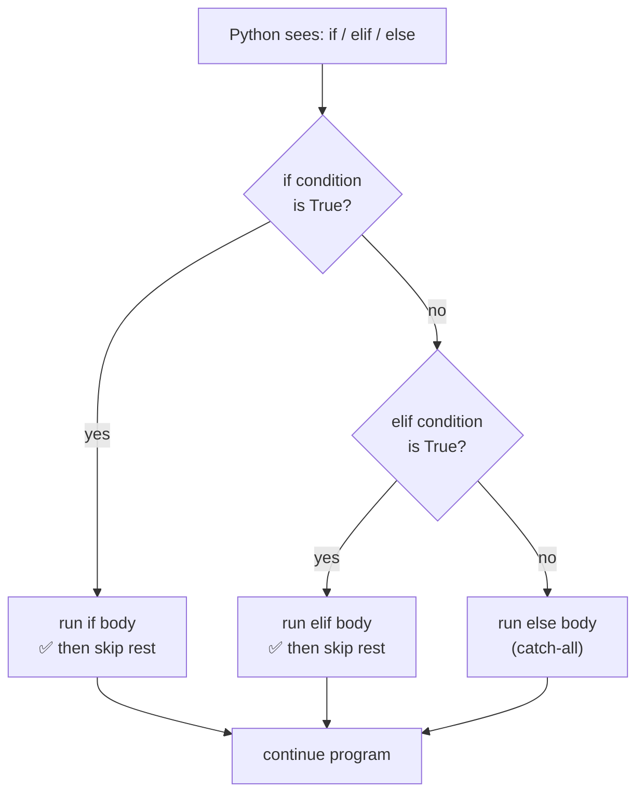

# if / elif / else — Conditional Control Flow

> Author: **Tamilselvan** · ✉️ tamilselvan.sde@gmail.com
> Section: 03 — Control Flow
> 🔗 Related: [for_loop.md](./for_loop.md) · [while_loop.md](./while_loop.md) · [break_continue.md](./break_continue.md) · Back to [README](../README.md)

## 1. What is it?

`if` / `elif` / `else` is Python's **decision-making** construct. It evaluates boolean
expressions and branches execution to the block that matches the first true condition.

- `if`       — runs only when condition is `True`
- `elif`     — "else if"; checked only if the previous `if`/`elif` was `False`
- `else`     — runs when **no** preceding `if`/`elif` matched
- **Ternary**  — `x if cond else y` (one-line if/else)
- **Chaining** — `a < b < c` expands to `a < b and b < c`
- **match-case** — structural pattern matching (Python 3.10+)

```python
if cond:
    ...
elif cond2:
    ...
else:
    ...
```

## 2. Why do we use it?

- To make the program **react** differently based on data/state.
- To **guard** code paths (boundary checks, null checks, validation).
- To implement **state machines** and dispatcher logic.
- Pure functions can't exist without branching — it is the core of logic.

## 3. When should I choose it? (decision table)

| Situation | Use | Avoid |
|-----------|-----|-------|
| Two-way branch | `if / else` | — |
| Several mutually exclusive branches | `if / elif / else` | nested `if` (deep nesting) |
| Pick one of N values | ternary `x if c else y` | `if` block for 2 simple cases |
| Compare to multiple constants (3.10+) | `match-case` | giant `elif` chains |
| Range check | `a < x <= b` chaining | `a < x and x <= b` |
| Null/empty guard | `if not seq:` | `if len(seq) == 0:` |
| Default value | `x if x is not None else d` | `if x is None: x = d` |

## 4. Syntax

```python
# Basic
if condition:
    body
elif condition2:
    body2
else:
    body3

# Ternary expression
result = value_if_true  if condition  else  value_if_false

# Chained comparison
if 0 <= score <= 100: ...

# Short-circuit (and/or) as one-liner
condition and do_this()
condition or default_value

# Nested
if outer:
    if inner: ...

# match-case (3.10+)
match command:
    case "go":  move()
    case "quit": shutdown()
    case _:      unknown()
```

## 5. Basic Example

```python
score = 87

if score >= 90:
    grade = "A"
elif score >= 80:
    grade = "B"
elif score >= 70:
    grade = "C"
else:
    grade = "F"
print(grade)   # B

# Ternary
status = "pass" if score >= 50 else "fail"

# Chained comparison
if 0 <= score <= 100:
    print("valid")

# match-case (Python 3.10+)
match grade:
    case "A": print("Excellent")
    case "B" | "C": print("Good")
    case _:   print("Needs work")
```

## 6. Step-by-Step Dry Run

Code:
```python
x = 7
if x > 10:
    print("big")
elif x > 5:
    print("mid")
else:
    print("small")
```

| Step | Expression | Result | Action |
|------|------------|--------|--------|
| 1 | `x > 10` → `7 > 10` | False | skip `if` |
| 2 | `x > 5` → `7 > 5`  | True  | enter `elif` |
| 3 | `print("mid")` | — | output "mid" |
| 4 | reach `else` | — | skip (already matched) |

Output: `mid`

## 7. Built-in Methods / Idioms

Treat "methods" loosely here — Python has no methods on `if`; these are idioms used with conditionals.

### `range(start, stop, step)` guard with `if`
- **Purpose:** cheap boundary check before loops.
- **Syntax:** `if 0 <= i < len(arr): ...`
- **Example:** `if 0 <= idx < len(nums): return nums[idx]`
- **Complexity:** O(1).
- **Interview use:** safe indexing for recursive visits.
- **Mistakes:** forgetting that `stop` is exclusive.
- **Shortcut:** with negative indices `if -len(arr) <= idx < len(arr)`.

### `and` / `or` short-circuit
- **Purpose:** combine conditions or pick defaults.
- **Syntax:** `x and y` (stops if `x` falsy), `x or y` (returns `y` if `x` falsy).
- **Example:** `name = user_input or "guest"`.
- **Complexity:** O(1) per check.
- **Interview use:** default value trick — `val = data or default`.
- **Mistakes:** using `&` / `|` (bitwise) instead of `and` / `or`.
- **Shortcut:** `a or b or c or "default"`.

### `not` with truthiness
- **Purpose:** invert boolean condition.
- **Syntax:** `if not seq:`.
- **Example:** `if not stack: return None`.
- **Complexity:** O(1) (or O(len) for some containers — rare).
- **Mistakes:** `if not x is None` → use `if x is not None`.
- **Shortcut:** empty checks are truthiness checks: `not []`, `not ""`, `not 0`, `not None`.

### `any()` / `all()` as compact conditions
- **Purpose:** aggregate booleans over iterables.
- **Syntax:** `if any(x > 0 for x in nums): ...`
- **Example:** `if all(isinstance(v, int) for v in row): ...`
- **Complexity:** O(n) worst, short-circuits.
- **Interview use:** short-circuited validity checks.
- **Mistakes:** forgetting they short-circuit, so generators preferred.
- **Shortcut:** replace long `or` chains with `any`, long `and` chains with `all`.

### `match-case` (Python 3.10+)
- **Purpose:** structural pattern matching.
- **Syntax:** `match x: case pattern: body case _: default`.
- **Example:** `match (p.x, p.y): case (0, 0): ... case (int(a), int(b)): ...`
- **Complexity:** O(number of cases).
- **Interview use:** dispatcher/game AI/state machines.
- **Mistakes:** forgetting `_` is the wildcard; not guarding values with guards (`case _ if cond:`).
- **Shortcut:** `case "a" | "b" | "c":` for OR patterns.

## 8. Interview Example

**LeetCode 1365. How Many Numbers Are Smaller Than the Current Number**

```python
def smallerNumbersThanCurrent(nums):
    result = []
    for i in range(len(nums)):
        count = 0
        for j in range(len(nums)):
            if i != j and nums[j] < nums[i]:
                count += 1
        result.append(count)
    return result
```

The single `if i != j and nums[j] < nums[i]` line demonstrates short-circuit `and`
+ chained boolean decision — the kind of compact interview style reviewers love.

## 9. When NOT to use

- **Looping over a known iterable** → use `for`, not `if`-based dispatch.
- **Deep nested `if` (>3 levels deep)** → refactor into functions or `match-case` or dict dispatch.
- **Multiple boolean flags combined** → use `any()` / `all()` instead of long `or`/`and`.
- **Multi-way constant dispatch** → prefer `match-case` (3.10+) or dict lookup.
- **Tiny mutations across many alternatives** → dict of lambdas is faster than giant `elif` chains.

## 10. Common Mistakes

| # | Mistake | Fix |
|---|---------|-----|
| 1 | `if x = 5:` (assignment in condition) | `if x == 5:` |
| 2 | `if x is 5:` (compares identity, not equality) | `if x == 5:` |
| 3 | `if a < b < c` rewritten as `if a < b and b < c` (verbose) | chaining is preferred |
| 4 | `elif` after `else` (SyntaxError) | put `else` last |
| 5 | Forgetting `:` at end of `if` line | always end with `:` |
| 6 | Comparing floats with `==` | use `abs(a-b) < 1e-9` |
| 7 | `if x == True:` for bool | use `if x:` |
| 8 | `if not x is None` (Pythontically awkward) | `if x is not None` |
| 9 | Negating an `and` chain as `not a and not b` (DeMorgan error) | should be `not (a and b)` → `not a or not b` |
| 10 | Deep nested `if/else` (spaghetti) | refactor into guard clauses |

## 11. Memory Tricks

- **`elif` order matters** — first match wins. Write most-specific first, most-general last.
- **`else` is the catch-all** — put it last or omit it (omit when impossible state).
- **`=` ≠ `==`** — `=` assigns, `==` compares. Python yells at `if x = 5:`.
- **Ternary reads like English**: "give me A **if** true, otherwise B".
- **Chaining saves tokens**: `lo <= x < hi` is the standard interview guard.
- **`match` replaces `elif` ladders** for >5 constant cases.
- **DeMorgan by heart**: `not (A and B)` == `not A or not B`.

## 12. Interview Shortcuts

- Use **guard clauses**: bail early with `if not valid: return` rather than nest.
- Use **chaining** for binary-search bounds: `if lo <= mid < hi`.
- Use **`x if cond else y`** for short tunnels, but switch to a block when 2+ statements.
- Use **`any` / `all`** for short-circuited aggregate checks (think "exists", "every").
- `if not stack:` beats `if len(stack) == 0:` — Python idiom, fewer tokens, faster.
- Use **`match-case`** if the problem is a literal state machine.

## 13. Cheat Sheet Table

| Construct | Use When | Returns | Notes |
|-----------|----------|---------|-------|
| `if c:` | single decision | nothing | runs block if `c` truthy |
| `elif c:` | next alternative | nothing | only if previous was `False` |
| `else:` | default branch | nothing | at most one per `if` |
| `x if c else y` | two-way inline value | value | expression, use sparingly |
| `a < b < c` | range check | bool | chaining |
| `c1 and c2` | both must hold | last truthy/falsy | short-circuits |
| `c1 or c2`  | either holds | first truthy/last falsy | short-circuits |
| `not c` | invert | bool | prefer `not seq` over `len==0` |
| `any(it)` | at least one true | bool | short-circuits |
| `all(it)` | all are true | bool | short-circuits |
| `match/case` | structural dispatch (3.10+) | nothing | `_` is wildcard |

## 14. Time Complexity Table

| Operation | Time | Space |
|-----------|------|-------|
| Single `if` evaluation | O(eval of condition) | O(1) |
| Chain of N `elif` | O(N) worst, O(1) when constant N | O(1) |
| `any` over iterable of length n | O(n) worst, short-circuits | O(1) |
| `all` over iterable of length n | O(n) worst, short-circuits | O(1) |
| `match-case` over N cases | O(N) worst (compiler optimizations vary) | O(1) |
| Chained comparison `a < b < c` | O(1) for scalars | O(1) |

## 15. Visual Diagram (ASCII + Mermaid)



```
                ┌──────────────────┐
                │   evaluate cond  │
                └────────┬─────────┘
                         │
                    ┌────▼────┐
              ┌─yes─│ if cond │─no────────────────┐
              │     └─────────┘                   │
              ▼                                   ▼
        ┌──────────┐                       ┌───────────┐
        │ if body  │                       │ elif cond │
        └──────────┘                       └─────┬─────┘
                                              yes│   no
                                                ▼     ▼
                                          ┌────────┐ ┌──────────┐
                                          │ elif   │ │  else    │
                                          │ body   │ │  body    │
                                          └────────┘ └──────────┘
                                              │           │
                                              └─────┬─────┘
                                                    ▼
                                              ┌──────────┐
                                              │ continue │
                                              └──────────┘
```

## 16. Beginner Notes

> Remember:
> - Python uses **indentation** (4 spaces preferred) to mark a block — no `{}`.
> - End the `if` / `elif` / `else` header line with **`:`**.
> - `if` is **truthiness** based — empty containers, `0`, `0.0`, `""`, `None`, `False`,
>   and empty collections are all **falsy**; everything else is **truthy**.
> - Use `elif` (not `else if`) — Python flattens it into one keyword.
> - `match-case` requires Python 3.10+; use generic `elif` chains for older runtimes.

## 17. FAANG Tips

- **Guard clauses first**: reduces nested logic and reads top-to-bottom.
- **Chained comparisons** save tokens AND are slightly faster (Python avoids re-evaluating the middle operand).
- **`any`/`all` with generators** is the secret weapon for short-circuited aggregate checks (early-exit over long streams).
- Prefer **`is None` / `is not None`** for `None` checks, not `== None` (PEP 8).
- In **bool params**, use `if flag:` rather than `if flag == True:`.
- Use **`match-case`** only when it reads clearly; constant cascades in dispatchers are perfect.
- For **state-machine** problems (Tic-Tac-Toe, Maze), `match-case` is more readable than nested `if`.

## 18. Practice Problems

| Difficulty | Problem | Notes |
|-----------|---------|-------|
| Easy | [LeetCode 9. Palindrome Number](https://leetcode.com/problems/palindrome-number/) | if/elif on sign and digits |
| Easy | [LeetCode 1. Two Sum](https://leetcode.com/problems/two-sum/) | guard inner index with `if` |
| Easy | [LeetCode 2235. Add Two Integers](https://leetcode.com/problems/add-two-integers/) | warm-up |
| Medium | [LeetCode 1365. Numbers Smaller Than Current](https://leetcode.com/problems/how-many-numbers-are-smaller-than-the-current-number/) | short-circuit `and` |
| Medium | [LeetCode 12. Integer to Roman](https://leetcode.com/problems/integer-to-roman/) | chained thresholds as `elif` ladder |
| Medium | [LeetCode 45. Jump Game II](https://leetcode.com/problems/jump-game-ii/) | greedy with boundary `if` guards |
| Hard | [LeetCode 41. First Missing Positive](https://leetcode.com/problems/first-missing-positive/) | index-range and `if` swaps |
| Hard | [LeetCode 65. Valid Number](https://leetcode.com/problems/valid-number/) | huge state-machine `elif`/`match` cascade |

---
Next up: [for_loop.md](./for_loop.md) · [while_loop.md](./while_loop.md) · [break_continue.md](./break_continue.md) · Related: [../02_Data_Types/list.md](../02_Data_Types/list.md) · [../04_Functions/enumerate.md](../04_Functions/enumerate.md)