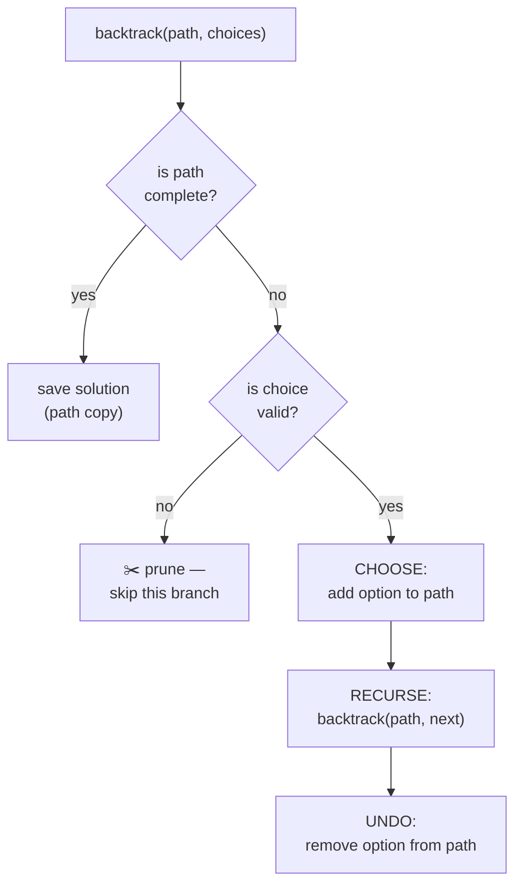

# Backtracking in Python (DETAILED)

> Author: **Tamilselvan** · ✉️ tamilselvan.sde@gmail.com · 🔗 [LinkedIn](https://www.linkedin.com/in/tamilselvan-ai/)
> Section: 07 — Algorithms
> 🔗 Related: [recursion.md](./recursion.md) · [sorting.md](./sorting.md) · [sliding_window.md](./sliding_window.md)
> Data: [big_o.md](../08_Time_Complexity/big_o.md)
> Back to [README](../README.md)

---

## 1. What is it?

**Backtracking** is a depth-first **search through a decision tree** where we **build a partial solution one choice at a time**, abandon any path that cannot possibly lead to a valid full solution (**prune**), and try the next alternative.

> **"Make a choice → recurse → undo the choice."** — the canonical mantra.

Formally: we enumerate a state space **S** of candidates and try to construct a valid solution by extending a partial solution `path`. At each step we iterate over all *eligible* choices, apply one, recurse, then **undo** it so the next iteration sees a clean slate.

### Real-world analogy
You're solving a **maze**. You walk down a corridor picking a direction; if you hit a dead end, you back up to the last fork and try another corridor. You leave no chalk marks dirty after returning — you erase your trail before exploring another branch, so each branch starts from a pristine state.

### What problem it solves
Any problem phrased as *"list **all** valid configurations"* — permutations, combinations, subsets, partitions, puzzles (N-Queens, Sudoku, Crossword), word search, palindrome partitioning, expression generation.

### Cross-link
Backtracking is a special DFS-over-decision-trees. See [recursion.md](./recursion.md) for the recursion fundamentals needed here.

---

## 2. Why do we use it?

- **Exhaustive but smart**: enumerates every valid configuration but skips entire subtrees via pruning — far faster than naïve brute force.
- **Generates actual solutions**, not just counts — you need the lists themselves (permutations, valid board placements, etc.).
- **Natural fit for constraints puzzles**: Sudoku, N-Queens, crosswords — where the search space is huge but dominated by dead branches.
- **Simple to code**: ~10-line recursive template handles dozens of LC problems.
- It is the **only practical tool** when you must output all combinations/permutations (DP gives counts, not listings).

---

## 3. When should I choose it?

| Trigger phrase in problem | Choose backtracking? | Why |
|--------------------------|---------------------|-----|
| "List all permutations / combinations / subsets" | ✅ | Enumeration by nature |
| "Number of ways to… that satisfy…" (just count, small n) | ✅ or DP | DP if n small/medium & state well-defined |
| "Solve puzzle" (Sudoku, N-Queens) | ✅ | Constraint satisfaction |
| "Find any path that spells word W in grid" | ✅ | LC 79 Word Search |
| "Generate all valid parentheses / IP addresses" | ✅ | Constructive enumeration |
| Count ways with n ≤ 10⁹ | ❌ → DP / math | Too large to enumerate |
| "Shortest path / min cost" | ❌ → BFS / Dijkstra | Backtracking explores all, not optimal |
| "Maximum sum subarray of size k" | ❌ → sliding window | Fixed-size constraint |

---

## 4. Syntax

The universal backtracking skeleton:

```python
def backtrack(path, choices):
    # 1. Base case: stop if path is a complete solution
    if is_solution(path):
        res.append(path[:])      # COPY, don't append reference
        return

    # 2. Optional: prune invalid partial solutions
    # if not is_valid(path):        # early exit
    #     return

    # 3. Try each candidate choice
    for c in choices:
        if not is_safe(c):       # optional feasibility/pruning
            continue
        path.append(c)           # MAKE the choice
        backtrack(path, next_choices(c, path))    # RECURSE
        path.pop()               # UNDO the choice
```

Three parts you **must** internalize:

1. **`path[:]`** when storing the solution — Python lists are mutable; without the slice copy every stored solution would mutate to `[]`.
2. **Pruning** (`is_safe`/`is_valid`) — where backtracking beats brute force.
3. **Undo** (`path.pop()`) — restores state for the sibling iteration.

Loop-controlled backtracking with index `start` (for combinations/subsets):

```python
def backtrack(start, path):
    res.append(path[:])               # every prefix is a valid subset
    for i in range(start, len(nums)):
        path.append(nums[i])
        backtrack(i + 1, path)         # i+1 ⇒ no reuse → combinations
        path.pop()
```

With **swap in place** (permutations, O(1) extra space at each level):

```python
def backtrack(first):
    if first == n:
        res.append(nums[:]); return
    for i in range(first, n):
        nums[first], nums[i] = nums[i], nums[first]     # choose
        backtrack(first + 1)
        nums[first], nums[i] = nums[i], nums[first]     # undo
```

---

## 5. Basic Example

**LC 78 — Subsets:** Given `nums` (distinct ints), return all possible subsets.

```python
def subsets(nums):
    res = []
    def backtrack(start, path):
        res.append(path[:])
        for i in range(start, len(nums)):
            path.append(nums[i])     # choose
            backtrack(i + 1, path)  # recurse (no reuse)
            path.pop()              # undo
    backtrack(0, [])
    return res

print(subsets([1,2,3]))
```

**Output:**
```
[[], [1], [1,2], [1,2,3], [1,3], [2], [2,3], [3]]
```

---

## 6. Step-by-Step Dry Run

`subsets([1,2,3])`. The recursion tree (each node prints `path` before exploring):

```
backtrack(0, [])
  res=[[]]
  i=0: choose 1 → backtrack(1,[1])
         res=[[],[1]]
         i=1: choose 2 → backtrack(2,[1,2])
                res=[[],[1],[1,2]]
                i=2: choose 3 → backtrack(3,[1,2,3])
                       res=[[],[1],[1,2],[1,2,3]]
                       i loop empty → return
                pop 3           ← undo
         i=2: choose 3 → backtrack(3,[1,3])
                res=[[],[1],[1,2],[1,2,3],[1,3]]
                return
         pop 3           ← undo
         loop done, pop 1     ← undo
  i=1: choose 2 → backtrack(2,[2])
         res += [2], then [2,3]
         pop 3, pop 2
  i=2: choose 3 → backtrack(3,[3])
         res += [3]
         pop 3
```

Total stored: 8 subsets (2³).

```
Decision tree (DFS order):

                []
        /1        |2        \3
       [1]      [2]        [3]
      /2  \3     \3
    [1,2][1,3]  [2,3]
    /3
 [1,2,3]
```

---

## 7. Built-in Methods / Idioms

Python has **no** built-in backtracking helper, but it ships with related generators worth knowing:

| Idiom | Purpose | Syntax | Complexity | Interview use | Mistakes |
|------|--------|--------|-----------|---------------|---------|
| `itertools.permutations` | Generate all perms | `permutations(nums)` | O(n!) | Sanity-check your own | Hard to stop early; doesn't allow custom pruning |
| `itertools.combinations` | All k-combos | `combinations(nums, k)` | O(C(n,k)) | Sanity check | Misses duplicates by value (use set) |
| `itertools.product` | Cartesian product (with replacement) | `product('ABC', repeat=3)` | O(kⁿ) | Locked patterns | Default isn't unique-checked |
| `res.append(path[:])` | **Snapshot** current path | slice copy | O(k) | EVERY backtracking problem | `res.append(path)` — aliasing bug → all entries become `[]` |
| `res.append("".join(path))` | For string building | join | O(k) | LC 22, 17, 93 | Using list of chars and storing list reference instead of string |
| `used = [False]*n` | Track picked elements | boolean array | O(1) check | LC 46, 47 | Forgetting to reset on backtrack — but you usually reset via `used[i]=False` |
| `nums.sort()` + skip `if i>0 and nums[i]==nums[i-1] and not used[i-1]` | Avoid duplicates | sorted + check | O(n log n) | LC 47, 40, 90 | Wrong skip direction (must be `not used[i-1]`) |
| `backtrack(start+1, …)` vs `backtrack(i+1, …)` | Reuse allowed vs not | reuse: same idx OK | n/a | LC 39 (reuse) vs 78 (no reuse) | Mixing the two up |

**Shortcut patterns:**

| Pattern | When to use |
|---------|-------------|
| **Subset template** | "list all subsets/subsequences" → push then recurse |
| **Permutation template** | "list all orderings" → swap or `used[]` |
| **Combination template** | "pick k from n, orderless" → use `start` index |
| **Counting template** | No need for full list → return int; seen variants become DP |

---

## 8. Interview Example

### 8.1 LC 46 — Permutations
```python
def permute(nums):
    res, n = [], len(nums)
    used = [False]*n
    def bt(path):
        if len(path) == n:
            res.append(path[:]); return
        for i in range(n):
            if used[i]: continue
            used[i] = True
            path.append(nums[i])
            bt(path)
            path.pop(); used[i] = False
    bt([])
    return res
```

### 8.2 LC 39 — Combination Sum (reuse allowed)
```python
def combinationSum(cands, target):
    res = []
    def bt(start, remain, path):
        if remain == 0: res.append(path[:]); return
        if remain < 0:  return             # prune!
        for i in range(start, len(cands)):
            path.append(cands[i])
            bt(i, remain - cands[i], path)  # i (not i+1) ⇒ reuse allowed
            path.pop()
    bt(0, target, [])
    return res
```

### 8.3 LC 51 — N-Queens (placement puzzle)
```python
def solveNQueens(n):
    cols, diag1, diag2 = set(), set(), set()
    res, board = [], [["."]*n for _ in range(n)]
    def bt(r):
        if r == n:
            res.append(["".join(row) for row in board]); return
        for c in range(n):
            if c in cols or (r-c) in diag1 or (r+c) in diag2: continue
            cols.add(c); diag1.add(r-c); diag2.add(r+c)
            board[r][c] = "Q"
            bt(r+1)
            board[r][c] = "."
            cols.remove(c); diag1.remove(r-c); diag2.remove(r+c)
    bt(0)
    return res
```

### 8.4 LC 79 — Word Search (DFS+backtrack on grid)
```python
def exist(board, word):
    R, C, n = len(board), len(board[0]), len(word)
    def bt(r, c, i):
        if i == n: return True
        if r<0 or r>=R or c<0 or c>=C or board[r][c] != word[i]: return False
        ch, board[r][c] = board[r][c], "#"      # mark visited
        found = (bt(r+1,c,i+1) or bt(r-1,c,i+1) or
                 bt(r,c+1,i+1) or bt(r,c-1,i+1))
        board[r][c] = ch                        # undo mark
        return found
    return any(bt(r,c,0) for r in range(R) for c in range(C))
```

### 8.5 LC 22 — Generate Parentheses
```python
def generateParenthesis(n):
    res = []
    def bt(o, c, s):
        if len(s) == 2*n: res.append("".join(s)); return
        if o < n:     s.append("("); bt(o+1,c,s); s.pop()
        if c < o:     s.append(")"); bt(o,c+1,s); s.pop()
    bt(0,0,[])
    return res
```

---

## 9. When NOT to use

| Situation | Why not | Alternative |
|-----------|--------|-------------|
| n large (≥ 20–25 for permutations) | O(n!) explodes | DP if counting, math if closed-form |
| Only need count, not configurations | Storing all lists wastes memory | DP / combinatorial formula |
| Need shortest/optimal solution, not all configs | Explore-all is too broad | BFS / Dijkstra / greedy |
| Pure subset-sum where elements are non-small and duplicates heavy | Exponential | Meet-in-the-middle |
| Cardinality known and pattern monotonic | Brute enumerate is wasteful | Two pointers / sliding window |
| Continuous search space | Discrete choices only | Optimization methods |

---

## 10. Common Mistakes

1. **`res.append(path)`** instead of `res.append(path[:])` — every stored entry becomes the same mutable list, ending up as `[]` after pops. **Always copy**.
2. Forgetting `path.pop()` (or `used[i]=False`) → next iteration sees polluted state → wrong outputs / wrong counts.
3. **Pruning too late or too early**: pruning after the recursive call is useless; pruning before the for-loop or via `continue` inside it works.
4. **Wrong `start`/`i+1`/`i`**: Using `i+1` when reuse is allowed (LC 39) gives wrong answers; using `i` when reuse is NOT allowed (LC 78) yields duplicates.
5. **Handling duplicates incorrectly**: must sort first; then skip when `nums[i]==nums[i-1] and not used[i-1]` (permutation) or `i>start and nums[i]==nums[i-1]` (combination). Skipping the *other* branch leads to missing valid solutions.
6. **Iterating over `enumerate(nums)` inside recursion** for permutations — you end up with full choice set every level; use `used[]` or swap trick instead.
7. **Modifying the loop variable** inside recursion: `for x in choices` over a list you're mutating. Iterate over a snapshot or use index loop.
8. **Global state cleanup**: leaving `used` set entries between runs (tests) corrupts subsequent calls.
9. **For string problems**, mutating `s = s + "("` instead of `s += "("` — both create a new str, so the "undo" is automatic (no `pop` needed). But `s.append("(")+s.pop()` mix-up happens often. Choose ONE style per problem.
10. **Recursion depth** on deep branching (n ≥ 1000) → `RecursionError`. Raise limit with `sys.setrecursionlimit(100000)` or convert to iterative stack.

---

## 11. Memory Tricks

- 🍞 **"Toast pattern"**: Butter toast → take a bite (choose) → chew (recurse) → unbite (undo). Magical but works as muscle memory.
- 🧭 **"Pick → recurse → pop"**: 3 verbs, that's all of backtracking.
- 📷 **Snapshot path with `[:]`** — like taking a photo before losing the moment.
- ✂️ **Prune early, prune often** — death to full enumeration.
- 🔢 Use **`start` index** for **combinations/subsets**; use **`used[]`** for **permutations**.
- ♻️ **Reuse allowed?** Pass `i`, not `i+1`.

---

## 12. Interview Shortcuts

- Default skeleton is ~5 lines; reuse for every problem.
- For **string-building** problems use list-of-chars + `"".join(path[:])` for speed; `s + ch` recursion copies strings.
- For **permutations of distinct** → swap trick, O(1) extra space.
- For **permutations with duplicates** → sort + `used[i-1]` skip.
- For **subsets with duplicates** (LC 90) → sort + `i > start and nums[i]==nums[i-1]` skip.
- For **N-Queens** use diagonal sets: `r-c` and `r+c` uniquely identify the two diagonal families.
- For **Sudoku** keep row/col/box bitmasks (or sets) to O(1) feasibility.
- **Pruning by remaining target** (LC 39): `if remain < 0: return` is the single biggest time saver.
- **Stop early** on first solution when asked "any one" (LC 37 Sudoku solver) — use `True`-returning recursion.
- Use `@lru_cache` on `bt(...)` inputs ONLY if pure — rare but valid.

---

## 13. Cheat Sheet Table

| Problem family | Key state | Loop bounds | Bonus prune |
|---------------|-----------|-------------|-------------|
| Subsets (78) | `start, path` | `i in range(start, n)` | none |
| Subsets II (90) | same | same | skip dups |
| Combinations (77) | `start, path`, len `k` | `range(start, n)` | `if len > k: return` |
| Combination Sum (39) | `start, remain, path` | `range(start, n)`; reuse → `bt(i, …)` | `remain < 0` ⇒ prune |
| Combination Sum II (40) | same | `range(start, n); i+1` | skip dups |
| Permutations (46) | `used, path` | `range(n)` | none |
| Permutations II (47) | `used, path` | `range(n)` | skip dups |
| N-Queens (51) | `r, cols, diag1, diag2` | `for c in range(n)` | 4-set membership |
| Sudoku (37) | `board, row/col/box sets` | pick empty cell; try 1..9 | bitmask sets |
| Word Search (79) | `r,c,i` | 4 directions | mark `board[r][c]='#'` |
| Palindrome Partition (131) | `start, path` | `range(start, n)` | substring must be palindrome |
| Generate Parentheses (22) | `o, c, s` | branch: open if o<n, close if c<o | – |

---

## 14. Time Complexity Table

| Problem | Branching factor b | Depth d | # leaves | Total nodes | Time |
|---------|---------|---------|----------|-------------|------|
| Subsets (78) | shrinking | n | 2ⁿ | 2ⁿ⁺¹ | **O(n·2ⁿ)** |
| Combinations C(n,k) | – | k | C(n,k) | O(C(n,k)) | **O(C(n,k)·k)** |
| Permutations (46) | n-i | n | n! | ~e·n! | **O(n·n!)** |
| N-Queens | up to n per row | n | n! | roughly n! | **O(n!)** |
| Combination Sum (39) | n | ≤ target/min | — | exponential | O(n^(target/min)) worst |
| Word Search (79) | 4 dirs | L = len(word) | – | – | O(R·C·4ᴸ) |
| Sudoku | 9 | 81 | – | worst case 9⁸¹ | practical: tiny |
| Generate Parentheses (22) | 2 (open/close) | 2n | Catalan(n) | – | O(4ⁿ/√n) |

**Space** = recursion depth + path storage = O(d) for DFS, O(n) typically.

---

## 15. Visual Diagram (ASCII + Mermaid)



**Generic DFS over decision tree** (backtracking skeleton):

```
backtrack(path, choices)
        │
        ▼
 is path complete? ──yes──► res.append(path[:]);  return
        │ no
        ▼
 prune valid? ──no──► return
        │ yes
        ▼
 for c in choices:
   path.append(c)                     ← CHOOSE
   backtrack(path, next_choices)      ← RECURSE
   path.pop()                          ← UNDO
        │
        ▼
   return   (back to caller)
```

**N-Queens partial tree (n=4):**
```
                Q at row 0
        col0     col1    col2    col3
         |        |        |       |
       ... skip attacks ...
         Q1c0—Q2c2 ↘dead
         Q1c0—Q2c3 ↘live → Q3c1 → Q4c2 → ✗ conflict
         Q1c1—Q2c3 ↘live → Q3c0 → Q4c2 → ✓ solution!
```

**Permutation subtree for [1,2,3]:**
```
                  []
        /1       /2       \3
       [1]     [2]       [3]
      /2 \3    /1 \3     /1 \2
   [1,2][1,3] [2,1][2,3] [3,1][3,2]
    |3   |2    |3   |1    |2   |1
 [1,2,3][1,3,2][2,1,3][2,3,1][3,1,2][3,2,1]
```

**Subset enumeration DFS order in tree form:**
```
                          []
              /1                     /2           \3
            [1]                    [2]          [3]
         /2    \3                  \3
       [1,2] [1,3]               [2,3]
        |3
     [1,2,3]
```

---

## 16. Beginner Notes

> **Remember:**
> - Backtracking = **DFS over a decision tree** with **prune + undo**.
> - Mantra: **choose → recurse → undo**.
> - **Copy** the path when storing: `res.append(path[:])`.
> - Pruning converts brute-force enumeration into practical search.
> - Use **`start`** for combinations/subsets (no reuse), **`used[]`** for permutations, **`i`** (not `i+1`) when reuse is allowed.
> - For duplicates: **sort first**, then skip equal neighbors.
> - Many backtracking problems are just DP-in-disguise when only the count is needed → revisit as DP after writing enumeration version.
> - See [recursion.md](./recursion.md) for base case / recursion depth understanding.

---

## 17. FAANG Tips

- **Templates first**: interviewers check if you instinctively reach for the right skeleton. Memorize the four (subset/combination/permutation/grid).
- **Prune aggressively**: even a `if target < 0: return` saves orders of magnitude — interviewers love seeing it.
- **Mention the complexity**: saying "O(n·n!) because there are n! leaves and O(n) work to copy each" is +points.
- **Iterative DFS** with explicit stack may be needed if recursion limit is hit (rare but defensible).
- For **palindrome partitioning** (LC 131), precompute a palindrome table (DP!) and use it inside backtracking → hybrid DP+BT, very impressive to mention.
- **Memoize backtracking** = DP: if you start caching `bt(start, remain)` results, you've transitioned from backtracking to DP — interesting observation to verbalize in interviews.
- For **Sudoku parser**, prefer bit masks (9 bits packed in an int) for rows/cols/boxes — O(1) feasibility, very interview-savvy.
- For **Word Search**, marking the board in-place (`board[r][c]='#'`) saves O(n) extra visited set — discuss trade-off with interviewer.
- When the question asks "return any valid solution", **return True early** instead of collecting all — common LC 37 optimization.

---

## 18. Practice Problems

### Easy
| # | Title | LeetCode |
|---|-------|----------|
| 17 | Letter Combinations of a Phone Number | [link](https://leetcode.com/problems/letter-combinations-of-a-phone-number/) |
| 77 | Combinations | [link](https://leetcode.com/problems/combinations/) |
| 78 | Subsets | [link](https://leetcode.com/problems/subsets/) |
| 401 | Binary Watch | [link](https://leetcode.com/problems/binary-watch/) |

### Medium
| # | Title | LeetCode |
|---|-------|----------|
| 39 | Combination Sum | [link](https://leetcode.com/problems/combination-sum/) |
| 46 | Permutations | [link](https://leetcode.com/problems/permutations/) |
| 47 | Permutations II | [link](https://leetcode.com/problems/permutations-ii/) |
| 90 | Subsets II | [link](https://leetcode.com/problems/subsets-ii/) |
| 22 | Generate Parentheses | [link](https://leetcode.com/problems/generate-parentheses/) |
| 79 | Word Search | [link](https://leetcode.com/problems/word-search/) |
| 131 | Palindrome Partitioning | [link](https://leetcode.com/problems/palindrome-partitioning/) |
| 93 | Restore IP Addresses | [link](https://leetcode.com/problems/restore-ip-addresses/) |

### Hard
| # | Title | LeetCode |
|---|-------|----------|
| 51 | N-Queens | [link](https://leetcode.com/problems/n-queens/) |
| 52 | N-Queens II | [link](https://leetcode.com/problems/n-queens-ii/) |
| 37 | Sudoku Solver | [link](https://leetcode.com/problems/sudoku-solver/) |
| 126 | Word Ladder II | [link](https://leetcode.com/problems/word-ladder-ii/) |
| 140 | Word Break II | [link](https://leetcode.com/problems/word-break-ii/) |
| 291 | Word Pattern II | [link](https://leetcode.com/problems/word-pattern-ii/) |

---

**Cross-links:** [recursion.md](./recursion.md) · [sliding_window.md](./sliding_window.md) · [sorting.md](./sorting.md) · [big_o.md](../08_Time_Complexity/big_o.md) · Back to [README](../README.md)