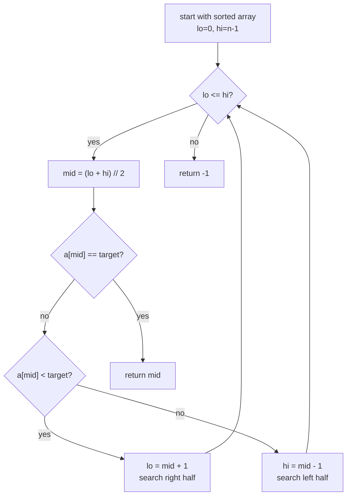

# Binary Search in Python

> Author: **Tamilselvan** · ✉️ tamilselvan.sde@gmail.com · 🔗 [LinkedIn](https://www.linkedin.com/in/tamilselvan-ai/)
> Section: 07 — Algorithms
> 🔗 Related: [searching.md](./searching.md) · [sorting.md](./sorting.md) · [recursion.md](./recursion.md) · [two_pointers.md](./two_pointers.md)
> Data: [list.md](../02_Data_Types/list.md) · [big_o.md](../08_Time_Complexity/big_o.md)
> Back to [README](../README.md)

---

## 1. What is it?

**Binary search** halves the search range on every step. Given a **sorted** array `a`, you look at the **middle** element; if the target is smaller, the answer is in the left half, otherwise the right half.

Repeated halving collapses n elements down to 1 in `log₂(n)` steps — a search in 1,000,000 elements takes ~20 comparisons instead of 1,000,000.

**Prerequisite**: the input must be **sorted** on the search key, OR — more generally — it must be **binary-searchable**: there exists a predicate such that `a[i]` answers false for a contiguous prefix and true for the rest. This includes "find the first bad version" (278), "find minimum in rotated sorted array" (153), "split array largest sum" (410) problems — even though the data isn't perfectly monotonic.

Two classic templates:
- **Template A — inclusive right bound** (`hi = len(a) - 1`, `while lo <= hi`)
- **Template B — exclusive right bound** (`hi = len(a)`, `while lo < hi`) — preferred by **bisect** and most "find first/last position" problems.

Python's standard library gives you the `bisect` module for exactly this:

```python
import bisect
i = bisect.bisect_left(a, x)   # insertion point for x (any equal element's left)
j = bisect.bisect_right(a, x)  # insertion point after any equal element
i = bisect.bisect(a, x)        # alias of bisect_right
bisect.insort_left(a, x)       # insert x keeping a sorted (O(n) due to shifts)
```

**What problem it solves:** Find an element, an insertion point, or a decision boundary in **sorted** (or binary-searchable) data in **O(log n)** time.

**Real-world analogy:** "Guess a number between 1 and 100" — every "higher / lower" answer halves the search space. That is exactly binary search.

---

## 2. Why do we use it?

- **O(log n) time**: eye-popping speedup when n is large (10⁹ elements → 30 checks).
- **O(1) space** if written iteratively.
- The same skeleton answers many variants: exact match, first occurrence, last occurrence, insertion point, find min in rotated array, capacity problems, etc.
- Foundation for many "bisect-on-answer" patterns: minimal maximum (Split Array Largest Sum 410, Capacity to Ship Packages 1011, Koko Eating Bananas 875).
- Required for **searching** tasks on sorted data — see [searching.md](./searching.md).

---

## 3. When should I choose it? — Decision Table

| Situation                                                  | Best choice                              | Notes                                            |
|------------------------------------------------------------|------------------------------------------|--------------------------------------------------|
| Sorted array, exact match                                   | `bisect_left` then check                  | Standard pattern                                  |
| Sorted array, first occurrence                             | `bisect_left(a, x)`                       | Returns leftmost if duplicate                     |
| Sorted array, last occurrence                               | `bisect_right(a, x) - 1`                  | Returns rightmost                                  |
| Find insertion index                                       | `bisect_left(a, x)`                       | Same as "search insert position"                 |
| Min in rotated sorted array                                 | template B with custom predicate         | (153)                                              |
| Search in rotated sorted array                              | template B variant                       | (33)                                               |
| "Minimize the maximum" / "maximize the minimum"           | **bisect on answer**                     | Predicate f(x) → monotone in answer               |
| Unsorted array                                             | linear scan / hash map                    | See `searching.md`                                |
| Need original index after sort                              | sort (index, value) pairs, then binary   | See `sorting.md`                                  |
| Linked list                                                 | not possible                              | No random access                                   |
| Custom binary predicate (first true over a range)           | template B with `check(x)`               | Generalization of bisect                          |

---

## 4. Syntax

### Template A — inclusive right bound

```python
def binary_search(a, target):
    lo, hi = 0, len(a) - 1
    while lo <= hi:
        mid = lo + (hi - lo) // 2          # avoid overflow in other languages
        if a[mid] == target:
            return mid
        elif a[mid] < target:
            lo = mid + 1
        else:
            hi = mid - 1
    return -1
```

### Template B — exclusive right bound (canonical "find first ≥")

```python
def lower_bound(a, target):
    lo, hi = 0, len(a)
    while lo < hi:
        mid = lo + (hi - lo) // 2
        if a[mid] < target:
            lo = mid + 1
        else:
            hi = mid
    return lo            # first index with a[i] >= target
```

### Find first and last occurrence

```python
def first_last(a, target):
    first = bisect.bisect_left(a, target)
    if first == len(a) or a[first] != target:
        return [-1, -1]
    last = bisect.bisect_right(a, target) - 1
    return [first, last]
```

### Using the stdlib `bisect`

```python
import bisect
i = bisect.bisect_left([1,2,2,2,3], 2)    # 1  (leftmost 2)
j = bisect.bisect_right([1,2,2,2,3], 2)   # 4  (after rightmost 2)
i = bisect.bisect_left([1,3,5,7], 4)      # 2  (insertion index)
```

---

## 5. Basic Example

### Exact match

```python
a = [1, 3, 5, 7, 9, 11]
print(binary_search(a, 7))    # 3
print(binary_search(a, 6))    # -1
```

### First and last occurrence

```python
a = [1, 2, 2, 2, 3, 4]
print(first_last(a, 2))       # [1, 3]
print(first_last(a, 5))      # [-1, -1]
```

### Insertion position (35 Search Insert Position)

```python
def searchInsert(a, x):
    i = bisect.bisect_left(a, x)
    return i

print(searchInsert([1,3,5,6], 5))   # 2
print(searchInsert([1,3,5,6], 2))  # 1   -> insert here; shifts 3 right
print(searchInsert([1,3,5,6], 7))  # 4   -> end
print(searchInsert([1,3,5,6], 0))  # 0   -> beginning
```

### Search on a custom predicate — find first ≥ `target`

```python
def first_ge(a, target):
    lo, hi = 0, len(a)
    while lo < hi:
        mid = lo + (hi - lo) // 2
        if a[mid] < target:
            lo = mid + 1
        else:
            hi = mid
    return lo
```

### Recursive binary search

```python
def bsearch_rec(a, lo, hi, target):
    if lo > hi:
        return -1
    mid = lo + (hi - lo) // 2
    if a[mid] == target:
        return mid
    if a[mid] < target:
        return bsearch_rec(a, mid + 1, hi, target)
    return bsearch_rec(a, lo, mid - 1, target)

print(bsearch_rec([1,3,5,7,9], 0, 4, 7))   # 3
```

---

## 6. Step-by-Step Dry Run

### Template A on `a = [1,3,5,7,9,11]`, target = 7

```
iter 1: lo=0 hi=5  mid=2  a[2]=5  5 < 7 -> lo=3
iter 2: lo=3 hi=5  mid=4  a[4]=9  9 > 7 -> hi=3
iter 3: lo=3 hi=3  mid=3  a[3]=7 == 7 -> return 3
```

ASCII narrowing the search space:

```
  [1, 3, 5, 7, 9, 11]    target=7
       lo=0     hi=5
            mid=2  a[2]=5
                  | 5 < 7 -> lo=mid+1=3
            lo=3 hi=5
                  mid=4  a[4]=9
                        9 > 7 -> hi=mid-1=3
            lo=3 hi=3
                  mid=3  a[3]=7 → match! return 3
```

### Template B / lower_bound on `[1,2,2,2,3,4]`, target = 2

```
iter 1: lo=0 hi=6  mid=3  a[3]=2  2 >= 2 -> hi=3
iter 2: lo=0 hi=3  mid=1  a[1]=2  2 >= 2 -> hi=1
iter 3: lo=0 hi=1  mid=0  a[0]=1  1 <  2 -> lo=1
end:    lo=1  -> first index where a[i] >= 2 -> 1
```

### Common bug — infinite loop with `hi = mid` (when should be `hi = mid - 1`)

```
template A with hi = mid instead of hi = mid - 1:
  lo=0 hi=1  mid=0  a[0] > target -> hi = 0
  lo=0 hi=0  mid=0  a[0] > target -> hi = 0   (NO PROGRESS!) → infinite loop
```

Use `hi = mid + 1` when shrinking left or `hi = mid` with the **exclusive** template to avoid this trap.

### Bisect-left dry run on `[1,3,5,7]`, target = 4

```
lo=0 hi=4 mid=2 a[2]=5  >= 4 -> hi=2
lo=0 hi=2 mid=1 a[1]=3  <  4 -> lo=2
end: lo=2  -> insert idx 2 (between 3 and 5)
```

---

## 7. Built-in Methods

### 7.1 `bisect.bisect_left(a, x, lo=0, hi=len(a))`
- **Purpose**: leftmost insertion point for `x` such that `a[:i]` < `x` ≤ `a[i:]`. **All values to the left of `i` are < x; all from `i` onward are ≥ x**.
- **Syntax**: `bisect.bisect_left(a, x)` or with bounds.
- **Example**: `bisect.bisect_left([1,2,2,3], 2)` → `1`. `bisect.bisect_left([1,3,5], 4)` → `2` (insertion index).
- **Complexity**: O(log n) time, O(1) space.
- **Interview use**: `find first occurrence`, `insertion position`, monotone predicate `first x satisfying p(x)`.
- **Mistakes**: forgetting bounds (`lo`, `hi`) when restricting to a slice; off-by-one when interpreting.
- **Shortcut**: `i = bisect_left(a, x); if i < len(a) and a[i] == x: ...` is the canonical "is x present?"

### 7.2 `bisect.bisect_right(a, x, lo=0, hi=len(a))` / `bisect.bisect`
- **Purpose**: rightmost insertion point — `i` such that `a[:i] <= x` and `a[i:] > x`. Used for finding the last occurrence.
- **Example**: `bisect_right([1,2,2,3], 2)` → `3` (after rightmost 2).
- **Complexity**: O(log n) time, O(1) space.
- **Interview use**: last occurrence = `bisect_right(a, x) - 1`; range count of `x` = `bisect_right - bisect_left`.
- **Mistakes**: confusing with left variant — when duplicates exist, they differ; for absent `x`, both return the insertion index.

### 7.3 `bisect.insort_left(a, x, lo=0, hi=len(a))` / `insort_right`
- **Purpose**: insert `x` into a sorted list `a` keeping it sorted. **Modifies `a` in place**.
- **Complexity**: O(log n) for the search, **O(n)** for the insert (shift elements).
- **Interview use**: maintain a sorted list when streaming; small volumes only — for large streams use `heapq` (see [heapq.md](../06_Collections/heapq.md)).
- **Mistakes**: assuming `insort` is O(log n) — shifting is O(n).
- **Shortcut**: `insort` returns `None`, not the list.

### 7.4 `bisect` on a list of tuples / custom keys

`bisect` doesn't take a `key` parameter (no equivalent of `key=`). Workarounds:
- Store transformed keys in a parallel list.
- Use a wrapper class with `__lt__`.
- Custom binary search template for non-trivial keys.

### 7.5 Why use `lo + (hi - lo) // 2` for `mid`

- `(lo + hi) // 2` is the arithmetic equivalent.
- For `n` close to 2³¹, `lo + hi` overflows in C / Java. Python ints don't overflow, but it is the convention taught in FAANG and considered best practice.
- Equivalent to `lo + ((hi - lo) >> 1)`.

---

## 8. Interview Example

### LeetCode 704 — Binary Search

```python
def search(nums, target):
    lo, hi = 0, len(nums) - 1
    while lo <= hi:
        mid = lo + (hi - lo) // 2
        if nums[mid] == target:
            return mid
        elif nums[mid] < target:
            lo = mid + 1
        else:
            hi = mid - 1
    return -1
```

### LeetCode 34 — Find First and Last Position of Element

```python
def searchRange(nums, target):
    if not nums:
        return [-1, -1]
    first = bisect.bisect_left(nums, target)
    if first == len(nums) or nums[first] != target:
        return [-1, -1]
    last = bisect.bisect_right(nums, target) - 1
    return [first, last]
```

### LeetCode 74 — Search a 2D Matrix

```python
def searchMatrix(matrix, target):
    m, n = len(matrix), len(matrix[0])
    lo, hi = 0, m * n - 1
    while lo <= hi:
        mid = lo + (hi - lo) // 2
        r, c = mid // n, mid % n
        if matrix[r][c] == target:
            return True
        elif matrix[r][c] < target:
            lo = mid + 1
        else:
            hi = mid - 1
    return False
```

### LeetCode 153 — Find Minimum in Rotated Sorted Array

```python
def findMin(nums):
    lo, hi = 0, len(nums) - 1
    while lo < hi:
        mid = lo + (hi - lo) // 2
        if nums[mid] > nums[hi]:
            lo = mid + 1           # min is in right half
        else:
            hi = mid               # min is in left half (including mid)
    return nums[lo]
```

Dry run `[4,5,6,7,0,1,2]`:

```
lo=0 hi=6
  mid=3 nums[3]=7 > nums[6]=2 -> lo=4
lo=4 hi=6
  mid=5 nums[5]=1 < nums[6]=2 -> hi=5
lo=4 hi=5
  mid=4 nums[4]=0 < nums[5]=1 -> hi=4
end: nums[4]=0
```

### LeetCode 33 — Search in Rotated Sorted Array

```python
def search(nums, target):
    lo, hi = 0, len(nums) - 1
    while lo <= hi:
        mid = lo + (hi - lo) // 2
        if nums[mid] == target:
            return mid
        if nums[lo] <= nums[mid]:                                # left half sorted
            if nums[lo] <= target < nums[mid]:
                hi = mid - 1
            else:
                lo = mid + 1
        else:                                                    # right half sorted
            if nums[mid] < target <= nums[hi]:
                lo = mid + 1
            else:
                hi = mid - 1
    return -1
```

### LeetCode 4 — Median of Two Sorted Arrays

```python
def findMedianSortedArrays(A, B):
    if len(A) > len(B):
        A, B = B, A
    m, n = len(A), len(B)
    lo, hi = 0, m
    while lo <= hi:
        i = lo + (hi - lo) // 2
        j = (m + n + 1) // 2 - i
        Aleft  = A[i-1] if i > 0 else float("-inf")
        Aright = A[i]   if i < m else float("inf")
        Bleft  = B[j-1] if j > 0 else float("-inf")
        Bright = B[j]   if j < n else float("inf")
        if Aleft <= Bright and Bleft <= Aright:
            if (m + n) % 2:
                return max(Aleft, Bleft)
            return (max(Aleft, Bleft) + min(Aright, Bright)) / 2
        elif Aleft > Bright:
            hi = i - 1
        else:
            lo = i + 1
```

### "Bisect on answer" — Split Array Largest Sum (410)

```python
def can_split(nums, k, cap):
    groups = 1
    total = 0
    for x in nums:
        if total + x > cap:
            groups += 1
            total = 0
        total += x
    return groups <= k

def splitArray(nums, k):
    lo, hi = max(nums), sum(nums)
    while lo < hi:
        mid = lo + (hi - lo) // 2
        if can_split(nums, k, mid):
            hi = mid
        else:
            lo = mid + 1
    return lo
```

---

## 9. When NOT to use

- **Input is not sorted** and can't be made monotone — sorting improves it but raises total cost; consider hash-based approaches (`set`, `dict`) instead.
- **Linked lists / no random access**: binary search needs O(1) middle access.
- **Dense small data** (n ≤ ~32): linear scan wins on cache locality and constant factor.
- **Repeated streaming queries** that freshness-sensitive: hash lookups are O(1) and stay accurate.
- **Predicate is not monotonic**: if "fa-se → tru-e" boundary doesn't hold, bisect doesn't apply.

---

## 10. Common Mistakes

1. **Off-by-one on bounds** — `while lo <= hi` vs `while lo < hi` carry different `hi` updates (`= mid - 1` vs `= mid`). Mixing them is the #1 bug.
2. **`hi = mid` causing infinite loop** when low half moves the wrong way: must move `lo = mid + 1` when shrinking right side.
3. **Mid calculation in overflow languages** — use `lo + (hi - lo) // 2`.
4. **Forgetting to check existence**: `bisect_left` returns an insertion index even if missing — verify `i < len(a) and a[i] == x`.
5. **Not handling duplicates**: `bisect_left` and `bisect_right` differ only when `x` already exists.
6. **Using template A for "first/last" variants**: prefer template B (exclusive `hi=len(a)`).
7. **Confusing `bisect_left`/`bisect_right`** arguments: they take the array first, then value, then optional `lo/hi` bounds.
8. **Forgetting Python's `bisect` has no `key`** — you must build a parallel sorted list of keys.
9. **Returning the index `i` of `bisect` but checking `a[i - 1]`**: off-by-one; verify both ends.
10. **Forgetting that `insort` is O(n)** because of shifting — calling it in a tight loop is O(n²).

---

## 11. Memory Tricks

- 🔑 "Halving the search space" — the literal definition. Each step halves n.
- 🔑 Counter: log₂(n) comparisons. 10⁶ elements → 20 comparisons.
- 🔑 Template B exclusive-syntax: `lo=0 hi=len(a) while lo<hi ... else hi=mid`. Range represents `[lo, hi)` half-open.
- 🔑 `bisect_left` returns index where `a[i] >= x`; `bisect_right` returns index where `a[i] > x`.
- 🔑 To find last occurrence use `bisect_right(a, x) - 1`.
- 🔑 "Find first true of a monotone predicate" — generalized rule: write `while lo < hi`, shrink the half that is "not yet true" toward `mid` (`hi = mid`) and the half that is true toward the left boundary (`lo = mid + 1` after a false).
- 🔑 **`@lru_cache`** can rescue a re-floored broken recursion attempt.

---

## 12. Interview Shortcuts

- `bisect.bisect_left(a, x)` — first index with `a[i] >= x`.
- `bisect.bisect_right(a, x) - 1` — last index with `a[i] == x`.
- `bisect.bisect_right(a, x) - bisect.bisect_left(a, x)` — count of `x`.
- For "find the minimum feasible X" pattern (410, 875, 1011): `lo, hi = lower_bound, upper_bound; while lo < hi: if feasible(mid): hi = mid else: lo = mid + 1`.
- **Search in 2D matrix** (74): treat matrix as 1D — `mid // n` row, `mid % n` col.
- **Rotated sorted** (33, 153): the half containing a sorted run is detectable by comparing `nums[lo]` to `nums[mid]`; recurse accordingly.
- **Always dry-run your boundaries** on `[]`, `[1]`, `[1,2]`, `[1,2,3]` and target-smaller, target-larger, missing target.

---

## 13. Cheat Sheet Table

| Need                                            | Code snippet                                            |
|-------------------------------------------------|---------------------------------------------------------|
| Exact index                                     | `bisect_left` + `a[i] == x`                              |
| First occurrence                                 | `bisect_left(a, x)`                                     |
| Last occurrence                                  | `bisect_right(a, x) - 1`                                |
| Insertion position (35)                         | `bisect_left(a, x)`                                     |
| Count of `x` (sorted)                           | `bisect_right(a, x) - bisect_left(a, x)`               |
| Find first ≥ target in custom predicate          | template B with custom predicate                         |
| Find min feasible value ("minimize the maximum") | `while lo < hi: if feasible(mid): hi=mid else: lo=mid+1`|
| Search in 2D matrix (74)                         | 1D indexing `mid // n`, `mid % n`                       |
| Min in rotated (153)                             | template with `nums[mid] vs nums[hi]`                    |
| Insert while keeping sorted                     | `bisect.insort_left(a, x)` — note O(n) shifts            |

---

## 14. Time Complexity Table

| Operation                                  | Time       | Space      |
|--------------------------------------------|------------|------------|
| Binary search (iterative)                  | O(log n)   | O(1)       |
| Binary search (recursive)                  | O(log n)   | O(log n)   |
| bisect_left / bisect_right                 | O(log n)   | O(1)       |
| insort_left / insort_right                 | O(n) total | O(1) extra | (search log n + shift n)
| First-and-last occurrence (two bisects)    | O(log n)   | O(1)       |
| Search in rotated sorted                   | O(log n)   | O(1)       |
| Search in 2D matrix (74)                   | O(log(mn)) | O(1)       |
| Bisect on answer (feasibility loop)        | O(log(range) * cost of feasibility) | O(1) |
| Median of two sorted arrays (4)            | O(log min(m,n)) | O(1)   |

---

## 15. Visual Diagram (ASCII + Mermaid)



### Narrowing search space

```
  [1, 3, 5, 7, 9, 11, 13, 15]   target=9
   lo=0              hi=7
          mid=3 a[3]=7   7 < 9 -> lo=4
                  lo=4 hi=7
                        mid=5 a[5]=11  11 > 9 -> hi=4
                  lo=4 hi=4
                        mid=4 a[4]=9 == 9 -> return 4
  total comparisons: 3   (log₂(8) = 3)
```

### Template A vs Template B schematic

```
  Template A (inclusive hi):
     lo=0, hi=n-1; while lo<=hi; mid=lo+(hi-lo)//2
     on match return; on small go right: lo=mid+1; on large go left: hi=mid-1
  
  Template B (exclusive hi):
     lo=0, hi=n;   while lo<hi;  mid=lo+(hi-lo)//2
     on "no" (a[mid] < target): lo=mid+1  (move past)
     on "yes" (a[mid] >= target): hi=mid   (keep)
     returns first index satisfying the predicate
```

### Lower-bound narrowing

```
  a = [1, 2, 2, 2, 3, 4]    target = 2
  
  Iter 1: lo=0 hi=6 mid=3 a[3]=2 ≥ 2 -> hi=3   [look left]
  Iter 2: lo=0 hi=3 mid=1 a[1]=2 ≥ 2 -> hi=1
  Iter 3: lo=0 hi=1 mid=0 a[0]=1 < 2 -> lo=1
  done: lo=1   -> first index of 2 = 1
```

### Bisect on answer — feasibility curve

```
  answer axis: x = capacity, feasible(x) = can we partition with capacity x?
  
  x:        max(nums)   ...   sum(nums)
  feasible:    F                 F       (W)
                                   T    T
  ^^^^^^^^^^^^^^^^^^^^^^^^^T^^^^^^^^^^^^^^^^^^^
                          ^ find first T (lo here)
  
  while lo < hi:
      mid = (lo + hi) // 2
      if feasible(mid): hi = mid        # might be the answer
      else:              lo = mid + 1    # too low, go higher
  return lo
```

### Flowchart

```
              start
                |
        is range empty?
          /         \
       yes           no
        |             |
   return -1      compute mid = lo + (hi-lo)//2
                        |
                  compare a[mid] vs target
                       /        |        \
                 smaller      equal     larger
                   |           |          |
                lo=mid+1   return mid   hi=mid-1
                          (or hi=mid in template B)
                   |                       |
                   ------------------- loop again
```

---

## 16. Beginner Notes — Remember block

```
Remember:
- Binary search REQUIRES sorted (or monotone-predicate) input.
- O(log n) time; O(1) space if iterative, O(log n) if recursive.
- Two canonical templates:
  Template A: lo=0 hi=n-1  while lo<=hi  use hi=mid-1 / lo=mid+1
  Template B: lo=0 hi=n    while lo<hi   use hi=mid / lo=mid+1  (for first-match)
- Always use mid = lo + (hi - lo) // 2 (overflow safe).
- bisect_left -> first i with a[i] >= x. bisect_right -> first i with a[i] > x.
- Last occurrence = bisect_right(a, x) - 1.
- Use Python's bisect module unless asked to manually code it.
- "Bisect on the answer" pattern: for minimize-maximum problems.
```

---

## 17. FAANG Tips

1. **Say binary search the moment you hear "sorted"** in an interview — it's expected.
2. **Default to `bisect`** for clean code, but be ready to implement it manually — interviewers may ask.
3. **For "first/last" variants**, always use template B (exclusive hi). Template A breaks on duplicates.
4. **Rotated sorted array** (33, 153): always identify which half is sorted (`nums[lo] <= nums[mid]` ⇒ left sorted). Pivot comparison is the key.
5. **Bisect on the answer**: pattern recognition "minimize the maximum" or "maximize the minimum" → capacity/discrete search space → use feasibility predicate under bisect.
6. **Edge cases to test**: `[]`, `[1]`, target smaller than all, target larger than all, target in middle, target absent between two elements.
7. **Avoid `lo = mid`** in any template — that's the most common infinite-loop source. `lo` must move forward at least one (`lo = mid + 1`).
8. **Median of Two Sorted Arrays (4)**: always make A the shorter array, binary search the partition count `i` such that `j = (m + n + 1) // 2 - i`; O(log min(m, n)).
9. **Search insert position (35)** = `bisect_left` (very short answer).
10. **When bisect is rejected for O(n) memory concerns**, consider `binary search on index` while streaming reads — many LeetCode hards (410, 875, 1011, 1231) all share this.

---

## 18. Practice Problems

| Difficulty | Problem                                                                                       | Hint                                                  |
|-----------|------------------------------------------------------------------------------------------------|-------------------------------------------------------|
| Easy      | [704 Binary Search](https://leetcode.com/problems/binary-search/)                             | Canonical template A                                  |
| Easy      | [35 Search Insert Position](https://leetcode.com/problems/search-insert-position/)           | `bisect_left`                                         |
| Easy      | [278 First Bad Version](https://leetcode.com/problems/first-bad-version/)                    | Bisect on predicate                                   |
| Medium    | [74 Search a 2D Matrix](https://leetcode.com/problems/search-a-2d-matrix/)                   | Flatten via `mid // n`, `mid % n`                      |
| Medium    | [34 Find First and Last Position](https://leetcode.com/problems/find-first-and-last-position-of-element-in-sorted-array/) | `bisect_left` + `bisect_right - 1` |
| Medium    | [153 Find Minimum in Rotated Sorted Array](https://leetcode.com/problems/find-minimum-in-rotated-sorted-array/) | template B with `nums[mid] vs nums[hi]` |
| Medium    | [33 Search in Rotated Sorted Array](https://leetcode.com/problems/search-in-rotated-sorted-array/) | Identify sorted half                          |
| Hard      | [4 Median of Two Sorted Arrays](https://leetcode.com/problems/median-of-two-sorted-arrays/)  | Binary search the partition index                      |
| Hard      | [410 Split Array Largest Sum](https://leetcode.com/problems/split-array-largest-sum/)        | Bisect on the answer with feasibility check            |
| Hard      | [1231 Divide Chocolate](https://leetcode.com/problems/divide-chocolate/)                      | Bisect on the answer                                  |

---

**Cross-links**: [searching.md](./searching.md) for what to do when input isn't sorted · [sorting.md](./sorting.md) for how to make data searchable · [recursion.md](./recursion.md) for the recursive variant · [two_pointers.md](./two_pointers.md) for pair searches in sorted data.