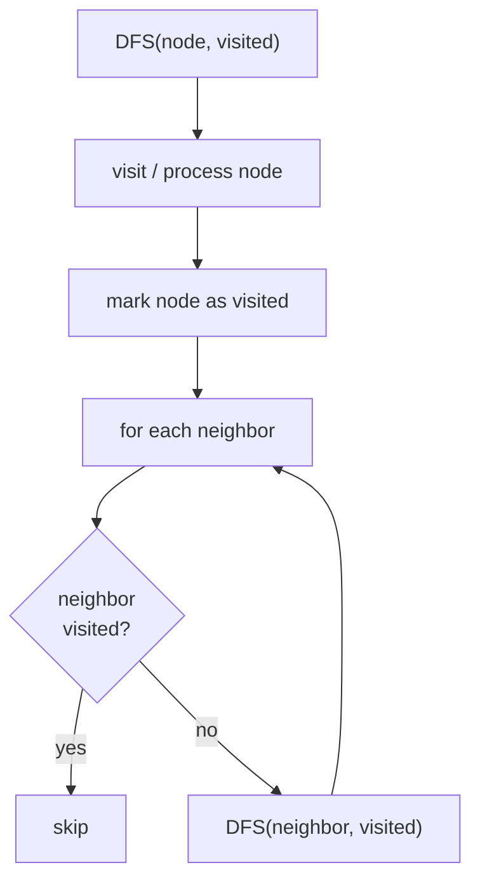

# Depth-First Search (DFS) in Python

> Author: **Tamilselvan** · ✉️ tamilselvan.sde@gmail.com
> Section: 07 — Algorithms
> 🔗 Related: [bfs.md](./bfs.md) · [recursion.md](./recursion.md) · [Trees](../05_OOP/classes.md) · [Graphs](./searching.md)
> Data: [list.md](../02_Data_Types/list.md) · [big_o.md](../08_Time_Complexity/big_o.md)
> Back to [README](../README.md)

---

## 1. What is it?

**Depth-First Search (DFS)** dives as deep as possible along each branch before **backtracking**. Starting at a source node it follows the first neighbour, then *that* node's first neighbour, and keeps plunging until it hits a dead end (no unvisited neighbour) — then it backtracks and tries the next sibling.

Two implementations:
- **Recursive** — the Python call stack == the DFS stack. Cleanest code, but limited by `sys.setrecursionlimit` (default ~1000).
- **Iterative** — explicit `list` stack. Avoids recursion limits; crucial on deep graphs or large grids.

```
        1            Visit order (pre-order): 1 → 2 → 4 → 5 → 3 → 6
       / \
      2   3         Each branch is exhausted before moving to the next sibling.
     / \   \
    4   5   6
```

**What problem it solves:** Connected components, cycle detection, topological sort (post-order), path enumeration, flood fill, tree depth/height, "all paths from source to target", backtracking problems (permutations, combinations).

**Real-world analogy:** Exploring a cave with a single torch — you walk down one tunnel as far as you can, mark each junction, and when you hit a wall you turn around and try the next fork. You don't survey the whole cave system one ring at a time (that's BFS) — you go *deep* first.

---

## 2. Why do we use it?

| Benefit | Detail |
|--------|--------|
| **Low memory** | O(h) for trees / O(depth) space, vs BFS's O(w) frontier. Excellent for very deep / very wide graphs. |
| **Backtracking-friendly** | Natural fit for "try, undo, try next" — permutations, combinations, sudoku, word search. |
| **Cycle detection** | 3-colour DFS (white / grey / black) cleanly detects back edges in directed graphs. |
| **Topological sort** | Post-order DFS on a DAG yields a topological order in reverse. |
| **Connectivity queries** | Strongly connected components (Tarjan / Kosaraju), bridges, articulation points all built on DFS. |
| **Path/structure information** | Subtree sizes, discovery/finishing times, low-link values for SCCs. |

**Brute force vs DFS:** DFS *is* the brute-force search over a graph/tree, but with a visited check it becomes the canonical O(V+E) traversal. With backtracking it's the calibrated brute force — pruning invalid branches early is exactly what backtracking adds.

---

## 3. When should I choose it? (Decision Table)

| Situation | Use DFS | Use BFS | Notes |
|-----------|:------:|:------:|-------|
| Need shortest path in **unweighted** graph | ❌ | ✅ | BFS gives min edges; DFS doesn't. |
| Find **all paths** / enumerate | ✅ | ❌ | DFS + backtracking. |
| **Cycle detection** (directed graph) | ✅ | ❌ | Colour-state DFS. |
| **Topological sort** | ✅ | △ | Post-order DFS, or Kahn's BFS. |
| Connected components | ✅ | ✅ | DFS uses less memory. |
| Tree height / subtree size | ✅ | ❌ | Recursion is natural. |
| Flood fill / islands | ✅ | ✅ | DFS shorter; BFS avoids recursion limit. |
| Maze with min steps | ❌ | ✅ | Use BFS. |
| Backtracking (sudoku, permutations) | ✅ | ❌ | DFS structure is the natural fit. |
| Bipartite check | ✅ | ✅ | Both work. |
| SCC / bridges / articulation points | ✅ | ❌ | Tarjan, Kosaraju. |

**Rule of thumb:** if the problem involves **"all", "every path", "any order works", "topological", "cycle"** → **DFS**.

---

## 4. Syntax

### Recursive DFS on a graph

```python
def dfs(graph, u, visited=None):
    if visited is None: visited = set()
    visited.add(u)
    for v in graph[u]:
        if v not in visited:
            dfs(graph, v, visited)
    return visited
```

### Iterative DFS using an explicit stack

```python
def dfs_iter(graph, start):
    visited = set()
    stack = [start]
    while stack:
        u = stack.pop()
        if u in visited:
            continue
        visited.add(u)
        for v in reversed(graph[u]):   # preserve order with stack LIFO
            if v not in visited:
                stack.append(v)
    return list(visited)
```

### Tree DFS — recursive (pre-order, in-order, post-order)

```python
def preorder(node):
    if not node: return []
    return [node.val] + preorder(node.left) + preorder(node.right)

def inorder(node):
    if not node: return []
    return inorder(node.left) + [node.val] + inorder(node.right)

def postorder(node):
    if not node: return []
    return postorder(node.left) + postorder(node.right) + [node.val]
```

---

## 5. Basic Example

```python
graph = {
    1: [2, 3],
    2: [1, 4, 5],
    3: [1, 6],
    4: [2],
    5: [2],
    6: [3],
}

def dfs(g, u, seen=None):
    if seen is None: seen = set()
    seen.add(u)
    print(u, end=' ')
    for v in g[u]:
        if v not in seen:
            dfs(g, v, seen)

dfs(graph, 1)
```
**Output:**
```
1 2 4 5 3 6
```

---

## 6. Step-by-Step Dry Run

Graph:
```
    1 — 2
    |   |
    3   4
    |
    5
```
Adjacency: `1:[2,3], 2:[1,4], 3:[1,5], 4:[2], 5:[3]`

| Step | Call stack (top = current) | visited | action |
|-----:|----------------------------|---------|--------|
| 0    | dfs(1)                     | {1}     | enter 1 |
| 1    | dfs(1)→dfs(2)              | {1,2}   | explore neighbour 2 |
| 2    | dfs(1)→dfs(2)→dfs(4)       | {1,2,4} | 4 is dead end |
| 3    | dfs(1)→dfs(2)              | {1,2,4} | pop dfs(4), resume 2 |
| 4    | dfs(1)                     | {1,2,4,5}| ... continue similarly |
| ...  | —                          | —       | backtrack to 1 |
| end  | dfs(1)→dfs(3)→dfs(5)       | {1,2,3,4,5}| finished |

**Visit order:** `1 → 2 → 4 → 5 → 3` (pre-order DFS).

**Tree ASCII showing depth-first arrows:**
```
         1
        / \
       ↓   ↓
      2     3
      ↓     ↓
      4→↑   5→↑
```
(↑ = backtrack arrow.)

---

## 7. Built-in Methods (list-as-stack)

For iterative DFS, a plain Python `list` is a perfectly good stack. The **list** here is LIFO, the opposite of BFS's FIFO queue.

| Method / Syntax | Purpose | Example | Complex-ity | Interview use | Mistakes |
|-----------------|---------|---------|-------------|----------------|---------|
| `s = []` | create empty stack | `stack = [root]` | O(1) | iterative DFS init | — |
| `s.append(x)` | push to top | `stack.append(nei)` | O(1) | push a child | confusing with queue |
| `s.pop()` | pop from top (LIFO) | `u = stack.pop()` | O(1) | get next node | using `pop(0)` → that's BFS! |
| `s[-1]` | peek top | check next without removing | O(1) | backtracking state | assigning mutates (share ref) |
| `len(s)` | depth/size | base case checks | O(1) | — | — |
| `for x in s:` | iterate | debugging | O(n) | — never mutate while iterating |
| `s[::-1]` | reverse view | pre-visit moment | O(n) | — | — |

**Recursive DFS uses the call stack:** each `dfs()` call is one stack frame. You get pre-order (before the recursive calls) and post-order (after the recursive calls) for **free** — iterative DFS needs extra bookkeeping to recover the post-order.

**Pattern hand-off between recursive and iterative:**
```python
# Recursive — pre + post hooks natural
def dfs(u):
    pre_visit(u)             # before any child
    for v in adj[u]:
        if v not seen: dfs(v)
    post_visit(u)            # after all children — topological order!

# Iterative — simulate with (node, phase) tuples
stack = [(start, 0)]
while stack:
    u, phase = stack.pop()
    if phase == 0:
        stack.append((u, 1))           # post-order later
        for v in reversed(adj[u]):
            if v not seen: stack.append((v, 0))
    else:
        post_visit(u)
```

**Mistakes:**
- `list.pop(0)` → silently turns DFS into BFS, O(n) per pop.
- Forgetting to mark visited on the **push** or the **pop** consistently. Easiest: check/mark visited on **pop**, with an early `continue`.
- Using recursion on a 500×500 grid → Python hits the recursion limit. Use iterative or bump `sys.setrecursionlimit`.

---

## 8. Interview Example — 200. Number of Islands

```python
def numIslands(grid):
    R, C = len(grid), len(grid[0])
    seen = set()
    islands = 0

    def dfs(r, c):
        if (r < 0 or r >= R or c < 0 or c >= C
            or grid[r][c] == '0' or (r, c) in seen):
            return
        seen.add((r, c))
        dfs(r+1, c); dfs(r-1, c); dfs(r, c+1); dfs(r, c-1)

    for r in range(R):
        for c in range(C):
            if grid[r][c] == '1' and (r, c) not in seen:
                islands += 1
                dfs(r, c)
    return islands

grid = [
    ['1','1','0','0'],
    ['1','0','0','1'],
    ['0','0','1','1'],
]
print(numIslands(grid))
```
**Output:**
```
3
```

**Pattern:** Launch DFS on every unvisited land cell; each launch marks an entire island. Flood fill via DFS in 4 directions.

---

## 9. When NOT to use

- **Shortest path in unweighted graphs.** DFS can overshoot; BFS guarantees min edges.
- **Wide graphs where you only need a target's distance.** BFS terminates earlier with the optimal distance.
- **Very deep recursion that risks `RecursionError`.** Use iterative DFS or `sys.setrecursionlimit` — but be cautious of C-stack overflow on truly deep graphs.
- **Iterating a tree in level-order.** DFS visits in depth; you'd lose level grouping.
- **For minimum-depth树的 leaf.** BFS finds it first.
- **Path expansion when you need them ALL but the graph is dense.** Memory explodes — consider DP / memoization instead.

---

## 10. Common Mistakes

1. **`pop()` vs `popleft()`.** `pop()` = LIFO (DFS). `popleft()` = FIFO (BFS). Mixing them up silently switches algorithm.
2. **Not marking visited on recursive_entry** — easy mistake: nodes get re-entered and the call stack explodes.
3. **Modifying the graph during traversal** — e.g., popping from an adjacency list you're iterating.
4. **Default mutable argument `def dfs(g, u, seen=set()):`** — the set is shared across calls! Use `seen=None` and create inside.
5. **Forgetting `sys.setrecursionlimit` on large grides.** Default 1000 fails on 50×50 dense grids.
6. **Iterative DFS without `reversed(...)`:** flipping the order because the stack reverses children — can hide subtle bugs in expected outputs.
7. **Post-order via iterative DFS done too simply.** A naive `stack.append(child)` gives pre-order; you need a second "post-visit" phase (use tuples or push-then-post-way).
8. **Cycle detection via 2-colour instead of 3-colour.** For directed graphs you need WHITE/GREY/BLACK (grey marks "currently in stack"). For undirected, parent-tracking suffices.
9. **Topological sort without checking for cycles first.** If a cycle exists there's no valid topo order — your Kahn/DFS should detect it and return `[]`.
10. **Recursion overhead for tiny trees.** Recursive DFS is slower than iterative due to function-call cost; matters for performance-critical code.

---

## 11. Memory Tricks

- **"Cave exploration"** — go as deep as possible, come back, try next tunnel.
- **Stack = pile of trays.** Last tray placed is the first one taken (LIFO).
- **`pop()` pops the LAST pushed = depth-first.** BFS pops the FIRST pushed (`popleft`) — breadth.
- **3 colours for directed cycle detection:** WHITE (unvisited) → GREY (in progress) → BLACK (finished). A grey-to-grey edge is a back edge = cycle.
- **Post-order = topo order reversed.** Push children first, then append the node — reverse the result.

---

## 12. Interview Shortcuts

- For grid DFS, define neighbours once: `DIRS = [(1,0),(-1,0),(0,1),(0,-1)]`.
- You can simulate both pre- and post-order with iterative DFS using `(node, phase)` tuples — interviewers love this.
- 3-colour DFS in 6 lines:
  ```python
  state = {u: 0 for u in graph}     # 0=white, 1=grey, 2=black
  def dfs(u):
      state[u] = 1
      for v in graph[u]:
          if state[v] == 1: return False     # cycle!
          if state[v] == 0 and not dfs(v): return False
      state[u] = 2
      return True
  ```
- For tree post-order height: `h = 1 + max(left, right)` — write it down before computing LCA / diameter.
- Keep a `parent` parameter in undirected cycle checks to avoid flagging the parent edge as a cycle.
- Use a `seen` set in Python; it's intuitive. Only switch to colour arrays when cycle detection or post-order is needed.

---

## 13. Cheat Sheet Table

| Concept | DFS detail |
|--------|------------|
| Data structure | Stack (`list` or call stack) LIFO |
| Traversal order | deep-then-backtrack |
| Memory | O(depth) — better than BFS for deep graphs |
| Typical uses | components, cycle detection, topo sort, flood fill, path enumeration, backtracking |
| Cycles handled by | visited set / 3-colour state |
| Recursive vs iterative | recursive = cleanest; iterative = avoids recursion limit |
| Pre-order | process node before children |
| In-order | (BST only) gives sorted order |
| Post-order | children before node — topo sort, subtree sizes, expression tree eval |
| When to avoid | shortest path, level-order, deep recursion without limit bump |

---

## 14. Time Complexity Table

| Operation | Complexity | Notes |
|-----------|-----------|-------|
| Build adjacency list | O(V + E) | pre-processing |
| Single-source DFS | **O(V + E)** | each node & edge once |
| Tree DFS (n nodes) | O(n) | any order |
| Grid DFS (R×C) | **O(R·C)** | 4 neighbours each |
| Cycle detection (directed) | O(V + E) | 3-colour |
| Topological sort | O(V + E) | post-order DFS |
| SCC (Tarjan / Kosaraju) | O(V + E) | DFS-based |
| Space (recursive) | **O(h)** for trees, O(V) worst-case for graphs (call stack) |
| Space (iterative) | O(V) stack + O(V) visited |

---

## 15. Visual Diagram (ASCII + Mermaid)



### Depth-first traversal arrows on a tree

```
            1
           / \
          /   \
         2     3      visit order (pre):  1 → 2 → 4 → 5 → 3 → 6
        / \     \     visit order (in):   4 → 2 → 5 → 1 → 3 → 6
       4   5     6     visit order (post):4 → 5 → 2 → 6 → 3 → 1

 arrows (pre-order dive):
 1 ↓
   2 ↓
     4 ↓
     4 ↑ (backtrack)
     5 ↓
     5 ↑
   2 ↑
   3 ↓
     6 ↓
     6 ↑
   3 ↑
 1 ↑ (done)
```

### Recursive call stack snapshot

```
dfs(1)
 ├─ dfs(2)
 │   ├─ dfs(4)
 │   └─ dfs(5)
 └─ dfs(3)
     └─ dfs(6)
```

### DFS vs BFS frontier

```
BFS:  keeps a WIDE queue of all nodes at the current depth (memory O(w)).
DFS:  keeps a NARROW stack of nodes along a single path (memory O(depth)).
```

---

## 16. Beginner Notes (Remember block)

> **Remember:**
> - DFS = **stack (LIFO)**; `list.pop()` pops the most recently pushed.
> - Goes **deep first**, then backtracks.
> - **Mark visited on entry** (recursive) or on **pop** with `continue` (iterative).
> - Recursive DFS uses the **call stack** itself; bump `sys.setrecursionlimit` for deep grids.
> - Three orders for trees: **pre / in / post** — post-order gives reverse topo & subtree size.
> - 3-colour DFS detects cycles in **directed** graphs (WHITE → GREY → BLACK; GREY→GREY edge = cycle).
> - Time **O(V+E)**, space **O(h)** for trees / **O(V)** for graphs (worst case).
> - For flood-fill / islands, BFS & DFS both work — DFS is shorter to write.

---

## 17. FAANG Tips

- **Course Schedule (207)** — 3-colour DFS detects a cycle in a directed graph. If DFS completes without a back-edge, return True.
- **Course Schedule II (210)** — topological order via post-order DFS (then reverse) or Kahn's BFS (in-degree queue).
- **Pacific Atlantic Water Flow (417)** — run two DFS's from the Pacific and Atlantic borders; the intersection of reachable cells is the answer.
- **Clone Graph (133)** — DFS with a `visited` hashmap (old → new); clone on first visit.
- **Number of Islands (200)** — DFS flood-fill is the shortest implementation.
- **Binary Tree Maximum Path Sum (124)** — DFS returns the best single-side path while updating a global answer with the "V-shape" (left + right + node).
- **Longest Increasing Path in a Matrix (329)** — DFS + memoization (DP on a DAG).
- **Word Search (79)** — DFS + backtracking on the grid; mark the cell visited in-place then restore on backtrack.

---

## 18. Practice Problems

### Easy
1. **94. Binary Tree Inorder Traversal** — classic recursive/iterative tree DFS.
2. **144. Binary Tree Preorder Traversal** — same skills, different order.
3. **145. Binary Tree Postorder Traversal** — try both rec & iterative.
4. **100. Same Tree** — DFS comparison.
5. **104. Maximum Depth of Binary Tree** — recursive DFS height.

### Medium
1. **200. Number of Islands** — grid DFS flood fill.
2. **133. Clone Graph** — DFS + hash map of clones.
3. **207. Course Schedule** — cycle detection via 3-colour DFS.
4. **210. Course Schedule II** — topological sort via DFS post-order.
5. **417. Pacific Atlantic Water Flow** — border-launched DFS.
6. **130. Surrounded Regions** — border DFS to save 'O's, flip the rest.
7. **124. Binary Tree Maximum Path Sum** — tree DFS with global best.

### Hard
1. **329. Longest Increasing Path in a Matrix** — DFS + memo = DP on DAG.
2. **212. Word Search II** — DFS + Trie optimised pruning.
3. **239. Sliding Window Maximum** (DFS cameo) — actually a deque/heap problem; here it's a counter-example.
4. **440. K-th Smallest in Lexicographical Order** — DFS over the trie of decimal numbers.
5. **291. Word Pattern II** — backtracking DFS pattern matching.

---

> Next: [heap.md](./heap.md) · Back to [BFS](./bfs.md)