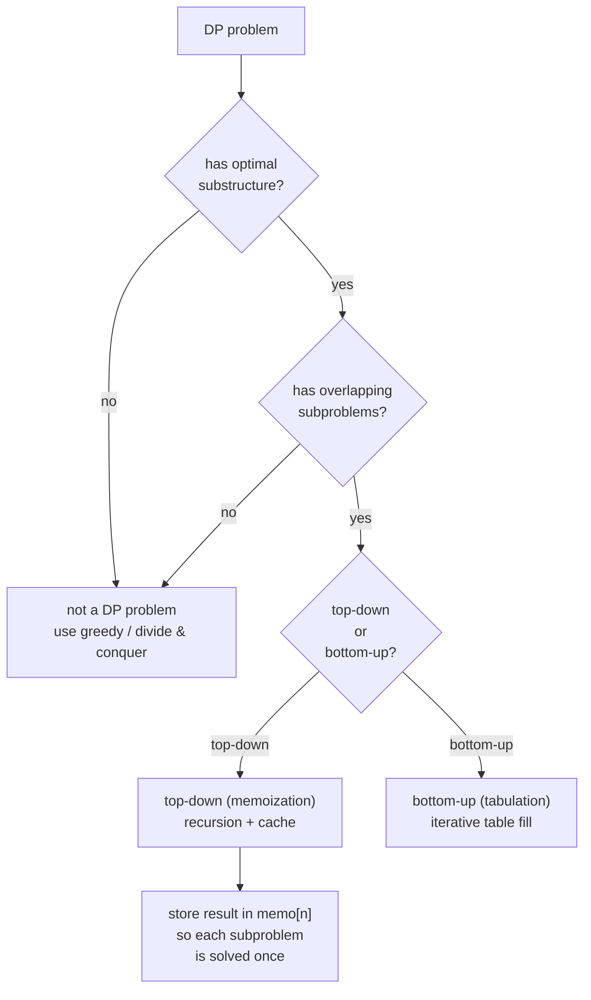

# Dynamic Programming in Python (DETAILED)

> Author: **Tamilselvan** · ✉️ tamilselvan.sde@gmail.com
> Section: 07 — Algorithms
> 🔗 Related: [recursion.md](./recursion.md) · [sorting.md](./sorting.md) · [greedy.md](./greedy.md)
> Data: [big_o.md](../08_Time_Complexity/big_o.md) · [matrix.md](../02_Data_Types/matrix.md)
> Back to [README](../README.md)

---

## 1. What is it?

**Dynamic Programming (DP)** is an optimization technique that dramatically speeds up recursive algorithms when two properties hold:

1. **Overlapping subproblems** — the same subproblem is solved many times. (vs divide-and-conquer where subproblems are disjoint.)
2. **Optimal substructure** — an optimal solution to a problem can be built from optimal solutions to its subproblems.

In practice DP **caches subproblem answers** so each is computed exactly once.

| Style | Idea | Where the answers live |
|------|------|------------------------|
| **Top-down / Memoization** | recursive; cache results in a dict/`@lru_cache` | `cache[(params)]` |
| **Bottom-up / Tabulation** | iteratively fill a table from smallest subproblems up | `dp[i]`, `dp[i][j]` |

### Real-world analogy
You're writing a research report citing many sub-claims. Without caching, every time you cite the same fact you re-derive it. With a notebook of pre-derived facts, you just look them up — **memoization is your notebook**. Bottom-up is when you start with the smallest facts and build larger statements from them systematically.

### What problem it solves
Optimization (min/max), counting (number of ways), and feasibility (can happen / can't) on problems with overlapping recursion. When the answer space is polynomial in `n` but naïve recursion is exponential.

### Cross-link
→ [recursion.md](./recursion.md) — you must understand recursion before DP.
→ [greedy.md](./greedy.md) — sibling optimization technique; DP is safer but slower.
→ [big_o.md](../08_Time_Complexity/big_o.md) — complexity analysis of transitions.

---

## 2. Why do we use it?

- **Cuts exponential recursion to polynomial** — often transforms O(2ⁿ) into O(n²) or O(n·k).
- **Optimal & complete** — unlike greedy, DP explores every subproblem and is guaranteed to find the **global** optimum (when conditions hold).
- **Reusable across problems** — the state-transition lens makes new DP problems easy to decompose once you know the patterns.
- **Bridges to advanced algorithms** — string DP (LCS, edit distance), tree DP, digit DP, bitmask DP, segment tree DP.

---

## 3. When should I choose it?

| Signal in the problem statement | Choose DP? | Why |
|-----|----|----|
| "Min/max number of…" + small state | ✅ | Optimal substructure |
| "Number of ways to… with constraints" | ✅ | Combinatorial enumeration that recurses |
| "Can we form / partition / achieve X?" | ✅ | Feasibility DP (knapsack-style) |
| Recursion with repeated subproblems (LeetCode classic) | ✅ | DP = caching repeated recursion |
| n huge (≥ 10⁹) and answer has formula | ❌ | Use math / matrix exponentiation |
| Search needs configurations themselves (not just count) | → backtracking | DP only gives counts/answers |
| Greedy with exchange argument holds | → greedy | DP is overkill but works; greedy faster |
| "Maximum of all subarrays of size k" | ❌ → sliding window | Fixed window = O(n) |
| "Shortest path with non-negative weights" | ❌ → Dijkstra | Greedy on weighted graph |

**Smell-test**: brute force recursion → **TLE** + repeated identical recursive calls ⇒ DP. Cross-link → [recursion.md](./recursion.md).

---

## 4. Syntax

The four universal ingredients of every DP:

```python
# 1. STATE definition — what does dp[...] represent?
#    e.g.  dp[i]              = max loot robbing first i houses
#          dp[i][j]           = LCS of text1[:i] and text2[:j]
#          dp[i][j][k]        = … 3-state

# 2. TRANSITION — how do larger states depend on smaller ones?
#    e.g.  dp[i] = max(dp[i-1], dp[i-2] + nums[i])
#          dp[i][j] = dp[i-1][j-1] + 1  if text1[i-1]==text2[j-1]
#                   = max(dp[i-1][j], dp[i][j-1])  otherwise

# 3. BASE CASES — smallest states that don't recurse
#    e.g.  dp[0]=0, dp[1]=nums[0];   dp[i][0]=0 for all i;  dp[0][j]=0

# 4. ORDER of iteration — fill table so dependencies are ready
#    "smaller states before bigger ones"   (forward / reverse)
```

### Top-down memoized template
```python
from functools import lru_cache
@lru_cache(None)
def dp(i, j):                       # natural recursion + cache
    if base_case(i, j): return base_value(i, j)
    ans = combine(dp(i-1, j), dp(i, j-1), ...)
    return ans
```

### Bottom-up template
```python
dp = [[0]*(m+1) for _ in range(n+1)]
for i in range(1, n+1):
    for j in range(1, m+1):
        if text1[i-1] == text2[j-1]:
            dp[i][j] = dp[i-1][j-1] + 1
        else:
            dp[i][j] = max(dp[i-1][j], dp[i][j-1])
return dp[n][m]
```

### Rolling-array space optimization
```python
prev = [0]*(m+1)
for i in range(1, n+1):
    cur = [0]*(m+1)
    for j in range(1, m+1):
        cur[j] = prev[j-1] + 1 if text1[i-1]==text2[j-1] else max(prev[j], cur[j-1])
    prev = cur
return prev[m]
```

---

## 5. Basic Example

**LC 198 — House Robber** — choose max sum subset of `nums` with no two adjacent.

```python
def rob(nums):
    if not nums: return 0
    prev, cur = 0, nums[0]      # dp[i-2], dp[i-1] rolling
    for x in nums[1:]:
        prev, cur = cur, max(cur, prev + x)
    return cur

print(rob([2,7,9,3,1]))          # 12
```

**Output:** `12` (rob 2 + 9 + 1).

### Step-by-step with Venn of choices

```
nums:   2   7   9   3   1

dp[i] = max(dp[i-1],                    # skip current house
            dp[i-2] + nums[i])           # rob current house

i=1: prev=0, cur=2
i=2: x=7 → cur = max(2, 0+7)=7, prev=2
i=3: x=9 → cur = max(7, 2+9)=11, prev=7
i=4: x=3 → cur = max(11, 7+3)=11, prev=11
i=5: x=1 → cur = max(11, 11+1)=12, prev=11

Final: 12
```

---

## 6. Step-by-Step Dry Run

### LCS of `"abcde"` vs `"ace"` (LC 1143)

`dp[i][j]` = LCS of `s[:i]` and `t[:j]`.

```
       ""  a   c   e           ← t[j]
  ""    0  0   0   0
  a     0  1   1   1
  b     0  1   1   1
  c     0  1   2   2
  d     0  1   2   2
  e     0  1   2   3   ← answer

Transitions:
   s[i-1]==t[j-1] ⇒ dp[i][j] = dp[i-1][j-1] + 1   (extend match)
   else             dp[i][j] = max(dp[i-1][j], dp[i][j-1])
```

Fill order (row-by-row, left-to-right):

```
dp[0][*]=dp[*][0]=0   (empty string vs anything → LCS = 0)

i=1, s=a:
  j=1 s[0]=a==t[0]=a → dp[1][1]=dp[0][0]+1=1
  j=2 s[0]=a vs t[1]=c → max(dp[0][2], dp[1][1]) = max(0,1)=1
  j=3 s[0]=a vs t[2]=e → max(dp[0][3], dp[1][2]) = max(0,1)=1

i=2, s=b:
  j=1 b≠a → max(dp[1][1]=1, dp[2][0]=0) = 1
  j=2 b≠c → max(dp[1][2]=1, dp[2][1]=1) = 1
  j=3 b≠e → max(dp[1][3]=1, dp[2][2]=1) = 1

i=3, s=c:
  j=1 c≠a → 1
  j=2 c==c → dp[2][1] + 1 = 2   ← match found
  j=3 c≠e → max(dp[2][3]=1, dp[3][2]=2) = 2

i=4, s=d:  all top-left → max up/left = 2
i=5, s=e:
  j=1 e≠a → 1
  j=2 e≠c → 2
  j=3 e==e → dp[4][2]+1 = 2+1 = 3   ← LCS length = 3 (= "ace")
```

---

## 7. Built-in Methods / Idioms

| Idiom | Purpose | Syntax | Complexity | Interview use | Mistakes |
|------|---------|--------|-----------|---------------|---------|
| `@lru_cache(None)` | Memoize top-down recursion | decorator on `dp()` | per-state O(state) | All LC DP problems | Passing mutable args; not clearing cache between tests |
| `cache=dict()` | Manual memoization when args not hashable simple | `if k in cache: return cache[k]` | O(1) lookup | override or fine control | Forgetting to return cached after recursion |
| `dp = [0]*(n+1)` | 1D bottom-up | list init | O(n) | fib, house robber | Off-by-one: typically `dp[0]=base case for index 0` |
| `dp = [[0]*W for _ in range(N)]` | 2D bottom-up | list comp | O(N·W) | knapsack, LCS | `[[0]*W]*N` — aliasing bug! All rows share list |
| `prev, cur = 0, 0` | Rolling space (1D) | two scalars | O(1) | LC 198, 70, 213 | Wrong update order (`prev, cur = cur, max(...)` not `cur, prev`) |
| `prev, cur = cur, 0-length arrays` | Rolling 2D | reassign rows | O(min(n,m)) space | LCS, edit distance | Forgetting to copy before reassigning |
| `bisect_left` over `dp` "tails array"— LIS O(n log n) | LIS optimization | replace next bigger tail with x | O(n log n) | LC 300 | Storing `dp` itself wrong (you keep tails array, not full dp) |
| `Counter` / dict DP | DP on sparse state (e.g., `dp[(sum, idx)]`) | dict | O(states) | "subset sum <=k, many zeros" | Default values for non-existent keys |
| Set DP | "Number of subsets summing to k" with sparse reachable sums | rolling `set` | O(#reachable states) | Subset sum variant | Hitting exponential states when `set` of all sums |

**Most common bug**: `dp = [[0]*W]*N` (rows alias). Always use list-comprehension form `[[0]*W for _ in range(N)]`.

---

## 8. Interview Examples (full progression brute → memo → bottom-up)

### 8.1 LC 70 — Climbing Stairs (Fibonacci-style 1D)

**Brute recursion** O(2^n):
```python
def climb_brute(n):
    if n <= 2: return n
    return climb_brute(n-1) + climb_brute(n-2)
```

**Memoized** O(n):
```python
from functools import lru_cache
@lru_cache(None)
def climb(n):
    if n <= 2: return n
    return climb(n-1) + climb(n-2)
```

**Bottom-up** O(n) time, O(1) space:
```python
def climb(n):
    if n <= 2: return n
    a, b = 1, 2
    for _ in range(3, n+1):
        a, b = b, a + b
    return b
```

### 8.2 LC 322 — Coin Change (1D knapsack-feasibility)
```python
def coinChange(coins, amount):
    dp = [float('inf')] * (amount + 1)
    dp[0] = 0
    for a in range(1, amount + 1):
        for c in coins:
            if c <= a:
                dp[a] = min(dp[a], dp[a - c] + 1)
    return dp[amount] if dp[amount] != float('inf') else -1
```
**State**: `dp[a]` = min coins to make amount `a`. **Transition**: `dp[a] = min(dp[a-c] + 1)` for each coin c. **Base**: `dp[0] = 0`.

### 8.3 LC 300 — Longest Increasing Subsequence
**O(n²) DP**:
```python
def lengthOfLIS(nums):
    dp = [1]*len(nums)
    for i in range(len(nums)):
        for j in range(i):
            if nums[j] < nums[i]:
                dp[i] = max(dp[i], dp[j] + 1)
    return max(dp, default=0)
```
**O(n log n) patience tails**:
```python
import bisect
def lengthOfLIS(nums):
    tails = []
    for x in nums:
        i = bisect.bisect_left(tails, x)   # binary-insert x into tails
        if i == len(tails): tails.append(x)
        else:               tails[i] = x
    return len(tails)
```
Mention both: time-limit tests favor the second; interviews reward knowing the first.

### 8.4 LC 1143 — Longest Common Subsequence (2D string DP)
```python
def longestCommonSubsequence(s, t):
    n, m = len(s), len(t)
    dp = [[0]*(m+1) for _ in range(n+1)]
    for i in range(1, n+1):
        for j in range(1, m+1):
            if s[i-1] == t[j-1]:
                dp[i][j] = dp[i-1][j-1] + 1
            else:
                dp[i][j] = max(dp[i-1][j], dp[i][j-1])
    return dp[n][m]
```
Recover the subsequence by walking back from `dp[n][m]` to `dp[0][0]` choosing the direction of decreasing value whenever there's a choice.

### 8.5 LC 72 — Edit Distance
```python
def minDistance(word1, word2):
    n, m = len(word1), len(word2)
    dp = [[0]*(m+1) for _ in range(n+1)]
    for i in range(n+1): dp[i][0] = i            # delete all
    for j in range(m+1): dp[0][j] = j            # insert all
    for i in range(1, n+1):
        for j in range(1, m+1):
            if word1[i-1] == word2[j-1]:
                dp[i][j] = dp[i-1][j-1]
            else:
                dp[i][j] = 1 + min(
                    dp[i-1][j],    # delete
                    dp[i][j-1],    # insert
                    dp[i-1][j-1])  # replace
    return dp[n][m]
```

### 8.6 LC 62 — Unique Paths (2D count)
```python
def uniquePaths(m, n):
    dp = [[1]*n for _ in range(m)]   # first row & col = 1
    for i in range(1, m):
        for j in range(1, n):
            dp[i][j] = dp[i-1][j] + dp[i][j-1]
    return dp[m-1][n-1]
```
Space-optimized: keep a single row `dp = [1]*n`; each row update only needs previous row's value and left value: `dp[j] += dp[j-1]`.

### 8.7 LC 5 — Longest Palindromic Substring (interval DP / expand-around-center)
**Expand around center** (O(n²) time, O(1) space) — easier to write under pressure:
```python
def longestPalindrome(s):
    best = ""
    for i in range(len(s)):
        o = expandAround(s, i, i)            # odd
        e = expandAround(s, i, i+1)         # even
        best = max((best, o, e), key=len)
    return best

def expandAround(s, l, r):
    while l >= 0 and r < len(s) and s[l] == s[r]:
        l -= 1; r += 1
    return s[l+1:r]
```
**Interval DP alternative** — `dp[i][j] = True if s[i]==s[j] and (j-i<2 or dp[i+1][j-1])`. Length-3 palindrome check.

### 8.8 LC 416 — Partition Equal Subset Sum (0/1 knapsack feasibility)
```python
def canPartition(nums):
    total = sum(nums)
    if total & 1: return False
    target = total // 2
    dp = [True] + [False]*target
    for x in nums:                       # 0/1: iterate x OUTSIDE
        for a in range(target, x-1, -1):  # REVERSE so each x used once
            dp[a] |= dp[a-x]
    return dp[target]
```
Insight: this is 0/1 knapsack — iterate items outside, capacities inside **in reverse**. For unbounded (coin change) iterate capacities outside, coins inside forward (`for a in range(1, amount+1): for c in coins`).

### 8.9 LC 213 — House Robber II (circular array)
Two DPs: rob houses 0..n-2 OR houses 1..n-1. Take the max. Avoids the circular adjacency trap.
```python
def rob(nums):
    if len(nums) == 1: return nums[0]
    def helper(sub):
        prev, cur = 0, 0
        for x in sub:
            prev, cur = cur, max(cur, prev + x)
        return cur
    return max(helper(nums[:-1]), helper(nums[1:]))
```

### 8.10 LC 312 — Burst Balloons (interval DP, Hard)
```python
def maxCoins(nums):
    nums = [1] + nums + [1]
    n = len(nums)
    dp = [[0]*n for _ in range(n)]
    for length in range(2, n):            # length of interval
        for left in range(n - length):
            right = left + length
            for k in range(left+1, right): # k = last burst in (left, right)
                dp[left][right] = max(
                    dp[left][right],
                    nums[left]*nums[k]*nums[right]
                      + dp[left][k] + dp[k][right])
    return dp[0][n-1]
```
**Insight for interval DP**: phase by **interval length** (small intervals computed before larger ones). Each interval depends on strictly smaller sub-intervals.

---

## 9. When NOT to use

| Situation | Why not | Alternative |
|-----------|--------|-------------|
| n huge (10⁹+) | State space explodes | Math / matrix exponentiation |
| Need to **output all** configurations, not just counts | DP gives counts, not listings | Backtracking |
| A greedy exchange argument exists | DP is wasteful | Greedy (see [greedy.md](./greedy.md)) |
| Subproblems **don't overlap** | No memoization benefit | Divide & Conquer |
| State is high-dimensional (e.g. **time × position × velocity × direction**) | DP table infeasible | Heuristics / beam search / MDP solvers |
| Constraint is dynamic between elements | State becomes continuous | Graph algos / LP relaxation |
| Sliding-window-friendly (fixed-size) | DP overkill | [sliding_window.md](./sliding_window.md) |

---

## 10. Common Mistakes

1. **2D list aliasing** — `dp = [[0]*W]*H` makes all rows the same list. Always `[[0]*W for _ in range(H)]`.
2. **Iteration order wrong** for 0/1 knapsack (`dp[a] |= dp[a-x]` iterated forward silently allows reuse of the same item). For 0/1 knapsack, iterate capacities **descending**.
3. **Base case missing** → `dp[i-1]` at i=0 returns garbage: always initialize `dp[0]` and other zero-indices explicitly.
4. **Off-by-one in string DP** — `dp[i][j]` corresponds to `s[:i]` and `t[:j]`; index shift makes you compare `s[i-1]` vs `t[j-1]`, not `s[i]` vs `t[j]`.
5. **Forgetting `return dp[n][m]` vs `dp[n-1][m-1]`** — depends on whether you allocated `n+1` rows (and use `dp[n][m]`) or `n` rows (use `dp[n-1][m-1]`). Pick a convention and stay consistent.
6. **Top-down cache poisoning between test calls** — `@lru_cache` accumulates across runs in a process. Use `cache_clear()` or make `dp` a nested function local to your solution.
7. **Mutable/decorated `lru_cache` failure on unhashable args** — passing a list as state raises `TypeError`. Convert to tuple and pass indices.
8. **Space optimization done incorrectly** — when collapsing `dp[i]` into two scalars, drawing on `dp[i-2]` requires you to capture the **previous** `dp[i-1]` before reassigning. Always do Python's `prev, cur = cur, ...`-style tuple assignment to avoid temp-variable bugs.
9. **Wrong direction in interval DP** — must iterate by **length**; iterating by `i,j` nested gives dependencies not yet filled.
10. **For state `[i][j][k]`**, choosing iteration order blindly — topological-dp ordering matters; you may need to **sketch the dependency graph** first.

---

## 11. Memory Tricks

- 🌲 **DP = recursion + memory** — top-down memoization is no different from a recursive function with a notebook.
- 📓 **State = signature of subproblem** — `dp[i]` = answer for first `i` items; `dp[i][j]` = answer over the rectangle `text1[:i] × text2[:j]`.
- 🔁 **Transition = how bigger state depends on smaller** — write it down before coding.
- ⚓ **Base = the smallest self-evident case** — `dp[0]=0` for empty instance.
- 🧮 **0/1 knapsack reverse; unbounded forward** — the single direction tip that catches most knapsack bugs.
- 🪡 **Rolling arrays compress O(n)→O(1) / O(n²)→O(n)** when transition uses only `i-1` row.
- 🎯 **Interval DP iterates by length** — never by raw `i` or `j`.
- 🚀 **LIS tails**: `bisect_left` over a sorted "tails array" gives O(n log n).

---

## 12. Interview Shortcuts

- **Pattern-spot in < 30 seconds** from these cues:
  - "max sum skipping K elements / pick non-adjacent / min cost" → **1D DP**
  - "subsequence/substring matching or transformation" → **2D string DP**
  - "capacity X with items" → **knapsack variant**
  - "number of ways to traverse grid" → **2D count DP**
  - "length-k whatever" with sorted elements + LIS → **LIS tails or patience**
  - "sums over set / subset sum variant" → **subset DP, bitset compression**
- **Default to bottom-up** `dp = [0]*n` for 1D; `dp = [[0]*m for _ in range(n)]` for 2D.
- **Quick sanity check** with the smallest `n`, `m` (often `n=1` base values) for off-by-ones.
- **Mention the trade** when introducing top-down: "Top-down is easier to write; bottom-up avoids recursion overhead and clears cache between tests."
- **Recovering path**: walk back from `dp[N]` to `dp[0]`, choosing direction of decreasing value — useful when problem asks "return the actual sequence".
- **State-space optimization as bonus**: after presenting O(n²) space solution, write `prev, cur` version — instant +point.
- **Test small** with `n=2 // m=2` cases before submitting — catches index and direction errors.

### Pattern recognition table

| Pattern | Cues | Canonical problems |
|---------|------|-------------------|
| 1D linear DP | "skip / take" — min/max over prefix | LC 70 Climbing Stairs, 198 House Robber, 746 Min Cost Climbing Stairs, 213 House Robber II |
| 1D with constraint on last k | "no k adjacent / cooldown" | LC 309 Best Time with Cooldown, 376 Wiggle |
| 2D string DP | "edit / match / common subseq / palindrome" | LC 1143 LCS, 72 Edit Distance, 516 Longest Palindromic Subseq, 10 Regex Match |
| Knapsack (0/1) | "take or skip each item once, capacity bounded" | LC 416 Partition Equal Subset Sum, 494 Target Sum |
| Knapsack (unbounded) | "reuse allowed, min coins" | LC 322 Coin Change, 518 Coin Change II |
| Path counting | "grid, # ways, min cost" | LC 62 Unique Paths, 64 Min Path Sum, 980 Unique Paths III |
| Interval DP | "consume left/right boundaries" | LC 312 Burst Balloons, 1000 Min Cost to Merge Stones, 5 Longest Pal Substring |
| Tree DP | "max sum from root / diameter / robber on tree" | LC 337 House Robber III, 124 Binary Tree Max Path Sum, 543 Diameter |
| Bitmask DP | "all subsets / TSP" | LC 943 Find Shortest Superstring, 1655 Distribute Repeating Integers |
| LIS & subseq | "longest/miss subsequence" | LC 300 LIS, 673 Number of Longest, 354 Russian Doll Envelopes |

---

## 13. Cheat Sheet Table

| Problem | State | Transition | Base | Optimized space |
|---------|-------|------------|------|------|
| 70 Climb Stairs | dp[i] | dp[i]=dp[i-1]+dp[i-2] | dp[0]=1, dp[1]=1 | O(1) |
| 198 House Robber | dp[i]=max loot first i | dp[i]=max(dp[i-1], dp[i-2]+nums[i-1]) | dp[0]=0,dp[1]=nums[0] | O(1) |
| 213 House Robber II | run #198 on nums[:-1] & nums[1:] | same | same | O(1) |
| 746 Min Cost Climb | dp[i]=min cost to reach i | dp[i]=min(dp[i-1],dp[i-2])+cost[i] | dp[0]=dp[1]=0 | O(1) |
| 322 Coin Change | dp[a]=min coins | dp[a]=min(dp[a-c]+1) for c | dp[0]=0 | O(amount) |
| 518 Coin Change II | dp[a]=# ways | dp[a]+=dp[a-c] | dp[0]=1 | reverse iteration ⇒ O(amount) |
| 300 LIS | dp[i]=LIS ending at i | dp[i]=max(dp[j]+1) for j<i,nums[j]<nums[i] | dp[i]=1 | tail array ⇒ O(n log n) |
| 1143 LCS | dp[i][j]=LCS so far | match ⇒+1 else max(top,left) | dp[0][*]=dp[*][0]=0 | prev/cur ⇒ O(min(n,m)) |
| 72 Edit Distance | dp[i][j]=edit cost | insert/delete/replace min | edges = i or j | prev/cur ⇒ O(min) |
| 62 Unique Paths | dp[i][j]=# ways | dp[i-1][j]+dp[i][j-1] | first row/col=1 | single row ⇒ O(n) |
| 64 Min Path Sum | dp[i][j] | min(top,left)+grid[i][j] | grid[0][0] | O(n) |
| 416 Partition Equal Subset Sum | bitset DP (reverse cap) | dp[a] |= dp[a-x] | dp[0]=True | O(target) |
| 5 Longest Pal Substring | (i,j) palindrome | s[i]==s[j] and inner becomes Pal | … | expand-around ⊝ O(1) |
| 647 Palindromic Substrings | count | same logic accumulate | diag = True | O(n²) |
| 32 Longest Valid Parentheses | dp[i] length ending at i | ") matching" rules | dp[0]=0 | O(n) |
| 312 Burst Balloons | dp[left][right] interval | burst k last | length-based iteration | — |

---

## 14. Time Complexity Table

| Pattern | States | Work per state | Time | Space (DP) | Space optimized |
|---------|--------|----------------|------|-----------|----------------|
| 1D | n | O(1) | O(n) | O(n) | O(1) |
| 1D O(n²) inner (LIS) | n | O(n) | O(n²) | O(n) | O(n) |
| LIS + tails | – | bisect O(log n) | O(n log n) | O(n) | O(n) |
| 2D string | n·m | O(1) | O(nm) | O(nm) | O(min(n,m)) |
| Knapsack 0/1 | n·cap | O(1) | O(n·cap) | O(cap) | – |
| Knapsack unbounded | cap·k | O(1) | O(cap·k) | O(cap) | – |
| Subset sum (bitset) | — | O(cap/64) | O(n·cap/64) | O(cap/64) | – |
| Path on grid | R·C | O(1) | O(RC) | O(C) | – |
| Interval DP | n² intervals | n splits | O(n³) | O(n²) | – |
| Tree DP | nodes | O(children) | O(n) | recursion O(h) | – |
| Bitmask DP | 2ⁿ·n | depends | O(2ⁿ·n²) | O(2ⁿ) | – |

---

## 15. Visual Diagram (ASCII + Mermaid)



**Overlapping subproblems tree for `climbStairs(5)`**:

```
                climb(5)
              /          \
         climb(4)         climb(3)             ← overlap!
        /    \           /  \
   climb(3) climb(2)  climb(2) climb(1)       ← climb(3), climb(2) recomputed
  /  \      ...
climb(2) climb(1)
  ↑↑↑↑↑
Repeated 5+ times WITHOUT memoization → O(2ⁿ).
WITH memoization / table → each climb(k) computed once → O(n).
```

**LCS table fill pattern (`s="abcde"` vs `t="ace"`)** — arrows show dependencies:

```
       ""   a   c   e
   ""    0   0   0   0
   a     0 → 1 → 1 → 1
             ↓   ↓   ↓
   b     0 → 1 → 1 → 1
                 ↘
   c     0 → 1 → 2 → 2
   d     0 → 1 → 2 → 2
   e     0 → 1 → 2 → 3
Dependencies: dp[i][j] depends on dp[i-1][j-1] (diag ↓↘), dp[i-1][j] (↑), dp[i][j-1] (←).
```

**Knapsack 0/1 vs Unbounded iteration order**:

```
0/1 (each item ONE use):           Unbounded (reuse allowed):
for x in items:                    for capacity a in 1..Cap:
    for a in Cap..x:                    for x in items:
        dp[a] |= dp[a-x]                   dp[a] += dp[a-x]

    Cap DESCENDING ⇒ a-x unfilled in this pass  ⇒ each item used once
    Cap ASCENDING would let dp[a] use dp[a-x] updated this pass ⇒ reuse bug
```

**House Robber rolling DP** (state diagram):

```
   dp[i] ──► decide skip ──► dp[i-1]
   dp[i] ──► decide rob  ──► dp[i-2] + nums[i]
   dp[i] = max(   skip        ,    rob    )

   keep OLD `cur` (dp[i-1]) before updating into `prev`:
   prev, cur = cur, max(cur, prev + x)
```

**Interval DP (LC 312 Burst Balloons)** — phase by interval length:

```
length 2:   dp[i][i+2]   for each i (one interior balloon)
length 3:   dp[i][i+3]   for each i  ← uses length-2 results
length 4:   dp[i][i+4]                ← uses length-2 and length-3
...
length n-1: dp[0][n-1]               ← final answer

Filling by length guarantees all sub-intervals computed first.
```

**Flowchart — writing a DP solution from scratch**:

```
1. Read problem → identify min/max/count/feasibility goal
2. Brute recursion sketch → observe repeated calls ⇒ CONFIRM DP
3. Define STATE:  dp[?] = "answer for …"
4. Write TRANSITION recurrence in terms of dp (smaller states)
5. Enumerate BASE CASES
6. Choose iteration ORDER (sequential / nested / by length / etc.)
7. Allocate dp table (`n+1` rows/cols; use list-comprehension)
8. Fill table per transition; read final answer
9. Optional: space-optimize (rolling/scalar variables)
10. Verify on tiny input; trace if off-by-one
```

---

## 16. Beginner Notes

> **Remember:**
> - DP = recursion with a **memory**: cache sub-results so you don't recompute.
> - Two pillars: **overlapping subproblems** + **optimal substructure**. If only one, DP doesn't fit.
> - Top-down (`@lru_cache`) is easiest to write; bottom-up is faster and avoids recursion limit.
> - Define **state**, **transition**, **base cases**, then **iteration order** — in that order.
> - 0/1 knapsack iterates capacities **descending**; unbounded **ascending**. Mixing silently triples runtime with wrong counts.
> - 2D list NEVER use `[[0]*W]*H` — that aliases rows. Always `[[0]*W for _ in range(H)]`.
> - If you're stuck writing the transition, **sketch the brute recursion** first; the recurrence often falls out naturally.
> - Cross-link → [recursion.md](./recursion.md) (brute vs memo), [greedy.md](./greedy.md) (when greedy beats DP), [big_o.md](../08_Time_Complexity/big_o.md).

---

## 17. FAANG Tips

- **Pattern recognition is 80% of DP mastery**: when you see "edit distance"-type text problem → reach for LCS / Edit Distance template; "buy/sell with cooldown" → 1D state with hold boolean; "min coins" → bottom-up unbounded knapsack.
- **Whiteboard the recurrence first** — write `dp[i][j] = …` on the board, fill tiny table by hand (e.g. n=m=2). Catches 90% of off-by-ones before coding.
- **Optimize space after solution works**: present O(n²) space version first, then "we can compress to O(n) by keeping two rows since each row only depends on the previous." Interviewers love it.
- **LIS**: have **both** O(n²) DP and O(n log n) patience-tails in your toolkit; mention both, ask which time bound is expected.
- **Top-down with `@lru_cache` in LC**: fast to write but **clear cache between tests** by making `dp` a nested local function inside your `Solution` method — each call recreates a fresh cache.
- **For tree DP**: pass child results up; classic problems — LC 337 (Rob III), 124 (Max Path Sum), 543 (Diameter).
- **Reconstructing answer**: when the problem requires returning the actual sequence, **walk back** through the DP table from the final state to the base, choosing cells that decrease in value.
- **Hard DP problems often combine ideas**: LC 312 (Burst Balloons) = interval DP × divide-and-conquer; LC 416 = 0/1 knapsack × boolean array. Parse for the underlying pattern.
- **Justify optimal substructure** when asked: "Since the answer for n items depends only on answers over smaller subsets (n-1 items) — there exists a parent-child dependency — DP applies." That's the verbal signal.
- **Interview curveball watch**: if `n ≤ 20`, DP may not be needed — think **bitmask BFS** (e.g. traveling-salesman) instead; if `n ≤ 1000` × small `m`, DP table is fine; if `n ≥ 10⁶`, DP table breaks → look for math / greedy.
- **Mention both roads**: "I can do this greedily in O(n) if the structure allows — but I'll also show the DP for safety." Showing you know **when greedy is enough** is itself a signal.

---

## 18. Practice Problems

### Easy
| # | Title | LeetCode |
|---|-------|----------|
| 70 | Climbing Stairs | [link](https://leetcode.com/problems/climbing-stairs/) |
| 746 | Min Cost Climbing Stairs | [link](https://leetcode.com/problems/min-cost-climbing-stairs/) |
| 509 | Fibonacci Number | [link](https://leetcode.com/problems/fibonacci-number/) |
| 1137 | N-th Tribonacci Number | [link](https://leetcode.com/problems/n-th-tribonacci-number/) |
| 121 | Best Time to Buy and Sell Stock (greedy/DP hybrid) | [link](https://leetcode.com/problems/best-time-to-buy-and-sell-stock/) |

### Medium
| # | Title | LeetCode |
|---|-------|----------|
| 198 | House Robber | [link](https://leetcode.com/problems/house-robber/) |
| 213 | House Robber II | [link](https://leetcode.com/problems/house-robber-ii/) |
| 337 | House Robber III (tree DP) | [link](https://leetcode.com/problems/house-robber-iii/) |
| 322 | Coin Change | [link](https://leetcode.com/problems/coin-change/) |
| 518 | Coin Change II | [link](https://leetcode.com/problems/coin-change-ii/) |
| 300 | Longest Increasing Subsequence | [link](https://leetcode.com/problems/longest-increasing-subsequence/) |
| 1143 | Longest Common Subsequence | [link](https://leetcode.com/problems/longest-common-subsequence/) |
| 72 | Edit Distance | [link](https://leetcode.com/problems/edit-distance/) |
| 62 | Unique Paths | [link](https://leetcode.com/problems/unique-paths/) |
| 64 | Minimum Path Sum | [link](https://leetcode.com/problems/minimum-path-sum/) |
| 5 | Longest Palindromic Substring | [link](https://leetcode.com/problems/longest-palindromic-substring/) |
| 647 | Palindromic Substrings | [link](https://leetcode.com/problems/palindromic-substrings/) |
| 416 | Partition Equal Subset Sum | [link](https://leetcode.com/problems/partition-equal-subset-sum/) |
| 494 | Target Sum | [link](https://leetcode.com/problems/target-sum/) |

### Hard
| # | Title | LeetCode |
|---|-------|----------|
| 312 | Burst Balloons | [link](https://leetcode.com/problems/burst-balloons/) |
| 32 | Longest Valid Parentheses | [link](https://leetcode.com/problems/longest-valid-parentheses/) |
| 10 | Regular Expression Matching | [link](https://leetcode.com/problems/regular-expression-matching/) |
| 943 | Find the Shortest Superstring | [link](https://leetcode.com/problems/find-the-shortest-superstring/) |
| 1000 | Minimum Cost to Merge Stones | [link](https://leetcode.com/problems/minimum-cost-to-merge-stones/) |
| 174 | Dungeon Game | [link](https://leetcode.com/problems/dungeon-game/) |

---

**Cross-links:** [recursion.md](./recursion.md) · [greedy.md](./greedy.md) · [sorting.md](./sorting.md) · [big_o.md](../08_Time_Complexity/big_o.md) · [matrix.md](../02_Data_Types/matrix.md) · Back to [README](../README.md)