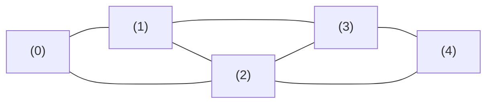

# Graph in Python

> Author: **Tamilselvan** · ✉️ tamilselvan.sde@gmail.com · 🔗 [LinkedIn](https://www.linkedin.com/in/tamilselvan-ai/)
> Section: 07 — Algorithms
> 🔗 Related: [queue.md](./queue.md) · [stack.md](./stack.md) · [hash_map.md](./hash_map.md) · [trees.md](./trees.md) · [linked_list.md](./linked_list.md)
> Algorithms: [bfs.md](./bfs.md) · [dfs.md](./dfs.md) · [heap.md](./heap.md) · [trie.md](./trie.md)
> Data: [deque.md](../06_Collections/deque.md) · [heapq.md](../06_Collections/heapq.md) · [counter.md](../06_Collections/counter.md)
> Back to [README](../README.md)

---

## 1. What is it?

A **graph** is a set of **vertices** (nodes) connected by **edges**. Unlike a tree, nodes can have **multiple parents**, **cycles**, and need not be connected. Formally `G = (V, E)` where `V` is the vertex set and `E ⊆ V × V` is the edge set.

Properties:
- **Directed / Undirected**: edges have direction or not.
- **Weighted / Unweighted**: edges carry values (costs) or not.
- **Connected**: an undirected graph where every vertex is reachable from every other.
- **Cyclic / Acyclic**: contains a cycle or not. A **DAG** is a directed acyclic graph.
- **Sparse / Dense**: |E| ≈ |V| vs |E| ≈ |V|² .

Representations in Python:
1. **Adjacency list** (most common):
   ```python
   from collections import defaultdict
   g = defaultdict(list)
   g[0].append(1)
   ```
2. **Adjacency matrix** (when dense, weighted small graphs):
   ```python
   n = 5
   M = [[0]*n for _ in range(n)]
   M[0][1] = 1
   ```
3. **Edge list**:
   ```python
   edges = [(0,1), (1,2), (2,0)]
   ```

**What problem it solves:** Modeling any pair-wise relationship: friendships, flights, dependencies (build systems, course prerequisites), mazes, networks, scheduling, concurrency priority graphs.

**Real-world analogy:** A road map — cities are vertices, roads are edges. A friend graph in social networks. A build system: files are nodes, dependencies are directed edges ("compile A before B").

---

## 2. Why do we use it?

- Trees restrict too much (single parent, no cycles). Graphs model the **general case** of relationships.
- **Adjacency lists** store `O(V + E)` — efficient for sparse graphs (most real-world graphs).
- **BFS** gives shortest path on unweighted graphs in **O(V + E)**.
- **DFS** powers cycle detection, topological sort, connected components, bipartite checks.
- Algorithms branch out: Dijkstra, Bellman-Ford, A*, Tarjan SCC, Kruskal/Prim MST, network flows.
- Foundation for many interview problem families ("number of islands", "course schedule", "clone graph").

---

## 3. When should I choose it? — Decision Table

| Situation                                          | Best choice                                  | Notes                                  |
|----------------------------------------------------|----------------------------------------------|----------------------------------------|
| Sparse graph, frequent neighbor queries               | **adjacency list** `defaultdict(list)`        | most LC graphs                          |
| Dense weighted graph + frequent edge lookups           | adjacency matrix                              | memory O(V²) — small V only               |
| Need shortest path on unweighted graph                 | BFS                                            | queue-based, see [bfs.md](./bfs.md)     |
| Shortest path with non-negative weights                | Dijkstra (heap) — see [heap.md](./heap.md)     | O((V+E) log V)                          |
| Shortest path with negative weights (no neg cycles)     | Bellman-Ford                                   | O(V·E), detects negative cycles         |
| "Is there a cycle?"                                   | DFS visited/color                              | directed needs 3-color                  |
| Topological ordering (DAG)                             | Kahn (queue) or DFS postorder                  | (210)                                 |
| Strongly connected components                          | Tarjan / Kosaraju                              | -                                       |
| Minimum spanning tree (undirected weighted)            | Kruskal (sort edges + Union-Find) or Prim     | -                                       |
| Reachability query                                     | BFS/DFS + visited set                          | (1971)                                  |
| Multiple disconnected components                       | iterate nodes; BFS each unvisited island       | (200, 323)                              |

---

## 4. Syntax

```python
from collections import defaultdict, deque

# Build adjacency list (undirected)
g = defaultdict(list)
for u, v in edges:
    g[u].append(v); g[v].append(u)

# Directed version
g[u].append(v)

# Weighted graph (edge carries cost)
g[u].append((v, w))

# Adjacency matrix (dense)
n = 5
M = [[0]*n for _ in range(n)]
for u, v in edges:
    M[u][v] = 1            # unweighted
    M[u][v] = w            # weighted

# Edge list (only useful for sparse weighted / Kruskal)
edges = [(0,1,4), (1,2,8), (2,3,6), (3,4,5)]
edges.sort(key=lambda e: e[2])    # Kruskal sort
```

```python
# BFS template
def bfs(start):
    seen = {start}
    q = deque([start])
    while q:
        u = q.popleft()
        for v in g[u]:
            if v not in seen:
                seen.add(v); q.append(v)

# DFS template (recursive)
def dfs(u, seen=None):
    if seen is None: seen = set()
    if u in seen: return
    seen.add(u)
    for v in g[u]:
        dfs(v, seen)

# DFS template (iterative with explicit stack)
def dfs_iter(start):
    seen = {start}
    st = [start]
    while st:
        u = st.pop()
        for v in g[u]:
            if v not in seen:
                seen.add(v); st.append(v)
```

---

## 5. Basic Example

### LC 200 — Number of Islands (BFS/DFS)

Grid is a **grid graph**: each cell has up to 4 neighbors. Iterate; flood-fill on each unvisited `"1"`.

```python
def numIslands(grid):
    if not grid: return 0
    R, C = len(grid), len(grid[0])
    count = 0

    def flood(r, c):
        if r < 0 or r >= R or c < 0 or c >= C or grid[r][c] != "1":
            return
        grid[r][c] = "#"
        flood(r+1, c); flood(r-1, c); flood(r, c+1); flood(r, c-1)

    for r in range(R):
        for c in range(C):
            if grid[r][c] == "1":
                flood(r, c); count += 1
    return count

grid = [
 ["1","1","0","0","0"],
 ["1","1","0","0","0"],
 ["0","0","1","0","0"],
 ["0","0","0","1","1"],
]
print(numIslands(grid))   # 3
```

### LC 207 — Course Schedule (cycle detection in directed graph)

```python
def canFinish(numCourses, prereqs):
    g = defaultdict(list)
    indeg = [0]*numCourses
    for u, v in prereqs:
        g[v].append(u); indeg[u] += 1
    q = deque([i for i in range(numCourses) if indeg[i]==0])
    done = 0
    while q:
        u = q.popleft(); done += 1
        for v in g[u]:
            indeg[v] -= 1
            if indeg[v] == 0: q.append(v)
    return done == numCourses

print(canFinish(2, [[1,0]]))         # True  (1 must be taken after 0)
print(canFinish(2, [[1,0],[0,1]]))   # False (cycle)
```

---

## 6. Step-by-Step Dry Run

### BFS over adjacency list `g = {0:[1,2], 1:[3], 2:[3], 3:[]}`, src=0

```
init: seen={0}, q=[0]
pop 0 → enqueue 1, 2   seen={0,1,2}    q=[1,2]
pop 1 → enqueue 3      seen={0,1,2,3}  q=[2,3]
pop 2 → already in seen, skip
pop 3 → no neighbors
done.
BFS order: 0, 1, 2, 3
(cost-to-reach: 0->1=1, 0->2=1, 0->3=2)
```

### DFS recursive over the same graph

```
dfs(0): pop 0 -> dfs(1) -> dfs(3) return -> return -> dfs(2) -> 3 already seen # done

DFS order: 0, 1, 3, 2  (left branch goes deep before right)
```

### Topological sort (Kahn's algorithm) on `n=4, prereqs = [[1,0],[2,0],[3,1],[3,2]]`

```
build indeg: {0:0, 1:1, 2:1, 3:2}, graph[v].append(u)
init queue = [0] (indeg=0)
iter 1: pop 0; enqueue 1 (indeg dropped to 0 in the i...) let's redo step-by-step:
  step1: 0 indeg=0, in q
  step2: pop 0 → process; decrement indeg[1] (to 0, push), decrement indeg[2] (to 0, push); q=[1,2]
  step3: pop 1 → decrement indeg[3] (to 1, not 0)
  step4: pop 2 → decrement indeg[3] (to 0, push); q=[3]
  step5: pop 3 → process; done
  topo order = [0, 1, 2, 3]
```

### Cycle detection with 3-color DFS (LC 207) on `prereqs = [[1,0],[0,1]]`

```
color: white(0) / gray(1) / black(2)
init: all white
dfs(0):
  color[0] = gray (gray = on recursion stack)
  visit neighbor 1:
    dfs(1):
      color[1] = gray
      visit neighbor 0 → which is GRAY → CYCLE detected, return False
```

---

## 7. Built-in Methods

Python has **no built-in graph class** — you build them with `defaultdict(list)`. Useful stdlib tools:

| Tool                  | Purpose                                              | Use                                  |
|-----------------------|------------------------------------------------------|--------------------------------------|
| `collections.defaultdict(list)` | adjacency list                                  | all graph work                       |
| `collections.deque`     | BFS queue                                             | O(1) popleft                         |
| `heapq`                 | Dijkstra's priority queue                            | see [heap.md](./heap.md)              |
| `set` / `frozenset`     | visited / per-DFS state                              | membership O(1)                      |
| `range(n)`              | iterate vertex ids                                    | -                                    |
| `len(g)` / `len(g[u])`  | size of graph / degree of vertex u                    | -                                    |

### Common adjacency-list idioms

| Pattern                          | Code sketch                                  | Use                                  |
|----------------------------------|----------------------------------------------|--------------------------------------|
| Build list (undirected)            | `g[u].append(v); g[v].append(u)`              | undirected graph convention          |
| DFS-iterative stack              | `st = [start]; while st: u=st.pop(); ...`     | explore depth-first, avoid recursion |
| BFS level loop                   | `for _ in range(len(q))` inside `while q`      | reachable-at-distance-k              |
| Cycle detection (3-color)         | `colors = [0]*n` + dfs coloring               | directed graphs                      |
| Topological sort (Kahn)           | `indeg=[0]*n` + queue of zero indeg           | course schedule (207, 210)           |
| Connected components (UF)         | `parent = list(range(n))` + find/union        | Kruskal, undirected components       |
| Union-Find (Disjoint Set Union)    | two-tier rank/size + path compression           | dynamic connectivity                 |

### UF / DSU template (Union-Find)

```python
class DSU:
    def __init__(self, n):
        self.p = list(range(n)); self.r = [0]*n
    def find(self, x):
        while self.p[x] != x:
            self.p[x] = self.p[self.p[x]]   # path compression
            x = self.p[x]
        return x
    def union(self, a, b):
        ra, rb = self.find(a), self.find(b)
        if ra == rb: return False
        if self.r[ra] < self.r[rb]: ra, rb = rb, ra
        self.p[rb] = ra
        if self.r[ra] == self.r[rb]: self.r[ra] += 1
        return True
```

`union`返回 `False` 当 a, b 已经同集合 — 用以检测**无向图**中的环。

---

## 8. Interview Example

### LC 210 — Course Schedule II (Medium)

Return topological order if possible; else `[]`.

```python
def findOrder(n, prereqs):
    g = defaultdict(list); indeg = [0]*n
    for u, v in prereqs: g[v].append(u); indeg[u] += 1
    q = deque([i for i in range(n) if indeg[i] == 0])
    order = []
    while q:
        u = q.popleft(); order.append(u)
        for v in g[u]:
            indeg[v] -= 1
            if indeg[v] == 0: q.append(v)
    return order if len(order) == n else []

print(findOrder(4, [[1,0],[2,0],[3,1],[3,2]]))  # [0, 1, 2, 3] or [0, 2, 1, 3]
```

### LC 133 — Clone Graph (Medium)

```python
def cloneGraph(node):
    if not node: return None
    clones = {}
    def dfs(n):
        if n in clones: return clones[n]
        clones[n] = Node(n.val)
        for nb in n.neighbors:
            clones[n].neighbors.append(dfs(nb))
        return clones[n]
    return dfs(node)
```

### Number of Connected Components (LC 323)

```python
def countComponents(n, edges):
    dsu = DSU(n)
    for u, v in edges: dsu.union(u, v)
    return len({dsu.find(i) for i in range(n)})
```

---

## 9. When NOT to use

- **Pure tree** problem (one parent, no cycles) — use a real `TreeNode` (see [trees.md](./trees.md)).
- **No relationships between entities** — a hash map / list is cheaper.
- **Pairwise "is X close to Y?"** when distance has analytic form — precompute (Manhattan, Haversine).
- **Huge graphs needing mass queries** — use DB-specific models (Neo4j, GraphFrames).
- **Dynamic graph with frequent weighted edge queries** — specialized data structure may beat simple adjacency lists.

---

## 10. Common Mistakes

1. **Confusing directed vs undirected**: building adjacency for an undirected graph but forgetting the reverse edge `g[v].append(u)`.
2. **Forgetting the `visited` set** — infinite recursion in DFS on cyclic graphs.
3. **`visited.add(v)` on entry vs recurrence**: simpler to add on enqueue (BFS) or pre-order visit (DFS); the right rule prevents revisits.
4. **Cycle detection on directed graphs needs `3-color`** (white/gray/black); gray tells "currently in recursion stack" → a back-edge to a gray node = cycle.
5. **Kahn stop condition wrong**: must check `len(order) == n`, not just "queue got empty" — queue empties when remaining nodes all have indeg > 0, which is exactly a cycle.
6. **Indexing grid boundaries**: in `numIslands`, forgetting `逆向 d检查边界` (`r<0 or r>=R`). Python negative indices wrap → silent bug.
7. **`defaultdict(list)` vs `defaultdict(set)`** when modeling graphs with parallel edges — list duplicates, set doesn't.
8. **Stack overflow on deep DFS** — Python recursion limit (~1000). Use iterative or `sys.setrecursionlimit`.
9. **Wrong `union`/`find` algorithm complexity** — naive `find` is O(n); always add **path compression** and **union by rank/size** to get amortized O(α(n)).
10. **Forgetting unweighted shortest path = BFS, weighted = Dijkstra** (don't confuse).

---

## 11. Memory Tricks

- **Graph = open generalization of trees** (no "one parent" rule, can have cycles).
- **BFS → shortest path** in unweighted (only); **DFS → cycle detection / topology / connectivity**.
- **Adjacency list = "phonebook of friends"**: each vertex stores a list of its friends.
- **Kahn's algorithm** = "remove zero-indegree items until you can't anymore"; remaining = cycle.
- **3-color DFS = white(unknown), gray(visiting), black(done)** — gray indicates "in current DFS path", so a back-edge to a gray node = cycle.
- **Union-Find = "am I related to?"**: union merges two families; find tells you which family owns you — use **path compression** so the tree stays flat.

---

## 12. Interview Shortcuts

- Build adjacency with `defaultdict(list)` — one-liner builder for any edge list.
- BFS template: `deque([start])` + `visited = {start}` + `while q: u=q.popleft(); for v in g[u]: ...`.
- DFS template (recursive): one helper that takes `u` and `visited`, marks on entry, recurses on neighbors.
- Cycle detection:
  - **Undirected**: union-find edge union returning `False` = cycle.
  - **Directed**: 3-color DFS (gray back-edge = cycle) **or** Kahn + `len(order) < n`.
- Topological sort:
  - Kahn's algorithm — components with indeg 0 processed first. (LC 207/210)
  - Alternative: DFS postorder — reverse the post-order list for proper topo sequence.
- Connected components: union-find over edges, count unique roots (LC 323) OR iterate all nodes + DFS each unvisited (LC 200).
- Reachability problems: BFS or DFS with a `seen` set (LC 1971).
- Bipartite check: BFS with `color[neighbor] = 1 - color[u]`; mismatch = not bipartite.
- Dijkstra: store `(dist, node)` in heap; only finalize on first pop (LC 743).
- For grid graphs: convert `(r, c)` to a single int `r * C + c` when you need a flat `visited[]` array.

---

## 13. Cheat Sheet Table

| Operation / Pattern                  | Best representation         | Time                 | Space               |
|--------------------------------------|------------------------------|----------------------|---------------------|
| Build from edge list                 | adjacency list              | O(E)                 | O(V + E)            |
| Neighbors of a vertex                | adjacency list              | O(deg)               | -                   |
| Edge existence (u, v)               | adjacency matrix            | O(1)                 | O(V²)               |
| BFS shortest path (unweighted)       | adjacency list              | O(V + E)             | O(V)                |
| DFS                                  | adjacency list              | O(V + E)             | O(V) (stack depth)  |
| Cycle detection (undirected)         | union-find or DFS           | O(V + E)             | O(V)                |
| Cycle detection (directed)           | 3-color DFS / Kahn          | O(V + E)             | O(V)                |
| Topological sort                     | Kahn / DFS postorder        | O(V + E)             | O(V)                |
| Connected components                  | union-find or DFS sweep      | O(V + E)             | O(V)                |
| Dijkstra (non-neg weights)           | adjacency list + heap        | O((V + E) log V)     | O(V)                |
| Bellman-Ford (neg weights OK)        | edge list                   | O(V · E)             | O(V)                |
| Kruskal MST                          | edge list (sorted) + UF      | O(E log E)           | O(V)                |
| Prim MST                             | adjacency list + heap        | O(E log V)           | O(V)                |

---

## 14. Time Complexity Table

| Algorithm                            | Time complexity                | Space                | Notes                       |
|--------------------------------------|--------------------------------|----------------------|------------------------------|
| BFS                                  | O(V + E)                       | O(V)                 | unweighted shortest path     |
| DFS                                  | O(V + E)                       | O(V) recursion       | discovery / cycle / topo      |
| Topological sort (Kahn)              | O(V + E)                       | O(V)                 | queue of `indeg[u]==0`       |
| Cycle detection (directed, 3-color)   | O(V + E)                       | O(V)                 | gray = on current path       |
| Union-Find with compression+rank     | O(α(n)) per op                 | O(V)                 | α ≈ 4 for any realistic V    |
| Dijkstra (binary heap)               | O((V + E) log V)               | O(V)                 | non-negative weights only    |
| Bellman-Ford                          | O(V · E)                       | O(V)                 | detects negative cycles      |
| Floyd-Warshall (all-pairs)           | O(V³)                          | O(V²)                | transitive closure           |
| Kruskal MST                          | O(E log E)                    | O(V)                 | sorted edges + UF            |
| Tarjan SCC (strongly-connected)      | O(V + E)                       | O(V)                 | low-link + stack             |

**Space** for storage: an adjacency list takes `O(V + E)`; an adjacency matrix takes `O(V²)`.

---

## 15. Visual Diagram (ASCII + Mermaid)



### Graph as nodes + edges

```
   (0)────(1)
        ╱ │ ╲
       ╱  │  ╲
   (2)────(3)
       ╲   ╱
        ╲ ╱
        (4)
Edges: (0,1) (0,2) (1,3) (1,2) (2,3) (2,4) (3,4)
```

### Adjacency list view

```
   0 -> [1, 2]
   1 -> [0, 3, 2]
   2 -> [0, 1, 3, 4]
   3 -> [1, 2, 4]
   4 -> [2, 3]
```

### Adjacency matrix (undirected, unweighted)

```
        0  1  2  3  4
     ┌─────────────┐
   0 │ 0  1  1  0  0 │
   1 │ 1  0  1  1  0 │
   2 │ 1  1  0  1  1 │
   3 │ 0  1  1  0  1 │
   4 │ 0  0  1  1  0 │
     └─────────────┘
   (Symmetric for undirected graphs.)
```

### BFS vs DFS trace

```
   Start at node 0
   BFS: 0 → 1 → 2 → 3 → 4             (visit newest level entirely)
   DFS: 0 → 1 → 3 → 4 → 2             (go deep first, backtrack)
```

### Topological sort flow (Kahn's algorithm)

```
      compute indeg[] from edges
              │
              ▼
      q = [vertices with indeg 0]
              │
              ▼
      while q:
        u = q.popleft(); order.append(u)
        for v in g[u]:
          indeg[v] -= 1
          if indeg[v] == 0: q.append(v)
              │
              ▼
      return order if len(order) == n else []
                                              (else: cycle)
```

### 3-color DFS cycle detection flow

```
   colors = [white]*n
   for i in range(n):
     if colors[i] == white: dfs(i)
   def dfs(u):
       colors[u] = gray                # on the recursion stack
       for v in g[u]:
            if colors[v] == gray:        # back edge
                return False  (cycle)
            if colors[v] == white and not dfs(v):
                return False
       colors[u] = black               # done; safe
       return True
```

### BFS layer walk

```
                source (layer 0)
            ┌────────┼────────┐
         neighbor       neighbor       neighbor     (layer 1)
        ┌───┴───┐     ┌──┴──┐      ┌──┴──┐
   their children ... (layer 2) ...

   q snapshots: [s] | [n1,n2,n3] | [n4,n5,n6,n7] | []
   distances:   0     1            2
```

---

## 16. Beginner Notes

> **Remember:**
> - Graph = **nodes + edges**; trees are special graphs.
> - `defaultdict(list)` is the standard adjacency list — list at each vertex, append its neighbors.
> - **BFS** = layer-by-layer exploration = shortest path on unweighted graphs.
> - **DFS** = depth-first = cycle detection / topo sort / connectivity.
> - **Cycle in directed graph** needs **3-color DFS** (`white / gray / black`) OR Kahn's algorithm with "if order incomplete = cycle".
> - **For grid graphs**, treat each cell as a node and the 4/8 directions as edges; always verify boundary checks.
> - **Union-Find** shines for "are these connected?" / MST problems.
> - For weighted shortest paths use **Dijkstra** (`heapq`); for negative weights use **Bellman-Ford**.

---

## 17. FAANG Tips

- **Memorize the BFS template first**: `deque([s])`, `visited = {s}`, `while q: ...` — covers LC 1971, 200, 133, 210, 913, etc.
- Always **build adjacency from an edge list** with one of:
  ```python
  g = defaultdict(list); for u,v in edges: g[u].append(v); g[v].append(u)
  ```
  (drop the second line if directed.)
- **Kahn's algorithm** preferred over DFS-topo in interviews — easy reason about: `indeg`, `deque`, decrement-on-pop.
- **Grid graphs**: reachability problems model as `numIslands`-style BFS/DFS; use a `flood` recursion or iterative visited set.
- **Dijkstra**: store `(dist, node)` in heap; "lazy pop" technique — finalize on first pop of (heappop gives shortest distance).
- **Union-Find** — remember the `find`-compression one-liner:
  ```python
  while self.p[x] != x: self.p[x] = self.p[self.p[x]]; x = self.p[x]
  ```
- For disconnected graphs: **always loop over all vertices** to find unvisited islands.
- For weighted adjacency: append `(neighbor, weight)` tuples; subtract/add weight in sums.
- **Bipartite**: BFS decoupled; color[u]=0 ⇒ color[neighbor] = 1; mismatch ⇒ false.
- Watch **Python recursion limit** for deep DFS — switch to iterative (stack + `visited`) for safety.

---

## 18. Practice Problems

### Easy
- **LC 1971** — Find if Path Exists in Graph
- **LC 733** — Flood Fill
- **LC 1557** — Minimum Number of Vertices to Reach All Nodes (DAG, observer nodes)

### Medium
- **LC 200** — Number of Islands (grid graph)
- **LC 133** — Clone Graph
- **LC 207** — Course Schedule (cycle detection in DAG)
- **LC 210** — Course Schedule II (topological order)
- **LC 323** — Number of Connected Components in an Undirected Graph
- **LC 785** — Is Graph Bipartite?

### Hard
- **LC 765** — Couples Holding Hands (jumps / UF)
- **LC 802** — Find Eventual Safe States
- **LC 1192** — Critical Connections in a Network (Tarjan bridge finding)