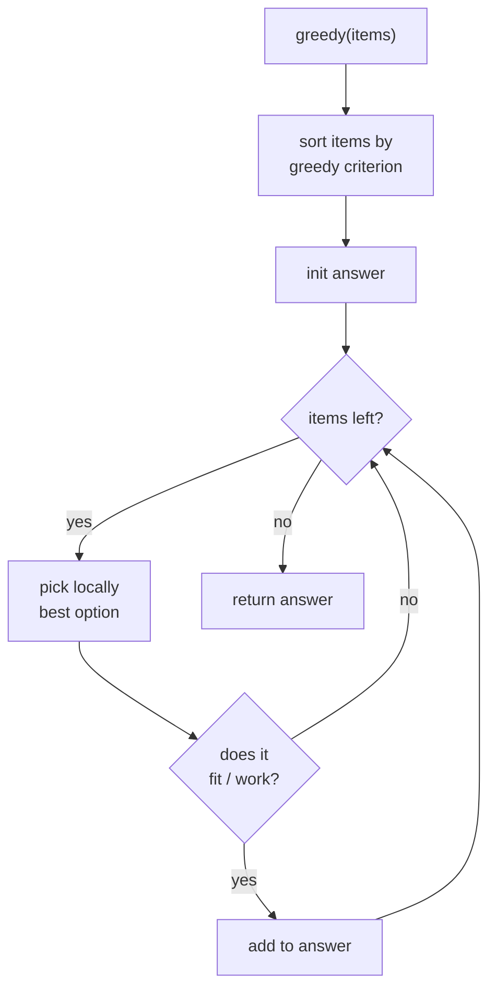

# Greedy Algorithms in Python

> Author: **Tamilselvan** · ✉️ tamilselvan.sde@gmail.com
> Section: 07 — Algorithms
> 🔗 Related: [sorting.md](./sorting.md) · [dynamic_programming.md](./dynamic_programming.md) · [sliding_window.md](./sliding_window.md)
> Data: [big_o.md](../08_Time_Complexity/big_o.md) · [heap.md](../04_Data_Structures/heap.md)
> Back to [README](../README.md)

---

## 1. What is it?

A **greedy algorithm** builds a solution **one step at a time**, at every step choosing the **locally best** option (by some rule), and **never revisiting** that decision.

> **Greedy ≠ optimal in general. It's only optimal when the problem has the right structure.**

### Real-world analogy
You're at a buffet with a small plate trying to **maximize food value per plate**. You don't know what's coming next, so you grab whatever dish looks best **right now** — that's greedy. It works fine when the dishes don't interfere with each other ("independently tasty"). If choices interact ("you can only pick hot OR cold, not both") and the local best is hot-now but cold-later beats it, greedy fails.

### What problem it solves
- **Optimization** problems where the local optimum accumulates to a global optimum (intervals, scheduling, jump problems, gas/toll problems).
- When the search space is huge and DP is too slow but a structural insight (**exchange argument** / **matroid structure**) shows greedy is safe.

### Cross-link → [sorting.md](./sorting.md)
Most greedy problems need a **specific sort order** before applying local rules (intervals by end, jumps by next max reach, tasks by cooling).

---

## 2. Why do we use it?

- **Fast** — usually O(n log n) for sort + O(n) for the greedy pass; vs DP which is often O(n²) or O(n·k).
- **Simple** — concise code, easier to defend than DP state transitions.
- **Memory-light** — often O(1) extra space beyond the sort.
- The most **practical** algorithm class in industry: most scheduling heuristics are greedy.

---

## 3. When should I choose it?

| Scenario / signal | Use Greedy? | Why / Why not |
|-------------------|-------------|----------------|
| "Maximum/minimum number of …" with interchangeable elements | ✅ | Exchange argument often holds (intervals: pick earliest end) |
| Intervals with start/end times | ✅ | Sort by end, pick non-overlapping next |
| "Can I reach the end?" (Jump Game) | ✅ | Track furthest reachable so far |
| Tasks with cooldown | ✅ | Greedy: place most frequent task first; fill idle gaps |
| Fractional knapsack | ✅ | Greedy by value/weight ratio is provably optimal |
| 0/1 knapsack | ❌ | Greedy fails → use DP |
| "Find min number of coins" with arbitrary denominations | ❌ | Greedy is suboptimal in general → DP |
| "All subsets satisfy…" | ❌ | Exhaustive search / backtracking |
| Existence of counter-example? | ❌ | Don't use greedy if you can find any case where local ≠ global |

**Signals to suspect greedy**:
- The word "minimum/maximum", especially when "in consideration order" suggests you can sort & process.
- Rules that "stay greedy": keep tracking a maximum reachable, keep taking earliest finish, etc.
- The problem can be decomposed into **independent** decisions.

---

## 4. Syntax

Minimal skeleton:

```python
def greedy(items):
    items.sort(key=some_function)        # establish the greedy ORDER
    ans = initial_value                  # count, total, last_end, etc.
    for x in items:
        if can_take(x, ans):             # the greedy RULE
            take(x)
            update(ans)
    return ans
```

Two ingredients every greedy needs:
1. **Order** (how to sort/iterate so local-best comes first).
2. **Rule** (the locally-best choice — "take earliest end", "extend max reach", "place most frequent first").

---

## 5. Basic Example

**LC 435 — Non-overlapping Intervals:** Minimum number of intervals to remove so the rest don't overlap. Classic greedy — sort by end, take each interval that starts after the last taken end.

```python
def eraseOverlapIntervals(intervals):
    if not intervals: return 0
    intervals.sort(key=lambda x: x[1])     # GREEDY ORDER: by end time
    end   = intervals[0][1]
    keep  = 1
    for s, e in intervals[1:]:
        if s >= end:                      # GREEDY RULE: doesn't overlap → take it
            keep += 1
            end = e
    return len(intervals) - keep
```

**Output** for `[[1,2],[2,3],[3,4],[1,3]]` → `1` (remove `[1,3]`).

---

## 6. Step-by-Step Dry Run

Input: `[[1,2],[2,3],[3,4],[1,3]]`

```
sort by end → [[1,2],[2,3],[1,3],[3,4]]
                                 ↑ re-sorted after sort key e
Actually: [1,2](end 2), [2,3](end 3), [1,3](end 3), [3,4](end 4)
   ↳ when ends tie, original order kept (Python sort stable).

keep=1, end=2
iter [2,3]: 2 >= 2 → take, keep=2, end=3
iter [1,3]: 1 < 3  → skip (overlaps)
iter [3,4]: 3 >= 3 → take, keep=3, end=4

removed = 4-3 = 1. ✓
```

**Why sorting by end is optimal** (exchange argument, light version): pick the interval that ends earliest leaves **maximum room** for the rest — any other choice removes more choices than this one. Sort-by-start doesn't work because a long interval starting early kills many options.

---

## 7. Built-in Methods / Idioms

| Idiom | Purpose | Syntax | Complexity | Interview use | Mistakes |
|------|---------|--------|-----------|---------------|---------|
| `sort(key=lambda x: x[1])` | Sort intervals by **end** | by end for "max non-overlapping count" | O(n log n) | LC 435, 452, 252 | Sorting by start when greedy needs end (or vice versa) |
| `sort(key=lambda x: -x[1])` / `sort(reverse=True)` | Sort by descending value | for "take biggest first" | O(n log n) | assignment scheduling | Wrong direction |
| `heapq.heapify` / `heappush` / `heappop` | Maintain "currently active" set | min-heap of end times | O(log n) per op | LC 253 Meeting Rooms II | Using `max` instead of heap → O(n) per insert |
| `itertools.groupby` | Aggregate sorted data | runs of equal keys | O(n) | rare | Forgetting to sort first |
| `enumerate` with index | Track "max reachable" | for Jump Game family | O(n) | LC 45, 55 | Writing nested loops (greedy avoids them) |
| `Counter.most_common()` | Frequency-sorted tuples | LC 621 scheduling | O(n log n) | Same as sorting | Forgetting idle-slot math |

---

## 8. Interview Examples

### 8.1 LC 55 — Jump Game
```python
def canJump(nums):
    reach = 0
    for i, x in enumerate(nums):
        if i > reach: return False       # can't ever reach index i
        reach = max(reach, i + x)        # extend greedy frontier
    return True
```
Greedy insight: just keep the **furthest index reachable so far**. If we reach index `i` past `reach`, fail.

### 8.2 LC 45 — Jump Game II
```python
def jump(nums):
    jumps = far = cur_end = 0
    for i in range(len(nums) - 1):
        far = max(far, i + nums[i])
        if i == cur_end:                  # reached the end of current jump's range
            jumps += 1
            cur_end = far
    return jumps
```
Greedy BFS-by-layers: each jump we make extends `cur_end` to the max reachable.

### 8.3 LC 134 — Gas Station
```python
def canCompleteCircuit(gas, cost):
    if sum(gas) < sum(cost): return -1    # global feasibility check first
    tank, start = 0, 0
    for i in range(len(gas)):
        tank += gas[i] - cost[i]
        if tank < 0:                      # can't reach i+1 from `start` → restart
            start = i + 1
            tank = 0
    return start
```
Key insight: if total gas >= total cost, **exactly one** valid start; if going from current start fails at index i, no index in between can succeed.

### 8.4 LC 122 — Best Time to Buy/Sell Stock II
```python
def maxProfit(prices):
    return sum(max(0, prices[i] - prices[i-1])
               for i in range(1, len(prices)))
```
Take every up-swing — sum equals any optimal strategy (provable via telescoping).

### 8.5 LC 253 — Meeting Rooms II (heap + greedy)
```python
import heapq
def minMeetingRooms(intervals):
    intervals.sort(key=lambda x: x[0])
    rooms = []
    for s, e in intervals:
        if rooms and rooms[0] <= s:
            heapq.heappop(rooms)         # previous meeting ended → reuse room
        heapq.heappush(rooms, e)
    return len(rooms)
```
Greedy rule: assign each meeting to the room that finishes earliest (heap = earliest end time on top).

### 8.6 LC 621 — Task Scheduler
```python
import heapq
from collections import Counter
def leastInterval(tasks, n):
    freqs = [-v for v in Counter(tasks).values()]
    heapq.heapify(freqs)
    cycles = 0
    while freqs:
        cooldown = []
        for _ in range(n + 1):
            if not freqs: break
            cooldown.append(heapq.heappop(freqs) + 1)   # +1 because stored negatives
            cycles += 1
        for v in cooldown:
            if v < 0: heapq.heappush(freqs, v)
    return cycles
```
Greedy: schedule the most-frequent task each window; if still has occurrences, push back into a cooldown window.

---

## 9. When NOT to use

| Situation | Counterexample |
|-----------|---------------|
| **0/1 Knapsack** | Greedy-by-value-density picks the priciest item first — but if it fills the bag you miss two cheaper items that together exceed the value. Use DP. |
| **Coin change with arbitrary denominations** | Coins `{1, 3, 4}`, target 6 → greedy takes `4+1+1=3 coins`, optimal is `3+3=2 coins`. Use DP (LC 322). |
| **Longest path** (graph) | Local best edges don't add up globally — NP-hard in general. |
| **Travelling salesman** | Need exhaustive search or approximation algorithms. |
| **Bin packing** (exact) | NP-hard — greedy first-fit is a heuristic, not optimal. |
| **Box stacking** with multiple dimensions | Needs DP in many variants. |

If you can construct **any** input where greedy falls short of optimal → greedy is **not** correct.

---

## 10. Common Mistakes
1. **Sorting by the wrong coordinate** — for intervals, "count max non-overlapping" sorts by **end**, "merge overlapping" sorts by **start**. Mixing them fails.
2. **Skipping the proof of correctness** — verbalize "why greedy is safe here" before coding. If you can't, it may not be.
3. **Two-pointer `interval[i] vs interval[j]`** confusion: in greedy you iterate sequentially with the last-taken boundary, not two parallel pointers.
4. **Heap forgotten for "Meeting Rooms II"** — using simple list and `min()` gives O(n²). Use `heapq` → O(n log n).
5. **`for i in range(1, len(prices))`** with `prices[i-1]` going OOB on empty input → guard with `if not prices: return 0`.
6. **Off-by-one in Jump Game II**: iterating to `len(nums)-1` (not `-1` to last index included) — last jump already counted by then.
7. **LeetCode `intervals` is `List[List[int]]`** — using tuple unpacking `for s, e in intervals` works only for lists of length 2; if input gives length-3 (with index) → unpack accordingly or unpack `interval[0], interval[1]`.
8. **Global feasibility check missing** (LC 134) → without `sum(gas) >= sum(cost)` early return, the algorithm still works modulo the input assumption but you may falsely return a start index that completes single-loop only because of cyclic wrap. ALWAYS guard with the global sum inequality.
9. **Coin change** reflex: interviewers often set up coin-change with denomination `25,10,5,1` (US coins), where greedy is optimal, then ask "what about general denominations?" → expect this trap.

---

## 11. Memory Tricks

- 🎯 **"Greedy = grab and don't look back"** (no undo, no regret).
- 📅 **"Sort by end for max count; sort by start for merge/coverage"** — the single most reused interval rule.
- 🏃 **"Keep the frontier"** — Jump Game/Letter shorthand: track how far you can get so far.
- ⛽ **"If total gas ≥ total cost, you can finish — start anywhere the tank recovers non-negative."**
- 🧮 **Greedy works when each choice is independent / monotonic** — look for monotone structure.
- ❗ **Construct a counter-example** — if you can break greedy with any input, switch to DP.

---

## 12. Interview Shortcuts

- **Verbalize** the greedy rule before code: *"At each step I'll take the interval with the earliest end time that doesn't conflict."*
- **Sort once, iterate once** — almost always O(n log n) due to sort.
- For "non-overlapping" count → **sort by end, count `≥ last_end`**.
- For "merge intervals" → **sort by start, merge when new.start ≤ last.end**.
- For "min arrows to burst balloons" (LC 452) → **sort by end**, shoot an arrow at the end of the first non-burst interval → greedily bursts max balloons.
- For meeting rooms count → **heap of end times**; pop when room free before pushing new end.
- For greedy feasibility checks → **global necessary conditions** (sum gas ≥ sum cost, enough "cold" slots for hot tasks) cut runtime in half.
- When stuck: write **brute force** recursively, then notice repeated decisions and try **greedy-by-counterexample** approach.

---

## 13. Cheat Sheet Table

| Problem | Sort by | Greedy rule | Complexity |
|---------|---------|-------------|------------|
| 435 Non-overlapping Intervals | end | keep interval if `start ≥ last_end` | O(n log n) |
| 452 Min Arrows | end | shoot arrow at last_end; burst while `start ≤ arrow` | O(n log n) |
| 56 Merge Intervals | start | merge if `start ≤ running_end` | O(n log n) |
| 252/253 Meeting Rooms | start | heap of end times, reuse earliest free | O(n log n) |
| 55 Jump Game | – | track furthest reachable | O(n) |
| 45 Jump Game II | – | expand `cur_end` in BFS layers | O(n) |
| 134 Gas Station | – | if `tank < 0`, restart at next index | O(n) |
| 121 Best Time Buy/Sell (single) | – | track min so far, max profit = max(p - min) | O(n) |
| 122 Buy/Sell II | – | sum every positive up-swing | O(n) |
| 621 Task Scheduler | freq desc | repeat most frequent in window of `n+1` | O(T log A) |
| 605 Can Place Flowers | – | plant at i if prev & next both 0 | O(n) |
| 406 Queue Reconstruction by height desc, k asc | insert by index `k` | – | O(n²) |
| 392 Is Subsequence | – | advance pointer on match | O(n) |
| 881 Boats to Save People | weight asc | pair lightest with heaviest possible | O(n log n) |

---

## 14. Time Complexity Table

| Problem | Sort | Greedy pass | Total | Space |
|---------|------|-------------|-------|-------|
| LC 435/452 intervals | O(n log n) | O(n) | O(n log n) | O(sort: Timsort O(n)) |
| LC 55/45 Jump | – | O(n) | O(n) | O(1) |
| LC 134 Gas | – | O(n) | O(n) | O(1) |
| LC 253 Meeting Rooms II | O(n log n) | O(n log n) (heap ops) | O(n log n) | O(n) heap |
| LC 621 Task Scheduler | O(A log A) | O(T log A) | O(T log A) | O(A) |
| General rule: | O(n log n) for sort | O(n) for scan | **O(n log n)** | usually O(n) or O(1) |

(A = # distinct task types, T = total tasks.)

---

## 15. Visual Diagram (ASCII + Mermaid)



**Interval greedy choice — sort by end, take earliest end:**

```
Time →  1   2   3   4   5   6   7   8   9   10
        ───────┐                       ───┐
        │  A: [1,3]                     │ E
        ──┐              ──────┐        │
          │ B: [2,5]            │ D[5,8]│
             ───────┐            │       │
             │ C: [4,7]                  │
After sort by end:
   A [1,3], B [2,5], C [4,7], D [5,8], E [9,10]
Greedy:
   take A  (end=3)
    ├─B starts 2 < 3 ✓? No  → skip (overlaps A)
    ├─C starts 4 ≥ 3 → take! (end=7)
    ├─D starts 5 < 7 → skip
    └─E starts 9 ≥ 7 → take!  (end=10)
   kept = 3   (A, C, E) → optimal
```

**Jump Game "frontier expands":**

```
i:    0    1    2    3    4    5
v:    3    1    1    2    0    ?
reach 3    4    4    5    5    5  (≥ n-1 ⇒ True)
```

**Gas Station restart rule:**

```
tank:  +1  -2  +3  +2 → at index 1 tank<0 ⇒ start = 2; reset tank;
                     then tank: +3  +2  ≥ 0 for the remainder ⇒ start=2 is the answer
                     (assuming global sum ≥ 0)
```

**Greedy decision flow:**
```
   greedy(items)
       │
       ▼
   sort(items, key=greedy_order)      ← establish priority
       │
       ▼
   ans = init
       │
       ▼
   for x in items:  ────┐
       │               │
       ▼               │
   can_take(x, ans)?───┤
       │ yes           │ no
       ▼               ▼
   take(x); update(ans)│← skip, continue loop
       │               │
       └───────────────┘
       │
       ▼
   return ans
```

---

## 16. Beginner Notes

> **Remember:**
> - Greedy = make locally-best choice and **never undo**.
> - **Always sort first** (mostly by end or by some priority rule) before the pass.
> - A greedy algorithm is only correct when **local optimum ⇒ global optimum** structurally — be ready to defend with an **exchange argument** or **counterexample search**.
> - Counterexample → switch to DP. Coin-change & 0/1-knapsack are the canonical "greedy fails" cases.
> - Intervals: **end** for "max count / min removal", **start** for "merge / coverage".
> - Jump game / gas station: track a **monotone running value** — no DP needed.
> - Cross-link → [sorting.md](./sorting.md), [dynamic_programming.md](./dynamic_programming.md), [heap.md](../04_Data_Structures/heap.md), [big_o.md](../08_Time_Complexity/big_o.md).

---

## 17. FAANG Tips

- **Pitch the greedy insight first** before coding. Saying *"I sort by end and greedily take each non-overlapping interval — because the earliest-ending one leaves the most room for the rest"* directly signals you understand WHY.
- **State the complexity**: "O(n log n) due to sort, O(1) extra" — the interviewer's expected answer in one breath.
- **Mention exchange argument** confidently when asked "are you sure greedy is optimal?". For intervals: any solution that doesn't take the earliest-ending interval can be transformed into one that does, without reducing the count.
- **Beware edge cases** the interviewer will probe:
  - Empty input → `0` / `0` / accordance with problem
  - Single interval / single-element jump game
  - Negative shift / daylight saving in interval lists — usually not given
  - Tie in sort keys → stable sort, but to be safe include secondary key
- If asked to **prove**, sketch in 2 sentences why replacing any locally-bad choice never decreases the answer.
- **A fun litmus test**: if a problem asks for the **minimum/maximum number** of disjoint things (intervals, jumps, coins, meetings), consider greedy first. If it asks for **maximum count with constraints**, lean toward DP/binary search.
- When greedy and DP look viable — **code greedy first** (least bug surface), verify on tests; if fails, switch to DP.

---

## 18. Practice Problems

### Easy
| # | Title | LeetCode |
|---|-------|----------|
| 121 | Best Time to Buy and Sell Stock | [link](https://leetcode.com/problems/best-time-to-buy-and-sell-stock/) |
| 122 | Best Time to Buy and Sell Stock II | [link](https://leetcode.com/problems/best-time-to-buy-and-sell-stock-ii/) |
| 605 | Can Place Flowers | [link](https://leetcode.com/problems/can-place-flowers/) |
| 392 | Is Subsequence | [link](https://leetcode.com/problems/is-subsequence/) |
| 455 | Assign Cookies | [link](https://leetcode.com/problems/assign-cookies/) |

### Medium
| # | Title | LeetCode |
|---|-------|----------|
| 55 | Jump Game | [link](https://leetcode.com/problems/jump-game/) |
| 45 | Jump Game II | [link](https://leetcode.com/problems/jump-game-ii/) |
| 134 | Gas Station | [link](https://leetcode.com/problems/gas-station/) |
| 435 | Non-overlapping Intervals | [link](https://leetcode.com/problems/non-overlapping-intervals/) |
| 452 | Minimum Number of Arrows to Burst Balloons | [link](https://leetcode.com/problems/minimum-number-of-arrows-to-burst-balloons/) |
| 253 | Meeting Rooms II | [link](https://leetcode.com/problems/meeting-rooms-ii/) |
| 621 | Task Scheduler | [link](https://leetcode.com/problems/task-scheduler/) |
| 406 | Queue Reconstruction by Height | [link](https://leetcode.com/problems/queue-reconstruction-by-height/) |
| 881 | Boats to Save People | [link](https://leetcode.com/problems/boats-to-save-people/) |

### Hard
| # | Title | LeetCode |
|---|-------|----------|
| 135 | Candy | [link](https://leetcode.com/problems/candy/) |
| 659 | Split Array into Consecutive Subsequences | [link](https://leetcode.com/problems/split-array-into-consecutive-subsequences/) |
| 991 | Broken Calculator | [link](https://leetcode.com/problems/broken-calculator/) |

---

**Cross-links:** [sorting.md](./sorting.md) · [dynamic_programming.md](./dynamic_programming.md) · [sliding_window.md](./sliding_window.md) · [big_o.md](../08_Time_Complexity/big_o.md) · [heap.md](../04_Data_Structures/heap.md) · Back to [README](../README.md)