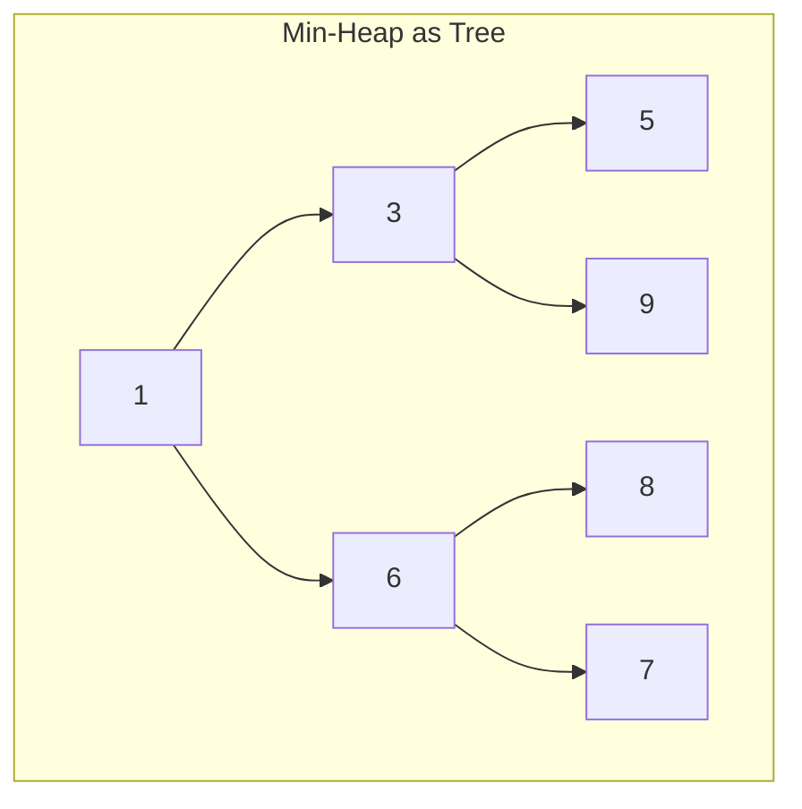

# Heap & Priority Queue in Python

> Author: **Tamilselvan** · ✉️ tamilselvan.sde@gmail.com · 🔗 [LinkedIn](https://www.linkedin.com/in/tamilselvan-ai/)
> Section: 07 — Algorithms
> 🔗 Related: [sorting.md](./sorting.md) · [bfs.md](./bfs.md) · [recursion.md](./recursion.md) · [Two Pointers](./two_pointers.md)
> Data: [list.md](../02_Data_Types/list.md) · [heapq module](../06_Collections/heapq.md) · [big_o.md](../08_Time_Complexity/big_o.md)
> Back to [README](../README.md)

---

## 1. What is it?

A **heap** is a complete binary tree that satisfies the **heap property**: every parent compares correctly against its children.

- **Min-heap** — parent ≤ every child. Smallest element sits at the root.
- **Max-heap** — parent ≥ every child. Largest element sits at the root.

Because the tree is **complete** (every level filled except possibly the last, left-to-right), it can be stored compactly in a flat list — no pointers needed.

**Array layout (0-indexed):**
```
Index: 0   1   2   3   4   5   6
Value: 4   8  10  15  20  12  11

         4
       /   \
      8     10
     / \   / \
    15 20 12 11
```
- Parent of `i`  →  `(i - 1) // 2`
- Children of `i`  →  `2*i + 1`,  `2*i + 2`

Python's `heapq` module implements a **min-heap** on top of a plain `list`. To simulate a max-heap, store **negated** values.

A **priority queue** is the abstract data type ("smallest/largest element first"); a **heap** is one efficient implementation (binary heap), and `heapq` is Python's concrete interface.

**What problem it solves:** Repeatedly retrieve the **minimum/maximum** element from a dynamic collection with O(log n) insert and O(log n) extraction — much better than sorting the entire list each time.

**Real-world analogy:** The emergency room triage queue. New patients arrive (insert), and the most critical (smallest "priority score") is always treated next (extract-min). You don't re-sort the whole waiting room — you bubble the most urgent patient to the front.

---

## 2. Why do we use it?

| Benefit | Detail |
|--------|--------|
| **O(log n) push / pop** | Maintains order dynamically — much better than sorting on every change. |
| **O(1) peek** | `heap[0]` is always the smallest (min-heap). |
| **Top-K problems** | Beat sorting: O(n log k) instead of O(n log n). |
| **Streaming medians** | Maintain two heaps (max-heap for lower half, min-heap for upper half) — O(log n) per insert. |
| **Merge K sorted sequences** | K-way merge with a heap of size K — used in external sort, top-K from K streams. |
| **Dijkstra / Prim** | The priority queue is the engine. Without a heap, Dijkstra is O(V²); with one it's O((V+E) log V). |

**Brute force vs heap:** If you maintain "top K by repeatedly sorting", that's O(n log n). With a bounded heap of size K you get **O(n log k)** — for K ≪ n this is a huge win.

---

## 3. When should I choose it? (Decision Table — heap vs sorted list vs hash)

| Situation | Heap | Sorted list (bisect) | Hash / Counter |
|-----------|:----:|:--------------------:|:---------------:|
| Online min/max retrieval on a stream | ✅ | △ (insert O(n)) | ❌ |
| Top-K smallest/largest | ✅ O(n log k) | △ O(n log n) | ❌ |
| Kth largest / element in stream | ✅ | △ | ❌ |
| Median of stream | ✅ (two heaps) | △ | ❌ |
| Frequency-count then top-K | ✅ + Counter | △ | ✅ (counting stage) |
| Range queries / binary search | ❌ | ✅ | ❌ |
| Membership (`in`) check | ❌ | O(log n) | ✅ O(1) |
| Insert many then iterate sorted | △ (heapify O(n) + n pops) | ✅ (just sort) | ❌ |
| Stable order / duplicates tracking | depends | ✅ | ✅ |
| Dijkstra / Prim single-source | ✅ | △ (slower) | ❌ |

**Rule of thumb:** You need a heap when the problem says **"kth", "top-k", "streaming median", "merge k", "priority", "smallest/largest so far"** and size is dynamic / large / streaming.

---

## 4. Syntax

### Import & core functions

```python
import heapq

# 1. heapify — turn a list into a heap IN-PLACE in O(n)
a = [5, 3, 8, 1, 9]
heapq.heapify(a)              # a becomes [1, 3, 8, 5, 9]

# 2. heappush — insert keeping the heap property, O(log n)
heapq.heappush(a, 2)          # a now includes 2, still valid heap

# 3. heappop — pop & return the SMALLEST, O(log n)
x = heapq.heappop(a)          # x == 1

# 4. peek — just read index 0; O(1)
smallest = a[0]

# 5. heapreplace — pop smallest, then push new; O(log n) — slightly faster than pop + push
y = heapq.heapreplace(a, 7)   # pops smallest, returns it, pushes 7

# 6. pushpop — push then pop; returns the SMALLER of (new, smallest)
z = heapq.heappushpop(a, 0)   # pushes 0, then pops smallest (== 0)

# 7. nlargest / nsmallest — convenience, O(n log k)
top3 = heapq.nlargest(3, a)
bot3 = heapq.nsmallest(3, a)

# 8. merge — merge multiple sorted iterables (returns iterator)
for x in heapq.merge([1,3,5], [2,4,6]): print(x)   # 1 2 3 4 5 6
```

### Max-heap via negation

```python
import heapq
max_heap = []
for v in [5, 3, 9, 1]:
    heapq.heappush(max_heap, -v)        # store negatives
largest = -heapq.heappop(max_heap)     # negate back to get max
```

Or wrap tuples with a reverse comparator key:
```python
heapq.heappush(h, (-priority, item))   # smaller -priority ⇒ bigger priority
```

---

## 5. Basic Example

```python
import heapq

a = [5, 3, 8, 1, 9, 2]
heapq.heapify(a)
print("after heapify:", a)
print("peek          :", a[0])
heapq.heappush(a, 0)
print("after push 0   :", a)
print("pop            :", heapq.heappop(a))
print("pop            :", heapq.heappop(a))
print("heap now       :", a)
print("2 largest      :", heapq.nlargest(2, a))
print("2 smallest     :", heapq.nsmallest(2, a))
```
**Output:**
```
after heapify: [1, 2 8, 5, 9, 3]
peek          : 1
after push 0   : [0, 2, 1, 5, 9, 3, 8]
pop            : 0
pop            : 1
heap now       : [2, 3, 8, 5, 9]
2 largest      : [9, 8]
2 smallest     : [2, 3]
```
(Note: list contents after each op *are* a valid heap but not necessarily globally sorted.)

---

## 6. Step-by-Step Dry Run

Initial array `[5, 3, 8, 1, 9, 2]`, heapify step-by-step:

After `heapify`:
```
         1
       /   \
      2     8
     / \   /
    5   9 2

Heap list: [1, 2, 8, 5, 9, 2]   ✓ smallest at root, property holds
```

`heappush(a, 0)`:
```
Append 0 at index 6 →  [1, 2, 8, 5, 9, 2, 0]
Sift index 6 up:
   parent of 6 = (6-1)//2 = 2 (value 8). 0 < 8 → swap.
   parent of 2 = 0 (value 1). 0 < 1 → swap.
Heap: [0, 2, 1, 5, 9, 2, 8]

          0
        /   \
       2     1
      / \   / \
     5  9  2   8
```

`heappop(a)` → returns `0`:
```
Swap root with last: [8, 2, 1, 5, 9, 2 | pop 0]
Reduce size by 1.
Sift 8 (index 0) down:
   children 2 (value 2) and 1 (value 1). Smaller child = 1 (index 2). 8 > 1 → swap.
Heap now: [1, 2, 8, 5, 9, 2]
```

Final: pop returns `0`, smallest remaining is `1`.

---

## 7. Built-in Methods (`heapq`)

| Method / Syntax | Purpose | Example | Complex-ity | Interview use | Mistakes |
|-----------------|---------|---------|-------------|----------------|----------|
| `heapq.heapify(a)` | turn a list into a heap **in place** | `heapq.heapify(a)` | **O(n)** | init from existing array | returns `None`, not a new list |
| `heapq.heappush(a, x)` | insert x keeping heap invariant | `heapq.heappush(h, 5)` | O(log n) | online priority queue | directly assigning `h[0]` breaks heap |
| `heapq.heappop(a)` | pop the smallest element | `m = heapq.heappop(h)` | O(log n) | get next priority | empty heap → IndexError |
| `heapq.heappushpop(a, x)` | push x then pop smallest (1 sift) | `min = heapq.heappushpop(h, 4)` | O(log n) | optimised "1 min of {new, heap min}" | order: push first, then pop |
| `heapq.heapreplace(a, x)` | pop smallest then push x (1 sift) | `min = heapq.heapreplace(h, 4)` | O(log n) | fixed-size sliding window | raises IndexError if heap empty |
| `a[0]` | peek smallest without removing | `m = h[0]` | O(1) | priority peek | does NOT pop — common confusion |
| `heapq.nlargest(k, a)` | k largest elements (sorted desc) | `heapq.nlargest(3, a)` | O(n log k) | top-K | if k ≈ n, just `sorted(a)` is faster |
| `heapq.nsmallest(k, a)` | k smallest elements (sorted asc) | `heapq.nsmallest(3, a)` | O(n log k) | bottom-K | same caveat |
| `heapq.merge(*iterables)` | merge sorted iterables lazily | `list(heapq.merge(s1, s2, s3))` | O(k log k) per element where k streams | merge K sorted lists | inputs MUST already be sorted |
| `-x` for max-heap | negate values to simulate max-heap | `heapq.heappush(h, -v)` | O(log n) | top-K largest with min-heap | forget to negate back on pop |

**Shortcut — heap as a sliding window of top-K largest:**
```python
import heapq
def topK_largest(nums, k):
    h = []
    for v in nums:
        heapq.heappush(h, v)
        if len(h) > k:
            heapq.heappop(h)        # evict the smallest of the K+1 → keep K largest
    return sorted(h, reverse=True)
```
The heap stays bounded at size k+1, giving **O(n log k)**.

**Mistakes:**
- Treating the underlying list as **sorted**. It is *heap-ordered*, not sort-ordered — iterating `for x in h:` does NOT yield sorted order. Pop repeatedly or use `nsmallest`.
- Calling `a[0]` thinking it pops — it just **peeks**.
- Comparing tuples — Python compares element-wise, so `(priority, value)` lets you break ties deterministically; respect it when priorities collide.
- Forgetting that `heapq` is a **min-heap only**. Max needs negation or wrapping.
- Mutating elements in place after insertion — heap structure isn't automatically rebuilt.

---

## 8. Interview Example — 215. Kth Largest Element in an Array

```python
import heapq

def findKthLargest(nums, k):
    h = []
    for v in nums:
        heapq.heappush(h, v)
        if len(h) > k:
            heapq.heappop(h)        # discard smallest, keep top-k largest
    return h[0]                     # the smallest among the k largest = kth largest

print(findKthLargest([3,2,1,5,6,4], 2))   # 5
print(findKthLargest([3,2,3,1,2,4,5,5,6], 4))  # 4
```
**Output:**
```
5
4
```
**Why this works:** A min-heap of size k storing the **k largest seen so far**. Its root is the **smallest of those k**, i.e., the **k-th largest** overall.

**Alt:** `return heapq.nlargest(k, nums)[-1]` — one-liner, O(n log k), same asymptotic.

---

## 9. When NOT to use

- **You need the data fully sorted.** Just call `sorted(a)` (Timsort, O(n log n), very fast cache-friendly). `heappop` ×n is also O(n log n) but with worse constants.
- **Random access by rank / range queries.** Heaps only give O(1) for the min (root); finding an arbitrary element is O(n) linear scan. Use a sorted list (bisect) or balanced BST (not native to Python).
- **You only need min or max once.** `min(a)` / `max(a)` is O(n) — cheaper than heapifying.
- **Membership tests dominate.** A hash set / dict gives O(1); heaps give O(n).
- **Small, fixed-size inputs.** Heap machinery overhead beats doing plain sort for n < ~100.
- **Strictly FIFO / LIFO semantics.** Use `deque` / `list` — heap orders by *priority*, not insertion.

---

## 10. Common Mistakes

1. **Assuming `list` contents are sorted.** Heaps are *partially ordered*. Iterate by `heappop` if you need sorted output.
2. **`heapify` returns `None`** — it mutates in place. Doing `h = heapq.heapify(a)` leaves `h = None`.
3. **Pushing tuples thinking only first value matters for entire comparison.** Python compares tuples lexically: `(priority, tie_break, value)` — make sure the tie-break is comparable to avoid `TypeError` when priorities tie.
4. **Max-heap without negation.** `heapq` is min-only. Want a max-heap? Either negate, or push `(-priority, item)`.
5. **Empty heap peek/pop.** Always check `if h:` or `len(h) > 0` before `heappop`.
6. **Mixing `heapreplace`/`pushpop` semantics.** `heapreplace` pops first then pushes; `pushpop` pushes first then pops. Mixing them flips behaviour subtly.
7. ** modifying values in place.** Heap doesn't auto-reheap; you must ` heapreplace` or pop+push.
8. **Using `nlargest(k, a)` for huge k.** Complexity O(n log k) is fine, but if k ≈ n just use `sorted(a, reverse=True)`.
9. **Forgetting that Dijkstra/Prim heap stores `(distance, node)`** — distance first so the heap orders by distance, not node.
10. **Storing unhashable / mutated keys.** Re-pushing the same node with a smaller key leaves the stale larger entry — common bug in Dijkstra implementations. Use a visited check or lazy deletion.

---

## 11. Memory Tricks

- **"Triage queue"** — most critical patient always next; new arrivals bubble up by severity.
- **"Complete tree in a flat array"** — index 0 is root; parent = `(i-1)//2`; children = `2i+1, 2i+2`. No pointers, just arithmetic.
- **Min-heap always, max = negate.** `heapq.heappush(h, -v)` is the trick.
- **"Bubble up on insert, sift down on pop."**
  - Insert: append at end, swap with parent while you're smaller.
  - Pop: take root, move last leaf to root, swap with smaller child while you're bigger.
- **Top-K with bounded min-heap** — keep a heap of size K; evict the smallest when over capacity. End heap → K largest.

---

## 12. Interview Shortcuts

- Top-K largest → min-heap of size K (preserves the **K largest**). Top-K smallest → max-heap of size K (or negate values + min-heap).
- `heapq.nsmallest(k, a, key=...)` and `heapq.nlargest(k, a, key=...)` — huge convenience; uses internal heap to keep it O(n log k).
- Two-heap median trick: a **max-heap for the lower half** (negate values) and **min-heap for the upper half**. Keep their sizes balanced (`abs(len_lo - len_hi) <= 1`).
  ```python
  def addNum(num):
      heapq.heappush(lo, -num)                         # max-heap of smalls
      heapq.heappush(hi, -heapq.heappop(lo))           # move max of smalls to bigs
      if len(lo) < len(hi):                            # rebalance
          heapq.heappush(lo, -heapq.heappop(hi))
  def median(): return -lo[0] if len(lo) > len(hi) else (hi[0] - lo[0]) / 2
  ```
- Merge K sorted lists → push K heads onto a heap, pop smallest, push its next pointer. Repeat. Classic 23.
- Dijkstra: heap stores `(dist, node)`; lazy deletion — once popped, if `dist > dist[node]`, skip.
- K closest points to origin (973) → heap of size K with key `x² + y²`; bounded min-heap.

---

## 13. Cheat Sheet Table

| Concept | Heap detail |
|--------|-------------|
| Module | `import heapq` |
| Backing storage | plain `list` (0-indexed) |
| Heap property | parent ≤ children (min-heap) |
| `heapify` | O(n) in place, returns None |
| `heappush` / `heappop` | O(log n) |
| Peek | `a[0]` O(1) |
| Max-heap | negate values (push -v) |
| Top-K | bounded heap size k, O(n log k) |
| Two-heap median | max-heap (small side) + min-heap (big side) |
| Merge K sorted | heap of K cursors |
| Dijkstra / Prim | `(priority, node)` tuples |
| Avoid when | need global sort / range queries / membership |

---

## 14. Time Complexity Table

| Operation | Complexity | Notes |
|-----------|-----------|-------|
| `heapify` (build) | **O(n)** | Floyd's algorithm — surprisingly linear |
| `heappush` | O(log n) | bubble up |
| `heappop` | O(log n) | sift down |
| `heappushpop` | O(log n) | combined single sift |
| `heapreplace` | O(log n) | combined single sift |
| `peek (a[0])` | **O(1)** | root access only |
| `nlargest` / `nsmallest` | **O(n log k)** | bounded heap of size k |
| `heapq.merge` of m streams | O(N log m) total | lazy iterator |
| Sort via heaps (heappop ×n) | O(n log n) | worse constants than Timsort — prefer `sorted()` |
| Space | O(n) | the list itself |

---

## 15. Visual Diagram (ASCII + Mermaid)

### Heap as binary tree vs as flat list



```
Tree:                          List (0-indexed):
            1                      [1, 3, 6, 5, 9, 8, 7]
          /   \
         3     6                  Parent(i)  = (i-1)//2
        / \   / \                 Left(i)    = 2*i + 1
       5  9  8  7                 Right(i)   = 2*i + 2

  index: 0   1  2  3  4  5  6
  value: 1 | 3  6 | 5  9  8  7
```

### `heappush(0)` — bubble up

```
Before:  [1, 3, 6, 5, 9, 8, 7]   (1 is root)

Step 1: append 0 at end        [1, 3, 6, 5, 9, 8, 7, 0]
         1
        / \
       3   6
      /|   |\
     5 9   8 7
              \
               0          ← newly appended

Step 2: bubble up — swap with parent until in place
        parent(7) = 3 (index 3 = value 5). 0 < 5 ⇒ swap.
        parent(3) = 1 (index 1 = value 3). 0 < 3 ⇒ swap.
        parent(1) = 0 (index 0 = value 1). 0 < 1 ⇒ swap.

Final:   [0, 1, 6, 3, 9, 8, 7, 5]
         0
        / \
       1   6
      / \   / \
     3  9  8  7
        \
         5
```

### `heappop()` — sift down

```
Before:  [0, 1, 6, 3, 9, 8, 7, 5]

Step 1: swap root (0) with last (5), then remove last
        [5, 1, 6, 3, 9, 8, 7]
Step 2: sift 5 down
        children of idx0: 1 and 6. Smaller = 1. 5 > 1 ⇒ swap.
        children of idx1: 3 and 9. Smaller = 3. 5 > 3 ⇒ swap.

Final:   [1, 3, 6, 5, 9, 8, 7]
Return:  0
```

### Top-K with bounded heap of size K

```
Stream: [4, 1, 7, 3, 8, 5], K = 3

Push 4:  [4]
Push 1:  [1, 4]
Push 7:  [1, 4, 7]               size == K
Push 3:  [1, 3, 7, 4]  → pop 1 → [3, 4, 7]
Push 8:  [3, 4, 7, 8]  → pop 3 → [4, 8, 7]
Push 5:  [4, 5, 7, 8]  → pop 4 → [5, 8, 7]

Final heap (the 3 largest): [5, 8, 7]   (or unsorted; pop for sorted order: 5,7,8)
```

---

## 16. Beginner Notes (Remember block)

> **Remember:**
> - `heapq` is a **min-heap** on a plain `list`. For max-heap, **negate values**.
> - The list is **partially ordered**, NOT globally sorted. Use pops or `nsmallest` for sorted output.
> - `heapify` mutates in place, returns `None`. O(n) — surprisingly fast.
> - `heappush` / `heappop` are **O(log n)**; peek `a[0]` is **O(1)**.
> - **Top-K = bounded min-heap of size K**, O(n log k). Giant time saver.
> - Median = two heaps: max-heap of smalls, min-heap of bigs, kept balanced.
> - Parent `(i-1)//2`; children `2i+1, 2i+2`.
> - Pick heap over sort when k ≪ n or data is a stream.

---

## 17. FAANG Tips

- **Kth largest (215)** is *the* gateway heap problem. Two variants — bounded min-heap of size k, or `nlargest(k, nums)[-1]`.
- **Top K Frequent (347)**: first Counter → then push `(-freq, word)` to get top-K most common. Counter has `.most_common(k)` doing exactly this internally.
- **Merge K Sorted Lists (23)**: push `(node.val, i, node)` — the index `i` is a stable tiebreaker because `ListNode` isn't comparable. Pop smallest, push its `next`.
- **Median from Data Stream (295)**: the canonical two-heap problem. Rebalance sizes each insert.
- **Kth Largest in a Stream (703)**: bounded heap of size K; only push & pop if over capacity.
- **K Closest Points (973)**: bounded max-heap of size K by distance squared OR `nsmallest(K, points, key=dist)`.
- **Dijkstra / Cheapest Flights**: heap stores `(total_cost, node, remaining_stops)`; lazy deletion by skipping popped entries whose recorded cost exceeds the latest known dist.
- **Sliding Window Maximum (239)**: NOT a heap problem — use a monotonic deque. Heaps can't remove arbitrary elements efficiently.

---

## 18. Practice Problems

### Easy
1. **703. Kth Largest Element in a Stream** — bounded heap of size k.
2. **1046. Last Stone Weight** — max-heap (negate), smash until ≤1 stone.
3. **703. Kth Largest Element in a Stream** (already mentioned) — keep using `heapreplace` for online updates.
4. **215. Kth Largest Element in an Array** — min-heap size K or `nlargest`.
5. **2336. Smallest Number in Infinite Set** — heap of poppable values.

### Medium
1. **347. Top K Frequent Elements** — Counter then `nlargest` by freq.
2. **973. K Closest Points to Origin** — bounded heap by distance.
3. **378. Kth Smallest Element in a Sorted Matrix** — heap of column heads.
4. **295. Find Median from Data Stream** — two heaps.
5. **373. Find K Pairs with Smallest Sums** — heap of pair sums.
6. **1167. Minimum Cost to Connect Sticks** — greedy min-heap (always merge two shortest).
7. **253. Meeting Rooms II** — min-heap of end times represents ongoing rooms.

### Hard
1. **23. Merge K Sorted Lists** — heap of K list heads.
2. **295. Find Median from Data Stream** (hard if no hint) — two-heap balance.
3. **778. Swim in Rising Water** — Dijkstra variant with heap for min path max.
4. **719. Find K-th Smallest Pair Distance** — heap + binary search.
5. **502. IPO** — heap of profitable projects selected by capital.

---

> Next: [trie.md](./trie.md) · Back to [heapq module](../06_Collections/heapq.md)