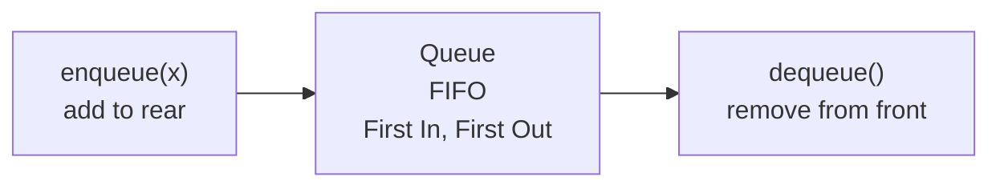

# Queue in Python

> Author: **Tamilselvan** · ✉️ tamilselvan.sde@gmail.com
> Section: 07 — Algorithms
> 🔗 Related: [stack.md](./stack.md) · [hash_map.md](./hash_map.md) · [graph.md](./graph.md) · [bfs.md](./bfs.md)
> Data: [list.md](../02_Data_Types/list.md) · [deque.md](../06_Collections/deque.md) · [heapq.md](../06_Collections/heapq.md)
> Back to [README](../README.md)

---

## 1. What is it?

A **queue** is a **FIFO** (first-in, first-out) data structure: the *first* item added is the *first* one removed. A checkout line at the supermarket — people are served in arrival order.

Python offers three idioms:

1. **`collections.deque`** with `append()` / `popleft()` — **the standard DSA queue**. O(1) enqueue and dequeue on both ends. Use this by default.
2. **`queue.Queue`** — thread-safe, blocking, supports `maxsize`. Adds locking overhead.
3. **`queue.PriorityQueue`** / **`heapq`** — a *priority* queue, ordered by priority, not arrival. O(log n) per op.
4. **`list`** with `append()` and `pop(0)`: **AVOID** — `pop(0)` is **O(n)** because every remaining element must shift left.

**What problem it solves:** Processing items in **arrival order**, BFS in [trees.md](./trees.md)/[graph.md](./graph.md), rate-limited windows, **sliding-window maximum** (with a monotonic deque), priority scheduling.

**Real-world analogy:** A take-a-number queue at the deli. The next customer served is the one who's been waiting longest.

---

## 2. Why do we use it?

- **O(1) enqueue and dequeue** (with deque).
- Models **fairness / scheduling**: BFS, thread pools, request queues.
- **Monotonic deque** answers "max in sliding window" / "next-closer element" in O(n) total — LeetCode 239.
- Underpins **BFS layer-by-layer traversal** — the most natural way to compute shortest paths on unweighted graphs.
- Easy pairing with **`defaultdict(list)`** to model graph neighbors — see [graph.md](./graph.md).

---

## 3. When should I choose it? — Decision Table

| Situation                                            | Best choice                              | Notes                                  |
|------------------------------------------------------|------------------------------------------|----------------------------------------|
| Process in arrival order                             | `deque` + `popleft`                      | -                                      |
| Breadth-first traversal                              | `deque` + `append`/`popleft`              | BFS, see graph.md                      |
| Sliding window max / min                             | **monotonic deque**                       | (239)                                  |
| "k most-recent events in last ms"                    | `deque` + lazy pops                       | (933)                                  |
| Items have priorities, not order                     | `heapq` or `PriorityQueue`                | Dijkstra, k-smallest                   |
| Concurrency / producer-consumer                       | `queue.Queue(maxsize=...)`                | thread-safe                            |
| Stack-like LIFO                                      | NOT a queue — see [stack.md](./stack.md)  | LIFO ≠ FIFO                            |
| Order not important                                  | plain set / list                          | -                                      |

---

## 4. Syntax

```python
from collections import deque

q = deque()
q.append(1)           # enqueue at right        O(1)
q.append(2)
q.appendleft(0)       # enqueue at left        O(1)
x = q.popleft()      # dequeue from left       O(1) returns 1
y = q.pop()          # pop from right          O(1) returns 2

q.extend([3, 4])     # bulk enqueue             O(k)
q.extendleft([9, 8]) # bulk enqueue-left (note: reversed during insert)

q.rotate(1)          # rotate right 1 step      O(k)
q.rotate(-1)         # rotate left 1 step       O(k)

deque([1,2,3], maxlen=2)   # bounded, auto-drops overhang from opposite end

len(q); q[0]; q[-1]; not q

# heapq-based priority queue
import heapq
pq = []
heapq.heappush(pq, (priority, item))
priority, item = heapq.heappop(pq)

# queue.Queue (thread-safe)
from queue import Queue
q = Queue(maxsize=10)
q.put(1); q.get(); q.qsize(); q.empty(); q.full()
```

> The pattern `q = deque([start]); visited = {start}` is the entire BFS kickoff.

---

## 5. Basic Example

### BFS over a tiny graph (LC 1971)

```python
from collections import deque, defaultdict

def has_path(n, edges, src, dst):
    g = defaultdict(list)
    for u, v in edges:
        g[u].append(v); g[v].append(u)
    seen = {src}
    q = deque([src])
    while q:
        u = q.popleft()
        if u == dst: return True
        for v in g[u]:
            if v not in seen:
                seen.add(v); q.append(v)
    return False

print(has_path(6, [[0,1],[0,2],[3,5],[5,4],[4,3]], 0, 5))
# False  (two disconnected components)
```

### Recent Counter (LC 933)

```python
from collections import deque
class RecentCounter:
    def __init__(self): self.q = deque()
    def ping(self, t):
        self.q.append(t)
        while self.q[0] < t - 3000:
            self.q.popleft()
        return len(self.q)
```

---

## 6. Step-by-Step Dry Run

### BFS on adjacency list `g = {0:[1,2], 1:[3,4], 2:[5], 3:[], 4:[], 5:[]}`

```
init: seen={0}, q=[0]

iter 1: pop 0   push 1, 2     q=[1,2]   seen={0,1,2}
iter 2: pop 1   push 3, 4     q=[2,3,4] seen={0,1,2,3,4}
iter 3: pop 2   push 5        q=[3,4,5] seen={0,1,2,3,4,5}
iter 4: pop 3   no neighbors  q=[4,5]
iter 5: pop 4   no neighbors  q=[5]
iter 6: pop 5   no neighbors  q=[]
BFS order: 0, 1, 2, 3, 4, 5     ← level by level (Layer 0; Layer 1; Layer 2)
```

### Monotonic deque — Sliding Window Maximum (LC 239)

`nums = [1,3,-1,-3,5,3,6,7]`, window `k=3`

```
i=0  1   deque=[0]                              deque values [1]
i=1  3 > 1 → pop 0  deque=[1]                   [3]
i=2 -1 < 3 → push 2  deque=[1,2]                [3,-1]
       window [0..2] → max nums[1]=3
i=3 -3 < -1 → push 3  deque=[1,2,3]             [3,-1,-3]
       window [1..3] → max nums[1]=3
i=4  5 > -3,-1,3 → pop all → deque=[4]          [5]
       window [2..4] → max nums[4]=5; trim deque[0]<i-k+1=2 → deque[0]=4 ok
i=5  3 < 5 → push 5  deque=[4,5]                [5,3]
       window [3..5] → max nums[4]=5
i=6  6 > 3,5 → pop 5,4 → deque=[6]              [6]
       window [4..6] → max nums[6]=6
i=7  7 > 6 → pop 6 → deque=[7]                  [7]
       window [5..7] → max nums[7]=7
result = [3,3,5,5,6,7]
```

---

## 7. Built-in Methods

### `collections.deque`

| Method              | Purpose                       | Syntax              | Example         | Complexity | Interview use                | Mistakes                                  | Shortcut                       |
|---------------------|-------------------------------|---------------------|-----------------|------------|------------------------------|-------------------------------------------|--------------------------------|
| `append(x)`         | enqueue at right              | `q.append(x)`       | `q.append(1)`   | O(1)       | BFS enqueue                  | confuse with `appendleft` for LIFO        | -                              |
| `appendleft(x)`     | enqueue at left               | `q.appendleft(x)`  | -               | O(1)       | stack on same structure       | -                                         | -                              |
| `popleft()`         | dequeue from left             | `q.popleft()`      | returns first   | O(1)       | BFS dequeue, FIFO            | *(this is the one that's O(n) on list!)* | use over `pop(0)`              |
| `pop()`             | pop from right                | `q.pop()`          | returns last    | O(1)       | stack on same structure       | -                                         | -                              |
| `extend(iterable)`  | bulk right enqueue             | -                   | -               | O(k)       | seed BFS with multiple roots   | -                                         | -                              |
| `rotate(k)`         | rotate right `k` (negative = left) | -              | -               | O(k)       | ring-buffer rotations         | sign direction confusion                   | `rotate(-k)` for left          |
| `maxlen=N`          | bounded deque                  | `deque([...], maxlen=N)` | -         | O(1)       | LRU / fixed-size window       | forgetting ⇒ unbounded growth              | auto-drop opposite side        |
| `q[0]`, `q[-1]`     | peek both ends                 | -                   | -               | O(1)       | peek without removing         | `q[i]` for middle is O(n) — avoid          | -                              |
| `clear()`           | empty the deque                | -                   | -               | O(n)       | reset state                  | -                                         | -                              |

### `queue.Queue` / `LifoQueue` / `PriorityQueue`

| Class          | Purpose                          | Notable methods         | Notes                       |
|----------------|----------------------------------|-------------------------|------------------------------|
| `Queue`         | FIFO thread-safe, blocking      | `put`, `get`, `qsize`   | `maxsize` for bounded        |
| `LifoQueue`     | stack thread-safe                | same                    | see [stack.md](./stack.md)   |
| `PriorityQueue` | priority ordering                | same                    | items must be comparable     |

### `heapq` (priority queue primitives)

```python
import heapq
heapq.heappush(pq, (priority, item))    # O(log n)
item = heapq.heappop(pq)                # O(log n)
heapq.heapify(list_in_place)            # O(n)
heapq.nsmallest(k, iterable)            # O(n log k)
heapq.nlargest(k, iterable)             # O(n log k)
```

Priority queues are *not* "queues" in the FIFO sense; see [heap.md](./heap.md).

---

## 8. Interview Example

### LC 239 — Sliding Window Maximum (Hard)

```python
from collections import deque

def maxSlidingWindow(nums, k):
    dq = deque()       # indices, monotonic decreasing by nums[idx]
    out = []
    for i, x in enumerate(nums):
        # shrink window
        if dq and dq[0] < i - k + 1:
            dq.popleft()
        # maintain decreasing
        while dq and nums[dq[-1]] <= x:
            dq.pop()
        dq.append(i)
        if i >= k - 1:
            out.append(nums[dq[0]])
    return out

print(maxSlidingWindow([1,3,-1,-3,5,3,6,7], 3))
# [3, 3, 5, 5, 6, 7]
```

### LC 622 — Design Circular Queue (Medium)

```python
class MyCircularQueue:
    def __init__(self, k):
        self.q = [0] * k
        self.cap = k
        self.size = 0
        self.head = 0
    def enQueue(self, v):
        if self.isFull(): return False
        tail = (self.head + self.size) % self.cap
        self.q[tail] = v; self.size += 1
        return True
    def deQueue(self):
        if self.isEmpty(): return False
        self.head = (self.head + 1) % self.cap
        self.size -= 1
        return True
    def Front(self):  return -1 if self.isEmpty() else self.q[self.head]
    def Rear(self):   return -1 if self.isEmpty() else self.q[(self.head + self.size - 1) % self.cap]
    def isEmpty(self): return self.size == 0
    def isFull(self):  return self.size == self.cap
```

---

## 9. When NOT to use

- **You need LIFO** — see [stack.md](./stack.md).
- **You need priority ordering** — use `heapq`/`PriorityQueue` ([heap.md](./heap.md)).
- **Random access** by index — `deque[i]` is **O(n) in the worst case**; use a `list`.
- **Small data + simple needs** — list `append` + `pop()` might suffice; no need to import.
- **Heavy insert/delete in the middle** — neither list nor deque is built for this; consider `sortedcontainers` or a linked structure ([linked_list.md](./linked_list.md)).

---

## 10. Common Mistakes

1. **`list.pop(0)` is O(n)** — never write this in production or interviews. Use `deque.popleft()`.
2. **`queue.Queue` for DSA** — adds thread locking; pair interviews flag this as overhead.
3. **Forgetting `extend` exists** — common to write `for x in src: q.append(x)` instead of `q.extend(src)`.
4. **Mixing deque ends** — pushing left while popping *also* left converts a queue back into a stack.
5. **In BFS, mutating graph/visited while iterating neighbors** — fine if guarded; build neighbor list upfront.
6. **Comparing `priority` tuples that contain unorderable items** — `PriorityQueue` will fail on `(2, {"a":1})`; use `(priority, counter, item)`.
7. **Off-by-one in circular queue** — `(head + size) % cap` vs. `(head + size - 1) % cap` for rear/front indexing is the #1 bug here.

---

## 11. Memory Tricks

- **"People in line"** model: enqueue = "join the line"; dequeue = "server takes the front person".
- **Slice mnemonic**: BFS uses **`q.popleft()`** ("pop from left = front first"); DFS uses **`stack.pop()`** ("pop from right = most-recent first").
- **Monotonic deque** = "store only the *promising* candidates". Pop while new element dominates them.
- For **sliding window max**: keep indices (not values) so you can detect *out-of-window* left side. Old values would lose context.
- **`maxlen=N`** deque = bounded queue (LRU core).

---

## 12. Interview Shortcuts

- BFS recip e: `deque([start])` + `visited = {start}` + `while q: u=popleft; for v in g[u]: ...`.
- **Two-pointer queue** vs **deque**: When asked to implement a queue *from scratch* using an array, use `(head, size)` modulo indexing — circular.
- **Sliding window**: "max/min over rolling window" → **always consider a monotonic deque**.
- **Delay lazy pops**: For "k-recent events" (LC 933) keep a deque and prune only on `ping`.
- **Rotation / deque trick**: `deque.rotate()` is a great one-liner for ring bit shifts or moving-window rotations.
- **Priority queue**: prefer `heapq` over `PriorityQueue` in contests — same complexity, less overhead.

---

## 13. Cheat Sheet Table

| Operation                          | deque          | Queue (thread-safe) | heapq            |
|------------------------------------|----------------|----------------------|------------------|
| enqueue (FIFO)                     | `append` O(1)  | `put` O(1)            | `heappush` O(log n) |
| dequeue (FIFO)                     | `popleft` O(1) | `get` O(1)            | `heappop` O(log n)  |
| enqueue at opposite end             | `appendleft` O(1) | n/a                | n/a              |
| pop right (stack)                  | `pop` O(1)     | `LifoQueue`           | n/a              |
| peek front                          | `q[0]` O(1)    | n/a (no peek API)     | `pq[0]` O(1)     |
| peek back                           | `q[-1]` O(1)   | n/a                   | n/a              |
| middle access                       | O(n)            | n/a                   | n/a              |
| median access                       | n/a             | n/a                   | n/a (two-heap trick — see heap.md) |
| thread-safe                         | ❌             | ✅                    | ❌               |
| bounded                             | `maxlen=N`     | `maxsize=N`           | n/a              |

---

## 14. Time Complexity Table

| Operation                | deque   | list (front op) | Queue | heapq        |
|--------------------------|---------|-----------------|-------|--------------|
| enqueue                  | O(1)    | O(1) amortized  | O(1)  | O(log n)     |
| dequeue (front)          | O(1)    | **O(n)** ⚠️     | O(1)  | O(log n)     |
| peek front               | O(1)    | O(1)            | n/a   | O(1)         |
| peek back                | O(1)    | O(1)            | n/a   | n/a          |
| middle insert/delete     | O(n)    | O(n)            | n/a   | n/a          |
| size                     | O(1)    | O(1)            | O(1)  | O(1)         |

**Space:** O(n) for n stored items. `deque` uses a linked array of blocks (~64 bytes per block at 64 items) — efficient growth without realloc.

---

## 15. Visual Diagram (ASCII + Mermaid)

### Enqueue / dequeue



```
            enqueue right (append)        dequeue from left (popleft)
            ◄─────────────                ◄────────────
            ╔═══╗      front (oldest)          rear (newest)
            ║ 1 ║ ◄──────[3,2,1]──►          [3,2,1]
            ║ 2 ║                              ▲  first-out
            ║ 3 ║
            ╚═══╝
```

### BFS flow

```
            ┌─────────────┐
            │   visited = { start }
            │   q = deque([start])
            └────┬────────┘
                 ▼
            while q not empty:
              ┌──────────────────────┐
              │ u = q.popleft()      │
              │ if u is target: exit │
              │ for v in g[u]:        │
              │   if v not in visited:│
              │     visit + q.append(v)│
              └────────┬─────────────┘
                       │ q empty → done
                       ▼
```

### Monotonic decreasing deque (window max)

```
   new x arrives
      │
      ▼
   ┌── while deque and nums[deque[-1]] <= x ──┐
   │     pop from right                        │
   └── append x's index                        │
      │
      ▼
   if deque[0] < i-k+1 → popleft (out of left side of window)
      │
      ▼
   front of deque = index of maximum in current window
```

---

## 16. Beginner Notes

> **Remember:**
> - Queue = FIFO. **First in, first out**. People-in-line.
> - **Use `collections.deque`** — fast both ends, no shifting.
> - `list.pop(0)` is **O(n)**, never write it.
> - For BFS, the formula is just `deque([start])` + `visited = {start}` + while-loop with `popleft`.
> - A **priority queue** is *not* a queue — it's order-by-priority; use `heapq`.
> - Use **deque `maxlen=N`** for a capped FIFO/LRU.
> - Sliding window max/min ⇒ **monotonic deque** (store promising indices).

---

## 17. FAANG Tips

- BFS = queue + `visited` set; never confuse `appendleft` and `append` mid-traversal.
- Sliding Window Maximum (239) is the canonical **monotonic deque** problem; practice until 5 minutes flat.
- Implementing a queue from two stacks (LC 232): amortized O(1) — only move when out-stack is empty.
- For "k-most recent in last N ms" — `deque` + lazy prune; classic monotonic use of `maxlen`-free windowing.
- Avoid priority-queue overflow in Dijkstra: store `(dist, node)` tuples; use `visited` set to skip stale entries.
- `collections.deque` works even when the elements aren't comparable — `PriorityQueue` doesn't. Choose accordingly.
- For LRU cache implemented with a deque + dict, prefer `OrderedDict.move_to_end` for cleanliness (LC 146).
- Mentioning "FIFO fairness / arrival-order scheduling" in an interview shows systems thinking.

---

## 18. Practice Problems

### Easy
- **LC 232** — Implement Queue using Stacks
- **LC 225** — Implement Stack using Queues
- **LC 933** — Number of Recent Calls

### Medium
- **LC 622** — Design Circular Queue
- **LC 346** — Moving Average from Data Stream
- **LC 200** — Number of Islands (BFS version — see [graph.md](./graph.md))

### Hard
- **LC 239** — Sliding Window Maximum
- **LC 862** — Shortest Subarray with Sum at Least K (monotonic deque)
- **LC 1499** — Max Value of Equation (monotonic deque)