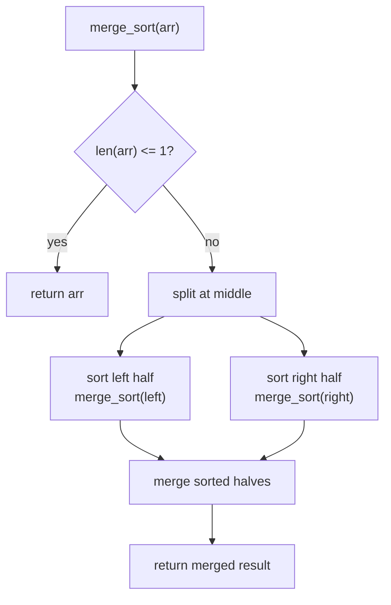

# Sorting Algorithms in Python

> Author: **Tamilselvan** · ✉️ tamilselvan.sde@gmail.com · 🔗 [LinkedIn](https://www.linkedin.com/in/tamilselvan-ai/)
> Section: 07 — Algorithms
> 🔗 Related: [searching.md](./searching.md) · [binary_search.md](./binary_search.md) · [recursion.md](./recursion.md) · [two_pointers.md](./two_pointers.md)
> Data: [list.md](../02_Data_Types/list.md) · [heapq.md](../06_Collections/heapq.md) · [big_o.md](../08_Time_Complexity/big_o.md)
> Back to [README](../README.md)

---

## 1. What is it?

**Sorting** rearranges a sequence into **non-decreasing (or non-increasing) order** according to a comparison rule. Given `a = [3,1,4,1,5,9]`, the ascending sorted version is `[1,1,3,4,5,9]`.

Python gives you **two built-in sort entry points**:

| Entry point            | Works on        | Returns         | Mutates original? |
|------------------------|-----------------|-----------------|-------------------|
| `sorted(iterable)`     | any iterable    | a new `list`    | No                |
| `list.sort(key=, reverse=)` | a `list`    | `None`          | Yes (in-place)    |

Both are backed by **Timsort** — a hybrid of **Merge Sort** and **Insertion Sort**, designed by Tim Peters in 2002. It is **stable**, **adaptive**, and runs in **O(n log n)** worst case / **O(n)** best case (already-sorted input) with **O(n)** auxiliary space.

Educational algorithms to know:
- **Bubble sort** — adjacent swaps, simple, O(n²)
- **Selection sort** — pick minimum each pass, O(n²)
- **Insertion sort** — grow a sorted prefix, O(n²) / O(n) best
- **Merge sort** — divide & conquer, O(n log n), stable
- **Quick sort** — partition around a pivot, O(n log n) avg / O(n²) worst

**What problem it solves:** turn an unordered collection into an ordered one, so downstream operations (search, dedup, two-sum, merge intervals) become cheap or even possible.

---

## 2. Why do we use it?

- **Enables binary search** — log-time searching requires sorted input.
- **Enables two-pointer techniques** (sorted two-sum, 3-sum, container-with-most-water).
- **Grouping / dedup** — duplicates become adjacent.
- **Ranking** — top-k, leaderboard, "k closest", scheduling by start time.
- **Canonical form** — perfect for hashing anagrams, equivalence of multisets.
- **Many hard problems become easy on sorted data**: "merge intervals", "next permutation", "kth largest".

Sorting is rarely the final answer in an interview — it is a **preprocessing step** that unlocks an O(n) or O(log n) algorithm.

---

## 3. When should I choose it? — Decision Table

| Situation                                            | Best choice                       | Why                                |
|------------------------------------------------------|-----------------------------------|------------------------------------|
| Just need a sorted list, don't need original          | `sorted(x)`                       | Cleaner, works on any iterable     |
| Want to mutate a list in place                       | `x.sort()`                        | No extra list object, faster       |
| Sort by a custom key (length, abs, second column)    | `key=lambda` / `itemgetter`       | Stable, O(n log n)                 |
| Need 3+ criteria, complex comparator                  | `functools.cmp_to_key(cmp)`       | Old-style comparator support       |
| Top-k from a stream                                  | `heapq.nlargest/nsmallest`        | O(n log k), no full sort           |
| Need only k smallest out of n                         | `heapq.nsmallest(k, a)`           | O(n log k) vs O(n log n) full sort |
| Stable sort required (keep insertion order of ties)   | `sorted` / Timsort (stable)       | Python's sort is always stable      |
| Streaming / external sort (data > memory)             | merge sort chunks                 | Sequential I/O friendly             |
| Small / nearly sorted arrays (≤ ~50)                 | insertion sort                    | O(n) on nearly sorted               |
| Educational / "implement sort" asked                  | merge or quick sort               | O(n log n) classic                  |
| Need elements sorted while pushing                    | `heapq.heappush/heappop`          | Concurrent sorted access            |

See also: [binary_search.md](./binary_search.md) for why sorting is a prerequisite.

---

## 4. Syntax

```python
# Built-in — recommended for ALL interviews
sorted(iterable, *, key=None, reverse=False)   # returns new list
list.sort(*, key=None, reverse=False)          # in-place, returns None

# key is a one-argument function returning a comparison value
sorted([3,-1,2], key=abs)           # [1, 2, 3]
sorted(['abc','bb','a'], key=len)   # ['a','bb','abc']

# reverse=True -> descending
sorted([1,2,3], reverse=True)       # [3, 2, 1]

# tuple key -> lexicographic tie-break
sorted(items, key=lambda x: (x.priority, -x.time))

# comparator (legacy) — needs cmp_to_key
from functools import cmp_to_key
sorted([3, 1, 2], key=cmp_to_key(lambda a, b: b - a))   # [3, 2, 1])
```

---

## 5. Basic Example

### Using built-ins

```python
nums = [3, 1, 4, 1, 5, 9, 2, 6]
print(sorted(nums))                          # [1, 1, 2, 3, 4, 5, 6, 9]
print(sorted(nums, reverse=True))            # [9, 6, 5, 4, 3, 2, 1, 1]
print(sorted(nums, key=lambda x: -x))        # [9, 6, 5, 4, 3, 2, 1, 1]

# sort by second element of each tuple
pairs = [(1, 3), (2, 2), (4, 1)]
print(sorted(pairs, key=lambda p: p[1]))      # [(4, 1), (2, 2), (1, 3)]

# in-place (returns None!)
nums.sort()
print(nums)                                  # [1, 1, 2, 3, 4, 5, 6, 9]

# multi-key
people = [("A", 25), ("B", 25), ("C", 30)]
print(sorted(people, key=lambda p: (p[1], p[0])))  # age asc then name asc
```

### Educational implementations (don't use in production)

```python
def bubble_sort(a):
    n = len(a)
    for i in range(n):
        swapped = False
        for j in range(n - i - 1):
            if a[j] > a[j + 1]:
                a[j], a[j + 1] = a[j + 1], a[j]
                swapped = True
        if not swapped:        # early exit on already sorted pass
            break
    return a

def selection_sort(a):
    n = len(a)
    for i in range(n):
        mn = i
        for j in range(i + 1, n):
            if a[j] < a[mn]:
                mn = j
        a[i], a[mn] = a[mn], a[i]
    return a

def insertion_sort(a):
    for i in range(1, len(a)):
        key, j = a[i], i - 1
        while j >= 0 and a[j] > key:
            a[j + 1] = a[j]
            j -= 1
        a[j + 1] = key
    return a

def merge_sort(a):
    if len(a) <= 1:
        return a
    mid = len(a) // 2
    L = merge_sort(a[:mid])
    R = merge_sort(a[mid:])
    out, i, j = [], 0, 0
    while i < len(L) and j < len(R):
        if L[i] <= R[j]:
            out.append(L[i]); i += 1
        else:
            out.append(R[j]); j += 1
    out.extend(L[i:]); out.extend(R[j:])
    return out

def quick_sort(a):
    if len(a) <= 1:
        return a
    pivot = a[len(a) // 2]
    lo = [x for x in a if x < pivot]
    eq = [x for x in a if x == pivot]
    hi = [x for x in a if x > pivot]
    return quick_sort(lo) + eq + quick_sort(hi)

print(bubble_sort([3, 1, 4, 1, 5]))   # [1, 1, 3, 4, 5]
print(merge_sort([3, 1, 4, 1, 5]))    # [1, 1, 3, 4, 5]
print(quick_sort([3, 1, 4, 1, 5]))    # [1, 1, 3, 4, 5]
```

---

## 6. Step-by-Step Dry Run

### Insertion sort on `[3, 1, 4, 1, 5]`

```
Pass 1: insert 1 into [3]        -> [1, 3, 4, 1, 5]   (1 < 3, shift)
Pass 2: insert 4 into [1, 3]     -> [1, 3, 4, 1, 5]   (4 > 3, stay)
Pass 3: insert 1 into [1, 3, 4]  -> [1, 1, 3, 4, 5]   (1 < 4 < 3, shift twice)
Pass 4: insert 5 into [1,1,3,4]  -> [1, 1, 3, 4, 5]   (5 is largest, stay)
```

ASCII flow:

```
 [3, 1, 4, 1, 5]
 i=1 key=1   j=0 a[0]=3>1  shift -> [3,3,4,1,5]  insert 1 -> [1,3,4,1,5]
 i=2 key=4   j=1 a[1]=3<4  stay  -> [1,3,4,1,5]
 i=3 key=1   j=2 a[2]=4>1 shift  -> [1,3,4,4,5]
                j=1 a[1]=3>1 shift -> [1,3,3,4,5]
                j=0 a[0]=1 not >   insert 1 -> [1,1,3,4,5]
 i=4 key=5   j=3 a[3]=4<5 stay  -> [1,1,3,4,5]
 done.
```

### Merge sort recursion tree on `[3, 1, 4, 1, 5]`

```
                  [3,1,4,1,5]
                 /            \
          [3,1]               [4,1,5]
          /   \              /      \
        [3]   [1]        [4]       [1,5]
        \    /            \        /   \
       [1,3]              [4]   [1]  [5]
                          \        \ /
                       [1,4,5]    [1,5]
                              \  /
                          [1,1,3,4,5]
```

---

## 7. Built-in Methods

### 7.1 `sorted(iterable, *, key=None, reverse=False)`
- **Purpose**: produce a new sorted list from any iterable.
- **Syntax**: `sorted(x, key=lambda e: ..., reverse=True/False)`
- **Example**: `sorted("cab")` -> `['a','b','c']`; `sorted([(1,2),(1,1)], key=lambda t: t[1])` -> `[(1,1),(1,2)]`.
- **Complexity**: O(n log n) time, O(n) space (Timsort, stable).
- **Interview use**: universal — any "sort then…" problem.
- **Mistakes**: assigning `list.sort()` result (`None`); using `reverse=True` *and* negating the key (double reversal).
- **Shortcut**: `sorted(x, reverse=True)` ≡ `sorted(x, key=lambda e: -e)` only for numeric keys, not strings.

### 7.2 `list.sort(*, key=None, reverse=False)`
- **Purpose**: in-place sort of a list; returns `None`.
- **Syntax**: `a.sort(key=..., reverse=...)`
- **Example**: `a=[3,1,2]; a.sort()` -> `a` becomes `[1,2,3]`.
- **Complexity**: O(n log n) time, O(n) temp (stable).
- **Interview use**: when you don't need the original order.
- **Mistakes**: `b = a.sort()` leaves `b = None`. Use `b = sorted(a)`.
- **Shortcut**: declare `nums.sort()` then `nums[i]` works — no copy.

### 7.3 `key` parameter (function)
- **Purpose**: map each element to a comparable scalar; sort uses that scalar.
- **Example**: `key=len` for strings, `key=itemgetter(1)` for tuples, `key=lambda d: d.age`.
- **Complexity**: called once per element and cached.
- **Mistakes**: defining `key=lambda x: x > 0` (a bool) when you wanted absolute value.
- **Shortcut**: use `operator.itemgetter/attrgetter` for speed and clarity.

### 7.4 `operator.itemgetter / attrgetter`
```python
from operator import itemgetter, attrgetter
sorted(rows, key=itemgetter(2, 0))      # tuple of column indices
sorted(objs,  key=attrgetter('age'))   # attribute access
```
- Faster than a lambda because it's implemented in C.
- Returns a callable that fetches the indexed/attribute value.

### 7.5 `functools.cmp_to_key(cmp)`
- **Purpose**: convert an old-style 3-way comparator (`cmp(a,b) -> -1/0/1`) into a `key` function.
- **Example**: `cmp_to_key(lambda a, b: -1 if a < b else (1 if a > b else 0))`.
- **Interview use**: **179 Largest Number** — custom ordering where each candidate is concatenation-dependent.
- **Mistakes**: forgetting it returns -1 / 0 / 1, not a boolean.
- **Shortcut**: prefer `key=` whenever possible — comparators are slower and error-prone.

### 7.6 `heapq` functions (related)
- `heapq.heapify(x)` — O(n) in-place min-heap.
- `heapq.heappush(h, v)` — O(log n).
- `heapq.heappop(h)` — O(log n), returns smallest.
- `heapq.nlargest(k, it, key=...)` / `heapq.nsmallest(k, it, key=...)` — O(n log k).
- See [heapq.md](../06_Collections/heapq.md).

### 7.7 Stability of Timsort
- Equal elements retain their **original relative order**.
- Stability matters when you do a second pass sort: `people.sort(key=lambda p: p.age); people.sort(key=lambda p: p.name)` produces a list sorted by name, ties by age — only because sort is stable.

---

## 8. Interview Example

### LeetCode 56 — Merge Intervals

```python
def merge(intervals):
    intervals.sort(key=lambda x: x[0])   # sort by start
    merged = []
    for s, e in intervals:
        if merged and s <= merged[-1][1]:
            merged[-1][1] = max(merged[-1][1], e)
        else:
            merged.append([s, e])
    return merged
```

Dry run `[[1,3],[2,6],[8,10],[15,18]]`:

```
sort                               -> [[1,3],[2,6],[8,10],[15,18]]
[1,3]  merged=[]      -> append    -> [[1,3]]
[2,6]  2<=3 overlap   -> extend    -> [[1,6]]
[8,10] 8>6 no overlap -> append    -> [[1,6],[8,10]]
[15,18] -> append                  -> [[1,6],[8,10],[15,18]]
```

### LeetCode 179 — Largest Number (uses `cmp_to_key`)

```python
from functools import cmp_to_key
def largestNumber(nums):
    strs = list(map(str, nums))
    strs.sort(key=cmp_to_key(lambda a, b: -1 if a+b > b+a else 1))
    res = "".join(strs).lstrip("0")
    return res or "0"
```

---

## 9. When NOT to use

- **Already sorted?** Don't sort again — wastes O(n log n); use a check `all(a[i] <= a[i+1])`.
- **Looking for a single min/max**: use `min()`, `max()`, or a heap. Sorting is overkill.
- **Top-k where k << n**: `heapq.nlargest(k, x)` is O(n log k) vs O(n log n).
- **Need original indices**: sorting destroys them; either track via `enumerate` + `key=lambda t: t[1]` or use a stable approach.
- **Custom object equality matters**: sorting by `key=lambda o: o.id` can reorder ties you wanted to preserve — be explicit.
- **In-place sort of an immutable collection**: tuples, strings, sets — use `sorted()` and reassign.

---

## 10. Common Mistakes

1. **`b = a.sort()`** — `b` becomes `None`. Use `b = sorted(a)`.
2. **Negating string key**: `key=lambda s: -s` only works on numbers. For strings you need `reverse=True` or a wrapper.
3. **Forgetting stability**: assuming "tie order = original order" — Python guarantees it, but only if you don't pass an unstable key.
4. **Comparing different types**: `sorted([1, '2'])` raises `TypeError`. Normalize first.
5. **`reverse=True` + negated key**: `sorted(a, key=lambda x: -x, reverse=True)` is the same as `sorted(a)` — double negation.
6. **Off-by-one in bubble sort**: inner loop `range(n-1)` with `j+1` causes index error; use `range(n - i - 1)`.
7. **Quick sort worst case**: always picking first element on sorted input → O(n²). Use random or median-of-three pivot.
8. **`key` returns a tuple but you wanted descending on one field**: use `-x` for numbers or wrap in a class.
9. **Modifying list while sorting**: never mutate `key` callable side effects.
10. **Using `cmp` argument** (removed in Python 3): must wrap with `cmp_to_key`.

---

## 11. Memory Tricks

- 🔑 **Timsort = Tim's sort = Timsort** (Tim Peters). Stable + adaptive.
- 🔑 **Stable** = ties keep their order. "St-e-able" → "St" stays.
- 🔑 **Bubble**: biggest "bubbles up" each pass — adjacent swaps.
- 🔑 **Selection**: select the **minimum**, put at front, repeat. "Select-small-place-front".
- 🔑 **Insertion**: like sorting a **hand of cards**: insert next card into the right slot.
- 🔑 **Merge**: divide in half, sort halves, merge — slow but stable + parallel.
- 🔑 **Quick**: pick pivot, partition smaller-left/big-right, recurse. Fastest average.
- 🔑 **`key` vs `cmp`**: "key transforms *what to compare*, cmp decides *how to compare*."
- 🔑 **`reverse=True`** ⇔ **descending** mnemonic: "Real = High".

---

## 12. Interview Shortcuts

- `sorted(a, key=len)` for strings; `key=lambda p: p[1]` for points.
- For top-k: `heapq.nlargest(k, a)` (returns sorted desc) / `nsmallest(k, a)`.
- Sort tuples lexicographically: pass a tuple key `key=lambda x: (x.a, -x.b)`.
- "Sort then two-pointer" is a meta-pattern — see [two_pointers.md](./two_pointers.md).
- "Custom order via sort": build the key as a tuple of (primary, secondary) — Python sorts tuples left-to-right.
- Need a comparator on concatenation (like 179): wrap with `cmp_to_key`.
- Sort descending in place: `a.sort(reverse=True)`.

---

## 13. Cheat Sheet Table

| Operation                          | Code                                  | Time       | Space     |
|------------------------------------|---------------------------------------|------------|-----------|
| New sorted list                    | `sorted(x)`                           | O(n log n) | O(n)      |
| In-place sort                      | `a.sort()`                            | O(n log n) | O(n) temp |
| Sort by key                        | `sorted(x, key=f)`                    | O(n log n) | O(n)      |
| Descending                         | `sorted(x, reverse=True)`             | O(n log n) | O(n)      |
| Stable                             | always (Timsort)                      | —          | —         |
| Linear search for min              | `min(x)`                              | O(n)       | O(1)      |
| Heapify                            | `heapq.heapify(a)`                    | O(n)       | O(1)      |
| Top-k                              | `heapq.nlargest(k, a)`                | O(n log k) | O(k)      |
| Educational — bubble/selection/ins | (see above)                           | O(n²)      | O(1)      |
| Educational — merge                | (see above)                           | O(n log n) | O(n)      |
| Educational — quick                | (see above)                           | O(n log n) avg | O(log n) |

---

## 14. Time Complexity Table

| Algorithm         | Best        | Average        | Worst        | Space      | Stable | Adaptive | In-place |
|-------------------|-------------|----------------|--------------|------------|--------|----------|----------|
| Python `sorted`/`sort` (Timsort) | O(n) | O(n log n) | O(n log n) | O(n)       | Yes    | Yes      | sort in place |
| Bubble            | O(n)        | O(n²)          | O(n²)        | O(1)       | Yes    | Yes      | Yes      |
| Selection         | O(n²)       | O(n²)          | O(n²)        | O(1)       | No     | No       | Yes      |
| Insertion         | O(n)        | O(n²)          | O(n²)        | O(1)       | Yes    | Yes      | Yes      |
| Merge             | O(n log n)  | O(n log n)     | O(n log n)  | O(n)       | Yes    | No       | No       |
| Quick             | O(n log n)  | O(n log n)     | O(n²)        | O(log n)   | No     | No       | Yes      |
| Heap              | O(n log n)  | O(n log n)     | O(n log n)  | O(1)       | No     | No       | Yes      |

Auxiliary: stable sorts (merge, Timsort) need O(n) extra; in-place sorts use O(1) extra.

---

## 15. Visual Diagram (ASCII + Mermaid)



### Unsorted → sorted

```
    Before:   [ 5, 2, 9, 1, 5, 6 ]
                \  \  \  \  \  \
                 \  \  \  \  \  \____
                  \  \  \  \  \____    \
                   \  \  \  \_____ \    \
                    \  \  \____  \ \    \
                     \  \_____  \ \ \    \
                      \______  \ \ \ \    \
                              \ \ \ \ \    \
    After:    [ 1, 2, 5, 5, 6, 9 ]
              sorted ascending
```

### Insertion sort visual (one element flowing to its slot)

```
  prefix=sorted | suffix=unsorted

  [1, 3, 4] | [2, 5]
        ^    move 2 left:
  while a[j] > 2: shift right
  [1, 3, 4] -> [1, 3, 3, 4] -> [1, 2, 3, 4]
```

### Merge sort flowchart

```
                start
                  |
            len <= 1 ?  --yes--> return a
                  | no
            split at mid
                  |
       sort L = merge_sort(left)
                  |
       sort R = merge_sort(right)
                  |
       merge L and R -> out
                  |
                return out
```

---

## 16. Beginner Notes — Remember block

```
Remember:
- Use sorted(x) for a NEW list.   Use x.sort() to MUTATE.
- stable sort keeps ties in original order.
- key=function, NOT comparator; comparator needs cmp_to_key.
- Bubble/Selection/Insertion are educational, O(n^2) — never use in production.
- Merge sort: O(n log n), stable, O(n) extra space.
- Quick sort: O(n log n) avg, O(n^2) worst, in-place.
- When a problem says "sorted", think binary_search + two_pointers.
- Top-k via heapq.nlargest/nsmallest instead of full sort when k << n.
```

---

## 17. FAANG Tips

1. **Always sort first when the problem mentions "in sorted order" or "non-decreasing"** — but be wary if they want original indices.
2. For **Merge Intervals / Meeting Rooms**, sort by start time, then sweep.
3. For **custom key with tie-break**, use tuple key: `key=lambda x: (x.priority, -x.timestamp)`.
4. **Stability** is a hidden requirement — if second sort must not break first, rely on Timsort's stability.
5. **Why Timsort in interviews?** "Python's sort is stable and O(n log n)" is the only statement you need; interviewers rarely ask for Timsort internals.
6. **Two-dimensional sort**: `sorted(points, key=lambda p: (p[0], p[1]))` for "sort by x then y".
7. For **Largest Number (179)**: build strings, sort with `cmp_to_key(lambda a, b: -1 if a+b > b+a else 1)`.
8. When asked "sort an array of 0/1/2" — **75 Sort Colors**: this is a two-pointer/Dutch-flag, NOT a sort problem (see [two_pointers.md](./two_pointers.md)).
9. **Don't `sorted(set(...))` if duplicates must be kept** — set dedupes.
10. **Profile if data is huge**: avoid `sorted()` on 10⁹ elements; consider external merge sort or `heapq.nsmallest`.

---

## 18. Practice Problems

| Difficulty | Problem                                                                  | Hint                                              |
|-----------|--------------------------------------------------------------------------|---------------------------------------------------|
| Easy      | [912 Sort an Array](https://leetcode.com/problems/sort-an-array/)        | Implement merge or quick sort                     |
| Easy      | [252 Meeting Rooms](https://leetcode.com/problems/meeting-rooms/)         | Sort by start, check consecutive overlap          |
| Easy      | [88 Merge Sorted Array](https://leetcode.com/problems/merge-sorted-array/)| Two pointers from the back                        |
| Medium    | [56 Merge Intervals](https://leetcode.com/problems/merge-intervals/)     | Sort by start, merge overlapping                  |
| Medium    | [179 Largest Number](https://leetcode.com/problems/largest-number/)      | `cmp_to_key` with `a+b vs b+a`                    |
| Medium    | [215 Kth Largest Element](https://leetcode.com/problems/kth-largest-element-in-an-array/) | `heapq.nlargest` or quick-select         |
| Medium    | [973 K Closest Points](https://leetcode.com/problems/k-closest-points-to-origin/) | `key=lambda p: p[0]**2 + p[1]**2`, nsmallest |
| Hard      | [315 Count of Smaller Numbers After Self](https://leetcode.com/problems/count-of-smaller-numbers-after-self/) | Merge sort indexed counting           |

---

**Cross-links**: [searching.md](./searching.md) · [binary_search.md](./binary_search.md) · [recursion.md](./recursion.md) · [two_pointers.md](./two_pointers.md) · [prefix_sum.md](./prefix_sum.md) · [sliding_window.md](./sliding_window.md)