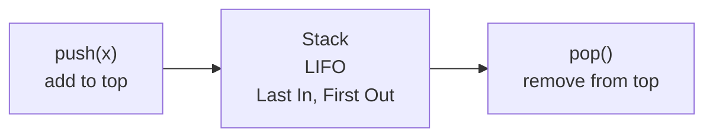

# Stack in Python

> Author: **Tamilselvan** · ✉️ tamilselvan.sde@gmail.com · 🔗 [LinkedIn](https://www.linkedin.com/in/tamilselvan-ai/)
> Section: 07 — Algorithms
> 🔗 Related: [queue.md](./queue.md) · [hash_map.md](./hash_map.md) · [linked_list.md](./linked_list.md) · [recursion.md](./recursion.md)
> Data: [list.md](../02_Data_Types/list.md) · [deque.md](../06_Collections/deque.md)
> Back to [README](../README.md)

---

## 1. What is it?

A **stack** is a **LIFO** (last-in, first-out) data structure: the **most recently pushed item** is the first one to come off. Picture a stack of plates — you add and remove from the top.

Python gives you three natural stack implementations:
1. **`list`** with `append(x)` / `pop()` — most common, amortized O(1).
2. **`collections.deque`** with `append` / `pop` — guaranteed O(1) (doubly linked block array).
3. **`queue.LifoQueue`** thread-safe stack with blocking semantics — overkill for DSA unless concurrency matters.

**What problem it solves:** Anything involving **reversal**, **bracket/parenthesis matching**, **call frames (recursion)**, **monotonic next-greater queries**, **expression evaluation**, **DFS state**.

**Real-world analogy:** A pile of plates in a cafeteria. A stack of "Undo" actions in your editor — the last action done is the first to be undone. The browser **Back** button.

---

## 2. Why do we use it?

- O(1) **push** and **pop**.
- Models **last-required-first-released** perfectly: function call stack, undo history, expression parsing.
- Foundation for **DFS** in trees and graphs — the recursion stack *is* a stack.
- **Monotonic stack** solves "next greater / smaller element" in **O(n)** instead of O(n²).
- Trivial to implement; `list` works out of the box (no imports).

---

## 3. When should I choose it? — Decision Table

| Situation                                            | Best choice                          | Notes                                  |
|------------------------------------------------------|--------------------------------------|----------------------------------------|
| Bracket matching / expression eval                    | `list` stack                          | (20)                                   |
| Undo / back tracking                                  | `deque` or `list`                     | thread-safe → `LifoQueue`              |
| Next greater / smaller element                        | **monotonic stack**                   | (496, 739, 84)                         |
| Iterative DFS on tree / graph                         | `list` as explicit stack              | see [trees.md](./trees.md)             |
| Min/max in current stack                              | **aux stack** of running min         | (155)                                  |
| Implement queue with two stacks                       | two `list`s, amortized O(1) pop       | (232)                                  |
| Reverse order naturally                                | `list[::-1]` if shallow; stack otherwise | -                                  |
| Continuous front data                                 | NOT a stack — use [queue.md](./queue.md) | FIFO ≠ LIFO                        |

---

## 4. Syntax

```python
# list-as-stack (most idiomatic)
s = []
s.append(1)          # push   O(1)
s.append(2)
x = s.pop()          # pop    O(1) returns 2
top = s[-1]          # peek   O(1)
len(s)               # size   O(1)
not s                # empty? O(1)

# deque-as-stack (guaranteed O(1), safe for very large stacks)
from collections import deque
s = deque()
s.append(1); s.pop(); s[-1]

# queue.LifoQueue (thread-safe)
from queue import LifoQueue
q = LifoQueue()
q.put(1); q.get(); q.qsize(); q.empty()

# building a list comprehension is also "pushing"
s = [c for c in "abc"]      # s = ['a','b','c']
```

> **`list.pop(0)` is O(n)** — that's a queue operation masquerading as a stack op. Don't do it. Use deque for queue work — see [queue.md](./queue.md).

---

## 5. Basic Example

### Valid Parentheses (LC 20)

```python
def isValid(s: str) -> bool:
    pair = {')': '(', ']': '[', '}': '{'}
    stack = []
    for ch in s:
        if ch in "([{":
            stack.append(ch)
        elif not stack or stack.pop() != pair[ch]:
            return False
    return not stack

print(isValid("()[]{}"))        # True
print(isValid("([)]"))          # False
```

**Output:** `True` `False`

---

## 6. Step-by-Step Dry Run

**`isValid("([{}])")`**

```
ch='('  push           stack=['(']
ch='['  push           stack=['(','[']
ch='{'  push           stack=['(','[','{']
ch='}'  pop '{' == '{' stack=['(','[']
ch=']'  pop '[' == '[' stack=['(']
ch=')'  pop '(' == '(' stack=[]
end     stack empty -> True
```

**Monotonic decreasing stack — LC 739 Daily Temperatures**
`temps = [73,74,75,71,69,72,76,73]`

```
i=0 73 stack=[]      stack=[0]
i=1 74 > temps[0]=73 → res[0]=1-0=1    stack=[1]
i=2 75 > temps[1]=74 → res[1]=2-1=1    stack=[2]
i=3 71 < 75            stack=[2,3]
i=4 69 < 71            stack=[2,3,4]
i=5 72 > 69 → res[4]=5-4=1; > 71 → res[3]=5-3=2   stack=[2,5]
i=6 76 > 72 → res[5]=6-5=1; > 75 → res[2]=6-2=4   stack=[6]
i=7 73 < 76            stack=[6,7]
end  pop remaining (no later warmer) → res stays 0 for them
res = [1,1,4,2,1,1,0,0]
```

---

## 7. Built-in Methods

### `list`-as-stack (most idiomatic)

| Method            | Purpose                | Syntax        | Example       | Complexity       | Interview use            | Mistakes                              | Shortcut                |
|-------------------|------------------------|---------------|---------------|------------------|--------------------------|---------------------------------------|-------------------------|
| `append(x)`       | push                   | `s.append(x)` | `s.append(1)` | O(1) amortized   | everywhere               | confusing with `+=` (list extend)      | -                       |
| `pop()`           | pop last               | `s.pop()`     | -             | O(1) amortized   | undo / backtrack / DFS   | `pop()` on empty → IndexError           | guard with `if s:`      |
| `s[-1]`           | peek top               | `s[-1]`       | -             | O(1)             | look-ahead decisions     | same error if empty                    | -                       |
| `len(s)`          | size                   | `len(s)`      | -             | O(1)             | loops / capacity        | -                                      | -                       |
| `not s`           | empty test              | `if not s:`   | -             | O(1)             | loop guards             | `if len(s)==0` more verbose             | -                       |
| `list(ntype([...]))` | bulk build          | `list(...)`   | -             | O(n)             | initial state           | -                                      | `s=[...]`               |

### `collections.deque` differences

| Method              | Purpose              | Notes                                  |
|---------------------|----------------------|----------------------------------------|
| `append`, `pop`     | right side (LIFO)    | **guaranteed** O(1), no realloc amortization |
| `appendleft`, `popleft` | left side (queue ops) | makes deque a 2-ended queue         |
| `extend` / `extendleft` | bulk add          | -                                      |
| `rotate(k)`         | rotate right/left    | -                                      |
| `maxlen=N`          | bounded deque         | auto-drops from opposite end           |

### `queue.LifoQueue`

| Method        | Purpose           | Notes                            |
|---------------|-------------------|----------------------------------|
| `put(x)`      | push (blocks if full) | supports maxsize              |
| `get()`       | pop (blocks if empty)  | thread-safe                   |
| `qsize()`     | approx size       | race-safe only for size hints    |

> Avoid `LifoQueue` in DSA unless explicitly asked — adds overhead, no `peek`.

---

## 8. Interview Example

### LC 155 — Min Stack (Medium)

Use an **auxiliary stack** that mirrors the minimum for the prefix of states.

```python
class MinStack:
    def __init__(self):
        self.s = []
        self.m = []          # parallel min stack
    def push(self, x):
        self.s.append(x)
        self.m.append(x if not self.m else min(x, self.m[-1]))
    def pop(self):
        self.s.pop(); self.m.pop()
    def top(self):    return self.s[-1]
    def getMin(self): return self.m[-1]

ms = MinStack()
ms.push(-2); ms.push(0); ms.push(-3)
print(ms.getMin())   # -3
ms.pop()
print(ms.top())      # 0
print(ms.getMin())   # -2
```

### LC 496 — Next Greater Element I (Medium)

```python
def nextGreaterElement(nums1, nums2):
    nxt = {}
    stack = []
    for x in nums2:                       # decreasing stack
        while stack and stack[-1] < x:
            nxt[stack.pop()] = x
        stack.append(x)
    return [nxt.get(x, -1) for x in nums1]

print(nextGreaterElement([4,1,2], [1,3,4,2]))   # [-1, 3, -1]
```

---

## 9. When NOT to use

- **FIFO needed** (first in first out): use [queue.md](./queue.md) — `deque` with `popleft()`. `list.pop(0)` is O(n) and a classic mistake.
- **Random access** required — a stack gives you only the top; use a list / array directly.
- **Order matters and last isn't most important** — e.g., scheduling tasks in submission order.
- **Search by value** required — O(n) scan needed; use a dict for O(1).
- **Heavy middle insertions/deletions** — front operations are wrong fit.

---

## 10. Common Mistakes

1. **`list.pop(0)`** on a list-as-stack — that's a *queue* op and is O(n). Use `collections.deque.popleft()`.
2. **Empty pop**: `stack.pop()` on `[]` → `IndexError`. Always `if stack:` before `pop` or use `try/except`.
3. **Confusing `peek` (`[-1]`) with `pop`**: peek = read-no-remove; pop = read-and-remove.
4. **Modifying iteration stack mid-traversal** in iterative DFS: forgetting to push children in reverse order.
5. **Monotonic stack wrong direction**: use **decreasing** stack to find **next greater**, **increasing** stack to find **next smaller**.
6. **Min-stack without aux stack**: scanning the stack on every `getMin` is O(n) — fail the LC 155 follow-up constraints.
7. **`appendleft`/`popleft` mixing** on a deque-based stack — pick one end and stick with it.

---

## 11. Memory Tricks

- **Plate pile** = LIFO stack. **Ticket queue** = FIFO queue.
- **"Burger top"** rule — the topmost (most recent) ingredient comes off first.
- Recursion *is* a stack: each recursive call pushes a frame; `return` pops it.
- **Monotonic stack mnemonic**: "Build a skyline from the left; pop everyone shorter than the current." Looking **right** for the **next greater**? Walk **left-to-right**, **decreasing** stack.
- **Aux stack mirror**: keep a parallel stack that records the answer to a queryable state at every push depth.

---

## 12. Interview Shortcuts

- Parentheses/brackets/tags → **stack**.
- "Next greater / smaller / warmer" → **monotonic stack**, single left-to-right pass.
- "Max of all sub-arrays of size k" → deque-based monotonic stack ([queue.md](./queue.md)).
- Implementing DFS iteratively (avoid recursion depth issues) → **explicit stack** of (node, state) tuples.
- **Two-stack queue** (LC 232): amortized O(1) pop by moving elements only when out-stack is empty.
- **One extra stack supports min** (LC 155): keep parallel min-stack.
- Stack-of-(i, sign): elegant **calculator** approach — push current result and sign on `(`, pop on `)`.

---

## 13. Cheat Sheet Table

| Operation                         | list stack        | deque stack       | LifoQueue       |
|-----------------------------------|-------------------|-------------------|-----------------|
| push                              | `append` O(1)     | `append` O(1)     | `put` O(1)      |
| pop                               | `pop()` O(1)      | `pop()` O(1)      | `get` O(1)      |
| peek                              | `s[-1]` O(1)      | `s[-1]` O(1)      | not supported   |
| size                              | `len(s)` O(1)     | `len(s)` O(1)     | `qsize()` ~O(1) |
| thread-safe                        | ❌               | ❌               | ✅             |
| amortized vs worst-case           | amortized O(1)    | **guaranteed** O(1) | O(1)         |
| when to prefer                    | default           | very large stack / hot inserts | concurrent code |

---

## 14. Time Complexity Table

| Operation            | list stack           | deque stack   | LifoQueue        |
|----------------------|----------------------|---------------|------------------|
| `push` / `append`    | O(1) amortized       | O(1)          | O(1)             |
| `pop`                | O(1) amortized       | O(1)          | O(1)             |
| `peek`               | O(1)                 | O(1)          | n/a (no peek API)|
| `is_empty`           | O(1)                 | O(1)          | O(1)             |
| `size`               | O(1)                 | O(1)          | O(1)             |
| `clear`              | O(n)                 | O(n)          | O(n)             |

> ⚠️ **list `append`** is amortized O(1) but does an O(n) realloc occasionally. Every `reallocation` is amortized away, but a *single* push can be slow. Use `deque` for hard-realtime algorithms.

**Space**: O(n) for n stored entries. Both `list` and `deque` use contiguous blocks; `deque` uses a linked array of blocks → less relocation overhead.

---

## 15. Visual Diagram (ASCII + Mermaid)

### Stack push/pop



```
   push 3                          pop
   ─────►                          ◄─────
   ┌───┐                          ┌───┐
   │ 3 │  ← top (last in, first out)│ 3 │  ◄─ removed
   ├───┤                          ├───┘
   │ 2 │                          │ 2 │  ← new top
   ├───┤                          ├───┤
   │ 1 │                          │ 1 │
   ├───┤                          ├───┤
   │ ₛ │ (stack base)              │ ₛ │
   └───┘                          └───┘
```

### Valid Parentheses flow

```
 char ch  |  action                       stack
   '('    |  push                         ['(']
   '['    |  push                         ['(','[']
   '{'    |  push                         ['(','[','{']
   '}'    |  pop '{'  matches pair['}']   ['(','[']
   ']'    |  pop '['  matches pair[']']   ['(']
   ')'    |  pop '('  matches pair[')']   []

  end => stack empty => valid
```

### Monotonic Decreasing Stack — Next Greater Element

```
  nums2 = [1,3,4,2]   find next greater of every element
  i=0  x=1  stack=[]        stack=[1]
  i=1  x=3 > 1  pop 1 → nxt[1]=3      stack=[3]
  i=2  x=4 > 3  pop 3 → nxt[3]=4      stack=[4]
  i=3  x=2 < 4                      stack=[4,2]
  nxt = {1:3, 3:4}
  unanswered: 4, 2 → -1
```

### Algorithm flowchart (general stack pattern)

```
       ┌────── for token in input ───────┐
       ▼                                  │
   is open bracket / operand / numer?  yes → push
       │ no
       ▼
   is closing / operator?
       │ yes
       ▼
   peek matches / pop operands → apply
       │
       ▼
   continue
       │ input empty
       ▼
   if stack not empty → invalid
```

---

## 16. Beginner Notes

> **Remember:**
> - Stack = LIFO. Use the **list** `append`/`pop` — Python's default stack.
> - `list.append(0)` / `list.pop(0)` is a **queue** operation, O(n). Don't confuse.
> - For monotonic stack: think "skyline popping the shorter buildings."
> - Use an **auxiliary stack** for tracking min/max/answer-at-this-depth.
> - Recursion *is* a stack — iterative versions just make it explicit (and avoid Python's default recursion limit, ~1000).
> - `collections.deque` is preferred when you need guaranteed O(1) and no periodic realloc jitter.

---

## 17. FAANG Tips

- **Bracket problems always ask a stack.** Add early exit on mismatch; never iterate the stack when you can `pop`.
- **Daily Temperatures / Next Greater**: classic decreasing stack, single pass, **O(n)**. The pattern is `while stack and A[stack[-1]] < A[i]: pop`.
- **Largest Rectangle in Histogram (LC 84)**: increasing stack of indices; pop when bar drops to compute areas.
- **Min Stack (155)**: parallel aux stack; saves interview time vs dual-heap (which is O(log n)).
- **Implement Queue using Stacks (232)**: amortized O(1) requires moving elements *only when out-stack is empty*.
- **Calculator problems**: push `(result, sign)` on every `(`, pop on every `)`. Avoid recursive eval.
- **Iterative tree DFS**: maintain an explicit `stack=[root]`. For pre-order that's it; for in-order push the (node, visited-flag) variant.
- **Avoid recursion limits**: Python's default `sys.setrecursionlimit(1000)` — for trees with >1000 nodes, prefer stack-based DFS. See [trees.md](./trees.md).
- **Trap**: `deque.pop()` (right) and `deque.popleft()` exist together — make sure you use the right end consistently.

---

## 18. Practice Problems

### Easy
- **LC 20** — Valid Parentheses
- **LC 232** — Implement Queue using Stacks
- **LC 225** — Implement Stack using Queues
- **LC 682** — Baseball Game

### Medium
- **LC 155** — Min Stack
- **LC 496** — Next Greater Element I
- **LC 739** — Daily Temperatures
- **LC 150** — Evaluate Reverse Polish Notation
- **LC 71** — Simplify Path

### Hard
- **LC 84** — Largest Rectangle in Histogram
- **LC 224** — Basic Calculator
- **LC 32** — Longest Valid Parentheses