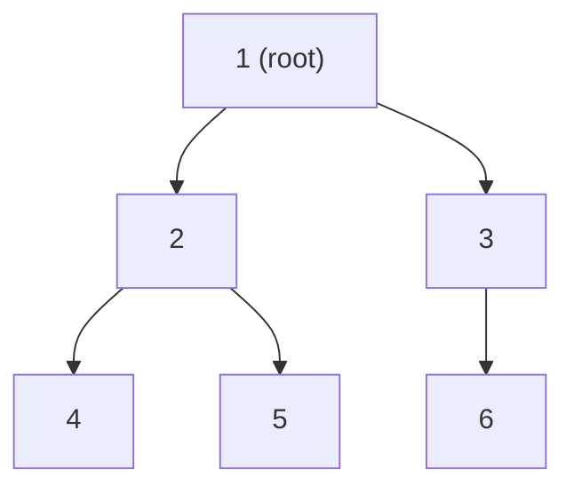

# Trees in Python

> Author: **Tamilselvan** · ✉️ tamilselvan.sde@gmail.com · 🔗 [LinkedIn](https://www.linkedin.com/in/tamilselvan-ai/)
> Section: 07 — Algorithms
> 🔗 Related: [linked_list.md](./linked_list.md) · [graph.md](./graph.md) · [stack.md](./stack.md) · [queue.md](./queue.md) · [recursion.md](./recursion.md)
> OOP: [../05_OOP/classes.md](../05_OOP/classes.md)
> Back to [README](../README.md)

---

## 1. What is it?

A **tree** is a **hierarchical** data structure of **nodes** connected by **edges**, where:
- One node is the **root**.
- Every non-root node has **exactly one parent**.
- Any node can have **zero or more children**.

Variants covered here:

| Tree type             | Definition (recap)                                              | Notable property               |
|------------------------|-----------------------------------------------------------------|--------------------------------|
| **Binary tree**        | each node has at most 2 children                                | foundation — most LC problems   |
| **Binary Search Tree** | left subtree `< node < right subtree` recursively               | sorted-search, in-order sorted |
| **AVL / Red-Black**    | self-balancing BST                                              | O(log n) worst case            |
| **N-ary tree**         | node can have many children (list of `Node`)                    | used for tries, file systems   |
| **Heap**               | complete binary tree with min/max property per parent           | see [heap.md](./heap.md)        |
| **Trie**               | n-ary tree keyed by character                                   | see [trie.md](./trie.md)        |

```python
class TreeNode:
    __slots__ = ("val", "left", "right")
    def __init__(self, val=0, left=None, right=None):
        self.val = val
        self.left = left
        self.right = right
```

**What problem it solves:** Hierarchical storage of information: filesystems, ASTs, HTML DOMs, decision trees, in-memory DB indexes. **BSTs** give O(log n) search/insert/delete on dynamic sorted data.

**Real-world analogy:** A family tree — except each node has at most one parent (not the classic dual-parent family tree). Or a company org chart.

---

## 2. Why do we use it?

- **Hierarchical relationships** are awkward to express in flat structures.
- **BST**: O(log n) sorted-set operations on dynamic data.
- **Balanced trees** keep worst-case logarithmic — unlike hash tables' worst O(n).
- **Recursion is a natural fit** — trees are defined recursively, so tree algorithms read like tree definitions.
- Foundations for **graphs** (graphs generalize trees by dropping the single-parent rule), **tries**, **heaps**, **segment trees**, **union-find**, and many interview classics.

---

## 3. When should I choose it? — Decision Table

| Situation                                          | Best choice                                  | Notes                                |
|----------------------------------------------------|----------------------------------------------|--------------------------------------|
| Need hierarchical data                              | tree / nested dict                            | filesystems, ASTs                    |
| Sorted dynamic data, log lookups                    | **BST** (or `sortedcontainers` in Python)    | -                                    |
| Strict worst-case O(log n)                          | AVL / Red-Black                              | CPython has no built-in balanced BST |
| Frequent min / max                                   | **min/max heap** ([heap.md](./heap.md))        | O(1) peek                            |
| String-prefix lookups                               | **trie** ([trie.md](./trie.md))                | O(L) per query                       |
| Static sorted array, no insertions                   | sorted `list` + `bisect` ([binary_search.md])  | O(log n) search, no overhead         |
| Static hierarchy with breadth-first traversal needs  | tree                                          | -                                    |
| Mine counted "lowest common ancestor"               | tree (LCA — binary lifting or recursion)      | (236)                                |

---

## 4. Syntax

```python
class TreeNode:
    __slots__ = ("val", "left", "right")
    def __init__(self, val=0, left=None, right=None):
        self.val = val
        self.left = left
        self.right = right

# Build a tree   1
#               / \
#              2   3
#             / \
#            4   5
t = TreeNode(1, TreeNode(2, TreeNode(4), TreeNode(5)), TreeNode(3))

# Recursive traversal
def preorder(n):
    if not n: return
    print(n.val, end=" ")
    preorder(n.left)
    preorder(n.right)

# Iterative with stack
def preorder_iter(root):
    out, st = [], [root]
    while st:
        n = st.pop()
        if not n: continue
        out.append(n.val)
        st.append(n.right)   # push right first so left pops first
        st.append(n.left)
    return out
```

---

## 5. Basic Example

### Recursive DFS traversals

```python
def preorder(r):  return [r.val] + preorder(r.left)  + preorder(r.right)  if r else []
def inorder(r):   return inorder(r.left)  + [r.val] + inorder(r.right)   if r else []
def postorder(r): return postorder(r.left)+ postorder(r.right) + [r.val] if r else []

# Build the same tree from Section 4
t = TreeNode(1, TreeNode(2, TreeNode(4), TreeNode(5)), TreeNode(3))
print("pre :", preorder(t))    # [1, 2, 4, 5, 3]
print("in  :", inorder(t))     # [4, 2, 5, 1, 3]
print("post:", postorder(t))   # [4, 5, 2, 3, 1]
```

### BFS — Level Order Traversal (LC 102)

```python
from collections import deque
def levelOrder(root):
    if not root: return []
    out, q = [], deque([root])
    while q:
        level = []
        for _ in range(len(q)):
            n = q.popleft()
            level.append(n.val)
            if n.left:  q.append(n.left)
            if n.right: q.append(n.right)
        out.append(level)
    return out

print(levelOrder(t))   # [[1], [2, 3], [4, 5]]
```

---

## 6. Step-by-Step Dry Run

### Inorder (recursive) on tree above

```
inorder(1)
  inorder(2)
    inorder(4)
      inorder(None) = []
      Visit 4
      inorder(None) = []
    ⇒ [4]
    Visit 2
    inorder(5)
      inorder(None) = []
      Visit 5
    ⇒ [5]
    ⇒ [4, 2, 5]
  Visit 1
  inorder(3)
    inorder(None) = []
    Visit 3
    inorder(None) = []
    ⇒ [3]
  ⇒ [4, 2, 5, 1, 3]
```

### BFS over the same tree

```
init: q = deque([1])
level 0: dequeue 1; enqueue 2 and 3 → q=[2,3]      store [1]
level 1: dequeue 2; enqueue 4,5; dequeue 3; nothing → q=[4,5]  store [2,3]
level 2: dequeue 4 (no kids); dequeue 5 (no kids) → q=[]         store [4,5]
output: [[1], [2,3], [4,5]]
```

### Validate BST (LC 98) on `5/3/8` with initial `lo=-inf, hi=+inf`

```
check(5, lo=-inf, hi=+inf) ok
  check(3, lo=-inf, hi=5) ok
  check(8, lo=5, hi=+inf) ok → Valid BST
```

On `5/6/8`:
```
check(5) ok
  check(6, lo=-inf, hi=5) ❌ 6 > 5  → invalid BST
```

---

## 7. Built-in Methods

Python has **no built-in tree class** — you always define your own `TreeNode` (or `Node` for N-ary). Standard-library helpers relevant to tree work:

| Tool                       | Purpose                                              | Use                                  |
|----------------------------|------------------------------------------------------|--------------------------------------|
| `collections.deque`         | BFS queue                                             | O(1) popleft                         |
| `list`                      | iterative DFS stack                                  | `pop()` from right                   |
| `wordorder = None`         | default for leaf pointers                              | ic= `Node.__init__` defaults         |
| `tuple` representation      | serialize a binary tree                                | LC 297 — to tuple `('root',L,R)`     |
| `bisect.insort`             | build sorted set via list                              | ALT to balanced BST in Python        |
| `sys.setrecursionlimit`     | raise Python's stack limit for deep trees              | use when tree depth > 1000           |

### Idiomatic tree patterns

| Pattern                          | Code sketch                                  | Use                                  |
|----------------------------------|----------------------------------------------|--------------------------------------|
| Recursive DFS                    | `def dfs(n): if not n: return; ... dfs(n.left); dfs(n.right)` | traversal                |
| Iterative pre/post-order          | `stack = [root]` + push right then left     | avoid recursion limit                |
| Iterative in-order                 | `stack = []; cur = root; while stack or cur`| (94)                                 |
| BFS level loop                    | `for _ in range(len(q)):`                    | capture level boundary               |
| Validator with `(node, lo, hi)`   | `stack = [(root, -inf, +inf)]`                | avoid recursion overflow (LC 98)     |
| Use list as queue-with-level-tag  | `q.append(None)` separator between levels     | alternative to inner loop            |
| Sentinel approach                 | global `bal = True`, recursion returns + check | `isBalanced`, same tree             |

### BST utilities (write once, reuse often)

```python
def bst_min(node):
    while node.left: node = node.left
    return node.val

def bst_max(node):
    while node.right: node = node.right
    return node.val

def bst_search(root, target):
    while root and root.val != target:
        root = root.left if target < root.val else root.right
    return root

def bst_insert(root, val):
    if not root: return TreeNode(val)
    if val < root.val: root.left = bst_insert(root.left, val)
    elif val > root.val: root.right = bst_insert(root.right, val)
    return root   # ignore duplicates (or insert into right)
```

For balanced BSTs in Python, prefer the **`sortedcontainers`** library (`SortedList`, `SortedDict`).

---

## 8. Interview Example

### LC 104 — Maximum Depth of Binary Tree

```python
def maxDepth(root):
    if not root: return 0
    return 1 + max(maxDepth(root.left), maxDepth(root.right))
```

BFS variant returns depth = number of levels.

### LC 226 — Invert Binary Tree

```python
def invertTree(root):
    if not root: return None
    root.left, root.right = root.right, root.left
    invertTree(root.left); invertTree(root.right)
    return root
```

### LC 100 — Same Tree

```python
def isSameTree(p, q):
    if not p or not q: return p is q
    return p.val == q.val and isSameTree(p.left, q.left) and isSameTree(p.right, q.right)
```

### LC 98 — Validate BST

```python
import math
def isValidBST(root):
    def ok(n, lo, hi):
        if not n: return True
        if not lo < n.val < hi: return False
        return ok(n.left, lo, n.val) and ok(n.right, n.val, hi)
    return ok(root, -math.inf, math.inf)
```

### LC 236 — Lowest Common Ancestor of a Binary Tree (Medium)

```python
def lowestCommonAncestor(root, p, q):
    if not root or root is p or root is q:
        return root
    left = lowestCommonAncestor(root.left, p, q)
    right = lowestCommonAncestor(root.right, p, q)
    if left and right: return root
    return left or right
```

---

## 9. When NOT to use

- **Frequent random access** — arrays/`list` give O(1) by index; trees don't.
- **Single contiguous sorted range** — sorted array + `bisect` is faster in constant factors; trees only win if you have frequent insertions.
- **You need O(1) lookup with non-ordered keys** — use a dict ([hash_map.md](./hash_map.md)).
- **Flat 1:1 hierarchy** or trivial data — a list or vector is simpler.
- **Graph-like many-parent relationships** — that's a graph, not a tree ([graph.md](./graph.md)).

---

## 10. Common Mistakes

1. **Forgetting the base case `if not root: return 0/None/[]`** — infinite recursion or crash on empty tree.
2. **Confusing pre/in/post-order** — the only difference is **when you visit the node** w.r.t. left/right children.
3. **Recursion stack overflow on a degenerate tree (linked-list shape)** — `sys.setrecursionlimit` or rewrite iteratively.
4. **BST validation by comparing node value only to its immediate children** — that misses a misplaced subtree (e.g., a right descendant smaller than an ancestor higher up). Always include `(lo, hi)` bounds.
5. **Iterative in-order errors**: pushing all left first via `while cur: stack.append(cur); cur = cur.left` is the canonical pattern — don't push right without this.
6. **Forgetting to push right before left in iterative pre-order** (so left pops first).
7. **BFS depth on BST forgetting to use `len(q)` inside the inner loop** — losing level boundaries.
8. **Modifying the tree while traversing it** — copy references first (e.g., `invertTree`).
9. **`is` vs `==`**: comparing node identity with `root is p` (not `root == p`) so custom `__eq__` doesn't trip you up.

---

## 11. Memory Tricks

- **Traversals mnemonic**:
  - **P**re  → **P**arent first (Root → Left → Right) — "P"-root-first.
  - **I**n   → In sorted order (Left → Root → Right) — gives sorted list for BST.
  - **P**ost → Children first (Left → Right → Root) — last to be visited is the root.
- **BFS = queue, DFS = stack** — the `pop` end (left vs right) tells you which.
- **Traverse like the tree: recursive definition → recursive function.** Trees are recursive! Match the structure.
- **LCA "first/left + right both non-null" pattern**: parent is the first node where both subtrees contain one search target each.
- **Validate BST**: think of in-order traversal — it should produce strictly increasing values (or use the `(lo, hi)` bound trick).

---

## 12. Interview Shortcuts

- Write the **recursive one-liner first**, then add iterative on follow-up.
- BFS level-order pattern: `for _ in range(len(q))` is the only idiom you need.
- DFS iterative: use a `stack = [root]` and **push right first** for pre-order.
- Iterative in-order:
  ```python
  stack, cur, out = [], root, []
  while stack or cur:
      while cur: stack.append(cur); cur = cur.left
      cur = stack.pop(); out.append(cur.val); cur = cur.right
  ```
- BST validation: `ok(node, lo, hi)` with `lo=-inf, hi=+inf` once; getting bounds right first time impresses interviewers.
- For depth: `1 + max(L, R)` — don't recurse twice if you can return both `depth` and `balance` from one call (LC 110 — balanced).
- LC 297 (serialize): use pre-order with `"N"` for null tokens; `"1,2,N,N,3,4,N,N,5,N,N"`.
- LC 105 (build from pre+in): recursion with index ranges — keep a `pos_map = {val: idx for ...}` to find root in O(1).

---

## 13. Cheat Sheet Table

| Traversal / Operation       | Recursive                                         | Iterative                                | Time  | Space  |
|-----------------------------|---------------------------------------------------|------------------------------------------|-------|--------|
| Pre-order (R, L, R)         | `dfs` print/append at top                          | `stack=[root]`, push right then left      | O(n)  | O(h)   |
| In-order (L, R, R)          | left → print → right                                | `stack, cur = [], root`; while loop        | O(n)  | O(h)   |
| Post-order (L, R, R)        | left + right + parent                               | two-stack trick or visited marker          | O(n)  | O(h)   |
| Level-order (BFS)           | recursion by depth index                            | `deque` + inner `range(len(q))`            | O(n)  | O(w)   |
| Max depth                   | `1 + max(L,R)`                                     | BFS level count                            | O(n)  | O(h)   |
| Max-width                   | index (level, i), width = last_idx - first_idx +1   | BFS with positional indices               | O(n)  | O(w)   |
| BST search                  | recursive compare                                  | `while` with compare                       | O(h)  | O(1)   |
| BST insert                 | return node recursively                            | find parent, append child                  | O(h)  | O(1)   |
| LCA (binary tree)           | `if root is p or q: return root`                   | iterative with parent map                  | O(n)  | O(h)   |
| Validate BST                | `(lo, hi)` bounds                                  | iterative with bounds stack                | O(n)  | O(h)   |

`h` = tree height (`log n` if balanced, `n` if skewed); `w` = max width.

---

## 14. Time Complexity Table

| Operation                          | Binary tree (skewed) | Balanced tree  | Notes                       |
|------------------------------------|----------------------|----------------|------------------------------|
| Search by value (general)          | O(n)                 | O(log n)       | -                            |
| BST search                         | O(h)                 | O(log n)       | h = height                   |
| BST insert / delete                | O(h)                 | O(log n)       | -                            |
| Min in BST                         | O(h) (walk left)     | O(log n)       | -                            |
| All traversals                     | O(n)                 | O(n)           | must visit every node once    |
| Lowest Common Ancestor             | O(n)                 | O(log n)       | pointer upward; binary lifting for log |
| Diameter                           | O(n)                 | O(n)           | -                            |
| Serialize / deserialize            | O(n)                 | O(n)           | -                            |

**Space** for the traversals is dominated by recursion/stack depth: **O(h)** for DFS, **O(w)** for BFS where `w` is the maximum width (can be up to n/2 for a perfect tree at the last level).

---

## 15. Visual Diagram (ASCII + Mermaid)

### Binary tree



```
               root
                 1
               /   \
              2     3
             / \     \
            4   5     6
```

### Traversal orders

```
Tree:
       1
      / \
     2   3
    / \
   4   5

PRE-order  : 1 2 4 5 3      (parent before children)
IN-order   : 4 2 5 1 3      (BST → sorted)
POST-order : 4 5 2 3 1      (children before parent)
LEVEL-order: [1] [2,3] [4,5]
```

### BFS — level queue snapshots

```
q=[1]          level 1
q=[2,3]        level 2
q=[4,5]        level 3
q=[]           done
```

### DFS — explicit stack (pre-order)

```
stack=[1]
pop 1, visit; push right(3), push left(2) → stack=[3,2]
pop 2, visit; push right(5), push left(4) → stack=[3,5,4]
pop 4, visit; no children                → stack=[3,5]
pop 5, visit; no children                → stack=[3]
pop 3, visit; no children                → stack=[]
visits : 1,2,4,5,3
```

### BST property (left < parent < right)

```
              8
            /   \
           3    10
          / \     \
         1   6    14
            / \   /
           4   7 13

in-order would yield: 1 3 4 6 7 8 10 13 14  →  sorted
```

### Algorithm flowchart — recursive tree DFS

```
            ┌──────────┐
            │ dfs(node) │
            └────┬─────┘
                 ▼
            is node None? ──yes──► return
                 │ no
                 ▼
            visit(node)            # or save its value
                 │
                 ▼
            dfs(node.left)
                 │
                 ▼
            dfs(node.right)
```

### Algorithm flowchart — BFS

```
            start: deque([root]); visited = {root}
            while q:
                n = q.popleft()
                for child in (n.left, n.right):
                    if child and child not in visited:
                        visited.add(child); q.append(child)
```

---

## 16. Beginner Notes

> **Remember:**
> - Tree = hierarchical nodes with **one root, one parent** per non-root node.
> - Use a `TreeNode` class — `__slots__` keeps memory tight on big trees.
> - **Pre / In / Post** order differ only in **when the parent is visited**.
> - For **BST**: left subtree values are *strictly* smaller; right *strictly* larger — in-order gives sorted values.
> - **BFS uses a queue**, DFS uses recursion or an explicit stack. See [queue.md](./queue.md) and [stack.md](./stack.md).
> - The "**dummy / sentinel**" idea from linked lists doesn't apply here unless you're building a threaded tree.
> - Python's recursion limit (~1000) bites on degenerate (linked-list shaped) trees — prefer iterative then.

---

## 17. FAANG Tips

- **Write recursive first, iterative on follow-up** — almost every FAANG reviewer asks for iterative in-order / pre-order tests.
- **Bounds-check BST validation** with `(lo, hi)` arguments; never trust a "compare with just your children" check.
- BFS one-liner insight: `for _ in range(len(q))` lets you capture "level boundaries" without sentinel markers.
- Iterative in-order template (memorize this!):
  ```python
  stack, cur, out = [], root, []
  while stack or cur:
      while cur: stack.append(cur); cur = cur.left
      cur = stack.pop(); out.append(cur.val); cur = cur.right
  ```
- LCA recursion: "if both children return non-None, I'm the answer; otherwise whatever they returned."
- BST deletion — three cases (leaf, one-child, two-child). Two-child = replace with in-order successor.
- Serialize/deserialize with pre-order + `None` markers — easiest whiteboardable scheme.
- **For tree-morphism tests** (same tree, subtree of another tree, flip equivalent): cross-tree recursion using `is` for node identity checks.
- **Tree DP patterns** (diameter, max path sum): return `(value, info)` tuples to solve parent+child in one pass.

---

## 18. Practice Problems

### Easy
- **LC 144** — Binary Tree Preorder Traversal
- **LC 94** — Binary Tree Inorder Traversal
- **LC 145** — Binary Tree Postorder Traversal
- **LC 104** — Maximum Depth of Binary Tree
- **LC 226** — Invert Binary Tree
- **LC 100** — Same Tree

### Medium
- **LC 102** — Binary Tree Level Order Traversal
- **LC 98** — Validate Binary Search Tree
- **LC 236** — Lowest Common Ancestor of a Binary Tree
- **LC 105** — Construct Binary Tree from Preorder and Inorder Traversal
- **LC 199** — Binary Tree Right Side View
- **LC 543** — Diameter of Binary Tree

### Hard
- **LC 124** — Binary Tree Maximum Path Sum
- **LC 297** — Serialize and Deserialize Binary Tree
- **LC 145** (iterative post) — iterative postorder without recursion flag