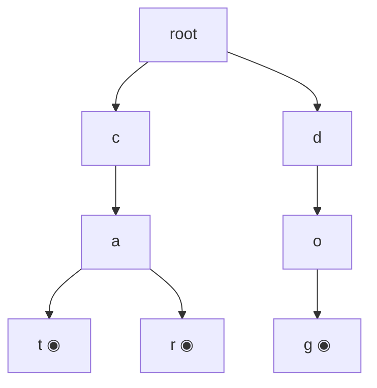

# Trie (Prefix Tree) in Python

> Author: **Tamilselvan** · ✉️ tamilselvan.sde@gmail.com · 🔗 [LinkedIn](https://www.linkedin.com/in/tamilselvan-ai/)
> Section: 07 — Algorithms
> 🔗 Related: [Trees](../05_OOP/classes.md) · [DFS](./dfs.md) · [BFS](./bfs.md) · [Hash / dict](../02_Data_Types/dict.md)
> Data: [dict.md](../02_Data_Types/dict.md) · [big_o.md](../08_Time_Complexity/big_o.md)
> Back to [README](../README.md)

---

## 1. What is it?

A **Trie** (pronounced "try") — also called a **prefix tree** — is a multi-way tree that stores a dynamic set of strings. Each **edge** represents a character, and each **path from the root to a node** spells a prefix shared by all words that pass through or terminate at that node.

```
        root
        / | \
       c  d  t
      /      |
     a        o
     |        |
     t  ←end  p   ←end

Stored words: "cat", "top"
```

A **TrieNode** typically holds:
- `children` — a dict mapping `char → TrieNode` (in interviews; production might use a fixed-size array of 26 for lowercase letters).
- `is_end` — boolean: does some word **end** at this node? (distinct from "this node is an intermediate prefix".)
- (optional) `count`, `value`, `fail_link` (Aho-Corasick), etc.

**Operations (L = key length):**
| Operation | Time | Notes |
|-----------|------|-------|
| `insert(key)` | **O(L)** | walk/create one edge per char. |
| `search(key)` (exact word) | **O(L)** | walk & ensure final node has `is_end=True`. |
| `startswith(prefix)` | **O(L)** | walk & just verify the path exists. |

**What problem it solves:** Prefix queries (autocomplete, "show all words starting with 'ca'"), dictionary lookup with shared-prefix memory savings, longest common prefix, replace/augment words, max XOR pair (binary trie), longest word matching, IP routing (longest prefix match).

**Real-world analogy:** A vinyl-binder index drawer. To reach "CATALOG" you open the **C** tab, then within **C** the **A** divider, then **T**, and so on — each tab shares its prefix for every word beneath it. Looking up "any word starting with CA" is the same effort as looking up one word — you simply arrive at node **CA** and *everything* under it matches the prefix.

---

## 2. Why do we use it?

| Benefit | Detail |
|--------|--------|
| **Prefix queries in O(L)** | "All words with prefix `s`" — find the node for `s`, then DFS for all descendants. Hash tables can't do this at all. |
| **Shared memory for prefixes** | 10,000 words all starting with "inter" share those 5 nodes — few KB vs many copies of the string. |
| **Dictionary with autocomplete** | Naturally returns all continuations; you avoid enumerating the whole dictionary on each keystroke. |
| **Replace words in sentence** | Find shortest matching root in one walk along the trie (648). |
| **Longest common prefix** | Stop walking when a node has more than 1 child or marks a word end. |
| **Max XOR pair (421)** | Binary trie on bits gives O(n · 32) pair-XOR-max instead of O(n²). |
| **Smallest lexicographical enum** | Pre-order trie DFS visits words in sorted order. |

**Brute force vs trie:** Storing words in a `set` gives O(L) `in` lookup but **cannot answer prefix queries** — you'd have to iterate the entire set, which is O(n·L). A trie answers prefix queries in O(L + matches) — dramatically faster as N grows.

**Hash vs Trie (decision table below in §3):** hash wins for exact lookup with small/medium input; trie wins when prefixes or shared structure matter.

---

## 3. When should I choose it? (Decision Table — Trie vs Hash vs Sorting)

| Situation | Trie | Hash (`set`/`dict`) | Sorted list + bisect |
|-----------|:----:|:-------------------:|:--------------------:|
| Exact whole-word lookup | △ O(L) | ✅ O(L) avg | △ O(L log n) |
| Prefix search ("all words starting with `ca`") | ✅ O(L + k·avg_len) | ❌ O(n·L) full scan | △ binary search bounds, then range |
| Autocomplete / typeahead | ✅ | ❌ | △ |
| Longest common prefix | ✅ | ❌ | △ sort then compare first & last |
| Replace words by shortest root | ✅ | △ iterate all roots per token | ❌ |
| Max XOR pair | ✅ binary trie | ❌ | ❌ |
| IP routing (longest prefix match) | ✅ binary trie | ❌ | △ |
| Counting / membership | △ O(L) | ✅ O(L) avg | △ O(log n) |
| Memory-sensitive, many shared prefixes | ✅ | ❌ stores each word separately | △ |
| Random access by integer rank | ❌ | ❌ | ✅ |
| You only need ONE prefix query ever | △ overhead | scan once | sort & bisect |
| Dynamic insertions intermixed with prefix queries | ✅ | ❌ repeated scan | △ re-sort |

**Rule of thumb:** Trie when **multiple/persistent prefix queries**, **autocomplete**, **max XOR**, or many **shared-prefix words**. Hash when only exact lookup. Sort + bisect when one-shot prefix query.

---

## 4. Syntax

### Full TrieNode + Trie class (OOP)

```python
class TrieNode:
    __slots__ = ('children', 'is_end')
    def __init__(self):
        self.children = {}    # char -> TrieNode
        self.is_end = False   # True if some word ends here

class Trie:
    def __init__(self):
        self.root = TrieNode()

    def insert(self, word: str) -> None:
        node = self.root
        for ch in word:
            if ch not in node.children:
                node.children[ch] = TrieNode()
            node = node.children[ch]
        node.is_end = True

    def search(self, word: str) -> bool:
        node = self.root
        for ch in word:
            if ch not in node.children:
                return False
            node = node.children[ch]
        return node.is_end

    def startsWith(self, prefix: str) -> bool:
        node = self.root
        for ch in prefix:
            if ch not in node.children:
                return False
            node = node.children[ch]
        return True
```

### Walk / iterate all words under a node (DFS)

```python
def collect(node, path, out):
    if node.is_end:
        out.append("".join(path))
    for ch, child in node.children.items():
        path.append(ch)
        collect(child, path, out)
        path.pop()

def words_with_prefix(trie, prefix):
    node = trie.root
    for ch in prefix:
        if ch not in node.children: return []
        node = node.children[ch]
    out = []
    collect(node, list(prefix), out)
    return out
```

### Binary trie for max XOR

```python
class XorTrie:
    """Each node has two children keyed 0 and 1.BITS = 32 (or whatever).
    """
    def __init__(self):
        self.root = {}
    def add(self, num):
        node = self.root
        for i in range(31, -1, -1):
            bit = (num >> i) & 1
            node = node.setdefault(bit, {})
    def best_xor(self, num):
        node = self.root
        ans = 0
        for i in range(31, -1, -1):
            bit = (num >> i) & 1
            want = 1 - bit
            if want in node:
                ans |= (1 << i)
                node = node[want]
            else:
                node = node[bit]
        return ans
```
(`setdefault` here is just clever: you can also use `defaultdict(dict)` or wrap a `TrieNode`-like class.)

---

## 5. Basic Example

```python
t = Trie()
for w in ["cat", "car", "dog", "do"]:
    t.insert(w)

print(t.search("cat"))       # True
print(t.search("ca"))        # False   (prefix only, not a complete word)
print(t.startsWith("ca"))    # True
print(t.startsWith("d"))     # True
print(t.startsWith("x"))     # False
print(words_with_prefix(t, "ca"))   # ['cat', 'car']
```

**Output:**
```
True
False
True
True
False
['cat', 'car']
```

---

## 6. Step-by-Step Dry Run

Inserting **"cat"**, **"car"**, **"dog"** in order.

### After inserting "cat"
```
root
 └─ c
    └─ a
       └─ t  ◉ (is_end=True)
```

### After inserting "car"
```
root
 └─ c
    └─ a
       ├─ t  ◉
       └─ r  ◉
```
The first two edges (**c → a**) were reused. Three new nodes (`r`) created.

### After inserting "dog"
```
root
 ├─ c
 │  └─ a
 │     ├─ t  ◉
 │     └─ r  ◉
 └─ d
    └─ o
       └─ g  ◉
```

### `search("ca")`:
```
walk root → 'c' → 'a'
look at is_end: False   → returns False
```

### `startsWith("ca")`:
```
walk root → 'c' → 'a'   → node exists → returns True (no is_end check)
```

### `words_with_prefix("ca")`:
```
'c' → 'a' → node reached.
DFS from that node:
  path ['c','a']
  ├── child 't' path ['c','a','t'] is_end → emit "cat"
  └── child 'r' path ['c','a','r'] is_end → emit "car"
Return ['cat', 'car']
```

### Edge counts tracking insert

| Insert | Walking edges | New nodes created |
|--------|:------------:|:------------------:|
| "cat"  | 0 (none existed) | 3 (`c`, `a`, `t`) |
| "car"  | 2 (`c`, `a` reused) | 1 (`r`) |
| "dog"  | 0 | 3 (`d`, `o`, `g`) |

Total nodes (excluding root) = 7 — significantly less than 3 + 3 + 3 = 9 chars stored flat.

---

## 7. Built-in Methods (`dict` for children)

There's no standard `trie` module in Python — the **`dict`** is the workhorse. Here's how to use it idiomatically for trie children.

| Method / Syntax | Purpose | Example | Complex-ity | Interview use | Mistakes |
|-----------------|---------|---------|-------------|----------------|----------|
| `node.children = {}` | create empty child map | TrieNode `__init__` | O(1) | fresh node | using `setdefault` consistently or not at all |
| `ch in node.children` | check edge existence | `if ch not in node.children:` | O(1) avg | bool prefix existence | accidentally using `node.children.get(ch)` and confusing None vs missing |
| `node.children[ch] = TrieNode()` | create child edge | insert path | O(1) | insert operation | reassigning an existing child — leaks the subtree |
| `node.children.get(ch)` | null-safe access | `node = node.children.get(ch); if not node: return` | O(1) | iteration guard | writing `node = node.children[ch]` then catching KeyError — ugly, prefer `get` |
| `for ch, child in node.children.items():` | iterate children | DFS / collect | O(branch) | autocomplete | order is insertion-order (Py3.7+) — useful but not alphabetical unless you sort |
| `node.children.setdefault(ch, TrieNode())` | "create-or-get" shortcut | terser insert | O(1) | one-line insert step | `setdefault` evaluates the default arg every call — minor cost; cheap for TrieNode() |
| `node.children.pop(ch, None)` | delete child edge | removal after recursive cleanup | O(1) | "delete word" interview variant | forgetting to remove empty children after delete |
| `len(node.children)` | number of branches (branching factor) | detect LCP "single path" end | O(1) | longest common prefix | — |
| `node.is_end = True/False` | mark word end | insert / delete | O(1) | distinguishes prefix from full word | forgetting `is_end` makes prefix-only words like prefix `"ca"` "exist" |

**Shortcut insert using `setdefault`:**
```python
def insert(self, word):
    node = self.root
    for ch in word:
        node = node.children.setdefault(ch, TrieNode())
    node.is_end = True
```
Cleaner — one line per char, no `if` check. Idiomatic Python.

**Mistakes:**
- Confusing `search` (must check `is_end`) vs `startsWith` (don't check `is_end`).
- Returning the *node* from helper functions and forgetting to check `is_end`.
- Mutating a shared default args dict (`def __init__(self, children={}):`) — the same dict is shared across all nodes. Always build a fresh dict in `__init__`.
- For heavy deploys: using `dict` instead of `[None]*26` (list of children) saves space for sparse alphabets but is slower for dense ones. For lowercase letters only, the array variant is sometimes faster.
- Using `__slots__` to save memory (recommended when n is large — saves ~40% per node).

---

## 8. Interview Example — 208. Implement Trie (Prefix Tree)

```python
class TrieNode:
    __slots__ = ('children', 'is_end')
    def __init__(self):
        self.children = {}
        self.is_end = False

class Trie:
    def __init__(self):
        self.root = TrieNode()

    def insert(self, word: str) -> None:
        node = self.root
        for ch in word:
            node = node.children.setdefault(ch, TrieNode())
        node.is_end = True

    def search(self, word: str) -> bool:
        node = self._walk(word)
        return node is not None and node.is_end

    def startsWith(self, prefix: str) -> bool:
        return self._walk(prefix) is not None

    def _walk(self, s: str):
        node = self.root
        for ch in s:
            node = node.children.get(ch)
            if node is None:
                return None
        return node


# Demo
t = Trie()
ops   = ["insert","search","search","startsWith","insert","search"]
args  = [["apple"],["apple"],["app"],["app"],["app"],["app"]]
for op, a in zip(ops, args):
    print(getattr(t, op)(*a))
```
**Output:**
```
None      (insert returns None)
True      (search apple → exists)
False     (search app → prefix, not a word)
True      (startsWith app)
None      (insert app)
True      (search app NOW exists)
```

**Pattern:** factor out a `_walk(s)` helper — the engine of all Trie problems.

---

## 9. When NOT to use

- **One-off exact lookups.** A `set` is simpler and equally fast.
- **Few words.** Overhead of multiple `TrieNode` instances per char dwarfs the savings.
- **Numerical keys that aren't naturally prefix-structured.** Use dict / hash.
- **You need range queries / sorted enumeration frequently** — a balanced BST / sorted list with bisect serves ranges better.
- **Tight memory budget, no prefix queries.** Trie has high constant overhead (one node per char + dict per node) — for 10M random strings you may pay 10× the memory of a hash set.
- **Long keys with low shared-prefix ratio.** E.g., random hashes — trie has no compression benefit.
- **Mutable / frequently deleted entries.** Tries don't natively delete; you must prune empty subtrees.

---

## 10. Common Mistakes

1. **`search` vs `startsWith` confusion.** Forgetting `is_end` makes prefixes look like full words. Always end with `return node.is_end` in `search`.
2. **Shared default mutable args.** `def __init__(self, children={}):` — banned in Python style. The same dict gets shared. Always create inside `__init__`.
3. **Using `node.children[ch]` without checking first.** Raises `KeyError`. Use `children.get(ch)` or `setdefault` for safer code.
4. **`setdefault` evaluating the default every call.** `setdefault(ch, TrieNode())` constructs a TrieNode even when not needed — minor cost, fine for interviews, but on heavy workloads prefer `if ch not in: ...`.
5. **Forgetting to handle case sensitivity.** Decide whether you lowercase strings once (in `insert`) or keep both cases. Consistency matters.
6. **Returning `True` from `startsWith` when the path doesn't fully exist.** Must check each step, not just the final node.
7. **Memory blow-up from not using `__slots__`.** Add `__slots__ = ('children', 'is_end')` to TrieNode — saves ~40% per node.
8. **DFS over all words without trailing `pop` on path list.** You'll keep appending and the recursion path keeps growing. Use `path.append + path.pop` (or pass immutable slices).
9. **Binary trie XOR: dealing with bit width inconsistently.** All numbers should be padded to same bit length — fix 31 or 63 — else best_xor can miss shorter-prefix differences.
10. **Storing characters on nodes (not edges).** Some implementations store the character on the node, but then `root` has no character and the semantics get confusing. Storing on edges (in the dict key) is cleaner.

---

## 11. Memory Tricks

- **"Tabbed binder"** — each level is one character's tab; descend to grow the spelled path.
- **Multiple words → tree, not forest.** All words share the root; prefixes fuse branches.
- **`is_end` ≠ "is leaf"**. A node can be both `is_end=True` and have children (e.g., `"do"` ends while `"dog"` continues).
- **Edge = character; node = state.** Walking L edges = walking an L-character string.
- **Pre-order DFS visits words in alphabetical order** because children iterated in sorted order.

---

## 12. Interview Shortcuts

- Use `setdefault` to compress insert to two lines:
  ```python
  def insert(self, word):
      node = self.root
      for ch in word: node = node.children.setdefault(ch, TrieNode())
      node.is_end = True
  ```
- One `_walk(s)` helper does double duty for `search` and `startsWith` — only the `is_end` check differs.
- **Add `__slots__`** on TrieNode (`('children','is_end')`) — interviewers notice.
- Use a list `[None] * 26` instead of `dict` if alphabet is fixed lowercase and memory isn't a concern — faster indexing.
- For DFS over matches, **template**:
  ```python
  def words(u, path, out):
      if u.is_end: out.append("".join(path))
      for ch in sorted(u.children):
          path.append(ch); words(u.children[ch], path, out); path.pop()
  ```
- Binary trie: use a plain `dict` for children keyed by bits 0/1. Pad all numbers to the same bit length.
- **In `Word Search II` (212):** add all words to a trie, then DFS the grid with pruning at trie dead-ends. Mark found words and remove `is_end` to prevent duplicates.
- **Replace Words (648):** build trie of roots; for each word in sentence, walk the trie and stop at first `is_end=True` to use as replacement.

---

## 13. Cheat Sheet Table

| Concept | Trie detail |
|---------|------------|
| Node class | `TrieNode` with `children: dict` + `is_end: bool` |
| Edge weight | a single character (key in `children`) |
| `insert(word)` | walk/create path; mark `is_end=True` at end  — **O(L)** |
| `search(word)` | walk path; check `is_end` at end — **O(L)** |
| `startsWith(prefix)` | walk path; just verify the path exists — **O(L)** |
| All words with prefix | walk to prefix; DFS descendants — **O(L + total output)** |
| Longest common prefix | walk until `len(children) != 1` or `is_end=True` |
| Binary trie (max XOR) | edges = bits 0/1, fixed bit-width L (e.g. 32) |
| Memory | O(N·L) — but shared prefixes collapse |
| Required: when prefixes matter (autocomplete, replace, routing) |
| Avoid when: pure lookup, small N, no prefix queries | |

---

## 14. Time Complexity Table

| Operation | Complexity | Notes |
|-----------|-----------|-------|
| `insert(word)`     | **O(L)**      | per character — create or walk |
| `search(word)`     | **O(L)**      | walk path + is_end |
| `startsWith(p)`    | **O(L)**      | walk path only |
| Delete word        | O(L)          | walk + recursive cleanup of empty nodes |
| All words with prefix | O(L + M·avg) | M = number of matching words |
| Longest common prefix | O(L)        | walk until branch / end |
| Binary trie XOR   | O(L) per query, L = bit width (32) | 421 max XOR pair |
| Space (worst case) | **O(N·L)**    | N words each L chars (no shared prefixes) |
| Space (real with shared prefixes) | much less — every shared prefix = one node saved |

Edge case: A trie of N identical words "aaa...a" uses only L+1 nodes, not N·L.

---

## 15. Visual Diagram (ASCII + Mermaid)

### Building a trie of "cat", "car", "dog"



**Step 1 — insert "cat":**
```
root
  └─ c
     └─ a
        └─ t ◉
```

**Step 2 — insert "car":**
```
root
  └─ c
     └─ a
        ├─ t ◉
        └─ r ◉
```
Shared prefix `c-a` reused; only one new node (`r`) created.

**Step 3 — insert "dog":**
```
root
  ├─ c
  │  └─ a
  │     ├─ t ◉
  │     └─ r ◉
  └─ d
     └─ o
        └─ g ◉
```

**Step 4 — insert "do":**
```
root
  ├─ c
  │  └─ a
  │     ├─ t ◉
  │     └─ r ◉
  └─ d
     └─ o ◉      ← is_end=True (mid-prefix end!)
        └─ g ◉
```
Note `o` has `is_end=True` (because "do" is a word) **and** a child `g` (because "dog" is a word). `is_end` and "has children" are independent.

### Walk for `startsWith("ca")`
```
root → c → a       (path exists) ✓
```

### Walk for `search("ca")`
```
root → c → a       path exists, but is_end=False  ✗
```

### DFS to collect all words under "ca"
```
root → c → a
            ├→ t ◉ ("cat")
            └→ r ◉ ("car")
```

### Binary trie for max XOR (421)

```
Numbers: 3 (011), 10 (1010), 5 (0101)

Pad to bit 4 (for clarity): 0011, 1010, 0101
Insert 3 = 0011 into binary trie:
                 root
                 /0
                0
                /0
               0
               /1
              1
              /1
             1   ◉ (3)

Insert 5 = 0101:
                 root
                 /0
                0
                /0            \1
               0                1
                \1              /0
                 1             0
                 /1            /1
                1 ◉ (3 = 0011)  1 ◉ (5 = 0101)

Query best_xor(10 = 1010):
   bit 3 (8)  want 0 (since 10 has bit 1)  : root has {0}, go to 0 → ans += 8
   bit 2 (4)  want 1                        : node at depth1 has {0,1}, go to 1 → ans += 4
   bit 1 (2)  want 0                        : node has {1}, take 1 (force)  → no add
   bit 0 (1)  want 1                        : node has {0,1} → take 1 → ans += 1

Best XOR = 8+4+1 = 13 ... match: 10 ^ 3 = 9, 10 ^ 5 = 15? Let's check:
   10 ^ 3 = 9   (1010 ^ 0011 = 1011 = 11)
   10 ^ 5 = 15  (1010 ^ 0101 = 1111 = 15)  ← max
(Adjusting the trie shape depending on numbers — example illustrates the bit-by-bit greedy walk.)
```

### Flowchart (insert operation)

```
       +-----------------+
       | start at root   |
       +-----------------+
               |
       for ch in word:
               |
       ch in node.children?
         /         \
       yes          no
        |            |
     move to child  create new TrieNode(),
        |           link children[ch] = new
        |            |
        +------------+
               |
       (end of word)
               |
       set node.is_end = True
```

---

## 16. Beginner Notes (Remember block)

> **Remember:**
> - TrieNode = `{children: dict, is_end: bool}`. Edges hold characters (dict keys).
> - **`search` checks `is_end`**, `startsWith` does **not**.
> - A node can be both `is_end=True` and have children (e.g. "do" + "dog").
> - All ops are **O(L)** where L = key length — **independent of how many words are stored**.
> - Use `setdefault(ch, TrieNode())` for terser inserts.
> - Pre-order DFS visits stored words in **alphabetical order** (sorted children).
> - For binary trie (XOR), pad all numbers to the **same bit length**.
> - Use `__slots__` on TrieNode to save memory in large dictionaries.

---

## 17. FAANG Tips

- **Implement Trie (208)** is the gateway — every follow-up uses this skeleton.
- **Word Search II (212)**: insert all words once; DFS the grid; at each cell, walk the trie and prune dead-ends; mark found → set `is_end=False` to avoid duplicate matches.
- **Design Add & Search Words (211)**: extend TrieNode with a wildcard search — when you hit '.', recursively try every child. Backtracking DFS ∴ O(26^L) worst-case, but prunes heavily with real data.
- **Replace Words (648)**: build a trie of roots; for each word in the sentence, walk until first `is_end=True` and use that root as replacement.
- **Longest Common Prefix (14)**: sort strings or insert into trie, walk while there's exactly one child and `is_end=False`.
- **Maximum XOR of Two Numbers (421)**: binary trie — insert all numbers, then for each, greedily walk bits to **maximize** the XOR (`want = 1 - bit`). O(n · 32).
- **Concatenated Words (472)**: insert all words into a trie; for each word, DP/recursively check if it can be segmented into other words (word-break + trie).
- **Stream of Characters (1032)**: reversed-character trie + query suffix. Insert each word reversed, then query the stream backward.

---

## 18. Practice Problems

### Easy
1. **208. Implement Trie (Prefix Tree)** — base data structure.
2. **14. Longest Common Prefix** — trie or vertical scan; trie is one valid approach.
3. **720. Longest Word in Dictionary** — trie + BFS/DFS search for buildable words.
4. **1165. Single-Row Keyboard** (analogy only) — not really a trie.

### Medium
1. **211. Design Add and Search Words Data Structure** — trie with wildcard DFS.
2. **648. Replace Words** — trie-based shortest root replacement.
3. **677. Map Sum Pairs** — trie storing sums at each node.
4. **139. Word Break** (alt) — typically DP but can use a trie for the dictionary.
5. **1804. Implement Trie II (Prefix Count)** — count words with given prefix.

### Hard
1. **212. Word Search II** — trie + grid DFS with pruning.
2. **421. Maximum XOR of Two Numbers in an Array** — binary trie greedy walk.
3. **336. Palindrome Pairs** — trie of reversed words with palindrome check.
4. **1032. Stream of Characters** — reversed-character trie query.
5. **472. Concatenated Words** — trie + word-break.

---

> Back to [DFS](./dfs.md) · [BFS](./bfs.md) · [Trees / classes](../05_OOP/classes.md) · [README](../README.md)