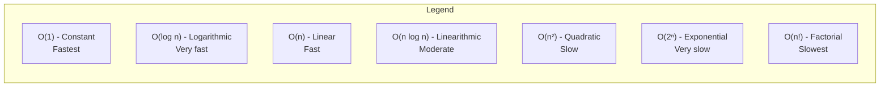
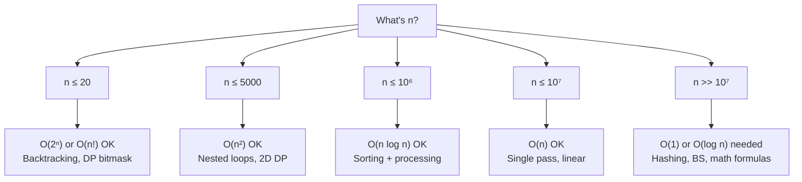

# ⏱ Time & Space Complexity Cheatsheet

> *Your quick-reference guide to algorithmic complexity for coding interviews*

---

## 📈 Complexity Growth Curves



```mermaid
---
config:
    theme: neutral
---
xychart-beta
    title "Time Complexity Growth"
    x-axis ["n=1", "n=10", "n=100", "n=1000", "n=10⁶"]
    y-axis "Operations (log scale)" 0 --> 1000000
    line [1, 1, 1, 1, 1] text: "O(1)"
    line [1, 3, 7, 10, 20] text: "O(log n)"
    line [1, 10, 100, 1000, 1000000] text: "O(n)"
    line [1, 10, 200, 3000, 10000000] text: "O(n²)"
```

### 💡 Quick Notes on Growth

| Complexity | n=10 | n=100 | n=1,000 | n=10⁶ | Rating |
|:----------|:----:|:-----:|:-------:|:-----:|:------:|
| O(1) | 1 | 1 | 1 | 1 | 🟢 Excellent |
| O(log n) | ~3 | ~7 | ~10 | ~20 | 🟢 Excellent |
| O(n) | 10 | 100 | 1,000 | 10⁶ | 🟢 Good |
| O(n log n) | ~33 | ~700 | ~10,000 | ~20×10⁶ | 🟡 Fair |
| O(n²) | 100 | 10,000 | 10⁶ | 10¹² | 🔴 Poor |
| O(2ⁿ) | 1,024 | 10³⁰ | ∞ | ∞ | ⚫ Avoid |
| O(n!) | 3.6×10⁶ | ∞ | ∞ | ∞ | ⚫ Avoid |

---

## 1️⃣ Sorting Algorithms

| Algorithm | Best | Average | Worst | Space | Stable | Type |
|:----------|:----:|:-------:|:-----:|:-----:|:------:|:----:|
| **Bubble Sort** | O(n) | O(n²) | O(n²) | O(1) | ✅ | Comparison |
| **Selection Sort** | O(n²) | O(n²) | O(n²) | O(1) | ❌ | Comparison |
| **Insertion Sort** | O(n) | O(n²) | O(n²) | O(1) | ✅ | Comparison |
| **Merge Sort** | O(n log n) | O(n log n) | O(n log n) | O(n) | ✅ | Comparison |
| **Quick Sort** | O(n log n) | O(n log n) | O(n²)* | O(log n) | ❌ | Comparison |
| **Heap Sort** | O(n log n) | O(n log n) | O(n log n) | O(1) | ❌ | Comparison |
| **Counting Sort** | O(n+k) | O(n+k) | O(n+k) | O(k) | ✅ | Non-comparison |
| **Radix Sort** | O(d×n) | O(d×n) | O(d×n) | O(n+k) | ✅ | Non-comparison |

*Quick Sort worst-case O(n²) happens with poor pivot choice (sorted array, last element pivot). Use random pivot or median-of-three to mitigate.

### Complexity Visualization

```mermaid
flowchart TD
    subgraph Sorting["Sorting Algorithm Selection"]
        A["Need to sort?"] --> B{"Input size?"}
        B -->|Small (<50)| INS["Insertion Sort\nO(n²) but fast in practice"]
        B -->|Medium| MER["Merge Sort\nO(n log n), stable"]
        B -->|Large| QCK["Quick Sort\nO(n log n) avg, in-place"]
        B -->|Large + stable| MER2["Merge Sort"]
        B -->|Integer/limited range| CNT["Counting Sort\nO(n+k) linear!"]
    end
```

### Python Implementation Notes

| Sort Method | Time | Space | Notes |
|:------------|:----:|:-----:|:------|
| `sorted(arr)` | O(n log n) | O(n) | Returns new list (Timsort: hybrid merge+insertion) |
| `arr.sort()` | O(n log n) | O(1) | In-place sort (Timsort) |
| `heapq.nlargest(k, arr)` | O(n log k) | O(k) | Partial sort |
| `heapq.nsmallest(k, arr)` | O(n log k) | O(k) | Partial sort |

💡 **Quick Notes**
- Python's `sort()` and `sorted()` use **Timsort** — O(n) best case for nearly sorted data
- Timsort is a hybrid of Merge Sort and Insertion Sort
- Counting Sort is **not a comparison sort** — uses integer keys
- Radix Sort processes digits individually; works on integers and strings

⚠ **Common Mistakes**
- Using inefficient sort for the wrong data size
- Forgetting sort is O(n log n) not O(n)
- Not considering stability requirement
- Assuming sort() returns new list (it sorts in-place, returns None)

---

## 2️⃣ Data Structure Operations

### 📊 Array/List

| Operation | Python Code | Time Complexity | Notes |
|:----------|:------------|:---------------:|:------|
| Access | `arr[i]` | O(1) | Random access by index |
| Search | `x in arr` | O(n) | Linear scan |
| Search (sorted) | `bisect_left(arr, x)` | O(log n) | Binary search via bisect module |
| Append | `arr.append(x)` | O(1) amortized | Dynamic array, occasionally O(n) |
| Insert at index | `arr.insert(i, x)` | O(n) | Shifts elements right |
| Delete by index | `arr.pop(i)` | O(n) | Shifts elements left |
| Delete by value | `arr.remove(x)` | O(n) | Search + shift |
| Slice | `arr[i:j]` | O(k) | Creates new list of size k |
| Length | `len(arr)` | O(1) | Pre-computed attribute |
| Iteration | `for x in arr:` | O(n) | Full traversal |

### 📊 String

| Operation | Python Code | Time Complexity | Notes |
|:----------|:------------|:---------------:|:------|
| Access | `s[i]` | O(1) | Strings are immutable |
| Concatenation | `s + t` | O(n+m) | Creates new string |
| `join` | `''.join(list)` | O(n) | Efficient concatenation |
| Substring | `s[i:j]` | O(k) | Creates new string |
| Search | `x in s` | O(n) | Linear scan |
| `find` / `index` | `s.find(x)` | O(n) | Returns index or -1 |
| Split | `s.split(d)` | O(n) | Returns list of substrings |
| Replace | `s.replace(a,b)` | O(n) | Creates new string |
| Comparison | `s == t` | O(min(n,m)) | Character by character |

💡 **Quick Notes**
- String concatenation with `+` in a loop is O(n²) — always use `''.join(list)` or `StringIO`
- `s[::-1]` reverses string in O(n) time and O(n) space
- Strings are immutable; every operation creates a new object

### 📊 Dictionary/HashMap

| Operation | Python Code | Average | Worst Case | Notes |
|:----------|:------------|:-------:|:----------:|:------|
| Get | `d.get(k)` / `d[k]` | O(1) | O(n) | Key must be hashable |
| Set | `d[k] = v` | O(1) | O(n) | May trigger resize |
| Delete | `del d[k]` / `d.pop(k)` | O(1) | O(n) | |
| `in` check | `k in d` | O(1) | O(n) | |
| Iteration | `for k in d:` | O(n) | O(n) | Preserves insertion order (3.7+) |
| `defaultdict` | `d[k]` (missing) | O(1) | O(n) | Auto-creates default value |
| `Counter` update | `c.update(x)` | O(k) | O(k) | Where k is number of elements |
| `Counter.most_common` | `c.most_common(k)` | O(n log k) | O(n log k) | Uses heap |

💡 **Quick Notes**
- Worst-case O(n) happens with hash collisions — extremely rare with Python's salted hashes
- Keys MUST be **hashable**: int, str, tuple (of hashables), frozenset
- `collections.Counter` is a dict subclass optimized for counting
- `collections.defaultdict` auto-initializes missing keys

⚠ **Common Mistakes**
- Using mutable objects (list, dict) as keys → `TypeError: unhashable type`
- Assuming dict iteration order in Python <3.7 (insertion order not guaranteed)
- Modifying dict size during iteration → `RuntimeError: dictionary changed size during iteration`
- Using `d[k]` when key might not exist → use `d.get(k, default)` instead

### 📊 Set

| Operation | Python Code | Average | Worst Case |
|:----------|:------------|:-------:|:----------:|
| Add | `s.add(x)` | O(1) | O(n) |
| Remove | `s.remove(x)` | O(1) | O(n) |
| Discard | `s.discard(x)` | O(1) | O(n) |
| `in` check | `x in s` | O(1) | O(n) |
| Union | `s1 \| s2` | O(len(s1)+len(s2)) | O(n+m) |
| Intersection | `s1 & s2` | O(min(len(s1),len(s2))) | O(n) |
| Difference | `s1 - s2` | O(len(s1)) | O(n) |
| Symmetric Diff | `s1 ^ s2` | O(len(s1)+len(s2)) | O(n+m) |

### 📊 Linked List

| Operation | Singly | Doubly | Python `list` | Best Choice |
|:----------|:------:|:------:|:-------------:|:-----------:|
| Head access | O(1) | O(1) | O(1) | List |
| Tail access | O(n) | O(1) | O(1) | List / DLL |
| Search | O(n) | O(n) | O(n) | List |
| Insert at head | O(1) | O(1) | O(n) | LL / deque |
| Insert at tail | O(n)* | O(1) | O(1) amortized | List / DLL |
| Delete at head | O(1) | O(1) | O(n) | deque |
| Delete at tail | O(n)* | O(1) | O(1) amortized | List / DLL |

*O(1) with tail pointer

💡 **Quick Notes**
- Python doesn't have a built-in linked list — implement `ListNode` class
- `collections.deque` is a doubly-linked list under the hood
- Use deque for fast O(1) appends/pops from both ends

### 📊 Stack

| Operation | Python (list) | Time | Notes |
|:----------|:-------------|:----:|:------|
| Push | `stack.append(x)` | O(1) amortized | Append to end |
| Pop | `stack.pop()` | O(1) | Pop from end |
| Peek | `stack[-1]` | O(1) | Access last element |
| Size | `len(stack)` | O(1) | |
| Empty check | `not stack` | O(1) | |

💡 **Quick Notes**
- Stack = LIFO (Last In, First Out)
- Python list makes an excellent stack — O(1) push/pop at end
- For thread-safe stack: `queue.LifoQueue`

### 📊 Queue

| Operation | Python (deque) | Time | Notes |
|:----------|:--------------|:----:|:------|
| Enqueue | `q.append(x)` | O(1) | Add to right |
| Dequeue | `q.popleft()` | O(1) | Remove from left |
| Peek front | `q[0]` | O(1) | |
| Peek back | `q[-1]` | O(1) | |
| Size | `len(q)` | O(1) | |

💡 **Quick Notes**
- Queue = FIFO (First In, First Out)
- Use `collections.deque` — NEVER use `list.pop(0)` which is O(n)
- For BFS on large graphs, deque is essential
- Thread-safe queue: `queue.Queue`

### 📊 Tree Traversals

| Traversal | Order | Time | Space | Use Case |
|:----------|:------|:----:|:-----:|:---------|
| **Preorder** | Root → Left → Right | O(n) | O(h)* | Tree serialization, prefix expressions |
| **Inorder** | Left → Root → Right | O(n) | O(h)* | BST sorted output |
| **Postorder** | Left → Right → Root | O(n) | O(h)* | Tree deletion, postfix expressions |
| **Level Order** | Level by level | O(n) | O(w)** | BFS, shortest path in tree |

*O(h) for recursion stack (h = height); worst case O(n) for skewed tree
**O(w) for queue in BFS (w = max width); worst case O(n/2) ≈ O(n)

### 📊 Binary Search Tree (BST)

| Operation | Average | Worst Case | Notes |
|:----------|:-------:|:----------:|:------|
| Search | O(log n) | O(n) | Worst when tree is skewed |
| Insert | O(log n) | O(n) | Self-balancing (AVL/RB) fixes this |
| Delete | O(log n) | O(n) | Most complex BST operation |
| Min/Max | O(log n) | O(n) | Leftmost/rightmost leaf |
| Successor/Predecessor | O(log n) | O(n) | Next/previous in sorted order |

### 📊 Heap (Priority Queue)

| Operation | Python (`heapq`) | Time | Notes |
|:----------|:-----------------|:----:|:------|
| Push | `heapq.heappush(h, x)` | O(log n) | |
| Pop | `heapq.heappop(h)` | O(log n) | Returns smallest |
| Peek | `h[0]` | O(1) | |
| Heapify | `heapq.heapify(arr)` | O(n) | Bottom-up construction |
| Push + Pop | `heapq.heappushpop(h, x)` | O(log n) | More efficient than separate calls |
| nlargest | `heapq.nlargest(k, h)` | O(n log k) | |
| nsmallest | `heapq.nsmallest(k, h)` | O(n log k) | |

⚠ **Common Mistakes**
- Forgetting Python's `heapq` is a **min-heap** — negate values for max-heap
- `heapify` modifies the list **in-place** and returns None
- Accessing `h[0]` on empty heap raises IndexError

### 📊 Graph Representations

| Representation | Space | Edge Check | Add Edge | Iterate Neighbors |
|:---------------|:-----:|:----------:|:--------:|:-----------------:|
| **Adjacency Matrix** | O(V²) | O(1) | O(1) | O(V) |
| **Adjacency List** | O(V+E) | O(degree(v)) | O(1) | O(degree(v)) |
| **Edge List** | O(E) | O(E) | O(1) | O(E) |

| Algorithm | Time | Space | Notes |
|:----------|:----:|:-----:|:------|
| BFS | O(V+E) | O(V) | Shortest path in unweighted graph |
| DFS (recursive) | O(V+E) | O(V)* | Recursion stack |
| DFS (iterative) | O(V+E) | O(V) | Explicit stack |
| Dijkstra | O((V+E) log V) | O(V) | Weighted, no negative edges |
| Bellman-Ford | O(VE) | O(V) | Handles negative weights |
| Floyd-Warshall | O(V³) | O(V²) | All-pairs shortest paths |
| Topological Sort | O(V+E) | O(V) | DAG only |
| Union-Find (DSU) | O(α(n)) | O(n) | Near O(1) per operation |

*Recursive DFS stack: O(V) worst case in skewed graph

💡 **Quick Notes**
- Adjacency list is preferred for most problems (sparse graphs)
- Adjacency matrix is better for dense graphs or when you need O(1) edge checks
- BFS uses queue (deque); DFS uses stack (recursive or list)
- Dijkstra doesn't work with negative edges — use Bellman-Ford
- Union-Find with path compression + union by rank is practically O(1)

---

## 3️⃣ Algorithm Complexities

### Binary Search

| Variant | Time | Space | Notes |
|:--------|:----:|:-----:|:------|
| Standard (sorted array) | O(log n) | O(1) | Iterative |
| First/Last occurrence | O(log n) | O(1) | Lower/upper bound |
| Rotated array | O(log n) | O(1) | Modified condition |
| Search in 2D matrix | O(log(mn)) | O(1) | Treat as flattened array |
| Search space (monotonic) | O(log range) | O(1) | e.g., sqrt, peak |
| Binary search on answers | O(log(max) × n) | O(1) | Parametric search |

### DFS/BFS

| Graph Type | DFS | BFS | When to Use |
|:-----------|:---:|:---:|:------------|
| Tree | O(n) | O(n) | DFS for recursion, BFS for level order |
| Grid (m×n) | O(mn) | O(mn) | BFS for shortest path |
| Directed Graph | O(V+E) | O(V+E) | DFS for topological sort |
| Undirected Graph | O(V+E) | O(V+E) | BFS for shortest path |

### Shortest Path Algorithms

| Algorithm | Time | Space | Edge Weights | Limitations |
|:----------|:----:|:-----:|:-------------|:------------|
| BFS | O(V+E) | O(V) | Unweighted | No weights |
| Dijkstra | O((V+E) log V) | O(V) | Non-negative | No negative edges |
| Bellman-Ford | O(VE) | O(V) | Any | Slower than Dijkstra |
| Floyd-Warshall | O(V³) | O(V²) | Any | Computes all-pairs |
| SPFA | O(VE) worst | O(V) | Any | Variant of BF; can be faster avg |

💡 **Quick Notes**
- BFS + unweighted graph = optimal shortest path
- Dijkstra = BFS + priority queue (heap)
- Bellman-Ford can detect negative cycles
- Floyd-Warshall is O(V³) — only for small V (<500)

### Dynamic Programming Patterns

| Pattern | Time | Space | Example Problems |
|:--------|:----:|:-----:|:-----------------|
| **Fibonacci-style (1D)** | O(n) | O(1) or O(n) | Climbing Stairs, House Robber |
| **0/1 Knapsack** | O(n×W) | O(n×W) can reduce to O(W) | Subset Sum, Partition Equal |
| **Unbounded Knapsack** | O(n×W) | O(W) | Coin Change, Rod Cutting |
| **LIS** | O(n²) or O(n log n)* | O(n) | Longest Increasing Subsequence |
| **LCS** | O(m×n) | O(m×n) can reduce to O(2n) | Longest Common Subsequence |
| **Edit Distance** | O(m×n) | O(m×n) can reduce to O(2n) | Levenshtein Distance |
| **Matrix DP** | O(m×n) | O(m×n) or O(n) | Min Path Sum, Unique Paths |
| **Interval DP** | O(n²) or O(n³) | O(n²) | Matrix Chain Mult, Palindromic Substrings |
| **Tree DP** | O(n) | O(h) | Diameter of Tree, House Robber III |
| **Bitmask DP** | O(n²×2ⁿ) | O(2ⁿ) | Traveling Salesman, Hamiltonian Path |

*LIS can be O(n log n) using patience sorting

---

## 4️⃣ Python-Specific Performance Notes

### 🐍 Built-in Function Complexities

| Function | Complexity | Notes |
|:---------|:----------:|:------|
| `len(arr)` | O(1) | Pre-computed |
| `min(arr)` / `max(arr)` | O(n) | Full scan |
| `sum(arr)` | O(n) | Full scan |
| `any(arr)` / `all(arr)` | O(n) | Short-circuits |
| `reversed(arr)` | O(1) | Returns iterator |
| `enumerate(arr)` | O(1) | Returns iterator (consumes O(n) on iteration) |
| `zip(a, b)` | O(1) | Returns iterator |
| `map(fn, arr)` | O(1) | Returns iterator |
| `filter(fn, arr)` | O(1) | Returns iterator |
| `arr.index(x)` | O(n) | Linear search |
| `arr.count(x)` | O(n) | Linear count |
| `x in arr` | O(n) | Linear membership |
| `x in set(dict)` | O(1) avg | Hash-based membership |
| `list(set(arr))` | O(n) | Deduplicate |
| `collections.Counter(arr)` | O(n) | Frequency counting |

### 📦 List vs Deque Performance

| Operation | `list` | `deque` | Winner |
|:----------|:------:|:-------:|:------:|
| Append right | O(1)* | O(1) | Tie |
| Append left | O(n) | O(1) | **deque** |
| Pop right | O(1)* | O(1) | Tie |
| Pop left | O(n) | O(1) | **deque** |
| Index access | O(1) | O(n) | **list** |
| Insert middle | O(n) | O(n) | Tie |
| Remove value | O(n) | O(n) | Tie |

*Amortized O(1) — occasional resize

### 💾 Memory Overhead

| Structure | Memory per Element | Notes |
|:----------|:------------------:|:------|
| `list` of ints | ~28 bytes | Python int overhead is large |
| `array.array('i')` | 4 bytes | C-style int array |
| `dict` entry | ~72 bytes | Significant overhead |
| `set` entry | ~72 bytes | Similar to dict |
| `deque` block | ~block overhead | Block-based allocation |
| `str` (per char) | 1-4 bytes | Depends on encoding |

---

## 5️⃣ Complexity Cheatsheet (Quick Reference)

### Time: Best → Worst

| Complexity | Name | 1 Second Can Handle |
|:----------|:-----|:--------------------|
| O(1) | Constant | Any amount |
| O(log n) | Logarithmic | Any amount |
| O(n) | Linear | ~10⁷ operations |
| O(n log n) | Linearithmic | ~10⁶ operations |
| O(n²) | Quadratic | ~10⁴ operations |
| O(n³) | Cubic | ~500 operations |
| O(2ⁿ) | Exponential | ~20 elements |
| O(n!) | Factorial | ~10 elements |

### Space Complexity Patterns

| Pattern | Typical Space | When to Worry |
|:--------|:-------------|:--------------|
| In-place | O(1) | Never |
| Recursion stack | O(h) | When h ≈ n (skewed tree) |
| DP table (1D) | O(n) | n > 10⁷ |
| DP table (2D) | O(n²) | n > 5000 |
| Adjacency matrix | O(V²) | V > 10000 |
| Hashmap/Counter | O(n) | n > 10⁷ |
| Call stack (deep recursion) | O(n) | n > 1000 (Python limit) |

### 🚨 Red Flag Complexities

| If You Write This | Expect This Problem | Better Alternative |
|:------------------|:--------------------|:-------------------|
| `for i in range(n): for j in range(n):` | O(n²) for n > 10⁴ | HashMap, Sorting, Two Pointers |
| `arr.pop(0)` in loop | O(n²) overall | `deque.popleft()` |
| `s += c` in loop | O(n²) string building | `''.join(list)` |
| Nested recursion without memo | O(2ⁿ) | DP with memoization |
| Deep recursion (depth > 1000) | Stack overflow | Iterative approach |
| `if x in arr:` in loop | O(n²) | Use `set` or `dict` |

---

## 6️⃣ Formula Reference

### Time Complexity Identification

```
Single loop:              O(n)
Nested loops (same n):    O(n²)
Two separate loops:       O(n+m)
Divide in half:           O(log n)
Recursion (binary):       O(2ⁿ) without memo
Recursion with memo:      O(n) typically
Two pointers:             O(n)
Sliding window:           O(n)
Sort + process:           O(n log n)
Binary search + process:  O(log n) per step
```

### Common Recurrence Relations

| Recurrence | Complexity | Example |
|:-----------|:----------:|:--------|
| T(n) = T(n-1) + O(1) | O(n) | Linear recursion |
| T(n) = T(n-1) + T(n-2) | O(2ⁿ) | Fibonacci (without memo) |
| T(n) = 2T(n/2) + O(1) | O(n) | Tree traversal |
| T(n) = 2T(n/2) + O(n) | O(n log n) | Merge sort |
| T(n) = T(n-1) + O(n) | O(n²) | Selection sort |
| T(n) = T(n/2) + O(1) | O(log n) | Binary search |

---

## 7️⃣ Complexity by Problem Type

| Problem Type | Typical Optimal Complexity | Approach |
|:-------------|:--------------------------|:---------|
| Pair/Two Sum | O(n) time, O(n) space | HashMap |
| Sorted search | O(log n) time, O(1) space | Binary Search |
| Subarray max/min | O(n) time, O(1) space | Sliding Window, Kadane |
| Substring pattern | O(n+m) time, O(m) space | KMP, Rabin-Karp |
| Tree traversal | O(n) time, O(h) space | DFS/BFS |
| Graph shortest path | O(V+E) time, O(V) space | BFS (unweighted) |
| Sort | O(n log n) time, O(1) space | Heap/Quick sort |
| Permutations | O(n × n!) time, O(n) space | Backtracking |
| Combinations | O(n × C(n,k)) time, O(k) space | Backtracking |
| Topological order | O(V+E) time, O(V) space | Kahn's algorithm |
| Connected components | O(V+E) time, O(V) space | DFS/BFS, Union-Find |
| Minimum spanning tree | O(E log V) time, O(V) space | Kruskal's, Prim's |

---

## 📌 Final Quick Reference Card



```
Data Structure Hierarchies:

For FAST access:          set / dict / array index lookup   O(1)
For FAST search:          sorted array + binary search       O(log n)
For FAST insert/delete:   linked list / deque                O(1)
For FAST min/max:         heap (priority queue)              O(log n)
For FAST ordered:         BST / sorted list                  O(log n)
For FAST traversal:        adjacency list / tree              O(V+E)
```

---

```
Author: Tamilselvan S
LinkedIn: https://www.linkedin.com/in/tamilselvan-ai/
GitHub: `your-github-username`
```
