# 📘 DSA Patterns Master Guide for Coding Interviews

> *Your comprehensive guide to mastering 16 essential DSA patterns for service-based company interviews*

---

## 📌 Master Pattern Mindmap

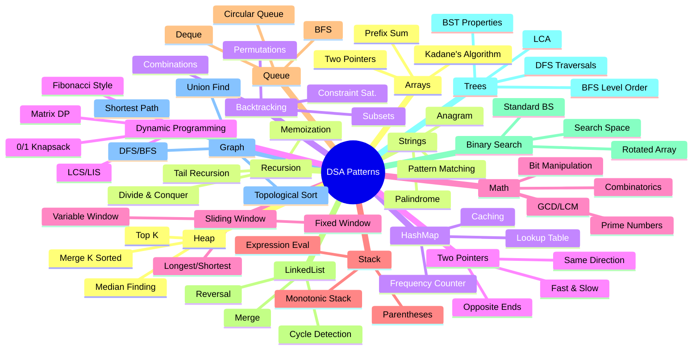
```mermaid
mindmap
  root((DSA Patterns))
    Arrays
      Prefix Sum
      Kadane's Algorithm
      Two Pointers
    Strings
      Palindrome
      Anagram
      Pattern Matching
    HashMap
      Frequency Counter
      Lookup Table
      Caching
    Two Pointers
      Opposite Ends
      Same Direction
      Fast & Slow
    Sliding Window
      Fixed Window
      Variable Window
      Longest/Shortest
    Stack
      Monotonic Stack
      Parentheses
      Expression Eval
    Queue
      BFS
      Deque
      Circular Queue
    LinkedList
      Reversal
      Merge
      Cycle Detection
    Binary Search
      Standard BS
      Rotated Array
      Search Space
    Trees
      DFS Traversals
      BFS Level Order
      BST Properties
      LCA
    Graph
      DFS/BFS
      Topological Sort
      Union Find
      Shortest Path
    Heap
      Top K
      Median Finding
      Merge K Sorted
    Recursion
      Divide & Conquer
      Tail Recursion
      Memoization
    Backtracking
      Permutations
      Combinations
      Subsets
      Constraint Sat.
    Dynamic Programming
      0/1 Knapsack
      LCS/LIS
      Matrix DP
      Fibonacci Style
    Math
      GCD/LCM
      Prime Numbers
      Combinatorics
      Bit Manipulation
```

---

## 🔄 Decision Tree: Which Pattern to Use?

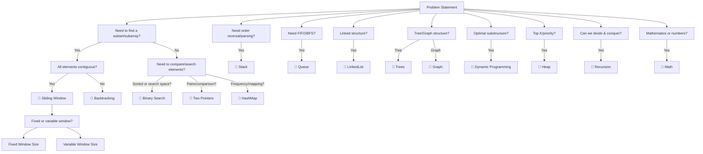
```mermaid
flowchart TD
    Start["Problem Statement"] --> Q1["Need to find a subset/subarray?"]
    Q1 -->|Yes| Q2["All elements contiguous?"]
    Q1 -->|No| Q3["Need to compare/search elements?"]

    Q2 -->|Yes| SW["🔷 Sliding Window"]
    Q2 -->|No| BT["🔷 Backtracking"]

    Q3 -->|"Sorted or search space?"| BS["🔷 Binary Search"]
    Q3 -->|"Pairs/comparison?"| TP["🔷 Two Pointers"]

    SW --> Q4["Fixed or variable window?"]
    Q4 --> Fixed["Fixed Window Size"]
    Q4 --> Variable["Variable Window Size"]

    Q3 -->|"Frequency/mapping?"| HM["🔷 HashMap"]

    Start --> Q5["Need order reversal/parsing?"]
    Q5 -->|Yes| ST["🔷 Stack"]

    Start --> Q6["Need FIFO/BFS?"]
    Q6 -->|Yes| Q["🔷 Queue"]

    Start --> Q7["Linked structure?"]
    Q7 -->|Yes| LL["🔷 LinkedList"]

    Start --> Q8["Tree/Graph structure?"]
    Q8 -->|Tree| TR["🔷 Trees"]
    Q8 -->|Graph| GR["🔷 Graph"]

    Start --> Q9["Optimal substructure?"]
    Q9 -->|Yes| DP["🔷 Dynamic Programming"]

    Start --> Q10["Top K/priority?"]
    Q10 -->|Yes| HP["🔷 Heap"]

    Start --> Q11["Can we divide & conquer?"]
    Q11 -->|Yes| RC["🔷 Recursion"]

    Start --> Q12["Mathematics or numbers?"]
    Q12 -->|Yes| MT["🔷 Math"]
```

---

## Pattern Frequency Analysis (Service-Based Companies)

| Pattern | TCS | Infosys | Wipro | Accenture | Cognizant | HCL | TechM | Frequency |
|---------|:---:|:-------:|:----:|:---------:|:---------:|:---:|:-----:|:---------:|
| Arrays | ⭐⭐⭐ | ⭐⭐⭐ | ⭐⭐⭐ | ⭐⭐⭐ | ⭐⭐⭐ | ⭐⭐⭐ | ⭐⭐⭐ | **Very High** |
| Strings | ⭐⭐⭐ | ⭐⭐⭐ | ⭐⭐ | ⭐⭐⭐ | ⭐⭐⭐ | ⭐⭐ | ⭐⭐⭐ | **High** |
| HashMap | ⭐⭐⭐ | ⭐⭐⭐ | ⭐⭐⭐ | ⭐⭐⭐ | ⭐⭐⭐ | ⭐⭐⭐ | ⭐⭐⭐ | **Very High** |
| Two Pointers | ⭐⭐ | ⭐⭐ | ⭐⭐ | ⭐⭐ | ⭐⭐ | ⭐⭐ | ⭐⭐ | **Medium** |
| Sliding Window | ⭐⭐ | ⭐⭐ | ⭐⭐ | ⭐⭐ | ⭐ | ⭐⭐ | ⭐⭐ | **Medium** |
| Stack | ⭐⭐⭐ | ⭐⭐ | ⭐⭐ | ⭐⭐ | ⭐⭐ | ⭐⭐ | ⭐⭐ | **High** |
| Queue | ⭐⭐ | ⭐⭐ | ⭐⭐ | ⭐⭐ | ⭐⭐ | ⭐⭐ | ⭐⭐ | **Medium** |
| LinkedList | ⭐⭐⭐ | ⭐⭐⭐ | ⭐⭐ | ⭐⭐ | ⭐⭐ | ⭐⭐ | ⭐⭐ | **High** |
| Binary Search | ⭐⭐⭐ | ⭐⭐⭐ | ⭐⭐⭐ | ⭐⭐⭐ | ⭐⭐ | ⭐⭐⭐ | ⭐⭐⭐ | **Very High** |
| Trees | ⭐⭐ | ⭐⭐ | ⭐⭐ | ⭐⭐ | ⭐⭐ | ⭐⭐ | ⭐⭐ | **Medium** |
| Graph | ⭐ | ⭐⭐ | ⭐ | ⭐⭐ | ⭐ | ⭐ | ⭐ | **Low-Medium** |
| Heap | ⭐⭐ | ⭐⭐ | ⭐⭐ | ⭐⭐ | ⭐⭐ | ⭐ | ⭐⭐ | **Medium** |
| Recursion | ⭐⭐⭐ | ⭐⭐⭐ | ⭐⭐⭐ | ⭐⭐⭐ | ⭐⭐⭐ | ⭐⭐⭐ | ⭐⭐⭐ | **Very High** |
| Backtracking | ⭐⭐ | ⭐⭐ | ⭐⭐ | ⭐⭐ | ⭐⭐ | ⭐⭐ | ⭐⭐ | **Medium** |
| DP | ⭐⭐ | ⭐⭐ | ⭐⭐ | ⭐⭐ | ⭐⭐ | ⭐ | ⭐⭐ | **Medium** |
| Math | ⭐⭐⭐ | ⭐⭐ | ⭐⭐⭐ | ⭐⭐⭐ | ⭐⭐ | ⭐⭐⭐ | ⭐⭐ | **High** |

---

## All Patterns Comparison Table

| Pattern | Time Complexity | Space Complexity | Key Data Structure | Difficulty |
|---------|----------------|-----------------|-------------------|:----------:|
| Arrays | O(n) typical | O(1)–O(n) | List | Easy |
| Strings | O(n)–O(n²) | O(1)–O(n) | String/List | Easy-Med |
| HashMap | O(n) avg | O(n) | Dict | Easy |
| Two Pointers | O(n) | O(1) | Two indices | Easy-Med |
| Sliding Window | O(n) | O(1)–O(k) | Window pointers | Medium |
| Stack | O(n) | O(n) | Stack | Easy-Med |
| Queue | O(n) | O(n) | Queue/Deque | Easy-Med |
| LinkedList | O(n) | O(1) | Node pointers | Medium |
| Binary Search | O(log n) | O(1) | Indices | Easy-Med |
| Trees | O(n) | O(h) height | TreeNode | Medium |
| Graph | O(V+E) | O(V) | Adj List/Matrix | Medium-Hard |
| Heap | O(n log n) | O(n) | heapq | Medium |
| Recursion | O(branches^depth) | O(depth) | Call stack | Medium |
| Backtracking | O(2^n) worst | O(n) | Recursion state | Medium-Hard |
| DP | O(n²) typical | O(n)–O(n²) | DP array | Hard |
| Math | O(√n)–O(n) | O(1) | Variables | Easy-Med |

---

## 1️⃣ Arrays

### When to Use
- Problems involving contiguous subarrays/subsequences
- Need to compute running totals (prefix/suffix sums)
- Rotations, reversals, or rearrangements
- Finding duplicates, missing numbers, or majority elements
- Peaks, valleys, and pattern matching in sequences

### How to Identify
- Input is a **list/array** of numbers or elements
- Problem mentions "subarray", "contiguous", "partition"
- Keywords: "maximum sum", "rotate", "merge", "sorted array"

### Decision Flowchart

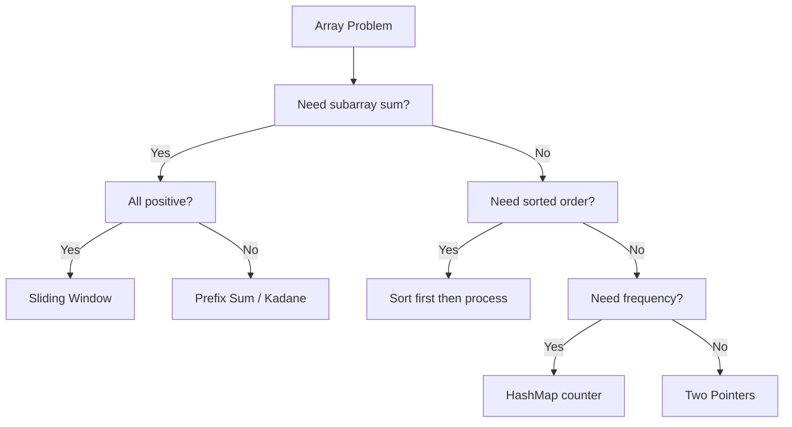
```mermaid
flowchart TD
    A["Array Problem"] --> B["Need subarray sum?"]
    B -->|Yes| C["All positive?"]
    C -->|Yes| D["Sliding Window"]
    C -->|No| E["Prefix Sum / Kadane"]
    B -->|No| F["Need sorted order?"]
    F -->|Yes| G["Sort first then process"]
    F -->|No| H["Need frequency?"]
    H -->|Yes| I["HashMap counter"]
    H -->|No| J["Two Pointers"]
```

### Common Questions
1. **Two Sum** — Find two numbers that add to target
2. **Maximum Subarray (Kadane's)** — Largest sum contiguous subarray
3. **Rotate Array** — Rotate array by k positions
4. **Move Zeroes** — Move all zeros to end maintaining order
5. **Find Missing Number** — Missing number in 1..n

### Complexity
| Operation | Time | Space |
|-----------|:----:|:-----:|
| Access | O(1) | - |
| Search (unsorted) | O(n) | O(1) |
| Search (sorted) | O(log n) | O(1) |
| Insert/Delete (end) | O(1) amortized | O(1) |
| Insert/Delete (middle) | O(n) | O(1) |

### Template: Kadane's Algorithm

```python
def max_subarray_sum(nums: list[int]) -> int:
    curr_sum = max_sum = nums[0]
    for n in nums[1:]:
        curr_sum = max(n, curr_sum + n)
        max_sum = max(max_sum, curr_sum)
    return max_sum
```

### Template: Prefix Sum

```python
def prefix_sum(arr: list[int]) -> list[int]:
    pref = [0] * (len(arr) + 1)
    for i, n in enumerate(arr):
        pref[i + 1] = pref[i] + n
    return pref  # sum(i..j) = pref[j+1] - pref[i]
```

### Template: Two Sum (HashMap)

```python
def two_sum(nums: list[int], target: int) -> list[int]:
    seen = {}
    for i, n in enumerate(nums):
        complement = target - n
        if complement in seen:
            return [seen[complement], i]
        seen[n] = i
    return []
```

💡 **Quick Notes**
- Use `enumerate()` when you need both index and value
- List slicing `arr[i:j]` creates a copy — O(k) time and space
- `arr.sort()` sorts in-place (O(n log n)); `sorted(arr)` returns new list
- Negative indexing is your friend: `arr[-1]` = last element

⚠ **Common Mistakes**
- Off-by-one errors in subarray boundaries
- Confusing `list.copy()` (shallow) vs deep copy
- Modifying list while iterating over it
- Forgetting empty list edge case

---

## 2️⃣ Strings

### When to Use
- Palindrome checking and generation
- Anagram/pattern matching problems
- String transformations and manipulations
- Substring search
- Parsing and encoding/decoding

### How to Identify
- Input is a **string** or array of characters
- Keywords: "palindrome", "anagram", "substring", "pattern"
- Character frequency or ordering matters

### Decision Flowchart

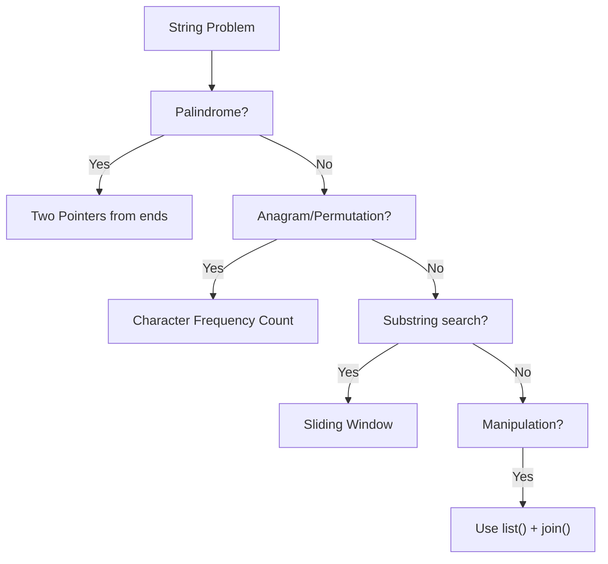
```mermaid
flowchart TD
    S["String Problem"] --> P["Palindrome?"]
    P -->|Yes| T["Two Pointers from ends"]
    P -->|No| A["Anagram/Permutation?"]
    A -->|Yes| C["Character Frequency Count"]
    A -->|No| SS["Substring search?"]
    SS -->|Yes| W["Sliding Window"]
    SS -->|No| M["Manipulation?"]
    M -->|Yes| B["Use list() + join()"]
```

### Common Questions
1. **Valid Palindrome** — Check if string is palindrome (with non-alphanumeric)
2. **Valid Anagram** — Check if two strings are anagrams
3. **Longest Substring Without Repeating Characters** — Sliding window
4. **String to Integer (atoi)** — Manual conversion
5. **Longest Palindromic Substring** — Expand around center

### Complexity

| Operation | Time | Space |
|-----------|:----:|:-----:|
| Character access | O(1) | - |
| Concatenation (+) | O(n+m) | O(n+m) |
| Substring `s[i:j]` | O(k) | O(k) |
| Search `in` | O(n) | O(1) |
| Join `''.join(list)` | O(n) | O(n) |

### Template: Palindrome Check

```python
def is_palindrome(s: str) -> bool:
    l, r = 0, len(s) - 1
    while l < r:
        if s[l] != s[r]:
            return False
        l, r = l + 1, r - 1
    return True
```

### Template: Anagram Check

```python
from collections import Counter

def is_anagram(s: str, t: str) -> bool:
    return Counter(s) == Counter(t)
```

### Template: Expand Around Center

```python
def longest_palindrome(s: str) -> str:
    def expand(l: int, r: int) -> str:
        while l >= 0 and r < len(s) and s[l] == s[r]:
            l, r = l - 1, r + 1
        return s[l+1:r]

    result = ""
    for i in range(len(s)):
        odd = expand(i, i)
        even = expand(i, i + 1)
        result = max(result, odd, even, key=len)
    return result
```

💡 **Quick Notes**
- Strings are **immutable** in Python — every operation creates a new string
- Use `list(s)` to convert for mutable operations, then `''.join(list)`
- `s[::-1]` reverses a string (O(n))
- For building strings in loops, use list + `''.join()` instead of `+=`

⚠ **Common Mistakes**
- Forgetting strings are immutable (modification creates new objects)
- Using `+` concatenation in loops (O(n²) — use `join()` instead)
- Not accounting for uppercase/lowercase in palindrome checks
- Off-by-one in substring boundaries

---

## 3️⃣ HashMap / Dictionary

### When to Use
- Counting frequencies of elements
- Looking up values by key in O(1)
- Caching/memoization
- Grouping elements by some property
- Detecting duplicates

### How to Identify
- Need to associate values with keys
- "Count occurrences", "frequency", "group by"
- Problems that need O(1) lookups
- Trade-off: more space for faster time

### Decision Flowchart

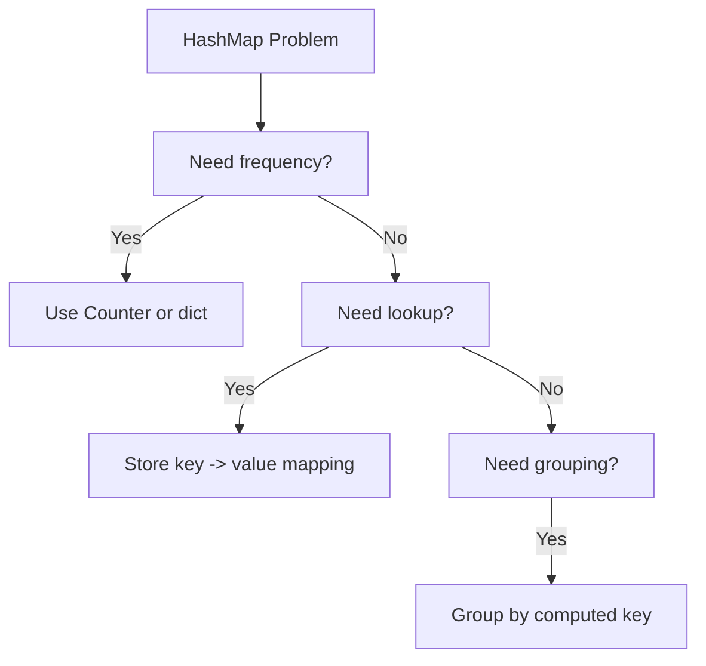
```mermaid
flowchart TD
    H["HashMap Problem"] --> F["Need frequency?"]
    F -->|Yes| C["Use Counter or dict"]
    F -->|No| L["Need lookup?"]
    L -->|Yes| M["Store key -> value mapping"]
    L -->|No| G["Need grouping?"]
    G -->|Yes| D["Group by computed key"]
```

### Common Questions
1. **Two Sum** — Find pair with target sum
2. **Group Anagrams** — Group strings that are anagrams
3. **First Non-Repeating Character** — Frequency scan
4. **Subarray Sum Equals K** — Prefix sum + hashmap
5. **Contains Duplicate** — Check for duplicates

### Complexity

| Operation | Average | Worst |
|-----------|:-------:|:-----:|
| Get/Set/Delete | O(1) | O(n) |
| Iteration | O(n) | O(n) |
| `in` check | O(1) | O(n) |

### Template: Frequency Counter

```python
from collections import Counter

def frequency_counter(arr: list) -> dict:
    return Counter(arr)  # Most common: counter.most_common(k)
```

### Template: Group Anagrams

```python
from collections import defaultdict

def group_anagrams(strs: list[str]) -> list[list[str]]:
    groups = defaultdict(list)
    for s in strs:
        key = ''.join(sorted(s))
        groups[key].append(s)
    return list(groups.values())
```

### Template: Subarray Sum Equals K

```python
def subarray_sum(nums: list[int], k: int) -> int:
    prefix_sum, count = 0, 0
    sum_map = {0: 1}
    for n in nums:
        prefix_sum += n
        count += sum_map.get(prefix_sum - k, 0)
        sum_map[prefix_sum] = sum_map.get(prefix_sum, 0) + 1
    return count
```

💡 **Quick Notes**
- `defaultdict(list)` / `defaultdict(int)` eliminates key checks
- `Counter` has useful methods: `most_common()`, `elements()`, `subtract()`
- Dict preserves insertion order (Python 3.7+)
- Use `.get(key, default)` to avoid KeyError

⚠ **Common Mistakes**
- Modifying dict while iterating (use `list(dict.items())` copy)
- Forgetting that dict keys must be **hashable** (list is not; use tuple)
- Using mutable default values in `defaultdict`
- Not handling missing keys gracefully

---

## 4️⃣ Two Pointers

### When to Use
- Sorted arrays (opposite direction pointers)
- Removing duplicates in-place
- Finding pairs that satisfy a condition
- Partitioning arrays
- Comparing from both ends

### How to Identify
- Array is **sorted** (or can be sorted)
- Need to find pairs/triplets
- "In-place", "without extra space"
- Compare elements from opposite ends

### Decision Flowchart

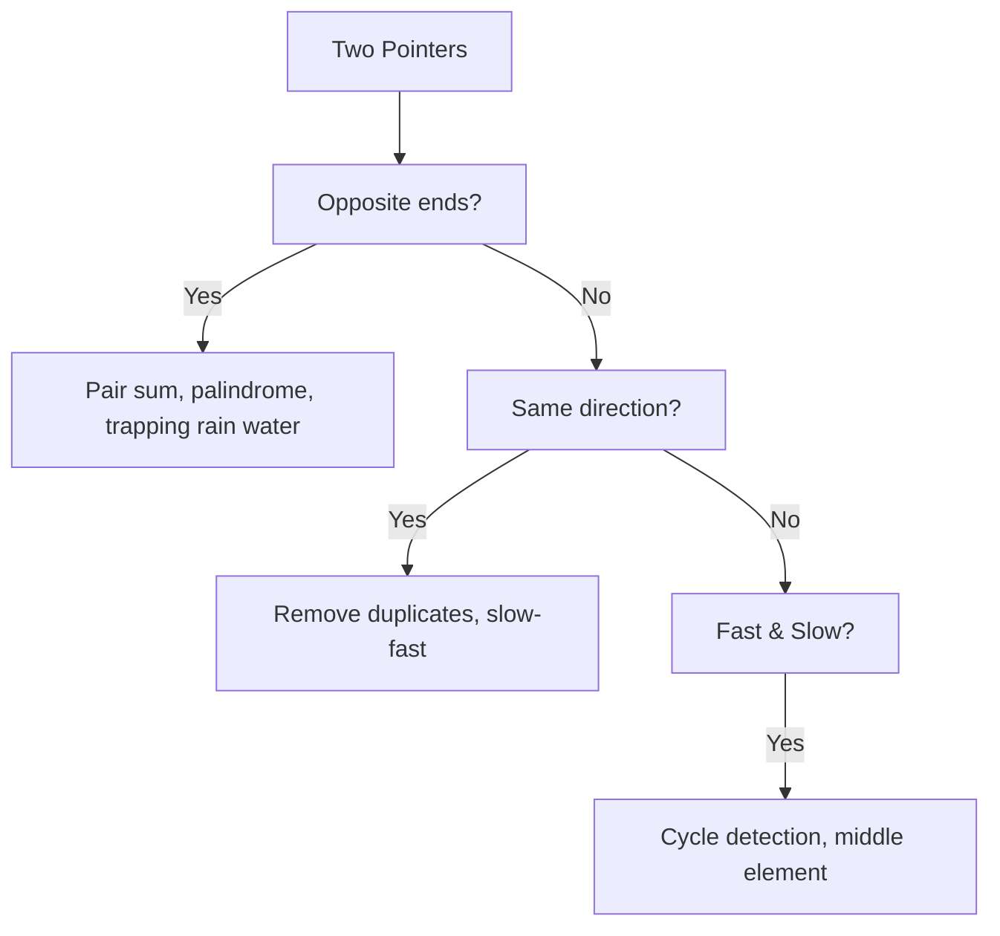
```mermaid
flowchart TD
    TP["Two Pointers"] --> O["Opposite ends?"]
    O -->|Yes| P["Pair sum, palindrome, trapping rain water"]
    O -->|No| S["Same direction?"]
    S -->|Yes| R["Remove duplicates, slow-fast"]
    S -->|No| F["Fast & Slow?"]
    F -->|Yes| D["Cycle detection, middle element"]
```

### Common Questions
1. **Two Sum II (Sorted)** — Find pair in sorted array
2. **Remove Duplicates** — In-place from sorted array
3. **Three Sum** — Find all triplets summing to zero
4. **Container With Most Water** — Max area between lines
5. **Trapping Rain Water** — Water trapped between bars

### Complexity

| Variant | Time | Space |
|---------|:----:|:-----:|
| Opposite ends | O(n) | O(1) |
| Same direction | O(n) | O(1) |
| Fast & Slow | O(n) | O(1) |

### Template: Opposite Ends (Pair Sum)

```python
def two_sum_sorted(nums: list[int], target: int) -> list[int]:
    l, r = 0, len(nums) - 1
    while l < r:
        curr = nums[l] + nums[r]
        if curr == target:
            return [l, r]
        elif curr < target:
            l += 1
        else:
            r -= 1
    return [-1, -1]
```

### Template: In-Place Removal

```python
def remove_duplicates(nums: list[int]) -> int:
    if not nums:
        return 0
    w = 1
    for i in range(1, len(nums)):
        if nums[i] != nums[i - 1]:
            nums[w] = nums[i]
            w += 1
    return w  # new length
```

💡 **Quick Notes**
- Two pointers often reduce O(n²) to O(n)
- Works on both arrays and strings
- Left pointer is write position, right is read position (same direction)
- Common variant: three pointers for partition (Dutch flag)

⚠ **Common Mistakes**
- Forgetting to move both pointers after a match
- Infinite loop if pointers don't progress
- Not handling empty/single-element arrays
- Confusing left and right boundaries

---

## 5️⃣ Sliding Window

### When to Use
- Subarray/substring with specific properties
- "Maximum/minimum/longest/shortest" subarray
- Fixed or variable window size
- Contiguous elements

### How to Identify
- "Subarray" or "substring" with constraints
- Asked to find longest/shortest/minimum/maximum
- Window of size k or variable
- Array/string traversal with overlapping windows

### Decision Flowchart

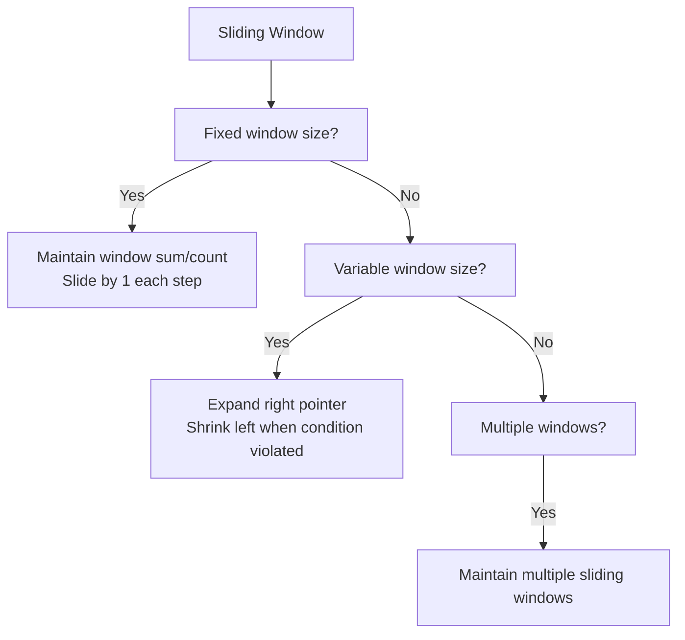
```mermaid
flowchart TD
    SW["Sliding Window"] --> FX["Fixed window size?"]
    FX -->|Yes| FW["Maintain window sum/count\nSlide by 1 each step"]
    FX -->|No| VW["Variable window size?"]
    VW -->|Yes| E["Expand right pointer\nShrink left when condition violated"]
    VW -->|No| M["Multiple windows?"]
    M -->|Yes| MW["Maintain multiple sliding windows"]
```

### Common Questions
1. **Maximum Sum Subarray of Size K** — Fixed window
2. **Longest Substring Without Repeating Characters** — Variable window
3. **Minimum Window Substring** — Variable window
4. **Longest Repeating Character Replacement** — Variable with optimization
5. **Fruit Into Baskets** — Variable (max 2 types)

### Complexity

| Variant | Time | Space |
|---------|:----:|:-----:|
| Fixed | O(n) | O(1) |
| Variable | O(n) | O(k) window |
| With hashmap | O(n) | O(k) |

### Template: Fixed Window

```python
def max_sum_fixed(arr: list[int], k: int) -> int:
    if len(arr) < k:
        return -1
    window_sum = sum(arr[:k])
    max_sum = window_sum
    for i in range(k, len(arr)):
        window_sum += arr[i] - arr[i - k]
        max_sum = max(max_sum, window_sum)
    return max_sum
```

### Template: Variable Window (Longest Without Repeating)

```python
def length_of_longest_substring(s: str) -> int:
    seen = set()
    l = max_len = 0
    for r in range(len(s)):
        while s[r] in seen:
            seen.remove(s[l])
            l += 1
        seen.add(s[r])
        max_len = max(max_len, r - l + 1)
    return max_len
```

💡 **Quick Notes**
- Window = `arr[l:r]`, expand `r++`, shrink `l++`
- Fixed window: add new, remove oldest → O(1) per step
- Variable window: expand r until condition breaks, then shrink l
- Use dict to track character positions, set for existence

⚠ **Common Mistakes**
- Not handling window smaller than k
- Off-by-one in window boundaries (r-l vs r-l+1)
- Forgetting to update min/max inside the loop
- Not resetting window state correctly

---

## 6️⃣ Stack

### When to Use
- Nested structures (parentheses, HTML tags)
- Expression evaluation
- Undo/redo functionality
- Monotonic property (next greater element)
- Reversing order

### How to Identify
- LIFO (Last In First Out) behavior needed
- "Parentheses", "brackets", "expression evaluation"
- "Next greater element", "nearest smaller"
- Undo/backtrack operations

### Decision Flowchart

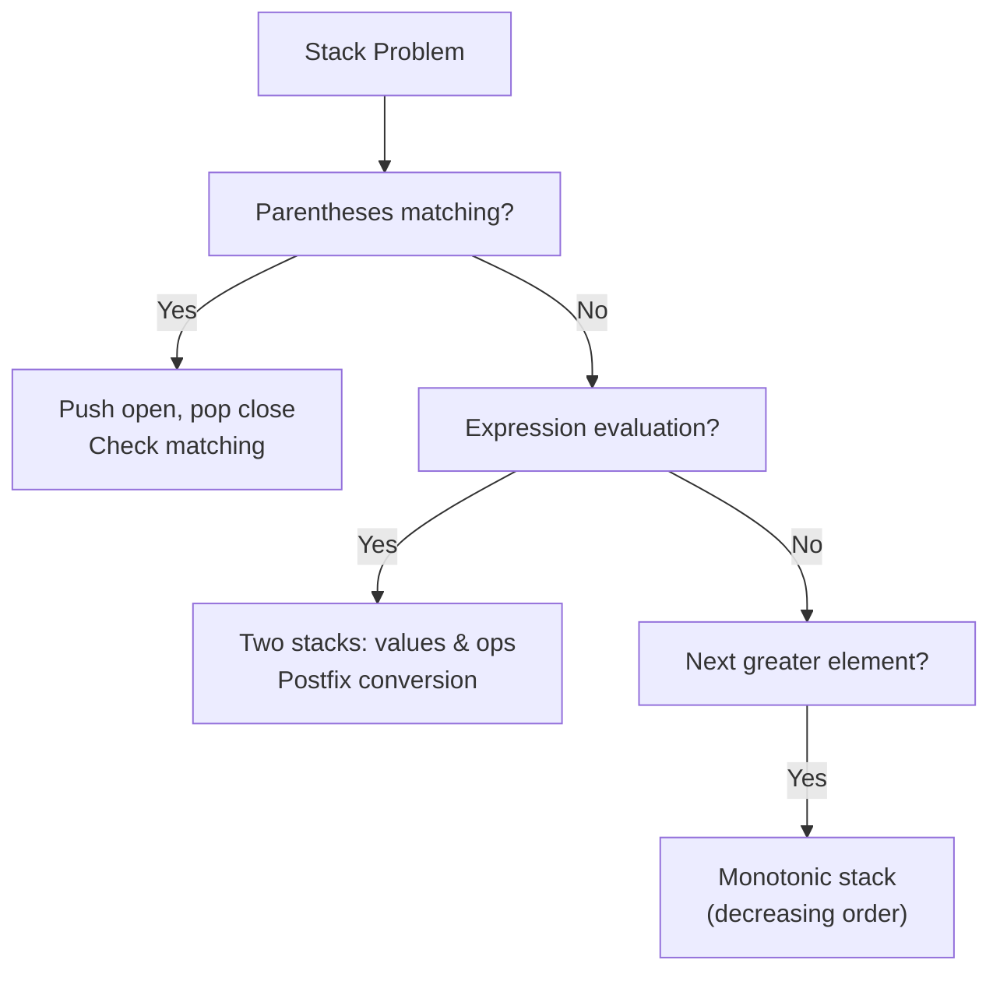
```mermaid
flowchart TD
    ST["Stack Problem"] --> P["Parentheses matching?"]
    P -->|Yes| M["Push open, pop close\nCheck matching"]
    P -->|No| E["Expression evaluation?"]
    E -->|Yes| V["Two stacks: values & ops\nPostfix conversion"]
    E -->|No| N["Next greater element?"]
    N -->|Yes| MS["Monotonic stack\n(decreasing order)"]
```

### Common Questions
1. **Valid Parentheses** — Check bracket matching
2. **Next Greater Element** — Find next larger element
3. **Min Stack** — Stack supporting getMin in O(1)
4. **Daily Temperatures** — Days until warmer
5. **Evaluate Reverse Polish Notation** — Postfix evaluation

### Complexity

| Operation | Time | Space |
|-----------|:----:|:-----:|
| Push/Pop/Peek | O(1) | O(n) total |
| Monotonic stack | O(n) | O(n) |

### Template: Valid Parentheses

```python
def is_valid(s: str) -> bool:
    pairs = {')': '(', ']': '[', '}': '{'}
    stack = []
    for c in s:
        if c in pairs:
            if not stack or stack.pop() != pairs[c]:
                return False
        else:
            stack.append(c)
    return not stack
```

### Template: Monotonic Stack (Next Greater)

```python
def next_greater(nums: list[int]) -> list[int]:
    result = [-1] * len(nums)
    stack = []
    for i, n in enumerate(nums):
        while stack and n > nums[stack[-1]]:
            result[stack.pop()] = n
        stack.append(i)
    return result
```

💡 **Quick Notes**
- Use list as stack: `append()` for push, `pop()` for pop
- For two-stack problems, maintain auxiliary min/state stack
- Monotonic stacks are **decreasing** for next greater, **increasing** for next smaller
- Stack + hashmap is a powerful combo (like in daily temperatures)

⚠ **Common Mistakes**
- Not checking if stack is empty before pop
- Confusing LIFO vs FIFO behavior
- Forgetting closing bracket should match the most recent open bracket
- Stack overflow with deep recursion

---

## 7️⃣ Queue

### When to Use
- BFS on trees/graphs
- Level-order traversal
- Scheduling tasks
- Sliding window maximum (deque)
- Producer-consumer patterns

### How to Identify
- FIFO (First In First Out) processing needed
- "Level order", "BFS", "sliding window maximum"
- Processing in order of arrival

### Decision Flowchart

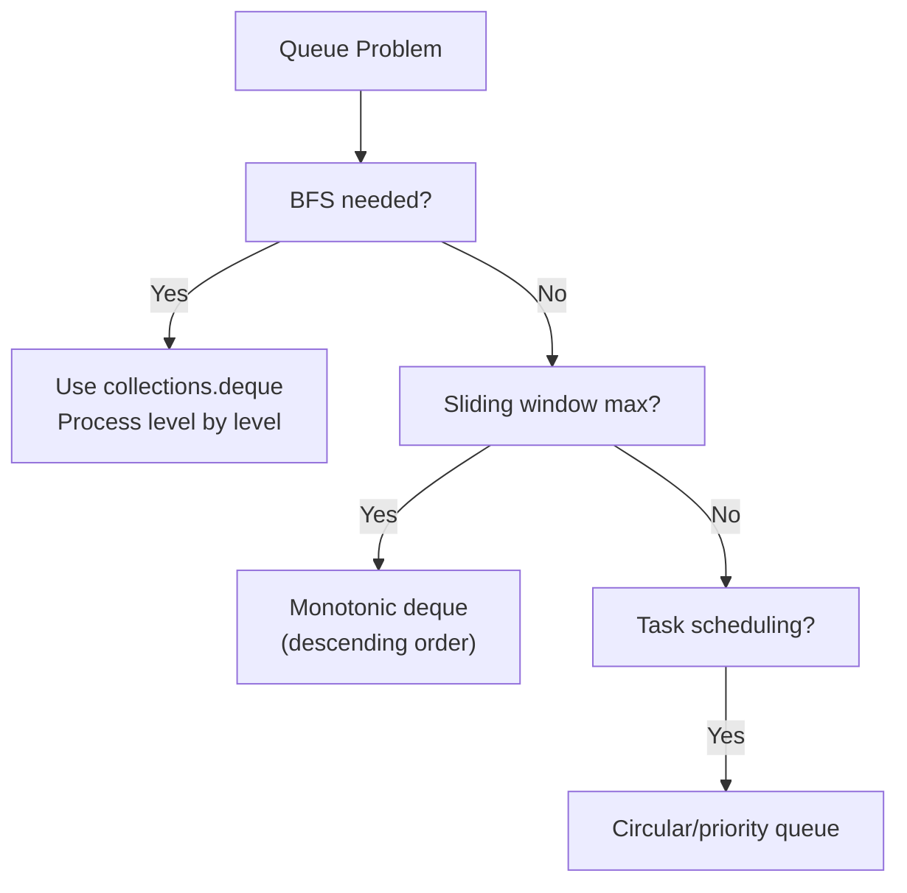
```mermaid
flowchart TD
    QP["Queue Problem"] --> B["BFS needed?"]
    B -->|Yes| BF["Use collections.deque\nProcess level by level"]
    B -->|No| SW["Sliding window max?"]
    SW -->|Yes| DQ["Monotonic deque\n(descending order)"]
    SW -->|No| T["Task scheduling?"]
    T -->|Yes| CQ["Circular/priority queue"]
```

### Common Questions
1. **Binary Tree Level Order Traversal** — BFS using queue
2. **Sliding Window Maximum** — Deque optimization
3. **Rotting Oranges** — Multi-source BFS
4. **Design Hit Counter** — Queue-based timestamp tracking
5. **Implement Stack Using Queues** — Queue manipulation

### Complexity

| Operation | Time | Space |
|-----------|:----:|:-----:|
| Enqueue/Dequeue | O(1) | O(n) total |
| Peek | O(1) | - |
| BFS traversal | O(V+E) | O(V) |

### Template: BFS Level Order

```python
from collections import deque

def level_order(root) -> list[list[int]]:
    if not root:
        return []
    result, q = [], deque([root])
    while q:
        level = []
        for _ in range(len(q)):
            node = q.popleft()
            level.append(node.val)
            if node.left: q.append(node.left)
            if node.right: q.append(node.right)
        result.append(level)
    return result
```

### Template: Sliding Window Maximum (Deque)

```python
from collections import deque

def max_sliding_window(nums: list[int], k: int) -> list[int]:
    dq = deque()
    result = []
    for i, n in enumerate(nums):
        while dq and nums[dq[-1]] < n:
            dq.pop()
        dq.append(i)
        if dq[0] <= i - k:
            dq.popleft()
        if i >= k - 1:
            result.append(nums[dq[0]])
    return result
```

💡 **Quick Notes**
- `collections.deque` for O(1) append/pop from both ends
- Use for BFS patterns (tree level order, shortest path)
- Deque + monotonic = sliding window problems
- Queue is **abstract** in Python — use deque or queue.Queue

⚠ **Common Mistakes**
- Using list as queue (pop(0) is O(n))
- Forgetting to import deque from collections
- Not tracking level sizes in BFS
- Off-by-one in window boundaries

---

## 8️⃣ LinkedList

### When to Use
- Sequential data with dynamic size
- Need efficient insertions/deletions at both ends
- Problems involving list reversal
- Cycle detection
- Merging sorted lists

### How to Identify
- Problem explicitly mentions "linked list" or ListNode
- "Reverse", "merge", "detect cycle", "find middle"
- Need constant-time insertions/deletions

### Decision Flowchart

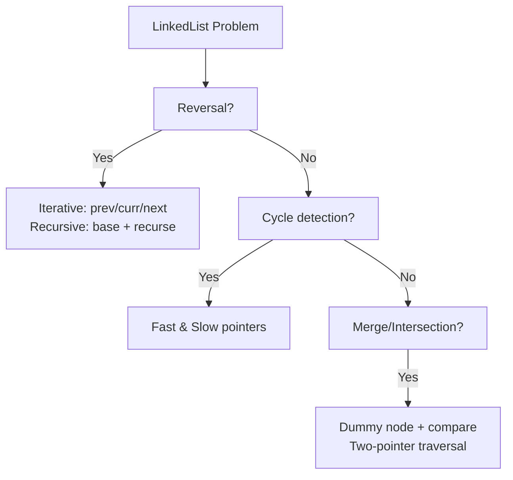
```mermaid
flowchart TD
    LL["LinkedList Problem"] --> R["Reversal?"]
    R -->|Yes| RV["Iterative: prev/curr/next\nRecursive: base + recurse"]
    R -->|No| C["Cycle detection?"]
    C -->|Yes| FS["Fast & Slow pointers"]
    C -->|No| M["Merge/Intersection?"]
    M -->|Yes| MR["Dummy node + compare\nTwo-pointer traversal"]
```

### Common Questions
1. **Reverse a Linked List** — Iterative and recursive
2. **Detect Cycle** — Floyd's cycle detection
3. **Merge Two Sorted Lists** — Dummy node technique
4. **Find Middle of Linked List** — Fast & slow pointers
5. **Remove Nth Node From End** — Two-pointer with offset

### Complexity

| Operation | Singly | Doubly |
|-----------|:------:|:------:|
| Access by index | O(n) | O(n) |
| Search | O(n) | O(n) |
| Insert at head | O(1) | O(1) |
| Insert at tail | O(n)* | O(1) |
| Delete | O(1) known node | O(1) |

*O(1) with tail pointer

### Template: Reverse Linked List

```python
def reverse_list(head: ListNode) -> ListNode:
    prev = None
    curr = head
    while curr:
        next_node = curr.next
        curr.next = prev
        prev = curr
        curr = next_node
    return prev
```

### Template: Floyd's Cycle Detection

```python
def has_cycle(head: ListNode) -> bool:
    slow = fast = head
    while fast and fast.next:
        slow = slow.next
        fast = fast.next.next
        if slow == fast:
            return True
    return False
```

### Template: Merge Two Sorted Lists

```python
def merge_two_lists(l1: ListNode, l2: ListNode) -> ListNode:
    dummy = curr = ListNode()
    while l1 and l2:
        if l1.val <= l2.val:
            curr.next = l1
            l1 = l1.next
        else:
            curr.next = l2
            l2 = l2.next
        curr = curr.next
    curr.next = l1 or l2
    return dummy.next
```

💡 **Quick Notes**
- Dummy node pattern simplifies head modification
- Fast & slow pointer solves 80% of linked list problems
- Always draw the list when reasoning — track prev/curr/next
- Recursive reversal: `head.next.next = head; head.next = None`

⚠ **Common Mistakes**
- Losing reference to next node when reassigning pointers
- Not handling empty list (null head)
- Forgetting to advance pointers in loops
- Creating cycles accidentally

---

## 9️⃣ Binary Search

### When to Use
- Sorted array or rotated sorted array
- Search space can be divided by a condition
- Finding boundaries/peaks in monotonic functions
- "Minimum of maximum" or "maximum of minimum"
- Time complexity requirement: O(log n)

### How to Identify
- Input is **sorted** (or can be sorted)
- Finding an element or insertion position
- "Search in rotated array", "find peak", "square root"
- Reducing search space by half each step

### Decision Flowchart

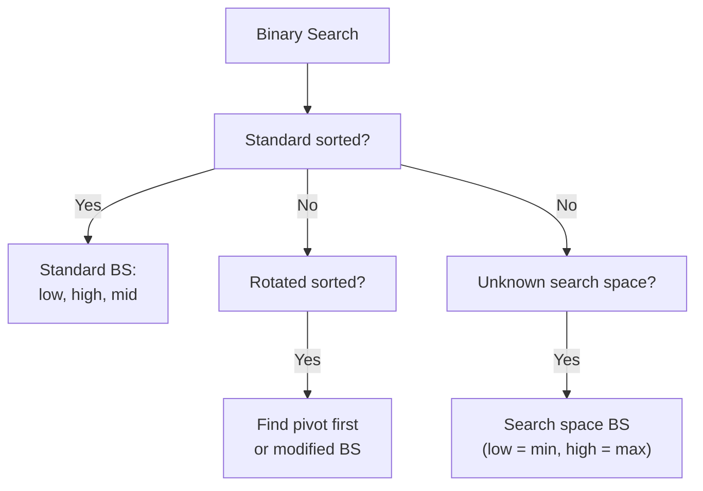
```mermaid
flowchart TD
    BS["Binary Search"] --> S["Standard sorted?"]
    S -->|Yes| SB["Standard BS:\nlow, high, mid"]
    S -->|No| R["Rotated sorted?"]
    R -->|Yes| RB["Find pivot first\nor modified BS"]
    S -->|No| U["Unknown search space?"]
    U -->|Yes| UB["Search space BS\n(low = min, high = max)"]
```

### Common Questions
1. **Binary Search (Classic)** — Find target in sorted array
2. **Find First/Last Position** — Lower/upper bound
3. **Search in Rotated Sorted Array** — Modified binary search
4. **Find Peak Element** — Mountain in array
5. **Square Root of Integer** — Search space method

### Complexity

| Variant | Time | Space |
|---------|:----:|:-----:|
| Standard | O(log n) | O(1) |
| Search space | O(log range) | O(1) |
| On rotated | O(log n) | O(1) |

### Template: Standard Binary Search

```python
def binary_search(nums: list[int], target: int) -> int:
    l, r = 0, len(nums) - 1
    while l <= r:
        mid = (l + r) // 2
        if nums[mid] == target:
            return mid
        elif nums[mid] < target:
            l = mid + 1
        else:
            r = mid - 1
    return -1
```

### Template: Lower Bound (First Occurrence)

```python
def lower_bound(nums: list[int], target: int) -> int:
    l, r = 0, len(nums)  # r exclusive
    while l < r:
        mid = (l + r) // 2
        if nums[mid] < target:
            l = mid + 1
        else:
            r = mid
    return l  # first index >= target
```

💡 **Quick Notes**
- Three common mid calculations: `(l+r)//2`, `l + (r-l)//2` (overflow-safe), `(l+r)>>1`
- For lower bound vs upper bound: `nums[mid] < target` vs `nums[mid] <= target`
- Infinite loops come from not updating l or r properly
- Search space BS works when answer is between known min and max

⚠ **Common Mistakes**
- Off-by-one in loop condition (l <= r vs l < r)
- Integer overflow with `(l+r)//2` (Python handles big ints, but good practice)
- Not updating boundaries correctly (mid+1 vs mid, mid-1 vs mid)
- Infinite loop when mid doesn't change

---

## 🔟 Trees

### When to Use
- Hierarchical data
- BST operations
- Tree traversals (preorder, inorder, postorder, level order)
- Finding paths, LCA, diameter
- Serialization/Deserialization

### How to Identify
- TreeNode class with left/right pointers
- "Binary tree", "BST", "binary search tree"
- Tree traversal, path from root to leaf
- "LCA", "diameter", "max depth"

### Decision Flowchart

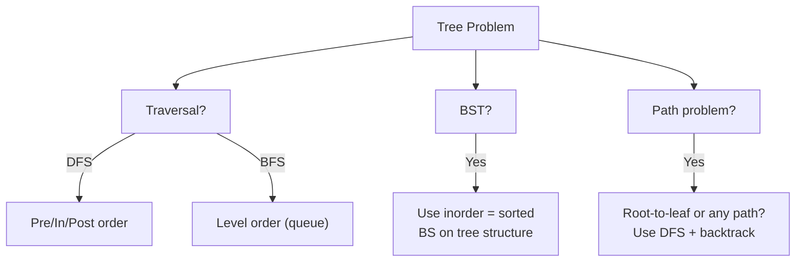
```mermaid
flowchart TD
    TR["Tree Problem"] --> TRV["Traversal?"]
    TRV -->|DFS| D["Pre/In/Post order"]
    TRV -->|BFS| B["Level order (queue)"]
    TR --> BST["BST?"]
    BST -->|Yes| P["Use inorder = sorted\nBS on tree structure"]
    TR --> PATH["Path problem?"]
    PATH -->|Yes| RCR["Root-to-leaf or any path?\nUse DFS + backtrack"]
```

### Common Questions
1. **Maximum Depth of Binary Tree** — Recursive height
2. **Validate BST** — Inorder traversal or range check
3. **Binary Tree Level Order Traversal** — BFS
4. **Lowest Common Ancestor** — Recursive LCA
5. **Diameter of Binary Tree** — Max path through any node

### Complexity

| Operation | Time | Space |
|-----------|:----:|:-----:|
| Traversal (DFS) | O(n) | O(h) height |
| Traversal (BFS) | O(n) | O(w) width |
| BST Search | O(log n) avg | O(h) |
| BST Insert | O(log n) avg | O(h) |

### Template: Binary Tree DFS (Recursive)

```python
def inorder(root) -> list[int]:
    if not root:
        return []
    return inorder(root.left) + [root.val] + inorder(root.right)

def preorder(root) -> list[int]:
    if not root:
        return []
    return [root.val] + preorder(root.left) + preorder(root.right)

def postorder(root) -> list[int]:
    if not root:
        return []
    return postorder(root.left) + postorder(root.right) + [root.val]
```

### Template: Validate BST

```python
def is_valid_bst(root) -> bool:
    def validate(node, low=float('-inf'), high=float('inf')):
        if not node:
            return True
        if node.val <= low or node.val >= high:
            return False
        return (validate(node.left, low, node.val) and
                validate(node.right, node.val, high))
    return validate(root)
```

💡 **Quick Notes**
- Recursion is natural for trees — base case is `not root`
- Inorder BST → sorted array
- For iterative DFS, use explicit stack (preorder: push right then left)
- Level order = BFS = queue; depth = max(left, right) + 1

⚠ **Common Mistakes**
- Forgetting null checks before accessing left/right
- Not passing min/max bounds in BST validation
- Confusing recursion returns (height vs path)
- Stack overflow on deep trees (use iterative)

---

## 1️⃣1️⃣ Graph

### When to Use
- Connected components, islands
- Shortest path problems
- Dependency resolution (topological sort)
- Cycle detection
- Network/relationship problems

### How to Identify
- Nodes and edges explicitly defined
- "Connected components", "shortest path", "topological sort"
- Grid problems (each cell is a node)
- "Islands", "maze", "network"

### Decision Flowchart

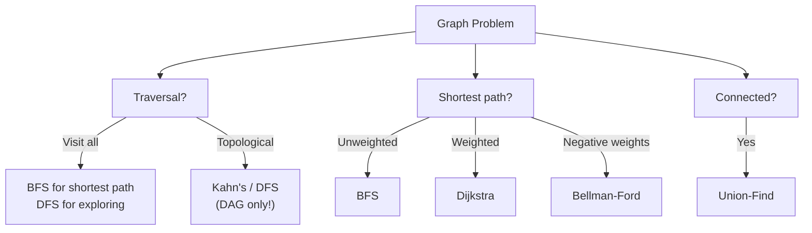
```mermaid
flowchart TD
    GR["Graph Problem"] --> T["Traversal?"]
    T -->|Visit all| BFS["BFS for shortest path\nDFS for exploring"]
    T -->|Topological| TS["Kahn's / DFS\n(DAG only!)"]
    GR --> SP["Shortest path?"]
    SP -->|Unweighted| B["BFS"]
    SP -->|Weighted| D["Dijkstra"]
    SP -->|Negative weights| BE["Bellman-Ford"]
    GR --> CONN["Connected?"]
    CONN -->|Yes| UF["Union-Find"]
```

### Common Questions
1. **Number of Islands** — DFS/BFS on grid
2. **Clone Graph** — Hashmap + DFS/BFS
3. **Course Schedule** — Topological sort / cycle detection
4. **Word Ladder** — BFS shortest path
5. **Pacific Atlantic Water Flow** — Multi-source BFS/DFS

### Complexity

| Algorithm | Time | Space |
|-----------|:----:|:-----:|
| DFS/BFS | O(V+E) | O(V) |
| Dijkstra | O((V+E) log V) | O(V) |
| Topological Sort | O(V+E) | O(V) |
| Union-Find | O(α(n)) ≈ O(1) | O(n) |

### Template: BFS (Shortest Path in Grid)

```python
from collections import deque

def bfs_grid(grid: list[list[int]]) -> int:
    rows, cols = len(grid), len(grid[0])
    q = deque([(0, 0)])
    visited = {(0, 0)}
    steps = 0
    dirs = [(1,0), (-1,0), (0,1), (0,-1)]

    while q:
        for _ in range(len(q)):
            r, c = q.popleft()
            if (r, c) == (rows-1, cols-1):
                return steps
            for dr, dc in dirs:
                nr, nc = r+dr, c+dc
                if 0 <= nr < rows and 0 <= nc < cols and (nr, nc) not in visited:
                    visited.add((nr, nc))
                    q.append((nr, nc))
        steps += 1
    return -1
```

### Template: Union-Find

```python
class UnionFind:
    def __init__(self, n: int):
        self.parent = list(range(n))
        self.rank = [0] * n

    def find(self, x: int) -> int:
        if self.parent[x] != x:
            self.parent[x] = self.find(self.parent[x])
        return self.parent[x]

    def union(self, x: int, y: int) -> None:
        px, py = self.find(x), self.find(y)
        if px == py:
            return
        if self.rank[px] < self.rank[py]:
            self.parent[px] = py
        elif self.rank[px] > self.rank[py]:
            self.parent[py] = px
        else:
            self.parent[py] = px
            self.rank[px] += 1
```

💡 **Quick Notes**
- BFS → shortest path in **unweighted** graph
- DFS → exploring all nodes, topological sort, cycles
- Always track visited nodes to avoid infinite loops
- Grid is a graph: cell = node, neighbors = edges

⚠ **Common Mistakes**
- Not marking visited before enqueuing (causes duplicates)
- Stack overflow in deep DFS (use iterative)
- Forgetting graphs can be **disconnected**
- Not checking grid boundaries in neighbor logic

---

## 1️⃣2️⃣ Heap

### When to Use
- Finding top K largest/smallest elements
- Median in a stream
- Merging K sorted arrays
- Priority-based scheduling
- Running median/mode

### How to Identify
- "Kth largest/smallest", "top K frequent"
- "Median in a data stream"
- "Merge K sorted lists"
- Need efficient min/max extraction

### Decision Flowchart

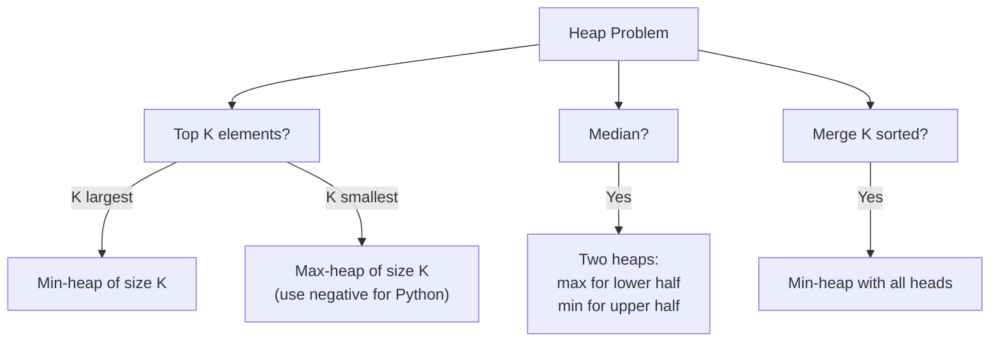
```mermaid
flowchart TD
    HP["Heap Problem"] --> TK["Top K elements?"]
    TK -->|K largest| MH["Min-heap of size K"]
    TK -->|K smallest| XH["Max-heap of size K\n(use negative for Python)"]
    HP --> M["Median?"]
    M -->|Yes| MM["Two heaps:\nmax for lower half\nmin for upper half"]
    HP --> MK["Merge K sorted?"]
    MK -->|Yes| MQ["Min-heap with all heads"]
```

### Common Questions
1. **Kth Largest Element** — Min-heap of size K
2. **Top K Frequent Elements** — Counter + heap
3. **Find Median from Data Stream** — Two heaps
4. **Merge K Sorted Lists** — Min-heap of heads
5. **Kth Smallest Element in Sorted Matrix** — Heap + BFS

### Complexity

| Operation | Time | Space |
|-----------|:----:|:-----:|
| Push/Pop | O(log n) | O(n) |
| Peek | O(1) | - |
| Heapify | O(n) | O(1) extra |
| Top K | O(n log k) | O(k) |

### Template: Kth Largest

```python
import heapq

def find_kth_largest(nums: list[int], k: int) -> int:
    heap = nums[:k]
    heapq.heapify(heap)
    for n in nums[k:]:
        heapq.heappushpop(heap, n)
    return heap[0]
```

### Template: Median from Stream

```python
import heapq

class MedianFinder:
    def __init__(self):
        self.small = []  # max-heap (store negative)
        self.large = []  # min-heap

    def addNum(self, num: int) -> None:
        heapq.heappush(self.small, -num)
        heapq.heappush(self.large, -heapq.heappop(self.small))
        if len(self.small) < len(self.large):
            heapq.heappush(self.small, -heapq.heappop(self.large))

    def findMedian(self) -> float:
        if len(self.small) > len(self.large):
            return -self.small[0]
        return (-self.small[0] + self.large[0]) / 2.0
```

💡 **Quick Notes**
- Python's `heapq` is a **min-heap** — negate values for max-heap
- `heapq.heappushpop(heap, item)` = push + pop in one O(log n) operation
- `heapq.nlargest(k, iterable)` and `nsmallest` are convenience wrappers
- For Top K: min-heap of size K for K largest, max-heap for K smallest

⚠ **Common Mistakes**
- Forgetting Python's heapq is a min-heap only
- Not using `heappushpop` for efficiency in top-k
- Confusing `heapq` methods (they modify in-place, no return for heapify)
- O(n log n) instead of O(n log k) — keep heap size k!

---

## 1️⃣3️⃣ Recursion

### When to Use
- Problem can be broken into smaller subproblems
- Tree/Graph traversal
- Divide and Conquer
- Problem naturally has recursive structure (factorial, Fibonacci)
- Backtracking / permutation generation

### How to Identify
- Problem can be expressed in terms of itself
- Base case is obvious (n=0, n=1, empty input)
- "Divide and conquer", "recursive solution"
- Fibonacci, factorial, tower of Hanoi

### Decision Flowchart

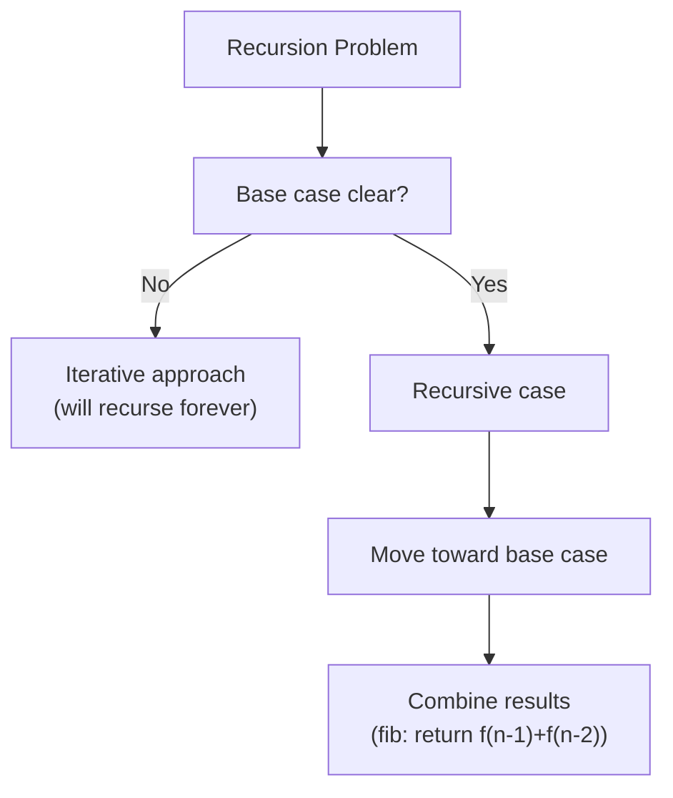
```mermaid
flowchart TD
    RC["Recursion Problem"] --> BC["Base case clear?"]
    BC -->|No| I["Iterative approach\n(will recurse forever)"]
    BC -->|Yes| RP["Recursive case"]
    RP --> MV["Move toward base case"]
    MV --> CM["Combine results\n(fib: return f(n-1)+f(n-2))"]
```

### Common Questions
1. **Fibonacci Number** — Classic recursion + memoization
2. **Factorial** — n! = n * (n-1)!
3. **Tower of Hanoi** — Move n disks
4. **Generate Parentheses** — Recursive generation
5. **Power Function** — Recursive exponentiation

### Complexity

| Pattern | Time | Space (stack) |
|---------|:----:|:-------------:|
| Linear recursion | O(n) | O(n) |
| Binary recursion | O(2^n) | O(n) |
| Tail recursion | O(n) | O(1) optimized |

### Template: Recursion with Memoization

```python
from functools import lru_cache

@lru_cache(maxsize=None)
def fib(n: int) -> int:
    if n <= 1:
        return n
    return fib(n - 1) + fib(n - 2)
```

### Template: Power Function (Divide & Conquer)

```python
def power(x: float, n: int) -> float:
    if n == 0:
        return 1
    if n < 0:
        return 1 / power(x, -n)
    half = power(x, n // 2)
    return half * half * (x if n % 2 else 1)
```

💡 **Quick Notes**
- Always define **base case(s)** first — prevents infinite recursion
- Use `@lru_cache` or `@cache` (Python 3.9+) for automatic memoization
- Every recursive call must move toward the base case
- Tail-recursive = result is the recursive call (Python doesn't optimize tail calls)
- Recursion depth in Python is limited (~1000 by default)

⚠ **Common Mistakes**
- Missing or incorrect base case
- Not reducing problem size (infinite recursion)
- Stack overflow for deep recursion (use iterative)
- Forgetting to combine/sum results from recursive calls
- Exponential time without memoization

---

## 1️⃣4️⃣ Backtracking

### When to Use
- Generate all permutations/combinations/subsets
- Constraint satisfaction (N-Queens, Sudoku)
- Decision problems with multiple choices
- Exploring all possible configurations
- Path finding with constraints

### How to Identify
- "All possible", "generate all", "every combination"
- "Permutations", "subsets", "combinations"
- Constraint satisfaction problems
- Decision trees that branch

### Decision Flowchart

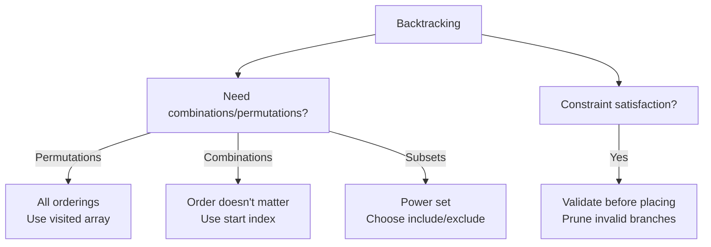
```mermaid
flowchart TD
    BT["Backtracking"] --> C["Need combinations/permutations?"]
    C -->|Permutations| P["All orderings\nUse visited array"]
    C -->|Combinations| CO["Order doesn't matter\nUse start index"]
    C -->|Subsets| S["Power set\nChoose include/exclude"]
    BT --> CSP["Constraint satisfaction?"]
    CSP -->|Yes| VAL["Validate before placing\nPrune invalid branches"]
```

### Common Questions
1. **Permutations** — All permutations of array
2. **Subsets** — All subsets (power set)
3. **Combination Sum** — All combos summing to target
4. **N-Queens** — Place queens without conflict
5. **Word Search** — Find word in grid

### Complexity

| Problem | Time | Space |
|---------|:----:|:-----:|
| Subsets (2^n) | O(n * 2^n) | O(n) |
| Permutations (n!) | O(n * n!) | O(n) |
| Combinations (C(n,k)) | O(k * C(n,k)) | O(k) |
| N-Queens | O(n!) | O(n²) |

### Template: Subsets

```python
def subsets(nums: list[int]) -> list[list[int]]:
    result = []

    def backtrack(start: int, path: list[int]):
        result.append(path[:])
        for i in range(start, len(nums)):
            path.append(nums[i])
            backtrack(i + 1, path)
            path.pop()

    backtrack(0, [])
    return result
```

### Template: Permutations

```python
def permute(nums: list[int]) -> list[list[int]]:
    result = []

    def backtrack(path: list[int], used: set):
        if len(path) == len(nums):
            result.append(path[:])
            return
        for n in nums:
            if n not in used:
                path.append(n)
                used.add(n)
                backtrack(path, used)
                path.pop()
                used.remove(n)

    backtrack([], set())
    return result
```

### Template: Combination Sum

```python
def combination_sum(candidates: list[int], target: int) -> list[list[int]]:
    result = []

    def backtrack(start: int, path: list[int], remaining: int):
        if remaining == 0:
            result.append(path[:])
            return
        if remaining < 0:
            return
        for i in range(start, len(candidates)):
            path.append(candidates[i])
            backtrack(i, path, remaining - candidates[i])
            path.pop()

    backtrack(0, [], target)
    return result
```

💡 **Quick Notes**
- Backtracking = recursion + **undo the choice** (path.pop())
- Always make a **copy** of path before adding to result: `path[:]`
- **Pruning** is key — skip invalid paths early
- Use `start` index to avoid duplicates in combinations
- Sorting input helps prune (stop early when remaining < 0)

⚠ **Common Mistakes**
- Forgetting to copy path when appending to result
- Not pruning — causes exponential explosion
- Mutating shared state without reverting
- Including duplicate combinations (use start index)
- Stack overflow for large input sizes

---

## 1️⃣5️⃣ Dynamic Programming

### When to Use
- Optimal substructure (optimal solution from optimal sub-solutions)
- Overlapping subproblems (same subproblem computed multiple times)
- Optimization (min/max) or counting problems
- Sequence/string matching
- "Number of ways", "minimum cost", "maximum profit"

### How to Identify
- "Longest/shortest/minimum/maximum" with constraints
- Recurrence relation is apparent
- Brute force is exponential
- Previous decisions affect future choices

### Decision Flowchart

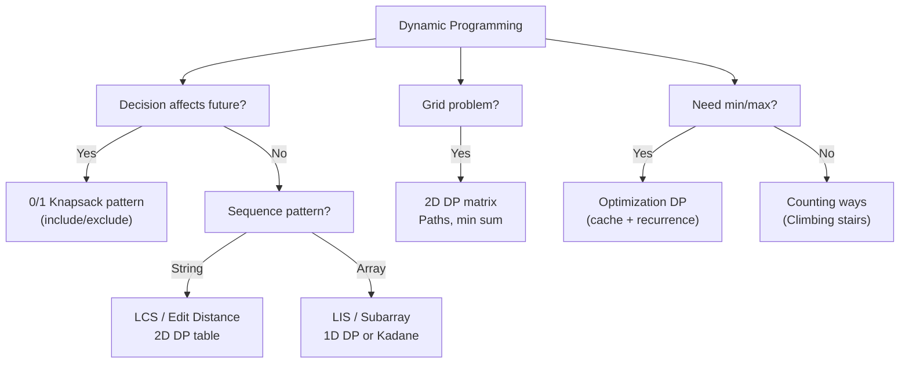
```mermaid
flowchart TD
    DP["Dynamic Programming"] --> Q["Decision affects future?"]
    Q -->|Yes| C["0/1 Knapsack pattern\n(include/exclude)"]
    Q -->|No| S["Sequence pattern?"]
    S -->|String| L["LCS / Edit Distance\n2D DP table"]
    S -->|Array| I["LIS / Subarray\n1D DP or Kadane"]
    DP --> G["Grid problem?"]
    G -->|Yes| GD["2D DP matrix\nPaths, min sum"]
    DP --> M["Need min/max?"]
    M -->|Yes| O["Optimization DP\n(cache + recurrence)"]
    M -->|No| T["Counting ways\n(Climbing stairs)"]
```

### Common Questions
1. **Climbing Stairs** — Fibonacci-style DP
2. **Longest Common Subsequence** — 2D DP
3. **0/1 Knapsack** — Include/exclude items
4. **Coin Change** — Minimum coins for amount
5. **Longest Increasing Subsequence** — 1D DP

### Complexity

| Pattern | Time | Space |
|---------|:----:|:-----:|
| 1D DP | O(n) | O(1)–O(n) |
| 2D DP | O(n*m) | O(n*m) |
| Knapsack | O(n*W) | O(n*W) |
| LCS | O(n*m) | O(n*m) |

### Template: Top-Down (Memoization)

```python
from functools import lru_cache

def climb_stairs(n: int) -> int:
    @lru_cache(maxsize=None)
    def dp(i: int) -> int:
        if i <= 1:
            return 1
        return dp(i - 1) + dp(i - 2)
    return dp(n)
```

### Template: Bottom-Up (Tabulation)

```python
def climb_stairs(n: int) -> int:
    if n <= 1:
        return 1
    dp = [0] * (n + 1)
    dp[0] = dp[1] = 1
    for i in range(2, n + 1):
        dp[i] = dp[i - 1] + dp[i - 2]
    return dp[n]
```

### Template: Knapsack (0/1)

```python
def knapsack(weights: list[int], values: list[int], capacity: int) -> int:
    n = len(weights)
    dp = [[0] * (capacity + 1) for _ in range(n + 1)]

    for i in range(1, n + 1):
        for w in range(1, capacity + 1):
            if weights[i-1] <= w:
                dp[i][w] = max(
                    values[i-1] + dp[i-1][w - weights[i-1]],
                    dp[i-1][w]
                )
            else:
                dp[i][w] = dp[i-1][w]
    return dp[n][capacity]
```

💡 **Quick Notes**
- Two approaches: top-down (memoization) vs bottom-up (tabulation)
- Memoization is easier to write; tabulation is more space-efficient
- Start with the **recurrence relation** — everything flows from it
- Space optimization: many 2D DP can be reduced to 1D

⚠ **Common Mistakes**
- Missing base cases leads to index errors
- Forgetting to initialize DP table correctly
- Wrong recurrence relation (failing to identify the subproblem)
- Not optimizing space when possible
- Off-by-one in DP table indexing (size n+1 for 1-indexing convenience)

---

## 1️⃣6️⃣ Math

### When to Use
- Prime number checking / generation
- GCD/LCM calculations
- Number base conversions
- Geometric problems
- Probability and combinatorics
- Bit manipulation

### How to Identify
- "Prime", "divisible", "GCD", "LCM"
- "Power of 2/3", "palindrome number"
- "Base conversion", "binary representation"
- Counting arrangements (combinatorics)

### Decision Flowchart

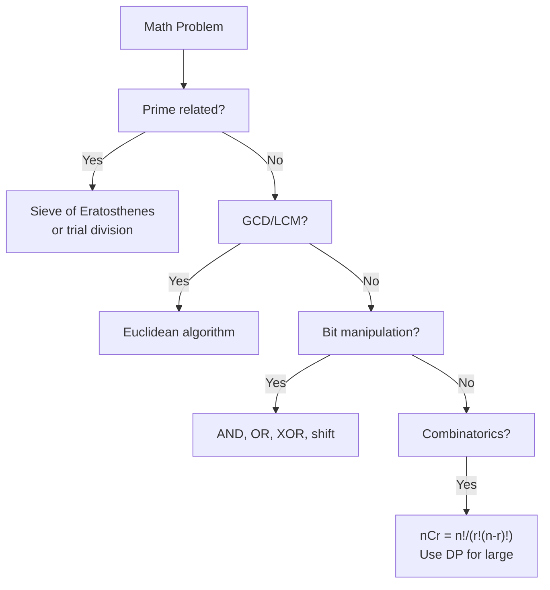
```mermaid
flowchart TD
    MT["Math Problem"] --> PR["Prime related?"]
    PR -->|Yes| SP["Sieve of Eratosthenes\nor trial division"]
    PR -->|No| GC["GCD/LCM?"]
    GC -->|Yes| EU["Euclidean algorithm"]
    GC -->|No| BT["Bit manipulation?"]
    BT -->|Yes| BOP["AND, OR, XOR, shift"]
    BT -->|No| CM["Combinatorics?"]
    CM -->|Yes| NF["nCr = n!/(r!(n-r)!)\nUse DP for large"]
```

### Common Questions
1. **Sieve of Eratosthenes** — Count primes up to n
2. **Power of Two** — `n > 0 and n & (n-1) == 0`
3. **Happy Number** — Cycle detection with digits
4. **Roman to Integer** — Symbol mapping
5. **Excel Sheet Column Number** — Base-26 conversion

### Complexity

| Operation | Time | Space |
|-----------|:----:|:-----:|
| GCD (Euclidean) | O(log min(a,b)) | O(1) |
| Sieve up to n | O(n log log n) | O(n) |
| Bit operations | O(1) | O(1) |
| Power/Mod | O(log n) | O(log n) |

### Template: Sieve of Eratosthenes

```python
def sieve(n: int) -> list[bool]:
    is_prime = [True] * (n + 1)
    is_prime[0] = is_prime[1] = False
    for i in range(2, int(n**0.5) + 1):
        if is_prime[i]:
            for j in range(i * i, n + 1, i):
                is_prime[j] = False
    return is_prime
```

### Template: GCD (Euclidean)

```python
def gcd(a: int, b: int) -> int:
    while b:
        a, b = b, a % b
    return a
```

### Template: Bit Manipulation (Power of Two)

```python
def is_power_of_two(n: int) -> bool:
    return n > 0 and n & (n - 1) == 0
```

💡 **Quick Notes**
- `//` for integer division, `/` for float division
- `pow(base, exp, mod)` for modular exponentiation (efficient)
- `divmod(a, b)` returns `(quotient, remainder)`
- Bit tricks:
  - `n & (n-1)` — clears lowest set bit
  - `n & -n` — isolates lowest set bit
  - `n & 1` — check parity
  - XOR: `a ^ a = 0`, `a ^ 0 = a`, `a ^ b ^ a = b`

⚠ **Common Mistakes**
- Integer overflow (Python handles big ints, but other languages don't)
- Off-by-one in Sieve loop boundary (sqrt(n) is enough)
- Confusing `&` (bitwise) vs `and` (logical) — different precedence!
- Not handling negative numbers in math problems
- Division by zero in modular operations

---

## 📊 Quick Reference: Pattern → Data Structure

| Pattern | Primary DS | Secondary DS |
|---------|:----------:|:------------:|
| Arrays | List | Dict, Set |
| Strings | String | List, Dict |
| HashMap | Dict | Counter |
| Two Pointers | Two indices | None |
| Sliding Window | Window pointers | Dict/Set |
| Stack | List (as stack) | Dict |
| Queue | deque | List |
| LinkedList | ListNode | None |
| Binary Search | Indices | None |
| Trees | TreeNode | Queue/Stack |
| Graph | Adj List | Queue, Set |
| Heap | heapq | List |
| Recursion | Call stack | Dict (memo) |
| Backtracking | Recursion + path | Set (used) |
| DP | DP array/table | Dict (memo) |
| Math | Variables | Set |

---

## 🎯 Pattern Selection by Problem Type

| Problem Type | Suggested Patterns |
|:-------------|:------------------:|
| Subarray/Substring | Sliding Window, Prefix Sum, DP |
| Pairs/Triplets | Two Pointers, HashMap |
| Permutations/Combinations | Backtracking, Recursion |
| Optimization (min/max) | DP, Greedy |
| Search (sorted) | Binary Search |
| Search (unsorted) | HashMap, Two Pointers |
| Tree/Graph traversal | DFS (Stack), BFS (Queue) |
| Top K elements | Heap, Quick Select |
| Nested structure | Stack, Recursion |
| Palindrome | Two Pointers, DP |
| Merge/Intersection | Two Pointers, Min-Heap |
| Cycle detection | Fast & Slow pointers |

---

## 📚 Practice Roadmap

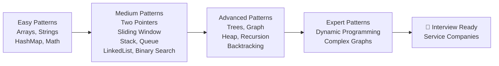
```mermaid
flowchart LR
    A["Easy Patterns\nArrays, Strings\nHashMap, Math"] --> B["Medium Patterns\nTwo Pointers\nSliding Window\nStack, Queue\nLinkedList, Binary Search"]
    B --> C["Advanced Patterns\nTrees, Graph\nHeap, Recursion\nBacktracking"]
    C --> D["Expert Patterns\nDynamic Programming\nComplex Graphs"]
    D --> E["💼 Interview Ready\nService Companies"]
```

### Suggested Practice Order
1. **Week 1-2**: Arrays, Strings, HashMap, Math
2. **Week 3-4**: Two Pointers, Sliding Window, Stack, Queue
3. **Week 5-6**: LinkedList, Binary Search, Recursion
4. **Week 7-8**: Trees, Heap, Backtracking
5. **Week 9-10**: Graph, Dynamic Programming
6. **Week 11-12**: Mixed problems + Mock interviews

---

## 📝 Final Tips

| 💡 Tip | Why It Matters |
|:-------|:---------------|
| Solve at least 5 problems per pattern | Builds pattern recognition muscle memory |
| Explain your code out loud | Interviewer needs to hear your thought process |
| Always start with brute force | Shows you understand the problem, then optimize |
| Draw diagrams for complex problems | Visualizing helps you and your interviewer |
| Practice without autocomplete | Real interviews are on pen/paper or plain text |
| Use Python's built-in functions | Shows language proficiency |
| Write clean, readable code | Variable names matter, avoid one-liners |
| Test with edge cases | Empty input, single element, negative numbers |

---

```
Author: Tamilselvan S
LinkedIn: https://www.linkedin.com/in/tamilselvan-ai/
GitHub: `your-github-username`
```
