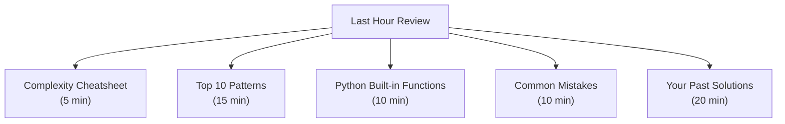
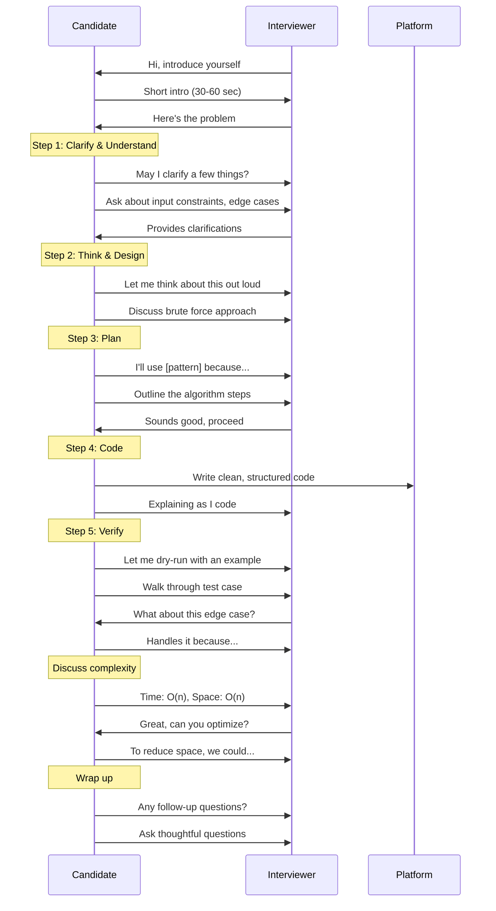
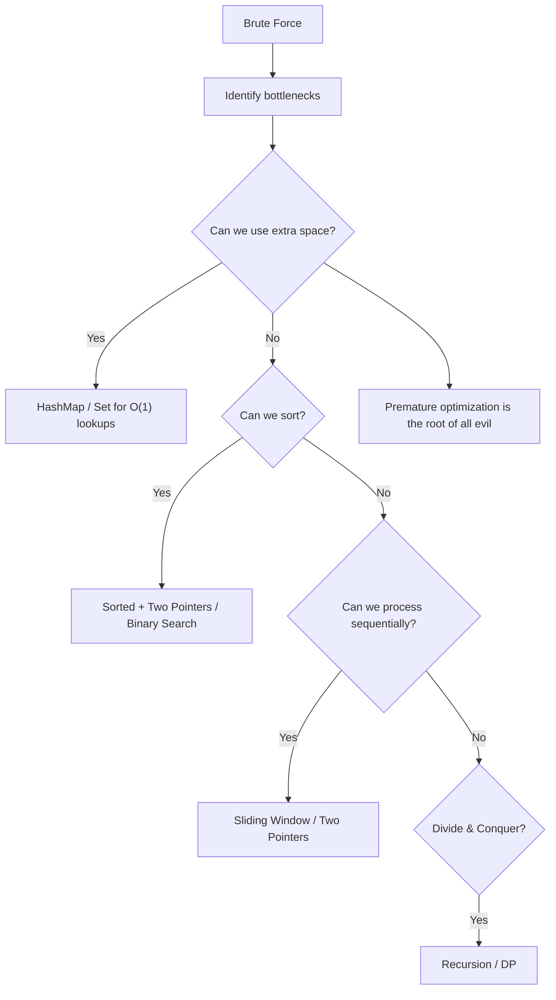
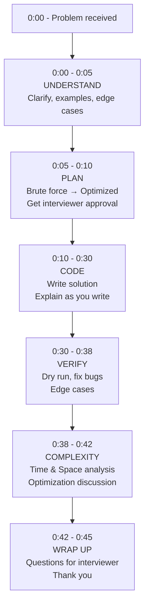

# 🎯 Complete Interview Strategy Guide for Service-Based Companies

> *Your step-by-step playbook for cracking coding interviews at TCS, Infosys, Wipro, Accenture, Cognizant, HCL, Tech Mahindra, and more*

---

## 📋 Table of Contents
1. [Before the Interview](#before-the-interview)
2. [During the Coding Round](#during-the-coding-round)
3. [While Explaining Code](#while-explaining-code)
4. [Time Management](#time-management)
5. [Common Mistakes (Top 20)](#common-mistakes-top-20)
6. [Post-Interview](#post-interview)
7. [Mock Interview Checklist](#mock-interview-checklist)

---

## Before the Interview

### 🎯 Research Phase

#### Company-Specific Research Checklist

| Research Area | What to Look For | Where to Find |
|:--------------|:-----------------|:--------------|
| Company Tech Stack | Java, Python, .NET, MERN | Job description, Glassdoor |
| Interview Pattern | Coding round → Technical → HR | Glassdoor reviews, AmbitionBox |
| Recent Projects | Client domains, technologies | Company website, LinkedIn |
| Coding Platform | HackerRank, Codility,自家平台 | Interview invite email |
| Expected Difficulty | Easy-Medium for service companies | Glassdoor interview questions |

### 📝 Preparation Checklist

**1 Month Before**
- [ ] Review all 16 DSA patterns from DSA_Patterns.md
- [ ] Solve 50+ easy problems across arrays, strings, hashmap
- [ ] Set up coding environment (Python 3.x, local IDE)
- [ ] Create GitHub profile with solved problems

**2 Weeks Before**
- [ ] Solve 50+ medium problems across all patterns
- [ ] Practice explaining solutions out loud
- [ ] Time yourself (30 min per problem)
- [ ] Review company-specific interview experiences

**1 Week Before**
- [ ] Take 3 full-length mock interviews
- [ ] Review weak areas
- [ ] Prepare questions to ask the interviewer
- [ ] Verify interview platform (test mic/camera)

**Day Before**
- [ ] Review complexity cheatsheet
- [ ] Go through common mistakes
- [ ] Sleep 7-8 hours
- [ ] Prepare outfit, water, notebook, pen

**Day Of**
- [ ] Join 5 minutes early
- [ ] Keep water nearby
- [ ] Have backup internet
- [ ] Stay calm and confident

### 📌 What to Review in the Last Hour



---

## During the Coding Round

### 🔄 Ideal Coding Round Flow



### The 5-Step Method (STAR Approach for Coding)

#### Step 1: Clarify & Understand (3-5 minutes)

**What to do:**
- Restate the problem in your own words
- Ask clarifying questions:
  - "What are the input constraints?"
  - "Can the array be empty?"
  - "Are there negative numbers?"
  - "Is the input sorted?"
  - "What should I return for edge cases?"
- Confirm the expected input/output format
- Ask for an example and walk through it

**Sample Script:**
> "Let me make sure I understand. We're given an array of integers and a target value. We need to return the indices of two numbers that add up to the target. Is that correct? Can I assume there's exactly one solution? What should I return if there's no solution? Can I use the same element twice?"

#### Step 2: Think Out Loud & Design (3-5 minutes)

**What to do:**
- Start with brute force — always
- Talk through your thought process
- Draw diagrams or write pseudocode
- Analyze the brute force complexity
- Propose optimization ideas

**Sample Script:**
> "The brute force approach would be to check every pair — that's O(n²). But we can do better. Since we need to find a complement, we can use a hashmap to store numbers we've seen. That gives us O(n) time but costs O(n) space. Alternatively, if the array were sorted, we could use two pointers in O(1) space."

#### Step 3: Plan the Algorithm (2-3 minutes)

**What to do:**
- Declare which pattern you're using
- Outline the steps in plain English
- Get interviewer approval before coding
- Identify the right data structures

**Sample Script:**
> "I'll use the HashMap pattern here. The plan is:
> 1. Create an empty dictionary to store number→index mappings
> 2. Iterate through the array once
> 3. For each number, calculate the complement (target - number)
> 4. Check if complement exists in the dictionary
> 5. If yes, return both indices
> 6. Otherwise, store current number and its index
>
> Does this approach sound good to you?"

#### Step 4: Write Clean Code (10-15 minutes)

**What to do:**
- Write clean, readable code
- Use meaningful variable names
- Add comments if time permits
- Follow PEP 8 conventions
- **Explain as you type** — don't code in silence

**Sample Script (while coding):**
> "First, I'll create an empty dictionary called `seen`. Now I'll iterate with `enumerate` to get both index and value. For each number, I compute `complement = target - num`. If complement is in `seen`, I return `[seen[complement], i]`. Otherwise, I store `seen[num] = i`."

```python
def two_sum(nums: list[int], target: int) -> list[int]:
    seen = {}
    for i, num in enumerate(nums):
        complement = target - num
        if complement in seen:
            return [seen[complement], i]
        seen[num] = i
    return [-1, -1]
```

#### Step 5: Verify & Test (3-5 minutes)

**What to do:**
- Walk through a test case manually
- Add row by row in a table format
- Check edge cases:
  - Empty input
  - Single element
  - All same values
  - No solution exists
  - Large input
- Analyze time and space complexity

**Sample Script:**
> "Let me dry-run with `nums = [2, 7, 11, 15]`, `target = 9`. 
> - i=0, num=2, complement=7, seen={}, so store seen[2]=0
> - i=1, num=7, complement=2, 2 in seen! Return [0, 1]. ✓
>
> Time complexity: O(n) — we traverse the array once.
> Space complexity: O(n) — in the worst case, we store n-1 elements before finding the pair."

### 🗣 Communication Tips

| Do ✅ | Don't ❌ |
|:------|:----------|
| Talk through every line of code | Code in complete silence |
| Ask for clarification when unsure | Assume and implement wrongly |
| Acknowledge when you don't know | Pretend to know and guess |
| Think out loud even when stuck | Freeze and stare at the screen |
| Show enthusiasm and engagement | Appear disinterested |
| Admit mistakes quickly | Argue with the interviewer |
| Write modular, readable code | Write cryptic one-liners |
| Test your code after writing | Submit without verification |

### 🔄 Recovery Strategies When Stuck

| Situation | Strategy | Sample Phrase |
|:----------|:---------|:--------------|
| Don't understand the problem | Ask specific clarifying questions | "Could you give me an example of how this should work?" |
| Can't think of a solution | Start with brute force | "Let me start with the simplest approach and optimize from there." |
| Solution seems wrong | Trace through an example | "Let me walk through this with a test case to verify." |
| Can't optimize | Ask for hints | "I'm considering optimization. Could you give me a direction?" |
| Getting confused with code | Pause and reorganize | "Let me take a moment to structure my thoughts." |
| Made an error | Acknowledge and fix it | "I see the error. Let me trace back and fix it." |
| Running out of time | Summarize and offer to finish verbally | "I have the main logic. Let me explain the rest." |
| Interviewer seems unhappy | Ask for feedback | "Is there a different approach you'd recommend?" |

### 📊 Optimization Strategy: Brute Force → Optimized



**Optimization Progression Framework:**

| Step | Question | Example |
|:-----|:---------|:--------|
| 1 | What's the simplest solution? | Nested loops → O(n²) |
| 2 | Where's the bottleneck? | Inner loop does O(1) work n times |
| 3 | Can I use a hashmap? | Trade O(n) space for O(1) lookups |
| 4 | Can I sort first? | Sorting O(n log n) may enable O(n) solution |
| 5 | Can I process in one pass? | Sliding window / two pointers |
| 6 | Is there a mathematical pattern? | Prefix sum, GCD, bit manipulation |
| 7 | Are there overlapping subproblems? | Dynamic programming |

---

## While Explaining Code

### 📝 Line-by-Line Explanation Technique

**The Sandwich Method:**
1. **BEFORE** the line/block: Say what you're about to do
2. **WHILE** writing: Explain why this approach works
3. **AFTER** writing: Describe what the code accomplishes

**Example:**
> "I'm going to initialize a hashmap to store the elements we've seen so far. *(writes code)* This gives us O(1) lookup time for each element. Now I'll iterate through the array using a for loop with enumeration — this gives us both the index and value. *(writes loop)* Inside the loop, I'll compute the complement and check if it exists in our hashmap. If it does, we've found our pair and return immediately. *(writes if block)* Otherwise, we add the current element to the hashmap for future lookups."

### 🔥 Handling Follow-Up Questions

| Follow-Up Question | How to Respond |
|:-------------------|:---------------|
| "Can you optimize this further?" | "Let me analyze the current bottlenecks and see if we can reduce time or space." |
| "What if the input is very large?" | "Our current O(n) is already optimal. If memory is a concern, we could..." |
| "How would you handle a billion elements?" | "I'd consider distributed computing, external sorting, or streaming algorithms." |
| "Can you make it work without extra space?" | "If we sort the array first, we can use two pointers for O(1) space." |
| "What if duplicates are present?" | "We need to decide whether to skip duplicates. For this problem, we should..." |
| "What if the data is on disk?" | "We could read it in chunks, use external sort, or process in a streaming fashion." |
| "How would you handle concurrency?" | "I'd use locks for writes, or design the data structure to be thread-safe." |

### 🔄 How to Discuss Trade-Offs

| Trade-Off | Discuss Like This |
|:----------|:------------------|
| Time vs Space | "We can reduce time from O(n²) to O(n) by using O(n) extra space with a hashmap." |
| Simplicity vs Performance | "The brute force is simpler to understand and maintain, but the optimized version is better for large inputs." |
| Recursion vs Iteration | "Recursion is more intuitive but could cause stack overflow. Iteration is safer for large inputs." |
| In-place vs Copy | "In-place is memory efficient but modifies the input. Copy preserves the original data." |
| Generic vs Specific | "A generic solution handles more cases but may be slower. A specific solution is optimized for our constraints." |

**Trade-Off Discussion Template:**
> "There are two approaches here. **Approach A** uses more space but is faster. **Approach B** is space-efficient but slower. Given our constraints (mention constraints), I'd choose **Approach A** because..."

---

## Time Management

### ⏱ Phase-by-Phase Time Allocation (45-minute round)

| Phase | Duration | Activity |
|:------|:--------:|:---------|
| Introduction | 2 min | Brief自我介绍, getting settled |
| Understand | 5 min | Clarify requirements, examples |
| Plan | 5 min | Discuss approach, get buy-in |
| Write Code | 20 min | Implement solution, explain |
| Test & Debug | 8 min | Dry-run, fix bugs |
| Optimize | 3 min | Discuss improvements |
| Questions | 2 min | Ask interviewer questions |

### 📊 When to Do What



### 🚨 Time Warning Signs

| Time Remaining | You Should Be... | If Behind... |
|:--------------:|:-----------------|:-------------|
| 30 min | Started coding | Skip brute force, go straight to optimized |
| 20 min | At least 50% done with code | Simplify solution, explain rest verbally |
| 15 min | Near completion | Skip minor optimizations |
| 10 min | Testing your code | Just explain how you'd test |
| 5 min | Wrapping up | Cover complexity and trade-offs quickly |

### Asking Clarifying Questions — Timing Guide

| Phase | Types of Questions |
|:------|:-------------------|
| First 2 minutes | Input/Output format, constraints, edge cases |
| After planning | "Does this approach meet your expectations?" |
| During coding | Technical doubts about language features |
| After completion | "Would you like me to optimize further?" |
| At the end | Role-specific questions, team culture, tech stack |

---

## Common Mistakes (Top 20)

| # | Mistake | Why It Happens | How to Avoid |
|:-:|:--------|:---------------|:-------------|
| 1 | **Starting to code immediately** | Nervousness, wanting to show progress | Spend 5 min clarifying and planning first |
| 2 | **Not asking clarifying questions** | Fear of looking dumb | Asking questions shows engagement |
| 3 | **Coding in silence** | Focusing on code | Narrate your thought process |
| 4 | **Using wrong variable names** | Rushing | Use descriptive names: `num_index_map`, `current_sum` |
| 5 | **Ignoring edge cases** | Only testing happy path | Always check: empty, single, negative, duplicates |
| 6 | **Not testing after coding** | Assuming it works | Walk through at least one example |
| 7 | **Not analyzing complexity** | Forgetting | State time and space after coding |
| 8 | **Premature optimization** | Trying to impress | Start with working solution, then optimize |
| 9 | **Getting stuck silently** | Not wanting help | Ask for hints — it's expected |
| 10 | **Writing Pythonic one-liners** | Showing off | Readability > cleverness |
| 11 | **Forgetting imports** | Rushing to code | Import first, then write logic |
| 12 | **Not handling None/null** | Assuming valid input | Check `if arr is None: return []` |
| 13 | **Modifying input unnecessarily** | Convenience | Copy if needed: `arr[:]` |
| 14 | **Using wrong data structure** | Lack of awareness | Choose DS based on operations needed |
| 15 | **Confusing recursion base case** | Not thinking it through | Write base case first |
| 16 | **Off-by-one errors** | Loop boundary confusion | Use `range(len)` or debug with small examples |
| 17 | **Not organizing code** | One massive function | Break into helper functions |
| 18 | **Arguing with interviewer** | Defensiveness | Listen, acknowledge, adapt |
| 19 | **Not using built-in functions** | Overcomplicating | Python has `Counter`, `defaultdict`, `bisect` |
| 20 | **Giving up too early** | Frustration | Take a breath, simplify, ask for help |

### 💡 How to Avoid Each Mistake — Quick Reference Card

```
Mistake #1: Starting to code immediately
✅ Fix: "Let me first ask a few clarifying questions..."

Mistake #3: Coding in silence
✅ Fix: "Now I'm writing the loop where we iterate over the array..."

Mistake #6: Not testing
✅ Fix: "Let me walk through this with [example]..."

Mistake #9: Getting stuck silently
✅ Fix: "I'm considering two approaches. Could you give me a hint?"

Mistake #16: Off-by-one errors
✅ Fix: "I should verify my loop boundaries with a small test case."
```

---

## Post-Interview

### 📌 What to Do Immediately After

| Action | Why | When |
|:-------|:----|:-----|
| Note down questions you were asked | Prepares for next interviews | Right after the call |
| Identify weak areas | Targeted practice | Within 1 hour |
| Solve the problem again from scratch | Reinforces learning | Same day |
| Write down feedback to yourself | Track improvement | Before next interview |
| Send a thank you note | Professional etiquette | Within 24 hours |

### 📧 Follow-Up Email Template

```
Subject: Thank You - [Position] Interview - [Your Name]

Dear [Interviewer Name],

Thank you for taking the time to interview me today. I really appreciated the opportunity to discuss the [position] role and learn more about [Company Name]'s work.

I particularly enjoyed [specific topic from the interview]. Our discussion about [specific problem/technology] was engaging, and I'm excited about the possibility of contributing to your team.

Please feel free to reach out if you need any additional information from me. I look forward to hearing about the next steps.

Best regards,
[Your Name]
[LinkedIn Profile URL]
```

### 📊 Self-Evaluation Rubric

| Criteria | Excellent (3) | Good (2) | Needs Work (1) | Score |
|:---------|:-------------:|:--------:|:--------------:|:-----:|
| Problem Understanding | Asked all clarifying questions, restated correctly | Asked some questions | Jumped straight to coding |
| Communication | Clear, structured, enthusiastic | Mostly clear | Quiet or unclear |
| Problem-Solving | Optimal solution with trade-offs | Working solution | Struggled with approach |
| Code Quality | Clean, well-named, modular | Works but messy | Bugs or incomplete |
| Testing | Thorough dry-run + edge cases | Basic test | No testing |
| Time Management | Completed on time with buffer | Finished just in time | Didn't finish |
| **Total** | | | | **/18** |

### 📈 Improvement Plan

| Score Range | Action Plan |
|:-----------:|:------------|
| 15-18 | Great! Focus on speed and advanced problems |
| 11-14 | Good. Identify 2-3 weak areas to improve |
| 7-10 | Needs work. Review DSA patterns thoroughly |
| Below 7 | Start with fundamentals. Solve 100+ easy problems |

---

## 📝 Mock Interview Checklist

### Pre-Mock Interview
- [ ] Schedule with a friend or use Pramp/Interviewing.io
- [ ] Set a timer for 45 minutes
- [ ] Choose a random problem (don't pre-select)
- [ ] Share screen and open a blank editor
- [ ] Record yourself (audio + video) for review
- [ ] State the constraints you'll simulate

### During Mock Interview
- [ ] Spend 5 minutes understanding the problem
- [ ] Ask clarifying questions out loud
- [ ] Discuss brute force before optimized
- [ ] Explain complexity trade-offs
- [ ] Write clean, readable code
- [ ] Explain while coding
- [ ] Dry-run with example
- [ ] Test edge cases
- [ ] State time and space complexity

### Post-Mock Interview Review
- [ ] Watch the recording
- [ ] Note where you got stuck
- [ ] Check if you asked enough clarifying questions
- [ ] Evaluate code quality (not just correctness)
- [ ] Check if you explained clearly
- [ ] Assess time management
- [ ] Solve the problem again independently
- [ ] Write down lessons learned

### 📅 Mock Interview Schedule

| Week | Focus | # of Mocks |
|:----:|:------|:----------:|
| 1-2 | Easy problems, getting comfortable | 2 per week |
| 3-4 | Medium problems, building speed | 2-3 per week |
| 5-6 | Mixed difficulty, company-specific | 3 per week |
| 7-8 | Full-length with feedback | 3-4 per week |

---

## 🚀 Final Pep Talk

```
You've prepared. You've practiced. You've earned this.

Interviewing is a skill, and like any skill, it improves
with practice. Every interview — good or bad — makes you
better. The goal isn't perfection; it's progress.

Remember:
  • The interviewer wants you to succeed
  • You don't need to be perfect, just competent
  • Your attitude matters as much as your code
  • One interview doesn't define your worth
  • Every "no" brings you closer to "yes"

You've got this. 💪
```

---

```
Author: Tamilselvan S
LinkedIn: https://www.linkedin.com/in/tamilselvan-ai/
GitHub: `your-github-username`
```
