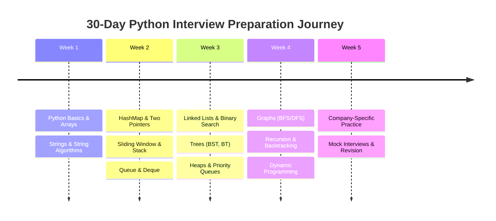
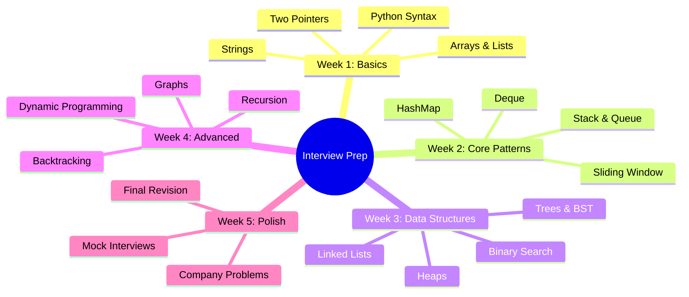

# 🗺️ 30-Day Python Coding Interview Roadmap
## For Service-Based Companies (Wipro, TCS, Infosys, CTS, HCL, Accenture, Deloitte)



---

## 📋 How to Use This Roadmap

| Symbol | Meaning |
|--------|---------|
| 🎯 | Daily Goal |
| 📝 | Practice Questions |
| ⏱ | Estimated Time |
| 💡 | Quick Note |
| ✅ | Check when done |

**Total Duration:** 30 Days | **Daily Commitment:** 2–3 hours | **Total Problems:** 150+

---

## 📅 Week 1: Python Basics, Arrays & Strings

### Day 1: Python Fundamentals & Setup

| 🎯 Goal | Get comfortable with Python syntax, IDE setup & input/output |
|---------|--------------------------------------------------------------|
| 📝 Practice | 5 basic problems (Hello World, sum, max of 3 numbers) |
| ⏱ Time | 2 hours |

**Topics to Cover:**
- Python installation, VS Code / PyCharm setup
- Variables, data types (`int`, `float`, `str`, `bool`, `None`)
- Basic I/O: `input()`, `print()`, f-strings
- Conditional statements: `if`, `elif`, `else`
- Loops: `for`, `while`, `break`, `continue`
- Functions: `def`, `return`, parameters

```python
# Quick I/O template
def solve():
    n = int(input())
    arr = list(map(int, input().split()))
    # Your logic here
    print(result)

if __name__ == "__main__":
    solve()
```

> 💡 **Quick Note:** Practice writing code WITHOUT auto-complete. Interview platforms (HackerRank, Codility) have minimal IDE support.

> ⚠️ **Common Mistake:** Forgetting `map(int, input().split())` — this is the #1 pattern for reading space-separated integers.

---

### Day 2: Lists & List Manipulation

| 🎯 Goal | Master Python lists — creation, slicing, methods, comprehensions |
|---------|------------------------------------------------------------------|
| 📝 Practice | 6 problems (list rotation, duplicate removal, subarray problems) |
| ⏱ Time | 2.5 hours |

**Topics to Cover:**
- List creation: `[]`, `list()`, `[0] * n`
- Slicing: `arr[i:j:k]`, reverse with `[::-1]`
- Methods: `append()`, `extend()`, `insert()`, `pop()`, `remove()`, `index()`, `count()`, `sort()`, `reverse()`
- List comprehensions: `[x**2 for x in range(10) if x % 2 == 0]`
- Nested lists, matrix operations

> 💡 **Quick Note:** `arr[::-1]` reverses a list — O(n) time, O(n) space. For in-place reverse, use `arr.reverse()` or two-pointer swapping.

> ⚠️ **Common Mistake:** `arr.pop(0)` is O(n). For queue operations, use `collections.deque`.

---

### Day 3: Strings & String Manipulation

| 🎯 Goal | Handle string problems efficiently with Python string methods |
|---------|---------------------------------------------------------------|
| 📝 Practice | 6 problems (anagram check, palindrome, pattern matching) |
| ⏱ Time | 2.5 hours |

**Topics to Cover:**
- Methods: `lower()`, `upper()`, `strip()`, `split()`, `join()`, `replace()`, `find()`, `index()`, `count()`
- Slicing: `s[::-1]` (reverse), `s[::2]` (every other)
- `isalpha()`, `isdigit()`, `isalnum()`, `isspace()`
- `ord()` and `chr()`
- String formatting: f-strings, `format()`, `%`
- `str.translate()` for multiple replacements

```python
# Palindrome check (one-liner)
is_pal = s == s[::-1]

# Character frequency
freq = [0] * 26
for c in s:
    freq[ord(c) - ord('a')] += 1
```

---

### Day 4: Array Algorithms — Part 1

| 🎯 Goal | Solve classic array problems using two-pointer and brute force |
|---------|----------------------------------------------------------------|
| 📝 Practice | 6 problems (two sum, container with most water, plus one) |
| ⏱ Time | 2.5 hours |

**Problems to Solve:**
- Two Sum (HashMap approach)
- Container With Most Water (two pointers)
- Plus One (carry handling)
- Move Zeroes (in-place)
- Rotate Array (reverse technique)
- Remove Duplicates from Sorted Array (two pointers)

---

### Day 5: Array Algorithms — Part 2

| 🎯 Goal | Solve medium-difficulty array problems |
|---------|----------------------------------------|
| 📝 Practice | 5 problems (subarray sum, product, merge intervals) |
| ⏱ Time | 2.5 hours |

**Problems to Solve:**
- Maximum Subarray (Kadane's Algorithm)
- Maximum Product Subarray
- Subarray Sum Equals K (prefix sum + HashMap)
- Merge Intervals
- Next Permutation

> 📌 **Remember:** Kadane's Algorithm: `max_ending_here = max(arr[i], max_ending_here + arr[i])`

---

### Day 6: Strings — Pattern Matching & Advanced

| 🎯 Goal | Solve medium-difficulty string problems |
|---------|----------------------------------------|
| 📝 Practice | 5 problems (longest substring, group anagrams, pattern matching) |
| ⏱ Time | 2.5 hours |

**Problems to Solve:**
- Longest Substring Without Repeating Characters
- Longest Palindromic Substring
- Group Anagrams
- String to Integer (atoi)
- Implement strStr() / indexOf()

---

### Day 7: Week 1 Revision & Mini Contest

| 🎯 Goal | Revise all Week 1 topics, solve a timed mini contest |
|---------|-------------------------------------------------------|
| 📝 Practice | 5 mixed problems (timed — 1 hour) |
| ⏱ Time | 2 hours |

**Revision Checklist:**
```
✅ Python I/O patterns
✅ List comprehensions & slicing
✅ String methods & manipulation
✅ Two-pointer technique
✅ Kadane's Algorithm
✅ Prefix Sum
```

> 📌 **Week 1 Tip:** Master the basics so thoroughly that they become muscle memory. 80% of interview problems are built on these fundamentals.

---

## 📅 Week 2: HashMap, Two Pointers, Sliding Window, Stack, Queue

### Day 8: HashMap & Dictionary

| 🎯 Goal | Master Python dictionaries, `defaultdict`, `Counter` |
|---------|-------------------------------------------------------|
| 📝 Practice | 6 problems (frequency count, intersection, isomorphic) |
| ⏱ Time | 2.5 hours |

**Topics to Cover:**
- Creation: `{}`, `dict()`, `dict.fromkeys()`
- Methods: `keys()`, `values()`, `items()`, `get()`, `setdefault()`, `update()`, `pop()`
- `collections.defaultdict` — auto-initialize missing keys
- `collections.Counter` — frequency counting
- Dictionary comprehensions: `{k: v for k, v in zip(keys, vals)}`

```python
from collections import defaultdict, Counter

# Character frequency
freq = Counter(s)  # O(n)

# Group-by pattern
groups = defaultdict(list)
for item in items:
    groups[item.key].append(item)
```

> 💡 **Quick Note:** `Counter.most_common(k)` returns top-k elements — O(n log k). For interview problems, this is often the cleanest solution.

---

### Day 9: Two Pointers Technique

| 🎯 Goal | Solve problems using two pointers (opposite & same direction) |
|---------|---------------------------------------------------------------|
| 📝 Practice | 5 problems (pair sum, three sum, trapping rain water) |
| ⏱ Time | 2.5 hours |

**Patterns:**
- **Opposite direction:** sorted array pair sum, palindrome check
- **Same direction:** remove duplicates, linked list cycle detection
- **Fast & slow pointers:** find middle, cycle detection

```python
# Opposite direction two pointer template
def two_sum_sorted(arr, target):
    left, right = 0, len(arr) - 1
    while left < right:
        curr = arr[left] + arr[right]
        if curr == target:
            return [left, right]
        elif curr < target:
            left += 1
        else:
            right -= 1
    return [-1, -1]
```

> ⚠️ **Common Mistake:** Not checking `left < right` in the while loop. Crossing pointers leads to incorrect results.

---

### Day 10: Sliding Window

| 🎯 Goal | Master fixed-size and variable-size sliding window |
|---------|----------------------------------------------------|
| 📝 Practice | 5 problems (max sum subarray, longest substring, character replacement) |
| ⏱ Time | 2.5 hours |

**Fixed Window Template:**
```python
def fixed_window(arr, k):
    window_sum = sum(arr[:k])
    max_sum = window_sum
    for i in range(k, len(arr)):
        window_sum += arr[i] - arr[i - k]
        max_sum = max(max_sum, window_sum)
    return max_sum
```

**Variable Window Template:**
```python
def variable_window(s, k):
    left = 0
    for right in range(len(s)):
        # add s[right] to window
        while not valid(window):
            # remove s[left] from window
            left += 1
        # update answer
    return answer
```

> 📌 **Remember:** Fixed window → O(n). Variable window → O(n) amortized. Always O(1) extra space (excluding the window).

---

### Day 11: Stack

| 🎯 Goal | Solve problems using stack (LIFO) |
|---------|-----------------------------------|
| 📝 Practice | 5 problems (valid parentheses, next greater element, min stack) |
| ⏱ Time | 2.5 hours |

**Topics to Cover:**
- `list` as stack: `append()` for push, `pop()` for pop
- Monotonic stack pattern
- Problems: Valid Parentheses, Next Greater Element, Min Stack, Daily Temperatures, Largest Rectangle in Histogram

```python
# Monotonic decreasing stack template
stack = []
for num in nums:
    while stack and stack[-1] < num:
        stack.pop()
        # process
    stack.append(num)
```

> 💡 **Quick Note:** When you need O(1) min in a stack, maintain a separate "min stack" that tracks the minimum at each level.

---

### Day 12: Queue & Deque

| 🎯 Goal | Solve problems using queue (FIFO) and deque |
|---------|---------------------------------------------|
| 📝 Practice | 4 problems (sliding window max, recent counter, LRU cache) |
| ⏱ Time | 2.5 hours |

**Topics to Cover:**
- `collections.deque` — O(1) append/pop from both ends
- Deque methods: `append()`, `appendleft()`, `pop()`, `popleft()`
- Queue via `deque` (not `queue.Queue`) for interviews
- Sliding Window Maximum (deque pattern)
- Circular Queue

```python
from collections import deque

dq = deque()
dq.append(1)      # add to right
dq.appendleft(2)  # add to left
dq.pop()          # remove from right
dq.popleft()      # remove from left
```

---

### Day 13: Week 2 Practice — Mix of All Topics

| 🎯 Goal | Solve problems combining multiple Week 2 patterns |
|---------|---------------------------------------------------|
| 📝 Practice | 5 medium problems |
| ⏱ Time | 2.5 hours |

**Problems:**
- Longest Substring with At Most K Distinct Characters (Sliding Window + HashMap)
- Minimum Window Substring (Sliding Window + HashMap)
- Trapping Rain Water (Two Pointers or Stack)
- Sliding Window Maximum (Deque)
- Evaluate Reverse Polish Notation (Stack)

---

### Day 14: Week 2 Revision & Mini Contest

| 🎯 Goal | Revise Week 2, timed mini contest |
|---------|-----------------------------------|
| 📝 Practice | 5 mixed problems (timed) |
| ⏱ Time | 2 hours |

**Revision Checklist:**
```
✅ HashMap / defaultdict / Counter
✅ Two pointers (opposite & same direction)
✅ Sliding Window (fixed & variable)
✅ Stack & Monotonic Stack
✅ Queue & Deque
✅ deque for sliding window max
```

> 📌 **Week 2 Tip:** Draw the data structure state on paper. Interviewers love watching you trace through your algorithm visually.

---

## 📅 Week 3: Linked Lists, Binary Search, Trees, Heaps

### Day 15: Linked Lists

| 🎯 Goal | Implement and manipulate singly/doubly linked lists in Python |
|---------|--------------------------------------------------------------|
| 📝 Practice | 6 problems (reverse, cycle detection, merge, middle) |
| ⏱ Time | 3 hours |

**Topics to Cover:**
- ListNode class definition
- Traversal, insertion, deletion
- Reverse a linked list (iterative & recursive)
- Fast & slow pointers (middle, cycle detection)
- Merge two sorted lists
- Remove Nth node from end
- Palindrome linked list

```python
class ListNode:
    def __init__(self, val=0, next=None):
        self.val = val
        self.next = next

# Reverse linked list
def reverse(head):
    prev = None
    curr = head
    while curr:
        next_temp = curr.next
        curr.next = prev
        prev = curr
        curr = next_temp
    return prev
```

> ⚠️ **Common Mistake:** Losing reference to `curr.next` before reassigning `curr.next = prev`. Always store `next_temp = curr.next` first.

---

### Day 16: Binary Search

| 🎯 Goal | Master binary search on arrays and search spaces |
|---------|---------------------------------------------------|
| 📝 Practice | 6 problems (vanilla BS, first/last position, rotated array, search 2D matrix) |
| ⏱ Time | 2.5 hours |

**Template:**
```python
def binary_search(arr, target):
    left, right = 0, len(arr) - 1
    while left <= right:
        mid = left + (right - left) // 2
        if arr[mid] == target:
            return mid
        elif arr[mid] < target:
            left = mid + 1
        else:
            right = mid - 1
    return -1
```

**Variations:**
- Lower bound / first occurrence: `while left < right` + `right = mid`
- Upper bound / last occurrence: `while left < right` + `left = mid + 1`
- Searching in rotated sorted array
- Search space BS: "find smallest value that satisfies condition"

> 📌 **Remember:** `mid = left + (right - left) // 2` avoids integer overflow (relevant in Java/C++, good habit in Python too).

---

### Day 17: Binary Trees — Traversals & Basics

| 🎯 Goal | Implement tree traversals and solve basic tree problems |
|---------|--------------------------------------------------------|
| 📝 Practice | 5 problems (inorder, preorder, postorder, level order, max depth) |
| ⏱ Time | 3 hours |

**Topics to Cover:**
- TreeNode class definition
- DFS traversals (recursive & iterative):
  - Preorder: root → left → right
  - Inorder: left → root → right
  - Postorder: left → right → root
- BFS / Level Order traversal
- Max depth / height of tree
- Diameter of Binary Tree
- Balanced Binary Tree check

```python
class TreeNode:
    def __init__(self, val=0, left=None, right=None):
        self.val = val
        self.left = left
        self.right = right

# Inorder traversal (recursive)
def inorder(root):
    return inorder(root.left) + [root.val] + inorder(root.right) if root else []
```

> 💡 **Quick Note:** Get comfortable with BOTH recursive and iterative traversals. Interviewers often ask, "Can you do it iteratively?"

---

### Day 18: Binary Search Trees & Advanced Trees

| 🎯 Goal | Solve BST problems and loweset common ancestor, views |
|---------|--------------------------------------------------------|
| 📝 Practice | 5 problems (validate BST, LCA, kth smallest, right side view) |
| ⏱ Time | 3 hours |

**Topics to Cover:**
- BST property: left < root < right
- Validate BST (inorder traversal or min/max bounds)
- Lowest Common Ancestor in BST & BT
- Kth smallest element in BST
- Right/Left Side View of Binary Tree
- Convert sorted array to BST
- Serialize & Deserialize Binary Tree

---

### Day 19: Heaps & Priority Queues

| 🎯 Goal | Use `heapq` to solve top-k and merge problems |
|---------|-----------------------------------------------|
| 📝 Practice | 5 problems (kth largest, top k frequent, merge k sorted) |
| ⏱ Time | 2.5 hours |

**Topics to Cover:**
- `heapq.heapify()` — O(n)
- `heapq.heappush()` / `heapq.heappop()` — O(log n)
- Min-heap by default; max-heap via negative values
- `heapq.nlargest(k, iterable)` / `heapq.nsmallest(k, iterable)`
- Problems: Kth Largest Element, Top K Frequent Elements, Merge K Sorted Lists, Median from Data Stream

```python
import heapq

# Min-heap
heap = [3, 1, 4, 1, 5]
heapq.heapify(heap)
smallest = heapq.heappop(heap)  # 1

# Max-heap (via negation)
max_heap = [-x for x in [3, 1, 4, 1, 5]]
heapq.heapify(max_heap)
largest = -heapq.heappop(max_heap)  # 5
```

> ⚠️ **Common Mistake:** Python's `heapq` is a MIN-heap. For max-heap, negate values on push/pop or use `heapq._heapify_max()` (internal, not recommended).

---

### Day 20: Week 3 Practice — Mix of All Topics

| 🎯 Goal | Solve problems combining linked lists, trees, heaps |
|---------|-----------------------------------------------------|
| 📝 Practice | 5 medium problems |
| ⏱ Time | 2.5 hours |

**Problems:**
- Merge K Sorted Lists (Heap + LinkedList)
- Flatten Binary Tree to Linked List
- Convert BST to Doubly Linked List
- Zigzag Level Order Traversal (BFS + Stack)
- Find Median from Data Stream (Two Heaps)

---

### Day 21: Week 3 Revision & Mini Contest

| 🎯 Goal | Revise Week 3, timed mini contest |
|---------|----------------------------------|
| 📝 Practice | 5 mixed problems (timed) |
| ⏱ Time | 2 hours |

**Revision Checklist:**
```
✅ Linked List reversal & detection
✅ Binary Search (all variants)
✅ Tree traversals (DFS & BFS)
✅ BST operations & validation
✅ Heap operations & top-k problems
```

> 📌 **Week 3 Tip:** Trace tree/ll problems on paper. Interviewers want to see you understand the pointer/reference flow, not just recite code.

---

## 📅 Week 4: Graphs, Recursion, Backtracking, DP

### Day 22: Graphs — BFS & DFS

| 🎯 Goal | Represent graphs and implement BFS/DFS traversals |
|---------|---------------------------------------------------|
| 📝 Practice | 5 problems (clone graph, island count, shortest path, cycle detection) |
| ⏱ Time | 3 hours |

**Topics to Cover:**
- Graph representations: adjacency list, adjacency matrix
- BFS template (queue) — shortest path in unweighted graph
- DFS template (stack/recursion) — connectivity, cycle detection
- Number of Islands (grid DFS)
- Clone Graph (BFS/DFS with HashMap)
- Shortest Path in Binary Matrix (BFS)
- Course Schedule (Topological Sort — Kahn's Algorithm)

```python
# BFS template
from collections import deque

def bfs(graph, start):
    visited = {start}
    queue = deque([start])
    while queue:
        node = queue.popleft()
        # process node
        for neighbor in graph[node]:
            if neighbor not in visited:
                visited.add(neighbor)
                queue.append(neighbor)
```

> 💡 **Quick Note:** For grid problems, use direction arrays: `dirs = [(0,1), (0,-1), (1,0), (-1,0)]` instead of 4 separate conditionals.

---

### Day 23: Recursion & Backtracking

| 🎯 Goal | Solve problems using recursion and backtracking |
|---------|--------------------------------------------------|
| 📝 Practice | 5 problems (subsets, permutations, combination sum, N-Queens) |
| ⏱ Time | 3 hours |

**Backtracking Template:**
```python
def backtrack(path, remaining, result):
    if goal_reached(path):
        result.append(path[:])  # copy!
        return
    for choice in remaining:
        if valid(choice):
            path.append(choice)
            backtrack(path, remaining - choice, result)
            path.pop()  # undo
```

**Problems:**
- Subsets / Subsequences
- Permutations
- Combination Sum I & II
- N-Queens
- Sudoku Solver

> 📌 **Remember:** Always make a COPY of the path when adding to results (`result.append(path[:])`), not the reference (`result.append(path)`).

---

### Day 24: Dynamic Programming — Part 1 (1D DP)

| 🎯 Goal | Recognize DP problems and solve 1D DP problems |
|---------|-----------------------------------------------|
| 📝 Practice | 5 problems (fibonacci, climbing stairs, house robber, coin change) |
| ⏱ Time | 3 hours |

**DP Framework:**
1. **Define state:** What does `dp[i]` represent?
2. **Recurrence relation:** How does `dp[i]` relate to previous states?
3. **Base cases:** Initialize `dp[0]`, `dp[1]`, etc.
4. **Answer:** Where is the final answer in `dp`?

**Problems:**
- Fibonacci / Climbing Stairs
- House Robber I & II
- Coin Change (minimum coins)
- Longest Increasing Subsequence
- Maximum Product Subarray

```python
# House Robber
def rob(nums):
    prev2, prev1 = 0, 0
    for num in nums:
        curr = max(prev1, prev2 + num)
        prev2 = prev1
        prev1 = curr
    return prev1
```

> ⚠️ **Common Mistake:** Not starting with a brute-force recursive solution first. Always begin with the recursive approach, then add memoization, then convert to tabulation if needed.

---

### Day 25: Dynamic Programming — Part 2 (2D DP)

| 🎯 Goal | Solve 2D DP problems (grids, strings) |
|---------|---------------------------------------|
| 📝 Practice | 4 problems (LCS, edit distance, knapsack, unique paths) |
| ⏱ Time | 3 hours |

**Problems:**
- Longest Common Subsequence (LCS)
- Longest Palindromic Subsequence
- Edit Distance
- 0/1 Knapsack
- Unique Paths
- Longest Common Substring

```python
# LCS — 2D DP
def longest_common_subsequence(text1, text2):
    m, n = len(text1), len(text2)
    dp = [[0] * (n + 1) for _ in range(m + 1)]
    
    for i in range(1, m + 1):
        for j in range(1, n + 1):
            if text1[i-1] == text2[j-1]:
                dp[i][j] = dp[i-1][j-1] + 1
            else:
                dp[i][j] = max(dp[i-1][j], dp[i][j-1])
    
    return dp[m][n]
```

> 💡 **Quick Note:** For 2D DP, always add an extra row and column (index from 1) to handle base cases cleanly.

---

### Day 26: Graphs — Advanced Algorithms

| 🎯 Goal | Solve graph problems with Dijkstra, Union-Find, topological sort |
|---------|------------------------------------------------------------------|
| 📝 Practice | 4 problems (network delay time, number of connected components, alien dictionary) |
| ⏱ Time | 3 hours |

**Topics to Cover:**
- Dijkstra's Algorithm (shortest path in weighted graph)
- Union-Find / Disjoint Set Union (DSU)
- Topological Sort (Kahn's Algorithm)
- Problems: Network Delay Time, Number of Connected Components, Alien Dictionary, Redundant Connection

```python
# Union-Find template
class UnionFind:
    def __init__(self, n):
        self.parent = list(range(n))
        self.rank = [0] * n
    
    def find(self, x):
        if self.parent[x] != x:
            self.parent[x] = self.find(self.parent[x])  # path compression
        return self.parent[x]
    
    def union(self, x, y):
        px, py = self.find(x), self.find(y)
        if px == py:
            return False
        if self.rank[px] < self.rank[py]:
            self.parent[px] = py
        elif self.rank[px] > self.rank[py]:
            self.parent[py] = px
        else:
            self.parent[py] = px
            self.rank[px] += 1
        return True
```

---

### Day 27: DP — Advanced Patterns

| 🎯 Goal | Solve DP problems with advanced patterns (partition, palindromic, DP on trees) |
|---------|--------------------------------------------------------------------------------|
| 📝 Practice | 4 problems (palindrome partitioning, word break, burst balloons) |
| ⏱ Time | 3 hours |

**Patterns:**
- **Partition DP:** `dp[i] = min(dp[j] + cost) for j < i if condition holds`
- **Palindromic DP:** Extend from center or 2D DP for substring
- **DP on Trees:** Post-order traversal with state at each node
- **Stock Series:** State machine DP (buy/sell/cooldown)

---

### Day 28: Week 4 Practice — Mix of All Topics

| 🎯 Goal | Solve problems combining graphs, recursion, DP |
|---------|------------------------------------------------|
| 📝 Practice | 5 medium-hard problems |
| ⏱ Time | 3 hours |

**Problems:**
- Word Ladder (BFS + Graph)
- Word Break (DP + Recursion)
- Combination Sum IV (DP)
- Pacific Atlantic Water Flow (DFS/BFS)
- Longest Increasing Path in a Matrix (DFS + Memoization)

---

## 📅 Week 5: Company-Specific Practice & Mock Interviews

### Day 29: Company-Specific Problem Solving

| 🎯 Goal | Solve company-specific problems from target companies |
|---------|-------------------------------------------------------|
| 📝 Practice | 6 problems (2 each from TCS, Wipro, Infosys patterns) |
| ⏱ Time | 3 hours |

**Company Problem Patterns:**

| Company | Focus Areas |
|---------|-------------|
| **TCS** | Arrays, Strings, Basic DP, Number Theory |
| **Wipro** | Pattern printing, String manipulation, Sorting |
| **Infosys** | Graphs, Trees, Recursion, DP |
| **CTS** | HashMap, Two Pointers, Sliding Window |
| **HCL** | Arrays, Linked Lists, Basic Algorithms |
| **Accenture** | String manipulation, HashMap, Sorting |
| **Deloitte** | Arrays, DP, SQL + Python combo problems |

---

### Day 30: Mock Interviews & Final Revision

| 🎯 Goal | Simulate real interview conditions, do final revision |
|---------|-------------------------------------------------------|
| 📝 Practice | 2 mock interviews (45 min each) + revision |
| ⏱ Time | 3 hours |

**Mock Interview Format:**
1. **Self-introduction** (2 min) — Prepare a crisp intro
2. **Problem 1 — Easy/Medium** (15 min) — Solve, explain approach, test
3. **Problem 2 — Medium** (20 min) — Discuss multiple approaches, optimize
4. **Questions for interviewer** (5 min) — Have 2–3 questions ready
5. **Review** (3 min) — Note what you could improve

---

## 📊 Progress Tracking Table

| Day | Topic | Problems Done | Time Spent | Confidence (1-5) | ✅ |
|-----|-------|---------------|------------|-------------------|----|
| 1 | Python Basics | 5 | 2h | | ☐ |
| 2 | Lists | 6 | 2.5h | | ☐ |
| 3 | Strings | 6 | 2.5h | | ☐ |
| 4 | Array Algorithms — Part 1 | 6 | 2.5h | | ☐ |
| 5 | Array Algorithms — Part 2 | 5 | 2.5h | | ☐ |
| 6 | Strings — Advanced | 5 | 2.5h | | ☐ |
| 7 | Week 1 Revision & Contest | 5 | 2h | | ☐ |
| 8 | HashMap & Dictionary | 6 | 2.5h | | ☐ |
| 9 | Two Pointers | 5 | 2.5h | | ☐ |
| 10 | Sliding Window | 5 | 2.5h | | ☐ |
| 11 | Stack | 5 | 2.5h | | ☐ |
| 12 | Queue & Deque | 4 | 2.5h | | ☐ |
| 13 | Week 2 Mix Practice | 5 | 2.5h | | ☐ |
| 14 | Week 2 Revision & Contest | 5 | 2h | | ☐ |
| 15 | Linked Lists | 6 | 3h | | ☐ |
| 16 | Binary Search | 6 | 2.5h | | ☐ |
| 17 | Binary Trees — Traversals | 5 | 3h | | ☐ |
| 18 | BST & Advanced Trees | 5 | 3h | | ☐ |
| 19 | Heaps & Priority Queues | 5 | 2.5h | | ☐ |
| 20 | Week 3 Mix Practice | 5 | 2.5h | | ☐ |
| 21 | Week 3 Revision & Contest | 5 | 2h | | ☐ |
| 22 | Graphs — BFS & DFS | 5 | 3h | | ☐ |
| 23 | Recursion & Backtracking | 5 | 3h | | ☐ |
| 24 | DP — 1D DP | 5 | 3h | | ☐ |
| 25 | DP — 2D DP | 4 | 3h | | ☐ |
| 26 | Graphs — Advanced | 4 | 3h | | ☐ |
| 27 | DP — Advanced Patterns | 4 | 3h | | ☐ |
| 28 | Week 4 Mix Practice | 5 | 3h | | ☐ |
| 29 | Company-Specific | 6 | 3h | | ☐ |
| 30 | Mock Interviews & Revision | 2 mocks | 3h | | ☐ |

---

## 💡 Weekly Tips

### Week 1 Tips: Foundation
- Practice coding on paper or a plain text editor — no autocomplete
- Master `input().split()`, `map()`, and list comprehensions — you'll use them in EVERY problem
- Write Python code that looks like Python (use built-in methods, don't reinvent the wheel)
- **Key insight:** Service companies often test basic coding skills heavily in Round 1

### Week 2 Tips: Core Patterns
- Recognize which pattern fits: is it "find pair" (two ptr), "subarray/substring" (sliding window), or "matching/grouping" (HashMap)?
- HashMaps trade space for time — if brute force is O(n²), think HashMap
- Draw the window sliding across the array — visualize `left` and `right` pointers
- **Key insight:** 70% of medium problems use one of these 4 patterns

### Week 3 Tips: Data Structures
- Linked Lists are about pointer manipulation — draw every step
- Binary Search is NOT just for sorted arrays — apply it on "search spaces" (e.g., smallest capacity that works)
- Tree traversals are the foundation of 90% of tree problems — practice until you can write all 3 in your sleep
- **Key insight:** Binary Search on answer space is a common pattern in service company interviews

### Week 4 Tips: Advanced Topics
- Start DP with brute-force recursion, add memoization, THEN convert to bottom-up
- For graphs, use adjacency list representation — most memory-efficient for interviews
- Backtracking = recursion + state restore (the `pop()` after recursion is critical)
- **Key insight:** If you can solve DP and Graphs, you'll clear 90% of technical interviews

### Week 5 Tips: Interview Strategy
- Companies test problem-solving approach, NOT memorization
- Think aloud — narrate your thought process
- Start with brute force, then optimize
- Handle edge cases: empty input, single element, duplicates, negative numbers
- **Key insight:** Confidence comes from preparation. By Day 30, you should be able to solve any Easy/Medium problem within 20 minutes

---

## 🚀 Quick Revision Schedule (Last 7 Days)

| Day | Morning (1h) | Evening (1h) |
|-----|--------------|--------------|
| Day 24 | Arrays + Strings cheatsheet | HashMaps + Two Pointers |
| Day 25 | Sliding Window + Stack | Linked Lists + Binary Search |
| Day 26 | Trees + BST | Heaps + Graphs |
| Day 27 | Recursion + Backtracking | DP basics + patterns |
| Day 28 | Company-specific review | Weak topics revision |
| Day 29 | All patterns quick review | Behavioral prep |
| Day 30 | Mock interviews | Relax & confidence boost |

---

## 📚 Recommended Resources

| Resource | Use For |
|----------|---------|
| LeetCode | Daily practice (filter by company tags) |
| HackerRank | Service company practice tests |
| GeeksforGeeks | Topic explanations, company-specific questions |
| NeetCode.io | Pattern-based problem lists |
| Python Official Docs | Language reference, `collections`, `itertools` |

---

## ✅ Final Checklist Before Interviews

```
☐ Can you reverse a linked list in your sleep?
☐ Can you write inorder/preorder/postorder traversal without thinking?
☐ Can you identify which pattern fits a given problem?
☐ Can you explain your code line by line?
☐ Can you handle edge cases (empty, duplicates, negatives, overflow)?
☐ Do you have your introduction prepared?
☐ Do you have questions ready to ask the interviewer?
☐ Do you know the company's interview process?
```



---

> 🎯 **Final Word:** Consistency beats intensity. Do 2-3 hours EVERY day for 30 days, and you will be interview-ready. Service-based companies focus on fundamentals — master them, and success follows.

---
Author: Tamilselvan S
LinkedIn: https://www.linkedin.com/in/tamilselvan-ai/
GitHub: `your-github-username`
---
