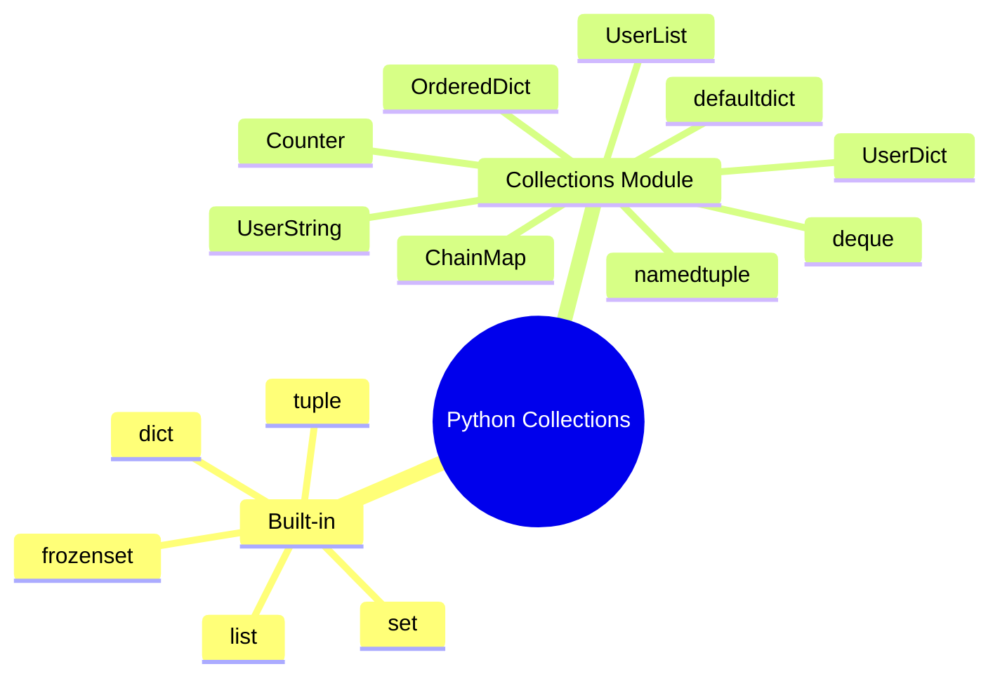
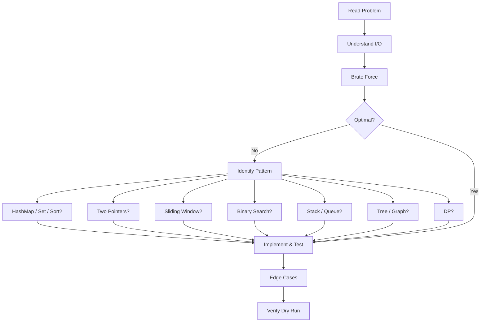

# 🐍 Python Coding Interview Cheatsheet
## Quick Reference for Service-Based Company Interviews



---

## 📌 Quick Syntax Reference

```python
# Variable assignment
x = 5                   # int
y = 3.14                # float
s = "hello"             # str
b = True                # bool
n = None                # NoneType

# Multiple assignment
a, b = 10, 20
a, b = b, a             # swap — no temp variable needed

# Type checking & conversion
type(x)                 # <class 'int'>
isinstance(x, int)      # True
int("42")               # 42
str(42)                 # "42"
float("3.14")           # 3.14
list("abc")             # ['a', 'b', 'c']
tuple([1, 2, 3])        # (1, 2, 3)
set([1, 2, 2, 3])       # {1, 2, 3}

# Conditional
result = "even" if x % 2 == 0 else "odd"
```

> 💡 **Quick Note:** `a, b = b, a` is Python's built-in swap. Don't write a temp variable — it shows you know Python idioms.

---

## Data Types

| Type | Example | Mutable | Ordered | Duplicates |
|------|---------|---------|---------|------------|
| `int` | `42` | N/A | N/A | N/A |
| `float` | `3.14` | N/A | N/A | N/A |
| `str` | `"hello"` | ❌ | ✅ | ✅ |
| `bool` | `True` | N/A | N/A | N/A |
| `NoneType` | `None` | N/A | N/A | N/A |
| `list` | `[1, 2, 3]` | ✅ | ✅ | ✅ |
| `tuple` | `(1, 2, 3)` | ❌ | ✅ | ✅ |
| `dict` | `{"a": 1}` | ✅ | ✅ (3.7+) | Keys: ❌, Vals: ✅ |
| `set` | `{1, 2, 3}` | ✅ | ❌ | ❌ |
| `frozenset` | `frozenset({1, 2})` | ❌ | ❌ | ❌ |

```python
# Truthy / Falsy values
# Falsy: False, None, 0, 0.0, "", [], {}, (), set()
# Everythng else is truthy

# Type checking
isinstance(x, (int, float))  # check multiple types
```

> ⚠️ **Common Mistake:** Using `==` to compare to `None` or `True`/`False` — use `is` instead: `if x is None:`

---

## Lists

### Creation

```python
arr = [1, 2, 3]
zeros = [0] * 5            # [0, 0, 0, 0, 0]
nested = [[0] * 3 for _ in range(3)]  # [[0,0,0], [0,0,0], [0,0,0]]
wrong = [[0] * 3] * 3      # BUG: same reference 3 times!
matrix = [list(range(i, i+3)) for i in range(3)]

# From string
chars = list("hello")      # ['h', 'e', 'l', 'l', 'o']
```

> ⚠️ **Common Mistake:** `[[0] * 3] * 3` creates 3 references to the SAME inner list. Always use list comprehension for 2D arrays.

### Slicing

```python
arr = [0, 1, 2, 3, 4, 5]
arr[1:4]       # [1, 2, 3]
arr[:3]        # [0, 1, 2]
arr[3:]        # [3, 4, 5]
arr[::-1]      # [5, 4, 3, 2, 1, 0] — reverse
arr[::2]       # [0, 2, 4] — every other
arr[1:5:2]     # [1, 3] — start:stop:step
arr[-1]        # 5 — last element
arr[-3:]       # [3, 4, 5] — last 3 elements

# Assign via slice
arr[1:3] = [99, 100]       # [0, 99, 100, 3, 4, 5]
```

> 💡 **Quick Note:** `arr[::-1]` creates a new reversed list. For in-place, use `arr.reverse()` or `reversed(arr)` for iteration.

### Methods

| Method | Description | Time Complexity |
|--------|-------------|-----------------|
| `append(x)` | Add x to end | O(1) |
| `extend(iter)` | Extend with iterable | O(k) |
| `insert(i, x)` | Insert at index | O(n) |
| `pop()` | Remove & return last | O(1) |
| `pop(i)` | Remove & return at i | O(n) |
| `remove(x)` | Remove first x | O(n) |
| `index(x)` | Find first index of x | O(n) |
| `count(x)` | Count occurrences | O(n) |
| `sort()` | In-place sort | O(n log n) |
| `reverse()` | In-place reverse | O(n) |
| `clear()` | Remove all | O(n) |
| `copy()` | Shallow copy | O(n) |

```python
# Using list as a stack (LIFO)
stack = []
stack.append(1)       # push
top = stack.pop()      # pop
```

> ⚠️ **Common Mistake:** `list.insert(0, x)` and `list.pop(0)` are both O(n). Use `collections.deque` for O(1) front operations.

### List Comprehensions

```python
squares = [x**2 for x in range(10)]
evens = [x for x in range(20) if x % 2 == 0]
matrix_flat = [num for row in matrix for num in row]
pairs = [(x, y) for x in [1,2,3] for y in [4,5,6]]
cartesian = [(x, y) for x in range(3) for y in range(3) if x != y]
```

### Common List Patterns

```python
# Partition list
evens, odds = [x for x in nums if x % 2 == 0], [x for x in nums if x % 2 == 1]

# Flatten list of lists
flattened = [item for sublist in list_of_lists for item in sublist]

# Group consecutive elements
from itertools import groupby
groups = [list(g) for _, g in groupby(arr)]

# Running sum
running = list(itertools.accumulate(arr))

# Remove duplicates (preserving order)
seen = set()
unique = [x for x in arr if not (x in seen or seen.add(x))]
```

---

## Strings

### Creation & Basics

```python
s = "hello"
s = 'hello'                      # single quotes work too
s = """multi line
string"""
s = "Concat" + "enate"           # concatenation
s = "Repeat " * 3                # "Repeat Repeat Repeat "
s = f"Value is {42}"             # f-string (Python 3.6+)
```

### Methods

| Method | Description | Example |
|--------|-------------|---------|
| `s.lower()` | Lowercase | `"HELLO".lower()` → `"hello"` |
| `s.upper()` | Uppercase | `"hello".upper()` → `"HELLO"` |
| `s.strip()` | Remove whitespace | `" hi ".strip()` → `"hi"` |
| `s.lstrip()` | Left strip | `" hi".lstrip()` → `"hi"` |
| `s.rstrip()` | Right strip | `"hi ".rstrip()` → `"hi"` |
| `s.split()` | Split by whitespace | `"a b c".split()` → `["a","b","c"]` |
| `s.split(delim)` | Split by delim | `"a,b".split(",")` → `["a","b"]` |
| `s.rsplit()` | Right-to-left split | — |
| `delim.join(list)` | Join list | `",".join(["a","b"])` → `"a,b"` |
| `s.find(sub)` | First index of sub | `"abc".find("b")` → `1` |
| `s.rfind(sub)` | Last index of sub | — |
| `s.index(sub)` | First index (or error) | — |
| `s.replace(old, new)` | Replace all | `"aa".replace("a","b")` → `"bb"` |
| `s.count(sub)` | Count occurrences | `"abca".count("a")` → `2` |
| `s.startswith(prefix)` | Check prefix | `"hello".startswith("he")` → `True` |
| `s.endswith(suffix)` | Check suffix | `"hello".endswith("lo")` → `True` |
| `s.isalpha()` | All letters? | `"abc".isalpha()` → `True` |
| `s.isdigit()` | All digits? | `"123".isdigit()` → `True` |
| `s.isalnum()` | Alphanumeric? | `"ab12".isalnum()` → `True` |
| `s.isspace()` | All whitespace? | — |
| `s.zfill(width)` | Zero-pad | `"42".zfill(5)` → `"00042"` |

```python
# Character checks
"AB".isupper()        # True
"ab".islower()        # True
"Hello".istitle()     # True
```

### String Slicing

```python
s = "hello world"
s[0:5]       # "hello"
s[6:]        # "world"
s[::-1]      # "dlrow olleh" — reverse
s[::2]       # "hlowrd" — every other char
```

### String Manipulation Patterns

```python
# Check if palindrome
is_pal = s == s[::-1]

# Character frequency
from collections import Counter
freq = Counter(s)

# Alphabet index
idx = ord('c') - ord('a')          # 2
char = chr(ord('a') + 2)           # 'c'

# Count vowels
vowels = sum(1 for c in s if c in "aeiouAEIOU")

# Remove specific characters
"".join(c for c in s if c.isalnum())

# Check anagram
is_anagram = Counter(s1) == Counter(s2)

# Longest common prefix
def longest_common_prefix(strs):
    res = ""
    for chars in zip(*strs):
        if len(set(chars)) == 1:
            res += chars[0]
        else:
            break
    return res
```

> ⚠️ **Common Mistake:** Strings are IMMUTABLE. `s[0] = 'H'` raises a TypeError. Use `s = 'H' + s[1:]` instead.

> 💡 **Quick Note:** `ord('a')` = 97, `ord('A')` = 65. Difference between a-z and A-Z is 32. Remember: `ord('0')` = 48.

### String Formatting

```python
# f-strings (preferred — Python 3.6+)
name, age = "Alice", 30
f"{name} is {age} years old"      # "Alice is 30 years old"
f"{x:.2f}"                        # 2 decimal places: "3.14"
f"{x:06d}"                        # zero-padded: "000042"

# .format() method
"{} is {} years old".format(name, age)
"{1} is {0} years old".format(age, name)  # positional

# % formatting (old style)
"%s is %d years old" % (name, age)
```

---

## Dictionaries

### Creation

```python
d = {"a": 1, "b": 2}
d = dict(a=1, b=2)                   # keyword args
d = dict.fromkeys(["a", "b"], 0)     # {"a": 0, "b": 0}
d = {x: x**2 for x in range(5)}     # comprehension
d = {}                                # empty dict
d = dict(zip(keys, values))          # from two lists
```

### Methods

| Method | Description | Returns |
|--------|-------------|---------|
| `d[key]` | Access value | Value or KeyError |
| `d.get(key, default)` | Safe access | Value or default |
| `d[key] = val` | Set value | — |
| `d.update(other)` | Merge dict | — |
| `d.pop(key)` | Remove & return | Value |
| `d.popitem()` | Remove last inserted | (key, val) |
| `d.clear()` | Remove all | — |
| `d.keys()` | All keys | `dict_keys` view |
| `d.values()` | All values | `dict_values` view |
| `d.items()` | All pairs | `dict_items` view |
| `d.setdefault(k, v)` | Set if missing | Value |
| `k in d` | Check existence | bool |
| `len(d)` | Number of keys | int |
| `d.copy()` | Shallow copy | dict |

```python
# Safe access pattern
count = d.get("count", 0) + 1

# Iteration
for key in d: ...
for key in d.keys(): ...
for val in d.values(): ...
for key, val in d.items(): ...

# Count frequencies
freq = {}
for x in arr:
    freq[x] = freq.get(x, 0) + 1
```

### defaultdict & Counter

```python
from collections import defaultdict, Counter

# defaultdict — auto-initialize missing keys
d = defaultdict(int)          # default 0
d = defaultdict(list)         # default []
d = defaultdict(set)          # default set()
d = defaultdict(lambda: 0)    # custom default

d["key"] += 1                 # works even if "key" doesn't exist

# Group-by pattern
groups = defaultdict(list)
for name, score in scores:
    groups[name].append(score)

# Counter — frequency counter
c = Counter("hello world")
c.most_common(3)              # [('l', 3), ('o', 2), ('h', 1)]
c["z"]                        # 0 (no KeyError!)
list(c.elements())            # all elements as list
c.update("hello")             # add more elements

# Counter operations
c1 + c2                       # union (sum counts)
c1 - c2                       # difference (keep positive)
c1 & c2                       # intersection (min)
c1 | c2                       # union (max)
```

> 💡 **Quick Note:** `Counter` is a `dict` subclass. It never raises KeyError — missing keys return 0.

---

## Sets

### Creation

```python
s = {1, 2, 3}
s = set([1, 2, 3])             # from iterable
s = {x for x in range(10) if x % 2 == 0}  # comprehension
s = set()                       # empty set (not {} which is empty dict)
```

### Methods & Operations

| Method | Description | Time |
|--------|-------------|------|
| `s.add(x)` | Add element | O(1) |
| `s.remove(x)` | Remove (KeyError if missing) | O(1) |
| `s.discard(x)` | Remove (no error if missing) | O(1) |
| `s.pop()` | Remove & return arbitrary | O(1) |
| `s.clear()` | Remove all | O(n) |
| `s.copy()` | Shallow copy | O(n) |
| `x in s` | Check membership | O(1) |

### Set Operations

```python
a = {1, 2, 3}
b = {3, 4, 5}

a | b           # {1, 2, 3, 4, 5}  — union
a & b           # {3}              — intersection
a - b           # {1, 2}           — difference
a ^ b           # {1, 2, 4, 5}     — symmetric difference

a.union(b)      # same as |
a.intersection(b)
a.difference(b)
a.symmetric_difference(b)
a.issubset(b)   # True if a ⊆ b
a.issuperset(b) # True if a ⊇ b
a.isdisjoint(b) # True if no common
```

> 💡 **Quick Note:** Sets are implemented as hash tables. O(1) average for add, remove, and membership check.

> ⚠️ **Common Mistake:** `{}` creates an empty dict, not set. Use `set()` for empty set.

---

## Tuples

```python
t = (1, 2, 3)
t = 1, 2, 3                    # parentheses optional
t = (1,)                        # single-element tuple (comma required!)
t = tuple([1, 2, 3])           # from iterable

# Access
t[0]       # 1
t[-1]      # 3

# Immutable — cannot modify!
# t[0] = 99  # TypeError

# Tuple unpacking
a, b, c = (1, 2, 3)
a, *rest = (1, 2, 3, 4)       # a=1, rest=[2,3,4]

# Named tuple
from collections import namedtuple
Point = namedtuple("Point", ["x", "y"])
p = Point(10, 20)
p.x        # 10
p[0]       # 10
x, y = p   # unpacking

# Use as dict keys (hashable)
d = {(1, 2): "point"}
```

> 📌 **Remember:** Use tuples for fixed collections (coordinates, RGB values) and as dict keys. Use lists for variable-length sequences.

---

## Loops

### For Loop

```python
# Range
for i in range(n): ...                # 0 to n-1
for i in range(start, stop): ...      # start to stop-1
for i in range(start, stop, step): ...

# Iterate over sequence
for x in arr: ...
for i, x in enumerate(arr): ...       # with index
for x in reversed(arr): ...           # reversed
for x in sorted(arr): ...             # sorted copy

# Iterate multiple sequences
for a, b in zip(list1, list2): ...    # parallel
for a, b in zip_longest(list1, list2, fillvalue=0): ...  # unequal lengths

# Iterate dictionary
for key in d: ...
for val in d.values(): ...
for key, val in d.items(): ...
```

### While Loop

```python
while condition: ...
while True:
    if condition: break
    if condition: continue
```

### Enumerate & Zip

```python
# Enumerate — get index AND value
for i, val in enumerate(arr):
    print(i, val)                    # 0 a, 1 b, 2 c

# Start at custom index
for i, val in enumerate(arr, start=1):
    print(i, val)                    # 1 a, 2 b, 3 c

# Zip — iterate multiple lists in parallel
names = ["a", "b", "c"]
scores = [90, 85, 88]
for name, score in zip(names, scores):
    print(f"{name}: {score}")

# Unzip
pairs = [(1, 'a'), (2, 'b'), (3, 'c')]
nums, letters = zip(*pairs)          # (1, 2, 3), ('a', 'b', 'c')

# Zip to dict
d = dict(zip(keys, values))
```

> 💡 **Quick Note:** `zip(*list_of_pairs)` unzips — one of the most elegant Python patterns.

---

## Functions

### Basic Functions

```python
def add(a, b):
    return a + b

# Default arguments
def greet(name, greeting="Hello"):
    return f"{greeting}, {name}!"

# Keyword arguments
greet(greeting="Hi", name="Alice")
```

### *args and **kwargs

```python
def var_args(*args, **kwargs):
    # args → tuple of positional args
    # kwargs → dict of keyword args
    print(args)     # (1, 2, 3)
    print(kwargs)   # {"a": 1, "b": 2}

var_args(1, 2, 3, a=1, b=2)

# Unpacking in calls
nums = [1, 2, 3]
func(*nums)               # same as func(1, 2, 3)
kwargs = {"a": 1, "b": 2}
func(**kwargs)            # same as func(a=1, b=2)
```

### Lambda

```python
square = lambda x: x ** 2
add = lambda a, b: a + b

# Used with sort, map, filter, reduce
sorted(arr, key=lambda x: x[1])             # sort by second element
list(map(lambda x: x * 2, arr))             # double each
list(filter(lambda x: x % 2 == 0, arr))     # keep evens
```

### Type Hints

```python
def add(a: int, b: int) -> int:
    return a + b

def process(items: list[int]) -> dict[str, int]:
    return {str(x): x for x in items}

from typing import Optional, List, Dict, Tuple, Set, Any

def find(target: Optional[int] = None) -> List[int]:
    ...
```

> 📌 **Remember:** Type hints are NOT enforced at runtime — they're for readability and tools (mypy, IDE). But interviewers LOVE seeing them.

---

## Sorting

```python
# sorted() — returns new list
sorted(arr)                               # ascending
sorted(arr, reverse=True)                 # descending
sorted(arr, key=lambda x: x[1])           # sort by second element
sorted(arr, key=lambda x: -x[1])          # descending by second element

# list.sort() — in-place
arr.sort()
arr.sort(reverse=True)
arr.sort(key=len)                         # sort by length

# Custom comparator (using functools.cmp_to_key)
from functools import cmp_to_key
def compare(a, b):
    if a < b: return -1
    if a > b: return 1
    return 0
sorted(arr, key=cmp_to_key(compare))

# Sort dict by values
sorted(d.items(), key=lambda x: x[1])     # list of tuples
dict(sorted(d.items(), key=lambda x: x[1]))  # dict (3.7+)
```

> 💡 **Quick Note:** `sorted()` returns a new list (O(n) space). `list.sort()` modifies in-place (O(1) space). Both are O(n log n) time.

### Custom Sort Patterns

```python
# Sort by multiple criteria
sorted(arr, key=lambda x: (x[1], x[0]))   # by col 1, then col 0

# Sort strings by length, then alphabetically
sorted(words, key=lambda x: (len(x), x))

# Sort with custom class
sorted(objs, key=lambda x: x.attr)

# Sort by frequency (Counter)
from collections import Counter
c = Counter(arr)
sorted(c.keys(), key=lambda x: -c[x])     # most frequent first
```

---

## Collections Module

### deque — Double-Ended Queue

```python
from collections import deque

dq = deque([1, 2, 3])
dq.append(4)               # add to right → [1, 2, 3, 4]
dq.appendleft(0)           # add to left  → [0, 1, 2, 3, 4]
dq.pop()                   # remove from right → 4
dq.popleft()               # remove from left  → 0
dq.extend([4, 5])          # extend right
dq.extendleft([-1, 0])     # extend left (reversed order)
dq.rotate(1)               # right rotate by 1
dq.rotate(-1)              # left rotate by 1

# BFS queue
queue = deque([start])
while queue:
    node = queue.popleft()
    for neighbor in graph[node]:
        queue.append(neighbor)
```

| Operation | Time |
|-----------|------|
| `append()`, `appendleft()` | O(1) |
| `pop()`, `popleft()` | O(1) |
| `extend()`, `extendleft()` | O(k) |
| `rotate(k)` | O(k) |
| Index access `dq[i]` | O(n) |
| Membership `x in dq` | O(n) |

### defaultdict

```python
from collections import defaultdict

# Type-based defaults
dd_int = defaultdict(int)         # default_factory returns 0
dd_list = defaultdict(list)       # default_factory returns []
dd_set = defaultdict(set)         # default_factory returns set()

# Custom default factory
dd = defaultdict(lambda: "N/A")

# Common interview patterns
graph = defaultdict(list)
for u, v in edges:
    graph[u].append(v)
    graph[v].append(u)

freq = defaultdict(int)
for x in arr:
    freq[x] += 1
```

### Counter

```python
from collections import Counter

c = Counter("aabbbccde")     # Counter({'b': 3, 'c': 2, 'a': 2, 'e': 1})
c["z"]                       # 0 — no KeyError!
c.most_common(2)             # [('b', 3), ('c', 2)]
c.total()                    # sum of all counts (Python 3.10+)

# Arithmetic
c1 = Counter(a=3, b=1)
c2 = Counter(a=1, b=2)
c1 + c2                      # Counter({'a': 4, 'b': 3})
c1 - c2                      # Counter({'a': 2}) — no negatives
c1 & c2                      # Counter({'a': 1, 'b': 1}) — intersection (min)
c1 | c2                      # Counter({'a': 3, 'b': 2}) — union (max)
```

### OrderedDict

```python
from collections import OrderedDict

# Remembers insertion order (regular dict does too in 3.7+)
# Useful for: LRU Cache, order-sensitive operations
od = OrderedDict()
od["a"] = 1
od["b"] = 2
od.move_to_end("a")          # move "a" to end
od.popitem(last=True)        # remove last (LIFO)
od.popitem(last=False)       # remove first (FIFO)
```

### namedtuple

```python
from collections import namedtuple

Point = namedtuple("Point", ["x", "y"])
p = Point(10, 20)
p.x            # 10 (by name)
p[0]           # 10 (by index)
x, y = p       # unpacking

# With defaults
Person = namedtuple("Person", ["name", "age", "city"], defaults=["Unknown"])
```

---

## heapq — Heap / Priority Queue

```python
import heapq

heap = [3, 1, 4, 1, 5]
heapq.heapify(heap)            # O(n) → heap = [1, 1, 4, 3, 5]

heapq.heappush(heap, 2)        # O(log n)
smallest = heapq.heappop(heap) # O(log n) → returns 1
peek = heap[0]                 # O(1) — smallest element (don't pop!)

# n-largest / n-smallest
heapq.nlargest(3, [1, 3, 5, 2, 4])   # [5, 4, 3] — O(n log k)
heapq.nsmallest(3, [1, 3, 5, 2, 4])  # [1, 2, 3]

# Max-heap via negation
max_heap = [-x for x in [1, 3, 5, 2, 4]]
heapq.heapify(max_heap)
largest = -heapq.heappop(max_heap)    # 5
```

> 💡 **Quick Note:** Python's `heapq` is a MIN-heap. For max-heap, push/pop negative values.

### Heap Patterns

```python
# Kth largest element
def find_kth_largest(nums, k):
    heap = nums[:k]
    heapq.heapify(heap)
    for num in nums[k:]:
        if num > heap[0]:
            heapq.heapreplace(heap, num)
    return heap[0]

# Merge K sorted lists
def merge_k_sorted(lists):
    heap = []
    for i, lst in enumerate(lists):
        if lst:
            heapq.heappush(heap, (lst[0], i, 0))
    result = []
    while heap:
        val, list_idx, elem_idx = heapq.heappop(heap)
        result.append(val)
        if elem_idx + 1 < len(lists[list_idx]):
            heapq.heappush(heap, (lists[list_idx][elem_idx + 1], list_idx, elem_idx + 1))
    return result

# Top K frequent
def top_k_frequent(nums, k):
    from collections import Counter
    freq = Counter(nums)
    return [num for num, _ in freq.most_common(k)]
```

---

## bisect — Binary Search

```python
import bisect

arr = [1, 3, 5, 7, 9]

pos = bisect.bisect_left(arr, 5)     # 2  — first index to insert to keep order
pos = bisect.bisect_right(arr, 5)    # 3  — last index to insert to keep order
pos = bisect.bisect(arr, 5)          # 3  — alias for bisect_right

bisect.insort_left(arr, 4)           # insert 4 at correct position
bisect.insort_right(arr, 4)          # insert 4 at correct position (rightmost)
bisect.insort(arr, 4)                # alias for insort_right

# Custom key (Python 3.10+)
bisect.bisect_left(arr, 5, key=lambda x: x * 2)
```

> 💡 **Quick Note:** `bisect_left` = lower_bound, `bisect_right` = upper_bound. For strictly increasing arrays, they're the same for existing values.

### Interview Patterns

```python
# Find first occurrence of target
def first_occurrence(arr, target):
    idx = bisect.bisect_left(arr, target)
    return idx if idx < len(arr) and arr[idx] == target else -1

# Find last occurrence of target
def last_occurrence(arr, target):
    idx = bisect.bisect_right(arr, target) - 1
    return idx if idx >= 0 and arr[idx] == target else -1

# Count occurrences in sorted array
def count_occurrences(arr, target):
    left = bisect.bisect_left(arr, target)
    right = bisect.bisect_right(arr, target)
    return right - left
```

---

## itertools — Iteration Tools

```python
import itertools

# Infinite iterators
itertools.count(10)        # 10, 11, 12, ...
itertools.cycle("AB")      # A, B, A, B, ...
itertools.repeat(5, 3)     # 5, 5, 5

# Combinatorics
list(itertools.permutations([1, 2, 3], 2))  # (1,2),(1,3),(2,1),(2,3),(3,1),(3,2)
list(itertools.combinations([1, 2, 3], 2))  # (1,2),(1,3),(2,3)
list(itertools.product([1, 2], "AB"))       # (1,'A'),(1,'B'),(2,'A'),(2,'B')
list(itertools.product([0, 1], repeat=3))   # 8 binary tuples (bitmask pattern)

# Chaining
list(itertools.chain([1, 2], [3, 4]))       # [1, 2, 3, 4]
list(itertools.chain.from_iterable([[1,2], [3,4]]))  # [1, 2, 3, 4]

# Grouping
for key, group in itertools.groupby("AAABBBCCA"):
    print(key, list(group))
# A ['A', 'A', 'A']
# B ['B', 'B', 'B']
# C ['C', 'C']
# A ['A']

# Accumulating
list(itertools.accumulate([1, 2, 3, 4]))           # [1, 3, 6, 10]
list(itertools.accumulate([1, 2, 3, 4], lambda a, b: a * b))  # [1, 2, 6, 24]

# Slicing
list(itertools.islice(range(10), 2, 8, 2))  # [2, 4, 6]

# Zipping
list(itertools.zip_longest([1, 2], [3], fillvalue=0))  # [(1, 3), (2, 0)]

# Filtering
list(itertools.compress("ABCD", [1, 0, 1, 0]))  # ['A', 'C']
list(itertools.dropwhile(lambda x: x < 3, [1, 2, 3, 4]))  # [3, 4]
list(itertools.takewhile(lambda x: x < 3, [1, 2, 3, 4]))  # [1, 2]
```

> 💡 **Quick Note:** `itertools.permutations` and `itertools.combinations` are gold for backtracking interview problems. Use `product([0,1], repeat=n)` for bitmask enumeration.

---

## math — Mathematical Functions

```python
import math

# Rounding
math.ceil(3.14)      # 4
math.floor(3.14)     # 3
math.trunc(3.14)     # 3 — truncate toward zero

# Integer operations
math.gcd(12, 8)      # 4 — greatest common divisor
math.lcm(12, 8)      # 24 — least common multiple (3.9+)
math.comb(5, 2)      # 10 — combinations (3.8+)
math.perm(5, 2)      # 20 — permutations (3.8+)
math.factorial(5)    # 120

# Power & logs
math.sqrt(16)        # 4.0
math.isqrt(16)       # 4 — integer sqrt (3.8+)
math.pow(2, 3)       # 8.0
math.log(100, 10)    # 2.0

# Trigonometry
math.sin(math.pi / 2)   # 1.0
math.cos(math.pi)       # -1.0
math.radians(180)       # π
math.degrees(math.pi)   # 180.0

# Constants
math.pi              # 3.14159...
math.e               # 2.71828...
math.inf             # infinity
math.nan             # NaN
```

> 📌 **Remember:** `math.gcd(a, b)` and `math.isqrt(n)` are often useful for number theory problems. Use `//` for integer division.

---

## functools — Functional Tools

```python
import functools

# lru_cache — memoization decorator
@functools.lru_cache(maxsize=None)
def fib(n):
    if n < 2: return n
    return fib(n-1) + fib(n-2)

# This caches results — turns O(2^n) into O(n)!
# .cache_info() shows hits/misses
# .cache_clear() clears cache

# reduce — fold operation
functools.reduce(lambda a, b: a + b, [1, 2, 3, 4])  # 10
functools.reduce(operator.mul, [1, 2, 3, 4])         # 24

# cmp_to_key — for custom comparators (see Sorting section)
functools.cmp_to_key(custom_compare)
```

### lru_cache for DP

```python
from functools import lru_cache

# Fibonacci
@lru_cache(None)
def fib(n):
    if n <= 1: return n
    return fib(n-1) + fib(n-2)

# Grid paths
@lru_cache(None)
def unique_paths(m, n):
    if m == 1 or n == 1: return 1
    return unique_paths(m-1, n) + unique_paths(m, n-1)

# House robber on trees
@lru_cache(None)
def rob(root):
    if not root: return 0
    # Two cases: rob this node or skip
    rob_this = root.val
    if root.left:
        rob_this += rob(root.left.left) + rob(root.left.right)
    if root.right:
        rob_this += rob(root.right.left) + rob(root.right.right)
    skip = rob(root.left) + rob(root.right)
    return max(rob_this, skip)
```

> 💡 **Quick Note:** `@lru_cache` makes recursion-based DP incredibly clean. Just write the brute-force recursion and add the decorator — it handles memoization.

---

## One-Liners for Common Interview Patterns

```python
# Palindrome
is_pal = s == s[::-1]

# Reverse string
rev = s[::-1]

# Reverse list
rev = arr[::-1]

# Flatten list of lists
flat = [x for row in matrix for x in row]

# Unique elements (preserving order)
unique = list(dict.fromkeys(arr))

# Most common element
most_common = max(set(arr), key=arr.count)  # O(n²) — use Counter for O(n)

# Check if all elements are unique
all_unique = len(arr) == len(set(arr))

# Transpose matrix
transposed = list(zip(*matrix))

# Rotate matrix 90° clockwise
rotated = list(zip(*matrix[::-1]))

# Rotate matrix 90° counter-clockwise
rotated = list(zip(*matrix))[::-1]

# Running sum
running = itertools.accumulate(arr)

# Group by key
groups = {k: list(g) for k, g in itertools.groupby(sorted(arr, key=key_fn), key_fn)}

# Cartesian product (nested loops)
pairs = [(x, y) for x in xs for y in ys]

# Chunk list into n-sized chunks
chunks = [arr[i:i+n] for i in range(0, len(arr), n)]

# Find duplicates in two lists
dupes = list(set(list1) & set(list2))

# Sort dict by value
sorted_d = dict(sorted(d.items(), key=lambda x: x[1]))

# Check anagram
is_anagram = Counter(s1) == Counter(s2)

# Swap case
swapped = s.swapcase()

# First non-repeating character
first_unique = next((c for c in s if s.count(c) == 1), None)  # O(n²)

# Count elements matching condition
count = sum(1 for x in arr if condition(x))
```

> ⚠️ **Common Mistake:** One-liners are great for interviews, but prioritize readability. If a one-liner takes 30 seconds to understand, write it as a loop instead.

---

## Input/Output

### Reading Input

```python
# Single integer
n = int(input())

# Multiple integers on one line
a, b = map(int, input().split())

# List of integers
arr = list(map(int, input().split()))

# List of strings
words = input().split()

# N lines of integers (2D)
matrix = [list(map(int, input().split())) for _ in range(n)]

# Read until EOF
import sys
for line in sys.stdin:
    process(line.strip())

# Faster input (for large inputs)
import sys
data = sys.stdin.read().split()
it = iter(data)
n = int(next(it))
arr = [int(next(it)) for _ in range(n)]
```

### Writing Output

```python
print("Hello")                          # string
print(a, b, c)                          # space-separated: "1 2 3"
print(a, b, c, sep=",")                # comma-separated: "1,2,3"
print(*arr)                             # unpack list
print(*arr, sep=" ")                    # "1 2 3"
print(*arr, sep="\n")                   # one per line

# Formatted
print(f"Case #{i}: {result}")
print("Case #{}: {}".format(i, result))

# Without newline
print("processing...", end="")
```

### Fast I/O Template

```python
import sys

def solve():
    data = sys.stdin.buffer.read().split()
    it = iter(data)
    t = int(next(it))
    out_lines = []
    for _ in range(t):
        n = int(next(it))
        arr = [int(next(it)) for _ in range(n)]
        # process
        out_lines.append(str(result))
    sys.stdout.write("\n".join(out_lines))

if __name__ == "__main__":
    solve()
```

> 💡 **Quick Note:** For coding challenges with large input, `sys.stdin.buffer.read().split()` is ~5x faster than multiple `input()` calls.

---

## Common Pitfalls

| Pitfall | Why | Correct |
|---------|-----|---------|
| `[[0]*3]*3` | Same reference 3 times | `[[0]*3 for _ in range(3)]` |
| `{}` for empty set | That's a dict | `set()` |
| `s.pop(0)` | O(n) | `collections.deque.popleft()` |
| `x = default if x` | Falsy values like 0 get replaced | `x if x is not None else default` |
| `result.append(path)` | Adds reference, not copy | `result.append(path[:])` |
| Modifying list while iterating | Skips elements | Iterate over copy: `for x in arr[:]` |
| `float('inf')` comparisons | Works but be careful | Use `math.inf` |
| `s[0] = 'H'` on string | Strings are immutable | `s = 'H' + s[1:]` |
| `x += 1` in lambda | Captures by reference | Use default arg: `lambda x, i=i: i` |
| Sorting with `None` values | Raises TypeError | `sorted(arr, key=lambda x: x or 0)` |
| `a == None` | Works but not idiomatic | `a is None` |
| Shallow copy of nested list | Modifications affect original | `copy.deepcopy()` |
| Using `is` for value comparison | `is` compares identity | Use `==` for equality |

```python
# Pitfall #1: Mutable default arguments
def bad(x, arr=[]):      # BUG: default list is shared
    arr.append(x)
    return arr

def good(x, arr=None):    # Correct
    if arr is None:
        arr = []
    arr.append(x)
    return arr

# Pitfall #2: Chained comparison
# WRONG:
if a < b < c:              # Actually correct in Python! This works as expected
    pass

# Pitfall #3: Late binding closures
# WRONG:
funcs = [lambda: i for i in range(5)]
# All funcs return 4!
# CORRECT:
funcs = [lambda i=i: i for i in range(5)]
```

---

## Time Complexity Quick Reference

| Data Structure | Access | Search | Insert | Delete |
|---------------|--------|--------|--------|--------|
| **list** | O(1) | O(n) | O(n) | O(n) |
| **stack** (list) | O(1) top | O(n) | O(1) push | O(1) pop |
| **queue** (deque) | O(1) ends | O(n) | O(1) | O(1) |
| **deque** | O(1) ends | O(n) | O(1) | O(1) |
| **dict** | O(1) key | O(1) key | O(1) | O(1) |
| **set** | — | O(1) | O(1) | O(1) |
| **heapq** | O(1) min | O(n) | O(log n) | O(log n) pop |
| **sorted list** | O(1) | O(log n) search | O(n) | O(n) |

### Algorithm Time Complexities

| Algorithm | Time | Space |
|-----------|------|-------|
| **Two Pointers** | O(n) | O(1) |
| **Sliding Window** | O(n) | O(1) or O(k) |
| **Binary Search** | O(log n) | O(1) |
| **BFS** | O(V + E) | O(V) |
| **DFS** | O(V + E) | O(V) |
| **Dijkstra** | O((V + E) log V) | O(V) |
| **Quick Sort** | O(n log n) avg | O(log n) |
| **Merge Sort** | O(n log n) | O(n) |
| **DP (1D)** | O(n) to O(n²) | O(n) |
| **DP (2D)** | O(m × n) | O(m × n) |
| **Backtracking** | O(2ⁿ) worst | O(n) |
| **Kadane's** | O(n) | O(1) |
| **KMP** | O(n + m) | O(m) |
| **Union-Find** | O(α(n)) | O(n) |

---

## Interview Problem-Solving Framework



### 5-Step Problem Solving Approach

| Step | Action | Time |
|------|--------|------|
| 1 | **Understand** — Clarify I/O, constraints, edge cases | 2 min |
| 2 | **Brute Force** — State simplest solution, analyze time/space | 2 min |
| 3 | **Optimize** — Identify pattern, discuss trade-offs | 5 min |
| 4 | **Implement** — Write clean, readable code | 10 min |
| 5 | **Verify** — Dry run with example, check edge cases | 3 min |

---

## Must-Know Python Idioms for Interviews

```python
# 1. Swap
a, b = b, a

# 2. Reverse
s[::-1]                          # string/list
arr.reverse()                    # list in-place

# 3. Chained comparison
if 0 < x < 10: ...

# 4. Ternary
max_val = a if a > b else b

# 5. Unpacking
first, *middle, last = [1, 2, 3, 4, 5]

# 6. enumerate start
for i, v in enumerate(arr, 1):

# 7. zip to dict
d = dict(zip(keys, values))

# 8. Transpose matrix
list(zip(*matrix))

# 9. Flatten
[x for row in matrix for x in row]

# 10. Remove None
[x for x in arr if x is not None]

# 11. Multiple conditions in any/all
if all(condition(x) for x in arr):
if any(condition(x) for x in arr):

# 12. Default dict
freq = defaultdict(int)
freq[key] += 1                   # no KeyError

# 13. Sort dict by value
sorted(d.items(), key=lambda x: x[1])

# 14. Chunk list
[arr[i:i+k] for i in range(0, len(arr), k)]

# 15. Most common element
Counter(arr).most_common(1)[0][0]
```

> 📌 **Remember:** Python's built-in functions (`sum`, `any`, `all`, `max`, `min`, `sorted`, `reversed`, `enumerate`, `zip`, `map`, `filter`) are your first line of defense. Use them.

---

## Revision Quick Reference (Last-Minute)

| Topic | Key Formula / Pattern |
|-------|----------------------|
| **Reverse list** | `arr[::-1]` |
| **Palindrome** | `s == s[::-1]` |
| **Frequency** | `Counter(s)` or `defaultdict(int)` |
| **Two Sum** | HashMap: `complement = target - num` |
| **Kadane** | `max_ending = max(x, max_ending + x)` |
| **Sliding Window (fixed)** | `window += arr[i] - arr[i-k]` |
| **Sliding Window (variable)** | `while invalid: shrink left` |
| **Binary Search** | `mid = left + (right - left) // 2` |
| **Tree DFS** | `stack = [root]; while stack: node = stack.pop()` |
| **Tree BFS** | `queue = deque([root]); while queue: node = queue.popleft()` |
| **Graph DFS** | `stack = [start]; visited = {start}` |
| **Graph BFS** | `queue = deque([start]); visited = {start}` |
| **Backtracking** | `path.append(x); recurse; path.pop()` |
| **DP** | Recursion → memoization → tabulation |
| **Heap top-k** | `heapq.nlargest(k, iterable)` |

---
Author: Tamilselvan S
LinkedIn: https://www.linkedin.com/in/tamilselvan-ai/
GitHub: `your-github-username`
---
