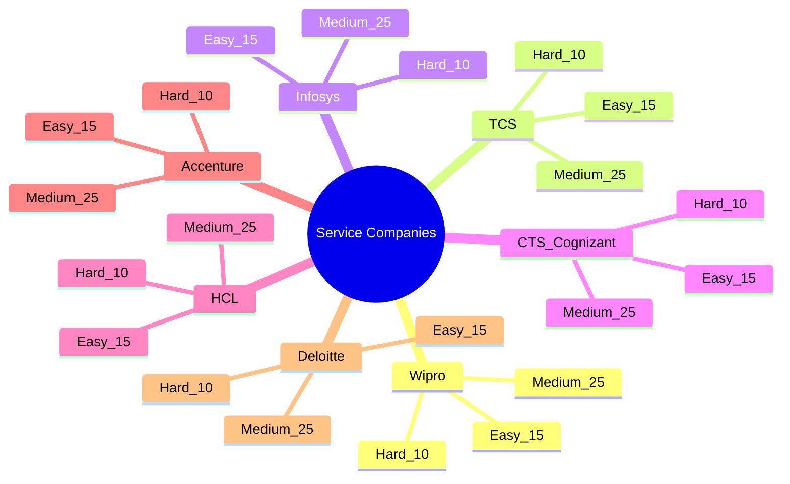
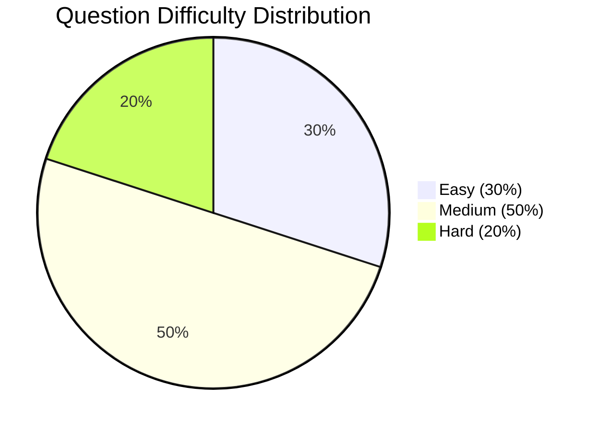

# Python Service Company Coding Preparation

> **SEO:** 350 Python coding interview questions for TCS, Infosys, Wipro, Accenture, HCL, CTS, Deloitte. 16 DSA patterns with flowcharts, 30-day roadmap, time complexity cheatsheet. Python interview preparation for service-based companies.
>
> **Your Ultimate Guide to Cracking Python Coding Interviews at Top Service-Based Companies**

[](https://python.org)
[](LICENSE)
[](https://github.com)

---

## 📋 Repository Overview

| Section | Description |
|---------|-------------|
| **Company-Wise Questions** | 50 curated Python coding questions per company (350 total) |
| **DSA Patterns** | 16 essential patterns with recognition tips and flowcharts |
| **Python Cheatsheet** | Quick syntax reference for interviews |
| **Complexity Cheatsheet** | Time & space complexity of all operations |
| **Interview Strategy** | Step-by-step guide to ace coding rounds |
| **Learning Roadmap** | 30-day structured preparation plan |

## 🏢 Companies Covered



## 📁 Folder Structure

```
Python_Service_Company_Coding_Preparation/
│
├── README.md                 # Repository overview (this file)
├── Learning_Roadmap.md       # 30-day structured study plan
├── Python_CheatSheet.md      # Quick Python syntax reference
├── DSA_Patterns.md           # 16 DSA patterns explained
├── Interview_Strategy.md     # How to ace coding rounds
├── Complexity_CheatSheet.md  # Time & space complexity reference
│
├── companies/
│   ├── Wipro.md
│   ├── TCS.md
│   ├── Infosys.md
│   ├── CTS.md
│   ├── HCL.md
│   ├── Accenture.md
│   └── Deloitte.md
│
├── patterns/
│   ├── Arrays.md
│   ├── Strings.md
│   ├── HashMap.md
│   ├── TwoPointers.md
│   ├── SlidingWindow.md
│   ├── Stack.md
│   ├── Queue.md
│   ├── LinkedList.md
│   ├── BinarySearch.md
│   ├── Trees.md
│   ├── Graph.md
│   ├── Heap.md
│   ├── Recursion.md
│   ├── Backtracking.md
│   ├── DynamicProgramming.md
│   └── Math.md
│
└── assets/
```

## 🎯 Who Is This For?

| Audience | Benefit |
|----------|---------|
| **Freshers** | Build foundation from scratch with curated questions |
| **1-5 Years Experienced** | Quick revision and pattern recognition |
| **Service Company Prep** | Company-specific question patterns |
| **Product Company Prep** | Strong DSA foundation with advanced patterns |
| **Last-Minute Revision** | Cheatsheets and quick notes |
| **GitHub Knowledge Base** | Structured reference for daily practice |

## 📊 Question Distribution



## 🚀 Quick Start

```bash
# Clone the repository
git clone https://github.com/your-username/Python_Service_Company_Coding_Preparation.git

# Navigate to the directory
cd Python_Service_Company_Coding_Preparation

# Start with your target company
cat companies/Wipro.md

# Or follow the roadmap
cat Learning_Roadmap.md
```

## 📅 Suggested Study Timeline

| Phase | Duration | Focus |
|-------|----------|-------|
| Foundation | Day 1-5 | Python basics, Arrays, Strings |
| Core DSA | Day 6-15 | HashMap, Two Pointers, Sliding Window, Stack, Queue |
| Advanced DSA | Day 16-25 | Trees, Graphs, DP, Recursion, Backtracking |
| Company Practice | Day 26-30 | Company-specific questions, Mock interviews |

## 🛠 How to Use This Repository

### For Freshers
1. Start with `Python_CheatSheet.md` to brush up syntax
2. Follow `Learning_Roadmap.md` day by day
3. Practice pattern-wise from `patterns/` folder
4. Solve company-specific questions

### For Experienced Professionals
1. Review `Complexity_CheatSheet.md` for quick reference
2. Scan `DSA_Patterns.md` for pattern recognition
3. Directly jump to your target company file
4. Focus on medium and hard questions

### For Last-Minute Revision
1. Read `Interview_Strategy.md`
2. Go through "Quick Revision Notes" sections in each question
3. Review the "Last Minute Revision" section in each company file

## ✨ Features

- **350+ Hand-Picked Questions**: Based on actual interview trends
- **Complete Solutions**: Production-quality Python code with type hints
- **Step-by-Step Dry Runs**: Understand exactly how the code works
- **Complexity Analysis**: Time and space for every approach
- **Mermaid Diagrams**: Visual explanations where needed
- **Pattern Recognition**: Identify question patterns instantly
- **Interview Tips**: What interviewers actually look for
- **Company-Specific Insights**: Each company's unique patterns

## 📈 Prerequisites

- Basic Python (variables, loops, functions)
- High school mathematics
- Willingness to practice consistently

## 🤝 Contributing

Contributions are welcome! Please feel free to submit a PR.

## ⚖️ License

This project is licensed under the MIT License - see the LICENSE file for details.

---

## 👤 Author

**Tamilselvan S**

- **LinkedIn**: [https://www.linkedin.com/in/tamilselvan-ai/](https://www.linkedin.com/in/tamilselvan-ai/)
- **GitHub**: `your-github-username`

---

*Happy Coding! Remember: Consistency beats intensity. Solve one question a day rather than 10 questions once a week.*
