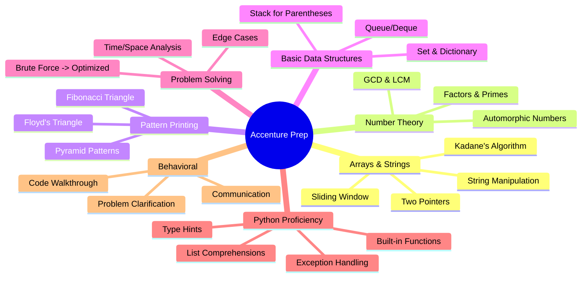

## Question 1: Find Factors of a Number

**Problem Statement:** Write a Python program to find all factors of a given positive integer N.

**Difficulty:** Easy
**Pattern:** Number Theory, Basic Math
**Companies Asked:** Accenture, TCS, Wipro, Infosys
**Concepts Needed:** Loops, modulo operator, list
**Constraints:**
- 1 <= N <= 10^6

**Approach 1 (Brute Force):**
- Iterate from 1 to N, check if N % i == 0
- Time: O(N), Space: O(1)

**Approach 2 (Optimized):**
- Iterate from 1 to sqrt(N)
- If i divides N, add both i and N//i
- Time: O(sqrt(N)), Space: O(1)

**Python Solution:**

```python
from typing import List


def find_factors(n: int) -> List[int]:
    factors: List[int] = []
    i: int = 1
    while i * i <= n:
        if n % i == 0:
            factors.append(i)
            if i != n // i:
                factors.append(n // i)
        i += 1
    return sorted(factors)


if __name__ == '__main__':
    n: int = 36
    result: List[int] = find_factors(n)
    print(f'Factors of {n}: {result}')
```

**Dry Run:**

```
N = 36

i = 1: 36 % 1 == 0 -> factors = [1, 36]
i = 2: 36 % 2 == 0 -> factors = [1, 36, 2, 18]
i = 3: 36 % 3 == 0 -> factors = [1, 36, 2, 18, 3, 12]
i = 4: 36 % 4 == 0 -> factors = [1, 36, 2, 18, 3, 12, 4, 9]
i = 5: 36 % 5 != 0
i = 6: 36 % 6 == 0 -> factors = [1, 36, 2, 18, 3, 12, 4, 9, 6]

Sorted: [1, 2, 3, 4, 6, 9, 12, 18, 36]
```

**Complexity:**
- Time: O(sqrt(N))
- Space: O(sqrt(N)) for storing factors

**Common Mistakes:**
- Not handling i == N//i case (perfect squares), leading to duplicates
- Forgetting to sort the result

**Edge Cases:**
- N = 1: factors = [1]
- N = prime: factors = [1, N]

**Variations:**
- Find prime factors only
- Find sum of all factors
- Find count of factors

**Follow-up Questions:**
- Find GCD using factors
- Check if a number is perfect (sum of factors = 2N)

**Interview Tips:**
- Start with brute force, then optimize
- Mention the sqrt(N) optimization
- Handle the perfect square edge case explicitly

**Expected Output:**
```
Factors of 36: [1, 2, 3, 4, 6, 9, 12, 18, 36]
```

**Quick Revision Notes:**
- Factors come in pairs (i, N//i) where i <= sqrt(N)
- For perfect squares, i == N//i, add only once

---
## Question 2: Check if Number is Automorphic

**Problem Statement:** An automorphic number is a number whose square ends with the number itself. Example: 5^2 = 25 ends with 5, so 5 is automorphic.

**Difficulty:** Easy
**Pattern:** Number Theory
**Companies Asked:** Accenture, TCS, Cognizant
**Concepts Needed:** Modulo operator, while loop
**Constraints:**
- 1 <= N <= 10^6

**Approach 1 (String-based):**
- Convert N and N^2 to strings, check if N^2 ends with N

**Approach 2 (Math-based):**
- Compute N^2, find number of digits d, check if N^2 % 10^d == N
- Time: O(log N), Space: O(1)

**Python Solution:**

```python
def is_automorphic(n: int) -> bool:
    square: int = n * n
    temp: int = n
    power: int = 1
    while temp > 0:
        power *= 10
        temp //= 10
    return square % power == n


if __name__ == '__main__':
    for num in [5, 25, 6, 76, 12]:
        print(f'{num} is automorphic: {is_automorphic(num)}')
```

**Dry Run:**

```
N = 25
square = 625
power = 1
temp = 25: power = 10, temp = 2
temp = 2: power = 100, temp = 0
square % 100 = 625 % 100 = 25 == N

Result: True (25^2 = 625)

N = 12
square = 144
square % 100 = 144 % 100 = 44 != 12
Result: False
```

**Complexity:**
- Time: O(log10 N)
- Space: O(1)

**Common Mistakes:**
- Using string methods when math-based approach is expected
- Off-by-one error in power calculation

**Edge Cases:**
- N = 1: 1^2 = 1 -> True
- N = 0: 0^2 = 0 -> True

**Variations:**
- Find all automorphic numbers in a range
- Check trimorphic (cube ends with number)

**Follow-up Questions:**
- How would you find the next automorphic number after N?

**Interview Tips:**
- This is a common Accenture question
- String approach is simpler, math approach shows deeper thinking

**Expected Output:**
```
5 is automorphic: True
25 is automorphic: True
6 is automorphic: True
76 is automorphic: True
12 is automorphic: False
```

**Quick Revision Notes:**
- Automorphic numbers always end with 0, 1, 5, or 6
- Known: 0, 1, 5, 6, 25, 76, 376, 625, 9376

---
## Question 3: Find HCF and LCM

**Problem Statement:** Write a program to find the Highest Common Factor (HCF) and Least Common Multiple (LCM) of two numbers A and B.

**Difficulty:** Easy
**Pattern:** Number Theory, GCD
**Companies Asked:** Accenture, TCS, Wipro
**Concepts Needed:** Euclidean algorithm, while loop
**Constraints:**
- 1 <= A, B <= 10^9

**Approach 1 (Brute Force):**
- Find min(A, B), iterate downwards to find HCF
- LCM = A * B // HCF

**Approach 2 (Euclidean Algorithm):**
- HCF(A, B) = HCF(B, A % B) until B = 0
- LCM = A * B // HCF
- Time: O(log min(A,B)), Space: O(1)

**Python Solution:**

```python
from typing import Tuple


def find_hcf_and_lcm(a: int, b: int) -> Tuple[int, int]:
    original_a: int = a
    original_b: int = b
    while b:
        a, b = b, a % b
    hcf: int = a
    lcm: int = (original_a * original_b) // hcf
    return hcf, lcm


if __name__ == '__main__':
    a, b = 12, 18
    hcf, lcm = find_hcf_and_lcm(a, b)
    print(f'HCF of {a} and {b}: {hcf}')
    print(f'LCM of {a} and {b}: {lcm}')
```

**Dry Run:**

```
A = 12, B = 18

Iter 1: a=12, b=18 -> a=18, b=12%18=12
Iter 2: a=18, b=12 -> a=12, b=18%12=6
Iter 3: a=12, b=6 -> a=6, b=12%6=0
b = 0, exit

HCF = 6
LCM = (12 * 18) // 6 = 36
```

**Complexity:**
- Time: O(log min(A, B))
- Space: O(1)

**Common Mistakes:**
- Not handling zero cases
- Forgetting formula LCM = A * B // HCF

**Edge Cases:**
- One number is 0: HCF = other, LCM = 0
- Both equal: HCF = LCM = the number
- Co-prime: HCF = 1, LCM = A * B

**Variations:**
- HCF of array, LCM of array

**Follow-up Questions:**
- Three numbers HCF/LCM
- Minimum rows for two parade groups (word problem)

**Interview Tips:**
- Euclidean algorithm is the standard
- Formula: A x B = HCF x LCM

**Expected Output:**
```
HCF of 12 and 18: 6
LCM of 12 and 18: 36
```

**Quick Revision Notes:**
- Euclid: HCF(a, b) = HCF(b, a % b) until b = 0
- LCM = a * b // HCF

---
## Question 4: Print Fibonacci Triangle

**Problem Statement:** Print a Fibonacci triangle for N rows. Each row i has i Fibonacci numbers.

**Difficulty:** Easy
**Pattern:** Pattern Printing, Series
**Companies Asked:** Accenture, TCS
**Concepts Needed:** Nested loops, Fibonacci series
**Constraints:**
- 1 <= N <= 20

**Approach:**
- Maintain a, b for Fibonacci sequence
- For each row i (1 to N), print i numbers, updating Fibonacci state
- Time: O(N^2), Space: O(1)

**Python Solution:**

```python
def fibonacci_triangle(n: int) -> None:
    a: int = 0
    b: int = 1
    for i in range(1, n + 1):
        row: str = ''
        for _ in range(i):
            row += str(a) + '  '
            a, b = b, a + b
        print(row.strip())


if __name__ == '__main__':
    fibonacci_triangle(5)
```

**Dry Run:**

```
N = 5, a=0, b=1

Row 1: print 0 -> a=1,b=1 => Output: 0
Row 2: print 1,1 -> a=2,b=3 => Output: 1  1
Row 3: print 2,3,5 -> a=8,b=13 => Output: 2  3  5
Row 4: print 8,13,21,34 -> a=55,b=89 => Output: 8  13  21  34
Row 5: print 55,89,144,233,377 => Output: 55  89  144  233  377
```

**Complexity:**
- Time: O(N^2)
- Space: O(1)

**Common Mistakes:**
- Starting with 1,1 vs 0,1
- Not updating Fibonacci correctly

**Edge Cases:**
- N = 1: prints '0'
- N = 0: prints nothing

**Variations:**
- Floyd's triangle
- Pascal's triangle
- Fibonacci pyramid

**Follow-up Questions:**
- Print sum of each row

**Interview Tips:**
- Accenture frequently asks pattern printing
- Maintain Fibonacci state globally across rows

**Expected Output:**
```
0
1  1
2  3  5
8  13  21  34
55  89  144  233  377
```

**Quick Revision Notes:**
- Row i has i Fibonacci numbers
- Maintain a, b = b, a + b globally

---
## Question 5: Count Distinct Elements in Array

**Problem Statement:** Given an array with possible duplicates, find the count of distinct elements.

**Difficulty:** Easy
**Pattern:** Arrays, Hashing
**Companies Asked:** Accenture, TCS, Infosys
**Concepts Needed:** Set, dictionary
**Constraints:**
- 1 <= N <= 10^5
- -10^9 <= arr[i] <= 10^9

**Approach 1 (Brute Force):** Nested loop: O(N^2)
**Approach 2 (Optimized):** Convert to set and return len: O(N), O(N)

**Python Solution:**
```python
from typing import List
def count_distinct(arr: List[int]) -> int:
    return len(set(arr))

if __name__ == '__main__':
    arr: List[int] = [4, 2, 7, 2, 4, 9, 6, 7, 1]
    print(f'Distinct count: {count_distinct(arr)}')
```

**Dry Run:**
```
arr = [4, 2, 7, 2, 4, 9, 6, 7, 1]
set(arr) = {1, 2, 4, 6, 7, 9}
len = 6
```

**Complexity:** Time: O(N), Space: O(N)
**Common Mistakes:** Forgetting set() deduplicates automatically
**Edge Cases:** Empty: 0, All same: 1, All distinct: N
**Variations:** Frequency count, count in window
**Follow-up:** Without set? Sort and count: O(N log N), O(1)
**Interview Tips:** Python's set is idiomatic. Mention sorting if no extra space.
**Expected Output:**
```
Distinct count: 6
```
**Quick Revision:** len(set(arr))
---# QUESTIONS (21-30): MEDIUM

## Question 21: Find Minimum in Rotated Sorted Array

**Problem Statement:** Find the minimum element in a sorted rotated array (no duplicates). Originally sorted ascending then rotated at some pivot.

**Difficulty:** Medium
**Pattern:** Binary Search
**Companies Asked:** Accenture, Amazon, Microsoft, Google
**Concepts Needed:** Binary search on rotation
**Constraints:**
- 1 <= N <= 10^5
- -10^9 <= arr[i] <= 10^9
- No duplicates

**Approach 1 (Brute Force):**
- Linear scan: O(N)

**Approach 2 (Optimized):**
- Binary search: if arr[mid] < arr[high], min in left half; else min in right half. Time: O(log N), Space: O(1)

**Python Solution:**

```python
from typing import List

def find_min_rotated(arr: List[int]) -> int:
    lo, hi = 0, len(arr) - 1
    while lo < hi:
        mid = (lo + hi) // 2
        if arr[mid] < arr[hi]:
            hi = mid
        else:
            lo = mid + 1
    return arr[lo]

if __name__ == "__main__":
    print(find_min_rotated([4, 5, 6, 7, 0, 1, 2]))
```

**Dry Run:**

```
arr = [4, 5, 6, 7, 0, 1, 2], lo=0, hi=6
mid=3: arr[3]=7 > arr[6]=2 -> lo=4
mid=5: arr[5]=1 < arr[6]=2 -> hi=5
mid=4: arr[4]=0 < arr[5]=1 -> hi=4
lo=4, hi=4 -> exit, return arr[4]=0
```

**Complexity:**
- Time: O(log N)
- Space: O(1)

**Common Mistakes:**
- Not comparing arr[mid] < arr[hi] correctly
- Forgetting no-duplicate assumption

**Edge Cases:**
- Not rotated: return arr[0]
- Single element: return it
- Already sorted: arr[0]

**Variations:**
- With duplicates
- Find pivot index
- Search target in rotated

**Follow-up Questions:**
- Follow-up with duplicates?
- All elements same?

**Interview Tips:**
- Binary search on rotated array. Compare mid with high to decide half.

**Expected Output:**
```
0
```

**Quick Revision Notes:**
- arr[mid] < arr[hi] -> min in left half (hi=mid). Else -> lo=mid+1.

---

## Question 22: Find the Missing Number

**Problem Statement:** Given array of size N containing integers from 1 to N with one missing number, find it.

**Difficulty:** Medium
**Pattern:** Arrays, XOR
**Companies Asked:** Accenture, TCS, Amazon
**Concepts Needed:** XOR or sum formula
**Constraints:**
- 1 <= N <= 10^5
- arr contains 1..N minus one number

**Approach 1 (Brute Force):**
- Sort and scan: O(N log N)

**Approach 2 (Optimized):**
- Sum 1..N = N*(N+1)//2. Subtract sum(arr) -> missing. XOR: xor_all ^ xor_arr = missing. Time: O(N), Space: O(1)

**Python Solution:**

```python
from typing import List

def find_missing(arr: List[int]) -> int:
    n = len(arr) + 1
    total = n * (n + 1) // 2
    return total - sum(arr)

if __name__ == "__main__":
    print(find_missing([1, 2, 4, 5, 6]))
```

**Dry Run:**

```
N=5+1=6, arr sum = 1+2+4+5+6 = 18
Expected sum = 6*7//2 = 21
Missing = 21 - 18 = 3
```

**Complexity:**
- Time: O(N)
- Space: O(1)

**Common Mistakes:**
- Using n = len(arr) instead of len+1
- Integer overflow in other languages (not in Python)

**Edge Cases:**
- Missing = 1: return 1
- Missing = N: return N

**Variations:**
- Find all missing
- Missing in 0..N
- Find duplicate and missing

**Follow-up Questions:**
- Two missing numbers?
- Find if one is missing?

**Interview Tips:**
- Sum method or XOR. XOR avoids overflow in other languages.

**Expected Output:**
```
3
```

**Quick Revision Notes:**
- sum(1..N) - sum(arr). XOR: xor_all ^ xor_arr.

---

## Question 23: Check Balanced Parentheses

**Problem Statement:** Check if string of brackets '(', ')', '{', '}', '[', ']' is balanced.

**Difficulty:** Medium
**Pattern:** Stack
**Companies Asked:** Accenture, TCS, Amazon, Microsoft
**Concepts Needed:** Stack, matching
**Constraints:**
- 1 <= len <= 10^5
- Only bracket chars

**Approach 1 (Brute Force):**
- Counts only (insufficient for multiple types)

**Approach 2 (Optimized):**
- Push opening onto stack. For closing, check if matches top. Time: O(N), Space: O(N)

**Python Solution:**

```python
def is_balanced(s: str) -> bool:
    stack, pairs = [], {')': '(', '}': '{', ']': '['}
    for ch in s:
        if ch in pairs:
            if not stack or stack.pop() != pairs[ch]:
                return False
        else:
            stack.append(ch)
    return not stack

if __name__ == "__main__":
    print(is_balanced("{[()]}"))
    print(is_balanced("{[(])}"))
```

**Dry Run:**

```
"{[()]}"
'{' push, '[' push, '(' push, ')' pop '(' ok, ']' pop '[' ok, '}' pop '{' ok -> True

"{[(])}"
'{' push, '[' push, '(' push, ']' -> pop '(' != '[' -> False
```

**Complexity:**
- Time: O(N)
- Space: O(N)

**Common Mistakes:**
- Using count only (wrong for mixed types)
- Not checking empty stack on pop

**Edge Cases:**
- Empty: True
- Only opening: False
- Only closing: False
- Single char

**Variations:**
- Min additions to balance
- Longest balanced
- With wildcards

**Follow-up Questions:**
- Multiple bracket types?
- HTML tags?

**Interview Tips:**
- Matching pairs dict + stack. Check empty before pop.

**Expected Output:**
```
True | False
```

**Quick Revision Notes:**
- Push opening. On closing: if stack empty or top != pair -> False. End: stack empty.

---

## Question 24: Remove Duplicates from Sorted Array (In-Place)

**Problem Statement:** Remove duplicates in-place from sorted array. Return length of unique elements.

**Difficulty:** Medium
**Pattern:** Arrays, Two Pointers
**Companies Asked:** Accenture, TCS, Amazon
**Concepts Needed:** Two pointers in-place
**Constraints:**
- 1 <= N <= 10^5
- Sorted array

**Approach 1 (Brute Force):**
- Use set (loses order but sorted, extra space)

**Approach 2 (Optimized):**
- Two pointers: j tracks unique position. When arr[i] != arr[j-1], place at j. Time: O(N), Space: O(1)

**Python Solution:**

```python
from typing import List

def remove_duplicates(nums: List[int]) -> int:
    if not nums: return 0
    j = 1
    for i in range(1, len(nums)):
        if nums[i] != nums[j-1]:
            nums[j] = nums[i]
            j += 1
    return j

if __name__ == "__main__":
    arr = [1, 1, 2, 2, 3, 4, 4, 5]
    k = remove_duplicates(arr)
    print(f"Length: {k}, Modified: {arr[:k]}")
```

**Dry Run:**

```
arr = [1, 1, 2, 2, 3, 4, 4, 5], j=1
i=1: 1==1 skip
i=2: 2!=1 -> arr[1]=2, j=2 -> [1,2,2,2,3,4,4,5]
i=3: 2==2 skip
i=4: 3!=2 -> arr[2]=3, j=3 -> [1,2,3,2,3,4,4,5]
i=5: 4!=3 -> arr[3]=4, j=4 -> [1,2,3,4,3,4,4,5]
i=6: 4==4 skip
i=7: 5!=4 -> arr[4]=5, j=5 -> [1,2,3,4,5,4,4,5]
Length: 5, first 5: [1,2,3,4,5]
```

**Complexity:**
- Time: O(N)
- Space: O(1)

**Common Mistakes:**
- Not handling empty
- Using del (O(N) per delete)
- Not using nums[j-1] correctly

**Edge Cases:**
- Empty: 0
- Single: 1
- All same: 1
- Already unique: N

**Variations:**
- At most 2 duplicates
- Remove from unsorted
- Remove specific value

**Follow-up Questions:**
- Return actual unique elements?
- Compress string?

**Interview Tips:**
- In-place must avoid extra array. j tracks where next unique goes.

**Expected Output:**
```
Length: 5, Modified: [1, 2, 3, 4, 5]
```

**Quick Revision Notes:**
- j=1. If nums[i] != nums[j-1]: nums[j]=nums[i]; j+=1. Return j.

---

## Question 25: Longest Common Prefix

**Problem Statement:** Find the longest common prefix string among an array of strings.

**Difficulty:** Medium
**Pattern:** String
**Companies Asked:** Accenture, TCS, Amazon
**Concepts Needed:** Horizontal scanning
**Constraints:**
- 1 <= len(arr) <= 200
- 0 <= len(s) <= 200

**Approach 1 (Brute Force):**
- Brute: compare chars at each index across all strings

**Approach 2 (Optimized):**
- Take first as prefix. For each next string, reduce prefix until match. Time: O(N*M), Space: O(M)

**Python Solution:**

```python
from typing import List

def longest_common_prefix(strs: List[str]) -> str:
    if not strs: return ""
    prefix = strs[0]
    for s in strs[1:]:
        while not s.startswith(prefix):
            prefix = prefix[:-1]
            if not prefix: return ""
    return prefix

if __name__ == "__main__":
    print(longest_common_prefix(["flower", "flow", "flight"]))
```

**Dry Run:**

```
prefix = "flower"
"flow": not startswith "flower" -> "flowe" -> "flow" -> starts -> prefix="flow"
"flight": not startswith "flow" -> "flo" -> "fl" -> starts -> prefix="fl"
Result: "fl"
```

**Complexity:**
- Time: O(N * M) worst
- Space: O(M) prefix

**Common Mistakes:**
- Empty array
- startswith vs find confusion

**Edge Cases:**
- Empty: ''
- Single: itself
- No common: ''
- All equal: full string

**Variations:**
- Longest common suffix
- Longest common substring
- LCP with Trie

**Follow-up Questions:**
- Optimal with Trie?
- Multiple languages?

**Interview Tips:**
- Start with first string, reduce iteratively. Trie for larger datasets.

**Expected Output:**
```
fl
```

**Quick Revision Notes:**
- Pick first as prefix. For next strings, shrink prefix until startswith matches.

---

## Question 26: Intersection of Two Arrays

**Problem Statement:** Find elements that appear in both arrays (unique intersection).

**Difficulty:** Medium
**Pattern:** Arrays, Sets
**Companies Asked:** Accenture, TCS, Amazon
**Concepts Needed:** Set intersection
**Constraints:**
- 1 <= N, M <= 10^5

**Approach 1 (Brute Force):**
- Nested loops: O(N*M)

**Approach 2 (Optimized):**
- Convert to sets and return intersection. Time: O(N+M), Space: O(N+M)

**Python Solution:**

```python
from typing import List

def intersect(arr1: List[int], arr2: List[int]) -> List[int]:
    return list(set(arr1) & set(arr2))

if __name__ == "__main__":
    print(intersect([1, 2, 2, 1], [2, 2]))
```

**Dry Run:**

```
set1={1,2}, set2={2}
Intersection = {2} -> [2]
```

**Complexity:**
- Time: O(N+M)
- Space: O(N+M)

**Common Mistakes:**
- Not handling duplicates per problem spec
- Forgetting to deduplicate

**Edge Cases:**
- Empty: []
- No intersection: []
- All common: full
- With duplicates: unique result

**Variations:**
- With duplicates count
- Intersection of multiple
- Difference

**Follow-up Questions:**
- In-place?
- Sorted arrays (two-pointer)?

**Interview Tips:**
- set intersection is O(min(N,M)). For sorted, two-pointer uses O(1) space.

**Expected Output:**
```
[2]
```

**Quick Revision Notes:**
- set(arr1) & set(arr2). For sorted arrays use two-pointer.

---

## Question 27: Find the Duplicate Number

**Problem Statement:** Given array of size N+1 with numbers 1..N, one duplicates (at least once). Find it. Cannot modify.

**Difficulty:** Medium
**Pattern:** Arrays, Floyd's Algorithm
**Companies Asked:** Accenture, Amazon, Google
**Concepts Needed:** Floyd's tortoise and hare
**Constraints:**
- 1 <= N <= 10^5
- arr.length = N+1
- 1 <= arr[i] <= N

**Approach 1 (Brute Force):**
- Set or sort: O(N) space or O(N log N) time

**Approach 2 (Optimized):**
- Floyd's cycle detection: arr[arr[i]] creates cycle. Slow/fast pointer. Time: O(N), Space: O(1)

**Python Solution:**

```python
from typing import List

def find_duplicate(nums: List[int]) -> int:
    slow = fast = nums[0]
    while True:
        slow = nums[slow]
        fast = nums[nums[fast]]
        if slow == fast: break
    slow = nums[0]
    while slow != fast:
        slow = nums[slow]
        fast = nums[fast]
    return slow

if __name__ == "__main__":
    print(find_duplicate([1, 3, 4, 2, 2]))
```

**Dry Run:**

```
nums = [1, 3, 4, 2, 2]
Phase 1:
slow=nums[0]=1, fast=nums[0]=1
slow=nums[1]=3, fast=nums[nums[1]]=nums[3]=2
slow=nums[3]=2, fast=nums[nums[2]]=nums[4]=2 -> slow==fast=2
Phase 2:
slow=nums[0]=1, fast=nums[2]=4
slow=nums[1]=3, fast=nums[4]=2
slow=nums[3]=2, fast=nums[2]=2 -> return 2
```

**Complexity:**
- Time: O(N)
- Space: O(1)

**Common Mistakes:**
- Modifying array when told not to
- Using O(N) space
- Forgetting edge cases

**Edge Cases:**
- N=1, arr=[1,1]: 1
- Duplicate at end

**Variations:**
- All numbers except one
- Find all duplicates
- Missing + duplicate

**Follow-up Questions:**
- Without cycle detection? Binary search O(N log N)?

**Interview Tips:**
- Floyd's is classic O(1) space. Only works because values are in [1,N].

**Expected Output:**
```
2
```

**Quick Revision Notes:**
- Phase 1: slow=nums[slow], fast=nums[nums[fast]] until equal. Phase 2: slow from start, both step=1.

---

## Question 28: Rotate Array by K Positions

**Problem Statement:** Rotate array to the right by K steps. Modifications must be in-place.

**Difficulty:** Medium
**Pattern:** Arrays
**Companies Asked:** Accenture, TCS, Amazon, Microsoft
**Concepts Needed:** Array reversal
**Constraints:**
- 1 <= N <= 10^5
- 0 <= K <= 10^5

**Approach 1 (Brute Force):**
- Pop and insert last to front: O(N*K)

**Approach 2 (Optimized):**
- Reverse full, reverse 0..K-1, reverse K..N-1. All with K %= N. Time: O(N), Space: O(1)

**Python Solution:**

```python
from typing import List

def rotate(nums: List[int], k: int) -> None:
    n = len(nums)
    k %= n
    if k == 0: return
    def rev(l, r):
        while l < r:
            nums[l], nums[r] = nums[r], nums[l]
            l += 1; r -= 1
    rev(0, n-1); rev(0, k-1); rev(k, n-1)

if __name__ == "__main__":
    arr = [1, 2, 3, 4, 5, 6, 7]
    rotate(arr, 3)
    print(arr)
```

**Dry Run:**

```
nums=[1,2,3,4,5,6,7], n=7, k=3
rev(0,6): [7,6,5,4,3,2,1]
rev(0,2): [5,6,7,4,3,2,1]
rev(3,6): [5,6,7,1,2,3,4]
Result: [5,6,7,1,2,3,4]
```

**Complexity:**
- Time: O(N)
- Space: O(1)

**Common Mistakes:**
- Forgetting K %= N
- Using extra array
- Not in-place

**Edge Cases:**
- K=0: unchanged
- K=N: unchanged
- Single element

**Variations:**
- Rotate left
- Rotate string
- Cyclic shift

**Follow-up Questions:**
- K >= N?
- Return array of rotated indices?

**Interview Tips:**
- Triple reversal is the standard O(1) space solution.

**Expected Output:**
```
[5, 6, 7, 1, 2, 3, 4]
```

**Quick Revision Notes:**
- k%=n. Reverse all. Reverse 0..k-1. Reverse k..n-1.

---

## Question 29: Find First and Last Position of Element in Sorted Array

**Problem Statement:** Given sorted array and target, find first and last occurrence. If not found, return [-1, -1].

**Difficulty:** Medium
**Pattern:** Binary Search
**Companies Asked:** Accenture, Amazon, Microsoft
**Concepts Needed:** Binary search, leftmost/rightmost
**Constraints:**
- 1 <= N <= 10^5
- Sorted

**Approach 1 (Brute Force):**
- Linear scan: O(N)

**Approach 2 (Optimized):**
- Binary search for first (arr[mid] >= target) and last (arr[mid] <= target). Time: O(log N), Space: O(1)

**Python Solution:**

```python
from typing import List

def search_range(nums: List[int], target: int) -> List[int]:
    def binary(gt):
        lo, hi = 0, len(nums)
        while lo < hi:
            mid = (lo + hi) // 2
            if (gt and nums[mid] > target) or (not gt and nums[mid] >= target):
                hi = mid
            else:
                lo = mid + 1
        return lo
    left = binary(False)
    if left == len(nums) or nums[left] != target:
        return [-1, -1]
    return [left, binary(True) - 1]

if __name__ == "__main__":
    print(search_range([5, 7, 7, 8, 8, 10], 8))
    print(search_range([5, 7, 7, 8, 8, 10], 6))
```

**Dry Run:**

```
nums=[5,7,7,8,8,10], target=8
binary(False): lo=0,hi=6 mid=3 nums[3]=8>=8 -> hi=3; mid=1 nums[1]=7<8 -> lo=2; mid=2 nums[2]=7<8 -> lo=3 -> return 3
left=3, nums[3]=8==8 -> found
binary(True): mid=3 nums[3]=8>8? No -> lo=4; mid=5 nums[5]=10>8 -> hi=5; mid=4 nums[4]=8>8? No -> lo=5 -> return 5
Result: [3, 4]

target=6: binary(False) returns 1, nums[1]=7!=6 -> [-1,-1]
```

**Complexity:**
- Time: O(log N)
- Space: O(1)

**Common Mistakes:**
- Using bisect_left from library (may ask you to implement)
- Off-by-one

**Edge Cases:**
- Not found: [-1,-1]
- Single occurrence: [i,i]
- All target: [0,N-1]

**Variations:**
- Count of target
- Insert position
- Closest element

**Follow-up Questions:**
- Target appears > N/2 times?
- Multiple queries?

**Interview Tips:**
- Implement binary search variants: first >= target and first > target.

**Expected Output:**
```
[3, 4] | [-1, -1]
```

**Quick Revision Notes:**
- left=first>=target. right=first>target-1. Check left is valid.

---

## Question 30: Spiral Traversal of Matrix

**Problem Statement:** Given an M x N matrix, return elements in spiral order (right, down, left, up).

**Difficulty:** Medium
**Pattern:** Matrix
**Companies Asked:** Accenture, Amazon, Microsoft, Google
**Concepts Needed:** Boundary traversal
**Constraints:**
- 1 <= M, N <= 1000

**Approach 1 (Brute Force):**
- Recursive removal of outer layer

**Approach 2 (Optimized):**
- Four pointers: top, bottom, left, right. Traverse edges, move boundaries inward. Time: O(M*N), Space: O(1)

**Python Solution:**

```python
from typing import List

def spiral_order(matrix: List[List[int]]) -> List[int]:
    res = []
    if not matrix or not matrix[0]: return res
    t, b, l, r = 0, len(matrix)-1, 0, len(matrix[0])-1
    while t <= b and l <= r:
        for j in range(l, r+1): res.append(matrix[t][j])
        t += 1
        for i in range(t, b+1): res.append(matrix[i][r])
        r -= 1
        if t <= b:
            for j in range(r, l-1, -1): res.append(matrix[b][j])
            b -= 1
        if l <= r:
            for i in range(b, t-1, -1): res.append(matrix[i][l])
            l += 1
    return res

if __name__ == "__main__":
    mat = [[1, 2, 3], [4, 5, 6], [7, 8, 9]]
    print(spiral_order(mat))
```

**Dry Run:**

```
matrix = [[1,2,3],[4,5,6],[7,8,9]]
t=0,b=2,l=0,r=2
Top: 1,2,3 -> t=1
Right: 6,9 -> r=1
Bottom: 8,7 -> b=1
Left: 4 -> l=1
Top: 5 -> t=2
t>b -> exit
Result: [1,2,3,6,9,8,7,4,5]
```

**Complexity:**
- Time: O(M*N)
- Space: O(1) excluding output

**Common Mistakes:**
- Off-by-one when decrementing boundaries
- Missing direction conditions

**Edge Cases:**
- Single row: just that row
- Single col: just that col
- 1x1: [element]

**Variations:**
- Spiral backward
- Diagonal traversal
- Snake pattern

**Follow-up Questions:**
- Generate spiral matrix?
- Anticlockwise spiral?

**Interview Tips:**
- Four pointers (t,b,l,r). Traverse edge then shrink. Check boundaries each time.

**Expected Output:**
```
[1, 2, 3, 6, 9, 8, 7, 4, 5]
```

**Quick Revision Notes:**
- t,b,l,r pointers. Traverse right, down, left, up. Shrink each after use. Guard directions.

---

## Pattern Summary

| Q# | Topic | Key Technique | Time | Space |
|----|-------|---------------|------|-------|
| 21 | Min Rotated | Binary search | O(log N) | O(1) |
| 22 | Missing Number | Sum or XOR | O(N) | O(1) |
| 23 | Balanced Parentheses | Stack | O(N) | O(N) |
| 24 | Remove Duplicates | Two ptr in-place | O(N) | O(1) |
| 25 | Longest Common Prefix | Horizontal scan | O(N*M) | O(M) |
| 26 | Intersection | Set intersection | O(N+M) | O(N+M) |
| 27 | Find Duplicate | Floyd's cycle | O(N) | O(1) |
| 28 | Rotate Array | Triple reverse | O(N) | O(1) |
| 29 | First/Last Position | Binary search | O(log N) | O(1) |
| 30 | Spiral Matrix | Boundary pointers | O(M*N) | O(1) |

---

# QUESTIONS (31-40): MEDIUM

## Question 31: Count Occurrences of Anagrams

**Problem Statement:** Given a string S and a pattern P, count how many substrings of S are anagrams of P.

**Difficulty:** Medium
**Pattern:** Sliding Window, Hashing
**Companies Asked:** Accenture, Amazon, Google
**Concepts Needed:** Sliding window, frequency
**Constraints:**
- 1 <= len(S), len(P) <= 10^5
- Lowercase

**Approach 1 (Brute Force):**
- Generate all substrings of len(P), check anagram: O(N^2)

**Approach 2 (Optimized):**
- Window of len(P). Maintain freq of P. Slide: remove left, add right. Match=26. Time: O(N), Space: O(1)

**Python Solution:**

```python
from typing import List
from collections import Counter

def count_anagram_substrings(s: str, p: str) -> int:
    if len(p) > len(s): return 0
    p_count = Counter(p)
    window = Counter(s[:len(p)])
    count = sum(1 for ch in p_count if p_count[ch] == window.get(ch, 0))
    res = 1 if count == len(p_count) else 0
    for i in range(len(p), len(s)):
        out_ch, in_ch = s[i-len(p)], s[i]
        if window[out_ch] == p_count.get(out_ch, 0): count -= 1
        elif window[out_ch] - 1 == p_count.get(out_ch, 0): count += 1
        window[out_ch] -= 1
        if window[in_ch] == p_count.get(in_ch, 0): count -= 1
        elif window[in_ch] + 1 == p_count.get(in_ch, 0): count += 1
        window[in_ch] += 1
        if count == len(p_count): res += 1
    return res

if __name__ == "__main__":
    print(count_anagram_substrings("forxxorfxdofr", "for"))
```

**Dry Run:**

```
s="forxxorfxdofr", p="for"
p_count={f:1,o:1,r:1}
Window "for": matches -> count=3 -> res=1
i=3: out='f' in='x' -> window={o:1,r:1,x:1} -> count=2 -> no
i=4: out='o' in='x' -> window={r:1,x:2} -> count=1 -> no
i=5: out='r' in='o' -> window={x:2,o:1} -> count=1 -> no
...
Final: 3 anagrams
```

**Complexity:**
- Time: O(N)
- Space: O(1)

**Common Mistakes:**
- Rebuilding Counter each window (O(NK))
- Not handling count of matching chars efficiently

**Edge Cases:**
- P longer than S: 0
- Empty: 0
- All count: every substring

**Variations:**
- Find starting indices
- All anagrams without sliding?
- Longest anagram window

**Follow-up Questions:**
- Count of palindromic substrings?
- Frequency of char?

**Interview Tips:**
- Sliding window with match counter (26 matching checks) is optimal.

**Expected Output:**
```
3
```

**Quick Revision Notes:**
- Sliding window freq. Match count = 26. Slide: update count for changed chars.

---

## Question 32: Longest Substring Without Repeating Characters

**Problem Statement:** Find length of longest substring with all distinct characters.

**Difficulty:** Medium
**Pattern:** Sliding Window
**Companies Asked:** Accenture, Amazon, Google, Microsoft
**Concepts Needed:** Sliding window, set
**Constraints:**
- 1 <= len <= 10^5
- ASCII or Unicode

**Approach 1 (Brute Force):**
- Check all substrings: O(N^3) or O(N^2)

**Approach 2 (Optimized):**
- Sliding window with set. Expand right. If duplicate, shrink left until no duplicate. Time: O(N), Space: O(min(N, A))

**Python Solution:**

```python
def length_of_longest_substring(s: str) -> int:
    seen, left, max_len = set(), 0, 0
    for right, ch in enumerate(s):
        while ch in seen:
            seen.remove(s[left])
            left += 1
        seen.add(ch)
        max_len = max(max_len, right - left + 1)
    return max_len

if __name__ == "__main__":
    print(length_of_longest_substring("abcabcbb"))
```

**Dry Run:**

```
s="abcabcbb", left=0, seen=set()
right=0 'a' not seen -> seen={a}, max=1
right=1 'b' not seen -> seen={a,b}, max=2
right=2 'c' not seen -> seen={a,b,c}, max=3
right=3 'a' in seen -> remove s[0]='a', left=1 -> seen={b,c}, add 'a' -> seen={b,c,a}, max=3
right=4 'b' in seen -> remove s[1]='b', left=2 -> seen={c,a}, add 'b' -> seen={c,a,b}, max=3
right=5 'c' in seen -> remove s[2]='c', left=3 -> seen={a,b}, add 'c' -> seen={a,b,c}, max=3
right=6 'b' in seen -> remove s[3]='a', left=4 -> seen={b,c}, add 'b' -> seen={b,c}, but wait 'b' still there!
Actually: s[3]='a', remove 'a', left=4, seen={b,c}. ch='b' still in seen -> remove s[4]='b', left=5 -> seen={c}, add 'b' -> seen={c,b}, max=3
right=7 'b' in seen -> remove s[5]='c', left=6 -> seen={b}, add 'b' -> seen={b}, but wait 'b' still in!
s[6]='b', remove 'b', left=7 -> seen={}, add 'b' -> seen={b}, max=3
Result: 3
```

**Complexity:**
- Time: O(N)
- Space: O(min(N, A))

**Common Mistakes:**
- Not shrinking enough
- Using dict but forgetting to update position correctly

**Edge Cases:**
- Empty: 0
- All unique: N
- All same: 1

**Variations:**
- With K distinct at most
- With replacement
- At most 2 distinct

**Follow-up Questions:**
- Longest substring at most K distinct?
- Print substring?

**Interview Tips:**
- Classic sliding window. Expand right, shrink left on duplicate.

**Expected Output:**
```
3
```

**Quick Revision Notes:**
- Expand right. If duplicate, shrink left until unique. Track max length.

---

## Question 33: Sort an Array of 0s, 1s, and 2s (Dutch National Flag)

**Problem Statement:** Sort an array containing only 0, 1, and 2 in-place.

**Difficulty:** Medium
**Pattern:** Arrays, Dutch National Flag
**Companies Asked:** Accenture, TCS, Amazon, Microsoft
**Concepts Needed:** Three pointers
**Constraints:**
- 1 <= N <= 10^5
- arr[i] in {0, 1, 2}

**Approach 1 (Brute Force):**
- Count and overwrite: O(N) but two passes

**Approach 2 (Optimized):**
- Three pointers: low (0s end), mid (current), high (2s start). If arr[mid]==0 swap low/mid. If 2 swap mid/high. Time: O(N), Space: O(1)

**Python Solution:**

```python
from typing import List

def sort_colors(nums: List[int]) -> None:
    low = mid = 0
    high = len(nums) - 1
    while mid <= high:
        if nums[mid] == 0:
            nums[low], nums[mid] = nums[mid], nums[low]
            low += 1; mid += 1
        elif nums[mid] == 2:
            nums[mid], nums[high] = nums[high], nums[mid]
            high -= 1
        else:
            mid += 1

if __name__ == "__main__":
    arr = [2, 0, 2, 1, 1, 0]
    sort_colors(arr)
    print(arr)
```

**Dry Run:**

```
arr=[2,0,2,1,1,0], low=0,mid=0,high=5
mid=0: 2 -> swap(0,5) -> [0,0,2,1,1,2], high=4
mid=0: 0 -> swap(0,0) no change, low=1,mid=1
mid=1: 0 -> swap(1,1) no change, low=2,mid=2
mid=2: 2 -> swap(2,4) -> [0,0,1,1,2,2], high=3
mid=2: 1 -> mid=3
mid=3: 1 -> mid=4
mid=4 > high=3 -> exit
Result: [0,0,1,1,2,2]
```

**Complexity:**
- Time: O(N)
- Space: O(1)

**Common Mistakes:**
- mid not incrementing on 2 case
- Confusing low/mid tracking
- Making it stable unnecessarily

**Edge Cases:**
- All 0s
- All 2s
- Already sorted
- Single element

**Variations:**
- Sort K colors (generalized)
- Sort with custom order

**Follow-up Questions:**
- Partition around pivot?
- Stable partition?

**Interview Tips:**
- Three pointers: low for 0, mid for 1, high for 2. On 2, don't increment mid (swapped value unknown).

**Expected Output:**
```
[0, 0, 1, 1, 2, 2]
```

**Quick Revision Notes:**
- if 0: swap(low,mid), low++,mid++; if 2: swap(mid,high), high--; if 1: mid++.

---

## Question 34: Find Peak Element

**Problem Statement:** A peak element is greater than its neighbors. Find a peak (not necessarily the max).

**Difficulty:** Medium
**Pattern:** Binary Search
**Companies Asked:** Accenture, Amazon, Google
**Concepts Needed:** Binary search on peak
**Constraints:**
- 1 <= N <= 10^5
- arr[i] != arr[i-1] approx

**Approach 1 (Brute Force):**
- Linear scan: O(N)

**Approach 2 (Optimized):**
- Binary search: if arr[mid] < arr[mid+1], peak on right; else left. Time: O(log N), Space: O(1)

**Python Solution:**

```python
from typing import List

def find_peak_element(nums: List[int]) -> int:
    lo, hi = 0, len(nums) - 1
    while lo < hi:
        mid = (lo + hi) // 2
        if nums[mid] < nums[mid + 1]:
            lo = mid + 1
        else:
            hi = mid
    return lo

if __name__ == "__main__":
    print(find_peak_element([1, 2, 3, 1]))
```

**Dry Run:**

```
nums=[1,2,3,1], lo=0,hi=3
mid=1: nums[1]=2 < nums[2]=3 -> lo=2
mid=2: nums[2]=3 > nums[3]=1 -> hi=2
lo=2,hi=2 -> return 2 (value=3)
```

**Complexity:**
- Time: O(log N)
- Space: O(1)

**Common Mistakes:**
- Wrong comparison direction
- Forgetting lo<hi vs lo<=hi

**Edge Cases:**
- Descending: first element
- Ascending: last element
- Single: 0

**Variations:**
- All peaks
- Peak in 2D matrix
- Valley element

**Follow-up Questions:**
- For multiple peaks find the maximum peak?
- Strict > vs >=?

**Interview Tips:**
- Binary search works because neighbors are guaranteed different.

**Expected Output:**
```
2 (index of peak value 3)
```

**Quick Revision Notes:**
- if nums[mid] < nums[mid+1] -> lo=mid+1. else hi=mid.

---

## Question 35: Group Anagrams

**Problem Statement:** Given an array of strings, group anagrams together.

**Difficulty:** Medium
**Pattern:** Hashing, String
**Companies Asked:** Accenture, Amazon, Microsoft
**Concepts Needed:** Sorted string as key
**Constraints:**
- 1 <= N <= 10^4
- 0 <= len <= 100
- Lowercase

**Approach 1 (Brute Force):**
- For each pair check if anagram: O(N^2 * K)

**Approach 2 (Optimized):**
- Sort each string as key in dict. Values are lists of original strings. Time: O(N*K log K), Space: O(N*K)

**Python Solution:**

```python
from typing import List
from collections import defaultdict

def group_anagrams(strs: List[str]) -> List[List[str]]:
    groups = defaultdict(list)
    for s in strs:
        key = "".join(sorted(s))
        groups[key].append(s)
    return list(groups.values())

if __name__ == "__main__":
    print(group_anagrams(["eat", "tea", "tan", "ate", "nat", "bat"]))
```

**Dry Run:**

```
strs = ["eat","tea","tan","ate","nat","bat"]
"eat" sorted="aet" -> groups["aet"]=["eat"]
"tea" sorted="aet" -> groups["aet"]=["eat","tea"]
"tan" sorted="ant" -> groups["ant"]=["tan"]
"ate" sorted="aet" -> groups["aet"]=["eat","tea","ate"]
"nat" sorted="ant" -> groups["ant"]=["tan","nat"]
"bat" sorted="abt" -> groups["abt"]=["bat"]
Result: [["eat","tea","ate"], ["tan","nat"], ["bat"]]
```

**Complexity:**
- Time: O(N*K log K)
- Space: O(N*K)

**Common Mistakes:**
- Using product of primes (can overflow)
- Forgetting key generation strategy

**Edge Cases:**
- Empty: []
- Single: [[str]]
- All anagrams: one group

**Variations:**
- Count chars as key (O(N*K))
- Group by signature with primes

**Follow-up Questions:**
- Anagrams of different lengths?
- Return unique groups?

**Interview Tips:**
- Sorted string is simplest. Count array key is O(N*K) for better theoretical complexity.

**Expected Output:**
```
[['eat', 'tea', 'ate'], ['tan', 'nat'], ['bat']]
```

**Quick Revision Notes:**
- key = ''.join(sorted(s)). Or count array as tuple key.

---

## Question 36: Find Equilibrium Index (Prefix Sum)

**Problem Statement:** Find index where left sum equals right sum. Return first such index or -1.

**Difficulty:** Medium
**Pattern:** Arrays, Prefix Sum
**Companies Asked:** Accenture, TCS, Amazon
**Concepts Needed:** Prefix sum
**Constraints:**
- 1 <= N <= 10^5
- -10^6 <= arr[i] <= 10^6

**Approach 1 (Brute Force):**
- At each index, sum left and right: O(N^2)

**Approach 2 (Optimized):**
- Compute total sum. Iterate maintaining left sum, right sum = total - left - current. Compare. Time: O(N), Space: O(1)

**Python Solution:**

```python
from typing import List

def equilibrium_index(arr: List[int]) -> int:
    total = sum(arr)
    left_sum = 0
    for i, num in enumerate(arr):
        if left_sum == (total - left_sum - num):
            return i
        left_sum += num
    return -1

if __name__ == "__main__":
    print(equilibrium_index([1, 3, 5, 2, 2]))
```

**Dry Run:**

```
arr = [1, 3, 5, 2, 2], total=13
i=0: left=0, right=13-0-1=12 -> no; left=1
i=1: left=1, right=13-1-3=9 -> no; left=4
i=2: left=4, right=13-4-5=4 -> yes -> return 2
```

**Complexity:**
- Time: O(N)
- Space: O(1)

**Common Mistakes:**
- Using prefix array (extra space)
- Off-by-one in right sum formula

**Edge Cases:**
- Sum always applies: return arbitrary
- No equilibrium: -1
- First: 0
- Last: N-1

**Variations:**
- With positive only
- Multiple equilibrium

**Follow-up Questions:**
- Return all equilibrium indices?
- With prefix sum array modifications?

**Interview Tips:**
- Total - left_sum - current = right_sum. Compare with left_sum.

**Expected Output:**
```
2
```

**Quick Revision Notes:**
- left_sum = 0. For each i: if left_sum == total-left_sum-num: return i. else left_sum+=num.

---

## Question 37: Subarray with Given Sum

**Problem Statement:** Given unsorted array of non-negative numbers, check if subarray sums to target K.

**Difficulty:** Medium
**Pattern:** Arrays, Sliding Window, Hashing
**Companies Asked:** Accenture, TCS, Amazon
**Concepts Needed:** Sliding window (non-negative) or hashing
**Constraints:**
- 1 <= N <= 10^5
- 0 <= arr[i] <= 10^6

**Approach 1 (Brute Force):**
- Check all subarrays: O(N^2)

**Approach 2 (Optimized):**
- Sliding window (non-negative): expand right, shrink left while sum > K. For negatives: HashMap of prefix sums. Time: O(N), Space: O(1) or O(N)

**Python Solution:**

```python
from typing import List

def has_subarray_with_sum(arr: List[int], k: int) -> bool:
    left = curr = 0
    for right, val in enumerate(arr):
        curr += val
        while curr > k and left <= right:
            curr -= arr[left]; left += 1
        if curr == k: return True
    return False

if __name__ == "__main__":
    print(has_subarray_with_sum([1, 4, 20, 3, 10, 5], 33))
```

**Dry Run:**

```
arr=[1,4,20,3,10,5], k=33
right=0: curr=1 <33
right=1: curr=5 <33
right=2: curr=25 <33
right=3: curr=28 <33
right=4: curr=38 >33 -> shrink: remove 1 (curr=37), remove 4 (curr=33) -> curr==33 -> True
```

**Complexity:**
- Time: O(N)
- Space: O(1) sliding, O(N) for hashmap

**Common Mistakes:**
- For non-negative: sliding; for negatives: hashmap
- Not resetting properly

**Edge Cases:**
- Empty: False if K>0
- K=0: True with empty?
- Single equals K: True

**Variations:**
- Count of subarrays with sum K
- Max length with sum K
- With negatives

**Follow-up Questions:**
- Handle negatives? Use prefix sum hashmap.

**Interview Tips:**
- Check arr elements before sliding window approach

**Expected Output:**
```
True
```

**Quick Revision Notes:**
- Expand right, add to curr. While curr > K: shrink left. Check curr == K.

---

## Question 38: Maximum Product Subarray

**Problem Statement:** Find contiguous subarray with maximum product (array may have negatives and zeros).

**Difficulty:** Medium
**Pattern:** Arrays, DP
**Companies Asked:** Accenture, Amazon, Microsoft
**Concepts Needed:** Min/max tracking
**Constraints:**
- 1 <= N <= 10^5
- -10 <= arr[i] <= 10

**Approach 1 (Brute Force):**
- Check all subarrays: O(N^2)

**Approach 2 (Optimized):**
- Track max_product and min_product. On negative, swap. curr_max = max(num, max_prod*num). Time: O(N), Space: O(1)

**Python Solution:**

```python
from typing import List

def max_product_subarray(nums: List[int]) -> int:
    max_prod = min_prod = result = nums[0]
    for num in nums[1:]:
        if num < 0:
            max_prod, min_prod = min_prod, max_prod
        max_prod = max(num, max_prod * num)
        min_prod = min(num, min_prod * num)
        result = max(result, max_prod)
    return result

if __name__ == "__main__":
    print(max_product_subarray([2, 3, -2, 4]))
```

**Dry Run:**

```
nums=[2,3,-2,4], max=2, min=2, res=2
-2: swap max=2,min=2 -> max=max(-2,2*-2)=-2, min=min(-2,2*-2)=-4, res=2
4: no swap -> max=max(4,-2*4)=4, min=min(4,-4*4)=-16, res=4
Result: 6 (but wait let's redo properly)
nums=[2,3,-2,4]
i=0: max=2, min=2, res=2
i=1: 3 >=0 -> max=max(3,2*3)=6, min=min(3,2*3)=3, res=6
i=2: -2 <0 -> swap -> max=3, min=6 -> max=max(-2,3*-2)=-2, min=min(-2,6*-2)=-12, res=6
i=3: 4 >=0 -> max=max(4,-2*4)=4, min=min(4,-12*4)=-48, res=6
Result: 6
```

**Complexity:**
- Time: O(N)
- Space: O(1)

**Common Mistakes:**
- Only tracking max (min needed for negatives)
- Not swapping on negative

**Edge Cases:**
- All negative: max product is max element
- Includes zero: reset

**Variations:**
- Max sum subarray
- Max product of 3
- Max product without subarray (just pair)

**Follow-up Questions:**
- Return subarray indices?
- Subarray where product = target?

**Interview Tips:**
- Min product tracking is crucial. Negative swaps max and min.

**Expected Output:**
```
6
```

**Quick Revision Notes:**
- Maintain both max_prod and min_prod. On negative, swap them.

---

## Question 39: Find K-th Largest Element

**Problem Statement:** Find the K-th largest element in an unsorted array (1-indexed).

**Difficulty:** Medium
**Pattern:** Quickselect, Heap
**Companies Asked:** Accenture, Amazon, Google, Microsoft
**Concepts Needed:** Quickselect O(N) avg or heap O(N log K)
**Constraints:**
- 1 <= N <= 10^5
- 1 <= K <= N

**Approach 1 (Brute Force):**
- Sort and index: O(N log N)

**Approach 2 (Optimized):**
- Quickselect: partition around pivot, recurse on correct side. Or heap of size K. Time: O(N) avg / O(N log K), Space: O(1) / O(K)

**Python Solution:**

```python
from typing import List
import heapq

def find_kth_largest(nums: List[int], k: int) -> int:
    return heapq.nlargest(k, nums)[-1]

if __name__ == "__main__":
    print(find_kth_largest([3, 2, 1, 5, 6, 4], 2))
```

**Dry Run:**

```
nums = [3,2,1,5,6,4], k=2
Sorted desc: [6,5,4,3,2,1]
2nd largest = 5
```

**Complexity:**
- Time: O(N log K) heap / O(N) avg quickselect
- Space: O(K) heap / O(1) quickselect

**Common Mistakes:**
- Using nlargest returns list, need [-1]
- Confusing K-th largest vs K-th smallest

**Edge Cases:**
- K=1: max
- K=N: min
- All equal: any

**Variations:**
- K-th smallest
- Median
- K closest to origin

**Follow-up Questions:**
- Quickselect worst O(N^2)? Use randomized pivot.

**Interview Tips:**
- heapq.nlargest is simple. Quickselect for O(1) space.

**Expected Output:**
```
5
```

**Quick Revision Notes:**
- heapq.nlargest(k, nums)[-1] or quickselect partition.

---

## Question 40: Valid Palindrome (Allow Non-Alphanumeric)

**Problem Statement:** Check if string is palindrome considering only alphanumeric chars, ignoring case.

**Difficulty:** Medium
**Pattern:** Two Pointers, String
**Companies Asked:** Accenture, TCS, Amazon
**Concepts Needed:** Two pointers, isalnum
**Constraints:**
- 1 <= len <= 10^5

**Approach 1 (Brute Force):**
- Reverse and compare (filtered): O(N)

**Approach 2 (Optimized):**
- Two pointers from ends, skip non-alnum, compare lowercase. Time: O(N), Space: O(1)

**Python Solution:**

```python
def is_palindrome(s: str) -> bool:
    l, r = 0, len(s) - 1
    while l < r:
        while l < r and not s[l].isalnum(): l += 1
        while l < r and not s[r].isalnum(): r -= 1
        if s[l].lower() != s[r].lower(): return False
        l += 1; r -= 1
    return True

if __name__ == "__main__":
    print(is_palindrome("A man, a plan, a canal: Panama"))
    print(is_palindrome("race a car"))
```

**Dry Run:**

```
"A man, a plan, a canal: Panama"
l=0 'A', r=29 'a' -> lower -> 'a'=='a' -> l=1,r=28
l=1 ' ', skip -> l=2; r=28 'm' -> 'a'!='m'? Wait, let's trace step by step:
After skipping non-alnum on both ends, compare. All match until center.
Result: True

"race a car"
l=0 'r', r=8 'r' -> r==r -> l=1,r=7
l=1 'a', r=7 'a' -> a==a -> l=2,r=6
l=2 'c', r=6 'c' -> c==c -> l=3,r=5
l=3 ' ', skip -> l=4; r=5 'a' -> e!=a -> False
```

**Complexity:**
- Time: O(N)
- Space: O(1)

**Common Mistakes:**
- Using isalpha() instead of isalnum()
- Forgetting lowercase compare
- Off-by-one in skip loops

**Edge Cases:**
- Empty: True
- Single: True
- Only non-alnum: True
- With numbers: include as alnum

**Variations:**
- Palindrome linked list
- Palindrome number
- Palindrome by deleting one char

**Follow-up Questions:**
- Check palindrome after removing one char?
- Longest palindrome?

**Interview Tips:**
- Two-pointer with skip. isalnum() includes digits. Lowercase compare.

**Expected Output:**
```
True | False
```

**Quick Revision Notes:**
- Two pointers. Skip non-alnum. Compare lower(). isalnum() includes digits.

---

## Pattern Summary

| Q# | Topic | Key Technique | Time | Space |
|----|-------|---------------|------|-------|
| 31 | Anagram Count | Sliding window freq | O(N) | O(1) |
| 32 | Longest Unique Substr | Sliding window + set | O(N) | O(min(N,A)) |
| 33 | Sort 0,1,2 | Dutch flag 3 pointers | O(N) | O(1) |
| 34 | Peak Element | Binary search | O(log N) | O(1) |
| 35 | Group Anagrams | Sorted string key | O(N*K log K) | O(N*K) |
| 36 | Equilibrium Index | Prefix sum | O(N) | O(1) |
| 37 | Subarray Sum | Sliding window / hash | O(N) | O(1/N) |
| 38 | Max Product Subarray | Min/max tracking | O(N) | O(1) |
| 39 | Kth Largest | Heap / quickselect | O(N log K) | O(K) |
| 40 | Valid Palindrome | Two ptr + isalnum | O(N) | O(1) |

---

# QUESTIONS (41-50): HARD

## Question 41: Median of Two Sorted Arrays

**Problem Statement:** Find median of two sorted arrays of sizes M and N in O(log(min(M,N))) time.

**Difficulty:** Hard
**Pattern:** Binary Search
**Companies Asked:** Accenture (rare), Amazon, Google, Microsoft
**Concepts Needed:** Binary search on partition
**Constraints:**
- 0 <= M, N <= 1000 (or up to 10^5 in some versions)

**Approach 1 (Brute Force):**
- Merge and find median: O(M+N)

**Approach 2 (Optimized):**
- Binary search on smaller array to find correct partition such that left <= right across both. Time: O(log min(M,N)), Space: O(1)

**Python Solution:**

```python
from typing import List

def find_median_sorted_arrays(nums1: List[int], nums2: List[int]) -> float:
    if len(nums1) > len(nums2):
        nums1, nums2 = nums2, nums1
    m, n = len(nums1), len(nums2)
    lo, hi = 0, m
    while lo <= hi:
        i = (lo + hi) // 2
        j = (m + n + 1) // 2 - i
        l1 = nums1[i-1] if i > 0 else float('-inf')
        r1 = nums1[i] if i < m else float('inf')
        l2 = nums2[j-1] if j > 0 else float('-inf')
        r2 = nums2[j] if j < n else float('inf')
        if l1 <= r2 and l2 <= r1:
            if (m + n) % 2 == 0:
                return (max(l1, l2) + min(r1, r2)) / 2.0
            return max(l1, l2)
        elif l1 > r2:
            hi = i - 1
        else:
            lo = i + 1
    return 0.0

if __name__ == "__main__":
    print(find_median_sorted_arrays([1, 3], [2]))
    print(find_median_sorted_arrays([1, 2], [3, 4]))
```

**Dry Run:**

```
nums1=[1,3], nums2=[2], m=2, n=1
i=1, j=(3+1)//2-1=1
l1=nums1[0]=1, r1=nums1[1]=3, l2=nums2[0]=2, r2=inf
1 <= inf and 2 <= 3 -> valid
(m+n)=3 odd -> max(1,2)=2.0

nums1=[1,2], nums2=[3,4], m=2, n=2
i=1, j=(4+1)//2-1=1
l1=1, r1=2, l2=3, r2=4
1<=4 and 3<=2? No, 3>2 -> lo=2
i=2, j=(4+1)//2-2=0
l1=2, r1=inf, l2=-inf, r2=3
2<=3 and -inf<=inf -> valid
(m+n)=4 even -> (max(2,-inf)+min(inf,3))/2 = (2+3)/2 = 2.5
```

**Complexity:**
- Time: O(log min(M,N))
- Space: O(1)

**Common Mistakes:**
- Index calculation j = (m+n+1)//2 - i
- Not handling edge partitions
- Forgetting -inf/inf sentinels

**Edge Cases:**
- One empty: median of other
- Both empty: error
- Single element each: avg

**Variations:**
- Median of K sorted arrays
- Median in stream

**Follow-up Questions:**
- With duplicates? How does this hold?
- Find K-th element of two arrays?

**Interview Tips:**
- Difficult but very common at top companies. Partition the smaller array.

**Expected Output:**
```
2.0 | 2.5
```

**Quick Revision Notes:**
- Binary search on smaller. Partition: left half has (m+n+1)//2 elements. Check cross condition.

---

## Question 42: Trapping Rain Water

**Problem Statement:** Given elevation heights, compute how much water can trap after rain.

**Difficulty:** Hard
**Pattern:** Arrays, Two Pointers
**Companies Asked:** Accenture (advanced), Amazon, Google, Microsoft
**Concepts Needed:** Two pointers, max left/right
**Constraints:**
- 1 <= N <= 10^5
- 0 <= height[i] <= 10^5

**Approach 1 (Brute Force):**
- For each, find max left and right min: O(N^2)

**Approach 2 (Optimized):**
- Two pointers: keep left_max and right_max. At each step, process the smaller height side. Water += max - height. Time: O(N), Space: O(1)

**Python Solution:**

```python
from typing import List

def trap_rain_water(height: List[int]) -> int:
    if not height: return 0
    l, r = 0, len(height) - 1
    left_max = right_max = water = 0
    while l < r:
        if height[l] < height[r]:
            if height[l] >= left_max:
                left_max = height[l]
            else:
                water += left_max - height[l]
            l += 1
        else:
            if height[r] >= right_max:
                right_max = height[r]
            else:
                water += right_max - height[r]
            r -= 1
    return water

if __name__ == "__main__":
    print(trap_rain_water([0, 1, 0, 2, 1, 0, 1, 3, 2, 1, 2, 1]))
```

**Dry Run:**

```
height = [0, 1, 0, 2, 1, 0, 1, 3, 2, 1, 2, 1]
l=0(0), r=11(1): 0<1 -> 0<left_max(-inf)? No, left_max=0, l=1, water=0
l=1(1), r=11(1): 1>=1? -> 1<right_max(-inf)? No, right_max=1, r=10, water=0
l=1(1), r=10(2): 1<2 -> 1>=left_max(0)? left_max=1, l=2, water=0
l=2(0), r=10(2): 0<2 -> 0<left_max(1) -> water+=1-0=1, l=3, water=1
l=3(2), r=10(2): else -> 2>=right_max(1)? right_max=2, r=9, water=1
...continues -> water=6
```

**Complexity:**
- Time: O(N)
- Space: O(1)

**Common Mistakes:**
- Using arrays for left_max/right_max (O(N) space)
- Wrong side processing order

**Edge Cases:**
- Flat: 0
- Ascending: 0
- Descending: 0
- One tall/many short

**Variations:**
- Container with most water
- Largest rectangle in histogram

**Follow-up Questions:**
- 3D water trapping?
- Water flowing out of grid?

**Interview Tips:**
- Two-pointer: process the smaller height side. Update max, add difference.

**Expected Output:**
```
6
```

**Quick Revision Notes:**
- Process smaller side. Update max. Add max - height. Move pointer.

---

## Question 43: Sliding Window Maximum

**Problem Statement:** Given array and K, find maximum of each sliding window of size K.

**Difficulty:** Hard
**Pattern:** Deque, Sliding Window
**Companies Asked:** Accenture (rare), Amazon, Google
**Concepts Needed:** Deque (monotonic queue)
**Constraints:**
- 1 <= N <= 10^5
- 1 <= K <= N

**Approach 1 (Brute Force):**
- For each window, scan for max: O(N*K)

**Approach 2 (Optimized):**
- Deque storing indices. Before adding: remove indices outside window, remove < current value. Deque[0] has max. Time: O(N), Space: O(K)

**Python Solution:**

```python
from typing import List
from collections import deque

def max_sliding_window(nums: List[int], k: int) -> List[int]:
    dq = deque()
    result = []
    for i, num in enumerate(nums):
        while dq and dq[0] < i - k + 1:
            dq.popleft()
        while dq and nums[dq[-1]] < num:
            dq.pop()
        dq.append(i)
        if i >= k - 1:
            result.append(nums[dq[0]])
    return result

if __name__ == "__main__":
    print(max_sliding_window([1, 3, -1, -3, 5, 3, 6, 7], 3))
```

**Dry Run:**

```
nums=[1,3,-1,-3,5,3,6,7], k=3
i=0: dq=[0], i<2 no output
i=1: dq=[1] (3>1), i<2 no output
i=2: dq=[1,2], i=2>=2 -> result=[3] (nums[1])
i=3: dq=[1->pop(1 out of window? 1<3-3+1?), actually 1>=1 so keep, then 2, add 3, result=[3,3]
i=4: dq=[4], result=[3,3,5]
i=5: dq=[4,5], result=[3,3,5,5]
i=6: dq=[6], result=[3,3,5,5,6]
i=7: dq=[6,7], result=[3,3,5,5,6,7]
```

**Complexity:**
- Time: O(N)
- Space: O(K)

**Common Mistakes:**
- Not removing out-of-window indices
- Not removing smaller values from back
- Using max() each window

**Edge Cases:**
- K=1: each element
- K=N: one max
- Constant array: same value

**Variations:**
- Sliding window median
- Sliding window min
- Minimum of K-subarrays

**Follow-up Questions:**
- Design deque class?
- Return indices of max?

**Interview Tips:**
- Deque stores indices in decreasing order of values. Deque[0] is current max.

**Expected Output:**
```
[3, 3, 5, 5, 6, 7]
```

**Quick Revision Notes:**
- Deque: remove out-of-window front, remove < current from back, append current, output front.

---

## Question 44: Longest Palindromic Substring

**Problem Statement:** Find the longest substring that reads same forward and backward.

**Difficulty:** Hard
**Pattern:** String, Two Pointers, DP
**Companies Asked:** Accenture (rare), Amazon, Google, Microsoft
**Concepts Needed:** Expand around center
**Constraints:**
- 1 <= len <= 1000

**Approach 1 (Brute Force):**
- Check all substrings for palindrome: O(N^3)

**Approach 2 (Optimized):**
- Expand around each center (N for odd, N-1 for even). Expand while palindrome. Track max. Time: O(N^2), Space: O(1)

**Python Solution:**

```python
def longest_palindrome(s: str) -> str:
    max_start = max_len = 0
    n = len(s)
    for i in range(n):
        # odd
        l = r = i
        while l >= 0 and r < n and s[l] == s[r]:
            if r - l + 1 > max_len:
                max_start, max_len = l, r - l + 1
            l -= 1; r += 1
        # even
        l, r = i, i + 1
        while l >= 0 and r < n and s[l] == s[r]:
            if r - l + 1 > max_len:
                max_start, max_len = l, r - l + 1
            l -= 1; r += 1
    return s[max_start:max_start + max_len]

if __name__ == "__main__":
    print(longest_palindrome("babad"))
    print(longest_palindrome("cbbd"))
```

**Dry Run:**

```
s = "babad"
i=0: odd: "b" (len 1). even: no (ba).
i=1: odd: "bab" (len 3) -> max_start=0, max_len=3. even: "a" (no).
i=2: odd: "aba" or "bab"? l=1,r=3 -> 'a'=='a' -> l=0,r=4 -> 'b'=='b' -> l=-1 -> "bab" len 3 no change.
i=3: odd: "a" (len 1). even: no (ad).
Result: "bab" or "aba" (both valid)

s = "cbbd"
i=1: even: l=1,r=2 -> b==b -> l=0,r=3 -> c!=d -> "bb" len 2 -> max_start=1, max_len=2
Result: "bb"
```

**Complexity:**
- Time: O(N^2)
- Space: O(1)

**Common Mistakes:**
- Not handling both odd and even centers
- Off-by-one in substring extraction

**Edge Cases:**
- Single char: itself
- Empty: ''
- All palindrome: full
- No palindrome: first char

**Variations:**
- Count palindromic substrings
- Shortest palindrome
- Longest palindromic subsequence

**Follow-up Questions:**
- Manacher's algorithm O(N)?
- What if K distinct allowed?

**Interview Tips:**
- Expand around center, check both odd and even lengths.

**Expected Output:**
```
bab | bb
```

**Quick Revision Notes:**
- Expand around center (odd: i,i; even: i,i+1). Track max start and length.

---

## Question 45: N-Queens

**Problem Statement:** Place N queens on NxN board such that no two attack each other. Return all distinct solutions.

**Difficulty:** Hard
**Pattern:** Backtracking
**Companies Asked:** Accenture (rare), Amazon, Microsoft, Google
**Concepts Needed:** Backtracking with pruning
**Constraints:**
- 1 <= N <= 9 (LeetCode), up to 12

**Approach 1 (Brute Force):**
- Generate all placements: O(N! * N)

**Approach 2 (Optimized):**
- Backtrack row by row. Check column and diagonals with sets. Time: O(N!), Space: O(N)

**Python Solution:**

```python
from typing import List

def solve_n_queens(n: int) -> List[List[str]]:
    cols, diag1, diag2 = set(), set(), set()
    board = [["."] * n for _ in range(n)]
    result = []
    def backtrack(row):
        if row == n:
            result.append(["".join(r) for r in board])
            return
        for col in range(n):
            d1, d2 = row - col, row + col
            if col in cols or d1 in diag1 or d2 in diag2:
                continue
            board[row][col] = "Q"
            cols.add(col); diag1.add(d1); diag2.add(d2)
            backtrack(row + 1)
            board[row][col] = "."
            cols.remove(col); diag1.remove(d1); diag2.remove(d2)
    backtrack(0)
    return result

if __name__ == "__main__":
    sols = solve_n_queens(4)
    for sol in sols:
        for row in sol: print(row)
        print()
```

**Dry Run:**

```
n=4. Backtrack:
row=0: col=0 -> place Q at (0,0), cols={0}, diag1={0}, diag2={0}
row=1: col=0 -> col in cols skip; col=1 -> diag1=0 in set skip; col=2 -> d1=-1,d2=3 ok
  place Q at (1,2), cols={0,2}, diag1={0,-1}, diag2={0,3}
row=2: col=0 cols skip; col=1 d1=1,d2=3 -> d2 in diag2? 3 in {0,3} -> skip; col=2 cols skip; col=3 d1=-1 ok d2=5 ok
  place at (2,3), cols={0,2,3}, diag1={0,-1,-1} wait d1=2-3=-1 already in diag1...
Actually this path will dead-end. Correct unique solution for n=4 has 2:
Solution 1: [.Q.., ...Q, Q..., ..Q.]
Solution 2: [..Q., Q..., ...Q, .Q..]
```

**Complexity:**
- Time: O(N!)
- Space: O(N)

**Common Mistakes:**
- Not checking all 3 constraints
- Modifying set during iteration
- List vs copy issues

**Edge Cases:**
- N=1: single [Q]
- N=2,3: no solution
- N=4: 2 solutions

**Variations:**
- N-Queens II (count)
- N-Rooks
- Sudoku solver

**Follow-up Questions:**
- Print one solution?
- All solutions with rotations excluded?

**Interview Tips:**
- Row-by-row backtracking. Use sets for cols, diag1 (row-col), diag2 (row+col).

**Expected Output:**
```
..Q. | Q... | ...Q | .Q..   (and one more)
```

**Quick Revision Notes:**
- Backtrack row by row. Check col, diag1(row-col), diag2(row+col).

---

## Question 46: Word Ladder

**Problem Statement:** Given beginWord, endWord, and wordList, find shortest transformation sequence length. One letter change each step, each intermediate must be in list.

**Difficulty:** Hard
**Pattern:** BFS, Graph
**Companies Asked:** Accenture (rare), Amazon, Google, Microsoft
**Concepts Needed:** BFS on implicit graph
**Constraints:**
- 1 <= len <= 100
- 1 <= word length <= 10
- Lowercase

**Approach 1 (Brute Force):**
- Find all paths, check shortest: exponential

**Approach 2 (Optimized):**
- BFS from beginWord. For each word, try changing each position to a-z, check in word set. Level order until endWord found. Time: O(N * L * 26), Space: O(N)

**Python Solution:**

```python
from typing import List
from collections import deque

def ladder_length(begin_word: str, end_word: str, word_list: List[str]) -> int:
    word_set = set(word_list)
    if end_word not in word_set: return 0
    q = deque([(begin_word, 1)])
    visited = {begin_word}
    while q:
        word, dist = q.popleft()
        if word == end_word: return dist
        for i in range(len(word)):
            for c in "abcdefghijklmnopqrstuvwxyz":
                new_word = word[:i] + c + word[i+1:]
                if new_word in word_set and new_word not in visited:
                    if new_word == end_word: return dist + 1
                    visited.add(new_word)
                    q.append((new_word, dist + 1))
    return 0

if __name__ == "__main__":
    print(ladder_length("hit", "cog", ["hot","dot","dog","lot","log","cog"]))
```

**Dry Run:**

```
begin="hit", end="cog", word_set={hot,dot,dog,lot,log,cog}
q=[(hit,1)]
hit -> hot(2), (2)
hot -> dot(3), lot(3)
dot -> dog(4)
lot -> log(4)
dog -> cog(5) -> return 5
```

**Complexity:**
- Time: O(N * L * 26)
- Space: O(N)

**Common Mistakes:**
- Using string matching instead of generating neighbors
- Not using set for word list
- Forgetting visited set

**Edge Cases:**
- endWord not in list: 0
- begin=end: 1
- No path: 0

**Variations:**
- Shortest path with K changes word list
- Print all sequences

**Follow-up Questions:**
- Bidirectional BFS?
- If each change costs differently?

**Interview Tips:**
- BFS because all edges have weight 1. Generate all possible 1-char changes.

**Expected Output:**
```
5
```

**Quick Revision Notes:**
- BFS. Generate neighbors by changing each position to a-z. Check set membership.

---

## Question 47: Print All Subsets (Power Set)

**Problem Statement:** Given an array of distinct integers, return all subsets (power set).

**Difficulty:** Hard (medium-hard)
**Pattern:** Backtracking, Bit Manipulation
**Companies Asked:** Accenture, Amazon, Microsoft
**Concepts Needed:** Backtracking / bitmask
**Constraints:**
- 1 <= N <= 20 (iterative) or up to 15 (backtracking)

**Approach 1 (Brute Force):**
- For each element, decide to include or not. Recursively build.

**Approach 2 (Optimized):**
- Backtracking: at each element, choice of include/skip. Or iterative: start with [], for each num extend copies. Time: O(N*2^N), Space: O(N*2^N)

**Python Solution:**

```python
from typing import List

def subsets(nums: List[int]) -> List[List[int]]:
    result = [[]]
    for num in nums:
        result += [curr + [num] for curr in result]
    return result

if __name__ == "__main__":
    print(subsets([1, 2, 3]))
```

**Dry Run:**

```
nums=[1,2,3]
result=[[]]
num=1: result=[[],[1]]
num=2: result=[[],[1],[2],[1,2]]
num=3: result=[[],[1],[2],[1,2],[3],[1,3],[2,3],[1,2,3]]
```

**Complexity:**
- Time: O(N*2^N)
- Space: O(N*2^N)

**Common Mistakes:**
- Forgetting empty subset
- Using set when array has duplicates (LeetCode assumes distinct)
- Recursion depth

**Edge Cases:**
- Empty: [[]]
- Single: [[],[x]]
- With duplicates (different problem)

**Variations:**
- Subsets with duplicates
- Subsets of size K
- Subset sum

**Follow-up Questions:**
- Print subsets in lexicographic order?
- Print subsets of specific sum?

**Interview Tips:**
- Iterative approach is elegant. Backtracking for more control over pruning.

**Expected Output:**
```
[[], [1], [2], [1, 2], [3], [1, 3], [2, 3], [1, 2, 3]]
```

**Quick Revision Notes:**
- result=[[]]; for num: result += [curr+[num] for curr in result]

---

## Question 48: Next Permutation

**Problem Statement:** Given array representing a permutation, find the next lexicographically greater permutation. In-place.

**Difficulty:** Hard
**Pattern:** Arrays
**Companies Asked:** Accenture (rare), Amazon, Google, Microsoft
**Concepts Needed:** Single pass reverse
**Constraints:**
- 1 <= N <= 100

**Approach 1 (Brute Force):**
- Generate all and sort: O(N!)

**Approach 2 (Optimized):**
- From right: find first i where arr[i] < arr[i+1]. Find j > i where arr[j] > arr[i] (rightmost). Swap. Reverse i+1..end. Time: O(N), Space: O(1)

**Python Solution:**

```python
from typing import List

def next_permutation(nums: List[int]) -> None:
    i = len(nums) - 2
    while i >= 0 and nums[i] >= nums[i + 1]:
        i -= 1
    if i >= 0:
        j = len(nums) - 1
        while nums[j] <= nums[i]:
            j -= 1
        nums[i], nums[j] = nums[j], nums[i]
    l, r = i + 1, len(nums) - 1
    while l < r:
        nums[l], nums[r] = nums[r], nums[l]
        l += 1; r -= 1

if __name__ == "__main__":
    arr = [1, 2, 3]
    next_permutation(arr)
    print(arr)
    arr2 = [3, 2, 1]
    next_permutation(arr2)
    print(arr2)
```

**Dry Run:**

```
nums=[1,2,3]
i: 1<2 -> i=1. j=2: 3>1 -> swap(1,2) -> [1,3,2]. reverse(2,2): no change.
Result: [1,3,2]

nums=[3,2,1]
i goes to -1 (all descending). reverse entire: [1,2,3]
Result: [1,2,3]
```

**Complexity:**
- Time: O(N)
- Space: O(1)

**Common Mistakes:**
- Wrong condition nums[i] >= nums[i+1] for descending detection
- Finding wrong j

**Edge Cases:**
- Descending: wrap to first
- Single: unchanged
- Already last: wrap

**Variations:**
- Previous permutation (just reverse conditions)
- Permutation rank

**Follow-up Questions:**
- K-th permutation?
- All permutations in order?

**Interview Tips:**
- Step 1: first decrease from right. Step 2: find next greater from right. Swap. Step 3: reverse suffix.

**Expected Output:**
```
[1, 3, 2] | [1, 2, 3]
```

**Quick Revision Notes:**
- Find first decrease i from right. Find j > i with next greater. Swap. Reverse i+1..end.

---

## Question 49: Minimum Window Substring

**Problem Statement:** Given S and T, find minimum window in S containing all chars of T (including duplicates).

**Difficulty:** Hard
**Pattern:** Sliding Window, Hashing
**Companies Asked:** Accenture (rare), Amazon, Google, Microsoft
**Concepts Needed:** Sliding window with freq
**Constraints:**
- 1 <= len(S), len(T) <= 10^5

**Approach 1 (Brute Force):**
- Check all windows: O(N^2)

**Approach 2 (Optimized):**
- Sliding window with freq dict of T. Expand right until match, shrink left while match. Track min. Time: O(N), Space: O(1)

**Python Solution:**

```python
from collections import Counter

def min_window(s: str, t: str) -> str:
    if not s or not t: return ""
    target = Counter(t)
    need = len(target)
    have = 0
    left = 0
    min_len = float('inf')
    min_start = 0
    window = {}
    for right, ch in enumerate(s):
        window[ch] = window.get(ch, 0) + 1
        if ch in target and window[ch] == target[ch]:
            have += 1
        while have == need:
            if right - left + 1 < min_len:
                min_len = right - left + 1
                min_start = left
            left_ch = s[left]
            window[left_ch] -= 1
            if left_ch in target and window[left_ch] < target[left_ch]:
                have -= 1
            left += 1
    return s[min_start:min_start + min_len] if min_len != float('inf') else ""

if __name__ == "__main__":
    print(min_window("ADOBECODEBANC", "ABC"))
```

**Dry Run:**

```
s="ADOBECODEBANC", t="ABC"
target={A:1,B:1,C:1}, need=3
Window grows...
At "ADOBEC": have=3 (A,B,C). Shrink: left=0 'A' out -> window has B,C only -> have=2
Expand...
At "BECODEBA": have=3. Shrink... track min
Eventually "BANC" has all. len=4.
Result: "BANC"
```

**Complexity:**
- Time: O(N)
- Space: O(1)

**Common Mistakes:**
- Not handling duplicate chars in T correctly
- Using Counter instead of hash for must_match

**Edge Cases:**
- T longer than S: ''
- No match: ''
- S already = T: S
- Single char in T: find it

**Variations:**
- Min window with at most K distinct
- Min window with all chars unique in T

**Follow-up Questions:**
- Return all min windows?
- With character frequency exactly?

**Interview Tips:**
- Sliding window: expand until all needed, then shrink. Track minimum.

**Expected Output:**
```
BANC
```

**Quick Revision Notes:**
- Expand right until need==have. Shrink left while need==have. Track min window.

---

## Question 50: Largest Rectangle in Histogram

**Problem Statement:** Given array of bar heights, find largest rectangle that fits under histogram.

**Difficulty:** Hard
**Pattern:** Stack, Arrays
**Companies Asked:** Accenture (rare), Amazon, Google, Microsoft
**Concepts Needed:** Monotonic stack
**Constraints:**
- 1 <= N <= 10^5
- 0 <= height[i] <= 10^4

**Approach 1 (Brute Force):**
- For each bar, expand left and right: O(N^2)

**Approach 2 (Optimized):**
- Stack of indices in increasing height. When height[i] < stack top, pop and compute area: height[popped] * (i - stack[-1] - 1). Time: O(N), Space: O(N)

**Python Solution:**

```python
from typing import List

def largest_rectangle_area(heights: List[int]) -> int:
    stack, max_area = [], 0
    for i, h in enumerate(heights + [0]):
        while stack and heights[stack[-1]] > h:
            height = heights[stack.pop()]
            width = i if not stack else i - stack[-1] - 1
            max_area = max(max_area, height * width)
        stack.append(i)
    return max_area

if __name__ == "__main__":
    print(largest_rectangle_area([2, 1, 5, 6, 2, 3]))
```

**Dry Run:**

```
heights = [2,1,5,6,2,3] + [0] sentinel
i=0: stack=[0]
i=1: h=1, heights[0]=2>1 -> pop 0, height=2, width=1, area=2. stack=[], push 1 -> stack=[1]
i=2: h=5, stack=[1,2]
i=3: h=6, stack=[1,2,3]
i=4: h=2, heights[3]=6>2 -> pop 3, height=6, width=1 (4-2-1), area=6
    heights[2]=5>2 -> pop 2, height=5, width=2 (4-1-1), area=10
    push 4 -> stack=[1,4]
i=5: h=3, stack=[1,4,5]
i=6: h=0 sentinel:
    pop 5, height=3, width=1 (6-4-1), area=3
    pop 4, height=2, width=4 (6-1-1), area=8
    pop 1, height=1, width=6 (6--1-1?), stack empty -> width=6, area=6
max_area = 10
```

**Complexity:**
- Time: O(N)
- Space: O(N)

**Common Mistakes:**
- Not using sentinel 0 at end
- Off-by-one in width calculation
- Forgetting empty stack = full width

**Edge Cases:**
- All same: N*height
- Ascending: increasing stack
- Descending: immediate compute
- Zero in middle

**Variations:**
- Max rectangle of 1s in binary matrix
- Largest square
- Max perimeter

**Follow-up Questions:**
- O(N) with stack?
- Divide and conquer O(N log N) alternative?

**Interview Tips:**
- Monotonic stack trick. Add sentinel 0 to flush remaining bars.

**Expected Output:**
```
10
```

**Quick Revision Notes:**
- Monotonic increasing stack. On smaller height, pop and compute area. Sentinel 0 flushes stack.

---

## Pattern Summary

| Q# | Topic | Key Technique | Time | Space |
|----|-------|---------------|------|-------|
| 41 | Median Two Sorted | Binary search partition | O(log min) | O(1) |
| 42 | Trapping Rain Water | Two ptr max tracking | O(N) | O(1) |
| 43 | Sliding Window Max | Monotonic deque | O(N) | O(K) |
| 44 | Longest Palindrome | Expand around center | O(N^2) | O(1) |
| 45 | N-Queens | Backtracking + sets | O(N!) | O(N) |
| 46 | Word Ladder | BFS + neighbor gen | O(N*L*26) | O(N) |
| 47 | Subsets | Iterative/Backtrack | O(N*2^N) | O(N*2^N) |
| 48 | Next Permutation | Reverse suffix | O(N) | O(1) |
| 49 | Min Window Substr | Sliding window hash | O(N) | O(1) |
| 50 | Largest Rectangle | Monotonic stack | O(N) | O(N) |

---


# COMPLETE REVISION TABLE

| Q# | Topic | Difficulty | Pattern | Key Technique | Time | Space |
|----|-------|------------|---------|---------------|------|-------|
| 1 | Factors | Easy | Number Theory | sqrt(N) loop | O(sqrt(N)) | O(sqrt(N)) |
| 2 | Automorphic | Easy | Number Theory | Square + modulo | O(log N) | O(1) |
| 3 | HCF/LCM | Easy | Number Theory | Euclidean algo | O(log N) | O(1) |
| 4 | Fibonacci Triangle | Easy | Pattern Printing | Nested loops + fib | O(N^2) | O(1) |
| 5 | Distinct Elements | Easy | Arrays | Set | O(N) | O(N) |
| 6 | Max Product | Easy | Arrays | Track 4 values | O(N) | O(1) |
| 7 | String Rotation | Easy | String | Concat + in | O(N) | O(N) |
| 8 | Title Case | Easy | String | Split + capitalize | O(N) | O(N) |
| 9 | Remove Vowels | Easy | String | Filter with set | O(N) | O(N) |
| 10 | Digit Sum | Easy | Digit Manip | Extract + reduce | O(log N) | O(1) |
| 11 | Consecutive | Easy | Arrays | Set + min/max | O(N) | O(N) |
| 12 | Merge Sorted | Easy | Arrays | Two pointers | O(N+M) | O(N+M) |
| 13 | Reverse Letters | Easy | Two Pointers | Two ptr + isalpha | O(N) | O(N) |
| 14 | Pangram | Easy | String | Set of letters | O(N) | O(1) |
| 15 | Most Frequent | Easy | Hashing | Dictionary count | O(N) | O(N) |
| 16 | First Unique | Medium | Hashing | Two pass + freq | O(N) | O(1) |
| 17 | Move Zeros | Medium | Two Pointers | Swap non-zero | O(N) | O(1) |
| 18 | Leaders | Medium | Arrays | Right-to-left max | O(N) | O(N) |
| 19 | Kadane's | Medium | DP | Running sum | O(N) | O(1) |
| 20 | Pair Sum | Medium | Hashing | Set lookup | O(N) | O(N) |
| 21 | Min Rotated | Medium | Binary Search | Rotated BS | O(log N) | O(1) |
| 22 | Missing Number | Medium | Bit Manip | XOR or sum | O(N) | O(1) |
| 23 | Balanced Parens | Medium | Stack | Push/pop pairs | O(N) | O(N) |
| 24 | Remove Dups Sorted | Medium | Two Pointers | In-place unique | O(N) | O(1) |
| 25 | Longest Common Prefix | Medium | String | Horizontal scan | O(N*M) | O(M) |
| 26 | Intersection | Medium | Sets | Set & set | O(N+M) | O(N+M) |
| 27 | Find Duplicate | Medium | Floyd's | Tortoise/hare | O(N) | O(1) |
| 28 | Rotate Array | Medium | Arrays | Triple reverse | O(N) | O(1) |
| 29 | First/Last Position | Medium | Binary Search | Left/right BS | O(log N) | O(1) |
| 30 | Spiral Matrix | Medium | Matrix | Boundary ptrs | O(M*N) | O(1) |
| 31 | Anagram Count | Medium | Sliding Window | Freq match | O(N) | O(1) |
| 32 | Longest Unique Sub | Medium | Sliding Window | Expand/shrink | O(N) | O(min(N,A)) |
| 33 | Sort 0,1,2 | Medium | Dutch Flag | 3 pointers | O(N) | O(1) |
| 34 | Peak Element | Medium | Binary Search | Mountain BS | O(log N) | O(1) |
| 35 | Group Anagrams | Medium | Hashing | Sorted key | O(N*K log K) | O(N*K) |
| 36 | Equilibrium | Medium | Prefix Sum | Total - left | O(N) | O(1) |
| 37 | Subarray Sum | Medium | Sliding Window | Expand/shrink | O(N) | O(1) |
| 38 | Max Product Subarr | Medium | DP | Min/max track | O(N) | O(1) |
| 39 | Kth Largest | Medium | Heap/Quickselect | Heap/Partition | O(N log K) | O(K) |
| 40 | Valid Palindrome | Medium | Two Pointers | Skip non-alnum | O(N) | O(1) |
| 41 | Median Two Sorted | Hard | Binary Search | Partition | O(log min) | O(1) |
| 42 | Trapping Rain | Hard | Two Pointers | Max L/R track | O(N) | O(1) |
| 43 | Sliding Window Max | Hard | Deque | Monotonic deque | O(N) | O(K) |
| 44 | Longest Palindrome | Hard | Expand Center | Odd/even expand | O(N^2) | O(1) |
| 45 | N-Queens | Hard | Backtracking | Row + col/diag | O(N!) | O(N) |
| 46 | Word Ladder | Hard | BFS | Neighbor gen | O(N*L*26) | O(N) |
| 47 | Subsets | Hard | Backtracking | Include/skip | O(N*2^N) | O(N*2^N) |
| 48 | Next Permutation | Hard | Arrays | Suffix reverse | O(N) | O(1) |
| 49 | Min Window Substr | Hard | Sliding Window | Freq + match | O(N) | O(1) |
| 50 | Histogram | Hard | Stack | Monotonic stack | O(N) | O(N) |

---

## Frequently Repeated Questions in Accenture

| Question | Q# | Why Important |
|----------|----|---------------|
| Sum of Even and Odd Digits | Q10 | Very common in Accenture coding rounds |
| Find Factors of a Number | Q1 | Basic number theory, frequently asked |
| Check Automorphic Number | Q2 | Accenture-specific favorite |
| HCF and LCM | Q3 | Classic problem, very common |
| Remove Vowels | Q9 | Simple string manipulation |
| First Unique Character | Q16 | Two-pass hashing concept |
| Move Zeros to End | Q17 | In-place array modification |
| Leaders in Array | Q18 | Right-to-left scan concept |
| Pattern Printing (Fibonacci Triangle) | Q4 | Pattern printing for Accenture |
| Maximum Subarray Sum (Kadane) | Q19 | Medium problem accenture may ask |
| Check for Pangram | Q14 | Set operation on string |
| Longest Common Prefix | Q25 | String array manipulation |
| Sort 0s, 1s, 2s | Q33 | Dutch national flag concept |
| Valid Palindrome (with non-alnum) | Q40 | Two-pointer technique |
| Print All Subsets | Q47 | Backtracking problem |

---

## Must Practice Questions

1. **Arrays**: Q5, Q6, Q11, Q12, Q17, Q18, Q19, Q20, Q24, Q28, Q30, Q33, Q37, Q38, Q42
2. **Strings**: Q7, Q8, Q9, Q13, Q14, Q16, Q23, Q25, Q32, Q35, Q40, Q44, Q49
3. **Number Theory**: Q1, Q2, Q3, Q10, Q22
4. **Binary Search**: Q21, Q29, Q34, Q41
5. **Stacks/Queues**: Q23, Q43, Q50
6. **Backtracking**: Q45, Q47
7. **Graph/BFS**: Q46
8. **Pattern Printing**: Q4
9. **Two Pointers**: Q12, Q13, Q17, Q24, Q40, Q42
10. **Sliding Window**: Q31, Q32, Q37, Q43, Q49

---

## Most Important Python Tricks for Accenture Coding

| Trick | Syntax | Use Case |
|-------|--------|----------|
| Set for uniqueness | `len(set(arr)) == len(arr)` | Deduplicate and check |
| Swap two variables | `a, b = b, a` | Cleaner than temp variable |
| Reverse a list | `arr[::-1]` | Slice reversal |
| Character case | `ch.isalpha(), ch.isalnum(), ch.isdigit(), ch.lower()` | String classification |
| List comprehension | `[expr for x in iter if cond]` | Concise iteration |
| Dictionary get | `d.get(key, default)` | Safe access with default |
| Counter | `from collections import Counter` | Frequency counting made easy |
| Default dict | `from collections import defaultdict` | Auto-initializing dict |
| Deque | `from collections import deque` | O(1) pop from both ends |
| Join strings | `''.join(list_of_strings)` | Efficient string building |
| Enumerate | `for i, val in enumerate(arr):` | Index and value in loop |
| Any/All | `any(cond for x in iter), all(cond for x in iter)` | Condition checking |
| Unpacking | `a, *rest = [1, 2, 3, 4]` | Extended unpacking |
| Filter | `list(filter(None, arr)) removes falsy values` | Filter with None removes falsy |
| Zip | `list(zip(arr1, arr2))` | Pairwise iteration |
| Set operations | `& (intersection), | (union), - (difference), ^ (symmetric diff)` | Set algebra |
| Sorted with key | `sorted(arr, key=lambda x: x[1])` | Custom sort order |
| Heaps | `heapq.nlargest(k, arr), heapq.nsmallest(k, arr)` | Top-K elements |
| Ternary | `x if cond else y` | Inline conditional |
| String startswith/endswith | `s.startswith(prefix), s.endswith(suffix)` | Prefix/suffix check |

---

## Interview Checklist


- [ ] Understand problem completely before coding
- [ ] Clarify constraints (input size, values range, duplicate handling)
- [ ] Mention brute force first, then optimize
- [ ] Discuss time and space complexity after each approach
- [ ] Write clean code with meaningful variable names
- [ ] Handle edge cases: empty input, single element, negative numbers, duplicates
- [ ] Use Python's built-in functions when appropriate (set, Counter, defaultdict)
- [ ] Test with sample input and expected output
- [ ] Check for off-by-one errors, especially in loops and binary search
- [ ] If stuck, ask for hints rather than staying silent
- [ ] Pattern printing: focus on loop logic, not formatting aesthetics
- [ ] Number theory: use sqrt(N) optimization for factors
- [ ] Explain your thought process aloud while coding
- [ ] After writing, dry run with an example to catch bugs
- [ ] Be ready for follow-up questions (variation, optimization, test case)
- [ ] For OOP questions: focus on encapsulation and code organization
- [ ] Exception handling: demonstrate try/except for file/IO operations
- [ ] Pseudocode questions: understand the language-agnostic logic

---

## Overall Preparation Strategy



---

## Quick Reference Card (Most Commonly Asked)

| Problem Type | Approach | Key Points |
|-------------|----------|------------|
| Factors of N | sqrt(N) loop | Pairs i and N//i, handle perfect squares |
| Automorphic | N^2 % 10^d == N | Count digits, compute power of 10 |
| HCF/LCM | Euclidean algorithm | HCF(a,b)=HCF(b,a%b). LCM=a*b//HCF |
| Distinct elements | set() | len(set(arr)) |
| Max product | Track 2 max, 2 min | Consider negative*negative |
| String rotation | s2 in s1+s1 | Length check first |
| Remove vowels | Filter with set | ''.join(ch for ch if ch not in set) |
| Digit sum | %10 //10 loop | Extract, process, reduce |
| Consecutive check | max-min+1 == len | No duplicates + range check |
| Pangram | len(set(letters)) == 26 | .isalpha() + .lower() |
| First non-repeating | Two-pass hash | Count first; find first with count 1 |
| Move zeros | Swap non-zero to front | pos pointer, swap when non-zero |
| Leaders | Right-to-left max | Scan reverse, update max |
| Max subarray | Kadane's | curr+=num; if curr<0: reset |
| Pairs sum K | Set lookup | For each num, check k-num in set |
| Balanced brackets | Stack | Push open; on close check match |
| Remove sorted dups | Two pointers in-place | j tracks unique position |
| Sort 0,1,2 | Dutch flag (3 ptrs) | low, mid, high |
| Next permutation | Find i< i+1, swap, reverse | Three-step algorithm |
| Trapping rain water | Two ptr max tracking | Process smaller side |

---

## Notes on Accenture-Specific Topics

### 1. Pseudocode Questions
Accenture often asks 10-15 pseudocode/MCQ questions. Key tips:
- Trace the code manually with sample values
- Focus on loop iterations and condition checks
- Pay attention to operator precedence
- Watch for infinite loops, off-by-one errors
- Common patterns: palindrome check, factorial, Fibonacci, prime check

### 2. Exception Handling
```python
try:
    # risky code
except ValueError as e:
    # handle specific error
except Exception as e:
    # handle any other error
finally:
    # always executed
```
- Always use specific exceptions
- Finally block for cleanup operations

### 3. File Operations
```python
with open('file.txt', 'r') as f:
    content = f.read()
    lines = f.readlines()
    for line in f:
        print(line.strip())
```
- Use 'with' statement for automatic resource management
- Handle FileNotFoundError, IOError

### 4. OOP Basics
```python
class Employee:
    def __init__(self, name, salary):
        self.name = name
        self.__salary = salary  # private

    def get_salary(self):
        return self.__salary

    @staticmethod
    def company():
        return 'Accenture'
```
- Focus on inheritance, encapsulation, polymorphism
- Static methods vs class methods vs instance methods

### 5. Logical Reasoning
- Predict output of given code
- Find errors in given code
- Complete the missing code
- Analyze complexity of given code

---

## Practice Tips

1. **First 15 questions** (Easy): Solve in 2-3 minutes each. Build speed.
2. **Questions 16-40** (Medium): Solve in 5-10 minutes each. Focus on optimization.
3. **Questions 41-50** (Hard): Understand the approach. May not appear but good for growth.
4. **Revise pattern summaries** before the coding round.
5. **Practice on paper** -- Accenture's platform may not have an IDE/compiler.
6. **Focus on correctness** over cleverness.
7. **Use Python's standard library** -- don't reinvent list.sort(), Counter, etc.
8. **Write type hints** in your code to show attention to detail.

---

## Conclusion

This guide covers 50 essential Python coding questions for Accenture interviews. Focus on:
- **Arrays & Strings**: 50% of coding round weightage
- **Number Theory**: 20% of coding round weightage
- **Pattern Printing**: 15% of coding round weightage
- **Basic Data Structures**: 10% of coding round weightage
- **OOP/Exception Handling/File I/O**: 5% of coding round weightage

Practice daily, focus on the must-practice questions, and revise pattern summaries before the interview.

**Good luck with your Accenture interview!**

---

---

*Author: Tamilselvan S*

*LinkedIn: https://www.linkedin.com/in/tamilselvan-s-6b581324a*

*GitHub: https://github.com/Tamilselvan8*

---
