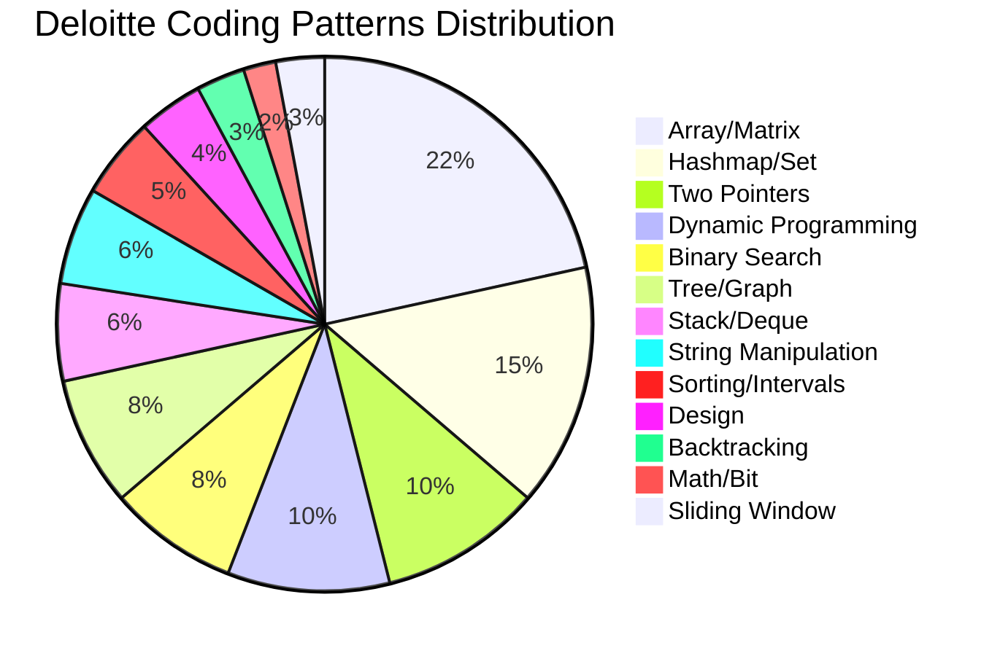

# Deloitte Coding Interview Preparation

## Company Overview

| Aspect | Details |
|--------|---------|
| **Interview Process** | Online Assessment → Technical Round → Managerial → HR |
| **Difficulty** | Medium (slightly harder than Wipro/TCS) |
| **Coding Round Pattern** | 2-3 coding questions |
| **Duration** | 60-75 minutes |
| **Platform** | HackerRank / Mettl |
| **Focus Areas** | Analytical skills, clean code, algorithmic thinking, optimized approaches |

## Questions 1-12: Easy

---
### Question 1: Find All Duplicates in an Array

**Problem Statement:** Given an integer array `nums` of length n where all integers are in the range [1, n] and each integer appears once or twice, return an array of all integers that appear twice.

**Difficulty:** Easy

**Pattern:** Array, Hashmap

**Companies Asked:** Deloitte, Amazon, Microsoft

**Concepts Needed:** HashMap, Array traversal, In-place marking

**Constraints:**
- n == nums.length
- 1 <= n <= 10^5
- 1 <= nums[i] <= n
- Each element appears once or twice

**Approach 1 (Brute Force):**
Use nested loops to check each element against every other element. Count frequency by scanning the entire array for each element. O(n²) time.

**Approach 2 (Optimized - Hashmap):**
Use a dictionary to count frequencies. Iterate through the array, increment count for each element. Return keys with count == 2.

**Approach 3 (Most Optimized - In-place Marking):**
Since numbers are in range [1, n], use the array itself as a visited marker. When you see nums[i], go to index abs(nums[i]) - 1 and negate it. If already negative, it's a duplicate.

**Python Solution:**
```python
from typing import List

def find_duplicates(nums: List[int]) -> List[int]:
    result = []
    for num in nums:
        index = abs(num) - 1
        if nums[index] < 0:
            result.append(abs(num))
        else:
            nums[index] = -nums[index]
    return result
```

**Dry Run:**
```
Input: nums = [4, 3, 2, 7, 8, 2, 3, 1]

Step 1: num=4, index=3, nums[3]=7 > 0 → mark nums[3] = -7
        nums = [4, 3, 2, -7, 8, 2, 3, 1]
Step 2: num=3, index=2, nums[2]=2 > 0 → mark nums[2] = -2
        nums = [4, 3, -2, -7, 8, 2, 3, 1]
Step 3: num=2, index=1, nums[1]=3 > 0 → mark nums[1] = -3
        nums = [4, -3, -2, -7, 8, 2, 3, 1]
Step 4: num=7, index=6, nums[6]=3 > 0 → mark nums[6] = -3
        nums = [4, -3, -2, -7, 8, 2, -3, 1]
Step 5: num=8, index=7, nums[7]=1 > 0 → mark nums[7] = -1
        nums = [4, -3, -2, -7, 8, 2, -3, -1]
Step 6: num=2, index=1, nums[1]=-3 < 0 → duplicate! add 2
Step 7: num=3, index=2, nums[2]=-2 < 0 → duplicate! add 3
Step 8: num=1, index=0, nums[0]=4 > 0 → mark nums[0] = -4
        nums = [-4, -3, -2, -7, 8, 2, -3, -1]

Result: [2, 3]
```

**Complexity:**
- Time: O(n)
- Space: O(1) (excluding output)

**Common Mistakes:**
- Forgetting to use abs() when accessing index
- Modifying the array while iterating incorrectly
- Off-by-one errors with 1-based to 0-based index conversion

**Edge Cases:**
- Empty array
- Single element
- No duplicates
- All duplicates

**Variations:**
- Find all elements that appear once
- Find the element that appears once when others appear twice

**Follow-up Questions:**
- What if the array is read-only?
- What if range is [0, n-1]?

**Interview Tips:**
- Explain the in-place marking technique clearly
- Mention the constraint n range as the key insight
- Discuss trade-offs with hashmap approach

**Expected Output:**
```python
Input: [4,3,2,7,8,2,3,1]  →  Output: [2,3]
Input: [1,1,2]            →  Output: [1]
Input: [1]                →  Output: []
```

**Quick Revision Notes:**
- Array elements in [1, n] → use index negation trick
- abs() is critical when dealing with negatives
- Output order doesn't matter for duplicates

---
### Question 2: Two Sum

**Problem Statement:** Given an array of integers `nums` and an integer `target`, return indices of the two numbers that add up to target. You may assume each input has exactly one solution.

**Difficulty:** Easy

**Pattern:** Array, Hashmap

**Companies Asked:** Deloitte, Google, Amazon, Microsoft

**Concepts Needed:** HashMap, Array traversal

**Constraints:**
- 2 <= nums.length <= 10^4
- -10^9 <= nums[i] <= 10^9
- Exactly one valid solution

**Approach 1 (Brute Force):**
Two nested loops checking every pair. If nums[i] + nums[j] == target, return [i, j].

**Approach 2 (Optimized - Hashmap):**
Use a dictionary to store seen numbers. For each element, check if target - nums[i] exists in the map.

**Python Solution:**
```python
from typing import List, Dict

def two_sum(nums: List[int], target: int) -> List[int]:
    seen: Dict[int, int] = {}
    for i, num in enumerate(nums):
        complement = target - num
        if complement in seen:
            return [seen[complement], i]
        seen[num] = i
    return []
```

**Dry Run:**
```
Input: nums = [2, 7, 11, 15], target = 9

Step 1: i=0, num=2, complement=7, seen={} → add seen[2]=0
Step 2: i=1, num=7, complement=2, 2 in seen → return [0, 1]

Result: [0, 1]
```

**Complexity:**
- Time: O(n)
- Space: O(n)

**Common Mistakes:**
- Using the same element twice (check that complement index != current index)
- Not handling negative numbers
- Case sensitivity in string versions

**Edge Cases:**
- Negative numbers
- Zero as target
- Duplicate values

**Variations:**
- Three Sum
- Four Sum
- Two Sum in a sorted array (two-pointer)

**Follow-up Questions:**
- What if the array is sorted?
- Can you do it in O(1) space?

**Interview Tips:**
- Always ask about duplicate handling
- Clarify if returning indices or values
- Mention two-pointer for sorted version

**Expected Output:**
```python
Input: nums=[2,7,11,15], target=9  →  Output: [0,1]
Input: nums=[3,2,4], target=6      →  Output: [1,2]
Input: nums=[3,3], target=6        →  Output: [0,1]
```

**Quick Revision Notes:**
- Classic hashmap problem
- complement = target - current
- One-pass solution preferred

---
### Question 3: Valid Parentheses

**Problem Statement:** Given a string `s` containing just the characters '(', ')', '{', '}', '[' and ']', determine if the input string is valid. A string is valid if brackets close in the correct order.

**Difficulty:** Easy

**Pattern:** Stack, String

**Companies Asked:** Deloitte, Google, Amazon, Facebook

**Concepts Needed:** Stack, HashMap

**Constraints:**
- 1 <= s.length <= 10^4
- s consists of parentheses only

**Approach 1 (Stack with Hashmap):**
Use a stack. For each char, if it's an opening bracket, push onto stack. If closing, check if stack top matches.

**Python Solution:**
```python
def is_valid(s: str) -> bool:
    mapping = {')': '(', ']': '[', '}': '{'}
    stack = []
    for char in s:
        if char in mapping:
            if not stack or stack[-1] != mapping[char]:
                return False
            stack.pop()
        else:
            stack.append(char)
    return not stack
```

**Dry Run:**
```
Input: s = "({[]})"

Step 1: char='(' → stack = ['(']
Step 2: char='{' → stack = ['(', '{']
Step 3: char='[' → stack = ['(', '{', '[']
Step 4: char=']' → stack[-1]='[' matches → stack = ['(', '{']
Step 5: char='}' → stack[-1]='{' matches → stack = ['(']
Step 6: char=')' → stack[-1]='(' matches → stack = []

Result: True
```

**Complexity:**
- Time: O(n)
- Space: O(n)

**Common Mistakes:**
- Not checking if stack is empty before popping
- Using stack as list without checking emptiness
- Forgetting to handle string with only opening brackets

**Edge Cases:**
- Single character
- Only opening brackets
- Only closing brackets
- Nested vs sequential

**Variations:**
- Minimum add to make parentheses valid
- Longest valid parentheses
- Remove invalid parentheses

**Interview Tips:**
- Explain why stack is the natural data structure (LIFO)
- Discuss the mapping dictionary approach

**Expected Output:**
```python
Input: "()"        →  Output: True
Input: "()[]{}"    →  Output: True
Input: "(]"        →  Output: False
Input: "([)]"      →  Output: False
```

**Quick Revision Notes:**
- Stack for matching pairs
- Mapping closing to opening
- Empty stack at end → valid

---
### Question 4: Move Zeroes

**Problem Statement:** Given an integer array `nums`, move all 0's to the end while maintaining the relative order of non-zero elements. Do it in-place.

**Difficulty:** Easy

**Pattern:** Two Pointers, Array

**Companies Asked:** Deloitte, Amazon, Microsoft

**Concepts Needed:** In-place modification, Two-pointer technique

**Constraints:**
- 1 <= nums.length <= 10^4
- -2^31 <= nums[i] <= 2^31 - 1

**Approach 1 (Brute Force):**
Create a new array, copy non-zero elements, fill rest with zeros. O(n) space.

**Approach 2 (Optimized - Two Pointer):**
Use a pointer `pos` to track where the next non-zero should go. Iterate and swap.

**Python Solution:**
```python
from typing import List

def move_zeroes(nums: List[int]) -> None:
    pos = 0
    for i in range(len(nums)):
        if nums[i] != 0:
            nums[pos], nums[i] = nums[i], nums[pos]
            pos += 1
```

**Dry Run:**
```
Input: nums = [0, 1, 0, 3, 12]

Step 1: i=0, nums[0]=0 → skip
Step 2: i=1, nums[1]=1 → swap(nums[0], nums[1]) → nums = [1, 0, 0, 3, 12], pos=1
Step 3: i=2, nums[2]=0 → skip
Step 4: i=3, nums[3]=3 → swap(nums[1], nums[3]) → nums = [1, 3, 0, 0, 12], pos=2
Step 5: i=4, nums[4]=12 → swap(nums[2], nums[4]) → nums = [1, 3, 12, 0, 0], pos=3

Result: [1, 3, 12, 0, 0]
```

**Complexity:**
- Time: O(n)
- Space: O(1)

**Common Mistakes:**
- Using extra space (defeats purpose)
- Not maintaining relative order
- Overwriting elements

**Edge Cases:**
- All zeros
- No zeros
- Single element
- Leading zeros

**Variations:**
- Move zeros to front
- Remove duplicates in-place
- Sort colors (Dutch flag)

**Follow-up Questions:**
- Could you minimize total operations?

**Expected Output:**
```python
Input: [0,1,0,3,12]  →  Output: [1,3,12,0,0]
Input: [0]           →  Output: [0]
Input: [1,2,3]       →  Output: [1,2,3]
```

**Quick Revision Notes:**
- Two-pointer with swapping
- pos tracks insertion point for non-zero
- In-place, O(1) extra space

---
### Question 5: Best Time to Buy and Sell Stock

**Problem Statement:** You are given an array `prices` where prices[i] is the price on day i. You want to maximize profit by choosing a single day to buy and a different day to sell. Return max profit or 0 if no profit possible.

**Difficulty:** Easy

**Pattern:** Array, Sliding Window

**Companies Asked:** Deloitte, Amazon, Google, Bloomberg

**Concepts Needed:** Kadane's algorithm variant, Min tracking

**Constraints:**
- 1 <= prices.length <= 10^5
- 0 <= prices[i] <= 10^4

**Approach 1 (Brute Force):**
Try every buy-sell pair. O(n²).

**Approach 2 (Optimized - One Pass):**
Track min price seen so far. For each price, calculate profit = price - min_price.

**Python Solution:**
```python
from typing import List

def max_profit(prices: List[int]) -> int:
    min_price = float('inf')
    max_profit_val = 0
    for price in prices:
        if price < min_price:
            min_price = price
        elif price - min_price > max_profit_val:
            max_profit_val = price - min_price
    return max_profit_val
```

**Dry Run:**
```
Input: prices = [7, 1, 5, 3, 6, 4]

Step 1: price=7, min=7, profit=0
Step 2: price=1, min=1, profit=0
Step 3: price=5, profit=5-1=4, max=4
Step 4: price=3, profit=3-1=2, max=4
Step 5: price=6, profit=6-1=5, max=5
Step 6: price=4, profit=4-1=3, max=5

Result: 5
```

**Complexity:**
- Time: O(n)
- Space: O(1)

**Common Mistakes:**
- Buying and selling on same day
- Not handling descending prices
- Integer overflow (not relevant in Python)

**Edge Cases:**
- Strictly decreasing prices
- Single day
- Constant prices

**Variations:**
- Best Time to Buy II (multiple transactions)
- Best Time to Buy III (at most 2 transactions)
- Best Time to Buy IV (at most k transactions)

**Interview Tips:**
- Frame it as "min so far" tracking
- Relate to Kadane's algorithm for maximum subarray

**Expected Output:**
```python
Input: [7,1,5,3,6,4]  →  Output: 5
Input: [7,6,4,3,1]    →  Output: 0
Input: [1,2]          →  Output: 1
```

**Quick Revision Notes:**
- Track minimum price seen
- Calculate profit at each step
- Return 0 if no profit
---
### Question 6: Remove Duplicates from Sorted Array

**Problem Statement:** Remove duplicates in-place from a sorted array. Return the number of unique elements.

**Difficulty:** Easy

**Pattern:** Two Pointers

**Companies Asked:** Deloitte, Amazon, Microsoft

**Concepts Needed:** In-place modification, Two-pointer technique

**Constraints:**
- 1 <= nums.length <= 3 * 10^4
- -100 <= nums[i] <= 100

**Approach 1 (Extra Space):**
Use a set to track seen elements, rebuild array. O(n) space.

**Approach 2 (Optimized - Two Pointer):**
Use `i` as slow pointer tracking unique element position. `j` scans ahead.

**Python Solution:**
```python
from typing import List

def remove_duplicates(nums: List[int]) -> int:
    if not nums:
        return 0
    i = 0
    for j in range(1, len(nums)):
        if nums[j] != nums[i]:
            i += 1
            nums[i] = nums[j]
    return i + 1
```

**Dry Run:**
```
Input: nums = [0, 0, 1, 1, 1, 2, 2, 3, 3, 4]

Step 1: i=0, j=1 → nums[1]=0 == nums[0] → skip
Step 2: j=2, nums[2]=1 != nums[0]=0 → i=1, nums[1]=1
Step 3: j=3, nums[3]=1 == nums[1]=1 → skip
Step 4: j=4, nums[4]=1 == nums[1]=1 → skip
Step 5: j=5, nums[5]=2 != nums[1]=1 → i=2, nums[2]=2
Step 6: j=6, nums[6]=2 == nums[2]=2 → skip
Step 7: j=7, nums[7]=3 != nums[2]=2 → i=3, nums[3]=3
Step 8: j=8, nums[8]=3 == nums[3]=3 → skip
Step 9: j=9, nums[9]=4 != nums[3]=3 → i=4, nums[4]=4

Result: 5 (nums = [0,1,2,3,4,...])
```

**Complexity:**
- Time: O(n)
- Space: O(1)

**Edge Cases:**
- Empty array
- All duplicates
- No duplicates
- Single element

**Variations:**
- Remove Duplicates II (allow at most 2)
- Remove Element

**Expected Output:**
```python
Input: [0,0,1,1,1,2,2,3,3,4]  →  Output: 5
Input: [1,1,2]                 →  Output: 2
Input: []                      →  Output: 0
```

**Quick Revision Notes:**
- Slow/fast pointer pattern
- Sorted array → duplicates are adjacent
- i tracks last unique position

---
### Question 7: Reverse a String

**Problem Statement:** Write a function that reverses a string in-place.

**Difficulty:** Easy

**Pattern:** Two Pointers

**Companies Asked:** Deloitte, Google

**Concepts Needed:** In-place modification, Two-pointer technique

**Constraints:**
- 1 <= s.length <= 10^5
- s[i] is a printable ascii character

**Approach 1 (Two Pointers):**
Use left and right pointers, swap characters, move towards center.

**Python Solution:**
```python
from typing import List

def reverse_string(s: List[str]) -> None:
    left, right = 0, len(s) - 1
    while left < right:
        s[left], s[right] = s[right], s[left]
        left += 1
        right -= 1
```

**Dry Run:**
```
Input: s = ['h', 'e', 'l', 'l', 'o']

Step 1: left=0, right=4 → swap 'h' and 'o' → ['o','e','l','l','h']
Step 2: left=1, right=3 → swap 'e' and 'l' → ['o','l','l','e','h']
Step 3: left=2, right=2 → stop

Result: ['o', 'l', 'l', 'e', 'h']
```

**Complexity:**
- Time: O(n)
- Space: O(1)

**Common Mistakes:**
- Using extra array
- Off-by-one in loop condition
- Using immutable strings (Python strings are immutable, convert to list first)

**Variations:**
- Reverse words in a string
- Reverse vowels in a string
- Reverse only letters

**Expected Output:**
```python
Input: "hello"  →  Output: "olleh"
Input: "abc"    →  Output: "cba"
Input: "a"      →  Output: "a"
```

**Quick Revision Notes:**
- Two pointers from both ends
- Swap until they meet
- In-place modification

---
### Question 8: Fizz Buzz

**Problem Statement:** Given an integer n, return a string array where:
- "FizzBuzz" if divisible by 3 and 5
- "Fizz" if divisible by 3
- "Buzz" if divisible by 5
- i (as string) otherwise

**Difficulty:** Easy

**Pattern:** Basic Logic

**Companies Asked:** Deloitte, Apple, Microsoft

**Concepts Needed:** Modulo operator, Conditionals

**Constraints:**
- 1 <= n <= 10^4

**Approach 1 (Conditional):**
Iterate 1 to n, apply modulo checks in correct order.

**Python Solution:**
```python
from typing import List

def fizz_buzz(n: int) -> List[str]:
    result = []
    for i in range(1, n + 1):
        if i % 3 == 0 and i % 5 == 0:
            result.append("FizzBuzz")
        elif i % 3 == 0:
            result.append("Fizz")
        elif i % 5 == 0:
            result.append("Buzz")
        else:
            result.append(str(i))
    return result
```

**Dry Run:**
```
Input: n = 5

i=1 → "1"
i=2 → "2"
i=3 → "Fizz"
i=4 → "4"
i=5 → "Buzz"

Result: ["1", "2", "Fizz", "4", "Buzz"]
```

**Complexity:**
- Time: O(n)
- Space: O(n)

**Common Mistakes:**
- Checking divisibility by 15 before checking 3 or 5
- Not converting i to string

**Variations:**
- Custom FizzBuzz with different numbers
- FizzBuzz with no modulo operator

**Expected Output:**
```python
Input: 3  →  Output: ["1","2","Fizz"]
Input: 5  →  Output: ["1","2","Fizz","4","Buzz"]
```

**Quick Revision Notes:**
- Check 15 first (or 3 and 5 together)
- String concatenation approach also works

---
### Question 9: Maximum Subarray (Kadane's Algorithm)

**Problem Statement:** Find the contiguous subarray with the largest sum and return its sum.

**Difficulty:** Easy

**Pattern:** Kadane's Algorithm, Dynamic Programming

**Companies Asked:** Deloitte, Amazon, Google, Microsoft

**Concepts Needed:** Dynamic Programming, Array

**Constraints:**
- 1 <= nums.length <= 10^5
- -10^4 <= nums[i] <= 10^4

**Approach 1 (Brute Force):**
Try all subarrays, compute sum. O(n²).

**Approach 2 (Optimized - Kadane):**
Kadane's algorithm: maintain current sum and max sum. If current sum becomes negative, reset to 0.

**Python Solution:**
```python
from typing import List

def max_subarray(nums: List[int]) -> int:
    max_sum = float('-inf')
    current_sum = 0
    for num in nums:
        current_sum += num
        if current_sum > max_sum:
            max_sum = current_sum
        if current_sum < 0:
            current_sum = 0
    return max_sum
```

**Dry Run:**
```
Input: nums = [-2, 1, -3, 4, -1, 2, 1, -5, 4]

Step 1: num=-2, curr=-2, max=-2, curr<0 → curr=0
Step 2: num=1, curr=1, max=1
Step 3: num=-3, curr=-2, max=1, curr<0 → curr=0
Step 4: num=4, curr=4, max=4
Step 5: num=-1, curr=3, max=4
Step 6: num=2, curr=5, max=5
Step 7: num=1, curr=6, max=6
Step 8: num=-5, curr=1, max=6
Step 9: num=4, curr=5, max=6

Result: 6 (subarray [4, -1, 2, 1])
```

**Complexity:**
- Time: O(n)
- Space: O(1)

**Common Mistakes:**
- Not handling all negative numbers (current_sum reset will miss them)
- Off-by-one issues

**Edge Cases:**
- All negative numbers
- Single element
- All zeros

**Variations:**
- Maximum product subarray
- Maximum circular subarray
- Return the subarray itself

**Follow-up Questions:**
- What if you need to return the indices?

**Expected Output:**
```python
Input: [-2,1,-3,4,-1,2,1,-5,4]  →  Output: 6
Input: [1]                       →  Output: 1
Input: [-1]                      →  Output: -1
```

**Quick Revision Notes:**
- Reset current_sum to 0 when negative
- max_sum tracks global maximum
- For all-negative, the largest negative is answer

---
### Question 10: Intersection of Two Arrays II

**Problem Statement:** Given two arrays, return an array of their intersection. Each element should appear as many times as it appears in both arrays.

**Difficulty:** Easy

**Pattern:** Hashmap, Two Pointers

**Companies Asked:** Deloitte, Google, Amazon

**Concepts Needed:** HashMap, Frequency counting

**Constraints:**
- 1 <= nums1.length, nums2.length <= 1000
- 0 <= nums1[i], nums2[i] <= 1000

**Approach 1 (Hashmap):**
Count frequencies of smaller array. Iterate through larger array, add to result if count > 0.

**Approach 2 (Two Pointers - Sorted):**
Sort both arrays. Use two pointers to find matches.

**Python Solution:**
```python
from typing import List, Dict

def intersect(nums1: List[int], nums2: List[int]) -> List[int]:
    if len(nums1) > len(nums2):
        nums1, nums2 = nums2, nums1
    counts: Dict[int, int] = {}
    for num in nums1:
        counts[num] = counts.get(num, 0) + 1
    result = []
    for num in nums2:
        if counts.get(num, 0) > 0:
            result.append(num)
            counts[num] -= 1
    return result
```

**Dry Run:**
```
Input: nums1 = [1, 2, 2, 1], nums2 = [2, 2]

Step 1: counts = {1: 2, 2: 2}
Step 2: num=2 → result=[2], counts={1:2, 2:1}
Step 3: num=2 → result=[2,2], counts={1:2, 2:0}

Result: [2, 2]
```

**Complexity:**
- Time: O(n + m)
- Space: O(min(n, m))

**Common Mistakes:**
- Using set instead of hashmap (loses frequency)
- Not decrementing count

**Edge Cases:**
- No intersection
- One array empty
- All elements intersect

**Variations:**
- Intersection of two arrays (unique)
- Intersection of multiple arrays

**Follow-up Questions:**
- What if arrays are sorted?
- What if nums1 is much smaller?

**Expected Output:**
```python
Input: [1,2,2,1], [2,2]  →  Output: [2,2]
Input: [4,9,5], [9,4,9,8,4]  →  Output: [4,9]
```

**Quick Revision Notes:**
- Use hashmap for unsorted arrays
- Always process smaller array first for space optimization
- Decrement count to handle duplicates

---
## Pattern Summary (Questions 1-10)

| Pattern | Questions |
|---------|-----------|
| Array | 1, 2, 4, 5, 6, 9 |
| Hashmap | 1, 2, 10 |
| Two Pointers | 4, 6, 7 |
| Stack | 3 |
| Kadane's Algorithm | 9 |
| String Manipulation | 3, 7, 8 |

### Important Observations
- Easy questions focus on basic data structures (hashmap, stack, two pointers)
- Deloitte expects clean, well-commented code with proper variable naming
- Most easy questions have O(n) time and O(1) or O(n) space solutions

---
### Question 11: Missing Number

**Problem Statement:** Given an array nums containing n distinct numbers in the range [0, n], return the only number in the range missing from the array.

**Difficulty:** Easy

**Pattern:** Array, Math, Bit Manipulation

**Companies Asked:** Deloitte, Amazon, Microsoft

**Concepts Needed:** XOR, Sum formula, Array traversal

**Constraints:**
- n == nums.length
- 1 <= n <= 10^4
- All numbers are unique

**Approach 1 (Sum Formula):**
Sum of 0 to n is n*(n+1)/2. Subtract actual sum to get missing number.

**Approach 2 (XOR):**
XOR all indices with all values. The missing number emerges.

**Python Solution:**
```python
from typing import List

def missing_number(nums: List[int]) -> int:
    n = len(nums)
    expected = n * (n + 1) // 2
    actual = sum(nums)
    return expected - actual
```

**Dry Run:**
```
Input: nums = [3, 0, 1]

n = 3
expected = 3 * 4 // 2 = 6
actual = 3 + 0 + 1 = 4
missing = 6 - 4 = 2

Result: 2
```

**Complexity:**
- Time: O(n)
- Space: O(1)

**Common Mistakes:**
- Off-by-one in sum formula
- Not accounting for n being the max value

**Edge Cases:**
- n = 1 with [0] → missing = 1
- n = 1 with [1] → missing = 0
- Missing 0 at start

**Variations:**
- Find all missing numbers
- Find duplicate and missing

**Interview Tips:**
- XOR approach avoids integer overflow in other languages
- Ask if array is sorted (affects approach)

**Expected Output:**
```python
Input: [3,0,1]  →  Output: 2
Input: [0,1]    →  Output: 2
Input: [1]      →  Output: 0
```

**Quick Revision Notes:**
- Sum formula: n*(n+1)/2
- XOR is alternative
- Range is [0, n], array size is n

---
### Question 12: Count Occurrences of Anagrams

**Problem Statement:** Given a word and a text, count the number of occurrences of anagrams of the word in the text.

**Difficulty:** Easy

**Pattern:** Sliding Window, Hashmap

**Companies Asked:** Deloitte, Amazon

**Concepts Needed:** Frequency counting, Sliding window

**Constraints:**
- 1 <= len(text), len(word) <= 10^5

**Approach 1 (Brute Force):**
Generate all substrings of length equal to word, check if anagram. O(n²).

**Approach 2 (Sliding Window + Hashmap):**
Use sliding window of size = len(word). Maintain frequency count and match count.

**Python Solution:**
```python
from typing import List

def count_anagrams(text: str, word: str) -> int:
    from collections import Counter
    k = len(word)
    word_count = Counter(word)
    window_count = Counter(text[:k])
    result = 0
    if window_count == word_count:
        result += 1
    for i in range(k, len(text)):
        left_char = text[i - k]
        window_count[left_char] -= 1
        if window_count[left_char] == 0:
            del window_count[left_char]
        window_count[text[i]] = window_count.get(text[i], 0) + 1
        if window_count == word_count:
            result += 1
    return result
```

**Dry Run:**
```
Input: text = "forxxorfxdofr", word = "for"

k = 3, word_count = {'f':1, 'o':1, 'r':1}

Window: "for" → matches → result=1
Window: "orx" → no match
Window: "rxx" → no match
Window: "xxo" → no match
Window: "x or" → no match
Window: "orf" → matches → result=2
Window: "rfx" → no match
Window: "fxd" → no match
Window: "xdo" → no match
Window: "dof" → matches → result=3
Window: "ofr" → matches → result=4

Result: 4
```

**Complexity:**
- Time: O(n) where n = len(text)
- Space: O(k) where k = len(word)

**Common Mistakes:**
- Not handling characters that leave the window properly
- Forgetting to delete keys with zero count

**Edge Cases:**
- Word longer than text
- No anagrams found
- Case sensitivity

**Variations:**
- Find all starting indices of anagrams
- Minimum window substring

**Expected Output:**
```python
Input: text="forxxorfxdofr", word="for"  →  Output: 4
Input: text="aba", word="ab"            →  Output: 2
```

**Quick Revision Notes:**
- Sliding window + frequency comparison
- Update window by removing left and adding right
- Counter comparison handles anagram check
---
## Questions 13-38: Medium

---
### Question 13: Longest Substring Without Repeating Characters

**Problem Statement:** Given a string `s`, find the length of the longest substring without repeating characters.

**Difficulty:** Medium

**Pattern:** Sliding Window, Hashmap

**Companies Asked:** Deloitte, Amazon, Google, Microsoft

**Concepts Needed:** Sliding window, HashMap, Two pointers

**Constraints:**
- 0 <= s.length <= 5 * 10^4
- s consists of English letters, digits, symbols, and spaces

**Approach 1 (Brute Force):**
Check all substrings for uniqueness. O(n²).

**Approach 2 (Optimized - Sliding Window):**
Use two pointers (left, right) and a hashmap storing the last seen index of each character. When a repeat is found, move left pointer to max of current left and last_seen[char] + 1.

**Python Solution:**
```python
def length_of_longest_substring(s: str) -> int:
    char_index = {}
    left = 0
    max_length = 0
    for right, char in enumerate(s):
        if char in char_index and char_index[char] >= left:
            left = char_index[char] + 1
        char_index[char] = right
        max_length = max(max_length, right - left + 1)
    return max_length
```

**Dry Run:**
```
Input: s = "abcabcbb"

right=0, char='a' → char_index={'a':0}, left=0, max=1
right=1, char='b' → char_index={'a':0,'b':1}, left=0, max=2
right=2, char='c' → char_index={'a':0,'b':1,'c':2}, left=0, max=3
right=3, char='a' → 'a' in map, last seen=0 >= left=0 → left=0+1=1
                     char_index={'a':3,'b':1,'c':2}, max=3
right=4, char='b' → 'b' in map, last seen=1 >= left=1 → left=1+1=2
                     char_index={'a':3,'b':4,'c':2}, max=3
right=5, char='c' → 'c' in map, last seen=2 >= left=2 → left=2+1=3
                     char_index={'a':3,'b':4,'c':5}, max=3
right=6, char='b' → 'b' in map, last seen=4 >= left=3 → left=4+1=5
                     char_index={'a':3,'b':6,'c':5}, max=3
right=7, char='b' → 'b' in map, last seen=6 >= left=5 → left=6+1=7
                     char_index={'a':3,'b':7,'c':5}, max=3

Result: 3 (substring "abc")
```

**Complexity:**
- Time: O(n)
- Space: O(min(m, n)) where m is charset size

**Common Mistakes:**
- Not checking if last_seen >= left before moving left
- Forgetting to update char_index for repeated characters

**Edge Cases:**
- Empty string
- All unique characters
- All same characters
- Single character

**Variations:**
- Longest substring with at most K distinct characters
- Longest substring with at least K repeating characters
- Longest substring without repeating characters (return the substring)

**Follow-up Questions:**
- What if the string contains Unicode characters?

**Interview Tips:**
- This is a classic sliding window problem
- Emphasize the "at most 2 passes" nature
- The hashmap stores the latest index of each character

**Expected Output:**
```python
Input: "abcabcbb"  →  Output: 3
Input: "bbbbb"     →  Output: 1
Input: "pwwkew"    →  Output: 3
Input: ""          →  Output: 0
```

**Quick Revision Notes:**
- Sliding window with left/right pointers
- char_index stores last occurrence
- left = max(left, last_seen + 1) on repeat

---
### Question 14: Group Anagrams

**Problem Statement:** Given an array of strings, group the anagrams together.

**Difficulty:** Medium

**Pattern:** Hashmap, String Sorting

**Companies Asked:** Deloitte, Amazon, Google, Microsoft

**Concepts Needed:** Hashmap, String manipulation, Sorting

**Constraints:**
- 1 <= strs.length <= 10^4
- 0 <= strs[i].length <= 100
- strs[i] consists of lowercase English letters

**Approach 1 (Sorted String Key):**
Sort each string alphabetically. Use sorted string as key in hashmap. Group original strings by key.

**Approach 2 (Character Count Key):**
Use tuple of 26 character counts as key instead of sorting. More efficient for short strings.

**Python Solution:**
```python
from typing import List, Dict
from collections import defaultdict

def group_anagrams(strs: List[str]) -> List[List[str]]:
    groups: Dict[str, List[str]] = defaultdict(list)
    for s in strs:
        key = ''.join(sorted(s))
        groups[key].append(s)
    return list(groups.values())
```

**Dry Run:**
```
Input: strs = ["eat", "tea", "tan", "ate", "nat", "bat"]

s="eat" → sorted="aet" → groups["aet"] = ["eat"]
s="tea" → sorted="aet" → groups["aet"] = ["eat", "tea"]
s="tan" → sorted="ant" → groups["ant"] = ["tan"]
s="ate" → sorted="aet" → groups["aet"] = ["eat", "tea", "ate"]
s="nat" → sorted="ant" → groups["ant"] = ["tan", "nat"]
s="bat" → sorted="abt" → groups["abt"] = ["bat"]

Result: [["eat","tea","ate"], ["tan","nat"], ["bat"]]
```

**Complexity:**
- Time: O(n * k log k) where k is max string length
- Space: O(n * k)

**Common Mistakes:**
- Not using defaultdict and getting KeyError
- Using mutable list as dictionary key
- Not handling empty strings

**Edge Cases:**
- Empty strings
- Single character strings
- No anagrams
- All same string

**Variations:**
- Group shifted strings
- Find all anagrams in a string

**Interview Tips:**
- The char-count key avoids sorting overhead
- Discuss trade-off between sorting vs counting approach

**Expected Output:**
```python
Input: ["eat","tea","tan","ate","nat","bat"]
Output: [["eat","tea","ate"],["tan","nat"],["bat"]]
```

**Quick Revision Notes:**
- Sorted string as hashmap key
- defaultdict(list) for grouping
- All anagrams have same sorted form

---
### Question 15: Product of Array Except Self

**Problem Statement:** Given an array nums, return an array where output[i] = product of all elements except nums[i]. Cannot use division.

**Difficulty:** Medium

**Pattern:** Array, Prefix/Suffix Products

**Companies Asked:** Deloitte, Amazon, Google, Facebook

**Concepts Needed:** Prefix product, Suffix product, Array

**Constraints:**
- 2 <= nums.length <= 10^5
- -30 <= nums[i] <= 30
- Product fits in 32-bit integer

**Approach 1 (Brute Force):**
For each element, compute product of all others. O(n²).

**Approach 2 (Optimized - Two Pass):**
Compute prefix products in first pass. Compute suffix products in second pass while updating result.

**Python Solution:**
```python
from typing import List

def product_except_self(nums: List[int]) -> List[int]:
    n = len(nums)
    result = [1] * n
    prefix = 1
    for i in range(n):
        result[i] = prefix
        prefix *= nums[i]
    suffix = 1
    for i in range(n - 1, -1, -1):
        result[i] *= suffix
        suffix *= nums[i]
    return result
```

**Dry Run:**
```
Input: nums = [1, 2, 3, 4]

First pass (prefix):
i=0: result[0]=1, prefix=1*1=1
i=1: result[1]=1, prefix=1*2=2
i=2: result[2]=2, prefix=2*3=6
i=3: result[3]=6, prefix=6*4=24
result = [1, 1, 2, 6]

Second pass (suffix):
i=3: result[3]=6*1=6, suffix=1*4=4
i=2: result[2]=2*4=8, suffix=4*3=12
i=1: result[1]=1*12=12, suffix=12*2=24
i=0: result[0]=1*24=24, suffix=24*1=24
result = [24, 12, 8, 6]

Result: [24, 12, 8, 6]
```

**Complexity:**
- Time: O(n)
- Space: O(1) (excluding output)

**Common Mistakes:**
- Using division (not allowed)
- Off-by-one in prefix product indices
- Not handling zeros correctly

**Edge Cases:**
- Array with one zero
- Array with multiple zeros
- All negative numbers
- All same numbers

**Variations:**
- Product of array except self with division
- Maximum product subarray

**Follow-up Questions:**
- Can you do it in O(1) extra space?

**Interview Tips:**
- The two-pass technique is the key insight
- Explain that prefix stores product of elements before i
- Suffix multiplies elements after i

**Expected Output:**
```python
Input: [1,2,3,4]  →  Output: [24,12,8,6]
Input: [-1,1,0,-3,3]  →  Output: [0,0,9,0,0]
```

**Quick Revision Notes:**
- Left pass: prefix products
- Right pass: suffix products
- Multiply left and right for each position

---
### Question 16: Find First and Last Position of Element in Sorted Array

**Problem Statement:** Given a sorted array and a target value, return the start and end position of the target. Return [-1, -1] if target not found.

**Difficulty:** Medium

**Pattern:** Binary Search

**Companies Asked:** Deloitte, Amazon, Google, Microsoft

**Concepts Needed:** Binary Search, Modified binary search for boundaries

**Constraints:**
- 0 <= nums.length <= 10^5
- -10^9 <= nums[i] <= 10^9

**Approach 1 (Linear Scan):**
Scan left to right for first, right to left for last. O(n).

**Approach 2 (Optimized - Binary Search):**
Use binary search twice: once for left boundary and once for right boundary.

**Python Solution:**
```python
from typing import List

def search_range(nums: List[int], target: int) -> List[int]:
    def find_boundary(is_first: bool) -> int:
        left, right = 0, len(nums) - 1
        boundary = -1
        while left <= right:
            mid = left + (right - left) // 2
            if nums[mid] > target:
                right = mid - 1
            elif nums[mid] < target:
                left = mid + 1
            else:
                boundary = mid
                if is_first:
                    right = mid - 1
                else:
                    left = mid + 1
        return boundary

    return [find_boundary(True), find_boundary(False)]
```

**Dry Run:**
```
Input: nums = [5, 7, 7, 8, 8, 10], target = 8

find first (is_first=True):
  left=0, right=5, mid=2, nums[2]=7 < 8 → left=3
  left=3, right=5, mid=4, nums[4]=8 == 8 → boundary=4, right=3
  left=3, right=3, mid=3, nums[3]=8 == 8 → boundary=3, right=2
  left=3, right=2 → loop ends
  return 3

find last (is_first=False):
  left=0, right=5, mid=2, nums[2]=7 < 8 → left=3
  left=3, right=5, mid=4, nums[4]=8 == 8 → boundary=4, left=5
  left=5, right=5, mid=5, nums[5]=10 > 8 → right=4
  left=5, right=4 → loop ends
  return 4

Result: [3, 4]
```

**Complexity:**
- Time: O(log n)
- Space: O(1)

**Common Mistakes:**
- Infinite loop in binary search
- Not handling empty array
- Off-by-one in mid calculation

**Edge Cases:**
- Target at both ends
- Target not present
- Single element array
- Empty array

**Variations:**
- Count occurrences of target
- Search insert position
- Find peak element

**Follow-up Questions:**
- What if array has millions of elements?

**Expected Output:**
```python
Input: [5,7,7,8,8,10], target=8  →  Output: [3,4]
Input: [5,7,7,8,8,10], target=6  →  Output: [-1,-1]
Input: [], target=0              →  Output: [-1,-1]
```

**Quick Revision Notes:**
- Binary search modified for boundaries
- For first: continue searching left half after match
- For last: continue searching right half after match
---
### Question 17: Validate Binary Search Tree

**Problem Statement:** Given the root of a binary tree, determine if it is a valid BST. A BST has all left nodes less than root and all right nodes greater than root.

**Difficulty:** Medium

**Pattern:** Tree, DFS, BST

**Companies Asked:** Deloitte, Amazon, Google, Microsoft

**Concepts Needed:** Tree traversal, Recursion, BST properties

**Constraints:**
- Number of nodes in [1, 10^4]
- -2^31 <= Node.val <= 2^31 - 1

**Approach 1 (In-order Traversal):**
In-order traversal of BST gives sorted order. Check if traversal is strictly increasing.

**Approach 2 (Recursive with Min/Max Bounds):**
Pass down min and max allowed values. Recursively validate left and right subtrees.

**Python Solution:**
```python
class TreeNode:
    def __init__(self, val=0, left=None, right=None):
        self.val = val
        self.left = left
        self.right = right

def is_valid_bst(root: TreeNode) -> bool:
    def validate(node: TreeNode, min_val: float, max_val: float) -> bool:
        if not node:
            return True
        if node.val <= min_val or node.val >= max_val:
            return False
        return validate(node.left, min_val, node.val) and validate(node.right, node.val, max_val)

    return validate(root, float('-inf'), float('inf'))
```

**Dry Run:**
```
Tree:
       5
      / \
     1   7
        / \
       4   8

validate(5, -inf, inf)
  → 5 > -inf and 5 < inf → OK
  → validate(1, -inf, 5)
    → 1 > -inf and 1 < 5 → OK
    → validate(None, -inf, 1) → True
    → validate(None, 1, 5) → True
    → True
  → validate(7, 5, inf)
    → 7 > 5 and 7 < inf → OK
    → validate(4, 5, 7)
      → 4 > 5? False → return False
    → False
  → False

Result: False (4 is in left subtree of 7 but 4 < root 5)
```

**Complexity:**
- Time: O(n)
- Space: O(h) where h is tree height (recursion stack)

**Common Mistakes:**
- Only checking immediate children
- Using <= or >= instead of < and >
- Integer overflow with min/max values

**Edge Cases:**
- Single node
- Tree with duplicate values
- Left-skewed and right-skewed trees
- Large values near integer limits

**Variations:**
- Find kth smallest in BST
- Convert sorted array to BST
- BST from preorder traversal

**Interview Tips:**
- In-order traversal approach is intuitive but recursive min/max is safer
- Use float('inf') to handle integer boundary values
- The recursive approach naturally handles left/right subtrees

**Expected Output:**
```python
Input: [2,1,3]     →  Output: True
Input: [5,1,4,null,null,3,6]  →  Output: False
```

**Quick Revision Notes:**
- Pass min/max range to each node
- Left subtree: (min, node.val)
- Right subtree: (node.val, max)

---
### Question 18: Level Order Traversal of Binary Tree

**Problem Statement:** Return the level order traversal of a binary tree's nodes' values (left to right, level by level).

**Difficulty:** Medium

**Pattern:** Tree, BFS

**Companies Asked:** Deloitte, Amazon, Google, Microsoft

**Concepts Needed:** Queue, BFS, Tree traversal

**Constraints:**
- Number of nodes in [0, 2000]
- -1000 <= Node.val <= 1000

**Approach 1 (BFS using Queue):**
Use a queue. Process nodes level by level. For each level, track size and process all nodes.

**Approach 2 (DFS with Level Tracking):**
Use DFS with a depth parameter. Add node value to result at correct depth index.

**Python Solution:**
```python
from typing import List, Optional
from collections import deque

class TreeNode:
    def __init__(self, val=0, left=None, right=None):
        self.val = val
        self.left = left
        self.right = right

def level_order(root: Optional[TreeNode]) -> List[List[int]]:
    if not root:
        return []
    result = []
    queue = deque([root])
    while queue:
        level_size = len(queue)
        level = []
        for _ in range(level_size):
            node = queue.popleft()
            level.append(node.val)
            if node.left:
                queue.append(node.left)
            if node.right:
                queue.append(node.right)
        result.append(level)
    return result
```

**Dry Run:**
```
Tree:
        3
       / \
      9  20
         / \
        15  7

queue = [3], result = []

Queue: [3]
  level_size=1
  pop 3 → level=[3], add 9 and 20 → queue=[9, 20]
  result = [[3]]

Queue: [9, 20]
  level_size=2
  pop 9 → level=[9], no children
  pop 20 → level=[9, 20], add 15 and 7 → queue=[15, 7]
  result = [[3], [9, 20]]

Queue: [15, 7]
  level_size=2
  pop 15 → level=[15], no children
  pop 7 → level=[15, 7], no children
  result = [[3], [9, 20], [15, 7]]

Result: [[3], [9, 20], [15, 7]]
```

**Complexity:**
- Time: O(n)
- Space: O(n) for queue

**Common Mistakes:**
- Not capturing level_size before modifying the queue
- Using recursion with stack overflow for deep trees
- Forgetting empty root case

**Edge Cases:**
- Empty tree
- Single node
- Skewed tree (left or right)
- Complete binary tree

**Variations:**
- Zigzag level order traversal
- Right side view of binary tree
- Average of levels in binary tree
- Binary tree level order traversal II (bottom-up)

**Interview Tips:**
- BFS with queue is the natural approach for level order
- Track level_size to know when a level ends

**Expected Output:**
```python
Input: [3,9,20,null,null,15,7]  →  Output: [[3],[9,20],[15,7]]
Input: [1]  →  Output: [[1]]
Input: []  →  Output: []
```

**Quick Revision Notes:**
- BFS with queue
- Process level by level using level_size
- deque for O(1) popleft operations

---
### Question 19: Coin Change (Basic DP)

**Problem Statement:** Given an array of coin denominations and a target amount, return the fewest number of coins needed to make up that amount. If impossible, return -1.

**Difficulty:** Medium

**Pattern:** Dynamic Programming

**Companies Asked:** Deloitte, Amazon, Google, Microsoft

**Concepts Needed:** DP, Unbounded knapsack, Bottom-up DP

**Constraints:**
- 1 <= coins.length <= 12
- 1 <= coins[i] <= 2^31 - 1
- 0 <= amount <= 10^4

**Approach 1 (Recursive + Memoization):**
Try each coin at each step, recursively compute min coins. Memoize results.

**Approach 2 (Bottom-up DP):**
Create dp array of size amount+1. dp[i] = min coins to make amount i.

**Python Solution:**
```python
from typing import List

def coin_change(coins: List[int], amount: int) -> int:
    dp = [float('inf')] * (amount + 1)
    dp[0] = 0
    for i in range(1, amount + 1):
        for coin in coins:
            if coin <= i:
                dp[i] = min(dp[i], dp[i - coin] + 1)
    return dp[amount] if dp[amount] != float('inf') else -1
```

**Dry Run:**
```
Input: coins = [1, 2, 5], amount = 11

dp = [0, inf, inf, inf, inf, inf, inf, inf, inf, inf, inf, inf]

i=1: coin=1 → dp[1]=min(inf, dp[0]+1)=1
i=2: coin=1 → dp[2]=min(inf, 1+1)=2
     coin=2 → dp[2]=min(2, dp[0]+1)=1
i=3: coin=1 → dp[3]=min(inf, dp[2]+1)=2
     coin=2 → dp[3]=min(2, dp[1]+1)=2
i=4: coin=1 → dp[4]=min(inf, dp[3]+1)=3
     coin=2 → dp[4]=min(3, dp[2]+1)=2
i=5: coin=1 → dp[5]=min(inf, dp[4]+1)=3
     coin=2 → dp[5]=min(3, dp[3]+1)=3
     coin=5 → dp[5]=min(3, dp[0]+1)=1
... continues through i=11

Result: dp[11] = 3 (5+5+1 or 5+2+2+2)
```

**Complexity:**
- Time: O(amount * coins)
- Space: O(amount)

**Common Mistakes:**
- Using greedy instead of DP (greedy fails for some denominations)
- Not checking if coin <= i before using dp[i-coin]
- Forgetting to return -1 for impossible amounts

**Edge Cases:**
- amount = 0
- No combination possible
- Single coin denomination
- Coin larger than amount

**Variations:**
- Coin Change II (number of combinations)
- Minimum number of coins for infinite supply
- Minimum cost for tickets

**Interview Tips:**
- Explain that greedy fails for denominations like [1, 3, 4] for amount 6
- This is an unbounded knapsack problem (unlimited coins)
- Start with the recursive approach, then optimize to bottom-up

**Expected Output:**
```python
Input: coins=[1,2,5], amount=11  →  Output: 3
Input: coins=[2], amount=3       →  Output: -1
Input: coins=[1], amount=0       →  Output: 0
```

**Quick Revision Notes:**
- dp[i] = min coins for amount i
- dp[i] = min(dp[i], dp[i-coin] + 1)
- Initialize dp[0] = 0, rest = inf

---
### Question 20: Longest Common Subsequence

**Problem Statement:** Given two strings text1 and text2, return the length of their longest common subsequence.

**Difficulty:** Medium

**Pattern:** Dynamic Programming, 2D DP

**Companies Asked:** Deloitte, Amazon, Google

**Concepts Needed:** 2D DP, String manipulation

**Constraints:**
- 1 <= text1.length, text2.length <= 1000
- Strings consist of lowercase English letters

**Approach 1 (Recursive + Memoization):**
If chars match, 1 + LCS(rest). Otherwise, max(LCS(text1[1:], text2), LCS(text1, text2[1:])).

**Approach 2 (Bottom-up DP):**
Create 2D dp array of size (m+1) x (n+1). dp[i][j] = LCS of text1[:i] and text2[:j].

**Python Solution:**
```python
def longest_common_subsequence(text1: str, text2: str) -> int:
    m, n = len(text1), len(text2)
    dp = [[0] * (n + 1) for _ in range(m + 1)]
    for i in range(1, m + 1):
        for j in range(1, n + 1):
            if text1[i - 1] == text2[j - 1]:
                dp[i][j] = dp[i - 1][j - 1] + 1
            else:
                dp[i][j] = max(dp[i - 1][j], dp[i][j - 1])
    return dp[m][n]
```

**Dry Run:**
```
Input: text1 = "abcde", text2 = "ace"

     ""  a  c  e
""  [0, 0, 0, 0]
a   [0, 1, 1, 1]
b   [0, 1, 1, 1]
c   [0, 1, 2, 2]
d   [0, 1, 2, 2]
e   [0, 1, 2, 3]

i=1 (a), j=1 (a): match → dp[1][1] = dp[0][0] + 1 = 1
i=1 (a), j=2 (c): no match → dp[1][2] = max(dp[0][2], dp[1][1]) = 1
i=1 (a), j=3 (e): no match → dp[1][3] = max(0, 1) = 1
i=3 (c), j=2 (c): match → dp[3][2] = dp[2][1] + 1 = 2
...

Result: dp[5][3] = 3 (LCS = "ace")
```

**Complexity:**
- Time: O(m * n)
- Space: O(m * n), can be optimized to O(min(m, n))

**Common Mistakes:**
- Confusing subsequence with substring
- Off-by-one in dp array indexing

**Edge Cases:**
- One empty string
- No common subsequence
- Identical strings

**Variations:**
- Shortest common supersequence
- Longest palindromic subsequence
- Edit distance
- Longest common substring (contiguous)

**Interview Tips:**
- This is a classic 2D DP problem
- Draw the dp table during the interview
- The recurrence relation is the key insight

**Expected Output:**
```python
Input: "abcde", "ace"  →  Output: 3
Input: "abc", "abc"    →  Output: 3
Input: "abc", "def"    →  Output: 0
```

**Quick Revision Notes:**
- dp[i][j] = LCS of prefixes of length i and j
- Match: dp[i-1][j-1] + 1
- No match: max(dp[i-1][j], dp[i][j-1])

---
## Pattern Summary (Questions 11-20)

| Pattern | Questions |
|---------|-----------|
| Array | 11, 15, 16 |
| Binary Search | 16 |
| Tree/DFS/BFS | 17, 18 |
| Dynamic Programming | 19, 20 |
| Sliding Window | 12, 13 |
| Hashmap | 12, 13, 14 |
| Math | 11 |

### Important Observations
- Medium questions introduce DP and tree problems
- Deloitte expects understanding of recursion and DP optimization
- Visual explanation (drawing tables/trees) helps in interviews
---
### Question 21: Find Median of Two Sorted Arrays

**Problem Statement:** Given two sorted arrays nums1 and nums2, return the median of the combined sorted array. Must be O(log (m+n)) time.

**Difficulty:** Hard

**Pattern:** Binary Search, Divide and Conquer

**Companies Asked:** Deloitte, Google, Amazon, Microsoft

**Concepts Needed:** Binary search, Partitioning, Median

**Constraints:**
- nums1.length, nums2.length in [0, 1000]
- -10^6 <= nums1[i], nums2[i] <= 10^6

**Approach 1 (Merge Approach):**
Merge both arrays into a single sorted array, find median. O(m+n) time.

**Approach 2 (Optimized - Binary Search on Smaller Array):**
Partition the smaller array such that all elements in left partition are <= all elements in right partition. Adjust partition using binary search.

**Python Solution:**
```python
from typing import List

def find_median_sorted_arrays(nums1: List[int], nums2: List[int]) -> float:
    if len(nums1) > len(nums2):
        nums1, nums2 = nums2, nums1
    m, n = len(nums1), len(nums2)
    total = m + n
    half = total // 2
    left, right = 0, m

    while left <= right:
        i = left + (right - left) // 2
        j = half - i

        a_left = nums1[i - 1] if i > 0 else float('-inf')
        a_right = nums1[i] if i < m else float('inf')
        b_left = nums2[j - 1] if j > 0 else float('-inf')
        b_right = nums2[j] if j < n else float('inf')

        if a_left <= b_right and b_left <= a_right:
            if total % 2 == 0:
                return (max(a_left, b_left) + min(a_right, b_right)) / 2
            else:
                return min(a_right, b_right)
        elif a_left > b_right:
            right = i - 1
        else:
            left = i + 1
    return -1
```

**Dry Run:**
```
Input: nums1 = [1, 3], nums2 = [2]

m=2, n=1, total=3, half=1
left=0, right=2, i=1, j=0
a_left=nums1[0]=1, a_right=nums1[1]=3
b_left=-inf, b_right=nums2[0]=2
1 <= 2 (True), -inf <= 3 (True) → Valid partition
total is odd → min(a_right, b_right) = min(3, 2) = 2

Result: 2.0
```

**Complexity:**
- Time: O(log(min(m, n)))
- Space: O(1)

**Common Mistakes:**
- Integer division issues with even/odd total
- Not handling empty arrays
- Off-by-one in partition indices

**Edge Cases:**
- One array empty
- Both arrays single element
- Duplicate values
- Negative numbers

**Variations:**
- Find kth smallest element in two sorted arrays
- Median of two unsorted arrays

**Interview Tips:**
- This is a very hard problem — binary search on partitions is non-intuitive
- Start with the merge approach, then explain optimization
- Focus on the invariant: left partition max <= right partition min

**Expected Output:**
```python
Input: [1,3], [2]    →  Output: 2.0
Input: [1,2], [3,4]  →  Output: 2.5
Input: [0,0], [0,0]  →  Output: 0.0
```

**Quick Revision Notes:**
- Partition the smaller array
- Ensure left_max <= right_min
- Handle even/odd total separately

---
### Question 22: LRU Cache (Conceptual)

**Problem Statement:** Design and implement an LRU (Least Recently Used) cache with get(key) and put(key, value) operations in O(1) average time.

**Difficulty:** Medium

**Pattern:** Design, Hashmap, Doubly Linked List

**Companies Asked:** Deloitte, Amazon, Google, Microsoft, Facebook

**Concepts Needed:** Doubly linked list, HashMap, Cache design

**Constraints:**
- 1 <= capacity <= 3000
- 0 <= key, value <= 10^4
- At most 2 * 10^5 calls to get and put

**Approach 1 (OrderedDict - Python Specific):**
Use Python's OrderedDict which maintains insertion order. Move to end on access.

**Approach 2 (Hashmap + Doubly Linked List):**
Use a hashmap for O(1) lookup. Use a doubly linked list to maintain order of usage. Most recently used at head, least at tail.

**Python Solution:**
```python
from collections import OrderedDict

class LRUCache:
    def __init__(self, capacity: int):
        self.capacity = capacity
        self.cache = OrderedDict()

    def get(self, key: int) -> int:
        if key not in self.cache:
            return -1
        self.cache.move_to_end(key)
        return self.cache[key]

    def put(self, key: int, value: int) -> None:
        if key in self.cache:
            self.cache.move_to_end(key)
        self.cache[key] = value
        if len(self.cache) > self.capacity:
            self.cache.popitem(last=False)
```

**Dry Run:**
```
LRUCache(2)
put(1, 1): cache = {1: 1}
put(2, 2): cache = {1: 1, 2: 2}
get(1):    cache = {2: 2, 1: 1} (1 moved to end), return 1
put(3, 3): cache = {2: 2, 1: 1, 3: 3} → evict 2 (LRU)
           cache = {1: 1, 3: 3}
get(2):    return -1 (not found)
put(4, 4): cache = {1: 1, 3: 3, 4: 4} → evict 1 (LRU)
           cache = {3: 3, 4: 4}
get(1):    return -1
get(3):    cache = {4: 4, 3: 3} (3 moved to end), return 3
get(4):    cache = {3: 3, 4: 4} (4 moved to end), return 4
```

**Complexity:**
- Time: O(1) for both get and put
- Space: O(capacity)

**Common Mistakes:**
- Not updating order on get (key access counts as usage)
- Forgetting to evict when exceeding capacity
- Not handling duplicate keys in put

**Edge Cases:**
- Capacity of 1
- Getting non-existent key
- Updating existing key's value
- Evicting from empty cache

**Variations:**
- LFU Cache
- FIFO Cache
- Time-based cache expiration

**Interview Tips:**
- The doubly linked list + hashmap is the classic interview solution
- OrderedDict is Python-specific but shows language mastery
- Explain why both get and put are O(1)

**Quick Revision Notes:**
- OrderedDict in Python simplifies implementation
- Every access (get/put) refreshes usage order
- Evict from front (oldest), add to back (newest)

---
### Question 23: Container With Most Water

**Problem Statement:** Given an array height where height[i] represents the height of a vertical line at position i, find two lines that together with the x-axis form a container that can hold the most water.

**Difficulty:** Medium

**Pattern:** Two Pointers

**Companies Asked:** Deloitte, Amazon, Google, Facebook

**Concepts Needed:** Two pointers, Greedy

**Constraints:**
- n == height.length
- 2 <= n <= 10^5
- 0 <= height[i] <= 10^4

**Approach 1 (Brute Force):**
Check every pair of lines. O(n²).

**Approach 2 (Optimized - Two Pointers):**
Start with left=0 and right=n-1. Move the pointer with smaller height inward.

**Python Solution:**
```python
from typing import List

def max_area(height: List[int]) -> int:
    left, right = 0, len(height) - 1
    max_water = 0
    while left < right:
        width = right - left
        h = min(height[left], height[right])
        max_water = max(max_water, width * h)
        if height[left] < height[right]:
            left += 1
        else:
            right -= 1
    return max_water
```

**Dry Run:**
```
Input: height = [1, 8, 6, 2, 5, 4, 8, 3, 7]

left=0, right=8 → width=8, h=min(1,7)=1, area=8, max=8
  height[0]=1 < height[8]=7 → left=1
left=1, right=8 → width=7, h=min(8,7)=7, area=49, max=49
  height[1]=8 > height[8]=7 → right=7
left=1, right=7 → width=6, h=min(8,3)=3, area=18, max=49
  height[1]=8 > height[7]=3 → right=6
left=1, right=6 → width=5, h=min(8,8)=8, area=40, max=49
...continues...
Result: 49
```

**Complexity:**
- Time: O(n)
- Space: O(1)

**Common Mistakes:**
- Moving both pointers instead of one
- Misunderstanding that area is limited by shorter line

**Edge Cases:**
- All same heights
- Strictly increasing/decreasing
- Minimum 2 elements

**Variations:**
- Trapping rain water
- Largest rectangle in histogram

**Interview Tips:**
- Prove why moving the shorter line is optimal

**Expected Output:**
```python
Input: [1,8,6,2,5,4,8,3,7]  →  Output: 49
Input: [1,1]                 →  Output: 1
Input: [4,3,2,1,4]          →  Output: 16
```

**Quick Revision Notes:**
- Two pointers from both ends
- Move the pointer with smaller height
- Area = min(height[l], height[r]) * (r - l)

---
### Question 24: 3Sum

**Problem Statement:** Given an integer array nums, return all triplets [nums[i], nums[j], nums[k]] where i != j != k and nums[i] + nums[j] + nums[k] == 0. No duplicate triplets.

**Difficulty:** Medium

**Pattern:** Two Pointers, Sorting

**Companies Asked:** Deloitte, Amazon, Google, Facebook

**Concepts Needed:** Sorting, Two pointers, Duplicate handling

**Constraints:**
- 3 <= nums.length <= 3000
- -10^5 <= nums[i] <= 10^5

**Approach 1 (Brute Force):**
Three nested loops. O(n³).

**Approach 2 (Optimized - Sort + Two Pointers):**
Sort the array. For each element (as first), use two pointers to find the remaining two elements.

**Python Solution:**
```python
from typing import List

def three_sum(nums: List[int]) -> List[List[int]]:
    nums.sort()
    result = []
    n = len(nums)
    for i in range(n - 2):
        if i > 0 and nums[i] == nums[i - 1]:
            continue
        left, right = i + 1, n - 1
        while left < right:
            total = nums[i] + nums[left] + nums[right]
            if total < 0:
                left += 1
            elif total > 0:
                right -= 1
            else:
                result.append([nums[i], nums[left], nums[right]])
                while left < right and nums[left] == nums[left + 1]:
                    left += 1
                while left < right and nums[right] == nums[right - 1]:
                    right -= 1
                left += 1
                right -= 1
    return result
```

**Dry Run:**
```
Input: nums = [-1, 0, 1, 2, -1, -4]

Sorted: [-4, -1, -1, 0, 1, 2]

i=0 (nums=-4): left=1, right=5
  -4 + (-1) + 2 = -3 < 0 → left=2... eventually left==right
i=1 (nums=-1): left=2, right=5
  -1 + (-1) + 2 = 0 → add [-1,-1,2], skip dups
  left=4, right=4, stop
i=2 (nums=-1): skip (same as nums[1])
i=3 (nums=0): left=4, right=5
  0 + 1 + 2 = 3 > 0 → right=4, stop

Result: [[-1, -1, 2], [-1, 0, 1]]
```

**Complexity:**
- Time: O(n²)
- Space: O(n) for sorting

**Common Mistakes:**
- Not handling duplicate elements properly
- Skipping the first element check (i > 0)

**Edge Cases:**
- All zeros
- No valid triplets
- Less than 3 elements

**Variations:**
- 3Sum closest
- 3Sum smaller
- 4Sum

**Interview Tips:**
- Sorting enables the two-pointer approach
- Duplicate handling at both outer and inner loop is critical

**Expected Output:**
```python
Input: [-1,0,1,2,-1,-4]  →  Output: [[-1,-1,2],[-1,0,1]]
Input: [0,1,1]           →  Output: []
Input: [0,0,0]           →  Output: [[0,0,0]]
```

**Quick Revision Notes:**
- Sort array first
- Fix one element, use two pointers for the other two
- Skip duplicates at all levels

---
### Question 25: Search in Rotated Sorted Array

**Problem Statement:** Given a rotated sorted array and a target, return the index of target. If not found, return -1. Expected O(log n) time.

**Difficulty:** Medium

**Pattern:** Binary Search

**Companies Asked:** Deloitte, Amazon, Google, Microsoft

**Concepts Needed:** Modified binary search, Rotation detection

**Constraints:**
- 1 <= nums.length <= 5000
- -10^4 <= nums[i] <= 10^4
- All values are unique

**Approach 1 (Linear Search):**
Scan entire array. O(n).

**Approach 2 (Modified Binary Search):**
Find which half is sorted. Check if target lies in sorted half.

**Python Solution:**
```python
from typing import List

def search(nums: List[int], target: int) -> int:
    left, right = 0, len(nums) - 1
    while left <= right:
        mid = left + (right - left) // 2
        if nums[mid] == target:
            return mid
        if nums[left] <= nums[mid]:
            if nums[left] <= target < nums[mid]:
                right = mid - 1
            else:
                left = mid + 1
        else:
            if nums[mid] < target <= nums[right]:
                left = mid + 1
            else:
                right = mid - 1
    return -1
```

**Dry Run:**
```
Input: nums = [4, 5, 6, 7, 0, 1, 2], target = 0

left=0, right=6, mid=3, nums[3]=7
  nums[0]=4 <= nums[3]=7 → left half sorted
  4 <= 0 < 7? No → left=4
left=4, right=6, mid=5, nums[5]=1
  nums[4]=0 <= nums[5]=1 → left half sorted
  0 <= 0 < 1? Yes → right=4
left=4, right=4, mid=4, nums[4]=0 == target → return 4

Result: 4
```

**Complexity:**
- Time: O(log n)
- Space: O(1)

**Common Mistakes:**
- Infinite loop when not updating boundaries
- Incorrectly identifying the sorted half

**Edge Cases:**
- Single element array
- Not rotated (already sorted)
- Target at rotation point

**Variations:**
- Find minimum in rotated sorted array
- Search in rotated sorted array II (with duplicates)
- Find rotation count

**Follow-up Questions:**
- What if there are duplicates? (O(n) worst case)

**Expected Output:**
```python
Input: [4,5,6,7,0,1,2], target=0  →  Output: 4
Input: [4,5,6,7,0,1,2], target=3  →  Output: -1
Input: [1], target=0              →  Output: -1
```

**Quick Revision Notes:**
- Find which half is sorted
- Check if target lies in the sorted half
- Then binary search in appropriate half
---
### Question 26: Spiral Matrix

**Problem Statement:** Given an m x n matrix, return all elements in spiral order.

**Difficulty:** Medium

**Pattern:** Matrix, Simulation

**Companies Asked:** Deloitte, Amazon, Google, Microsoft

**Concepts Needed:** Matrix traversal, Boundary tracking

**Constraints:**
- m == matrix.length, n == matrix[i].length
- 1 <= m, n <= 10
- -100 <= matrix[i][j] <= 100

**Approach 1 (Simulation with Boundaries):**
Maintain top, bottom, left, right boundaries. Traverse in four directions, shrinking boundaries each pass.

**Python Solution:**
```python
from typing import List

def spiral_order(matrix: List[List[int]]) -> List[int]:
    result = []
    top, bottom = 0, len(matrix) - 1
    left, right = 0, len(matrix[0]) - 1
    while top <= bottom and left <= right:
        for j in range(left, right + 1):
            result.append(matrix[top][j])
        top += 1
        for i in range(top, bottom + 1):
            result.append(matrix[i][right])
        right -= 1
        if top <= bottom:
            for j in range(right, left - 1, -1):
                result.append(matrix[bottom][j])
            bottom -= 1
        if left <= right:
            for i in range(bottom, top - 1, -1):
                result.append(matrix[i][left])
            left += 1
    return result
```

**Dry Run:**
```
Input: matrix = [[1,2,3],[4,5,6],[7,8,9]]

Initially: top=0, bottom=2, left=0, right=2
Pass 1: top row [1,2,3], top=1
Pass 2: right col [6,9], right=1
  result=[1,2,3,6,9]
Pass 3: bottom row reverse [8,7], bottom=1
  result=[1,2,3,6,9,8,7]
Pass 4: left col reverse [4], left=1
  result=[1,2,3,6,9,8,7,4]
Pass 5: top row [5], top=2, top > bottom → stop
  result=[1,2,3,6,9,8,7,4,5]

Result: [1,2,3,6,9,8,7,4,5]
```

**Complexity:**
- Time: O(m * n)
- Space: O(1) (excluding output)

**Common Mistakes:**
- Not checking boundaries before reverse traversal
- Off-by-one in range boundaries
- Forgetting to handle single row/column cases

**Edge Cases:**
- Single row matrix
- Single column matrix
- 1x1 matrix
- Rectangular (non-square) matrix

**Variations:**
- Spiral Matrix II (generate matrix)
- Rotate image (90 degree)

**Interview Tips:**
- Draw the matrix and boundaries on the board
- The boundary check before reverse traversal is crucial

**Expected Output:**
```python
Input: [[1,2,3],[4,5,6],[7,8,9]]  →  Output: [1,2,3,6,9,8,7,4,5]
Input: [[1,2,3,4],[5,6,7,8],[9,10,11,12]]  →  Output: [1,2,3,4,8,12,11,10,9,5,6,7]
```

**Quick Revision Notes:**
- Four boundaries: top, bottom, left, right
- Traverse perimeter, shrink boundaries each time
- Check bounds on reverse passes

---
### Question 27: Set Matrix Zeroes

**Problem Statement:** Given an m x n matrix, if an element is 0, set its entire row and column to 0. Do it in-place.

**Difficulty:** Medium

**Pattern:** Matrix, In-place modification

**Companies Asked:** Deloitte, Amazon, Microsoft

**Concepts Needed:** In-place modification, Flag variables

**Constraints:**
- m, n in [1, 200]
- -2^31 <= matrix[i][j] <= 2^31 - 1

**Approach 1 (Extra Space):**
Use sets to track rows and columns to zero out. O(m+n) space.

**Approach 2 (In-place using First Row/Column):**
Use first row and first column as markers. First pass identifies rows/columns to zero. Second pass zeros them.

**Python Solution:**
```python
from typing import List

def set_zeroes(matrix: List[List[int]]) -> None:
    m, n = len(matrix), len(matrix[0])
    first_row_zero = any(matrix[0][j] == 0 for j in range(n))
    first_col_zero = any(matrix[i][0] == 0 for i in range(m))
    for i in range(1, m):
        for j in range(1, n):
            if matrix[i][j] == 0:
                matrix[i][0] = 0
                matrix[0][j] = 0
    for i in range(1, m):
        for j in range(1, n):
            if matrix[i][0] == 0 or matrix[0][j] == 0:
                matrix[i][j] = 0
    if first_row_zero:
        for j in range(n):
            matrix[0][j] = 0
    if first_col_zero:
        for i in range(m):
            matrix[i][0] = 0
```

**Dry Run:**
```
Input: matrix = [[1,1,1],[1,0,1],[1,1,1]]

first_row_zero = False, first_col_zero = False
First pass (markers): i=1,j=1 → matrix[1][1]=0 → matrix[1][0]=0, matrix[0][1]=0
Second pass (zeroing): set matrix[1][1]=0, matrix[1][2]=0, matrix[2][1]=0

Result: [[1,0,1],[0,0,0],[1,0,1]]
```

**Complexity:**
- Time: O(m * n)
- Space: O(1)

**Common Mistakes:**
- Zeroing rows/columns immediately (affects markers)
- Not handling first row/column separately

**Edge Cases:**
- Single row
- Single column
- No zeros
- All zeros

**Variations:**
- Game of Life
- Rotate image

**Interview Tips:**
- The key insight is using first row/column as markers
- Explain why we need separate handling for first row/column

**Expected Output:**
```python
Input: [[1,1,1],[1,0,1],[1,1,1]]  →  Output: [[1,0,1],[0,0,0],[1,0,1]]
Input: [[0,1,2,0],[3,4,5,2],[1,3,1,5]]  →  Output: [[0,0,0,0],[0,4,5,0],[0,3,0,0]]
```

**Quick Revision Notes:**
- First pass: mark rows/columns to zero via first row/col
- Second pass: zero internal cells based on markers
- Separate first row/col handling

---
### Question 28: Subarray Sum Equals K

**Problem Statement:** Given an array of integers and an integer k, return the total number of subarrays whose sum equals k.

**Difficulty:** Medium

**Pattern:** Hashmap, Prefix Sum

**Companies Asked:** Deloitte, Amazon, Google

**Concepts Needed:** Prefix sum, Hashmap

**Constraints:**
- 1 <= nums.length <= 2 * 10^4
- -1000 <= nums[i] <= 1000
- -10^7 <= k <= 10^7

**Approach 1 (Brute Force):**
Compute sum of every subarray. O(n²).

**Approach 2 (Prefix Sum + Hashmap):**
Maintain running prefix sum. For each position, check if prefix_sum - k exists in hashmap.

**Python Solution:**
```python
from typing import List
from collections import defaultdict

def subarray_sum(nums: List[int], k: int) -> int:
    prefix_count = defaultdict(int)
    prefix_count[0] = 1
    current_sum = 0
    count = 0
    for num in nums:
        current_sum += num
        count += prefix_count.get(current_sum - k, 0)
        prefix_count[current_sum] += 1
    return count
```

**Dry Run:**
```
Input: nums = [1, 1, 1], k = 2

prefix_count = {0: 1}, current_sum = 0, count = 0

num=1: current_sum=1, 1-2=-1 not in map, count=0, prefix_count[1]=1
num=1: current_sum=2, 2-2=0 in map → count=1, prefix_count[2]=1
num=1: current_sum=3, 3-2=1 in map → count=2, prefix_count[3]=1

Result: 2
```

**Complexity:**
- Time: O(n)
- Space: O(n)

**Common Mistakes:**
- Forgetting to initialize prefix_count[0] = 1
- Not handling negative numbers
- Confusing subarray with subsequence

**Edge Cases:**
- All elements same
- k = 0
- Large negative values

**Variations:**
- Subarray sum divisible by k
- Maximum subarray sum with k
- Count subarrays with bounded maximum

**Interview Tips:**
- The prefix sum technique is extremely important
- The hashmap stores frequency of prefix sums
- prefix_count[0] = 1 handles subarrays starting from index 0

**Expected Output:**
```python
Input: [1,1,1], k=2  →  Output: 2
Input: [1,2,3], k=3  →  Output: 2
Input: [-1,-1,1], k=0  →  Output: 1
```

**Quick Revision Notes:**
- prefix_sum[j] - prefix_sum[i] = sum(i+1, j)
- If prefix_sum[j] - k exists in map, subarray found
- Initialize map with {0: 1}

---
### Question 29: Merge Intervals

**Problem Statement:** Given an array of intervals where intervals[i] = [start_i, end_i], merge all overlapping intervals and return the resulting array.

**Difficulty:** Medium

**Pattern:** Sorting, Array

**Companies Asked:** Deloitte, Amazon, Google, Microsoft

**Concepts Needed:** Sorting, Interval merging

**Constraints:**
- 1 <= intervals.length <= 10^4
- 0 <= start_i <= end_i <= 10^4

**Approach 1 (Sort + Merge):**
Sort by start time. Iterate, merging overlapping intervals.

**Python Solution:**
```python
from typing import List

def merge(intervals: List[List[int]]) -> List[List[int]]:
    intervals.sort(key=lambda x: x[0])
    merged = [intervals[0]]
    for start, end in intervals[1:]:
        if start <= merged[-1][1]:
            merged[-1][1] = max(merged[-1][1], end)
        else:
            merged.append([start, end])
    return merged
```

**Dry Run:**
```
Input: intervals = [[1,3],[2,6],[8,10],[15,18]]

merged = [[1,3]]
[2,6]: start=2 <= 3 → merge → [1,6]
[8,10]: start=8 > 6 → new → [[1,6],[8,10]]
[15,18]: start=15 > 10 → new → [[1,6],[8,10],[15,18]]

Result: [[1,6],[8,10],[15,18]]
```

**Complexity:**
- Time: O(n log n)
- Space: O(n)

**Common Mistakes:**
- Not sorting first
- Not taking max of end times when merging

**Edge Cases:**
- Single interval
- All overlapping
- No overlapping
- One interval completely inside another

**Variations:**
- Insert interval
- Non-overlapping intervals
- Meeting rooms (can attend all)
- Meeting rooms II (minimum rooms)

**Interview Tips:**
- Sorting is always the first step for interval problems
- Check if current start <= last end → merge
- Otherwise add new interval

**Expected Output:**
```python
Input: [[1,3],[2,6],[8,10],[15,18]]  →  Output: [[1,6],[8,10],[15,18]]
Input: [[1,4],[4,5]]                 →  Output: [[1,5]]
```

**Quick Revision Notes:**
- Sort by start time
- If overlapping, merge by taking max end
- Otherwise append new interval

---
### Question 30: Maximum Product Subarray

**Problem Statement:** Find the contiguous subarray with the largest product within an array.

**Difficulty:** Medium

**Pattern:** Dynamic Programming, Array

**Companies Asked:** Deloitte, Amazon, Google, Microsoft

**Concepts Needed:** Kadane's algorithm variant, Min-max tracking

**Constraints:**
- 1 <= nums.length <= 2 * 10^4
- -10 <= nums[i] <= 10

**Approach 1 (Brute Force):**
Try all subarrays. O(n²).

**Approach 2 (Optimized - Min/Max Tracking):**
Track both max_product and min_product (for handling negatives). At each step, compute max of (num, max*num, min*num).

**Python Solution:**
```python
from typing import List

def max_product(nums: List[int]) -> int:
    max_prod = min_prod = result = nums[0]
    for num in nums[1:]:
        candidates = [num, max_prod * num, min_prod * num]
        max_prod = max(candidates)
        min_prod = min(candidates)
        result = max(result, max_prod)
    return result
```

**Dry Run:**
```
Input: nums = [2, 3, -2, 4]

Step 1: num=2 → max=2, min=2, result=2
Step 2: num=3 → candidates=[3,6,6] → max=6, min=3, result=6
Step 3: num=-2 → candidates=[-2,-12,-6] → max=-2, min=-12, result=6
Step 4: num=4 → candidates=[4,-8,-48] → max=4, min=-48, result=6

Result: 6 (subarray [2, 3])
```

**Complexity:**
- Time: O(n)
- Space: O(1)

**Common Mistakes:**
- Only tracking max (need min because negative * negative = positive)
- Not resetting on zero

**Edge Cases:**
- All negative numbers
- Contains zero
- Single element

**Variations:**
- Maximum sum subarray
- Maximum subarray with one deletion

**Interview Tips:**
- The min tracking is the key insight (handles sign flips)
- Zero resets the product chain
- Compare with max subarray sum

**Expected Output:**
```python
Input: [2,3,-2,4]  →  Output: 6
Input: [-2,0,-1]   →  Output: 0
Input: [-2,-3,4]   →  Output: 24
```

**Quick Revision Notes:**
- Track both max and min at each step
- min becomes max when multiplied by negative
- Zero resets both min and max

---
## Pattern Summary (Questions 21-30)

| Pattern | Questions |
|---------|-----------|
| Two Pointers | 23, 24 |
| Binary Search | 21, 25 |
| Matrix | 26, 27 |
| Hashmap | 22, 28 |
| Dynamic Programming | 30 |
| Sorting | 24, 29 |
| Design | 22 |

### Important Observations
- Medium-range introduces more design and matrix problems
- Prefix sum and interval patterns are frequently tested
- Deloitte expects candidates to handle edge cases for complex problems
---
### Question 31: Rotate Image (90 degrees)

**Problem Statement:** Rotate an n x n matrix by 90 degrees clockwise in-place.

**Difficulty:** Medium

**Pattern:** Matrix, In-place modification

**Companies Asked:** Deloitte, Amazon, Google, Microsoft

**Concepts Needed:** Matrix rotation, In-place operations

**Constraints:**
- n == matrix.length == matrix[i].length
- 1 <= n <= 20
- -1000 <= matrix[i][j] <= 1000

**Approach 1 (Extra Space):**
Copy matrix to new matrix with rotated positions. O(n²) space.

**Approach 2 (Transpose + Reverse):**
Transpose the matrix (swap rows and columns). Then reverse each row.

**Python Solution:**
```python
from typing import List

def rotate(matrix: List[List[int]]) -> None:
    n = len(matrix)
    for i in range(n):
        for j in range(i + 1, n):
            matrix[i][j], matrix[j][i] = matrix[j][i], matrix[i][j]
    for i in range(n):
        matrix[i].reverse()
```

**Dry Run:**
```
Input: matrix = [[1,2,3],[4,5,6],[7,8,9]]

Transpose:
(0,1): swap 2↔4 → [[1,4,3],[2,5,6],[7,8,9]]
(0,2): swap 3↔7 → [[1,4,7],[2,5,6],[3,8,9]]
(1,2): swap 6↔8 → [[1,4,7],[2,5,8],[3,6,9]]

Reverse each row:
[1,4,7] → [7,4,1]
[2,5,8] → [8,5,2]
[3,6,9] → [9,6,3]

Result: [[7,4,1],[8,5,2],[9,6,3]]
```

**Complexity:**
- Time: O(n²)
- Space: O(1)

**Common Mistakes:**
- Swapping twice (undoing the operation)
- Not limiting inner loop to i+1 to avoid double swap

**Edge Cases:**
- 1x1 matrix
- 2x2 matrix
- All same values

**Variations:**
- Spiral Matrix
- Rotate image anticlockwise
- Rotate by 180 degrees

**Interview Tips:**
- The transpose + reverse trick is elegant and in-place
- Layer-by-layer rotation is another valid approach

**Expected Output:**
```python
Input: [[1,2,3],[4,5,6],[7,8,9]]  →  Output: [[7,4,1],[8,5,2],[9,6,3]]
Input: [[1,2],[3,4]]              →  Output: [[3,1],[4,2]]
```

**Quick Revision Notes:**
- Transpose (swap symmetry)
- Reverse each row
- In-place, O(1) extra space

---
### Question 32: Longest Palindromic Substring

**Problem Statement:** Given a string s, return the longest palindromic substring in s.

**Difficulty:** Medium

**Pattern:** String, Expand Around Center, DP

**Companies Asked:** Deloitte, Amazon, Google, Microsoft

**Concepts Needed:** Palindrome checking, Two pointers, DP

**Constraints:**
- 1 <= s.length <= 1000
- s consists of digits and English letters

**Approach 1 (Brute Force):**
Check all substrings. O(n³).

**Approach 2 (Expand Around Center):**
Each palindrome center is either a single character or pair of characters. Expand outward from each center.

**Python Solution:**
```python
def longest_palindrome(s: str) -> str:
    def expand(left: int, right: int) -> str:
        while left >= 0 and right < len(s) and s[left] == s[right]:
            left -= 1
            right += 1
        return s[left + 1:right]

    result = ""
    for i in range(len(s)):
        odd = expand(i, i)
        even = expand(i, i + 1)
        result = max(result, odd, even, key=len)
    return result
```

**Dry Run:**
```
Input: s = "babad"

i=0: odd expand(0,0) → "b", even expand(0,1) → ""
i=1: odd expand(1,1) → "a" → expand(0,2) → s[0]==s[2]='b' → expand(-1,3) → "bab"
     even expand(1,2) → ""
i=2: odd expand(2,2) → "b" → expand(1,3) → s[1]==s[3]='a' → expand(0,4) → s[0]!=s[4] → "aba"

Result: "bab" (or "aba")
```

**Complexity:**
- Time: O(n²)
- Space: O(1)

**Common Mistakes:**
- Forgetting to handle even-length palindromes
- Off-by-one in substring extraction

**Edge Cases:**
- Single character
- All same characters
- Two characters
- No palindrome longer than 1

**Variations:**
- Palindromic substrings count
- Shortest palindrome
- Longest palindromic subsequence

**Interview Tips:**
- The expand-around-center approach is intuitive and efficient
- DP approach uses O(n²) space but same time
- All palindromes have a center (odd or even)

**Expected Output:**
```python
Input: "babad"  →  Output: "bab" or "aba"
Input: "cbbd"   →  Output: "bb"
Input: "a"      →  Output: "a"
```

**Quick Revision Notes:**
- Expand around each center (n for odd, n-1 for even)
- Keep track of longest palindrome found
- O(n²) time, O(1) space

---
### Question 33: Word Break

**Problem Statement:** Given a string s and a dictionary of words, determine if s can be segmented into a space-separated sequence of dictionary words.

**Difficulty:** Medium

**Pattern:** Dynamic Programming

**Companies Asked:** Deloitte, Amazon, Google

**Concepts Needed:** DP, Substring checking, Set

**Constraints:**
- 1 <= s.length <= 300
- 1 <= wordDict.length <= 1000
- Each word length in [1, 20]

**Approach 1 (Recursive + Memoization):**
Recursively check if each prefix is a word and the remaining is breakable. Memoize results.

**Approach 2 (Bottom-up DP):**
dp[i] = True if s[:i] can be segmented. For each j < i, if dp[j] and s[j:i] in word_set.

**Python Solution:**
```python
from typing import List

def word_break(s: str, word_dict: List[str]) -> bool:
    word_set = set(word_dict)
    n = len(s)
    dp = [False] * (n + 1)
    dp[0] = True
    for i in range(1, n + 1):
        for j in range(i):
            if dp[j] and s[j:i] in word_set:
                dp[i] = True
                break
    return dp[n]
```

**Dry Run:**
```
Input: s = "leetcode", wordDict = ["leet", "code"]

word_set = {"leet", "code"}
dp = [T, F, F, F, F, F, F, F, F]

i=4: s[0:4]="leet" in set → dp[4]=True
i=8: j=4 → dp[4]=True, s[4:8]="code" in set → dp[8]=True

Result: True
```

**Complexity:**
- Time: O(n²) where n = len(s)
- Space: O(n + m) where m = dict size

**Common Mistakes:**
- Not using a set for O(1) word lookup
- Starting j from 0 every time (optimize by limiting to max word length)

**Edge Cases:**
- Empty string
- Single character
- No valid segmentation
- All words forming the string

**Variations:**
- Word Break II (return all sentences)
- Concatenated words
- Word search

**Interview Tips:**
- The DP approach builds solution from smaller substrings
- Using a set optimizes lookup
- Optimize by checking only word lengths that exist

**Expected Output:**
```python
Input: "leetcode", ["leet","code"]  →  Output: True
Input: "applepenapple", ["apple","pen"]  →  Output: True
Input: "catsandog", ["cats","dog","sand","and","cat"]  →  Output: False
```

**Quick Revision Notes:**
- dp[i] = True if s[:i] is breakable
- Check all j where dp[j] is True and s[j:i] is a word
- Use set for word lookup

---
### Question 34: Top K Frequent Elements

**Problem Statement:** Given an array of integers, return the k most frequent elements.

**Difficulty:** Medium

**Pattern:** Hashmap, Heap, Bucket Sort

**Companies Asked:** Deloitte, Amazon, Google, Facebook

**Concepts Needed:** Frequency counting, Heap/Priority queue, Bucket sort

**Constraints:**
- 1 <= nums.length <= 10^5
- k in [1, number of unique elements]
- -10^4 <= nums[i] <= 10^4

**Approach 1 (Sort by Frequency):**
Count frequencies with hashmap. Sort by frequency. O(n log n).

**Approach 2 (Bucket Sort):**
Count frequencies. Use bucket array where index = frequency. Collect top k from highest buckets.

**Python Solution:**
```python
from typing import List
from collections import Counter

def top_k_frequent(nums: List[int], k: int) -> List[int]:
    counts = Counter(nums)
    bucket = [[] for _ in range(len(nums) + 1)]
    for num, freq in counts.items():
        bucket[freq].append(num)
    result = []
    for freq in range(len(bucket) - 1, -1, -1):
        for num in bucket[freq]:
            result.append(num)
            if len(result) == k:
                return result
    return result
```

**Dry Run:**
```
Input: nums = [1, 1, 1, 2, 2, 3], k = 2

Counts: {1: 3, 2: 2, 3: 1}
bucket[3] = [1], bucket[2] = [2], bucket[1] = [3]

freq=3: [1] → result=[1]
freq=2: [2] → result=[1,2], len=2=k → return

Result: [1, 2]
```

**Complexity:**
- Time: O(n)
- Space: O(n)

**Common Mistakes:**
- Forgetting k may be less than total unique elements
- Using sort instead of bucket/heap

**Edge Cases:**
- k = 1
- k = number of unique elements
- All same frequency

**Variations:**
- Top K frequent words
- Sort characters by frequency
- K closest points to origin

**Follow-up Questions:**
- What if the array is too large to fit in memory?

**Expected Output:**
```python
Input: [1,1,1,2,2,3], k=2  →  Output: [1,2]
Input: [1], k=1            →  Output: [1]
```

**Quick Revision Notes:**
- Bucket sort by frequency (index = frequency)
- Traverse from highest to lowest frequency
- O(n) time with bucket approach

---
### Question 35: Number of Islands

**Problem Statement:** Given a 2D grid of '1's (land) and '0's (water), count the number of islands.

**Difficulty:** Medium

**Pattern:** DFS/BFS, Graph

**Companies Asked:** Deloitte, Amazon, Google, Microsoft

**Concepts Needed:** DFS, BFS, Grid traversal, Visited tracking

**Constraints:**
- m, n in [1, 300]
- grid[i][j] is '0' or '1'

**Approach 1 (DFS):**
Traverse each cell. If it's '1', increment count and DFS to mark all connected land as visited.

**Python Solution:**
```python
from typing import List

def num_islands(grid: List[List[str]]) -> int:
    if not grid:
        return 0
    m, n = len(grid), len(grid[0])
    count = 0

    def dfs(i: int, j: int) -> None:
        if i < 0 or i >= m or j < 0 or j >= n or grid[i][j] != '1':
            return
        grid[i][j] = '0'
        dfs(i + 1, j)
        dfs(i - 1, j)
        dfs(i, j + 1)
        dfs(i, j - 1)

    for i in range(m):
        for j in range(n):
            if grid[i][j] == '1':
                count += 1
                dfs(i, j)
    return count
```

**Dry Run:**
```
Input: grid = [
  ['1','1','0','0','0'],
  ['1','1','0','0','0'],
  ['0','0','1','0','0'],
  ['0','0','0','1','1']
]

(0,0)='1' → count=1, DFS floods (0,0),(0,1),(1,0),(1,1)
(2,2)='1' → count=2, DFS floods (2,2)
(3,3)='1' → count=3, DFS floods (3,3),(3,4)

Result: 3
```

**Complexity:**
- Time: O(m * n)
- Space: O(m * n) worst case for recursion stack

**Common Mistakes:**
- Not checking grid boundaries
- Infinite recursion (no visited marking)
- Using '1' string instead of integer 1

**Edge Cases:**
- Empty grid
- Single cell
- All water
- All land

**Variations:**
- Max area of island
- Number of distinct islands
- Surrounded regions
- Count sub-islands

**Interview Tips:**
- The DFS flooding approach is standard
- Modifying the grid is acceptable here to save space
- BFS avoids recursion depth issues

**Expected Output:**
```python
Input: grid = [['1','1','1','1','0'],['1','1','0','1','0'],['1','1','0','0','0'],['0','0','0','0','0']]  →  Output: 1
Input: grid = [['1','1','0','0','0'],['1','1','0','0','0'],['0','0','1','0','0'],['0','0','0','1','1']]  →  Output: 3
```

**Quick Revision Notes:**
- DFS/BFS to flood-fill connected components
- Count '1's that start a new component
- Modify grid or use visited set

---
### Question 36: Clone Graph

**Problem Statement:** Given a reference to a node in a connected undirected graph, return a deep copy of the graph.

**Difficulty:** Medium

**Pattern:** Graph, DFS/BFS, Hashmap

**Companies Asked:** Deloitte, Amazon, Google

**Concepts Needed:** Graph traversal, Deep copy, Recursion, HashMap

**Constraints:**
- Number of nodes in [0, 100]
- Node values are unique

**Approach 1 (DFS with HashMap):**
Use a hashmap to track cloned nodes. DFS through original graph, creating copies.

**Python Solution:**
```python
from typing import Optional, Dict

class Node:
    def __init__(self, val=0, neighbors=None):
        self.val = val
        self.neighbors = neighbors if neighbors is not None else []

def clone_graph(node: Optional['Node']) -> Optional['Node']:
    if not node:
        return None
    clones: Dict['Node', 'Node'] = {}

    def dfs(original: 'Node') -> 'Node':
        if original in clones:
            return clones[original]
        copy = Node(original.val)
        clones[original] = copy
        for neighbor in original.neighbors:
            copy.neighbors.append(dfs(neighbor))
        return copy

    return dfs(node)
```

**Complexity:**
- Time: O(V + E)
- Space: O(V)

**Common Mistakes:**
- Not handling cycles (infinite recursion)
- Mutating original graph
- Not checking for None input

**Edge Cases:**
- Empty graph (None)
- Single node with no neighbors
- Cyclic graph
- Disconnected graph

**Variations:**
- Clone binary tree
- Copy list with random pointer

**Interview Tips:**
- The hashmap is essential to avoid infinite loops in cycles
- DFS naturally handles the recursive nature of graphs

**Quick Revision Notes:**
- HashMap to map original → clone
- DFS through original graph
- Handle cycles by checking map first

---
### Question 37: Course Schedule (Cycle Detection)

**Problem Statement:** There are numCourses courses labeled 0 to numCourses-1. Given prerequisites [a, b] meaning b is required for a, determine if it's possible to finish all courses.

**Difficulty:** Medium

**Pattern:** Graph, Topological Sort, DFS

**Companies Asked:** Deloitte, Amazon, Google

**Concepts Needed:** Graph adjacency list, Cycle detection, Topological sort, DFS/BFS

**Constraints:**
- 1 <= numCourses <= 2000
- 0 <= prerequisites.length <= 5000

**Approach 1 (DFS Cycle Detection):**
Build adjacency list. Use visited states: 0=unvisited, 1=visiting, 2=visited. If we see a node in visiting state, cycle exists.

**Approach 2 (Kahn's Algorithm - BFS):**
Use in-degree array. Process courses with in-degree 0. Reduce in-degree of neighbors. If all processed, no cycle.

**Python Solution:**
```python
from typing import List
from collections import defaultdict, deque

def can_finish(num_courses: int, prerequisites: List[List[int]]) -> bool:
    graph = defaultdict(list)
    in_degree = [0] * num_courses
    for course, prereq in prerequisites:
        graph[prereq].append(course)
        in_degree[course] += 1

    queue = deque([i for i in range(num_courses) if in_degree[i] == 0])
    count = 0
    while queue:
        node = queue.popleft()
        count += 1
        for neighbor in graph[node]:
            in_degree[neighbor] -= 1
            if in_degree[neighbor] == 0:
                queue.append(neighbor)
    return count == num_courses
```

**Dry Run:**
```
Input: numCourses = 2, prerequisites = [[1, 0]]

graph[0] = [1], in_degree = [0, 1]
queue = [0]
pop 0 → count=1, neighbor=1 → in_degree[1]=0 → queue=[1]
pop 1 → count=2
count=2 == numCourses=2 → True

Result: True
```

**Complexity:**
- Time: O(V + E)
- Space: O(V + E)

**Common Mistakes:**
- Forgetting that input is [a,b] where b→a means b is prerequisite
- Not handling disconnected components
- Using recursion for large graphs (stack overflow)

**Edge Cases:**
- No prerequisites
- Direct cycle (0→1, 1→0)
- Single course with no prerequisites

**Variations:**
- Course Schedule II (return order)
- Alien Dictionary
- Minimum height trees

**Interview Tips:**
- Kahn's algorithm is intuitive (in-degree approach)
- DFS with state tracking also works
- This is fundamentally cycle detection in directed graph

**Expected Output:**
```python
Input: numCourses=2, prerequisites=[[1,0]]  →  Output: True
Input: numCourses=2, prerequisites=[[1,0],[0,1]]  →  Output: False
```

**Quick Revision Notes:**
- Build adjacency list and in-degree array
- Kahn's: process nodes with 0 in-degree
- Cycle exists if not all nodes processed
---
### Question 38: Minimum Window Substring

**Problem Statement:** Given two strings s and t, find the minimum window in s that contains all characters of t.

**Difficulty:** Hard

**Pattern:** Sliding Window, Hashmap

**Companies Asked:** Deloitte, Amazon, Google, Microsoft

**Concepts Needed:** Sliding window, Frequency counting

**Constraints:**
- 1 <= s.length, t.length <= 10^5
- s and t consist of uppercase and lowercase English letters

**Approach 1 (Brute Force):**
Check every substring. O(n²).

**Approach 2 (Sliding Window with Hashmap):**
Use two pointers to form a window. Expand right to include all characters, then shrink left to minimize.

**Python Solution:**
```python
from collections import Counter

def min_window(s: str, t: str) -> str:
    target = Counter(t)
    window = {}
    have, need = 0, len(target)
    left = 0
    result, result_len = "", float('inf')

    for right, char in enumerate(s):
        window[char] = window.get(char, 0) + 1
        if char in target and window[char] == target[char]:
            have += 1

        while have == need:
            if right - left + 1 < result_len:
                result = s[left:right + 1]
                result_len = right - left + 1
            left_char = s[left]
            window[left_char] -= 1
            if left_char in target and window[left_char] < target[left_char]:
                have -= 1
            left += 1
    return result if result_len != float('inf') else ""
```

**Dry Run:**
```
Input: s = "ADOBECODEBANC", t = "ABC"

target = {'A':1, 'B':1, 'C':1}, need=3

right=0 'A': window={'A':1}, have=1
right=1 'D': window={'A':1,'D':1}, have=1
right=2 'O': ... have=1
right=3 'B': window['B']=1, have=2
right=4 'E': ... have=2
right=5 'C': have=3 → window valid: "ADOBEC", result="ADOBEC"
  shrink: remove 'A' → have=2 → not valid anymore
... eventually at right=10 'A': have=3 again → "ODEBANC" (longer, skip)
  shrink: remove 'O','D','E','B' → "ANC" have=2
right=11 'C': have=3 → "BANC" (len=4) → result="BANC"

Result: "BANC"
```

**Complexity:**
- Time: O(n) where n = len(s)
- Space: O(m) where m = charset size

**Common Mistakes:**
- Not handling characters not in t
- Forgetting to check window validity criteria

**Edge Cases:**
- t longer than s
- No valid window
- Single character strings

**Variations:**
- Minimum window subsequence
- Permutation in string
- Longest substring with at most K distinct chars

**Interview Tips:**
- The have/need counter efficiently tracks window validity
- This is the most complex sliding window variant

**Expected Output:**
```python
Input: s="ADOBECODEBANC", t="ABC"  →  Output: "BANC"
Input: s="a", t="a"               →  Output: "a"
Input: s="a", t="aa"              →  Output: ""
```

**Quick Revision Notes:**
- Sliding window with two hashmaps
- have tracks how many chars meet target frequency
- Expand right until valid, shrink left to minimize

---
## Pattern Summary (Questions 31-38)

| Pattern | Questions |
|---------|-----------|
| Matrix | 31 |
| String | 32, 38 |
| Dynamic Programming | 33 |
| Graph | 35, 36, 37 |
| Hashmap | 33, 34, 38 |
| DFS/BFS | 35, 36 |
| Topological Sort | 37 |
| Sliding Window | 38 |

### Important Observations
- Graph problems appear at medium difficulty in Deloitte interviews
- Hard problems include advanced sliding window and optimization
- Deloitte values understanding of graph traversal and cycle detection

---
## Questions 39-50: Hard

---
### Question 39: Serialize and Deserialize Binary Tree

**Problem Statement:** Design an algorithm to serialize a binary tree into a string and deserialize that string back into the tree.

**Difficulty:** Hard

**Pattern:** Tree, Design, BFS/DFS

**Companies Asked:** Deloitte, Amazon, Google, Microsoft, Facebook

**Concepts Needed:** Tree traversal, String encoding, Recursion, Queue

**Constraints:**
- Number of nodes in [0, 10^4]
- -1000 <= Node.val <= 1000

**Approach 1 (DFS Pre-order with Null Markers):**
Use pre-order traversal with null markers for missing children.

**Python Solution:**
```python
class TreeNode:
    def __init__(self, val=0, left=None, right=None):
        self.val = val
        self.left = left
        self.right = right

class Codec:
    def serialize(self, root: TreeNode) -> str:
        def dfs(node: TreeNode) -> None:
            if not node:
                vals.append("null")
                return
            vals.append(str(node.val))
            dfs(node.left)
            dfs(node.right)
        vals = []
        dfs(root)
        return ",".join(vals)

    def deserialize(self, data: str) -> TreeNode:
        def dfs() -> TreeNode:
            val = next(vals)
            if val == "null":
                return None
            node = TreeNode(int(val))
            node.left = dfs()
            node.right = dfs()
            return node
        vals = iter(data.split(","))
        return dfs()
```

**Complexity:**
- Time: O(n)
- Space: O(n)

**Common Mistakes:**
- Not handling null markers
- Forgetting that both children need null markers for leaf nodes
- Incorrect deserialization order

**Edge Cases:**
- Empty tree (null)
- Single node
- Skewed tree (left or right)
- Complete binary tree

**Variations:**
- Serialize BST (smaller encoding)
- Serialize N-ary tree
- Serialize graph

**Interview Tips:**
- The null markers are essential for unambiguous deserialization
- Any traversal works as long as null markers are consistent

**Quick Revision Notes:**
- Pre-order with null markers
- Deserialize by recursive reading
- comma-separated string encoding

---
### Question 40: Trapping Rain Water

**Problem Statement:** Given an array of n non-negative integers representing elevation map, compute how much water can be trapped after raining.

**Difficulty:** Hard

**Pattern:** Two Pointers, Stack, DP

**Companies Asked:** Deloitte, Amazon, Google, Microsoft

**Concepts Needed:** Two pointers, Pre-computation, Monotonic stack

**Constraints:**
- n == height.length
- 1 <= n <= 2 * 10^4
- 0 <= height[i] <= 10^5

**Approach 1 (Brute Force):**
For each position, find max left and max right height. Water = min(max_left, max_right) - height[i].

**Approach 2 (Two Pointers):**
Track left_max and right_max. Move the pointer with smaller max inward.

**Python Solution:**
```python
from typing import List

def trap(height: List[int]) -> int:
    left, right = 0, len(height) - 1
    left_max = right_max = 0
    water = 0
    while left < right:
        if height[left] < height[right]:
            if height[left] >= left_max:
                left_max = height[left]
            else:
                water += left_max - height[left]
            left += 1
        else:
            if height[right] >= right_max:
                right_max = height[right]
            else:
                water += right_max - height[right]
            right -= 1
    return water
```

**Dry Run:**
```
Input: height = [0, 1, 0, 2, 1, 0, 1, 3, 2, 1, 2, 1]

left=0, right=11, left_max=0, right_max=0, water=0
h[0]=0 < h[11]=1: h[0]>=left_max(0)? yes → left_max=0, left=1
h[1]=1 >= h[11]=1: h[1]>=right_max(0)? yes → right_max=1, right=10
h[1]=1 < h[10]=2: h[1]>=left_max(0)? yes → left_max=1, left=2
h[2]=0 < h[10]=2: h[2]<left_max(1) → water+=1-0=1, left=3
... continues ...

Result: 6
```

**Complexity:**
- Time: O(n)
- Space: O(1)

**Common Mistakes:**
- Not understanding that water is limited by the lower wall
- Off-by-one in pointer movement

**Edge Cases:**
- All ascending
- All descending
- Flat array
- Single element (can't trap water)

**Variations:**
- Trapping rain water II (3D)
- Container with most water
- Largest rectangle in histogram

**Interview Tips:**
- The two-pointer approach is optimal: O(n) time, O(1) space
- The key insight: water trapped = min(max_left, max_right) - height[i]

**Expected Output:**
```python
Input: [0,1,0,2,1,0,1,3,2,1,2,1]  →  Output: 6
Input: [4,2,0,3,2,5]              →  Output: 9
Input: [1,2,3,4,5]                →  Output: 0
```

**Quick Revision Notes:**
- Two pointers from both ends
- Track left_max and right_max
- Water += min(left_max, right_max) - height[i]

---
### Question 41: First Missing Positive

**Problem Statement:** Given an unsorted integer array, return the smallest missing positive integer. Must be O(n) time and O(1) space.

**Difficulty:** Hard

**Pattern:** Array, In-place Hashing

**Companies Asked:** Deloitte, Amazon, Google, Microsoft

**Concepts Needed:** In-place modification, Cyclic sort, Index marking

**Constraints:**
- 1 <= nums.length <= 10^5
- -2^31 <= nums[i] <= 2^31 - 1

**Approach 1 (Sorting):**
Sort and find first missing positive. O(n log n).

**Approach 2 (In-place Hashing):**
Place each number at its correct index (nums[i] at index nums[i]-1). Then find first index where nums[i] != i+1.

**Python Solution:**
```python
from typing import List

def first_missing_positive(nums: List[int]) -> int:
    n = len(nums)
    i = 0
    while i < n:
        correct = nums[i] - 1
        if 1 <= nums[i] <= n and nums[i] != nums[correct]:
            nums[i], nums[correct] = nums[correct], nums[i]
        else:
            i += 1
    for i in range(n):
        if nums[i] != i + 1:
            return i + 1
    return n + 1
```

**Dry Run:**
```
Input: nums = [3, 4, -1, 1]

n=4, i=0
i=0: nums[0]=3, correct=2 → 1<=3<=4 and 3!=nums[2]=-1 → swap → [-1, 4, 3, 1]
i=0: nums[0]=-1 out of range → i=1
i=1: nums[1]=4, correct=3 → 1<=4<=4 and 4!=nums[3]=1 → swap → [-1, 1, 3, 4]
i=1: nums[1]=1, correct=0 → 1<=1<=4 and 1!=nums[0]=-1 → swap → [1, -1, 3, 4]
i=1: nums[1]=-1 out of range → i=2
i=2: nums[2]=3, correct=2 → 1<=3<=4 and 3==nums[2]=3 → i=3
i=3: nums[3]=4, correct=3 → 1<=4<=4 and 4==nums[3]=4 → i=4

Search: nums[0]=1, nums[1]=-1 != 2 → return 2

Result: 2
```

**Complexity:**
- Time: O(n)
- Space: O(1)

**Common Mistakes:**
- Forgetting to ignore numbers outside [1, n]
- Infinite loop when nums[i] == nums[correct]
- Off-by-one in index mapping

**Edge Cases:**
- All negative numbers
- All numbers from 1 to n
- Duplicate values
- Single element array

**Variations:**
- Find all missing numbers from 1 to n
- Find duplicates in array
- Find the duplicate number

**Interview Tips:**
- The cyclic sort pattern is very useful for problems where values are in [1, n]
- Emphasize in-place technique to achieve O(1) space

**Expected Output:**
```python
Input: [1,2,0]      →  Output: 3
Input: [3,4,-1,1]   →  Output: 2
Input: [7,8,9,11,12]  →  Output: 1
```

**Quick Revision Notes:**
- Place each number at index (num - 1)
- First position where nums[i] != i + 1 is answer
- Ignore numbers outside [1, n]

---
### Question 42: Maximum Path Sum in Binary Tree

**Problem Statement:** Given a binary tree, find the maximum path sum. A path can start and end at any node and must go through parent-child connections.

**Difficulty:** Hard

**Pattern:** Tree, DFS, Post-order Traversal

**Companies Asked:** Deloitte, Amazon, Google, Microsoft

**Concepts Needed:** Tree traversal, Recursion, Post-order

**Constraints:**
- Number of nodes in [1, 3 * 10^4]
- -1000 <= Node.val <= 1000

**Approach 1 (DFS with Global Max):**
Use post-order traversal. For each node, compute max path through that node. Update global max.

**Python Solution:**
```python
class TreeNode:
    def __init__(self, val=0, left=None, right=None):
        self.val = val
        self.left = left
        self.right = right

def max_path_sum(root: TreeNode) -> int:
    result = float('-inf')

    def dfs(node: TreeNode) -> int:
        nonlocal result
        if not node:
            return 0
        left_gain = max(dfs(node.left), 0)
        right_gain = max(dfs(node.right), 0)
        current_max = node.val + left_gain + right_gain
        result = max(result, current_max)
        return node.val + max(left_gain, right_gain)

    dfs(root)
    return result
```

**Complexity:**
- Time: O(n)
- Space: O(h) where h is tree height

**Common Mistakes:**
- Forgetting that negative gains should be discarded (max with 0)
- Returning the wrong value (should return max branch, not total)
- Not using nonlocal for the result variable

**Edge Cases:**
- Single node
- All negative values
- Skewed tree
- Tree with only left/right children

**Variations:**
- Sum root to leaf numbers
- Path Sum (existence of root-to-leaf sum)
- Binary tree maximum path sum between leaves

**Interview Tips:**
- The key is to compute both the max branch and max path at each node
- The max branch value can be negative — discard it by taking max with 0

**Quick Revision Notes:**
- Post-order traversal (left → right → node)
- max_branch = node.val + max(left_gain, right_gain)
- max_path = node.val + left_gain + right_gain
- Update global max with max_path
---
### Question 43: Word Search II (Trie + Backtracking)

**Problem Statement:** Given an m x n board of characters and a list of words, find all words on the board. Words can be formed from adjacent (horizontal/vertical) cells.

**Difficulty:** Hard

**Pattern:** Trie, Backtracking, DFS, Matrix

**Companies Asked:** Deloitte, Amazon, Google, Microsoft

**Concepts Needed:** Trie, DFS, Backtracking, Pruning

**Constraints:**
- m, n in [1, 12]
- 1 <= words.length <= 3 * 10^4
- Each word length in [1, 10]

**Approach 1 (DFS for each word):**
For each word, run DFS on board to check existence. O(words * m * n * 4^L).

**Approach 2 (Trie + Backtracking):**
Build a trie of all words. Run DFS on board, checking trie prefixes. Prune when prefix not in trie.

**Python Solution:**
```python
from typing import List

class TrieNode:
    def __init__(self):
        self.children = {}
        self.word = None

def find_words(board: List[List[str]], words: List[str]) -> List[str]:
    root = TrieNode()
    for word in words:
        node = root
        for ch in word:
            if ch not in node.children:
                node.children[ch] = TrieNode()
            node = node.children[ch]
        node.word = word

    m, n = len(board), len(board[0])
    result = []

    def dfs(i: int, j: int, node: TrieNode) -> None:
        if node.word:
            result.append(node.word)
            node.word = None
        if i < 0 or i >= m or j < 0 or j >= n:
            return
        ch = board[i][j]
        if ch not in node.children:
            return
        board[i][j] = '#'
        for di, dj in [(-1,0),(1,0),(0,-1),(0,1)]:
            dfs(i + di, j + dj, node.children[ch])
        board[i][j] = ch

    for i in range(m):
        for j in range(n):
            dfs(i, j, root)
    return result
```

**Complexity:**
- Time: O(m * n * 4^L) where L is max word length
- Space: O(total characters in words)

**Common Mistakes:**
- Not marking visited cells (infinite loop)
- Not pruning branches using trie
- Not handling duplicate words in result

**Edge Cases:**
- Empty board
- Empty words list
- Words longer than board dimension
- Case sensitivity

**Variations:**
- Word Search I (single word)
- Palindrome pairs
- Boggle game

**Interview Tips:**
- The trie drastically improves time by pruning early
- Backtracking restores board state after each DFS

**Quick Revision Notes:**
- Build trie from word list
- DFS on board with trie node tracking
- Mark visited cells, unmark on backtrack

---
### Question 44: Longest Consecutive Sequence

**Problem Statement:** Given an unsorted array of integers, return the length of the longest consecutive elements sequence. Must be O(n) time.

**Difficulty:** Medium (often asked as Hard)

**Pattern:** Hashmap, Set, Union Find

**Companies Asked:** Deloitte, Amazon, Google, Microsoft

**Concepts Needed:** Set, Hashmap, Sequence detection

**Constraints:**
- 0 <= nums.length <= 10^5
- -10^9 <= nums[i] <= 10^9

**Approach 1 (Sorting):**
Sort and find longest consecutive range. O(n log n).

**Approach 2 (HashSet):**
Store all numbers in a set. For each number, check if num-1 exists. If not, it's the start of a sequence.

**Python Solution:**
```python
from typing import List

def longest_consecutive(nums: List[int]) -> int:
    num_set = set(nums)
    longest = 0
    for num in num_set:
        if num - 1 not in num_set:
            current = num
            length = 1
            while current + 1 in num_set:
                current += 1
                length += 1
            longest = max(longest, length)
    return longest
```

**Dry Run:**
```
Input: nums = [100, 4, 200, 1, 3, 2]

num_set = {100, 4, 200, 1, 3, 2}

num=100: 99 not in set → start: 100, sequence: [100], length=1, longest=1
num=4: 3 in set → skip (not start)
num=200: 199 not in set → start: 200, sequence: [200], length=1
num=1: 0 not in set → start: 1, sequence: 1→2→3→4, length=4, longest=4
num=3: 2 in set → skip
num=2: 1 in set → skip

Result: 4
```

**Complexity:**
- Time: O(n)
- Space: O(n)

**Common Mistakes:**
- Processing same number multiple times (check only start of sequence)
- Sorting instead of using set
- Not skipping duplicates

**Edge Cases:**
- Empty array
- Single element
- All same numbers
- Negative numbers
- Max/min integer values

**Variations:**
- Longest consecutive subsequence with at most K changes
- Binary tree longest consecutive sequence

**Interview Tips:**
- The trick is to only count sequences from their start
- num-1 check ensures O(n) by skipping processed elements

**Expected Output:**
```python
Input: [100,4,200,1,3,2]  →  Output: 4
Input: [0,3,7,2,5,8,4,6,0,1]  →  Output: 9
Input: []  →  Output: 0
```

**Quick Revision Notes:**
- Use set for O(1) lookup
- Only count from start of sequence (num-1 not in set)
- Expand forward while next number exists

---
### Question 45: Alien Dictionary (Topological Sort)

**Problem Statement:** Given a sorted dictionary of an alien language, find the order of characters in the alien alphabet.

**Difficulty:** Hard

**Pattern:** Graph, Topological Sort, BFS/DFS

**Companies Asked:** Deloitte, Amazon, Google, Microsoft

**Concepts Needed:** Graph building, Topological sort, Kahn's algorithm

**Constraints:**
- 1 <= words.length <= 100
- 1 <= words[i].length <= 100
- words[i] consists of lowercase English letters

**Approach 1 (BFS - Kahn's Algorithm):**
Compare adjacent words to build edge relationships. Use in-degree based topological sort.

**Python Solution:**
```python
from typing import List
from collections import defaultdict, deque

def alien_order(words: List[str]) -> str:
    graph = defaultdict(set)
    in_degree = {c: 0 for word in words for c in word}

    for i in range(len(words) - 1):
        w1, w2 = words[i], words[i + 1]
        min_len = min(len(w1), len(w2))
        if len(w1) > len(w2) and w1[:min_len] == w2[:min_len]:
            return ""
        for j in range(min_len):
            if w1[j] != w2[j]:
                if w2[j] not in graph[w1[j]]:
                    graph[w1[j]].add(w2[j])
                    in_degree[w2[j]] += 1
                break

    queue = deque([c for c in in_degree if in_degree[c] == 0])
    result = []
    while queue:
        c = queue.popleft()
        result.append(c)
        for neighbor in graph[c]:
            in_degree[neighbor] -= 1
            if in_degree[neighbor] == 0:
                queue.append(neighbor)
    return "".join(result) if len(result) == len(in_degree) else ""
```

**Complexity:**
- Time: O(C) where C is total characters in all words
- Space: O(1) since alphabet is fixed (26 letters)

**Common Mistakes:**
- Not handling invalid input (prefix case: 'abc' before 'ab')
- Forgetting all characters that have no incoming edges
- Building wrong edge direction

**Edge Cases:**
- Single word
- Already invalid order
- Empty input
- All same characters

**Variations:**
- Course Schedule
- Minimum height trees
- Sequence reconstruction

**Interview Tips:**
- Compare adjacent words to extract ordering information
- Very important to detect invalid cases (prefix issue, cycles)

**Quick Revision Notes:**
- Build graph by comparing adjacent words
- Kahns algorithm for topological sort
- Return empty string if cycle detected or prefix issue

---
### Question 46: Median of Data Stream

**Problem Statement:** Design a data structure that supports adding numbers and finding the median of all added numbers.

**Difficulty:** Hard

**Pattern:** Heap, Design

**Companies Asked:** Deloitte, Amazon, Google, Microsoft

**Concepts Needed:** Two heaps (min-heap, max-heap), Median tracking

**Constraints:**
- -10^5 <= num <= 10^5
- At most 5 * 10^4 calls

**Approach 1 (Sorted List):**
Keep sorted list. Insert in O(n), median in O(1).

**Approach 2 (Two Heaps):**
Use a max-heap for the smaller half and a min-heap for the larger half. Balance heaps such that max-heap size >= min-heap size.

**Python Solution:**
```python
import heapq

class MedianFinder:
    def __init__(self):
        self.small = []  # max-heap (store negatives)
        self.large = []  # min-heap

    def add_num(self, num: int) -> None:
        heapq.heappush(self.small, -num)
        if self.small and self.large and (-self.small[0]) > self.large[0]:
            val = -heapq.heappop(self.small)
            heapq.heappush(self.large, val)
        if len(self.small) > len(self.large) + 1:
            val = -heapq.heappop(self.small)
            heapq.heappush(self.large, val)
        if len(self.large) > len(self.small):
            val = heapq.heappop(self.large)
            heapq.heappush(self.small, -val)

    def find_median(self) -> float:
        if len(self.small) > len(self.large):
            return -self.small[0]
        return (-self.small[0] + self.large[0]) / 2
```

**Complexity:**
- Time: O(log n) for add, O(1) for find
- Space: O(n)

**Common Mistakes:**
- Using max-heap incorrectly (Python only has min-heap → use negatives)
- Not rebalancing heaps after each insertion

**Edge Cases:**
- Single element
- Two elements
- Duplicate numbers

**Variations:**
- Sliding window median
- Find kth largest in stream

**Interview Tips:**
- The two-heap approach is the optimal solution
- Python's heapq is min-heap → use negative for max-heap

**Quick Revision Notes:**
- small = max-heap (negative values), large = min-heap
- Balance: |small| >= |large|
- Median = small[0] if odd, (small[0] + large[0]) / 2 if even

---
### Question 47: Largest Rectangle in Histogram

**Problem Statement:** Given an array of bar heights, find the largest rectangle that can be formed in the histogram.

**Difficulty:** Hard

**Pattern:** Stack, Monotonic Stack

**Companies Asked:** Deloitte, Amazon, Google, Microsoft

**Concepts Needed:** Monotonic stack, Array, Area calculation

**Constraints:**
- 1 <= heights.length <= 10^5
- 0 <= heights[i] <= 10^4

**Approach 1 (Brute Force):**
For each bar, expand left and right. O(n²).

**Approach 2 (Monotonic Stack):**
Use a stack to maintain indices in increasing height order. When a smaller height is found, calculate area for heights in stack.

**Python Solution:**
```python
from typing import List

def largest_rectangle_area(heights: List[int]) -> int:
    stack = []
    max_area = 0
    heights.append(0)
    for i, h in enumerate(heights):
        while stack and heights[stack[-1]] > h:
            height = heights[stack.pop()]
            width = i if not stack else i - stack[-1] - 1
            max_area = max(max_area, height * width)
        stack.append(i)
    return max_area
```

**Complexity:**
- Time: O(n)
- Space: O(n)

**Common Mistakes:**
- Incorrect width calculation (not subtracting stack[-1]+1)
- Forgetting to add sentinel 0 at end

**Edge Cases:**
- All same height
- Decreasing heights
- Increasing heights
- Single bar

**Variations:**
- Maximal rectangle in binary matrix
- Trapping rain water

**Interview Tips:**
- The sentinel (0) at end forces remaining bars to be processed
- The width is calculated differently depending on whether stack is empty

**Quick Revision Notes:**
- Monotonic increasing stack of indices
- When heights[i] < heights[stack.top], calculate area
- width = i if stack empty else i - stack[-1] - 1
---
### Question 48: Sliding Window Maximum

**Problem Statement:** Given an array and a window size k, return the maximum element in each sliding window.

**Difficulty:** Hard

**Pattern:** Deque, Sliding Window

**Companies Asked:** Deloitte, Amazon, Google, Microsoft

**Concepts Needed:** Deque (double-ended queue), Sliding window, Monotonic queue

**Constraints:**
- 1 <= nums.length <= 10^5
- -10^4 <= nums[i] <= 10^4
- 1 <= k <= nums.length

**Approach 1 (Brute Force):**
For each window, scan all k elements to find max. O(n*k).

**Approach 2 (Deque):**
Maintain a deque of indices where values are in decreasing order. The front of deque is the max of current window.

**Python Solution:**
```python
from typing import List
from collections import deque

def max_sliding_window(nums: List[int], k: int) -> List[int]:
    dq = deque()
    result = []
    for i, num in enumerate(nums):
        while dq and nums[dq[-1]] < num:
            dq.pop()
        dq.append(i)
        if dq[0] <= i - k:
            dq.popleft()
        if i >= k - 1:
            result.append(nums[dq[0]])
    return result
```

**Dry Run:**
```
Input: nums = [1, 3, -1, -3, 5, 3, 6, 7], k = 3

i=0, num=1: dq=[0]
i=1, num=3: nums[0]=1 < 3 → pop, dq=[1]
i=2, num=-1: dq=[1,2], i>=2 → result.append(nums[1])=3
i=3, num=-3: dq=[1,2,3], dq[0]=1 > 0? yes, result.append(3)
i=4, num=5: pop 1,2,3 (all smaller) → dq=[4], result.append(5)
i=5, num=3: dq=[4,5], result.append(5)
i=6, num=6: pop 4,5 → dq=[6], result.append(6)
i=7, num=7: pop 6 → dq=[7], result.append(7)

Result: [3, 3, 5, 5, 6, 7]
```

**Complexity:**
- Time: O(n)
- Space: O(k)

**Common Mistakes:**
- Forgetting to remove elements outside window
- Using stack instead of deque (need both ends)
- Not using indices (need to track window boundaries)

**Edge Cases:**
- k = 1
- k = n
- Decreasing array
- Increasing array

**Variations:**
- Minimum in sliding window
- Sliding window median
- Sliding window product

**Interview Tips:**
- The deque stores indices, not values (for window boundary check)
- Maintain decreasing order in deque → front is always max

**Expected Output:**
```python
Input: [1,3,-1,-3,5,3,6,7], k=3  →  Output: [3,3,5,5,6,7]
Input: [1], k=1                   →  Output: [1]
Input: [1,-1], k=1               →  Output: [1,-1]
```

**Quick Revision Notes:**
- Deque with decreasing order of values
- Front = max of current window
- Remove out-of-window indices from front
- Remove smaller elements from back before adding new

---
### Question 49: Edit Distance (Levenshtein Distance)

**Problem Statement:** Given two strings, find the minimum number of operations (insert, delete, replace) required to convert one string to the other.

**Difficulty:** Hard

**Pattern:** Dynamic Programming, 2D DP

**Companies Asked:** Deloitte, Amazon, Google, Microsoft

**Concepts Needed:** 2D DP, String editing, Tabulation

**Constraints:**
- 0 <= word1.length, word2.length <= 500
- Characters are lowercase English letters

**Approach 1 (Recursive + Memoization):**
Recursively compute min of insert, delete, replace operations.

**Approach 2 (Bottom-up DP):**
2D DP table where dp[i][j] = edit distance between word1[:i] and word2[:j].

**Python Solution:**
```python
def min_distance(word1: str, word2: str) -> int:
    m, n = len(word1), len(word2)
    dp = [[0] * (n + 1) for _ in range(m + 1)]
    for i in range(m + 1):
        dp[i][0] = i
    for j in range(n + 1):
        dp[0][j] = j
    for i in range(1, m + 1):
        for j in range(1, n + 1):
            if word1[i - 1] == word2[j - 1]:
                dp[i][j] = dp[i - 1][j - 1]
            else:
                dp[i][j] = 1 + min(
                    dp[i - 1][j],    # delete
                    dp[i][j - 1],    # insert
                    dp[i - 1][j - 1]  # replace
                )
    return dp[m][n]
```

**Dry Run:**
```
Input: word1 = "horse", word2 = "ros"

     ""  r  o  s
"" [0, 1, 2, 3]
h  [1, 1, 2, 3]
o  [2, 2, 1, 2]
r  [3, 2, 2, 2]
s  [4, 3, 3, 2]
e  [5, 4, 4, 3]

dp[5][3] = 3
Operation sequence: h→' '(replace), o→o(match), r→r(match),
  s→s(match), e→' '(delete), ''→' '(remaining)
  = replace 'h' with 'r', replace 'r' with 'o', delete 'e'

Result: 3
```

**Complexity:**
- Time: O(m * n)
- Space: O(m * n), can be optimized to O(min(m, n))

**Common Mistakes:**
- Confusing insert and delete directions
- Off-by-one in dp array indexing
- Not initializing base cases correctly

**Edge Cases:**
- One or both strings empty
- Identical strings
- Completely different strings

**Variations:**
- One edit distance
- Longest common subsequence
- Shortest edit script

**Interview Tips:**
- Draw the DP table — it helps explain the recurrence
- Insert in word1 = delete in word2

**Expected Output:**
```python
Input: "horse", "ros"  →  Output: 3
Input: "intention", "execution"  →  Output: 5
Input: "", "a"  →  Output: 1
```

**Quick Revision Notes:**
- dp[i][j] = edit distance between prefixes of length i and j
- Match: dp[i-1][j-1]
- Mismatch: 1 + min(delete, insert, replace)

---
### Question 50: N-Queens

**Problem Statement:** Place N queens on an NxN chessboard such that no two queens attack each other. Return all distinct solutions.

**Difficulty:** Hard

**Pattern:** Backtracking, Recursion

**Companies Asked:** Deloitte, Amazon, Google, Microsoft

**Concepts Needed:** Backtracking, Pruning, Matrix/Board representation

**Constraints:**
- 1 <= n <= 9

**Approach 1 (Backtracking):**
Place queens row by row. Track columns, diagonals (main and anti) that are under attack.

**Python Solution:**
```python
from typing import List

def solve_n_queens(n: int) -> List[List[str]]:
    cols = set()
    diag1 = set()  # i + j
    diag2 = set()  # i - j
    result = []
    board = [['.'] * n for _ in range(n)]

    def backtrack(row: int) -> None:
        if row == n:
            result.append([''.join(r) for r in board])
            return
        for col in range(n):
            if col in cols or (row + col) in diag1 or (row - col) in diag2:
                continue
            board[row][col] = 'Q'
            cols.add(col)
            diag1.add(row + col)
            diag2.add(row - col)
            backtrack(row + 1)
            board[row][col] = '.'
            cols.remove(col)
            diag1.remove(row + col)
            diag2.remove(row - col)

    backtrack(0)
    return result
```

**Complexity:**
- Time: O(n!) — factorial in worst case
- Space: O(n²) for board and recursion stack

**Common Mistakes:**
- Not understanding diagonal equations (row+col and row-col)
- Deep copy vs shallow copy issues for result
- Not backtracking properly (failing to restore state)

**Edge Cases:**
- n = 1 (single queen)
- n = 2 (no solution)
- n = 3 (no solution)

**Variations:**
- N-Queens II (count solutions only)
- Solve Sudoku
- Knight's tour

**Interview Tips:**
- The diagonal sets (i+j) and (i-j) are the key optimization
- Use O(n) sets instead of O(n²) grid check
- Backtracking is the standard approach for constraint satisfaction

**Expected Output:**
```python
Input: n = 4
Output: [[".Q..","...Q","Q...","..Q."],["..Q.","Q...","...Q",".Q.."]]
Input: n = 1  →  Output: [["Q"]]
```

**Quick Revision Notes:**
- Place queens row by row
- Track col, diag1 (i+j), diag2 (i-j)
- Backtrack when all rows are filled

---
## Pattern Summary (Questions 39-50)

| Pattern | Questions |
|---------|-----------|
| Tree | 39, 42 |
| Two Pointers | 40 |
| Array | 40, 41, 44, 47 |
| Trie | 43 |
| Backtracking | 43, 50 |
| Graph / Topological Sort | 45 |
| Heap | 46 |
| DP | 49 |
| Stack / Monotonic Stack | 47 |
| Deque / Sliding Window | 48 |
| Sets | 44, 50 |

### Important Observations
- Hard questions integrate multiple patterns
- Backtracking and DP are essential for Deloitte hard problems
- Space optimization from O(n²) to O(n) shows depth of understanding

---
## Complete Revision Table

| Question | Pattern | Time | Space | Key Trick |
|----------|---------|------|-------|-----------|
| 1. Find Duplicates | Array, Hashmap | O(n) | O(1) | Index negation |
| 2. Two Sum | Hashmap | O(n) | O(n) | complement = target - num |
| 3. Valid Parentheses | Stack | O(n) | O(n) | Matching brackets via stack |
| 4. Move Zeroes | Two Pointers | O(n) | O(1) | pos pointer for non-zero |
| 5. Buy Sell Stock | Array | O(n) | O(1) | Track min price |
| 6. Remove Duplicates | Two Pointers | O(n) | O(1) | Slow/fast pointer |
| 7. Reverse String | Two Pointers | O(n) | O(1) | Swap from ends |
| 8. Fizz Buzz | Basic Logic | O(n) | O(1) | Modulo conditions |
| 9. Max Subarray | Kadane | O(n) | O(1) | Reset on negative |
| 10. Intersection II | Hashmap | O(m+n) | O(min) | Frequency counting |
| 11. Missing Number | Math | O(n) | O(1) | Sum formula n*(n+1)/2 |
| 12. Anagram Count | Sliding Window | O(n) | O(k) | Frequency comparison |
| 13. Longest Substring | Sliding Window | O(n) | O(k) | char_index map |
| 14. Group Anagrams | Hashmap | O(n*k log k) | O(n*k) | Sorted string as key |
| 15. Product Except Self | Prefix/Suffix | O(n) | O(1) | Two-pass product |
| 16. First/Last Position | Binary Search | O(log n) | O(1) | Modified binary search |
| 17. Validate BST | Tree, DFS | O(n) | O(h) | Min/max bounds |
| 18. Level Order | BFS | O(n) | O(n) | Queue + level_size |
| 19. Coin Change | DP | O(amount*coins) | O(amount) | dp[i] = min(dp[i-coin]+1) |
| 20. LCS | 2D DP | O(m*n) | O(m*n) | Match: diagonal+1 |
| 21. Median of Two | Binary Search | O(log(min)) | O(1) | Partition on smaller |
| 22. LRU Cache | Design | O(1) | O(cap) | OrderedDict |
| 23. Container Water | Two Pointers | O(n) | O(1) | Move smaller height |
| 24. 3Sum | Two Pointers | O(n²) | O(1) | Sort + two pointers |
| 25. Rotated Search | Binary Search | O(log n) | O(1) | Find sorted half |
| 26. Spiral Matrix | Matrix | O(m*n) | O(1) | Boundary tracking |
| 27. Set Zeroes | Matrix | O(m*n) | O(1) | First row/col markers |
| 28. Subarray Sum K | Prefix Sum | O(n) | O(n) | prefix_count[0]=1 |
| 29. Merge Intervals | Sorting | O(n log n) | O(n) | Sort by start |
| 30. Max Product | DP | O(n) | O(1) | Track min and max |
| 31. Rotate Image | Matrix | O(n²) | O(1) | Transpose + reverse |
| 32. Longest Palindrome | Expand Center | O(n²) | O(1) | Expand from center |
| 33. Word Break | DP | O(n²) | O(n) | Iterate j < i |
| 34. Top K Frequent | Bucket Sort | O(n) | O(n) | Frequency bucket |
| 35. Number of Islands | DFS/BFS | O(m*n) | O(m*n) | Flood fill |
| 36. Clone Graph | DFS+Hashmap | O(V+E) | O(V) | Map original→clone |
| 37. Course Schedule | Topological Sort | O(V+E) | O(V+E) | Kahn's algorithm |
| 38. Min Window | Sliding Window | O(n) | O(m) | have/need tracking |
| 39. Serialize Tree | Design | O(n) | O(n) | Pre-order + null markers |
| 40. Trapping Rain | Two Pointers | O(n) | O(1) | left_max/right_max |
| 41. First Missing Pos | In-place Hashing | O(n) | O(1) | Place at correct index |
| 42. Max Path Sum | Tree, DFS | O(n) | O(h) | Max branch vs path |
| 43. Word Search II | Trie + DFS | O(m*n*4^L) | O(words) | Trie pruning |
| 44. Longest Consecutive | Set | O(n) | O(n) | Only count from start |
| 45. Alien Dict | Topological Sort | O(C) | O(1) | Adjacent word comparison |
| 46. Median Stream | Two Heaps | O(log n) | O(n) | Balance max and min heap |
| 47. Histogram | Monotonic Stack | O(n) | O(n) | Stack of increasing heights |
| 48. Sliding Max | Deque | O(n) | O(k) | Deque with decreasing values |
| 49. Edit Distance | 2D DP | O(m*n) | O(m*n) | min(insert, delete, replace) |
| 50. N-Queens | Backtracking | O(n!) | O(n²) | Row-by-row with set tracking |

---
## Frequently Repeated Questions for Deloitte

Based on interview experiences, the following questions appear most often in Deloitte coding rounds:

1. **Two Sum** and its variations (3Sum, 4Sum)
2. **Find All Duplicates in Array** (in-place marking technique)
3. **Longest Substring Without Repeating Characters**
4. **Group Anagrams**
5. **Product of Array Except Self**
6. **Find First/Last Position in Sorted Array**
7. **Validate BST / Level Order Traversal**
8. **Coin Change** (basic DP)
9. **Longest Common Subsequence / Edit Distance**
10. **LRU Cache** (design problem)
11. **Maximum Subarray** (Kadane)
12. **Subarray Sum Equals K** (prefix sum)
13. **Number of Islands** (grid DFS)
14. **Valid Parentheses**
15. **Merge Intervals**

### SQL + Python Combination (Conceptual)
- Second highest salary from employee table
- Department-wise employee count
- Joining tables and performing Python analysis on the result

---
## Must Practice Before Interview

### Priority 1: Absolute Must
- Hashmap problems (frequency counting, two sum patterns)
- Array manipulation (prefix sum, two pointers, sliding window)
- String problems (anagrams, palindromes, substring)
- Basic DP (coin change, LCS, knapsack)
- Tree problems (BST validation, BFS, DFS)

### Priority 2: Highly Recommended
- Graph problems (BFS/DFS, cycle detection, topological sort)
- Binary search variations (rotated array, boundaries)
- Matrix problems (spiral, rotation, zeroes)

### Priority 3: Good to Have
- Backtracking (N-Queens, word search)
- Advanced DP (edit distance)
- Design problems (LRU cache, median stream)

---
## Most Important Python Tricks for Coding Interviews

```python
# 1. Collections
from collections import Counter, defaultdict, deque, OrderedDict

# 2. Heapq (min-heap by default)
import heapq
heapq.heappush(heap, item)
heapq.heappop(heap)
# Max-heap: store negative values

# 3. List comprehensions
[x**2 for x in range(10) if x % 2 == 0]

# 4. Lambda functions
sorted(list_of_tuples, key=lambda x: x[1])

# 5. Enumeration
for i, val in enumerate(arr):

# 6. Zip
for a, b in zip(arr1, arr2):

# 7. Set operations
set1 & set2  # intersection
set1 | set2  # union
set1 - set2  # difference

# 8. In-place swap
a, b = b, a

# 9. Infinity
float('inf'), float('-inf')

# 10. Defaultdict
d = defaultdict(list)
d = defaultdict(int)
```

---
## Interview Checklist

### Before the Interview
- [ ] Review company overview and interview process
- [ ] Practice 3-4 coding problems from each difficulty level
- [ ] Review time/space complexity analysis
- [ ] Prepare for behavioral questions (managerial round)
- [ ] Test your coding environment (camera, mic, stable internet)

### During Coding Round
- [ ] Read problem statement carefully — clarify requirements
- [ ] Ask about edge cases (empty input, negative numbers, duplicates)
- [ ] Discuss brute force first, then optimize
- [ ] Write clean, well-structured code with proper naming
- [ ] Use type hints (Python)
- [ ] Walk through a dry run with example
- [ ] Analyze time and space complexity
- [ ] Consider edge cases in your solution

### Common Pitfalls to Avoid
- Jumping into code without understanding the problem
- Not testing with edge cases
- Writing messy code without proper structure
- Ignoring time/space complexity
- Not communicating thought process

---
## Pattern Distribution



---

*This guide covers the most frequently asked Deloitte coding interview patterns. Focus on understanding the problem-solving approach rather than memorizing solutions. Practice writing clean, efficient code with proper type hints and documentation.*

---

## Author

**Author:** Tamilselvan S

**LinkedIn:** https://www.linkedin.com/in/tamilselvan-ai/

**GitHub:** `your-github-username`
