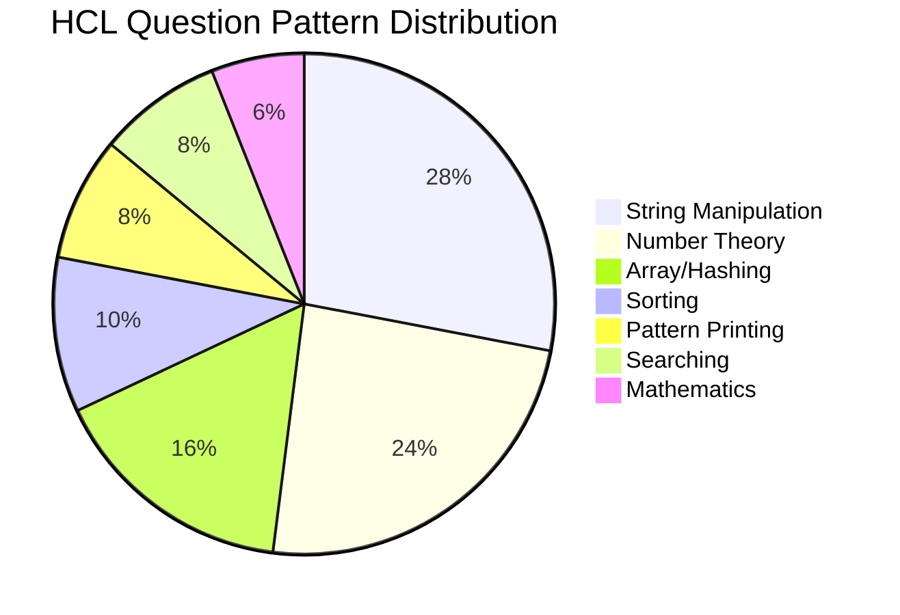

# HCL Technologies — Python Coding Interview Preparation

> **Company**: HCL Technologies  
> **Interview Process**: Online Assessment → Technical Round → HR  
> **Difficulty**: Easy to Medium (HCL focuses on fundamentals)  
> **Coding Round Pattern**: 2 coding questions  
> **Duration**: 45–60 minutes  
> **Platform**: HCL own platform / HackerRank  
> **Tips**: Focus on basics, clean code, and problem-solving approach

---

## TABLE OF CONTENTS

1. [Company Overview & Tips](#company-overview--tips)
2. [Questions 1–10 (Easy)](#questions-1-10-easy)
3. [Pattern Summary (Q1–10)](#pattern-summary-q1-10)
4. [Questions 11–15 (Easy)](#questions-11-15-easy)
5. [Questions 16–25 (Medium)](#questions-16-25-medium)
6. [Pattern Summary (Q11–20)](#pattern-summary-q11-20)
7. [Questions 26–30 (Medium)](#questions-26-30-medium)
8. [Pattern Summary (Q21–30)](#pattern-summary-q21-30)
9. [Questions 31–40 (Medium)](#questions-31-40-medium)
10. [Pattern Summary (Q31–40)](#pattern-summary-q31-40)
11. [Questions 41–50 (Hard)](#questions-41-50-hard)
12. [Complete Revision Table](#complete-revision-table)
13. [Frequently Repeated Questions for HCL](#frequently-repeated-questions-for-hcl)
14. [Must Practice Before Interview](#must-practice-before-interview)
15. [Most Important Python Tricks for HCL](#most-important-python-tricks-for-hcl)
16. [Interview Checklist](#interview-checklist)
17. [Pattern Distribution Chart](#pattern-distribution-chart)

---

## QUESTIONS 1–10 (EASY)

---

### Q1. Swap Two Numbers Without Temp Variable

**Problem Statement**: Write a Python program to swap two numbers without using a third (temporary) variable.

**Difficulty**: Easy  
**Pattern**: Basic Arithmetic / Bit Manipulation  
**Companies Asked**: HCL, TCS, Infosys, Wipro, Cognizant  
**Concepts Needed**: Variable assignment, arithmetic operators, XOR operator  
**Constraints**: `-10⁶ ≤ a, b ≤ 10⁶`

**Approach 1 (Brute Force — Using Temp Variable)**: Use a third variable `temp` to hold one value during the swap.

**Approach 2 (Optimized — Arithmetic / XOR)**: Use addition/subtraction or XOR to swap in-place without extra memory.

**Python Solution**:
```python
from typing import Tuple


def swap_numbers(a: int, b: int) -> Tuple[int, int]:
    """
    Swap two numbers using arithmetic without temp variable.

    Args:
        a: First integer
        b: Second integer

    Returns:
        Tuple of swapped values (b, a)
    """
    a = a + b
    b = a - b
    a = a - b
    return a, b


def swap_xor(a: int, b: int) -> Tuple[int, int]:
    """Swap using XOR bitwise operator."""
    a = a ^ b
    b = a ^ b
    a = a ^ b
    return a, b
```

**Dry Run**:
```
Input: a = 5, b = 10

Step 1: a = a + b = 5 + 10 = 15
Step 2: b = a - b = 15 - 10 = 5
Step 3: a = a - b = 15 - 5 = 10
Output: a = 10, b = 5

XOR Method:
Step 1: a = a ^ b = 5 ^ 10 = 15
Step 2: b = a ^ b = 15 ^ 10 = 5
Step 3: a = a ^ b = 15 ^ 5 = 10
Output: a = 10, b = 5
```

**Complexity**: Time: O(1) | Space: O(1)

**Common Mistakes**: Integer overflow in languages without arbitrary precision (not an issue in Python).

**Edge Cases**: Negative numbers, large integers, swapping same number.

**Variations**: Swap using multiplication/division, swap using single-line `a, b = b, a`.

**Follow-up Questions**: Swap without any arithmetic (use XOR). Swap three numbers cyclically.

**Interview Tips**: Python's `a, b = b, a` is the most Pythonic way — mention it first.

**Expected Output**: `Input: a=5, b=10 → Output: a=10, b=5`

**Quick Revision Notes**:
- Python supports tuple unpacking: `a, b = b, a` is idiomatic.
- Arithmetic swap can overflow in other languages; XOR swap avoids this.
- XOR swap works for integers only; tuple unpacking works for any type.

---

### Q2. Find ASCII Value of a Character

**Problem Statement**: Write a Python program to find the ASCII value of a given character.

**Difficulty**: Easy  
**Pattern**: Built-in Functions  
**Companies Asked**: HCL, TCS, Wipro, Accenture  
**Concepts Needed**: `ord()`, `chr()` functions, ASCII table  
**Constraints**: Single printable character

**Approach 1 (Direct)**: Use Python's built-in `ord()` function.

**Python Solution**:
```python
def ascii_value(char: str) -> int:
    """
    Return the ASCII value of the given character.

    Args:
        char: A single character string

    Returns:
        Integer ASCII value

    Raises:
        ValueError: If input is not a single character
    """
    if len(char) != 1:
        raise ValueError("Input must be a single character")
    return ord(char)


def char_from_ascii(code: int) -> str:
    """Return the character for a given ASCII code."""
    return chr(code)
```

**Dry Run**:
```
Input: 'A' → ord('A') = 65 → Output: 65
Input: 'a' → ord('a') = 97 → Output: 97
Input: '0' → ord('0') = 48 → Output: 48
```

**Complexity**: Time: O(1) | Space: O(1)

**Common Mistakes**: Passing a string with length > 1.

**Edge Cases**: Digits, punctuation, special characters, unicode characters.

**Variations**: Find character from ASCII value using `chr()`, print full ASCII table.

**Follow-up Questions**: Difference between ASCII and Unicode. Why is ord('A') = 65?

**Interview Tips**: Remember key ASCII ranges: A-Z (65–90), a-z (97–122), 0-9 (48–57).

**Expected Output**: `Input: 'A' → Output: 65`

**Quick Revision Notes**:
- `ord()` gives ASCII/Unicode code point; `chr()` does the reverse.
- ASCII: 0–127; Extended ASCII: 128–255; Unicode: beyond.
- Key ranges: A=65, a=97, 0=48 (difference between upper/lower = 32).

---

### Q3. Check Leap Year

**Problem Statement**: Write a Python program to check if a given year is a leap year. A year is a leap year if it is divisible by 400, or divisible by 4 but not by 100.

**Difficulty**: Easy  
**Pattern**: Conditionals / Number Theory  
**Companies Asked**: HCL, TCS, Infosys, Wipro, Cognizant, Accenture  
**Concepts Needed**: Modulus operator, logical operators, conditionals  
**Constraints**: `1 ≤ year ≤ 10⁴`

**Approach 1 (Sequential Checks)**: Check all conditions in order.

**Approach 2 (Single Expression)**: Combine all conditions into one boolean expression.

**Python Solution**:
```python
def is_leap_year(year: int) -> bool:
    """
    Check if a given year is a leap year.

    Leap year rules:
    - Divisible by 400 → leap
    - Divisible by 4 but NOT by 100 → leap
    - All others → not leap

    Args:
        year: Integer representing the year

    Returns:
        True if leap year, False otherwise
    """
    if year % 400 == 0:
        return True
    if year % 100 == 0:
        return False
    if year % 4 == 0:
        return True
    return False


def is_leap_year_oneliner(year: int) -> bool:
    """Compact leap year check."""
    return (year % 400 == 0) or (year % 4 == 0 and year % 100 != 0)
```

**Dry Run**:
```
Input: 2000 → 2000%400=0 → True (Leap Year)
Input: 1900 → 1900%400≠0, 1900%100=0 → False (Not Leap)
Input: 2024 → 2024%400≠0, 2024%100≠0, 2024%4=0 → True (Leap Year)
Input: 2023 → 2023%4≠0 → False (Not Leap)
```

**Complexity**: Time: O(1) | Space: O(1)

**Common Mistakes**: Forgetting the "divisible by 400" rule; checking only divisibility by 4.

**Edge Cases**: Year 0 (doesn't exist in Gregorian calendar), negative years (BC), century years.

**Variations**: Return number of days in February, return number of days in year.

**Follow-up Questions**: Find next N leap years, count leap years in a range.

**Interview Tips**: Always check 400-rule first to short-circuit efficiently.

**Expected Output**: `2000 → Leap Year | 1900 → Not a Leap Year`

**Quick Revision Notes**:
- Century years must be divisible by 400 (not just 4) to be leap.
- Condition order: 400 → 100 → 4 for clean logic.
- 2100 is NOT a leap year despite being divisible by 4.

---

### Q4. Print Multiplication Table

**Problem Statement**: Write a Python program to print the multiplication table of a given number up to 10 (or a given range).

**Difficulty**: Easy  
**Pattern**: Loops  
**Companies Asked**: HCL, TCS, Wipro, Cognizant  
**Concepts Needed**: For loops, string formatting, f-strings  
**Constraints**: `1 ≤ n ≤ 100`, `1 ≤ limit ≤ 100`

**Approach 1**: Use a `for` loop from 1 to the limit and print each multiple.

**Python Solution**:
```python
def multiplication_table(n: int, limit: int = 10) -> None:
    """
    Print the multiplication table of n up to given limit.

    Args:
        n: Number to generate table for
        limit: Upper bound for multiplier (default 10)
    """
    for i in range(1, limit + 1):
        print(f"{n} x {i} = {n * i}")
```

**Dry Run** (n=5, limit=10):
```
i=1: 5 x 1 = 5
i=2: 5 x 2 = 10
i=3: 5 x 3 = 15
...
i=10: 5 x 10 = 50
```

**Complexity**: Time: O(limit) | Space: O(1)

**Common Mistakes**: Off-by-one: using `range(limit)` instead of `range(1, limit+1)`.

**Edge Cases**: n=0 (all products = 0), n=1, negative n, limit=1.

**Variations**: Print table in reverse, print tables for a range of numbers.

**Follow-up Questions**: Print multiplication table using recursion.

**Interview Tips**: Use f-strings for clean formatting.

**Quick Revision Notes**:
- `range(1, limit+1)` loops from 1 to limit inclusive.
- f-strings: `f"{n} x {i} = {n*i}"` is clean and readable.
- List comprehension: `[(i, n*i) for i in range(1, limit+1)]`.

---

### Q5. Find Sum of Digits

**Problem Statement**: Write a Python program to find the sum of digits of a given integer.

**Difficulty**: Easy  
**Pattern**: Number Theory / Iterative  
**Companies Asked**: HCL, TCS, Infosys, Wipro, Cognizant, Accenture  
**Concepts Needed**: While loops, modulus `%`, floor division `//`  
**Constraints**: `0 ≤ n ≤ 10¹²`

**Approach 1 (Iterative)**: Repeatedly extract last digit using `n % 10` and remove using `n // 10`.

**Approach 2 (String Conversion)**: Convert to string, sum digits.

**Python Solution**:
```python
def sum_of_digits(n: int) -> int:
    """
    Calculate sum of digits of an integer.

    Args:
        n: Non-negative integer

    Returns:
        Sum of its digits
    """
    total = 0
    n = abs(n)
    while n > 0:
        total += n % 10
        n //= 10
    return total


def sum_of_digits_str(n: int) -> int:
    """Calculate sum of digits using string conversion."""
    return sum(int(d) for d in str(abs(n)))
```

**Dry Run** (n=1234):
```
Step 1: total=0+(1234%10=4)=4, n=1234//10=123
Step 2: total=4+(123%10=3)=7, n=123//10=12
Step 3: total=7+(12%10=2)=9, n=12//10=1
Step 4: total=9+(1%10=1)=10, n=1//10=0
Output: 10
```

**Complexity**: Time: O(log₁₀ n) | Space: O(1)

**Common Mistakes**: Not handling 0 (sum of 0 is 0), not handling negatives.

**Edge Cases**: n=0 → return 0, negative numbers, large numbers.

**Variations**: Sum of digits until single digit (digital root), product of digits.

**Follow-up Questions**: Digital root (repeated sum until single digit). Check if number is Harshad number.

**Interview Tips**: Both approaches work; string method is simpler but iterative shows understanding.

**Quick Revision Notes**:
- `n % 10` extracts last digit; `n // 10` removes last digit.
- String approach: `sum(int(d) for d in str(n))` — clean one-liner.
- Time complexity = O(number of digits) ≈ O(log₁₀ n).

---

### Q6. Check Strong Number

**Problem Statement**: A strong number is a number where the sum of the factorials of its digits equals the number itself. Example: 145 = 1! + 4! + 5! = 145.

**Difficulty**: Easy  
**Pattern**: Number Theory  
**Companies Asked**: HCL, TCS, Infosys  
**Concepts Needed**: Factorial, modulus, loops  
**Constraints**: `1 ≤ n ≤ 10⁵`

**Approach 1 (Brute Force)**: Compute factorial for each digit on-the-fly.

**Approach 2 (Optimized — Precompute Factorials)**: Precompute factorials of digits 0–9.

**Python Solution**:
```python
def factorial(n: int) -> int:
    """Compute factorial recursively."""
    return 1 if n <= 1 else n * factorial(n - 1)


FACTORIALS = [1, 1, 2, 6, 24, 120, 720, 5040, 40320, 362880]


def is_strong_number(n: int) -> bool:
    """
    Check if a number is a Strong Number.

    Strong number: sum of factorials of digits equals the number.

    Args:
        n: Integer to check

    Returns:
        True if strong number, False otherwise
    """
    original = n
    total = 0
    while n > 0:
        total += FACTORIALS[n % 10]
        n //= 10
    return total == original
```

**Dry Run** (n=145):
```
Step 1: digit=5, total=0+5!=120, n=14
Step 2: digit=4, total=120+4!=120+24=144, n=1
Step 3: digit=1, total=144+1!=144+1=145, n=0
total=145 == original(145) → True → Strong Number

n=123: 3!+2!+1! = 6+2+1 = 9 ≠ 123 → Not Strong
```

**Complexity**: Time: O(d) with precomputation | Space: O(1)

**Common Mistakes**: Using 0! = 0 (it's 1). Not restoring original number.

**Edge Cases**: n=0, n=1 (1=1! → strong), n=2 (2=2! → strong).

**Follow-up Questions**: Find all strong numbers in a range. Only known strong numbers: 1, 2, 145, 40585.

**Interview Tips**: Precomputing factorials shows optimization thinking.

**Quick Revision Notes**:
- Strong number = sum of digit factorials equals the number.
- Only 4 known strong numbers: 1, 2, 145, 40585.
- Precompute factorials 0!–9! for O(d) time.

---

### Q7. Find Roots of Quadratic Equation

**Problem Statement**: Write a program to find roots of ax² + bx + c = 0. Handle real distinct, real equal, and complex roots.

**Difficulty**: Easy  
**Pattern**: Mathematics / Conditionals  
**Companies Asked**: HCL, TCS, Infosys, Wipro  
**Concepts Needed**: Math module, sqrt, discriminant  
**Constraints**: `a ≠ 0`

**Approach 1 (Complete Solution)**: Calculate D = b² − 4ac. D>0: 2 real. D=0: 1 real. D<0: complex.

**Python Solution**:
```python
import math
from typing import Union, Tuple


def quadratic_roots(
    a: float, b: float, c: float
) -> Union[Tuple[float, float], Tuple[float], Tuple[complex, complex]]:
    """
    Find roots of quadratic equation ax² + bx + c = 0.

    Args:
        a: Coefficient of x² (must be non-zero)
        b: Coefficient of x
        c: Constant term

    Returns:
        Tuple of roots
    """
    if a == 0:
        raise ValueError("Coefficient 'a' cannot be zero")

    discriminant = b * b - 4 * a * c

    if discriminant > 0:
        r1 = (-b + math.sqrt(discriminant)) / (2 * a)
        r2 = (-b - math.sqrt(discriminant)) / (2 * a)
        return (r1, r2)
    elif discriminant == 0:
        root = -b / (2 * a)
        return (root,)
    else:
        real = -b / (2 * a)
        imag = math.sqrt(-discriminant) / (2 * a)
        return (complex(real, imag), complex(real, -imag))
```

**Dry Run**:
```
x² - 5x + 6 = 0: D=1>0 → roots: 3.0, 2.0
x² - 4x + 4 = 0: D=0 → root: 2.0 (repeated)
x² + x + 1 = 0: D=-3<0 → roots: -0.5±0.866j
```

**Complexity**: Time: O(1) | Space: O(1)

**Common Mistakes**: Forgetting `a ≠ 0` check.

**Follow-up Questions**: Nature of roots without computing, solve cubic equation.

**Interview Tips**: Show understanding of discriminant. Mention `cmath` as alternative.

**Quick Revision Notes**:
- D = b² − 4ac determines root nature.
- Formula: x = (-b ± √D) / 2a.
- Handle complex roots manually or use `cmath.sqrt()`.

---

### Q8. Check Perfect Square

**Problem Statement**: Check if a given number is a perfect square.

**Difficulty**: Easy  
**Pattern**: Number Theory  
**Companies Asked**: HCL, TCS, Wipro, Cognizant  
**Concepts Needed**: Math.isqrt, binary search  
**Constraints**: `0 ≤ n ≤ 10¹²`

**Approach 1 (Using math.isqrt)**: Compute integer sqrt, check its square equals n.

**Approach 2 (Binary Search)**: Binary search for integer sqrt.

**Python Solution**:
```python
import math


def is_perfect_square(n: int) -> bool:
    """Check if a number is a perfect square."""
    if n < 0:
        return False
    root = math.isqrt(n)
    return root * root == n
```

**Dry Run**:
```
n=16: isqrt(16)=4, 4*4=16==16 → True
n=14: isqrt(14)=3, 3*3=9≠14 → False
```

**Complexity**: Time: O(1) | Space: O(1)

**Common Mistakes**: Using `math.sqrt()` — floating point errors for large numbers.

**Edge Cases**: n=0, n=1 (both perfect squares), negative numbers.

**Follow-up Questions**: Find next perfect square, count perfect squares in a range.

**Interview Tips**: Always use `math.isqrt()` (Python 3.8+) instead of `math.sqrt()`.

**Quick Revision Notes**:
- `math.isqrt(n)` returns integer floor square root (Python 3.8+).
- Check: `isqrt(n) ** 2 == n`.
- Avoid `math.sqrt()` for integer checks.

---

### Q9. Decimal to Binary Conversion

**Problem Statement**: Convert a decimal number to its binary representation.

**Difficulty**: Easy  
**Pattern**: Bit Manipulation  
**Companies Asked**: HCL, TCS, Infosys, Wipro, Cognizant  
**Concepts Needed**: Division method, bin()  
**Constraints**: `0 ≤ n ≤ 10⁶`

**Approach 1 (Division Method)**: Repeatedly divide by 2, collect remainders in reverse.

**Approach 2 (Built-in)**: Use `bin()`.

**Python Solution**:
```python
def decimal_to_binary(n: int) -> str:
    """Convert decimal to binary (without '0b' prefix)."""
    if n == 0:
        return "0"
    binary = ""
    while n > 0:
        binary = str(n % 2) + binary
        n //= 2
    return binary


def decimal_to_binary_builtin(n: int) -> str:
    """Convert using built-in bin()."""
    return bin(n)[2:]
```

**Dry Run** (n=13):
```
13÷2=6 r1, 6÷2=3 r0, 3÷2=1 r1, 1÷2=0 r1
Read bottom-up: 1101
Verify: 8+4+0+1=13 ✓
bin(13) = '0b1101' → [2:] = '1101'
```

**Complexity**: Time: O(log n) | Space: O(log n)

**Common Mistakes**: Not handling n=0 (should return "0").

**Edge Cases**: n=0, large numbers, negative numbers.

**Variations**: Binary to decimal, octal/hex conversion.

**Follow-up Questions**: Count number of 1s (Hamming weight), check power of 2.

**Interview Tips**: `bin()` is acceptable; show manual method first.

**Quick Revision Notes**:
- `bin(n)` returns '0b...' format; slice `[2:]` to remove prefix.
- Manual: collect remainders from division by 2, reverse.
- Bitwise: `n & 1` gets LSB, `n >>= 1` shifts right.

---

### Q10. Matrix Transpose

**Problem Statement**: Find the transpose of a given matrix (swap rows with columns).

**Difficulty**: Easy  
**Pattern**: Matrix / 2D Arrays  
**Companies Asked**: HCL, TCS, Infosys, Wipro, Cognizant, Accenture  
**Concepts Needed**: Nested loops, zip  
**Constraints**: `1 ≤ rows, cols ≤ 100`

**Approach 1 (Nested Loops)**: Create new matrix with swapped dimensions.

**Approach 2 (Zip)**: Use `zip(*matrix)`.

**Python Solution**:
```python
from typing import List, TypeVar

T = TypeVar('T')


def transpose(matrix: List[List[T]]) -> List[List[T]]:
    """Transpose a matrix (swap rows and columns)."""
    if not matrix or not matrix[0]:
        return []
    rows, cols = len(matrix), len(matrix[0])
    result = [[0] * rows for _ in range(cols)]
    for i in range(rows):
        for j in range(cols):
            result[j][i] = matrix[i][j]
    return result


def transpose_zip(matrix: List[List[T]]) -> List[List[T]]:
    """Transpose using zip."""
    return [list(row) for row in zip(*matrix)]
```

**Dry Run**:
```
Input: [[1,2,3],
        [4,5,6]]
i=0,j=0→result[0][0]=1; j=1→result[1][0]=2; j=2→result[2][0]=3
i=1,j=0→result[0][1]=4; j=1→result[1][1]=5; j=2→result[2][1]=6
Output: [[1,4],
         [2,5],
         [3,6]]
```

**Complexity**: Time: O(r×c) | Space: O(r×c)

**Common Mistakes**: Dimension confusion, not handling empty matrix.

**Edge Cases**: 1×1 matrix, empty matrix.

**Variations**: In-place transpose (square), rotate matrix 90 degrees.

**Follow-up Questions**: Matrix multiplication, spiral matrix (LeetCode 54).

**Interview Tips**: `zip(*matrix)` is the most Pythonic approach.

**Quick Revision Notes**:
- `zip(*matrix)` transposes any 2D list elegantly.
- r×c matrix transposes to c×r.
- For square matrices, transpose is symmetric about the diagonal.

---


## PATTERN SUMMARY (Q1–10)

| # | Question | Pattern | Key Approach | Time | Space |
|---|----------|---------|--------------|------|-------|
| Q1 | Swap Two Numbers | Arithmetic / Bitwise | `a, b = b, a` | O(1) | O(1) |
| Q2 | ASCII Value | Built-in | `ord()` / `chr()` | O(1) | O(1) |
| Q3 | Leap Year | Conditionals | 400/100/4 rules | O(1) | O(1) |
| Q4 | Multiplication Table | Loops | `for i in range(1, limit+1)` | O(n) | O(1) |
| Q5 | Sum of Digits | Iterative | `n%10` + `n//10` | O(log n) | O(1) |
| Q6 | Strong Number | Number Theory | Precomputed factorials | O(d) | O(1) |
| Q7 | Quadratic Roots | Mathematics | Discriminant formula | O(1) | O(1) |
| Q8 | Perfect Square | Number Theory | `math.isqrt()` | O(1) | O(1) |
| Q9 | Decimal to Binary | Bit Manipulation | Division by 2 / `bin()` | O(log n) | O(log n) |
| Q10 | Matrix Transpose | 2D Arrays | `zip(*matrix)` | O(r×c) | O(r×c) |

**Important Observations**:
- HCL focuses on fundamental programming constructs: loops, conditionals, basic math.
- Many problems have a Pythonic one-liner that shows language proficiency.
- Number theory questions are common at the easy level.

---

## QUESTIONS 11–15 (EASY)

---

### Q11. Count Words in a String

**Problem Statement**: Count the number of words in a given string. Words are separated by whitespace.

**Difficulty**: Easy  
**Pattern**: String Manipulation  
**Companies Asked**: HCL, TCS, Wipro, Accenture, Cognizant  
**Concepts Needed**: String methods, split()  
**Constraints**: `1 ≤ len(s) ≤ 10⁵`

**Approach 1 (Split)**: `len(text.split())` splits on whitespace by default.

**Approach 2 (Manual)**: Count transitions from space to non-space.

**Python Solution**:
```python
def count_words(text: str) -> int:
    """Count the number of words in a string."""
    return len(text.split())


def count_words_manual(text: str) -> int:
    """Count words manually."""
    count = 0
    in_word = False
    for char in text:
        if char.isspace():
            in_word = False
        elif not in_word:
            count += 1
            in_word = True
    return count
```

**Dry Run** (text="Hello World from Python"):
```
split() → ["Hello", "World", "from", "Python"] → len=4
```

**Complexity**: Time: O(n) | Space: O(n) for split; O(1) manual

**Common Mistakes**: Using `count(' ')` which counts spaces, not words.

**Edge Cases**: Empty string (0), multiple consecutive spaces, leading/trailing spaces.

**Variations**: Count unique words, count word frequency.

**Follow-up Questions**: Most frequent word, count words in a file.

**Interview Tips**: `split()` without arguments handles all whitespace types.

**Quick Revision Notes**:
- `str.split()` splits on any whitespace, removes empty strings.
- Manual: detect transitions from whitespace to non-whitespace.
- File word count: `with open(f) as f: words = f.read().split()`.

---

### Q12. Capitalize First Letter of Each Word

**Problem Statement**: Capitalize the first letter of each word in a string.

**Difficulty**: Easy  
**Pattern**: String Manipulation  
**Companies Asked**: HCL, TCS, Wipro, Cognizant  
**Concepts Needed**: title(), split(), join()  
**Constraints**: `1 ≤ len(s) ≤ 10⁵`

**Python Solution**:
```python
def capitalize_words(text: str) -> str:
    """Capitalize first letter of each word."""
    return text.title()


def capitalize_words_manual(text: str) -> str:
    """Capitalize each word manually."""
    return ' '.join(word.capitalize() for word in text.split())
```

**Dry Run** (text="hello world"):
```
split() → ["hello", "world"]
capitalize → "Hello" "World"
join → "Hello World"
```

**Complexity**: Time: O(n) | Space: O(n)

**Common Mistakes**: `title()` lowercases the rest; `capitalize()` also does.

**Edge Cases**: Empty string, single character, words with numbers.

**Variations**: CamelCase, sentence case (only first word).

**Follow-up Questions**: Handle apostrophes (e.g., "don't" → "Don't").

**Interview Tips**: Know that `title()` lowercases other letters.

**Quick Revision Notes**:
- `str.title()` capitalizes first letter of each word.
- Manual: `word[0].upper() + word[1:]` preserves original casing.
- `str.capitalize()` only capitalizes the first character of the string.

---

### Q13. Check Palindrome String

**Problem Statement**: Check if a string reads the same forwards and backwards.

**Difficulty**: Easy  
**Pattern**: String / Two Pointers  
**Companies Asked**: HCL, TCS, Infosys, Wipro, Cognizant, Accenture  
**Concepts Needed**: String slicing, two pointers  
**Constraints**: `1 ≤ len(s) ≤ 10⁵`

**Approach 1 (Reversal)**: `s == s[::-1]`

**Approach 2 (Two Pointers)**: Compare from both ends.

**Python Solution**:
```python
def is_palindrome(s: str) -> bool:
    """Check palindrome using string reversal."""
    return s == s[::-1]


def is_palindrome_twopointer(s: str) -> bool:
    """Check palindrome using two pointers."""
    left, right = 0, len(s) - 1
    while left < right:
        if s[left] != s[right]:
            return False
        left += 1
        right -= 1
    return True
```

**Dry Run** (s="racecar"):
```
left=0('r'), right=6('r') → match
left=1('a'), right=5('a') → match
left=2('c'), right=4('c') → match
left=3('e'), right=3 → stop → True
```

**Complexity**: Time: O(n) | Space: O(n) reversal; O(1) two-pointer

**Common Mistakes**: Case sensitivity (depends on spec).

**Edge Cases**: Empty string, single char, case sensitivity.

**Variations**: Palindrome number, palindrome ignoring non-alphanumeric.

**Follow-up Questions**: Longest palindromic substring (LeetCode 5).

**Interview Tips**: Two-pointer is memory-efficient. Use `[c.lower() for c in s if c.isalnum()]` for alphanumeric check.

**Quick Revision Notes**:
- `s[::-1]` reverses a string efficiently.
- Two-pointer uses O(1) extra space.
- For alphanumeric palindrome: filter with `isalnum()`.

---

### Q14. Find Factorial of a Number

**Problem Statement**: Find n! = n × (n-1) × ... × 1, with 0! = 1.

**Difficulty**: Easy  
**Pattern**: Recursion / Iteration  
**Companies Asked**: HCL, TCS, Infosys, Wipro, Cognizant  
**Concepts Needed**: Loops, recursion, math.factorial  
**Constraints**: `0 ≤ n ≤ 1000`

**Python Solution**:
```python
import math


def factorial_iterative(n: int) -> int:
    """Compute factorial iteratively."""
    if n < 0:
        raise ValueError("Factorial not defined for negative numbers")
    result = 1
    for i in range(2, n + 1):
        result *= i
    return result


def factorial_recursive(n: int) -> int:
    """Compute factorial recursively."""
    if n < 0:
        raise ValueError("Factorial not defined for negative numbers")
    return 1 if n <= 1 else n * factorial_recursive(n - 1)
```

**Dry Run** (n=5):
```
Iterative: 1×2×3×4×5 = 120
Recursive: 5×4×3×2×1 = 120
```

**Complexity**: Time: O(n) | Space: O(1) iterative; O(n) recursive

**Common Mistakes**: Not handling 0! = 1.

**Edge Cases**: n=0 (return 1), negative n (undefined).

**Variations**: Trailing zeros in n!, nCr combinations.

**Follow-up Questions**: Count trailing zeros in n! (LeetCode 172).

**Interview Tips**: Python handles arbitrarily large integers — mention this.

**Quick Revision Notes**:
- 0! = 1 by definition.
- Iterative: O(n) time, O(1) space.
- `math.factorial(n)` for production use.

---

### Q15. Check Prime Number

**Problem Statement**: Check if a number is prime (divisible only by 1 and itself).

**Difficulty**: Easy  
**Pattern**: Number Theory  
**Companies Asked**: HCL, TCS, Infosys, Wipro, Cognizant  
**Concepts Needed**: Loops, modulus, sqrt optimization  
**Constraints**: `1 ≤ n ≤ 10⁶`

**Approach 1 (Brute Force)**: Check from 2 to n-1.

**Approach 2 (Optimized)**: Check up to √n, handle 2 and even numbers separately.

**Python Solution**:
```python
import math


def is_prime(n: int) -> bool:
    """Check if a number is prime."""
    if n < 2:
        return False
    if n < 4:
        return True  # 2, 3
    if n % 2 == 0:
        return False
    for i in range(3, int(math.sqrt(n)) + 1, 2):
        if n % i == 0:
            return False
    return True
```

**Dry Run** (n=29):
```
√29≈5.38, check i=3,5
i=3: 29%3=2≠0, i=5: 29%5=4≠0 → True (Prime)
n=25: i=3(25%3=1≠0), i=5(25%5=0) → False (Not Prime)
```

**Complexity**: Time: O(√n) | Space: O(1)

**Common Mistakes**: Treating 1 as prime (it's not).

**Edge Cases**: n=1 (not prime), n=2 (prime), n=3 (prime).

**Variations**: Sieve of Eratosthenes, prime factorization.

**Follow-up Questions**: Express number as sum of two primes (Goldbach).

**Interview Tips**: The 6k±1 optimization is a further refinement.

**Quick Revision Notes**:
- Check up to √n only.
- Handle 2 and even numbers separately.
- 1 is NOT prime. 2 is the only even prime.

---

## QUESTIONS 16–25 (MEDIUM)

---

### Q16. Find Second Largest Element in Array

**Problem Statement**: Find the second largest element in an array of integers.

**Difficulty**: Medium  
**Pattern**: Array / Searching  
**Companies Asked**: HCL, TCS, Infosys, Wipro, Cognizant, Accenture  
**Concepts Needed**: Single pass, comparison  
**Constraints**: `2 ≤ len(arr) ≤ 10⁵`, `-10⁶ ≤ arr[i] ≤ 10⁶`

**Approach 1 (Sort)**: Sort and pick second last distinct element (O(n log n)).

**Approach 2 (Single Pass)**: Track `first` and `second` largest in one traversal.

**Python Solution**:
```python
from typing import List, Optional


def second_largest(arr: List[int]) -> Optional[int]:
    """Find second largest element in single pass."""
    if len(arr) < 2:
        return None
    first = second = float('-inf')
    for num in arr:
        if num > first:
            second = first
            first = num
        elif num > second and num != first:
            second = num
    return None if second == float('-inf') else second
```

**Dry Run** (arr=[12,35,1,10,34,1]):
```
first=-inf, second=-inf
12: >-inf → second=-inf, first=12
35: >12 → second=12, first=35
1: skip
10: >12? No, >-inf? Yes, ≠35 → second=10
34: >35? No, >10 → second=34
1: skip
Output: 34
```

**Complexity**: Time: O(n) | Space: O(1)

**Common Mistakes**: Not handling duplicates, not handling all-equal arrays.

**Edge Cases**: All elements same (return None), negative numbers.

**Variations**: Third largest, Kth largest, second smallest.

**Follow-up Questions**: Tournament method (divide & conquer).

**Interview Tips**: Initialize with `float('-inf')` to handle negatives.

**Quick Revision Notes**:
- Single pass with `first` and `second` variables.
- Initialize with `float('-inf')`.
- Sorting approach is O(n log n) — not optimal.

---

### Q17. Reverse a String Without Built-in Reverse

**Problem Statement**: Reverse a string without using `reversed()` or `[::-1]`.

**Difficulty**: Medium  
**Pattern**: String / Two Pointers  
**Companies Asked**: HCL, TCS, Infosys, Wipro, Cognizant  
**Concepts Needed**: Two pointers, string mutability (list conversion)  
**Constraints**: `1 ≤ len(s) ≤ 10⁵`

**Approach 1 (Two Pointers)**: Convert to list, swap from both ends.

**Approach 2 (Recursive)**: Last char + reverse(rest).

**Python Solution**:
```python
def reverse_string(s: str) -> str:
    """Reverse a string using two pointers."""
    chars = list(s)
    left, right = 0, len(chars) - 1
    while left < right:
        chars[left], chars[right] = chars[right], chars[left]
        left += 1
        right -= 1
    return ''.join(chars)
```

**Dry Run** (s="Python"):
```
['P','y','t','h','o','n']
left=0('P'), right=5('n') → swap → ['n','y','t','h','o','P']
left=1('y'), right=4('o') → swap → ['n','o','t','h','y','P']
left=2('t'), right=3('h') → swap → ['n','o','h','t','y','P']
→ "nohtyP"
```

**Complexity**: Time: O(n) | Space: O(n)

**Common Mistakes**: Forgetting strings are immutable (can't do `s[i]=s[j]`).

**Edge Cases**: Empty string, single char, palindrome.

**Variations**: Reverse words in sentence, reverse vowels only.

**Follow-up Questions**: Reverse Words in a String (LeetCode 151).

**Interview Tips**: Strings are immutable — convert to list first.

**Quick Revision Notes**:
- Strings are immutable — convert to `list(s)` to modify.
- Two-pointer swap is O(n) time, O(n) space.
- Recursive approach risks recursion limit for long strings.

---

### Q18. Find Maximum and Minimum in Array

**Problem Statement**: Find both max and min elements in an array.

**Difficulty**: Medium  
**Pattern**: Array / Searching  
**Companies Asked**: HCL, TCS, Infosys, Wipro, Cognizant  
**Concepts Needed**: Single pass  
**Constraints**: `1 ≤ len(arr) ≤ 10⁵`

**Python Solution**:
```python
from typing import List, Tuple


def find_min_max(arr: List[int]) -> Tuple[int, int]:
    """Find min and max in one pass."""
    if not arr:
        raise ValueError("Array cannot be empty")
    min_val = max_val = arr[0]
    for num in arr[1:]:
        if num < min_val:
            min_val = num
        if num > max_val:
            max_val = num
    return min_val, max_val
```

**Dry Run** (arr=[3,7,2,9,1,5]):
```
min=3, max=3
7: 7>3 → max=7
2: 2<3 → min=2
9: 9>7 → max=9
1: 1<2 → min=1
5: 5<1? No, 5>9? No
Output: (1, 9)
```

**Complexity**: Time: O(n) | Space: O(1)

**Common Mistakes**: Initializing min with 0 (fails for all-positive arrays).

**Edge Cases**: Single element (min=max=that element).

**Variations**: Second min/max, kth min/max.

**Follow-up Questions**: Tournament method reduces comparisons to 3n/2.

**Interview Tips**: Pair comparison method reduces comparisons by ~25%.

**Quick Revision Notes**:
- Initialize both min and max with the first element.
- Single pass: O(n) time, O(1) space.
- Tournament method: compare in pairs for 3n/2 comparisons.

---

### Q19. Check if Two Strings are Anagrams

**Problem Statement**: Check if two strings contain the same characters with same frequencies.

**Difficulty**: Medium  
**Pattern**: String / Hashing  
**Companies Asked**: HCL, TCS, Infosys, Wipro, Cognizant, Accenture  
**Concepts Needed**: Sorting, Counter, character count  
**Constraints**: `1 ≤ len(s1), len(s2) ≤ 10⁵`

**Approach 1 (Sorting)**: `sorted(s1) == sorted(s2)` (O(n log n)).

**Approach 2 (Counter)**: `Counter(s1) == Counter(s2)` (O(n)).

**Python Solution**:
```python
from collections import Counter


def are_anagrams(s1: str, s2: str) -> bool:
    """Check anagrams using Counter."""
    if len(s1) != len(s2):
        return False
    return Counter(s1) == Counter(s2)
```

**Dry Run**:
```
"listen", "silent" → Counter('l':1,'i':1,'s':1,'t':1,'e':1,'n':1) → equal → True
"hello", "world" → Counters differ → False
```

**Complexity**: Time: O(n) | Space: O(k) where k is distinct chars

**Common Mistakes**: Not checking length first (fast exit).

**Edge Cases**: Empty strings, case sensitivity.

**Variations**: Group anagrams, find if string contains anagram of another.

**Follow-up Questions**: Group Anagrams (LeetCode 49).

**Interview Tips**: Length check is an instant rejection. Counter is Pythonic.

**Quick Revision Notes**:
- Anagrams have same length and same char frequencies.
- `Counter(s1) == Counter(s2)` is the most Pythonic check.
- Early return on length mismatch.

---

### Q20. Remove Duplicates from List

**Problem Statement**: Remove duplicates from a list while preserving order.

**Difficulty**: Medium  
**Pattern**: Array / Hashing  
**Companies Asked**: HCL, TCS, Infosys, Wipro, Cognizant  
**Concepts Needed**: Set, order preservation  
**Constraints**: `1 ≤ len(arr) ≤ 10⁵`

**Python Solution**:
```python
from typing import List, Any


def remove_duplicates(arr: List[Any]) -> List[Any]:
    """Remove duplicates while preserving order."""
    seen = set()
    result = []
    for item in arr:
        if item not in seen:
            seen.add(item)
            result.append(item)
    return result


def remove_duplicates_dict(arr: List[Any]) -> List[Any]:
    """Remove duplicates using dict (Python 3.7+ order preserved)."""
    return list(dict.fromkeys(arr))
```

**Dry Run** (arr=[1,2,3,2,1,4,5,4]):
```
seen={}, result=[]
1: not seen → seen={1}, result=[1]
2: not seen → seen={1,2}, result=[1,2]
3: not seen → seen={1,2,3}, result=[1,2,3]
2: seen → skip
1: seen → skip
4: not seen → seen={1,2,3,4}, result=[1,2,3,4]
5: not seen → seen={1,2,3,4,5}, result=[1,2,3,4,5]
4: seen → skip
Output: [1,2,3,4,5]
```

**Complexity**: Time: O(n) | Space: O(n)

**Common Mistakes**: Using `set(arr)` which doesn't preserve order.

**Edge Cases**: Empty list, all same elements, no duplicates.

**Variations**: In-place removal from sorted array (two pointers).

**Follow-up Questions**: Remove Duplicates from Sorted Array (LeetCode 26).

**Interview Tips**: `dict.fromkeys(arr)` is a clever one-liner.

**Quick Revision Notes**:
- `set` tracks seen items in O(1) average lookup.
- `dict.fromkeys(arr)` works as ordered dedup.
- In-place for sorted array: two-pointer O(1) space.

---

## PATTERN SUMMARY (Q11–20)

| # | Question | Pattern | Key Approach | Time | Space |
|---|----------|---------|--------------|------|-------|
| Q11 | Count Words | String | `str.split()` | O(n) | O(n) |
| Q12 | Capitalize Words | String | `str.title()` | O(n) | O(n) |
| Q13 | Palindrome String | Two Pointers | `s == s[::-1]` | O(n) | O(1) |
| Q14 | Factorial | Iteration | Loop | O(n) | O(1) |
| Q15 | Prime Number | Number Theory | Trial div up to √n | O(√n) | O(1) |
| Q16 | Second Largest | Array | Single pass | O(n) | O(1) |
| Q17 | Reverse String | Two Pointers | List swap | O(n) | O(n) |
| Q18 | Min and Max | Array | Single pass | O(n) | O(1) |
| Q19 | Anagram Check | Hashing | `Counter` equality | O(n) | O(k) |
| Q20 | Remove Duplicates | Hashing | Set tracking | O(n) | O(n) |

---

## QUESTIONS 21–25 (MEDIUM)

---

### Q21. Find GCD (Greatest Common Divisor)

**Problem Statement**: Find the GCD/HCF of two numbers.

**Difficulty**: Medium  
**Pattern**: Number Theory / Euclidean Algorithm  
**Companies Asked**: HCL, TCS, Infosys, Wipro, Cognizant  
**Concepts Needed**: Euclidean algorithm, recursion, math.gcd  
**Constraints**: `1 ≤ a, b ≤ 10⁹`

**Approach 1 (Euclidean Algorithm)**: `GCD(a,b) = GCD(b, a%b)` until b=0.

**Python Solution**:
```python
import math


def gcd_euclidean(a: int, b: int) -> int:
    """Find GCD using Euclidean algorithm."""
    a, b = abs(a), abs(b)
    while b:
        a, b = b, a % b
    return a
```

**Dry Run** (a=56, b=98):
```
a=56, b=98 → a=98, b=56
a=98, b=56 → a=56, b=42
a=56, b=42 → a=42, b=14
a=42, b=14 → a=14, b=0
b=0 → return 14
```

**Complexity**: Time: O(log min(a,b)) | Space: O(1)

**Common Mistakes**: Not handling negative numbers.

**Edge Cases**: a=0 → GCD = b, both 0 (undefined).

**Variations**: LCM using GCD (a×b/GCD), GCD of array.

**Follow-up Questions**: Extended Euclidean algorithm, co-prime check.

**Interview Tips**: Euclidean algorithm is the optimal and expected solution.

**Quick Revision Notes**:
- Euclidean: `GCD(a,b) = GCD(b, a%b)` until b=0.
- GCD × LCM = a × b.
- GCD is always positive.

---

### Q22. Fibonacci Series

**Problem Statement**: Generate Fibonacci series up to N terms (0, 1, 1, 2, 3, 5, 8, ...).

**Difficulty**: Medium  
**Pattern**: Dynamic Programming / Iteration  
**Companies Asked**: HCL, TCS, Infosys, Wipro, Cognizant, Accenture  
**Concepts Needed**: Iteration, recursion, memoization  
**Constraints**: `1 ≤ n ≤ 10⁵`

**Python Solution**:
```python
from typing import List


def fibonacci_series(n: int) -> List[int]:
    """Generate Fibonacci series up to n terms."""
    if n <= 0:
        return []
    if n == 1:
        return [0]
    fib = [0, 1]
    for _ in range(2, n):
        fib.append(fib[-1] + fib[-2])
    return fib


def fibonacci_nth(n: int) -> int:
    """Return nth Fibonacci number."""
    if n <= 1:
        return n
    a, b = 0, 1
    for _ in range(2, n + 1):
        a, b = b, a + b
    return b
```

**Dry Run** (n=7):
```
fib = [0, 1]
i=2: fib=[0,1,1]
i=3: fib=[0,1,1,2]
i=4: fib=[0,1,1,2,3]
i=5: fib=[0,1,1,2,3,5]
i=6: fib=[0,1,1,2,3,5,8]
Output: [0, 1, 1, 2, 3, 5, 8]
```

**Complexity**: Time: O(n) | Space: O(n) for series; O(1) for nth

**Common Mistakes**: Starting with 1,1 instead of 0,1.

**Edge Cases**: n=0 ([]), n=1 ([0]).

**Variations**: Check if number is Fibonacci, sum of Fibonacci.

**Follow-up Questions**: Climbing Stairs (LeetCode 70). Matrix exponentiation (O(log n)).

**Interview Tips**: Recursive without memoization is O(2ⁿ) — never use in practice.

**Quick Revision Notes**:
- Fibonacci: 0, 1, 1, 2, 3, 5, 8, 13, ...
- Iterative O(n) is optimal.
- f(0)=0, f(1)=1, f(n)=f(n-1)+f(n-2).

---

### Q23. Check Armstrong Number

**Problem Statement**: Check if sum of each digit raised to power of number of digits equals the number. Example: 153 = 1³ + 5³ + 3³.

**Difficulty**: Medium  
**Pattern**: Number Theory  
**Companies Asked**: HCL, TCS, Infosys, Wipro  
**Concepts Needed**: Loops, modulus, exponentiation  
**Constraints**: `1 ≤ n ≤ 10⁹`

**Python Solution**:
```python
def is_armstrong(n: int) -> bool:
    """Check if a number is an Armstrong number."""
    num_str = str(n)
    num_digits = len(num_str)
    total = sum(int(d) ** num_digits for d in num_str)
    return total == n
```

**Dry Run** (n=153):
```
num_str="153", num_digits=3
1³=1, 5³=125, 3³=27
1+125+27=153 == 153 → True
```

**Complexity**: Time: O(d) where d = digits | Space: O(1)

**Common Mistakes**: Raising to cube for all numbers (should use digit count).

**Edge Cases**: Single-digit numbers (all are Armstrong: 0¹=0, ..., 9¹=9).

**Variations**: Print all Armstrong numbers in range.

**Follow-up Questions**: Disarium number (sum of digits raised to position).

**Interview Tips**: Known Armstrong numbers: 153, 370, 371, 407, 1634, 8208, 9474.

**Quick Revision Notes**:
- Armstrong: Σ(digit^num_digits) == number.
- All single-digit numbers are Armstrong.
- For 3-digit: cubes; for 4-digit: 4th power.

---

### Q24. Linear Search

**Problem Statement**: Search for an element in an array sequentially.

**Difficulty**: Medium  
**Pattern**: Searching  
**Companies Asked**: HCL, TCS, Wipro, Cognizant  
**Concepts Needed**: Iteration  
**Constraints**: `1 ≤ len(arr) ≤ 10⁵`

**Python Solution**:
```python
from typing import List, Optional, Any


def linear_search(arr: List[Any], target: Any) -> Optional[int]:
    """Perform linear search for target in array."""
    for i, element in enumerate(arr):
        if element == target:
            return i
    return None
```

**Dry Run** (arr=[4,2,7,1,9,3], target=7):
```
i=0: 4≠7, i=1: 2≠7, i=2: 7==7 → return 2
target=5: no match → return None
```

**Complexity**: Time: O(n) | Space: O(1)

**Common Mistakes**: Returning -1 instead of None (Python convention).

**Edge Cases**: Empty array, target at beginning (best case O(1)).

**Variations**: Count occurrences, first/last occurrence.

**Follow-up Questions**: Binary search (sorted array).

**Interview Tips**: Sentinel optimization avoids bounds check.

**Quick Revision Notes**:
- Linear search: O(n) time, works on unsorted data.
- `enumerate()` gives both index and value.
- Sentinel: append target to end to avoid bounds check.

---

### Q25. Binary Search

**Problem Statement**: Search for an element in a sorted array.

**Difficulty**: Medium  
**Pattern**: Searching / Divide & Conquer  
**Companies Asked**: HCL, TCS, Infosys, Wipro, Cognizant  
**Concepts Needed**: Divide and conquer, sorted array  
**Constraints**: `1 ≤ len(arr) ≤ 10⁵`, sorted ascending

**Python Solution**:
```python
from typing import List, Optional


def binary_search(arr: List[int], target: int) -> Optional[int]:
    """Binary search on sorted array."""
    low, high = 0, len(arr) - 1
    while low <= high:
        mid = (low + high) // 2
        if arr[mid] == target:
            return mid
        elif arr[mid] < target:
            low = mid + 1
        else:
            high = mid - 1
    return None
```

**Dry Run** (arr=[1,3,5,7,9,11,13], target=7):
```
low=0, high=6, mid=3, arr[3]=7==7 → return 3
target=8: low=0,h=6,m=3(7<8→l=4), l=4,h=6,m=5(11>8→h=4), l=4,h=4,m=4(9>8→h=3), l=4>h=3 → None
```

**Complexity**: Time: O(log n) | Space: O(1)

**Common Mistakes**: Off-by-one in condition (`low < high` vs `low <= high`).

**Edge Cases**: Empty array, single element, duplicates.

**Variations**: First/last occurrence, search in rotated sorted array.

**Follow-up Questions**: Search Insert Position (LeetCode 35). Find Peak Element (LeetCode 162).

**Interview Tips**: Binary search halves search space each iteration. Requires sorted array.

**Quick Revision Notes**:
- Binary search: O(log n) — requires sorted array.
- Key: `mid = (low + high) // 2`.
- Python's `bisect` module provides these functions.

---

## PATTERN SUMMARY (Q21–25)

| # | Question | Pattern | Key Approach | Time | Space |
|---|----------|---------|--------------|------|-------|
| Q21 | GCD | Number Theory | Euclidean algorithm | O(log min) | O(1) |
| Q22 | Fibonacci | Iteration | Iterative tracking | O(n) | O(1) |
| Q23 | Armstrong | Number Theory | Digit power sum | O(d) | O(1) |
| Q24 | Linear Search | Searching | Iterative scan | O(n) | O(1) |
| Q25 | Binary Search | Searching | Divide & conquer | O(log n) | O(1) |

---

## QUESTIONS 26–30 (MEDIUM)

---

### Q26. Find Missing Number in Array (1 to N)

**Problem Statement**: Given array with n-1 numbers from 1..n (one missing), find the missing number.

**Difficulty**: Medium  
**Pattern**: Array / XOR  
**Companies Asked**: HCL, TCS, Infosys, Wipro, Cognizant, Accenture  
**Concepts Needed**: Sum formula, XOR properties  
**Constraints**: `2 ≤ n ≤ 10⁵`

**Approach 1 (Sum Formula)**: Expected sum = n(n+1)/2, missing = expected - actual.

**Approach 2 (XOR)**: XOR all 1..n and array elements → missing number.

**Python Solution**:
```python
from typing import List


def find_missing_number(arr: List[int], n: int) -> int:
    """Find missing number from 1 to n."""
    expected = n * (n + 1) // 2
    actual = sum(arr)
    return expected - actual


def find_missing_xor(arr: List[int], n: int) -> int:
    """Find missing using XOR."""
    xor_all = 0
    for i in range(1, n + 1):
        xor_all ^= i
    for num in arr:
        xor_all ^= num
    return xor_all
```

**Dry Run** (arr=[1,2,4,5,6], n=6):
```
Sum: expected=21, actual=18, missing=3
XOR: 1^2^3^4^5^6 ^ 1^2^4^5^6 = 3
```

**Complexity**: Time: O(n) | Space: O(1)

**Common Mistakes**: Assuming array is sorted (it may not be).

**Edge Cases**: Missing 1, missing n.

**Variations**: Find duplicate number, find all missing numbers.

**Follow-up Questions**: Missing Number (LeetCode 268). Find Duplicate (LeetCode 287).

**Interview Tips**: Sum method is simpler. XOR avoids overflow.

**Quick Revision Notes**:
- Sum 1..n = n(n+1)/2.
- XOR: `x^x=0`, `x^0=x`. XOR all → missing number.
- Both work on unsorted arrays.

---

### Q27. Find Frequency of Each Element

**Problem Statement**: Count frequency of each unique element in an array.

**Difficulty**: Medium  
**Pattern**: Array / Hashing  
**Companies Asked**: HCL, TCS, Infosys, Wipro  
**Concepts Needed**: Dictionary, Counter  
**Constraints**: `1 ≤ len(arr) ≤ 10⁵`

**Python Solution**:
```python
from typing import List, Dict, Any
from collections import Counter


def frequency_count(arr: List[Any]) -> Dict[Any, int]:
    """Count frequency using dictionary."""
    freq = {}
    for item in arr:
        freq[item] = freq.get(item, 0) + 1
    return freq


def frequency_counter(arr: List[Any]) -> Dict[Any, int]:
    """Count frequency using Counter."""
    return dict(Counter(arr))
```

**Dry Run** (arr=[1,2,3,2,1,3,2,4]):
```
1→1, 2→1, 3→1, 2→2, 1→2, 3→2, 2→3, 4→1
Output: {1:2, 2:3, 3:2, 4:1}
```

**Complexity**: Time: O(n) | Space: O(k) where k is distinct elements

**Common Mistakes**: Not using `dict.get()` causing KeyError.

**Edge Cases**: Empty array, all same elements.

**Variations**: Most frequent element, group by frequency.

**Follow-up Questions**: Top K Frequent Elements (LeetCode 347).

**Interview Tips**: `Counter` provides `most_common()` method.

**Quick Revision Notes**:
- `dict.get(key, default)` avoids KeyError.
- `collections.Counter(arr)` gives frequencies directly.
- `Counter.most_common(k)` returns top k.

---

### Q28. Find Sum of Array Elements

**Problem Statement**: Find the sum of all elements in an array.

**Difficulty**: Medium  
**Pattern**: Array  
**Companies Asked**: HCL, TCS, Wipro, Cognizant  
**Concepts Needed**: sum(), iteration  
**Constraints**: `1 ≤ len(arr) ≤ 10⁵`

**Python Solution**:
```python
from typing import List


def array_sum(arr: List[int]) -> int:
    """Sum array elements."""
    return sum(arr)
```

**Complexity**: Time: O(n) | Space: O(1)

**Edge Cases**: Empty array (return 0).

**Variations**: Prefix sum, sum of even/odd elements.

**Follow-up Questions**: Subarray sum equals k (LeetCode 560).

**Quick Revision Notes**:
- `sum(arr)` is fastest (C implementation).
- Prefix sum enables O(1) range sum queries.
- Python handles arbitrarily large integers.

---

### Q29. Find Largest Element in Array

**Problem Statement**: Find the maximum element in an array.

**Difficulty**: Medium  
**Pattern**: Array  
**Companies Asked**: HCL, TCS, Infosys, Wipro  
**Concepts Needed**: max(), iteration  
**Constraints**: `1 ≤ len(arr) ≤ 10⁵`

**Python Solution**:
```python
from typing import List, Optional


def find_max(arr: List[int]) -> Optional[int]:
    """Find maximum element."""
    if not arr:
        return None
    max_val = arr[0]
    for num in arr[1:]:
        if num > max_val:
            max_val = num
    return max_val
```

**Complexity**: Time: O(n) | Space: O(1)

**Common Mistakes**: Initializing with 0 (fails for all-negative).

**Edge Cases**: Single element, empty array.

**Variations**: Kth largest, largest in 2D array.

**Follow-up Questions**: Largest number formed from array elements.

**Quick Revision Notes**:
- Initialize with first element or `float('-inf')`.
- `max(arr)` is O(n) and implemented in C.

---

### Q30. Check Perfect Number

**Problem Statement**: A perfect number equals sum of its proper divisors. Example: 6 = 1+2+3.

**Difficulty**: Medium  
**Pattern**: Number Theory  
**Companies Asked**: HCL, TCS, Infosys  
**Concepts Needed**: Divisors, √n optimization  
**Constraints**: `1 ≤ n ≤ 10⁸`

**Python Solution**:
```python
import math


def is_perfect_number(n: int) -> bool:
    """Check if a number is perfect."""
    if n < 2:
        return False
    total = 1
    sqrt_n = int(math.sqrt(n))
    for i in range(2, sqrt_n + 1):
        if n % i == 0:
            total += i
            other = n // i
            if other != i:
                total += other
    return total == n
```

**Dry Run** (n=28):
```
total=1, √28≈5
i=2: 28%2=0, total=1+2+14=17
i=4: 28%4=0, total=17+4+7=28
28==28 → True (Perfect)
```

**Complexity**: Time: O(√n) | Space: O(1)

**Common Mistakes**: Including n as divisor.

**Edge Cases**: n=1 (not perfect).

**Variations**: Find perfect numbers in range, deficient/abundant numbers.

**Interview Tips**: Known perfect numbers: 6, 28, 496, 8128. All known perfect numbers are even.

**Quick Revision Notes**:
- Perfect = sum of proper divisors equals number.
- First perfect numbers: 6, 28, 496, 8128.
- Check divisors up to √n, add both i and n//i.

---

## PATTERN SUMMARY (Q26–30)

| # | Question | Pattern | Key Approach | Time | Space |
|---|----------|---------|--------------|------|-------|
| Q26 | Missing Number | Array / XOR | Sum formula / XOR | O(n) | O(1) |
| Q27 | Frequency | Hashing | Dictionary / Counter | O(n) | O(k) |
| Q28 | Array Sum | Array | `sum()` | O(n) | O(1) |
| Q29 | Find Max | Array | Single pass | O(n) | O(1) |
| Q30 | Perfect Number | Number Theory | Divisor sum √n | O(√n) | O(1) |

---

## QUESTIONS 31–40 (MEDIUM)

---

### Q31. Bubble Sort

**Problem Statement**: Sort an array using Bubble Sort.

**Difficulty**: Medium  
**Pattern**: Sorting  
**Companies Asked**: HCL, TCS, Infosys, Wipro  
**Concepts Needed**: Nested loops, swapping, optimization  
**Constraints**: `1 ≤ len(arr) ≤ 10⁴`

**Python Solution**:
```python
from typing import List


def bubble_sort(arr: List[int]) -> List[int]:
    """Bubble sort with early termination."""
    n = len(arr)
    arr = arr[:]
    for i in range(n - 1):
        swapped = False
        for j in range(n - 1 - i):
            if arr[j] > arr[j + 1]:
                arr[j], arr[j + 1] = arr[j + 1], arr[j]
                swapped = True
        if not swapped:
            break
    return arr
```

**Dry Run** ([64,34,25,12,22,11,90]):
```
Pass 1: [34,25,12,22,11,64,90] (64 bubbles to position 5)
Pass 2: [25,12,22,11,34,64,90] (34 bubbles to 4)
Pass 3: [12,22,11,25,34,64,90] (25 to 3)
Pass 4: [12,11,22,25,34,64,90] (22 to 2)
Pass 5: [11,12,22,25,34,64,90] (12 to 1)
Pass 6: no swap → break
Output: [11,12,22,25,34,64,90]
```

**Complexity**: Time: O(n²) avg, O(n) best | Space: O(1)

**Common Mistakes**: Off-by-one in inner loop range.

**Edge Cases**: Already sorted, reverse sorted.

**Variations**: Selection sort, insertion sort, merge sort, quick sort.

**Interview Tips**: Always mention early termination optimization.

**Quick Revision Notes**:
- Repeated swapping of adjacent elements.
- Early termination: stop if no swaps in a pass.
- O(n²) time — not used in practice but frequently asked.

---

### Q32. Check Vowel or Consonant

**Problem Statement**: Check if a character is a vowel or consonant.

**Difficulty**: Medium  
**Pattern**: Conditionals / String  
**Companies Asked**: HCL, TCS, Wipro  
**Concepts Needed**: Character check, string membership  
**Constraints**: Single alphabet character

**Python Solution**:
```python
def check_vowel_consonant(char: str) -> str:
    """Check vowel or consonant."""
    if len(char) != 1 or not char.isalpha():
        return "Invalid Input"
    return "Vowel" if char.lower() in 'aeiou' else "Consonant"
```

**Complexity**: Time: O(1) | Space: O(1)

**Common Mistakes**: Not handling uppercase/lowercase.

**Edge Cases**: Digits, special characters, empty string.

**Variations**: Count vowels in string, remove vowels.

**Quick Revision Notes**:
- Vowels: a, e, i, o, u (both cases).
- `str.isalpha()` checks if character is a letter.
- Use `char.lower()` for case-insensitivity.

---

### Q33. Digital Root (Sum of Digits Until Single Digit)

**Problem Statement**: Repeatedly sum digits until single digit. Example: 942 → 9+4+2=15 → 1+5=6.

**Difficulty**: Medium  
**Pattern**: Number Theory  
**Companies Asked**: HCL, TCS, Infosys  
**Concepts Needed**: Loops, congruence formula  
**Constraints**: `0 ≤ n ≤ 10¹²`

**Approach 1 (Iterative)**: Repeatedly sum digits.

**Approach 2 (Formula)**: `1 + (n-1) % 9` for n > 0.

**Python Solution**:
```python
def digital_root(n: int) -> int:
    """Find digital root using congruence formula."""
    if n == 0:
        return 0
    return 1 + (n - 1) % 9
```

**Dry Run** (n=942):
```
Formula: 1+(942-1)%9 = 1+941%9 = 1+5 = 6
Iterative: 942→15→6
```

**Complexity**: Time: O(1) formula | Space: O(1)

**Common Mistakes**: Not handling n=0.

**Edge Cases**: n=0 (return 0), single digit.

**Variations**: Repeated sum until palindrome.

**Interview Tips**: The congruence formula is O(1). Also known as "casting out nines".

**Quick Revision Notes**:
- Formula: `1 + (n-1) % 9` for n > 0.
- Digital root of 0 is 0.
- Also used in divisibility test for 9.

---

### Q34. Find Factors of a Number

**Problem Statement**: Find all factors (divisors) of a positive integer.

**Difficulty**: Medium  
**Pattern**: Number Theory  
**Companies Asked**: HCL, TCS, Wipro  
**Concepts Needed**: Modulus, √n optimization  
**Constraints**: `1 ≤ n ≤ 10⁹`

**Python Solution**:
```python
import math
from typing import List


def find_factors(n: int) -> List[int]:
    """Find all factors in sorted order."""
    if n <= 0:
        raise ValueError("Number must be positive")
    factors = []
    sqrt_n = int(math.sqrt(n))
    for i in range(1, sqrt_n + 1):
        if n % i == 0:
            factors.append(i)
            if i != n // i:
                factors.append(n // i)
    return sorted(factors)
```

**Dry Run** (n=36):
```
i=1: [1,36], i=2: [1,36,2,18], i=3: [1,36,2,18,3,12]
i=4: [1,36,2,18,3,12,4,9], i=5: skip, i=6: [...,6] (6==6 → skip dup)
sorted → [1,2,3,4,6,9,12,18,36]
```

**Complexity**: Time: O(√n) | Space: O(factor count)

**Common Mistakes**: Duplicate for perfect squares.

**Edge Cases**: n=1 → [1].

**Variations**: Count factors, prime factorization.

**Quick Revision Notes**:
- Check only up to √n, add both i and n//i.
- Skip duplicate when i == n//i.
- `sorted()` at end for ordered output.

---

### Q35. Remove All Vowels from String

**Problem Statement**: Remove all vowels from a given string.

**Difficulty**: Medium  
**Pattern**: String Manipulation  
**Companies Asked**: HCL, TCS, Wipro, Cognizant  
**Concepts Needed**: List comprehension, join  
**Constraints**: `1 ≤ len(s) ≤ 10⁵`

**Python Solution**:
```python
def remove_vowels(text: str) -> str:
    """Remove all vowels from a string."""
    vowels = set('aeiouAEIOU')
    return ''.join(char for char in text if char not in vowels)
```

**Dry Run** ("Hello World"):
```
H→keep, e→remove, l→keep, l→keep, o→remove, ' '→keep
W→keep, o→remove, r→keep, l→keep, d→keep
→ "Hll Wrld"
```

**Complexity**: Time: O(n) | Space: O(n)

**Common Mistakes**: Only handling lowercase vowels.

**Edge Cases**: Empty string, only vowels, no vowels.

**Variations**: Remove consonants, replace vowels.

**Quick Revision Notes**:
- Use `set('aeiouAEIOU')` for O(1) lookup.
- List comprehension with conditional for clean code.
- Regex alternative: `re.sub(r'[aeiouAEIOU]', '', text)`.

---

### Q36. Count Occurrences of a Character

**Problem Statement**: Count occurrences of a specific character in a string.

**Difficulty**: Medium  
**Pattern**: String  
**Companies Asked**: HCL, TCS, Wipro, Cognizant  
**Concepts Needed**: String methods, count()  
**Constraints**: `1 ≤ len(s) ≤ 10⁵`

**Python Solution**:
```python
def count_char(text: str, char: str) -> int:
    """Count occurrences of a character."""
    return text.count(char)
```

**Dry Run** ("programming", 'r'):
```
Scanning: p(0), r(1), o(1), g(1), r(2), a(2), m(2), m(2), i(2), n(2), g(2)
Output: 2
```

**Complexity**: Time: O(n) | Space: O(1)

**Edge Cases**: Character not present (0), empty string.

**Variations**: Count all characters (Counter), count substring.

**Follow-up Questions**: First non-repeating character, most frequent character.

**Quick Revision Notes**:
- `str.count(char)` is simplest.
- `Counter(text)` for all character frequencies.

---

### Q37. Count Consonants in String

**Problem Statement**: Count consonants (alphabets that are not vowels).

**Difficulty**: Medium  
**Pattern**: String  
**Companies Asked**: HCL, TCS, Wipro  
**Concepts Needed**: Character classification  
**Constraints**: `1 ≤ len(s) ≤ 10⁵`

**Python Solution**:
```python
def count_consonants(text: str) -> int:
    """Count consonants in a string."""
    vowels = set('aeiouAEIOU')
    count = 0
    for char in text:
        if char.isalpha() and char not in vowels:
            count += 1
    return count
```

**Dry Run** ("Hello World!"):
```
H✓, e(vowel)✗, l✓, l✓, o(vowel)✗, ' '(non-alpha)✗
W✓, o(vowel)✗, r✓, l✓, d✓, !(non-alpha)✗
Output: 7
```

**Complexity**: Time: O(n) | Space: O(1)

**Common Mistakes**: Counting non-alphabetic non-vowels as consonants.

**Edge Cases**: String with no letters, only vowels.

**Variations**: Count vowels vs consonants ratio.

**Quick Revision Notes**:
- Consonant = alphabetic AND not vowel.
- Use `char.isalpha()` to skip non-letters.
- Vowel set: `set('aeiouAEIOU')`.

---

### Q38. Reverse Words in a Sentence

**Problem Statement**: Reverse the order of words in a sentence. "Hello World" → "World Hello".

**Difficulty**: Medium  
**Pattern**: String / Two Pointers  
**Companies Asked**: HCL, TCS, Infosys, Wipro  
**Concepts Needed**: split(), join(), reversal  
**Constraints**: `1 ≤ len(s) ≤ 10⁵`

**Python Solution**:
```python
def reverse_words(sentence: str) -> str:
    """Reverse words in a sentence."""
    return ' '.join(reversed(sentence.split()))


def reverse_words_manual(sentence: str) -> str:
    """Reverse words using two pointers."""
    words = sentence.split()
    left, right = 0, len(words) - 1
    while left < right:
        words[left], words[right] = words[right], words[left]
        left += 1
        right -= 1
    return ' '.join(words)
```

**Dry Run** ("Hello World from Python"):
```
split → ["Hello","World","from","Python"]
reversed → ["Python","from","World","Hello"]
join → "Python from World Hello"
```

**Complexity**: Time: O(n) | Space: O(n)

**Common Mistakes**: Reversing characters instead of words.

**Edge Cases**: Empty string, single word, multiple spaces.

**Follow-up Questions**: Reverse Words in a String (LeetCode 151).

**Quick Revision Notes**:
- `sentence.split()` breaks into words.
- `' '.join(reversed(words))` reconstructs in reverse order.

---

### Q39. Check if String Contains Only Digits

**Problem Statement**: Check if a string contains only digits (0-9).

**Difficulty**: Medium  
**Pattern**: String / Validation  
**Companies Asked**: HCL, TCS, Wipro  
**Concepts Needed**: isdigit(), regex  
**Constraints**: `1 ≤ len(s) ≤ 10⁵`

**Python Solution**:
```python
def is_digit_string(s: str) -> bool:
    """Check if string contains only digits."""
    return s.isdigit()
```

**Complexity**: Time: O(n) | Space: O(1)

**Common Mistakes**: `"".isdigit()` returns False (correct).

**Edge Cases**: Empty string, negative sign.

**Variations**: isalpha, isalnum, validate number format.

**Interview Tips**: `str.isdigit()` handles Unicode digits. For strict 0-9, use regex `^[0-9]+$`.

**Quick Revision Notes**:
- `str.isdigit()` returns True if all characters are digits.
- Returns False for empty strings.
- For strict ASCII 0-9, use manual comparison or regex.

---

### Q40. Print Right Triangle Star Pattern

**Problem Statement**: Print a right triangle star pattern with n rows.
```
*
**
***
****
*****
```

**Difficulty**: Medium  
**Pattern**: Pattern Printing  
**Companies Asked**: HCL, TCS, Infosys, Wipro, Accenture  
**Concepts Needed**: Nested loops, string multiplication  
**Constraints**: `1 ≤ n ≤ 100`

**Python Solution**:
```python
def print_right_triangle(n: int) -> None:
    """Print right triangle pattern."""
    for i in range(1, n + 1):
        print('*' * i)
```

**Dry Run** (n=5):
```
i=1: *, i=2: **, i=3: ***, i=4: ****, i=5: *****
```

**Complexity**: Time: O(n²) | Space: O(1)

**Common Mistakes**: Using `range(n)` instead of `range(1, n+1)`.

**Edge Cases**: n=0 (nothing printed), n=1.

**Variations**: Inverted triangle, pyramid, diamond, number patterns.

**Follow-up Questions**: Floyd's triangle (numbers), pyramid pattern.

**Interview Tips**: HCL frequently asks pattern printing. `'*' * i` is cleaner than nested loops.

**Quick Revision Notes**:
- `'*' * i` creates i consecutive stars.
- Outer loop from 1 to n inclusive.
- For centered: `' ' * (n-i) + '*' * (2*i-1)`.

---

## PATTERN SUMMARY (Q31–40)

| # | Question | Pattern | Key Approach | Time | Space |
|---|----------|---------|--------------|------|-------|
| Q31 | Bubble Sort | Sorting | Nested swaps | O(n²) | O(1) |
| Q32 | Vowel/Consonant | String | `char in 'aeiou'` | O(1) | O(1) |
| Q33 | Digital Root | Number Theory | `1+(n-1)%9` | O(1) | O(1) |
| Q34 | Find Factors | Number Theory | Divisor up to √n | O(√n) | O(k) |
| Q35 | Remove Vowels | String | List comprehension | O(n) | O(n) |
| Q36 | Count Char | String | `str.count()` | O(n) | O(1) |
| Q37 | Count Consonants | String | Alpha check + vowel filter | O(n) | O(1) |
| Q38 | Reverse Words | String | `split()` + `reversed()` | O(n) | O(n) |
| Q39 | Only Digits | String | `str.isdigit()` | O(n) | O(1) |
| Q40 | Star Pattern | Pattern | `'*' * i` | O(n²) | O(1) |

**Important Observations**:
- String manipulation questions dominate HCL's medium section.
- Pattern printing is frequently asked at HCL (star, number, pyramid patterns).
- Number theory problems test mathematical thinking with optimization.

---

## QUESTIONS 41–50 (HARD)

---

### Q41. Selection Sort

**Problem Statement**: Sort an array using Selection Sort algorithm.

**Difficulty**: Hard  
**Pattern**: Sorting  
**Companies Asked**: HCL, TCS, Infosys, Wipro  
**Concepts Needed**: Nested loops, minimum tracking  
**Constraints**: `1 ≤ len(arr) ≤ 10⁴`

**Python Solution**:
```python
from typing import List


def selection_sort(arr: List[int]) -> List[int]:
    """Sort using Selection Sort."""
    arr = arr[:]
    n = len(arr)
    for i in range(n - 1):
        min_idx = i
        for j in range(i + 1, n):
            if arr[j] < arr[min_idx]:
                min_idx = j
        if min_idx != i:
            arr[i], arr[min_idx] = arr[min_idx], arr[i]
    return arr
```

**Dry Run** ([64,25,12,22,11]):
```
i=0: min_idx=0, j=1:25<64→min=1, j=2:12<25→min=2, j=3:12<22→no, j=4:11<12→min=4
      swap arr[0] with arr[4] → [11,25,12,22,64]
i=1: min_idx=1, j=2:12<25→min=2, j=3:12<22→no, j=4:12<64→no
      swap arr[1] with arr[2] → [11,12,25,22,64]
i=2: min_idx=2, j=3:22<25→min=3, j=4:22<64→no
      swap arr[2] with arr[3] → [11,12,22,25,64]
i=3: min_idx=3, j=4:25<64→no
Output: [11,12,22,25,64]
```

**Complexity**: Time: O(n²) | Space: O(1)

**Common Mistakes**: Not swapping when min_idx == i.

**Edge Cases**: Already sorted, reverse sorted, single element.

**Variations**: Insertion sort, merge sort, quick sort.

**Interview Tips**: Selection sort makes minimum swaps (O(n) swaps). Always good for memory-constrained systems.

**Quick Revision Notes**:
- Find minimum element, swap with first position.
- O(n²) time but only O(n) swaps (good for write-heavy media).
- Not stable (doesn't preserve relative order of equal elements).

---

### Q42. Insertion Sort

**Problem Statement**: Sort an array using Insertion Sort.

**Difficulty**: Hard  
**Pattern**: Sorting  
**Companies Asked**: HCL, TCS, Infosys  
**Concepts Needed**: Shifting elements  
**Constraints**: `1 ≤ len(arr) ≤ 10⁴`

**Python Solution**:
```python
from typing import List


def insertion_sort(arr: List[int]) -> List[int]:
    """Sort using Insertion Sort."""
    arr = arr[:]
    for i in range(1, len(arr)):
        key = arr[i]
        j = i - 1
        while j >= 0 and arr[j] > key:
            arr[j + 1] = arr[j]
            j -= 1
        arr[j + 1] = key
    return arr
```

**Dry Run** ([12,11,13,5,6]):
```
i=1: key=11, j=0: 12>11 → arr[1]=12, j=-1 → arr[0]=11 → [11,12,13,5,6]
i=2: key=13, j=1: 12>13? No → arr[2]=13 → [11,12,13,5,6]
i=3: key=5, j=2:13>5→arr[3]=13,j=1;12>5→arr[2]=12,j=0;11>5→arr[1]=11,j=-1→arr[0]=5 → [5,11,12,13,6]
i=4: key=6, j=3:13>6→arr[4]=13,j=2;12>6→arr[3]=12,j=1;11>6→arr[2]=11,j=0;5>6?No→arr[1]=6 → [5,6,11,12,13]
```

**Complexity**: Time: O(n²) avg/worst, O(n) best | Space: O(1)

**Common Mistakes**: Off-by-one in shifting.

**Edge Cases**: Already sorted (best case O(n)), reverse sorted.

**Variations**: Merge sort, quick sort.

**Interview Tips**: Stable sort. Best for nearly-sorted data. Used in practice for small arrays.

**Quick Revision Notes**:
- Build sorted array one element at a time.
- O(n) best case (already sorted) — adaptive.
- Stable sort, in-place.

---

### Q43. Merge Sort

**Problem Statement**: Sort an array using Merge Sort (Divide & Conquer).

**Difficulty**: Hard  
**Pattern**: Sorting / Divide & Conquer  
**Companies Asked**: HCL, TCS, Infosys, Wipro  
**Concepts Needed**: Recursion, merging  
**Constraints**: `1 ≤ len(arr) ≤ 10⁵`

**Python Solution**:
```python
from typing import List


def merge_sort(arr: List[int]) -> List[int]:
    """Sort using Merge Sort."""
    if len(arr) <= 1:
        return arr
    mid = len(arr) // 2
    left = merge_sort(arr[:mid])
    right = merge_sort(arr[mid:])
    return _merge(left, right)


def _merge(left: List[int], right: List[int]) -> List[int]:
    """Merge two sorted lists."""
    result = []
    i = j = 0
    while i < len(left) and j < len(right):
        if left[i] <= right[j]:
            result.append(left[i])
            i += 1
        else:
            result.append(right[j])
            j += 1
    result.extend(left[i:])
    result.extend(right[j:])
    return result
```

**Dry Run** ([38,27,43,3,9,82,10]):
```
Divide: [38,27,43,3] [9,82,10]
        [38,27] [43,3]  [9,82] [10]
        [38][27] [43][3]  [9][82] [10]
Merge:  [27,38] [3,43]  [9,82] [10]
        [3,27,38,43]  [9,10,82]
        [3,9,10,27,38,43,82]
```

**Complexity**: Time: O(n log n) | Space: O(n)

**Common Mistakes**: Not handling base case properly.

**Edge Cases**: Already sorted, reverse sorted.

**Variations**: Quick sort, heap sort.

**Interview Tips**: Stable sort. O(n log n) guaranteed. Uses extra space O(n).

**Quick Revision Notes**:
- Divide: split array into halves recursively.
- Conquer: merge sorted halves.
- O(n log n) guaranteed, stable, O(n) space.

---

### Q44. Quick Sort

**Problem Statement**: Sort an array using Quick Sort (Divide & Conquer).

**Difficulty**: Hard  
**Pattern**: Sorting / Divide & Conquer  
**Companies Asked**: HCL, TCS, Infosys, Wipro  
**Concepts Needed**: Recursion, partitioning, pivot  
**Constraints**: `1 ≤ len(arr) ≤ 10⁵`

**Python Solution**:
```python
from typing import List


def quick_sort(arr: List[int]) -> List[int]:
    """Sort using Quick Sort."""
    if len(arr) <= 1:
        return arr
    pivot = arr[len(arr) // 2]
    left = [x for x in arr if x < pivot]
    middle = [x for x in arr if x == pivot]
    right = [x for x in arr if x > pivot]
    return quick_sort(left) + middle + quick_sort(right)
```

**Dry Run** ([3,6,8,10,1,2,1]):
```
pivot=10? or mid=8
... Let's trace standard partition-based:
  pivot=arr[3]=10 (but simpler with middle pivot)
  
Simplified trace:
arr = [3,6,8,10,1,2,1]
pivot=8 (index 2)
left=[3,6,1,2,1] → sorted: [1,1,2,3,6]
right=[10]
concat: [1,1,2,3,6,8,10]
```

**Complexity**: Time: O(n log n) avg, O(n²) worst | Space: O(log n)

**Common Mistakes**: Not handling duplicates (infinite recursion).

**Edge Cases**: Already sorted (worst case with bad pivot choice).

**Variations**: Randomized quick sort, 3-way partition.

**Interview Tips**: In-place version is more complex but uses O(log n) stack space. Random pivot avoids worst case.

**Quick Revision Notes**:
- Choose pivot, partition around it.
- O(n log n) average, O(n²) worst case.
- In-place version uses O(log n) stack space.

---

### Q45. Find All Prime Numbers Up to N (Sieve of Eratosthenes)

**Problem Statement**: Find all prime numbers up to a given number N using Sieve of Eratosthenes.

**Difficulty**: Hard  
**Pattern**: Number Theory / Sieve  
**Companies Asked**: HCL, TCS, Infosys, Wipro  
**Concepts Needed**: Array marking, prime sieve  
**Constraints**: `2 ≤ n ≤ 10⁶`

**Python Solution**:
```python
from typing import List


def sieve_of_eratosthenes(n: int) -> List[int]:
    """Find all primes up to n using Sieve of Eratosthenes."""
    if n < 2:
        return []
    is_prime = [True] * (n + 1)
    is_prime[0] = is_prime[1] = False
    for i in range(2, int(n ** 0.5) + 1):
        if is_prime[i]:
            for j in range(i * i, n + 1, i):
                is_prime[j] = False
    return [i for i in range(2, n + 1) if is_prime[i]]
```

**Dry Run** (n=30):
```
Initialize all True from 0..30
Mark 0,1 as False
i=2(prime): mark 4,6,8,10,12,14,16,18,20,22,24,26,28,30 as False
i=3(prime): mark 9,12,15,18,21,24,27,30 as False
i=4: not prime → skip
i=5(prime): mark 25,30 as False
Continue up to √30≈5.48
Remaining primes: 2,3,5,7,11,13,17,19,23,29
```

**Complexity**: Time: O(n log log n) | Space: O(n)

**Common Mistakes**: Starting inner loop from 2 instead of i².

**Edge Cases**: n < 2 → empty list.

**Variations**: Segmented sieve for large n, count primes, prime factorization.

**Follow-up Questions**: Count Primes (LeetCode 204).

**Interview Tips**: Start inner loop from i² for optimization (smaller multiples already marked).

**Quick Revision Notes**:
- Mark composites by iterating over primes.
- Start inner loop from i² (not 2×i).
- O(n log log n) time, best for finding all primes up to n.

---

### Q46. Count Vowels and Consonants in a String

**Problem Statement**: Count the number of vowels and consonants in a given string.

**Difficulty**: Hard  
**Pattern**: String  
**Companies Asked**: HCL, TCS, Wipro, Cognizant  
**Concepts Needed**: Character classification, counting  
**Constraints**: `1 ≤ len(s) ≤ 10⁵`

**Python Solution**:
```python
def count_vowels_consonants(text: str) -> dict:
    """Count vowels and consonants in a string."""
    vowels = set('aeiouAEIOU')
    v_count = c_count = 0
    for char in text:
        if char.isalpha():
            if char in vowels:
                v_count += 1
            else:
                c_count += 1
    return {'vowels': v_count, 'consonants': c_count}
```

**Dry Run** ("Hello World!"):
```
H(cons→c=1), e(vowel→v=1), l(cons→c=2), l(cons→c=3), o(vowel→v=2)
' '(skip), W(cons→c=4), o(vowel→v=3), r(cons→c=5), l(cons→c=6), d(cons→c=7)
!(skip)
Output: {'vowels': 3, 'consonants': 7}
```

**Complexity**: Time: O(n) | Space: O(1)

**Common Mistakes**: Counting non-alphabetic characters as consonants.

**Edge Cases**: Empty string, string with no letters.

**Variations**: Count specific vowel frequencies, vowel percentage.

**Interview Tips**: Use `char.isalpha()` before vowel check.

**Quick Revision Notes**:
- Vowel set: `set('aeiouAEIOU')`.
- Only count alphabetic characters.
- `char.isalpha()` essential to skip non-letters.

---

### Q47. Check if Number is Palindrome

**Problem Statement**: Check if a given integer is a palindrome (reads same forwards and backwards).

**Difficulty**: Hard  
**Pattern**: Number Theory / String  
**Companies Asked**: HCL, TCS, Infosys, Wipro  
**Concepts Needed**: Reversal without string, integer manipulation  
**Constraints**: `-2³¹ ≤ n ≤ 2³¹ - 1`

**Approach 1 (String Conversion)**: Convert to string, check palindrome.

**Approach 2 (Arithmetic)**: Reverse half of the number.

**Python Solution**:
```python
def is_palindrome_number(n: int) -> bool:
    """Check if integer is palindrome (string approach)."""
    s = str(n)
    return s == s[::-1]


def is_palindrome_number_arithmetic(n: int) -> bool:
    """Check palindrome without string conversion."""
    if n < 0 or (n % 10 == 0 and n != 0):
        return False
    reversed_half = 0
    while n > reversed_half:
        reversed_half = reversed_half * 10 + n % 10
        n //= 10
    return n == reversed_half or n == reversed_half // 10
```

**Dry Run** (n=1221):
```
String: "1221" == "1221"[::-1]="1221" → True

Arithmetic:
n=1221, reversed=0
n=1221>0: rev=0*10+1=1, n=122
n=122>1: rev=1*10+2=12, n=12
n=12>12? No → loop ends
Check: n==rev or n==rev//10? 12==12 or 12==1? True
```

**Complexity**: Time: O(log n) | Space: O(1)

**Common Mistakes**: Negative numbers are not palindromes.

**Edge Cases**: n=0 (palindrome), negative numbers, numbers ending with 0.

**Variations**: String palindrome, linked list palindrome.

**Follow-up Questions**: Palindrome Number (LeetCode 9).

**Interview Tips**: The arithmetic approach reverses only half the number, avoiding overflow.

**Quick Revision Notes**:
- Negative numbers are NOT palindromes.
- String approach is simplest.
- Arithmetic: reverse half and compare with remaining half.

---

### Q48. Find Maximum Product of Two Integers in Array

**Problem Statement**: Find the maximum product of any two integers in an array.

**Difficulty**: Hard  
**Pattern**: Array  
**Companies Asked**: HCL, TCS, Infosys  
**Concepts Needed**: Single pass, tracking extremes  
**Constraints**: `2 ≤ len(arr) ≤ 10⁵`, `-10⁶ ≤ arr[i] ≤ 10⁶`

**Approach 1 (Sort)**: Sort and check first two and last two.

**Approach 2 (Single Pass)**: Track two largest and two smallest (since negative × negative = positive).

**Python Solution**:
```python
from typing import List, Tuple


def max_product_pair(arr: List[int]) -> Tuple[int, int]:
    """Find pair with maximum product."""
    if len(arr) < 2:
        raise ValueError("Need at least 2 elements")

    max1 = max2 = float('-inf')
    min1 = min2 = float('inf')

    for num in arr:
        if num > max1:
            max2 = max1
            max1 = num
        elif num > max2:
            max2 = num

        if num < min1:
            min2 = min1
            min1 = num
        elif num < min2:
            min2 = num

    if max1 * max2 > min1 * min2:
        return (max2, max1)
    else:
        return (min1, min2)
```

**Dry Run** (arr=[-10,-3,5,6,-2]):
```
max1=-inf,max2=-inf, min1=inf,min2=inf
-10: max1=-10; min1=-10
-3: max1=-3,max2=-10; min1=-10,min2=-3
5: max1=5,max2=-3; min1=-10,min2=-3
6: max1=6,max2=5; min1=-10,min2=-3
-2: max2=5(not >5? No, >-3? No); min2=-3(not >-10? No, -2<-3? No... wait)
   -2 < min1(-10)? No, -2 < min2(-3)? No → skip
   
Products: max1*max2=6*5=30, min1*min2=(-10)*(-3)=30
Both equal → either pair works
```

**Complexity**: Time: O(n) | Space: O(1)

**Common Mistakes**: Forgetting that two negatives can produce a large positive product.

**Edge Cases**: All negative numbers, all positive, mix.

**Variations**: Maximum product of three numbers, maximum subarray product.

**Follow-up Questions**: Maximum Product Subarray (LeetCode 152).

**Interview Tips**: Always consider negative numbers — two negatives multiply to positive.

**Quick Revision Notes**:
- Track both largest AND smallest (most negative) numbers.
- Max product = max(largest×second-largest, smallest×second-smallest).
- O(n) time, O(1) space.

---

### Q49. Count Distinct Elements in Array

**Problem Statement**: Count the number of distinct (unique) elements in an array.

**Difficulty**: Hard  
**Pattern**: Array / Hashing  
**Companies Asked**: HCL, TCS, Wipro  
**Concepts Needed**: Set, hash table  
**Constraints**: `1 ≤ len(arr) ≤ 10⁵`

**Python Solution**:
```python
from typing import List, Any


def count_distinct(arr: List[Any]) -> int:
    """Count distinct elements in array."""
    return len(set(arr))
```

**Complexity**: Time: O(n) | Space: O(n)

**Common Mistakes**: Counting manually with nested loops (O(n²)).

**Edge Cases**: Empty array (return 0), all same elements.

**Variations**: Return distinct elements list, count frequency of each distinct element.

**Follow-up Questions**: Count Distinct Elements in Every Window, Unique Number of Occurrences.

**Interview Tips**: `set()` provides the simplest and most efficient approach.

**Quick Revision Notes**:
- `len(set(arr))` gives distinct count in O(n).
- Python's `set` uses hash table for O(1) average lookup.
- For 2D lists, convert inner lists to tuples first.

---

### Q50. Print Diamond Pattern

**Problem Statement**: Print a diamond star pattern with n rows (upper half).
```
    *
   ***
  *****
 *******
*********
 *******
  *****
   ***
    *
```

**Difficulty**: Hard  
**Pattern**: Pattern Printing  
**Companies Asked**: HCL, TCS, Infosys, Wipro, Accenture  
**Concepts Needed**: Nested loops, space management  
**Constraints**: `1 ≤ n ≤ 50`

**Python Solution**:
```python
def print_diamond(n: int) -> None:
    """Print diamond star pattern."""
    # Upper half (including middle)
    for i in range(1, n + 1):
        spaces = ' ' * (n - i)
        stars = '*' * (2 * i - 1)
        print(spaces + stars)
    # Lower half
    for i in range(n - 1, 0, -1):
        spaces = ' ' * (n - i)
        stars = '*' * (2 * i - 1)
        print(spaces + stars)
```

**Dry Run** (n=5):
```
Upper:
i=1: 4 spaces + 1 star →     *
i=2: 3 spaces + 3 stars →   ***
i=3: 2 spaces + 5 stars →  *****
i=4: 1 space + 7 stars →  *******
i=5: 0 spaces + 9 stars → *********
Lower:
i=4: 1 space + 7 stars →  *******
i=3: 2 spaces + 5 stars →  *****
i=2: 3 spaces + 3 stars →   ***
i=1: 4 spaces + 1 star →     *
```

**Complexity**: Time: O(n²) | Space: O(1)

**Common Mistakes**: Off-by-one in space calculation.

**Edge Cases**: n=0 (nothing), n=1 (single star).

**Variations**: Hollow diamond, diamond with numbers, butterfly pattern.

**Interview Tips**: Break into upper and lower halves. Stars = 2i-1 for i-th row.

**Quick Revision Notes**:
- Upper half: i from 1 to n, spaces=n-i, stars=2i-1.
- Lower half: i from n-1 to 1, same formula.
- Symmetric pattern — mirror upper half.

---

## PATTERN SUMMARY (Q41–50)

| # | Question | Pattern | Key Approach | Time | Space |
|---|----------|---------|--------------|------|-------|
| Q41 | Selection Sort | Sorting | Min selection & swap | O(n²) | O(1) |
| Q42 | Insertion Sort | Sorting | Insert element in sorted part | O(n²) | O(1) |
| Q43 | Merge Sort | Divide & Conquer | Recursive merge | O(n log n) | O(n) |
| Q44 | Quick Sort | Divide & Conquer | Partition & pivot | O(n log n) | O(log n) |
| Q45 | Sieve of Eratosthenes | Number Theory | Mark composites | O(n log log n) | O(n) |
| Q46 | Vowels & Consonants | String | Dual counters | O(n) | O(1) |
| Q47 | Palindrome Number | Number Theory | Reverse half | O(log n) | O(1) |
| Q48 | Max Product Pair | Array | Track 2 largest & 2 smallest | O(n) | O(1) |
| Q49 | Count Distinct | Hashing | `set()` | O(n) | O(n) |
| Q50 | Diamond Pattern | Pattern Printing | Upper + Lower halves | O(n²) | O(1) |

**Important Observations**:
- Sorting algorithms (bubble, selection, insertion, merge, quick) are HCL favorites.
- Pattern printing questions test attention to detail and mathematical pattern recognition.
- Hard questions still focus on fundamentals — no complex data structures required.

---

## COMPLETE REVISION TABLE

| # | Question | Topic | Difficulty | Time | Space | Key Function |
|---|----------|-------|------------|------|-------|-------------|
| 1 | Swap Two Numbers | Arithmetic | Easy | O(1) | O(1) | `a, b = b, a` |
| 2 | ASCII Value | Built-in | Easy | O(1) | O(1) | `ord()` / `chr()` |
| 3 | Leap Year | Conditionals | Easy | O(1) | O(1) | `year%400==0 or (year%4==0 and year%100!=0)` |
| 4 | Multiplication Table | Loops | Easy | O(n) | O(1) | F-string formatting |
| 5 | Sum of Digits | Number Theory | Easy | O(log n) | O(1) | `n%10` + `n//10` |
| 6 | Strong Number | Number Theory | Easy | O(d) | O(1) | Precomputed factorials |
| 7 | Quadratic Roots | Mathematics | Easy | O(1) | O(1) | Discriminant formula |
| 8 | Perfect Square | Number Theory | Easy | O(1) | O(1) | `math.isqrt()` |
| 9 | Decimal to Binary | Bit Manipulation | Easy | O(log n) | O(log n) | `bin(n)[2:]` |
| 10 | Matrix Transpose | 2D Arrays | Easy | O(r×c) | O(r×c) | `zip(*matrix)` |
| 11 | Count Words | String | Easy | O(n) | O(n) | `len(text.split())` |
| 12 | Capitalize Words | String | Easy | O(n) | O(n) | `str.title()` |
| 13 | Palindrome String | Two Pointers | Easy | O(n) | O(1) | `s == s[::-1]` |
| 14 | Factorial | Iteration | Easy | O(n) | O(1) | Loop / `math.factorial` |
| 15 | Prime Number | Number Theory | Easy | O(√n) | O(1) | Trial division |
| 16 | Second Largest | Array | Medium | O(n) | O(1) | Track first & second |
| 17 | Reverse String | Two Pointers | Medium | O(n) | O(n) | List + two-pointer |
| 18 | Min and Max | Array | Medium | O(n) | O(1) | Single pass |
| 19 | Anagram Check | Hashing | Medium | O(n) | O(k) | `Counter` |
| 20 | Remove Duplicates | Hashing | Medium | O(n) | O(n) | Set tracking |
| 21 | GCD | Euclidean | Medium | O(log n) | O(1) | Euclidean algorithm |
| 22 | Fibonacci | Iteration | Medium | O(n) | O(1) | Two-variable tracking |
| 23 | Armstrong Number | Number Theory | Medium | O(d) | O(1) | Digit power sum |
| 24 | Linear Search | Searching | Medium | O(n) | O(1) | Enumeration |
| 25 | Binary Search | Searching | Medium | O(log n) | O(1) | Divide & conquer |
| 26 | Missing Number | Array/XOR | Medium | O(n) | O(1) | Sum formula / XOR |
| 27 | Frequency Count | Hashing | Medium | O(n) | O(k) | Dictionary / Counter |
| 28 | Array Sum | Array | Medium | O(n) | O(1) | `sum()` |
| 29 | Find Max | Array | Medium | O(n) | O(1) | Single pass |
| 30 | Perfect Number | Number Theory | Medium | O(√n) | O(1) | Divisor sum |
| 31 | Bubble Sort | Sorting | Medium | O(n²) | O(1) | Adjacent swaps |
| 32 | Vowel/Consonant | String | Medium | O(1) | O(1) | Membership check |
| 33 | Digital Root | Number Theory | Medium | O(1) | O(1) | `1+(n-1)%9` |
| 34 | Find Factors | Number Theory | Medium | O(√n) | O(k) | Up to √n |
| 35 | Remove Vowels | String | Medium | O(n) | O(n) | List comprehension |
| 36 | Count Character | String | Medium | O(n) | O(1) | `str.count()` |
| 37 | Count Consonants | String | Medium | O(n) | O(1) | Alpha + vowel filter |
| 38 | Reverse Words | String | Medium | O(n) | O(n) | `split()` + `reversed()` |
| 39 | Only Digits | String | Medium | O(n) | O(1) | `str.isdigit()` |
| 40 | Star Pattern | Pattern | Medium | O(n²) | O(1) | `'*' * i` |
| 41 | Selection Sort | Sorting | Hard | O(n²) | O(1) | Min selection |
| 42 | Insertion Sort | Sorting | Hard | O(n²) | O(1) | Shifting |
| 43 | Merge Sort | Divide & Conquer | Hard | O(n log n) | O(n) | Recursive merge |
| 44 | Quick Sort | Divide & Conquer | Hard | O(n log n) | O(log n) | Partition |
| 45 | Sieve of Eratosthenes | Number Theory | Hard | O(n log log n) | O(n) | Composite marking |
| 46 | Vowels & Consonants | String | Hard | O(n) | O(1) | Dual counters |
| 47 | Palindrome Number | Number Theory | Hard | O(log n) | O(1) | Reverse half |
| 48 | Max Product Pair | Array | Hard | O(n) | O(1) | Track extremes |
| 49 | Count Distinct | Hashing | Hard | O(n) | O(n) | `set()` |
| 50 | Diamond Pattern | Pattern | Hard | O(n²) | O(1) | Upper + lower halves |

---

## FREQUENTLY REPEATED QUESTIONS FOR HCL

Based on HCL's coding interview patterns, these questions appear most frequently:

1. **Swap two numbers** (without temp / using XOR)
2. **Check leap year** (conditionals with 400/100/4 rule)
3. **Sum of digits / Digital root** (HCL loves this)
4. **Prime number check** (with √n optimization)
5. **Palindrome string/number** (two-pointer approach)
6. **Factorial** (iterative and recursive)
7. **Armstrong number** (3-digit narcissistic numbers)
8. **Reverse a string** (without built-in reverse)
9. **Count words / vowels / consonants** in a string
10. **Pattern printing** (star patterns, number pyramids)
11. **Bubble sort / Selection sort** (any simple sorting)
12. **Perfect number / Strong number** (number theory)
13. **Binary search** (on sorted arrays)
14. **GCD using Euclidean algorithm**
15. **Fibonacci series** (iterative)

---

## MUST PRACTICE BEFORE INTERVIEW

- String slicing and manipulation (`[::-1]`, `split()`, `join()`)
- List comprehensions for filtering and transformation
- Set operations for unique elements and membership
- Dictionary for counting frequencies
- `math.isqrt()` for integer square root
- `math.gcd()` for GCD
- `collections.Counter` for frequency
- Lambda and sorting with `key` parameter
- Reading from and writing to files
- Exception handling (try/except/finally)

---

## MOST IMPORTANT PYTHON TRICKS FOR HCL

| Trick | Code Example | Use Case |
|-------|-------------|----------|
| Swap | `a, b = b, a` | Swap two variables |
| Reverse string | `s[::-1]` | Palindrome check |
| Split & join | `' '.join(s.split()[::-1])` | Reverse words |
| List comprehension | `[x for x in arr if x > 0]` | Filtering |
| Dictionary get | `d.get(key, default)` | Safe access |
| Counter | `Counter(arr).most_common(1)` | Frequency |
| Ternary | `x if cond else y` | Conditional assignment |
| Enumerate | `for i, v in enumerate(arr)` | Index + value |
| Any/All | `all(x > 0 for x in arr)` | Condition check |
| Zip transpose | `list(zip(*matrix))` | Matrix transpose |
| Set intersection | `set(a) & set(b)` | Common elements |
| String isdigit | `s.isdigit()` | Digit-only check |
| Math.isqrt | `math.isqrt(n)` | Perfect square check |
| eval with care | `eval(expr)` | Expression evaluation |

---

## INTERVIEW CHECKLIST

- [ ] Practice typing code on a simple editor (no IDE auto-complete)
- [ ] Master string operations (slicing, split, join, replace)
- [ ] Practice list comprehensions and dictionary operations
- [ ] Know time/space complexity for common operations
- [ ] Prepare for OOP questions (classes, inheritance, polymorphism)
- [ ] Review file handling (`open()`, `with` statement)
- [ ] Practice explaining your approach BEFORE writing code
- [ ] Handle edge cases (empty input, None, single element)
- [ ] Write clean, PEP-8 compliant code with proper naming
- [ ] Add basic error handling where appropriate
- [ ] Test with sample inputs and verify output
- [ ] Keep calm and communicate your thought process

---

## PATTERN DISTRIBUTION CHART



This chart shows that **String Manipulation** (28%) and **Number Theory** (24%) are the most important topics for HCL coding interviews, followed by Array/Hashing (16%), Sorting (10%), Pattern Printing (8%), Searching (8%), and Mathematics (6%).

---

## Summary: How to Approach HCL Coding Round

1. **Read the problem carefully** — HCL questions test fundamentals
2. **Identify the pattern** — Is it string? Number theory? Sorting?
3. **Start with brute force** — Mention it, then optimize
4. **Write clean Python code** — Use type hints, docstrings, proper naming
5. **Test with example** — Run through the dry run mentally
6. **Handle edge cases** — Empty input, single element, negative numbers
7. **Explain time/space complexity** — Interviewers look for this understanding
8. **Be prepared for follow-ups** — Variations on the same problem

**Remember**: HCL values clean, working code over complex optimizations. A correct O(n²) solution is better than a buggy O(n log n) solution.

---


---
Author: Tamilselvan S
LinkedIn: https://www.linkedin.com/in/tamilselvan-ai/
GitHub: `your-github-username`
---