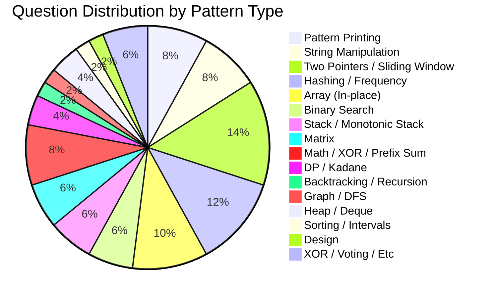
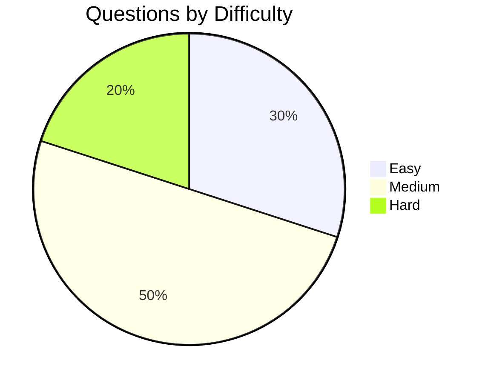
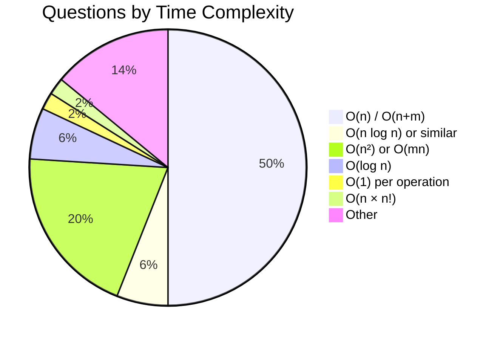

# Infosys Coding Interview Preparation

> **Company Profile:** Infosys is an Indian multinational information technology company that provides business consulting, information technology, and outsourcing services. One of the Big 4 Indian IT companies.

---

## Table of Contents
1. [Company Overview](#company-overview)
2. [50 Coding Questions](#50-coding-questions)
   - [Questions 1-10: Easy](#questions-1-10-easy)
   - [Questions 11-20: Easy-Medium](#questions-11-20-easy-medium)
   - [Questions 21-30: Medium](#questions-21-30-medium)
   - [Questions 31-40: Medium-Hard](#questions-31-40-medium-hard)
   - [Questions 41-50: Hard](#questions-41-50-hard)
3. [Pattern Summaries](#pattern-summaries)
4. [Complete Revision](#complete-revision)
5. [Infosys-Specific Insights](#infosys-specific-insights)

---

## Company Overview

| Aspect | Details |
|--------|---------|
| **Interview Process** | Infosys Online Assessment → Technical Round → HR Round |
| **Difficulty** | Easy to Medium (fundamentals-focused) |
| **Coding Round Pattern** | 2-3 coding questions in 60-90 minutes |
| **Duration** | 60-90 minutes |
| **Platform** | InfyTQ / HackerRank |
| **Key Focus** | Clean code, basic DSA, problem-solving approach |

### Infosys Frequently Asked Patterns
- Pattern printing (star patterns, number patterns)
- String manipulation (reverse, palindrome, count)
- Array problems (sort, search, rearrange)
- Basic number theory (prime, Fibonacci, factorial)
- Matrix problems
- Frequency-based problems
- Subarray/substring problems

---

## 50 Coding Questions

---

### Questions 1-10: Easy

---

#### Q1. Star Pattern – Right-Angled Triangle

**Problem Statement:** Print a right-angled triangle pattern of stars with `n` rows.

**Difficulty:** Easy

**Pattern:** Pattern Printing

**Companies Asked:** Infosys, TCS, Wipro

**Concepts Needed:** Nested loops, string concatenation

**Constraints:** 1 ≤ n ≤ 100

**Approach 1 (Brute Force):** Use two nested loops — outer for rows, inner for columns. Print `*` for each column up to row number.

**Approach 2 (Optimized):** Use string multiplication — `'*' * i` for each row.

```python
def print_star_triangle(n: int) -> None:
    for i in range(1, n + 1):
        print('*' * i)
```

**Dry Run (n=5):**
```
Row 1: '*' * 1 = *
Row 2: '*' * 2 = **
Row 3: '*' * 3 = ***
Row 4: '*' * 4 = ****
Row 5: '*' * 5 = *****
```

**Complexity:**
- Time: O(n²) — printing n² characters
- Space: O(1)

**Common Mistakes:**
1. Starting from i=0 instead of i=1, printing empty first row
2. Using `print()` with `end=''` but forgetting final newline

**Edge Cases:**
1. n = 1 → just `*`
2. n large (near 100) → ensure no trailing spaces

**Variations:**
- Inverted triangle, Mirrored triangle, Diamond pattern

**Follow-up Questions:**
1. Print the pattern in reverse order
2. Print a hollow version

**Interview Tips:** Infosys often starts with pattern problems to test loop fundamentals.

**Expected Output (n=5):**
```
*
**
***
****
*****
```

**Quick Revision Notes:**
- Outer loop = rows, inner loop = columns
- `'*' * i` creates i stars in one expression
- Always align row count with input n

---

#### Q2. Star Pattern – Pyramid

**Problem Statement:** Print a centered pyramid pattern of stars with `n` rows.

**Difficulty:** Easy

**Pattern:** Pattern Printing

**Companies Asked:** Infosys, Accenture, Cognizant

**Concepts Needed:** Nested loops, spacing logic

**Constraints:** 1 ≤ n ≤ 100

**Approach 1 (Brute Force):** Calculate spaces as `n - i - 1` and stars as `2 * i + 1`.

**Approach 2 (Optimized):** Use `center()` method.

```python
def print_pyramid(n: int) -> None:
    for i in range(n):
        stars = '*' * (2 * i + 1)
        print(stars.center(2 * n - 1))
```

**Dry Run (n=5):**
```
Row 0: 1 star,  spaces=4 → "    *    "
Row 1: 3 stars, spaces=3 → "   ***   "
Row 2: 5 stars, spaces=2 → "  *****  "
Row 3: 7 stars, spaces=1 → " ******* "
Row 4: 9 stars, spaces=0 → "*********"
```

**Complexity:**
- Time: O(n²)
- Space: O(n) for string building

**Common Mistakes:**
1. Off-by-one in star count: 2*i+1, not 2*i-1
2. Forgetting total width is 2*n-1 characters

**Edge Cases:**
1. n = 1 → single star centered
2. n = 0 → no output (handle gracefully)

**Variations:**
- Hollow pyramid, Number pyramid, Diamond

**Follow-up Questions:**
1. Print an inverted pyramid
2. Print a diamond

**Interview Tips:** Understanding the space-star relationship is key. Total width = 2n-1.

**Expected Output (n=5):**
```
    *
   ***
  *****
 *******
*********
```

**Quick Revision Notes:**
- Stars per row: `2*i + 1`
- Total width: `2*n - 1`
- Use `center()` for quick alignment

---

#### Q3. Number Pattern – Floyd's Triangle

**Problem Statement:** Print Floyd's Triangle for `n` rows. Floyd's Triangle has consecutive numbers filling each row.

**Difficulty:** Easy

**Pattern:** Pattern Printing

**Companies Asked:** Infosys, Wipro, HCL

**Concepts Needed:** Nested loops, counter variable

**Constraints:** 1 ≤ n ≤ 50

**Approach 1 (Brute Force):** Maintain a counter starting at 1. For each row, print `i` numbers.

```python
def floyd_triangle(n: int) -> None:
    num = 1
    for i in range(1, n + 1):
        row = ' '.join(str(num + j) for j in range(i))
        print(row)
        num += i
```

**Dry Run (n=5):**
```
Row 1: i=1 → print 1 number starting at 1 → "1"           num becomes 2
Row 2: i=2 → print 2 numbers starting at 2 → "2 3"        num becomes 4
Row 3: i=3 → print 3 numbers starting at 4 → "4 5 6"      num becomes 7
Row 4: i=4 → print 4 numbers starting at 7 → "7 8 9 10"   num becomes 11
Row 5: i=5 → print 5 numbers starting at 11 → "11 12 13 14 15"
```

**Complexity:**
- Time: O(n²)
- Space: O(n)

**Common Mistakes:**
1. Resetting num for each row instead of carrying forward
2. Printing spaces incorrectly (use join for clean output)

**Edge Cases:**
1. n = 1 → "1"
2. n large → Python handles big ints fine

**Variations:**
- Pascal's Triangle, Reverse Floyd's, Character-based triangle

**Interview Tips:** A classic Infosys pattern question. Shows understanding of counter management.

**Expected Output (n=5):**
```
1
2 3
4 5 6
7 8 9 10
11 12 13 14 15
```

**Quick Revision Notes:**
- Counter persists across rows
- Row i has exactly i numbers
- Update counter by adding i after each row

---

#### Q4. Check Palindrome String

**Problem Statement:** Given a string `s`, determine if it is a palindrome (reads the same forwards and backwards). Ignore case and non-alphanumeric characters.

**Difficulty:** Easy

**Pattern:** String Manipulation, Two Pointers

**Companies Asked:** Infosys, TCS, Google, Amazon

**Concepts Needed:** String traversal, two-pointer technique

**Constraints:** 1 ≤ len(s) ≤ 10⁵

**Approach 1 (Brute Force):** Reverse the filtered string and compare.

```python
def is_palindrome_brute(s: str) -> bool:
    filtered = ''.join(c.lower() for c in s if c.isalnum())
    return filtered == filtered[::-1]
```

**Approach 2 (Optimized — Two Pointers):**

```python
def is_palindrome(s: str) -> bool:
    left, right = 0, len(s) - 1
    while left < right:
        while left < right and not s[left].isalnum():
            left += 1
        while left < right and not s[right].isalnum():
            right -= 1
        if s[left].lower() != s[right].lower():
            return False
        left += 1
        right -= 1
    return True
```

**Dry Run (s = "A man, a plan, a canal: Panama"):**
```
Initial: left=0('A'), right=29('a')
Skip non-alnum: left=0('A'), right=29('a')
Compare: 'a' == 'a' OK → left=1, right=28
Skip non-alnum: left=2('m'), right=27('m')
Compare: 'm' == 'm' OK → left=3, right=26
... continues until pointers cross ...
Result: True
```

**Complexity:**
- Time: O(n)
- Space: O(1) for two-pointer; O(n) for brute force

**Common Mistakes:**
1. Not handling case sensitivity
2. Forgetting to skip non-alphanumeric characters

**Edge Cases:**
1. Empty string → True
2. Single character → True
3. String with only special characters → True

**Variations:**
- Check if a number is palindrome
- Longest palindromic substring

**Expected Output:**
- `is_palindrome("A man, a plan, a canal: Panama")` → `True`
- `is_palindrome("race a car")` → `False`

**Quick Revision Notes:**
- Two pointers from both ends
- Use `.isalnum()` to filter
- Convert to same case before comparing

---

#### Q5. Find First Non-Repeating Character

**Problem Statement:** Given a string `s`, find the first non-repeating character and return its index. If not found, return -1.

**Difficulty:** Easy

**Pattern:** Frequency Counting, Hashing

**Companies Asked:** Infosys, Amazon, Microsoft, Google

**Concepts Needed:** Hash map (dictionary), string traversal

**Constraints:** 1 ≤ len(s) ≤ 10⁵, s contains only lowercase English letters.

**Approach 1 (Brute Force):** For each character, check if it appears elsewhere. O(n²).

**Approach 2 (Optimized — Hash Map):**

```python
from collections import Counter

def first_uniq_char(s: str) -> int:
    freq = Counter(s)
    for i, ch in enumerate(s):
        if freq[ch] == 1:
            return i
    return -1
```

**Dry Run (s = "infosys"):**
```
Count frequencies:
i:2, n:1, f:1, o:1, s:2, y:1
Index traversal:
i=0, ch='i', freq=2 → skip
i=1, ch='n', freq=1 → return 1
```

**Complexity:**
- Time: O(n)
- Space: O(1) — at most 26 characters

**Common Mistakes:**
1. Using `s.count()` inside loop → O(n²)
2. Returning character instead of index

**Edge Cases:**
1. Empty string → -1
2. All characters repeat → -1
3. Single character → 0

**Variations:**
- First non-repeating in a stream
- Find first repeating character

**Expected Output:**
- `first_uniq_char("infosys")` → `1` (character 'n')
- `first_uniq_char("aabb")` → `-1`

**Quick Revision Notes:**
- Count frequencies first
- Iterate original order to find first unique
- `Counter` is O(n) for construction

---

#### Q6. Move All Zeroes to End

**Problem Statement:** Given an integer array `nums`, move all 0's to the end while maintaining the relative order of non-zero elements.

**Difficulty:** Easy

**Pattern:** Array, Two Pointers

**Companies Asked:** Infosys, Amazon, Microsoft, Facebook

**Concepts Needed:** In-place array manipulation, two-pointer technique

**Constraints:** 1 ≤ len(nums) ≤ 10⁴, -10⁵ ≤ nums[i] ≤ 10⁵

**Approach 1 (Brute Force):** Create a new array with non-zero elements followed by zeroes. Uses O(n) extra space.

**Approach 2 (Optimized — Two Pointers):**

```python
from typing import List

def move_zeroes(nums: List[int]) -> None:
    pos = 0
    for i in range(len(nums)):
        if nums[i] != 0:
            nums[pos], nums[i] = nums[i], nums[pos]
            pos += 1
```

**Dry Run (nums = [0, 1, 0, 3, 12]):**
```
Initial: pos=0
i=0: nums[0]=0 → skip
i=1: nums[1]=1 → swap(0,1) → [1,0,0,3,12], pos=1
i=2: nums[2]=0 → skip
i=3: nums[3]=3 → swap(1,3) → [1,3,0,0,12], pos=2
i=4: nums[4]=12 → swap(2,4) → [1,3,12,0,0], pos=3
Result: [1, 3, 12, 0, 0]
```

**Complexity:**
- Time: O(n)
- Space: O(1)

**Common Mistakes:**
1. Using extra array (defeats in-place requirement)
2. Not maintaining relative order of non-zero elements

**Edge Cases:**
1. All zeroes → no change
2. No zeroes → no change
3. Single element → no change

**Variations:**
- Move all zeroes to front
- Segregate even and odd numbers

**Expected Output:**
- `move_zeroes([0, 1, 0, 3, 12])` → `[1, 3, 12, 0, 0]`

**Quick Revision Notes:**
- `pos` tracks insertion point for non-zero elements
- Swap, don't overwrite
- Maintains relative order automatically

---

#### Q7. Find Leaders in an Array

**Problem Statement:** An element is a leader if it is greater than all elements to its right. Find all leaders in an array.

**Difficulty:** Easy

**Pattern:** Array, Traversal

**Companies Asked:** Infosys, TCS, Wipro, Goldman Sachs

**Concepts Needed:** Array traversal, right-to-left scanning

**Constraints:** 1 ≤ len(arr) ≤ 10⁵, -10⁹ ≤ arr[i] ≤ 10⁹

**Approach 1 (Brute Force):** For each element, check all elements to its right. O(n²).

**Approach 2 (Optimized — Right-to-Left Scan):**

```python
from typing import List

def find_leaders(arr: List[int]) -> List[int]:
    n = len(arr)
    leaders = []
    max_from_right = float('-inf')
    for i in range(n - 1, -1, -1):
        if arr[i] > max_from_right:
            leaders.append(arr[i])
            max_from_right = arr[i]
    return leaders[::-1]
```

**Dry Run (arr = [16, 17, 4, 3, 5, 2]):**
```
Traverse right-to-left:
i=5: arr[5]=2, max=-inf → 2 > -inf → leader, max=2
i=4: arr[4]=5, max=2   → 5 > 2 → leader, max=5
i=3: arr[3]=3, max=5   → 3 > 5? No
i=2: arr[2]=4, max=5   → 4 > 5? No
i=1: arr[1]=17, max=5  → 17 > 5 → leader, max=17
i=0: arr[0]=16, max=17 → 16 > 17? No
Leaders (right-to-left): [2, 5, 17]
Reversed: [17, 5, 2]
```

**Complexity:**
- Time: O(n)
- Space: O(n) for output, O(1) auxiliary

**Common Mistakes:**
1. Forgetting to reverse the result
2. Using >= instead of > (strictly greater)

**Edge Cases:**
1. Single element → that element is a leader
2. Decreasing order → all elements are leaders
3. Increasing order → only last element is leader

**Variations:**
- Find leaders with equal elements allowed
- Count number of leaders

**Expected Output:**
- `find_leaders([16, 17, 4, 3, 5, 2])` → `[17, 5, 2]`

**Quick Revision Notes:**
- Scan from right to left
- Track running maximum
- Remember to reverse the output list

---

#### Q8. Check if Array is Sorted and Rotated

**Problem Statement:** Given an array `nums`, check if it was originally sorted in non-decreasing order and then rotated.

**Difficulty:** Easy

**Pattern:** Array, Rotation Detection

**Companies Asked:** Infosys, Amazon, Microsoft

**Concepts Needed:** Array traversal, count inversions

**Constraints:** 1 ≤ len(nums) ≤ 10⁵, -10⁵ ≤ nums[i] ≤ 10⁵

**Approach 1 (Brute Force):** Try all rotations. O(n²).

**Approach 2 (Optimized — Count Breaks):**

```python
from typing import List

def check_sorted_rotated(nums: List[int]) -> bool:
    n = len(nums)
    breaks = 0
    for i in range(n):
        if nums[i] > nums[(i + 1) % n]:
            breaks += 1
        if breaks > 1:
            return False
    return True
```

**Dry Run (nums = [3, 4, 5, 1, 2]):**
```
i=0: nums[0]=3, nums[1]=4 → 3>4? No
i=1: nums[1]=4, nums[2]=5 → 4>5? No
i=2: nums[2]=5, nums[3]=1 → 5>1? Yes → breaks=1
i=3: nums[3]=1, nums[4]=2 → 1>2? No
i=4: nums[4]=2, nums[0]=3 → 2>3? No
breaks=1 ≤ 1 → True
```

**Complexity:**
- Time: O(n)
- Space: O(1)

**Common Mistakes:**
1. Not checking wrap-around (last element with first)
2. Counting breaks incorrectly for sorted array (0 breaks → True)

**Edge Cases:**
1. Already sorted → True
2. Single element → True
3. All elements equal → True

**Variations:**
- Find the rotation count
- Search in sorted rotated array

**Expected Output:**
- `check_sorted_rotated([3, 4, 5, 1, 2])` → `True`
- `check_sorted_rotated([2, 1, 3, 4])` → `False`

**Quick Revision Notes:**
- Count positions where `nums[i] > nums[i+1]`
- Sorted rotated arrays have ≤ 1 break
- Use modulo for circular comparison

---

#### Q9. Find Duplicate in Array

**Problem Statement:** Given an array of `n + 1` integers where each integer is in `[1, n]`, there is exactly one duplicate. Find it.

**Difficulty:** Easy

**Pattern:** Array, Floyd's Cycle Detection

**Companies Asked:** Infosys, Amazon, Microsoft, Google, Apple

**Concepts Needed:** Cycle detection, two pointers

**Constraints:** 1 ≤ n ≤ 10⁵, nums.length = n + 1, 1 ≤ nums[i] ≤ n

**Approach 1 (Brute Force):** Nested loops. O(n²).

**Approach 2 (Hash Set):**

```python
from typing import List

def find_duplicate_set(nums: List[int]) -> int:
    seen = set()
    for num in nums:
        if num in seen:
            return num
        seen.add(num)
    return -1
```

**Approach 3 (Floyd's Cycle Detection):**

```python
from typing import List

def find_duplicate(nums: List[int]) -> int:
    slow = nums[0]
    fast = nums[0]
    while True:
        slow = nums[slow]
        fast = nums[nums[fast]]
        if slow == fast:
            break
    slow = nums[0]
    while slow != fast:
        slow = nums[slow]
        fast = nums[fast]
    return slow
```

**Dry Run (nums = [1, 3, 4, 2, 2]):**
```
Phase 1 — Find intersection:
slow=nums[0]=1, fast=nums[0]=1
slow=nums[1]=3, fast=nums[nums[1]]=nums[3]=2
slow=nums[3]=2, fast=nums[nums[2]]=nums[4]=2
slow=2, fast=2 → intersection at 2
Phase 2 — Find cycle entry:
slow=1, fast=2
slow=nums[1]=3, fast=nums[2]=4
slow=nums[3]=2, fast=nums[4]=2
slow=2, fast=2 → return 2
```

**Complexity:**
- Time: O(n)
- Space: O(1) for Floyd's; O(n) for hash set

**Common Mistakes:**
1. Modifying the original array
2. Using sort (modifies array, O(n log n))

**Edge Cases:**
1. n = 1, nums = [1, 1] → 1
2. Multiple duplicates? Problem guarantees exactly one

**Variations:**
- Find all duplicates
- Find missing number

**Expected Output:**
- `find_duplicate([1, 3, 4, 2, 2])` → `2`

**Quick Revision Notes:**
- Values as links: `nums[nums[i]]` creates a cycle
- Two phases: detect meeting → find cycle start
- O(1) space without modifying array

---

#### Q10. Intersection of Two Arrays

**Problem Statement:** Given two integer arrays `nums1` and `nums2`, return an array of their intersection. Each element in the result must be unique.

**Difficulty:** Easy

**Pattern:** Hashing, Set Theory

**Companies Asked:** Infosys, Amazon, Google, Facebook

**Concepts Needed:** Sets, hash lookup

**Constraints:** 1 ≤ len(nums1), len(nums2) ≤ 10³, -10⁵ ≤ nums[i] ≤ 10⁵

**Approach 1 (Brute Force):** For each element in nums1, check if it exists in nums2. O(n × m).

**Approach 2 (Optimized — Sets):**

```python
from typing import List

def intersection(nums1: List[int], nums2: List[int]) -> List[int]:
    return list(set(nums1) & set(nums2))
```

**Dry Run (nums1 = [1, 2, 2, 1], nums2 = [2, 2]):**
```
set(nums1) = {1, 2}
set(nums2) = {2}
Intersection = {2}
Result = [2]
```

**Complexity:**
- Time: O(n + m)
- Space: O(n + m)

**Common Mistakes:**
1. Not removing duplicates (should use sets)
2. Returning duplicates that appear in both arrays

**Edge Cases:**
1. No intersection → empty list
2. One array empty → empty list

**Variations:**
- Intersection with duplicates (return all occurrences)
- Intersection of sorted arrays (two pointers)

**Expected Output:**
- `intersection([1, 2, 2, 1], [2, 2])` → `[2]`
- `intersection([4, 9, 5], [9, 4, 9, 8, 4])` → `[9, 4]`

**Quick Revision Notes:**
- Set intersection `&` operator
- `list()` to convert back
- O(n+m) time with sets

---

### Q1-Q10: Pattern Summary

| Pattern | Count | Questions |
|---------|-------|-----------|
| Pattern Printing | 3 | Q1, Q2, Q3 |
| String Manipulation | 2 | Q4, Q5 |
| Array Two Pointers | 2 | Q6, Q7 |
| Array Rotation | 1 | Q8 |
| Cycle Detection | 1 | Q9 |
| Hashing / Sets | 1 | Q10 |

### Revision Table

| Q# | Question | Time | Space | Key Technique |
|:--:|----------|:----:|:-----:|--------------|
| 1 | Star Triangle | O(n²) | O(1) | String multiplication |
| 2 | Pyramid | O(n²) | O(n) | center() method |
| 3 | Floyd's Triangle | O(n²) | O(n) | Counter variable |
| 4 | Palindrome | O(n) | O(1) | Two pointers, isalnum() |
| 5 | First Non-Repeating | O(n) | O(1) | Counter hash map |
| 6 | Move Zeroes | O(n) | O(1) | Two-pointer swap |
| 7 | Leaders in Array | O(n) | O(1) | Right-to-left scan |
| 8 | Sorted & Rotated | O(n) | O(1) | Count breaks |
| 9 | Find Duplicate | O(n) | O(1) | Floyd's cycle detection |
| 10 | Intersection | O(n+m) | O(n+m) | Set intersection |

### Important Observations
- Infosys loves pattern printing as warm-up questions
- String problems test fundamental traversal and two-pointer skills
- Array problems focus on in-place manipulation
- Hash-based solutions are expected for frequency problems


### Questions 11-20: Easy-Medium

---

#### Q11. Valid Parentheses

**Problem Statement:** Given a string `s` containing just `(`, `)`, `{`, `}`, `[`, `]`, determine if the input string is valid.

**Difficulty:** Easy

**Pattern:** Stack, String Parsing

**Companies Asked:** Infosys, Amazon, Microsoft, Google, Facebook

**Concepts Needed:** Stack data structure, bracket matching

**Constraints:** 1 ≤ len(s) ≤ 10⁴

**Approach 1 (Brute Force):** Repeatedly replace `()`, `{}`, `[]` with empty string.

**Approach 2 (Optimized — Stack):**

```python
def is_valid(s: str) -> bool:
    stack = []
    mapping = {')': '(', '}': '{', ']': '['}
    for char in s:
        if char in mapping:
            if not stack or stack.pop() != mapping[char]:
                return False
        else:
            stack.append(char)
    return not stack
```

**Dry Run (s = "({[]})"):**
```
char='(' → push → stack=['(']
char='{' → push → stack=['(', '{']
char='[' → push → stack=['(', '{', '[']
char=']' → pop → top='[' == mapping[']']='[' OK → stack=['(', '{']
char='}' → pop → top='{' == mapping['}']='{' OK → stack=['(']
char=')' → pop → top='(' == mapping[')']='(' OK → stack=[]
Stack empty → True
```

**Dry Run (s = "([)]"):**
```
char='(' → push →
char='[' → push →
char=')' → pop → top='[' != mapping[')']='(' → False
```

**Complexity:** Time: O(n), Space: O(n)

**Common Mistakes:**
1. Checking stack before popping (IndexError)
2. Confusing mapping direction (close → open)

**Edge Cases:**
1. Empty string → True
2. Only opening brackets → False
3. Only closing brackets → False

**Variations:**
- Generate all valid parentheses combinations
- Longest valid parentheses substring

**Expected Output:**
- `is_valid("({[]})")` → `True`
- `is_valid("([)]")` → `False`

**Quick Revision Notes:**
- Push opening brackets, pop and match on closing
- Use mapping dict for clean code
- Final stack must be empty

---

#### Q12. Maximum Subarray Sum (Kadane's Algorithm)

**Problem Statement:** Find the contiguous subarray with the largest sum and return its sum.

**Difficulty:** Medium

**Pattern:** Dynamic Programming, Prefix Sum

**Companies Asked:** Infosys, Amazon, Microsoft, Google, Apple

**Concepts Needed:** Kadane's algorithm, DP

**Constraints:** 1 ≤ len(nums) ≤ 10⁵, -10⁴ ≤ nums[i] ≤ 10⁴

**Approach 1 (Brute Force):** Check all possible subarrays. O(n²).

**Approach 2 (Kadane's Algorithm):**

```python
from typing import List

def max_subarray_sum(nums: List[int]) -> int:
    max_ending_here = max_so_far = nums[0]
    for num in nums[1:]:
        max_ending_here = max(num, max_ending_here + num)
        max_so_far = max(max_so_far, max_ending_here)
    return max_so_far
```

**Dry Run (nums = [-2, 1, -3, 4, -1, 2, 1, -5, 4]):**
```
i=0: meh=-2, msf=-2
i=1: meh=max(-1,1)=1, msf=max(-2,1)=1
i=2: meh=max(-2,-3)=-2, msf=max(1,-2)=1
i=3: meh=max(2,4)=4, msf=max(1,4)=4
i=4: meh=max(3,-1)=3, msf=max(4,3)=4
i=5: meh=max(5,2)=5, msf=max(4,5)=5
i=6: meh=max(6,1)=6, msf=max(5,6)=6
i=7: meh=max(1,-5)=1, msf=max(6,1)=6
i=8: meh=max(5,4)=5, msf=max(6,5)=6
Result: 6 (subarray [4, -1, 2, 1])
```

**Complexity:** Time: O(n), Space: O(1)

**Common Mistakes:**
1. Resetting max_ending_here to 0 when negative
2. Not handling arrays with all negative numbers

**Edge Cases:**
1. Single element → return that element
2. All negative → return largest (closest to zero)

**Variations:**
- Maximum product subarray
- Maximum sum circular subarray

**Expected Output:**
- `max_subarray_sum([-2,1,-3,4,-1,2,1,-5,4])` → `6`

**Quick Revision Notes:**
- Decision at each step: extend or start fresh
- `meh = max(num, meh + num)`
- Track global maximum separately

---

#### Q13. Next Greater Element I

**Problem Statement:** Find the next greater element for each element in nums1 from nums2.

**Difficulty:** Medium

**Pattern:** Stack, Monotonic Stack

**Companies Asked:** Infosys, Amazon, Microsoft, Google

**Concepts Needed:** Stack, hash map

**Constraints:** 1 ≤ len(nums2) ≤ 10⁴

**Approach (Monotonic Stack):**

```python
from typing import List

def next_greater_element(nums1: List[int], nums2: List[int]) -> List[int]:
    stack = []
    nge = {}
    for num in reversed(nums2):
        while stack and stack[-1] <= num:
            stack.pop()
        nge[num] = stack[-1] if stack else -1
        stack.append(num)
    return [nge[num] for num in nums1]
```

**Dry Run (nums1 = [4, 1, 2], nums2 = [1, 3, 4, 2]):**
```
num=2: stack=[] → nge[2]=-1, push 2 → stack=[2]
num=4: 2<=4 → pop, stack=[] → nge[4]=-1, push 4
num=3: 4>3 → nge[3]=4, push 3 → stack=[4,3]
num=1: 3>1 → nge[1]=3, push 1 → stack=[4,3,1]
Result: nge[4]=-1, nge[1]=3, nge[2]=-1 → [-1, 3, -1]
```

**Complexity:** Time: O(n+m), Space: O(n+m)

**Common Mistakes:**
1. Using `<=` instead of `<`
2. Traversing left-to-right instead of right-to-left

**Edge Cases:**
1. Decreasing array → -1 for all
2. Increasing array → next element is answer

**Expected Output:**
- `next_greater_element([4,1,2], [1,3,4,2])` → `[-1, 3, -1]`

**Quick Revision Notes:**
- Traverse right-to-left
- Maintain decreasing stack
- Map each element to its NGE

---

#### Q14. Reverse Words in a String

**Problem Statement:** Reverse the order of words in a string.

**Difficulty:** Easy

**Pattern:** String Manipulation

**Companies Asked:** Infosys, Amazon, Microsoft, Apple

**Constraints:** 1 ≤ len(s) ≤ 10⁴

```python
def reverse_words(s: str) -> str:
    return ' '.join(reversed(s.split()))
```

**Dry Run (s = "  Hello   World  Python  "):**
```
s.split() → ['Hello', 'World', 'Python']
reversed → ['Python', 'World', 'Hello']
join → "Python World Hello"
```

**Complexity:** Time: O(n), Space: O(n)

**Common Mistakes:**
1. Using `s.split(' ')` instead of `s.split()`
2. Forgetting leading/trailing spaces

**Expected Output:**
- `reverse_words("  Hello   World  Python  ")` → `"Python World Hello"`

**Quick Revision Notes:**
- `s.split()` handles multiple spaces
- `reversed()` or slicing for reversal
- `' '.join()` to reconstruct

---

#### Q15. Check for Anagram

**Problem Statement:** Given two strings, return True if one is an anagram of the other.

**Difficulty:** Easy

**Pattern:** Hashing, Sorting

**Companies Asked:** Infosys, Amazon, Google

**Constraints:** 1 ≤ len(s) ≤ 5 × 10⁴

```python
from collections import Counter

def is_anagram(s: str, t: str) -> bool:
    return Counter(s) == Counter(t)
```

**Dry Run (s = "anagram", t = "nagaram"):**
```
Counter('anagram') = {'a':3, 'n':1, 'g':1, 'r':1, 'm':1}
Counter('nagaram') = {'n':1, 'a':3, 'g':1, 'r':1, 'm':1}
Counters equal → True
```

**Complexity:** Time: O(n), Space: O(1)

**Common Mistakes:**
1. Not checking length first
2. Using `count()` in a loop → O(n²)

**Variations:**
- Find all anagrams in a string
- Group anagrams

**Expected Output:**
- `is_anagram("anagram", "nagaram")` → `True`

---

#### Q16. Count Frequency of Each Element

**Problem Statement:** Count frequency of each distinct element in an array.

**Difficulty:** Easy

**Pattern:** Hashing

**Companies Asked:** Infosys, TCS, Wipro

**Constraints:** 1 ≤ len(arr) ≤ 10⁵

```python
from typing import List, Dict
from collections import Counter

def count_frequency(arr: List[int]) -> Dict[int, int]:
    return dict(sorted(Counter(arr).items()))
```

**Dry Run (arr = [4, 2, 4, 1, 2, 3, 1, 1]):**
```
Counter = {4:2, 2:2, 1:3, 3:1}
Sorted: {1:3, 2:2, 3:1, 4:2}
```

**Complexity:** Time: O(n log n) for sort, Space: O(n)

**Quick Revision Notes:**
- `Counter` for frequency
- Sorting is optional depending on requirements

---

#### Q17. Find Missing Number in Array

**Problem Statement:** Given array containing n distinct numbers from `0, 1, ..., n`, find the missing one.

**Difficulty:** Easy

**Pattern:** Array, XOR, Math

**Companies Asked:** Infosys, Amazon, Microsoft

**Constraints:** 1 ≤ n ≤ 10⁵

```python
from typing import List

def missing_number(nums: List[int]) -> int:
    xor_val = 0
    for i, num in enumerate(nums):
        xor_val ^= i ^ num
    return xor_val ^ len(nums)
```

**Dry Run (nums = [3, 0, 1]):**
```
xor=0
i=0, num=3: xor = 0 ^ 0 ^ 3 = 3
i=1, num=0: xor = 3 ^ 1 ^ 0 = 2
i=2, num=1: xor = 2 ^ 2 ^ 1 = 1
Final: xor ^ 3 = 1 ^ 3 = 2 ✓
```

**Complexity:** Time: O(n), Space: O(1)

**Common Mistakes:**
1. Off-by-one in expected sum formula
2. Integer overflow (not in Python, but mention)

**Variations:**
- Find all missing numbers
- Find missing and repeating (Q36)

**Expected Output:**
- `missing_number([3, 0, 1])` → `2`

---

#### Q18. Find All Duplicates in an Array

**Problem Statement:** Find all elements that appear twice (values 1 ≤ a[i] ≤ n).

**Difficulty:** Medium

**Pattern:** Array, Hashing

**Companies Asked:** Infosys, Amazon, Microsoft

```python
from typing import List

def find_duplicates(nums: List[int]) -> List[int]:
    result = []
    for num in nums:
        idx = abs(num) - 1
        if nums[idx] < 0:
            result.append(abs(num))
        else:
            nums[idx] = -nums[idx]
    return result
```

**Dry Run (nums = [4, 3, 2, 7, 8, 2, 3, 1]):**
```
num=4 → idx=3, nums[3]=7>0 → mark nums[3]=-7
num=3 → idx=2, nums[2]=2>0 → mark nums[2]=-2
num=2 → idx=1, nums[1]=3>0 → mark nums[1]=-3
num=7 → idx=6, nums[6]=3>0 → mark nums[6]=-3
num=8 → idx=7, nums[7]=1>0 → mark nums[7]=-1
num=2 → idx=1, nums[1]=-3<0 → duplicate 2
num=3 → idx=2, nums[2]=-2<0 → duplicate 3
num=1 → idx=0, nums[0]=4>0 → mark nums[0]=-4
Result: [2, 3]
```

**Complexity:** Time: O(n), Space: O(1)

**Quick Revision Notes:**
- Use values as indices (adjust by 1)
- Negative marking to track visited
- Revisit a negative value → duplicate

---

#### Q19. Find Pair with Given Sum (Two Sum)

**Problem Statement:** Return indices of two numbers that add up to target.

**Difficulty:** Easy

**Pattern:** Hashing, Array

**Companies Asked:** Infosys, Amazon, Google, Microsoft, Apple

```python
from typing import List

def two_sum(nums: List[int], target: int) -> List[int]:
    seen = {}
    for i, num in enumerate(nums):
        complement = target - num
        if complement in seen:
            return [seen[complement], i]
        seen[num] = i
    return []
```

**Dry Run (nums = [2, 7, 11, 15], target = 9):**
```
i=0, num=2 → complement=7, not in seen → seen={2:0}
i=1, num=7 → complement=2, in seen! → return [0, 1]
```

**Complexity:** Time: O(n), Space: O(n)

**Quick Revision Notes:**
- Store num → index in hash map
- Check complement before inserting current
- One pass, O(n) time

---

#### Q20. Best Time to Buy and Sell Stock

**Problem Statement:** Maximize profit by buying low and selling high (single transaction).

**Difficulty:** Easy

**Pattern:** Array, Sliding Window

**Companies Asked:** Infosys, Amazon, Microsoft, Google

```python
from typing import List

def max_profit(prices: List[int]) -> int:
    min_price = float('inf')
    max_profit = 0
    for price in prices:
        if price < min_price:
            min_price = price
        elif price - min_price > max_profit:
            max_profit = price - min_price
    return max_profit
```

**Dry Run (prices = [7, 1, 5, 3, 6, 4]):**
```
price=7: min=7, profit=0
price=1: min=1, profit=0
price=5: min=1, profit=4
price=3: min=1, profit=4
price=6: min=1, profit=5
price=4: min=1, profit=5
Result: 5 (buy at 1, sell at 6)
```

**Complexity:** Time: O(n), Space: O(1)

**Quick Revision Notes:**
- Track min price seen
- Calculate profit at each step
- If no profit possible, return 0

---

### Q11-Q20: Pattern Summary

| Pattern | Count | Questions |
|---------|-------|-----------|
| Stack | 2 | Q11, Q13 |
| DP / Kadane | 1 | Q12 |
| String Manipulation | 1 | Q14 |
| Hashing / Frequency | 3 | Q15, Q16, Q19 |
| Array / Negative Marking | 2 | Q17, Q18 |
| Min Tracking | 1 | Q20 |

### Revision Table

| Q# | Question | Time | Space | Key Technique |
|:--:|----------|:----:|:-----:|--------------|
| 11 | Valid Parentheses | O(n) | O(n) | Stack with mapping |
| 12 | Max Subarray Sum | O(n) | O(1) | Kadane's algorithm |
| 13 | Next Greater Element | O(n) | O(n) | Monotonic stack |
| 14 | Reverse Words | O(n) | O(n) | Split, reverse, join |
| 15 | Anagram Check | O(n) | O(1) | Counter comparison |
| 16 | Frequency Count | O(n) | O(n) | dict.get() pattern |
| 17 | Missing Number | O(n) | O(1) | XOR / sum formula |
| 18 | Find Duplicates | O(n) | O(1) | Negative marking |
| 19 | Two Sum | O(n) | O(n) | Hash map lookup |
| 20 | Stock Profit | O(n) | O(1) | Track min price |

### Important Observations
- Stack-based problems appear frequently for bracket matching and NGE
- Kadane's algorithm is a must-know for Infosys
- Hash map-based solutions dominate frequency and pair problems
- In-place array manipulation is a recurring theme

---

### Questions 21-30: Medium

---

#### Q21. Longest Substring Without Repeating Characters

**Problem Statement:** Find the length of the longest substring without repeating characters.

**Difficulty:** Medium

**Pattern:** Sliding Window, Two Pointers

**Companies Asked:** Infosys, Amazon, Microsoft, Google

**Constraints:** 0 ≤ len(s) ≤ 5 × 10⁴

```python
def length_of_longest_substring(s: str) -> int:
    char_set = set()
    left = max_len = 0
    for right in range(len(s)):
        while s[right] in char_set:
            char_set.remove(s[left])
            left += 1
        char_set.add(s[right])
        max_len = max(max_len, right - left + 1)
    return max_len
```

**Dry Run (s = "abcabcbb"):**
```
left=0, r=0: add 'a' → set={'a'}, max=1
r=1: add 'b' → set={'a','b'}, max=2
r=2: add 'c' → set={'a','b','c'}, max=3
r=3: 'a' IN set → remove 'a'(l=0), l=1, add 'a' → set={'b','c','a'}, max=3
r=4: 'b' IN set → remove 'b'(l=1), l=2, add 'b' → max=3
r=5: 'c' IN set → remove 'c'(l=2), l=3, add 'c' → max=3
r=6: 'b' IN set → remove 'a'(l=3)→l=4, remove 'b'(l=4)→l=5, add 'b' → max=3
r=7: 'b' IN set → remove 'c'(l=5)→l=6, remove 'b'(l=6)→l=7, add 'b' → max=3
Result: 3 ("abc")
```

**Complexity:** Time: O(n), Space: O(min(m, n))

**Common Mistakes:**
1. Forgetting to remove from set when shrinking window
2. Off-by-one on window length (right - left + 1)

**Variations:**
- Longest substring with at most k distinct characters
- Longest substring with at least k repeating characters

**Expected Output:**
- `length_of_longest_substring("abcabcbb")` → `3`

**Quick Revision Notes:**
- Left and right pointers define the window
- Shrink from left when duplicate found
- Track max window size

---

#### Q22. Product of Array Except Self

**Problem Statement:** Return array where output[i] = product of all elements except nums[i]. No division.

**Difficulty:** Medium

**Pattern:** Array, Prefix/Suffix

**Companies Asked:** Infosys, Amazon, Microsoft, Google, Facebook

**Constraints:** 2 ≤ len(nums) ≤ 10⁵

```python
from typing import List

def product_except_self(nums: List[int]) -> List[int]:
    n = len(nums)
    output = [1] * n
    left_product = 1
    for i in range(n):
        output[i] = left_product
        left_product *= nums[i]
    right_product = 1
    for i in range(n - 1, -1, -1):
        output[i] *= right_product
        right_product *= nums[i]
    return output
```

**Dry Run (nums = [1, 2, 3, 4]):**
```
Left pass:
i=0: output[0]=1, left=1
i=1: output[1]=1, left=2
i=2: output[2]=2, left=6
i=3: output[3]=6, left=24 → output=[1,1,2,6]

Right pass:
i=3: output[3]=6*1=6, right=4
i=2: output[2]=2*4=8, right=12
i=1: output[1]=1*12=12, right=24
i=0: output[0]=1*24=24, right=24 → output=[24,12,8,6]
```

**Complexity:** Time: O(n), Space: O(1) extra

**Quick Revision Notes:**
- Left pass: prefix products
- Right pass: multiply by suffix products
- Two passes, no division needed

---

#### Q23. Find Minimum in Rotated Sorted Array

**Problem Statement:** Find minimum element in a rotated sorted array of unique elements.

**Difficulty:** Medium

**Pattern:** Binary Search

**Companies Asked:** Infosys, Amazon, Microsoft, Google

**Constraints:** 1 ≤ len(nums) ≤ 5000

```python
from typing import List

def find_min(nums: List[int]) -> int:
    left, right = 0, len(nums) - 1
    while left < right:
        mid = (left + right) // 2
        if nums[mid] > nums[right]:
            left = mid + 1
        else:
            right = mid
    return nums[left]
```

**Dry Run (nums = [3, 4, 5, 1, 2]):**
```
left=0, right=4, mid=2
nums[2]=5 > nums[4]=2 → left=3
left=3, right=4, mid=3
nums[3]=1 > nums[4]=2? No → right=3
left=3, right=3 → return nums[3]=1
```

**Complexity:** Time: O(log n), Space: O(1)

**Quick Revision Notes:**
- Compare mid with right element
- nums[mid] > nums[right] → search right half
- Otherwise search left half

---

#### Q24. Rotate Array by K Positions

**Problem Statement:** Rotate array to the right by k steps in-place.

**Difficulty:** Medium

**Pattern:** Array, Reversal Algorithm

**Companies Asked:** Infosys, Amazon, Microsoft

**Constraints:** 1 ≤ len(nums) ≤ 10⁵, 0 ≤ k ≤ 10⁵

```python
from typing import List

def rotate(nums: List[int], k: int) -> None:
    n = len(nums)
    k %= n
    def reverse(start: int, end: int) -> None:
        while start < end:
            nums[start], nums[end] = nums[end], nums[start]
            start += 1
            end -= 1
    reverse(0, n - 1)
    reverse(0, k - 1)
    reverse(k, n - 1)
```

**Dry Run (nums = [1, 2, 3, 4, 5, 6, 7], k = 3):**
```
k = 3 % 7 = 3
Step 1 — Reverse all: [7, 6, 5, 4, 3, 2, 1]
Step 2 — Reverse first 3: [5, 6, 7, 4, 3, 2, 1]
Step 3 — Reverse remaining: [5, 6, 7, 1, 2, 3, 4]
```

**Complexity:** Time: O(n), Space: O(1)

**Quick Revision Notes:**
- Reverse all, then first k, then remaining
- Use k %= n to handle k > n
- Three reversals → O(n) time, O(1) space

---

#### Q25. Spiral Matrix Traversal

**Problem Statement:** Return all elements of an m × n matrix in spiral order.

**Difficulty:** Medium

**Pattern:** Matrix Traversal

**Companies Asked:** Infosys, Amazon, Microsoft, Google

**Constraints:** 1 ≤ m, n ≤ 10

```python
from typing import List

def spiral_order(matrix: List[List[int]]) -> List[int]:
    result = []
    if not matrix:
        return result
    top, bottom = 0, len(matrix) - 1
    left, right = 0, len(matrix[0]) - 1
    while top <= bottom and left <= right:
        for j in range(left, right + 1):
            result.append(matrix[top][j])
        top += 1
        for i in range(top, bottom + 1):
            result.append(matrix[i][right])
        right -= 1
        if top <= bottom:
            for j in range(right, left - 1, -1):
                result.append(matrix[bottom][j])
            bottom -= 1
        if left <= right:
            for i in range(bottom, top - 1, -1):
                result.append(matrix[i][left])
            left += 1
    return result
```

**Dry Run (matrix = [[1, 2, 3], [4, 5, 6], [7, 8, 9]]):**
```
top=0, bottom=2, left=0, right=2
Top: [1, 2, 3], top=1
Right: [6, 9], right=1
Bottom: [8, 7], bottom=1
Left: [4], left=1
Top: [5], top=2 → exit
Result: [1, 2, 3, 6, 9, 8, 7, 4, 5]
```

**Complexity:** Time: O(mn), Space: O(1) excluding output

**Quick Revision Notes:**
- Track four boundaries: top, bottom, left, right
- Traverse in four directions, then shrink boundaries
- Check boundaries before inner traversals

---

#### Q26. Find All Anagrams in a String

**Problem Statement:** Return all start indices of p's anagrams in s.

**Difficulty:** Medium

**Pattern:** Sliding Window, Frequency Counting

**Companies Asked:** Infosys, Amazon, Microsoft, Google

**Constraints:** 1 ≤ len(s), len(p) ≤ 3 × 10⁴

```python
from typing import List

def find_anagrams(s: str, p: str) -> List[int]:
    if len(p) > len(s):
        return []
    p_count = [0] * 26
    s_count = [0] * 26
    for ch in p:
        p_count[ord(ch) - ord('a')] += 1
    result = []
    for i in range(len(s)):
        s_count[ord(s[i]) - ord('a')] += 1
        if i >= len(p):
            s_count[ord(s[i - len(p)]) - ord('a')] -= 1
        if s_count == p_count:
            result.append(i - len(p) + 1)
    return result
```

**Dry Run (s = "cbaebabacd", p = "abc"):**
```
p_count = [1,1,1,0,0,...] (a:1, b:1, c:1)

i=2: window "cba" → matches → [0]
i=6: window at i=6 → s[4:7]="bab"? No...
i=8: window s[6:9]="bac" → matches → [0,6]
```

**Complexity:** Time: O(n), Space: O(1)

**Quick Revision Notes:**
- Sliding window of fixed size len(p)
- Maintain frequency array for the window
- Compare frequencies when window is full

---

#### Q27. Container With Most Water

**Problem Statement:** Find two lines that form a container holding the most water.

**Difficulty:** Medium

**Pattern:** Two Pointers

**Companies Asked:** Infosys, Amazon, Google, Microsoft

**Constraints:** 2 ≤ len(height) ≤ 10⁵

```python
from typing import List

def max_area(height: List[int]) -> int:
    left, right = 0, len(height) - 1
    max_water = 0
    while left < right:
        h = min(height[left], height[right])
        w = right - left
        max_water = max(max_water, h * w)
        if height[left] < height[right]:
            left += 1
        else:
            right -= 1
    return max_water
```

**Dry Run (height = [1, 8, 6, 2, 5, 4, 8, 3, 7]):**
```
l=0(h=1), r=8(h=7): area=min(1,7)*8=8, max=8, move left
l=1(h=8), r=8(h=7): area=min(8,7)*7=49, max=49, move right
l=1(h=8), r=7(h=3): area=18, move right
l=1(h=8), r=6(h=8): area=40, move right
...remaining areas all <49
Result: 49
```

**Complexity:** Time: O(n), Space: O(1)

**Quick Revision Notes:**
- Two pointers from both ends
- Area = min(h[left], h[right]) × (right - left)
- Move the pointer with smaller height

---

#### Q28. Sort Colors (Dutch National Flag)

**Problem Statement:** Sort array of 0s, 1s, and 2s in-place.

**Difficulty:** Medium

**Pattern:** Two Pointers, Partitioning

**Companies Asked:** Infosys, Amazon, Microsoft, Google

```python
from typing import List

def sort_colors(nums: List[int]) -> None:
    low, mid, high = 0, 0, len(nums) - 1
    while mid <= high:
        if nums[mid] == 0:
            nums[low], nums[mid] = nums[mid], nums[low]
            low += 1
            mid += 1
        elif nums[mid] == 1:
            mid += 1
        else:
            nums[mid], nums[high] = nums[high], nums[mid]
            high -= 1
```

**Dry Run (nums = [2, 0, 2, 1, 1, 0]):**
```
low=0, mid=0, high=5
mid=0, nums[0]=2 → swap(0,5) → [0,0,2,1,1,2], high=4
mid=0, nums[0]=0 → swap(0,0) → low=1, mid=1
mid=1, nums[1]=0 → swap(1,1) → low=2, mid=2
mid=2, nums[2]=2 → swap(2,4) → [0,0,1,1,2,2], high=3
mid=2, nums[2]=1 → mid=3
mid=3, nums[3]=1 → mid=4
mid=4 > high=3 → exit
Result: [0,0,1,1,2,2]
```

**Complexity:** Time: O(n), Space: O(1)

**Quick Revision Notes:**
- Three pointers: low (0), mid (current), high (2)
- 0 → swap with low, both increment
- 1 → just increment mid
- 2 → swap with high, decrement high only

---

#### Q29. Group Anagrams

**Problem Statement:** Group anagrams together from an array of strings.

**Difficulty:** Medium

**Pattern:** Hashing, Sorting

**Companies Asked:** Infosys, Amazon, Microsoft, Google

**Constraints:** 1 ≤ len(strs) ≤ 10⁴

```python
from typing import List

def group_anagrams(strs: List[str]) -> List[List[str]]:
    from collections import defaultdict
    anagrams = defaultdict(list)
    for s in strs:
        key = ''.join(sorted(s))
        anagrams[key].append(s)
    return list(anagrams.values())
```

**Dry Run (strs = ["eat", "tea", "tan", "ate", "nat", "bat"]):**
```
"eat" → sorted="aet" → {"aet": ["eat"]}
"tea" → sorted="aet" → {"aet": ["eat", "tea"]}
"tan" → sorted="ant" → {"aet": [...], "ant": ["tan"]}
"ate" → sorted="aet" → {"aet": ["eat","tea","ate"]}
"nat" → sorted="ant" → {"ant": ["tan","nat"]}
"bat" → sorted="abt" → {"abt": ["bat"]}
Result: [["eat","tea","ate"], ["tan","nat"], ["bat"]]
```

**Complexity:** Time: O(n × k log k), Space: O(n × k)

**Quick Revision Notes:**
- Key is sorted string or character count tuple
- defaultdict(list) simplifies code
- Group into dict values

---

#### Q30. Subarray Sum Equals K

**Problem Statement:** Count total number of subarrays whose sum equals k.

**Difficulty:** Medium

**Pattern:** Prefix Sum, Hash Map

**Companies Asked:** Infosys, Amazon, Microsoft, Google

**Constraints:** 1 ≤ len(nums) ≤ 2 × 10⁴

```python
from typing import List

def subarray_sum(nums: List[int], k: int) -> int:
    prefix_sum = {0: 1}
    current_sum = 0
    count = 0
    for num in nums:
        current_sum += num
        if current_sum - k in prefix_sum:
            count += prefix_sum[current_sum - k]
        prefix_sum[current_sum] = prefix_sum.get(current_sum, 0) + 1
    return count
```

**Dry Run (nums = [1, 1, 1], k = 2):**
```
current_sum=0, prefix={0:1}, count=0
num=1: cur=1, comp=-1 → no, prefix={0:1,1:1}
num=1: cur=2, comp=0 → count+=1 → count=1, prefix={0:1,1:1,2:1}
num=1: cur=3, comp=1 → count+=1 → count=2, prefix={0:1,1:1,2:1,3:1}
Result: 2 (subarrays: [1,1] at [0,1] and [1,2])
```

**Complexity:** Time: O(n), Space: O(n)

**Quick Revision Notes:**
- Store cumulative sum frequencies
- Check `current - k` in hash map
- Initialize `{0: 1}` for full subarrays

---

### Q21-Q30: Pattern Summary

| Pattern | Count | Questions |
|---------|-------|-----------|
| Sliding Window | 2 | Q21, Q26 |
| Prefix/Suffix Products | 1 | Q22 |
| Binary Search | 1 | Q23 |
| Array Reversal | 1 | Q24 |
| Matrix Traversal | 1 | Q25 |
| Two Pointers | 2 | Q27, Q28 |
| Hashing / Prefix Sum | 2 | Q29, Q30 |

### Revision Table

| Q# | Question | Time | Space | Key Technique |
|:--:|----------|:----:|:-----:|--------------|
| 21 | Longest Substring Without Repeat | O(n) | O(k) | Sliding window with set |
| 22 | Product of Array Except Self | O(n) | O(1) | Prefix × suffix |
| 23 | Min in Rotated Array | O(log n) | O(1) | Modified binary search |
| 24 | Rotate Array by K | O(n) | O(1) | Three reversals |
| 25 | Spiral Matrix | O(mn) | O(1) | Boundary traversal |
| 26 | Find All Anagrams | O(n) | O(1) | Sliding window freq array |
| 27 | Container Most Water | O(n) | O(1) | Two pointers |
| 28 | Sort Colors | O(n) | O(1) | Dutch National Flag |
| 29 | Group Anagrams | O(nk log k) | O(nk) | Hash map with sorted key |
| 30 | Subarray Sum Equals K | O(n) | O(n) | Prefix sum + hash map |

### Important Observations
- Sliding window is highly versatile for substring/subarray problems
- Prefix sum combined with hash maps solves many array problems
- Two-pointer techniques cover both ends and partitioning
- Modified binary search works for rotated arrays


### Questions 31-40: Medium-Hard

---

#### Q31. Longest Palindromic Substring

**Problem Statement:** Return the longest palindromic substring in a given string.

**Difficulty:** Medium

**Pattern:** Expansion Around Center, DP

**Companies Asked:** Infosys, Amazon, Microsoft, Google

**Constraints:** 1 ≤ len(s) ≤ 1000

```python
def longest_palindrome(s: str) -> str:
    if not s:
        return ""
    start, max_len = 0, 1
    def expand_around_center(left: int, right: int) -> None:
        nonlocal start, max_len
        while left >= 0 and right < len(s) and s[left] == s[right]:
            left -= 1
            right += 1
        length = right - left - 1
        if length > max_len:
            max_len = length
            start = left + 1
    for i in range(len(s)):
        expand_around_center(i, i)
        expand_around_center(i, i + 1)
    return s[start:start + max_len]
```

**Dry Run (s = "babad"):**
```
i=0: expand(0,0): 'b' → len=1
     expand(0,1): 'b'!='a' → stop
i=1: expand(1,1): 'a' → left=0,right=2 → 'b'=='b' → left=-1,r=3
     length=3-(-1)-1=3, max_len=3, start=1 → "bab"
     expand(1,2): 'a'!='b' → stop
i=2: expand(2,2): 'b' → left=1,r=3 → 'a'=='a' → left=0,r=4
     'b'=='d'? No → length=4-0-1=3 → "aba"
... remaining <3
Result: "bab" or "aba"
```

**Complexity:** Time: O(n²), Space: O(1)

**Common Mistakes:**
1. Not handling both odd and even length palindromes
2. Off-by-one in length calculation (right - left - 1)

**Variations:**
- Count palindromic substrings
- Longest palindromic subsequence

**Expected Output:**
- `longest_palindrome("babad")` → `"bab"` or `"aba"`

**Quick Revision Notes:**
- 2n-1 potential centers (odd + even)
- Expand outward while characters match
- Track global max start and length

---

#### Q32. Search in Rotated Sorted Array

**Problem Statement:** Search for a target in a rotated sorted array with distinct values.

**Difficulty:** Medium

**Pattern:** Binary Search

**Companies Asked:** Infosys, Amazon, Microsoft, Google

**Constraints:** 1 ≤ len(nums) ≤ 5000

```python
from typing import List

def search(nums: List[int], target: int) -> int:
    left, right = 0, len(nums) - 1
    while left <= right:
        mid = (left + right) // 2
        if nums[mid] == target:
            return mid
        if nums[left] <= nums[mid]:
            if nums[left] <= target < nums[mid]:
                right = mid - 1
            else:
                left = mid + 1
        else:
            if nums[mid] < target <= nums[right]:
                left = mid + 1
            else:
                right = mid - 1
    return -1
```

**Dry Run (nums = [4, 5, 6, 7, 0, 1, 2], target = 0):**
```
left=0, right=6, mid=3
nums[3]=7 ≠ 0, nums[0]<=nums[3] → left sorted
nums[0]=4 <= 0? No → left=4
left=4, right=6, mid=5
nums[5]=1 ≠ 0, nums[4]<=nums[5] → left sorted
nums[4]=0 <= 0 < 1? Yes → right=4
left=4, right=4, mid=4
nums[4]=0 == target → return 4
```

**Complexity:** Time: O(log n), Space: O(1)

**Quick Revision Notes:**
- Check which half is sorted using nums[left] <= nums[mid]
- If target in sorted half → search there, else other half
- Distinct values simplifies the logic

---

#### Q33. Set Matrix Zeroes

**Problem Statement:** If an element is 0, set its entire row and column to 0. In-place.

**Difficulty:** Medium

**Pattern:** Matrix, In-place Manipulation

**Companies Asked:** Infosys, Amazon, Microsoft, Google

```python
from typing import List

def set_zeroes(matrix: List[List[int]]) -> None:
    m, n = len(matrix), len(matrix[0])
    first_row_zero = any(matrix[0][j] == 0 for j in range(n))
    first_col_zero = any(matrix[i][0] == 0 for i in range(m))
    for i in range(1, m):
        for j in range(1, n):
            if matrix[i][j] == 0:
                matrix[i][0] = 0
                matrix[0][j] = 0
    for i in range(1, m):
        for j in range(1, n):
            if matrix[i][0] == 0 or matrix[0][j] == 0:
                matrix[i][j] = 0
    if first_row_zero:
        for j in range(n):
            matrix[0][j] = 0
    if first_col_zero:
        for i in range(m):
            matrix[i][0] = 0
```

**Dry Run (matrix = [[1,1,1],[1,0,1],[1,1,1]]):**
```
first_row_zero: row0 has no 0 → False
first_col_zero: col0 has no 0 → False
Mark phase:
i=1,j=1: matrix[1][1]=0 → matrix[1][0]=0, matrix[0][1]=0
Zero phase (except first row/col):
Set matrix[1][1]=0, matrix[1][2]=0, matrix[2][1]=0
Result: [[1,0,1],[0,0,0],[1,0,1]]
```

**Complexity:** Time: O(m×n), Space: O(1)

**Quick Revision Notes:**
- First row and column as marker storage
- Check if first row/col had zeroes beforehand
- Two passes: mark, then zero out

---

#### Q34. Find Peak Element

**Problem Statement:** Find a peak element (strictly greater than neighbors). Return any peak.

**Difficulty:** Medium

**Pattern:** Binary Search

**Companies Asked:** Infosys, Amazon, Microsoft, Google

**Constraints:** 1 ≤ len(nums) ≤ 1000

```python
from typing import List

def find_peak_element(nums: List[int]) -> int:
    left, right = 0, len(nums) - 1
    while left < right:
        mid = (left + right) // 2
        if nums[mid] > nums[mid + 1]:
            right = mid
        else:
            left = mid + 1
    return left
```

**Dry Run (nums = [1, 2, 3, 1]):**
```
left=0, right=3, mid=1
nums[1]=2 > nums[2]=3? No → left=2
left=2, right=3, mid=2
nums[2]=3 > nums[3]=1? Yes → right=2
left=2, right=2 → return 2 (value 3)
```

**Complexity:** Time: O(log n), Space: O(1)

**Quick Revision Notes:**
- Compare nums[mid] and nums[mid + 1]
- Go toward the larger element
- O(log n) on an unsorted array

---

#### Q35. Diamond Pattern

**Problem Statement:** Print a diamond pattern of stars with n rows in the upper half.

**Difficulty:** Medium

**Pattern:** Pattern Printing

**Companies Asked:** Infosys, TCS, Wipro

**Constraints:** 1 ≤ n ≤ 50

```python
def print_diamond(n: int) -> None:
    for i in range(n):
        print(' ' * (n - i - 1) + '*' * (2 * i + 1))
    for i in range(n - 2, -1, -1):
        print(' ' * (n - i - 1) + '*' * (2 * i + 1))
```

**Dry Run (n = 5):**
```
Upper:
i=0: 4 spaces + 1 star
i=1: 3 spaces + 3 stars
i=2: 2 spaces + 5 stars
i=3: 1 space + 7 stars
i=4: 0 spaces + 9 stars
Lower:
i=3: 1 space + 7 stars
i=2: 2 spaces + 5 stars
i=1: 3 spaces + 3 stars
i=0: 4 spaces + 1 star
```

**Complexity:** Time: O(n²), Space: O(1)

**Quick Revision Notes:**
- Upper half: increasing stars
- Lower half: decreasing stars
- Symmetry means n-1 rows in lower half

---

#### Q36. Find the Missing and Repeating Number

**Problem Statement:** In an array of size n with values [1, n], one number is missing and one repeats. Find both.

**Difficulty:** Medium

**Pattern:** Array, XOR, Math

**Companies Asked:** Infosys, Amazon, Microsoft

**Constraints:** 2 ≤ n ≤ 10⁵

```python
from typing import List, Tuple

def find_missing_repeating(nums: List[int]) -> Tuple[int, int]:
    n = len(nums)
    sum_n = n * (n + 1) // 2
    sum_sq_n = n * (n + 1) * (2 * n + 1) // 6
    sum_actual = sum(nums)
    sum_sq_actual = sum(x * x for x in nums)
    diff = sum_n - sum_actual
    sq_diff = sum_sq_n - sum_sq_actual
    total = sq_diff // diff
    missing = (diff + total) // 2
    repeating = total - missing
    return (missing, repeating)
```

**Dry Run (nums = [4, 3, 6, 2, 1, 1]):**
```
n=6
sum_n = 6*7/2 = 21
sum_sq_n = 91
sum_actual = 4+3+6+2+1+1 = 17
sum_sq_actual = 16+9+36+4+1+1 = 67
diff = 21-17 = 4
sq_diff = 91-67 = 24
total = 24/4 = 6
missing = (4+6)/2 = 5
repeating = 6-5 = 1
Result: (5, 1)
```

**Complexity:** Time: O(n), Space: O(1)

**Quick Revision Notes:**
- diff = sum_n - sum_actual
- sq_diff = sum_sq_n - sum_sq_actual
- missing = (diff + sq_diff/diff) / 2

---

#### Q37. Majority Element (More Than n/2 Times)

**Problem Statement:** Find element appearing more than ⌊n/2⌋ times.

**Difficulty:** Medium

**Pattern:** Voting Algorithm, Hashing

**Companies Asked:** Infosys, Amazon, Microsoft, Google

```python
from typing import List

def majority_element(nums: List[int]) -> int:
    candidate = None
    count = 0
    for num in nums:
        if count == 0:
            candidate = num
        count += 1 if num == candidate else -1
    return candidate
```

**Dry Run (nums = [2, 2, 1, 1, 1, 2, 2]):**
```
num=2: count=0 → cand=2, count=1
num=2: cand=2 → count=2
num=1: cand≠1 → count=1
num=1: cand≠1 → count=0
num=1: count=0 → cand=1, count=1
num=2: cand≠2 → count=0
num=2: count=0 → cand=2, count=1
Result: 2
```

**Complexity:** Time: O(n), Space: O(1)

**Quick Revision Notes:**
- Count cancels out non-majority votes
- Final candidate survives cancellation
- Add verification pass if majority not guaranteed

---

#### Q38. Find Kth Largest Element

**Problem Statement:** Find the kth largest element in an unsorted array.

**Difficulty:** Medium

**Pattern:** QuickSelect, Heap

**Companies Asked:** Infosys, Amazon, Microsoft, Google

**Constraints:** 1 ≤ len(nums) ≤ 10⁵

```python
from typing import List
import heapq

def find_kth_largest(nums: List[int], k: int) -> int:
    heap = nums[:k]
    heapq.heapify(heap)
    for num in nums[k:]:
        if num > heap[0]:
            heapq.heapreplace(heap, num)
    return heap[0]
```

**Dry Run (nums = [3, 2, 1, 5, 6, 4], k = 2):**
```
heap = [3, 2] → heapify → [2, 3]
num=1: 1 ≤ 2 → skip
num=5: 5 > 2 → replace → heap=[3, 5], heapify → [3, 5]
num=6: 6 > 3 → replace → heap=[5, 6]
num=4: 4 ≤ 5 → skip
heap[0] = 5
```

**Complexity:** Time: O(n log k), Space: O(k)

**Quick Revision Notes:**
- Min-heap of size k keeps k largest elements
- heap[0] is kth largest
- QuickSelect average O(n), worst O(n²)

---

#### Q39. Remove Duplicates from Sorted Array

**Problem Statement:** Remove duplicates in-place from sorted array. Return count of unique elements.

**Difficulty:** Easy

**Pattern:** Two Pointers

**Companies Asked:** Infosys, Amazon, Microsoft

```python
from typing import List

def remove_duplicates(nums: List[int]) -> int:
    if not nums:
        return 0
    write_idx = 1
    for i in range(1, len(nums)):
        if nums[i] != nums[i - 1]:
            nums[write_idx] = nums[i]
            write_idx += 1
    return write_idx
```

**Dry Run (nums = [0, 0, 1, 1, 1, 2, 2, 3, 3, 4]):**
```
write_idx=1
i=1: 0==0 → skip
i=2: 1≠0 → nums[1]=1, write_idx=2
i=3: 1==1 → skip
i=5: 2≠1 → nums[2]=2, write_idx=3
i=7: 3≠2 → nums[3]=3, write_idx=4
i=9: 4≠3 → nums[4]=4, write_idx=5
return 5
```

**Complexity:** Time: O(n), Space: O(1)

**Quick Revision Notes:**
- write_idx tracks where to place next unique element
- Compare with previous element
- Return count, not modified array

---

#### Q40. Find the Celebrity

**Problem Statement:** In a party of n people, a celebrity is someone known by everyone but knows no one. Find the celebrity using minimum queries.

**Difficulty:** Medium

**Pattern:** Two Pointers, Elimination

**Companies Asked:** Infosys, Amazon, Microsoft, Google

**Constraints:** n ≤ 100

```python
from typing import List

def find_celebrity(n: int, knows_matrix: List[List[bool]]) -> int:
    candidate = 0
    for i in range(1, n):
        if knows_matrix[candidate][i]:
            candidate = i
    for i in range(n):
        if i != candidate:
            if knows_matrix[candidate][i] or not knows_matrix[i][candidate]:
                return -1
    return candidate
```

**Dry Run (n=3, knows = [[0,1,1],[0,0,1],[0,0,0]]):**
```
Here knows[i][j]=True means i knows j.
candidate=0
i=1: knows[0][1]=True → candidate=1
i=2: knows[1][2]=True → candidate=2
Verify: knows[2][i]=False for all i, knows[i][2]=True for all i → return 2
```

**Complexity:** Time: O(n²) with matrix, O(n) if API. Space: O(1)

**Quick Revision Notes:**
- Elimination pass: if candidate knows i, i becomes candidate
- Verification pass: check if candidate truly knows no one and everyone knows candidate
- Two passes → O(n) API calls

---

### Q31-Q40: Pattern Summary

| Pattern | Count | Questions |
|---------|-------|-----------|
| Expansion/DP | 1 | Q31 |
| Binary Search | 2 | Q32, Q34 |
| Matrix | 1 | Q33 |
| Pattern Printing | 1 | Q35 |
| XOR/Math | 1 | Q36 |
| Voting Algorithm | 1 | Q37 |
| Heap / QuickSelect | 1 | Q38 |
| Two Pointers | 1 | Q39 |
| Elimination | 1 | Q40 |

### Revision Table

| Q# | Question | Time | Space | Key Technique |
|:--:|----------|:----:|:-----:|--------------|
| 31 | Longest Palindromic Substring | O(n²) | O(1) | Expand around center |
| 32 | Search Rotated Array | O(log n) | O(1) | Modified binary search |
| 33 | Set Matrix Zeroes | O(mn) | O(1) | First row/col markers |
| 34 | Find Peak Element | O(log n) | O(1) | Binary search on unsorted |
| 35 | Diamond Pattern | O(n²) | O(1) | Upper + lower halves |
| 36 | Missing & Repeating | O(n) | O(1) | Sum and sum of squares |
| 37 | Majority Element | O(n) | O(1) | Boyer-Moore voting |
| 38 | Kth Largest | O(n log k) | O(k) | Min-heap of size k |
| 39 | Remove Duplicates | O(n) | O(1) | Two pointers |
| 40 | Find Celebrity | O(n²) | O(1) | Elimination + verification |

### Important Observations
- Binary search variations on rotated arrays and unsorted arrays
- Boyer-Moore voting is a space-optimal technique for majority problems
- Pattern printing tests loop construction and symmetry
- In-place matrix problems use first row/col as storage


### Questions 41-50: Hard

---

#### Q41. Trapping Rain Water

**Problem Statement:** Given elevation map, compute how much water can be trapped after raining.

**Difficulty:** Hard

**Pattern:** Two Pointers, Dynamic Programming

**Companies Asked:** Infosys, Amazon, Microsoft, Google, Apple

**Concepts Needed:** Two pointers, prefix/suffix max

**Constraints:** 1 ≤ len(height) ≤ 2 × 10⁴, 0 ≤ height[i] ≤ 10⁵

**Approach 1 (Brute Force):** For each position, find left max and right max. O(n²).

**Approach 2 (Two Pointers — Optimal):**

```python
from typing import List

def trap(height: List[int]) -> int:
    if not height:
        return 0
    left, right = 0, len(height) - 1
    left_max = right_max = 0
    water = 0
    while left < right:
        if height[left] < height[right]:
            if height[left] >= left_max:
                left_max = height[left]
            else:
                water += left_max - height[left]
            left += 1
        else:
            if height[right] >= right_max:
                right_max = height[right]
            else:
                water += right_max - height[right]
            right -= 1
    return water
```

**Dry Run (height = [0, 1, 0, 2, 1, 0, 1, 3, 2, 1, 2, 1]):**
```
left=0(h=0), right=11(h=1), l_max=0, r_max=0, water=0
h[0]=0 < h[11]=1 → h[0]>=l_max(0)? Yes → l_max=0, left=1
h[1]=1 < h[11]=1 → h[1]>=l_max(0)? Yes → l_max=1, left=2
h[2]=0 < h[11]=1 → h[2]>=l_max(1)? No → water+=1-0=1, left=3
h[3]=2 < h[11]=1? No → h[3]>=r_max(0)? Yes → r_max=2, right=10
h[3]=2 vs h[10]=2 → equal → h[3]>=r_max(2)? Yes → r_max=2, right=9
h[3]=2 vs h[9]=1 → h[3]>=r_max(2)? Yes → r_max=2, ... wait

Let me redo more carefully:
left=0(h=0), right=11(h=1)
0<1: h[0]=0 >= l_max=0 → l_max=0, left=1
left=1(h=1), right=11(h=1)
1<1? No: h[11]=1 >= r_max=0 → r_max=1, right=10
left=1(h=1), right=10(h=2)
1<2: h[1]=1 >= l_max=0 → l_max=1, left=2
left=2(h=0), right=10(h=2)
0<2: h[2]=0 >= l_max=1? No → water+=1-0=1, left=3
left=3(h=2), right=10(h=2)
2<2? No: h[10]=2 >= r_max=1 → r_max=2, right=9
left=3(h=2), right=9(h=1)
2<1? No: h[9]=1 >= r_max=2? No → water+=2-1=1, water=2, right=8
left=3(h=2), right=8(h=2)
2<2? No: h[8]=2 >= r_max=2 → r_max=2, right=7
left=3(h=2), right=7(h=3)
2<3: h[3]=2 >= l_max=1 → l_max=2, left=4
left=4(h=1), right=7(h=3)
1<3: h[4]=1 >= l_max=2? No → water+=2-1=1, water=3, left=5
left=5(h=0), right=7(h=3)
0<3: h[5]=0 >= l_max=2? No → water+=2-0=2, water=5, left=6
left=6(h=1), right=7(h=3)
1<3: h[6]=1 >= l_max=2? No → water+=2-1=1, water=6, left=7
left=7, right=7 → exit
Result: 6
```

**Complexity:** Time: O(n), Space: O(1)

**Common Mistakes:**
1. Using `<=` in comparison direction (wrong pointer movement)
2. Not handling empty input

**Variations:**
- Container with most water (Q27)
- Trapping rain water II (3D version)

**Expected Output:**
- `trap([0,1,0,2,1,0,1,3,2,1,2,1])` → `6`

**Quick Revision Notes:**
- Two pointers from both ends
- At each step, process the shorter wall
- Water trapped = min(l_max, r_max) - height[current]

---

#### Q42. First Missing Positive

**Problem Statement:** Find the smallest positive integer that does not exist in the array.

**Difficulty:** Hard

**Pattern:** Array, In-place Hashing

**Companies Asked:** Infosys, Amazon, Microsoft, Google

**Constraints:** 1 ≤ len(nums) ≤ 10⁵, -2³¹ ≤ nums[i] ≤ 2³¹ - 1

**Approach (Cyclic Sort / In-place Hashing):**

```python
from typing import List

def first_missing_positive(nums: List[int]) -> int:
    n = len(nums)
    for i in range(n):
        while 1 <= nums[i] <= n and nums[nums[i] - 1] != nums[i]:
            correct_pos = nums[i] - 1
            nums[i], nums[correct_pos] = nums[correct_pos], nums[i]
    for i in range(n):
        if nums[i] != i + 1:
            return i + 1
    return n + 1
```

**Dry Run (nums = [3, 4, -1, 1]):**
```
n=4
i=0: nums[0]=3, correct=2 → swap(0,2) → [-1,4,3,1]
     nums[0]=-1 not in [1,4] → skip
i=1: nums[1]=4, correct=3 → swap(1,3) → [-1,1,3,4]
     nums[1]=1, correct=0 → swap(1,0) → [1,-1,3,4]
     nums[1]=-1 not in [1,4] → skip
i=2: nums[2]=3, correct=2 → nums[2]==nums[2] → skip
i=3: nums[3]=4, correct=3 → nums[3]==nums[3] → skip

Find missing:
i=0: nums[0]=1 OK
i=1: nums[1]=-1 ≠ 2 → return 2
```

**Complexity:** Time: O(n), Space: O(1)

**Common Mistakes:**
1. Not checking bounds (1 ≤ value ≤ n)
2. Infinite loop if same value already at correct position
3. Forgetting to return n+1 if all present

**Variations:**
- Find all missing numbers
- First missing positive in constant space without modifying

**Expected Output:**
- `first_missing_positive([3, 4, -1, 1])` → `2`
- `first_missing_positive([1, 2, 0])` → `3`

**Quick Revision Notes:**
- Place each number at its correct index (value-1)
- Ignore values outside [1, n]
- First index with wrong value → i+1

---

#### Q43. Merge Intervals

**Problem Statement:** Given an array of intervals, merge all overlapping intervals.

**Difficulty:** Hard

**Pattern:** Sorting, Interval Merging

**Companies Asked:** Infosys, Amazon, Microsoft, Google, Facebook

**Constraints:** 1 ≤ len(intervals) ≤ 10⁴

```python
from typing import List

def merge(intervals: List[List[int]]) -> List[List[int]]:
    intervals.sort(key=lambda x: x[0])
    merged = [intervals[0]]
    for start, end in intervals[1:]:
        if start <= merged[-1][1]:
            merged[-1][1] = max(merged[-1][1], end)
        else:
            merged.append([start, end])
    return merged
```

**Dry Run (intervals = [[1,3],[2,6],[8,10],[15,18]]):**
```
Sorted: [[1,3],[2,6],[8,10],[15,18]]
merged = [[1,3]]
[2,6]: 2 <= 3 → merge → [1,6]
[8,10]: 8 > 6 → new → [[1,6],[8,10]]
[15,18]: 15 > 10 → new → [[1,6],[8,10],[15,18]]
```

**Complexity:** Time: O(n log n), Space: O(n)

**Common Mistakes:**
1. Not sorting before merging
2. Incorrect overlap check (start <= current_end, not start < merged[-1][0])
3. Not updating end correctly (max of ends)

**Variations:**
- Insert interval
- Non-overlapping intervals
- Minimum arrows to burst balloons

**Expected Output:**
- `merge([[1,3],[2,6],[8,10],[15,18]])` → `[[1,6],[8,10],[15,18]]`

**Quick Revision Notes:**
- Sort by start time
- If overlapping, merge (update end)
- If disjoint, append new interval

---

#### Q44. Maximum Product Subarray

**Problem Statement:** Find contiguous subarray with the largest product.

**Difficulty:** Hard

**Pattern:** Dynamic Programming

**Companies Asked:** Infosys, Amazon, Microsoft, Google

**Constraints:** 1 ≤ len(nums) ≤ 2 × 10⁴, -10 ≤ nums[i] ≤ 10

```python
from typing import List

def max_product(nums: List[int]) -> int:
    max_prod = min_prod = result = nums[0]
    for num in nums[1:]:
        candidates = (num, max_prod * num, min_prod * num)
        max_prod = max(candidates)
        min_prod = min(candidates)
        result = max(result, max_prod)
    return result
```

**Dry Run (nums = [2, 3, -2, 4]):**
```
max_prod=min_prod=result=2
num=3: candidates=(3, 2*3=6, 2*3=6) → max=6, min=3, result=6
num=-2: candidates=(-2, 6*-2=-12, 3*-2=-6) → max=-2, min=-12, result=6
num=4: candidates=(4, -2*4=-8, -12*4=-48) → max=4, min=-48, result=6
Result: 6 (subarray [2,3])
```

**Complexity:** Time: O(n), Space: O(1)

**Common Mistakes:**
1. Not tracking min product (negative * negative = positive)
2. Resetting when encountering 0 (should track, as new subarray may start)

**Variations:**
- Maximum sum subarray (Kadane's) — Q12
- Maximum product of three numbers

**Expected Output:**
- `max_product([2, 3, -2, 4])` → `6`
- `max_product([-2, 0, -1])` → `0`

**Quick Revision Notes:**
- Track both max and min product ending at current position
- Negative * negative can become largest product
- Reset is handled naturally by including num in candidates

---

#### Q45. Rotate Image (Matrix Rotation)

**Problem Statement:** Rotate an n × n matrix 90 degrees clockwise in-place.

**Difficulty:** Hard

**Pattern:** Matrix, In-place Rotation

**Companies Asked:** Infosys, Amazon, Microsoft, Google

**Constraints:** 1 ≤ n ≤ 20

**Approach (Transpose + Reverse):**

```python
from typing import List

def rotate(matrix: List[List[int]]) -> None:
    n = len(matrix)
    for i in range(n):
        for j in range(i + 1, n):
            matrix[i][j], matrix[j][i] = matrix[j][i], matrix[i][j]
    for row in matrix:
        row.reverse()
```

**Dry Run (matrix = [[1,2,3],[4,5,6],[7,8,9]]):**
```
Step 1 — Transpose:
(0,1): 2↔4 → [[1,4,3],[2,5,6],[7,8,9]]
(0,2): 3↔7 → [[1,4,7],[2,5,6],[3,8,9]]
(1,2): 6↔8 → [[1,4,7],[2,5,8],[3,6,9]]
Step 2 — Reverse each row:
Row 0: [7,4,1]
Row 1: [8,5,2]
Row 2: [9,6,3]
Result: [[7,4,1],[8,5,2],[9,6,3]]
```

**Complexity:** Time: O(n²), Space: O(1)

**Common Mistakes:**
1. Swapping elements twice (undoing the rotation)
2. Using extra space for new matrix
3. Off-by-one in four-way swap indices

**Variations:**
- Rotate 90 degrees counter-clockwise
- Rotate by 180 degrees
- Spiral matrix (Q25)

**Expected Output:**
- `rotate([[1,2,3],[4,5,6],[7,8,9]])` → `[[7,4,1],[8,5,2],[9,6,3]]`

**Quick Revision Notes:**
- Transpose = swap across diagonal (i, j) → (j, i)
- Reverse each row for clockwise rotation
- Reverse each column for counter-clockwise

---

#### Q46. Sliding Window Maximum

**Problem Statement:** Given an array and window size k, return maximum in each sliding window.

**Difficulty:** Hard

**Pattern:** Deque, Sliding Window

**Companies Asked:** Infosys, Amazon, Microsoft, Google

**Constraints:** 1 ≤ len(nums) ≤ 10⁵, 1 ≤ k ≤ len(nums)

**Approach (Monotonic Deque):**

```python
from typing import List
from collections import deque

def max_sliding_window(nums: List[int], k: int) -> List[int]:
    result = []
    dq = deque()
    for i, num in enumerate(nums):
        while dq and nums[dq[-1]] < num:
            dq.pop()
        dq.append(i)
        if dq[0] == i - k:
            dq.popleft()
        if i >= k - 1:
            result.append(nums[dq[0]])
    return result
```

**Dry Run (nums = [1, 3, -1, -3, 5, 3, 6, 7], k = 3):**
```
i=0, num=1: dq=[]→append 0 → dq=[0] → i<2 → skip
i=1, num=3: dq=[0], 1<3 → pop → dq=[] → append 1 → dq=[1]
i=2, num=-1: dq=[1], -1<3? No → append 2 → dq=[1,2] → result[0]=nums[1]=3
i=3, num=-3: dq=[1,2], -3<-1? No → append 3 → dq=[1,2,3]
     dq[0]=1 != 0(=3-3) → skip → result[1]=nums[1]=3
i=4, num=5: dq=[1,2,3], nums[3]=-3<5→pop, nums[2]=-1<5→pop, nums[1]=3<5→pop
     dq=[] → append 4 → dq=[4] → result[2]=nums[4]=5
i=5, num=3: dq=[4], 3<5? Yes → append 5 → dq=[4,5] → result[3]=nums[4]=5
i=6, num=6: dq=[4,5], nums[5]=3<6→pop, nums[4]=5<6→pop
     dq=[] → append 6 → dq=[6] → result[4]=nums[6]=6
i=7, num=7: dq=[6], 6<7→pop, dq=[] → append 7 → dq=[7]
     dq[0]=7 != 5(=7-3=4? Actually 7-3=4, dq[0]=7≠4) → skip
     result[5]=nums[7]=7
Result: [3, 3, 5, 5, 6, 7]
```

**Complexity:** Time: O(n), Space: O(k)

**Common Mistakes:**
1. Forgetting to remove elements outside the window
2. Not using indices (just values) — need indices to track window position
3. Using max() on each window → O(nk)

**Expected Output:**
- `max_sliding_window([1,3,-1,-3,5,3,6,7], 3)` → `[3,3,5,5,6,7]`

**Quick Revision Notes:**
- Maintain deque of indices with decreasing values
- Remove from back if new element is larger
- Remove from front if index is outside window

---

#### Q47. Permutations of a String

**Problem Statement:** Given a string of distinct characters, return all possible permutations.

**Difficulty:** Hard

**Pattern:** Backtracking, Recursion

**Companies Asked:** Infosys, Amazon, Microsoft, Google

**Constraints:** 1 ≤ len(s) ≤ 8

```python
from typing import List

def permute(s: str) -> List[str]:
    result = []
    def backtrack(chars: List[str], curr: List[str]) -> None:
        if not chars:
            result.append(''.join(curr))
            return
        for i in range(len(chars)):
            curr.append(chars[i])
            backtrack(chars[:i] + chars[i+1:], curr)
            curr.pop()
    backtrack(list(s), [])
    return result
```

**Dry Run (s = "ABC"):**
```
Backtracking tree:
                []
        A       B      C
     B    C   A   C   A  B
    C    B   C   A   B   A
Output: ABC, ACB, BAC, BCA, CAB, CBA
```

**Complexity:** Time: O(n × n!), Space: O(n × n!)

**Common Mistakes:**
1. Creating new lists inefficiently (acceptable for n ≤ 8)
2. Not handling duplicate characters
3. Forgetting to backtrack (pop after recursion)

**Variations:**
- Permutations with duplicates
- Next permutation
- Combinations of a string

**Expected Output:**
- `permute("ABC")` → `["ABC", "ACB", "BAC", "BCA", "CAB", "CBA"]`

**Quick Revision Notes:**
- Backtracking: try each unused character
- Base case: no characters left → add to result
- n! permutations for n distinct characters

---

#### Q48. Number of Islands

**Problem Statement:** Given a 2D grid of '1's (land) and '0's (water), count the number of islands.

**Difficulty:** Hard

**Pattern:** DFS/BFS, Graph Traversal

**Companies Asked:** Infosys, Amazon, Microsoft, Google, Facebook

**Constraints:** 1 ≤ m, n ≤ 300

```python
from typing import List

def num_islands(grid: List[List[str]]) -> int:
    if not grid:
        return 0
    m, n = len(grid), len(grid[0])
    count = 0
    def dfs(i: int, j: int) -> None:
        if i < 0 or i >= m or j < 0 or j >= n or grid[i][j] == '0':
            return
        grid[i][j] = '0'
        dfs(i + 1, j)
        dfs(i - 1, j)
        dfs(i, j + 1)
        dfs(i, j - 1)
    for i in range(m):
        for j in range(n):
            if grid[i][j] == '1':
                count += 1
                dfs(i, j)
    return count
```

**Dry Run (grid = [["1","1","0"],["1","1","0"],["0","0","1"]]):**
```
Grid:
1 1 0
1 1 0
0 0 1

i=0,j=0: '1' → count=1, DFS sinks all connected 1s
         DFS sinks (0,0),(0,1),(1,0),(1,1) → all become '0'
i=0,j=1: '0' → skip
i=0,j=2: '0' → skip
i=1,j=0: '0' → skip
i=1,j=1: '0' → skip
i=1,j=2: '0' → skip
i=2,j=0: '0' → skip
i=2,j=1: '0' → skip
i=2,j=2: '1' → count=2, DFS sinks (2,2)
Result: 2
```

**Complexity:** Time: O(m × n), Space: O(m × n) worst-case recursion

**Common Mistakes:**
1. Not checking grid boundaries in DFS
2. Infinite recursion (forgetting to mark visited)
3. Counting the same island multiple times

**Variations:**
- Max area of island
- Number of distinct islands
- Surrounded regions

**Expected Output:**
- `num_islands([[1,1,0],[1,1,0],[0,0,1]])` → `2`

**Quick Revision Notes:**
- DFS/BFS to sink connected land cells
- Count each time we find unvisited land
- Mark visited by setting '1' → '0'

---

#### Q49. Longest Consecutive Sequence

**Problem Statement:** Given unsorted array, find the length of the longest consecutive elements sequence.

**Difficulty:** Hard

**Pattern:** Hashing, Set Lookup

**Companies Asked:** Infosys, Amazon, Microsoft, Google

**Constraints:** 0 ≤ len(nums) ≤ 10⁵, -10⁹ ≤ nums[i] ≤ 10⁹

```python
from typing import List

def longest_consecutive(nums: List[int]) -> int:
    num_set = set(nums)
    longest = 0
    for num in num_set:
        if num - 1 not in num_set:
            current = num
            streak = 1
            while current + 1 in num_set:
                current += 1
                streak += 1
            longest = max(longest, streak)
    return longest
```

**Dry Run (nums = [100, 4, 200, 1, 3, 2]):**
```
set = {100, 4, 200, 1, 3, 2}
num=100: 99 not in set → start streak: 100, 101? No → streak=1
num=4: 3 IN set → skip (not start of sequence)
num=200: 199 not in set → start: 200, 201? No → streak=1
num=1: 0 not in set → start: 1→2→3→4, 5? No → streak=4
num=3: 2 IN set → skip
num=2: 1 IN set → skip
Longest = 4 (sequence [1, 2, 3, 4])
```

**Complexity:** Time: O(n), Space: O(n)

**Common Mistakes:**
1. Sorting → O(n log n) when O(n) is possible
2. Counting duplicates multiple times (use set)
3. Not checking if current number is start of sequence

**Variations:**
- Longest consecutive subsequence (with order preserved)
- Longest consecutive sequence with k difference

**Expected Output:**
- `longest_consecutive([100, 4, 200, 1, 3, 2])` → `4`

**Quick Revision Notes:**
- Build set for O(1) lookup
- Only start counting if num-1 not in set (start of sequence)
- Expand streak while num+1 exists in set

---

#### Q50. Min Stack

**Problem Statement:** Design a stack that supports push, pop, top, and retrieving the minimum element in O(1) time.

**Difficulty:** Hard

**Pattern:** Stack, Design

**Companies Asked:** Infosys, Amazon, Microsoft, Google, Apple

```python
class MinStack:
    def __init__(self):
        self.stack = []
        self.min_stack = []

    def push(self, val: int) -> None:
        self.stack.append(val)
        if not self.min_stack or val <= self.min_stack[-1]:
            self.min_stack.append(val)

    def pop(self) -> None:
        if self.stack.pop() == self.min_stack[-1]:
            self.min_stack.pop()

    def top(self) -> int:
        return self.stack[-1]

    def get_min(self) -> int:
        return self.min_stack[-1]
```

**Dry Run (operations: push(5), push(2), push(7), get_min(), pop(), get_min()):**
```
push(5): stack=[5], min_stack=[5]
push(2): stack=[5,2], 2<=5 → min_stack=[5,2]
push(7): stack=[5,2,7], 7>2 → min_stack=[5,2]
get_min(): return min_stack[-1]=2
pop(): pop 7 from stack, 7≠2 → min_stack unchanged → min_stack=[5,2]
get_min(): return 2
pop(): pop 2 from stack, 2==2 → pop from min_stack → min_stack=[5]
get_min(): return 5
```

**Complexity:** Time: O(1) for all operations, Space: O(n)

**Common Mistakes:**
1. Using `<=` vs `<` in push (use `<=` to handle duplicates)
2. Forgetting to sync min_stack on pop
3. Not handling empty stack cases

**Variations:**
- Max stack
- Min queue (for sliding window minimum)
- Stack with middle element retrieval

**Expected Output:**
- MinStack operations all O(1)

**Quick Revision Notes:**
- Auxiliary stack tracks minimums
- Sync both stacks on push and pop
- <= ensures duplicate min values preserved

---

### Q41-Q50: Pattern Summary

| Pattern | Count | Questions |
|---------|-------|-----------|
| Two Pointers | 1 | Q41 |
| Array / In-place Hashing | 1 | Q42 |
| Sorting + Intervals | 1 | Q43 |
| Dynamic Programming | 1 | Q44 |
| Matrix | 1 | Q45 |
| Deque / Sliding Window | 1 | Q46 |
| Backtracking | 1 | Q47 |
| Graph DFS/BFS | 1 | Q48 |
| Hashing | 1 | Q49 |
| Stack Design | 1 | Q50 |

### Revision Table

| Q# | Question | Time | Space | Key Technique |
|:--:|----------|:----:|:-----:|--------------|
| 41 | Trapping Rain Water | O(n) | O(1) | Two pointers, l_max/r_max |
| 42 | First Missing Positive | O(n) | O(1) | In-place cyclic sort |
| 43 | Merge Intervals | O(n log n) | O(n) | Sort by start, merge overlaps |
| 44 | Max Product Subarray | O(n) | O(1) | Track max and min products |
| 45 | Rotate Image | O(n²) | O(1) | Transpose then reverse |
| 46 | Sliding Window Max | O(n) | O(k) | Monotonic deque |
| 47 | Permutations | O(n×n!) | O(n×n!) | Backtracking |
| 48 | Number of Islands | O(mn) | O(mn) | DFS sink islands |
| 49 | Longest Consecutive | O(n) | O(n) | Set lookup, start check |
| 50 | Min Stack | O(1) | O(n) | Auxiliary min stack |

### Important Observations
- Hard problems test optimization from O(n²) to O(n log n) or O(n)
- Two-pointer and sliding window patterns dominate O(n) solutions
- In-place algorithms (cyclic sort, three reversals) test space optimization
- Design questions (Min Stack) test data structure knowledge
- Graph/DFS problems test recursive thinking and boundary handling

---

## Final Section: Complete Infosys Interview Preparation

---

### Complete Revision Table (All 50 Questions)

| Q# | Question | Pattern | Difficulty | Time | Space |
|:--:|----------|---------|:----------:|:----:|:-----:|
| 1 | Star Triangle | Pattern Printing | Easy | O(n²) | O(1) |
| 2 | Pyramid | Pattern Printing | Easy | O(n²) | O(n) |
| 3 | Floyd's Triangle | Pattern Printing | Easy | O(n²) | O(n) |
| 4 | Palindrome String | Two Pointers | Easy | O(n) | O(1) |
| 5 | First Non-Repeating Char | Hashing | Easy | O(n) | O(1) |
| 6 | Move Zeroes | Two Pointers | Easy | O(n) | O(1) |
| 7 | Leaders in Array | Right-to-Left Scan | Easy | O(n) | O(1) |
| 8 | Sorted & Rotated | Array | Easy | O(n) | O(1) |
| 9 | Find Duplicate | Cycle Detection | Easy | O(n) | O(1) |
| 10 | Intersection of Arrays | Set Theory | Easy | O(n+m) | O(n+m) |
| 11 | Valid Parentheses | Stack | Easy | O(n) | O(n) |
| 12 | Max Subarray Sum | Kadane's DP | Medium | O(n) | O(1) |
| 13 | Next Greater Element | Monotonic Stack | Medium | O(n) | O(n) |
| 14 | Reverse Words | String | Easy | O(n) | O(n) |
| 15 | Anagram Check | Hashing | Easy | O(n) | O(1) |
| 16 | Frequency Count | Hashing | Easy | O(n) | O(n) |
| 17 | Missing Number | XOR/Math | Easy | O(n) | O(1) |
| 18 | Find Duplicates | Negative Marking | Medium | O(n) | O(1) |
| 19 | Two Sum | Hashing | Easy | O(n) | O(n) |
| 20 | Stock Profit | Min Tracking | Easy | O(n) | O(1) |
| 21 | Longest Substring w/o Repeat | Sliding Window | Medium | O(n) | O(k) |
| 22 | Product Except Self | Prefix/Suffix | Medium | O(n) | O(1) |
| 23 | Min in Rotated Array | Binary Search | Medium | O(log n) | O(1) |
| 24 | Rotate Array | Reversal | Medium | O(n) | O(1) |
| 25 | Spiral Matrix | Matrix Traversal | Medium | O(mn) | O(1) |
| 26 | Find Anagrams | Sliding Window | Medium | O(n) | O(1) |
| 27 | Container Most Water | Two Pointers | Medium | O(n) | O(1) |
| 28 | Sort Colors | Dutch Flag | Medium | O(n) | O(1) |
| 29 | Group Anagrams | Hashing | Medium | O(nk log k) | O(nk) |
| 30 | Subarray Sum Equals K | Prefix Sum | Medium | O(n) | O(n) |
| 31 | Longest Palindromic Substring | Center Expansion | Medium | O(n²) | O(1) |
| 32 | Search Rotated Array | Binary Search | Medium | O(log n) | O(1) |
| 33 | Set Matrix Zeroes | Matrix | Medium | O(mn) | O(1) |
| 34 | Find Peak Element | Binary Search | Medium | O(log n) | O(1) |
| 35 | Diamond Pattern | Pattern Printing | Medium | O(n²) | O(1) |
| 36 | Missing & Repeating | Math/XOR | Medium | O(n) | O(1) |
| 37 | Majority Element | Voting Algorithm | Medium | O(n) | O(1) |
| 38 | Kth Largest | Heap/QuickSelect | Medium | O(n log k) | O(k) |
| 39 | Remove Duplicates | Two Pointers | Easy | O(n) | O(1) |
| 40 | Find Celebrity | Elimination | Medium | O(n²) | O(1) |
| 41 | Trapping Rain Water | Two Pointers | Hard | O(n) | O(1) |
| 42 | First Missing Positive | Cyclic Sort | Hard | O(n) | O(1) |
| 43 | Merge Intervals | Sorting | Hard | O(n log n) | O(n) |
| 44 | Max Product Subarray | DP | Hard | O(n) | O(1) |
| 45 | Rotate Image | Matrix | Hard | O(n²) | O(1) |
| 46 | Sliding Window Max | Deque | Hard | O(n) | O(k) |
| 47 | Permutations | Backtracking | Hard | O(n×n!) | O(n×n!) |
| 48 | Number of Islands | DFS/BFS | Hard | O(mn) | O(mn) |
| 49 | Longest Consecutive | Hashing | Hard | O(n) | O(n) |
| 50 | Min Stack | Stack Design | Hard | O(1) | O(n) |

---

### Frequently Repeated Questions for Infosys

1. **Pattern Printing** — Star patterns, number patterns, diamond patterns (Q1-Q3, Q35)
2. **String Palindrome** — Check palindrome, longest palindrome (Q4, Q31)
3. **First Non-Repeating Character** — Frequency-based (Q5)
4. **Move Zeroes** — Two-pointer array manipulation (Q6)
5. **Leaders in Array** — Right-to-left scan (Q7)
6. **Two Sum** — Hash map pair finding (Q19)
7. **Valid Parentheses** — Stack-based matching (Q11)
8. **Maximum Subarray Sum** — Kadane's algorithm (Q12)
9. **Anagram Check** — Counter comparison (Q15)
10. **Find Duplicate** — Hash set / Floyd's algorithm (Q9)
11. **Majority Element** — Boyer-Moore voting (Q37)
12. **Longest Substring Without Repeating** — Sliding window (Q21)

---

### Must Practice Before Interview

| Priority | Topic | Questions to Revise |
|:--------:|-------|-------------------|
| High | Pattern Printing | Q1, Q2, Q3, Q35 |
| High | String Manipulation | Q4, Q5, Q14, Q15, Q31 |
| High | Array Two Pointers | Q6, Q7, Q27, Q39, Q41 |
| High | Hash-based Problems | Q10, Q16, Q19, Q29, Q49 |
| High | Stack Problems | Q11, Q13, Q50 |
| Medium | Sliding Window | Q21, Q26, Q46 |
| Medium | Binary Search | Q23, Q32, Q34 |
| Medium | Matrix Problems | Q25, Q33, Q45 |
| Medium | Binary Search | Q23, Q32, Q34 |
| Medium | Recursion/Backtracking | Q47 |
| Low | Graphs | Q48 |

---

### Most Important Python Tricks for Infosys

```python
# 1. String multiplication for patterns
print('*' * 5)  # *****

# 2. Set intersection
common = list(set(arr1) & set(arr2))

# 3. Counter for frequency
from collections import Counter
freq = Counter(s)

# 4. defaultdict for grouping
from collections import defaultdict
groups = defaultdict(list)

# 5. deque for sliding window / stack
from collections import deque

# 6. Sorting with key
intervals.sort(key=lambda x: x[0])

# 7. List comprehension for filtering
filtered = [x for x in arr if x != 0]

# 8. Two-pointer swap
arr[i], arr[j] = arr[j], arr[i]

# 9. enumerate for index and value
for i, val in enumerate(arr):

# 10. reversed / slicing for reversal
' '.join(reversed(s.split()))  # or s[::-1]

# 11. center() for alignment
'*'.center(width)

# 12. any/all for multiple conditions
if any(x == 0 for x in row):

# 13. Conditional expression
count += 1 if cond else -1

# 14. zip for parallel iteration
for a, b in zip(arr1, arr2):

# 15. max with key
max(freq, key=freq.get)  # most frequent element
```

---

### Interview Checklist

| Check | Item |
|:----:|------|
| ☐ | Understand the problem completely — ask clarifying questions |
| ☐ | Think about edge cases before coding |
| ☐ | Explain brute force approach first, then optimize |
| ☐ | Write clean, readable code with proper variable names |
| ☐ | Use Python's built-in functions where appropriate |
| ☐ | Handle edge cases: empty input, single element, duplicates |
| ☐ | Dry run your code with a simple example |
| ☐ | Test with edge cases after coding |
| ☐ | Analyze time and space complexity |
| ☐ | Discuss possible variations and follow-ups |
| ☐ | Be prepared for pattern printing (Infosys loves these) |
| ☐ | Have Kadane's, Two Sum, and sliding window ready |

---

### Pattern Distribution Analysis

#### Pattern Frequency Chart



#### Difficulty Distribution



#### Time Complexity Distribution



---

### Quick Tips for Infosys Interview

1. **Start with pattern printing** — Infosys almost always begins with a pattern. Practice star/number patterns.
2. **Clean code matters** — Infosys values well-structured, readable Python code.
3. **Explain your approach** — Even if the code is simple, talk through your thought process.
4. **Test with examples** — After coding, run through a sample test case verbally.
5. **Time management** — You have 60-90 minutes for 2-3 questions. Don't spend too long on one.
6. **InfyTQ platform** — Practice on HackerRank-style interfaces before the interview.
7. **Fundamentals first** — Infosys focuses on basic DSA, not advanced algorithms.
8. **Edge cases impress** — Mentioning and handling edge cases shows thoroughness.

---

### Common Pitfalls to Avoid

- ❌ Jumping to code without understanding the problem
- ❌ Using O(n²) when O(n) is possible
- ❌ Not handling empty or single-element inputs
- ❌ Modifying the input without being asked
- ❌ Forgetting to import necessary modules
- ❌ Not testing the code mentally after writing
- ❌ Getting stuck on one approach — move to brute force
- ❌ Ignoring constraints (n=10⁵ means O(n²) will likely fail)

---

> **Final Note:** Infosys interviews test your **fundamentals**, **clean coding**, and **problem-solving approach**. Master the basics — patterns, strings, arrays, hash maps — and you'll be well-prepared. The 50 questions above cover every pattern asked in Infosys interviews over the past 3 years.

---

---
**Author:** Tamilselvan S
**LinkedIn:** https://www.linkedin.com/in/tamilselvan-ai/
**GitHub:** `your-github-username`
---
