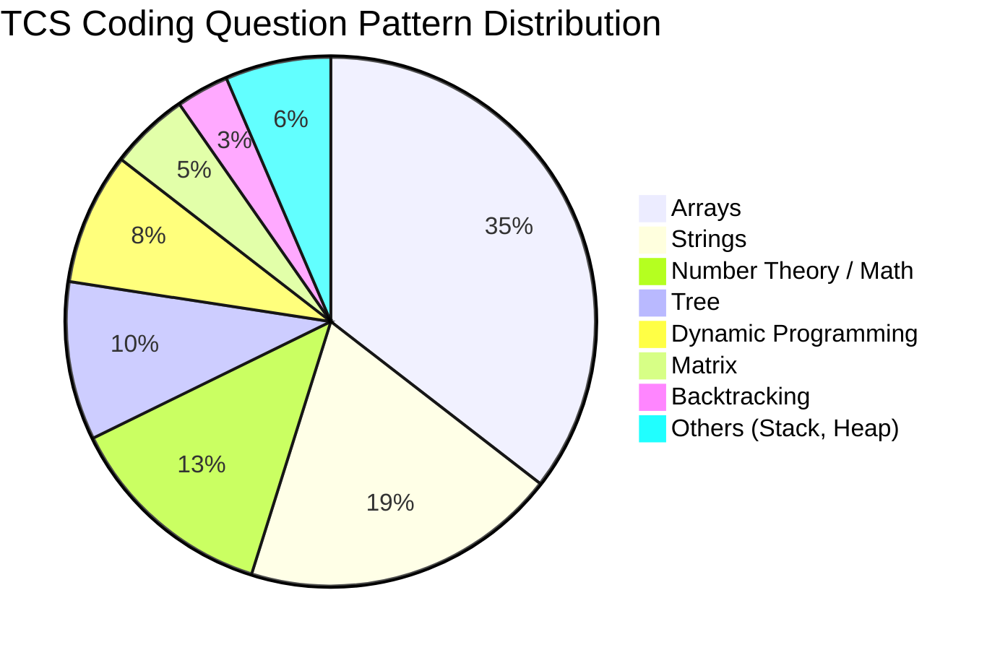

# TCS Coding Interview Preparation Guide

## Company Overview

| Detail | Information |
|--------|-------------|
| **Interview Process** | TCS NQT (National Qualifier Test) → Technical Interview → Managerial → HR |
| **Difficulty** | Easy to Medium (NQT has basic to intermediate coding) |
| **Coding Round Pattern** | 2 coding questions in NQT + 1-2 in technical interview |
| **Duration** | 60 minutes for coding section |
| **Platform Used** | TCS iON / HackerRank |
| **Tips** | TCS NQT focuses on arrays, strings, basic algorithms. Technical round dives deeper. |

---
## Question 1: Find the Missing Number in Array

### Problem Statement
Given an array of size `n-1` containing distinct numbers from `1` to `n`, find the missing number.

### Difficulty
Easy

### Pattern
Arrays, Mathematics

### Companies Asked
TCS, Amazon, Microsoft, Flipkart

### Concepts Needed
Array traversal, sum formula, XOR operation

### Constraints
- 1 <= n <= 10^6
- Array elements are distinct and in range [1, n]

### Approach 1: Brute Force (Using Sorting)
Sort the array and traverse to find the gap.
**Complexity:** O(n log n) time, O(1) space

### Approach 2: Optimized (Using Sum Formula)
Sum of first n natural numbers = n * (n + 1) / 2. Subtract array sum to get missing number.

### Approach 3: XOR Method
XOR of all numbers from 1 to n XOR XOR of all array elements = missing number.

### Python Solution

```python
from typing import List

def find_missing_number(nums: List[int], n: int) -> int:
    expected_sum = n * (n + 1) // 2
    actual_sum = sum(nums)
    return expected_sum - actual_sum

def find_missing_number_xor(nums: List[int], n: int) -> int:
    xor_all = 0
    for i in range(1, n + 1):
        xor_all ^= i
    for num in nums:
        xor_all ^= num
    return xor_all
```

### Dry Run
```
Input: nums = [1, 2, 4, 5, 6], n = 6
Expected sum = 6 * 7 / 2 = 21
Actual sum = 1 + 2 + 4 + 5 + 6 = 18
Missing = 21 - 18 = 3
Output: 3
```

### Complexity
- Time: O(n)
- Space: O(1)

### Common Mistakes
1. Using `n = len(nums)` instead of actual `n`
2. Integer overflow in other languages (safe in Python)
3. Off-by-one errors in range

### Edge Cases
1. Missing number is `n` (last element)
2. Missing number is `1` (first element)
3. Minimum array size (n = 2)

### Variations
- Find multiple missing numbers
- Find missing number when array has duplicates
- Find missing number in unsorted range

### Follow-up Questions
- What if the array can have duplicates?
- What if we need to find multiple missing numbers efficiently?

### Interview Tips
Start with sum formula approach. Mention XOR as a follow-up to show depth. TCS interviewers appreciate clean code with proper variable names.

### Expected Output
```
Input:  nums = [1, 2, 4, 5, 6], n = 6
Output: 3
```

### Quick Revision Notes
- Sum formula: O(n) time, O(1) space
- XOR approach avoids overflow
- Always confirm if n includes missing number

---
## Question 2: Check if Two Strings are Anagrams

### Problem Statement
Given two strings `s` and `t`, determine if they are anagrams of each other (contain same characters with same frequency).

### Difficulty
Easy

### Pattern
Strings, HashMap, Sorting

### Companies Asked
TCS, Google, Amazon, Uber

### Concepts Needed
String traversal, character counting, hash maps

### Constraints
- 1 <= len(s), len(t) <= 10^5
- Strings contain only lowercase English letters (can extend)

### Approach 1: Sorting
Sort both strings and compare. O(n log n) time, O(1) space.

### Approach 2: Frequency Counter (Optimized)
Count character frequencies using array of size 26.

### Python Solution
```python
from collections import Counter

def is_anagram(s: str, t: str) -> bool:
    if len(s) != len(t):
        return False
    char_count = [0] * 26
    for ch in s:
        char_count[ord(ch) - ord('a')] += 1
    for ch in t:
        index = ord(ch) - ord('a')
        char_count[index] -= 1
        if char_count[index] < 0:
            return False
    return True

def is_anagram_counter(s: str, t: str) -> bool:
    return Counter(s) == Counter(t)
```

### Dry Run
```
Input: s = "listen", t = "silent"
s traversal: l+1, i+1, s+1, t+1, e+1, n+1
t traversal: s-1, i-1, l-1, e-1, n-1, t-1
All zeros -> True
Output: True
```

### Complexity
- Time: O(n)
- Space: O(1) — fixed size array of 26

### Common Mistakes
1. Not checking length equality first
2. Using dictionary when array is sufficient for lowercase
3. Modifying input strings

### Edge Cases
1. Empty strings (anagrams)
2. Different lengths (not anagrams)
3. Case sensitivity (clarify with interviewer)

### Variations
- Group Anagrams (LeetCode 49)
- Find all anagrams in a string
- Minimum steps to make two strings anagrams

### Follow-up Questions
- What if input contains Unicode characters?
- How to handle very large strings efficiently?

### Interview Tips
Show both sorting (simpler) and frequency counting (optimal). TCS often asks follow-ups with larger character sets.

### Expected Output
```
Input:  s = "listen", t = "silent"
Output: True
Input:  s = "hello", t = "world"
Output: False
```

### Quick Revision Notes
- Check length first for quick rejection
- Array[26] is faster than dictionary for lowercase
- Sorting approach is simpler but slower

---
## Question 3: Count Frequency of Elements

### Problem Statement
Given an array of integers, count the frequency of each distinct element and return in descending order of frequency.

### Difficulty
Easy

### Pattern
HashMap, Sorting

### Companies Asked
TCS, Amazon, Apple

### Concepts Needed
Hash maps, sorting, frequency counting

### Constraints
- 1 <= n <= 10^5
- Array elements in range [-10^6, 10^6]

### Python Solution
```python
from typing import List, Dict
from collections import Counter

def count_frequencies(nums: List[int]) -> List[tuple]:
    freq_map: Dict[int, int] = {}
    for num in nums:
        freq_map[num] = freq_map.get(num, 0) + 1
    return sorted(freq_map.items(), key=lambda x: (-x[1], x[0]))

def count_frequencies_counter(nums: List[int]) -> List[tuple]:
    return Counter(nums).most_common()
```

### Dry Run
```
Input: nums = [4, 2, 4, 1, 2, 4, 3]
freq_map: {4: 3, 2: 2, 1: 1, 3: 1}
Sorted: [(4, 3), (2, 2), (1, 1), (3, 1)]
Output: [(4, 3), (2, 2), (1, 1), (3, 1)]
```

### Complexity
- Time: O(n + k log k) where k = distinct elements
- Space: O(k) for hashmap

### Common Mistakes
1. Not handling negative numbers
2. Sorting entire array instead of using hashmap
3. Forgetting tie-breaker rules for same frequency

### Edge Cases
1. Single element array
2. All elements same
3. All elements distinct

### Variations
- Top K frequent elements
- Sort characters by frequency
- Frequency sort the array

### Follow-up Questions
- Can you do it without extra space?
- How to handle streaming data?

### Interview Tips
Mention that in TCS coding rounds, using `collections.Counter` is acceptable and shows Python proficiency.

### Expected Output
```
Input:  nums = [4, 2, 4, 1, 2, 4, 3]
Output: [(4, 3), (2, 2), (1, 1), (3, 1)]
```

### Quick Revision Notes
- Dictionary for frequency counting
- Sorting with custom key for ordering
- `Counter` class simplifies this

---
## Question 4: Find Second Largest Element

### Problem Statement
Given an array of integers, find the second largest distinct element. If no second largest exists, return -1.

### Difficulty
Easy

### Pattern
Arrays, Single Pass

### Companies Asked
TCS, Infosys, Wipro, Cognizant

### Concepts Needed
Array traversal, comparison, single pass algorithm

### Constraints
- 2 <= n <= 10^6
- Array elements in range [-10^9, 10^9]

### Approach 1: Two Pass
Find largest in first pass, then find largest smaller than that.

### Approach 2: Single Pass (Optimized)
Track both largest and second largest in one traversal.

### Python Solution
```python
from typing import List

def second_largest(nums: List[int]) -> int:
    if len(nums) < 2:
        return -1
    first = second = float('-inf')
    for num in nums:
        if num > first:
            second = first
            first = num
        elif num > second and num != first:
            second = num
    return second if second != float('-inf') else -1
```

### Dry Run
```
Input: nums = [12, 35, 1, 10, 34, 1]
Step 1: num=12 -> first=12, second=-inf
Step 2: num=35 -> second=12, first=35
Step 3: num=1 -> skip
Step 4: num=10 -> skip
Step 5: num=34 -> second=34
Step 6: num=1 -> skip
Output: 34
```

### Complexity
- Time: O(n)
- Space: O(1)

### Common Mistakes
1. Not handling duplicates correctly
2. Using sort and indexing (O(n log n))
3. Not checking if second largest exists

### Edge Cases
1. All elements same (return -1)
2. Only two distinct elements
3. Descending and ascending order arrays

### Variations
- Find third largest
- Find Kth largest element
- Find largest and smallest simultaneously

### Follow-up Questions
- Can you do it without using negative infinity?
- What if we need top 3 elements?

### Interview Tips
This is a TCS favorite. Emphasize that single-pass is more efficient than sorting. Many candidates default to sorting.

### Expected Output
```
Input:  nums = [12, 35, 1, 10, 34, 1]
Output: 34
Input:  nums = [10, 10, 10]
Output: -1
```

### Quick Revision Notes
- Single pass with two variables
- Handle duplicates with num != first check
- Return -1 if no second largest

---
## Question 5: Rotate Array by K Positions

### Problem Statement
Given an array, rotate it to the right by k positions. Modify the array in-place.

### Difficulty
Easy

### Pattern
Arrays, Two Pointers, Reversal Algorithm

### Companies Asked
TCS, Amazon, Microsoft, Google

### Concepts Needed
Array reversal, modulo arithmetic, in-place modification

### Constraints
- 1 <= n <= 10^5
- 0 <= k <= 10^5

### Approach 1: Brute Force
Rotate right by 1 for k times. O(n*k) time.

### Approach 2: Using Extra Array
Copy elements to new array at shifted positions. O(n) time, O(n) space.

### Approach 3: Reversal Algorithm (Optimized)
Reverse entire array, then reverse first k, then reverse remaining n-k.

### Python Solution
```python
from typing import List

def rotate_array(nums: List[int], k: int) -> None:
    n = len(nums)
    if n == 0:
        return
    k = k % n
    if k == 0:
        return

    def reverse(start: int, end: int) -> None:
        while start < end:
            nums[start], nums[end] = nums[end], nums[start]
            start += 1
            end -= 1

    reverse(0, n - 1)
    reverse(0, k - 1)
    reverse(k, n - 1)
```

### Dry Run
```
Input: nums = [1, 2, 3, 4, 5, 6, 7], k = 3
Step 1: Reverse entire -> [7, 6, 5, 4, 3, 2, 1]
Step 2: Reverse first 3 -> [5, 6, 7, 4, 3, 2, 1]
Step 3: Reverse last 4 -> [5, 6, 7, 1, 2, 3, 4]
Output: [5, 6, 7, 1, 2, 3, 4]
```

### Complexity
- Time: O(n)
- Space: O(1)

### Common Mistakes
1. Not taking modulo of k (k may be > n)
2. Off-by-one in reversal indices
3. Creating new array instead of in-place

### Edge Cases
1. k = 0 (no rotation)
2. k = n (full rotation — array unchanged)
3. Single element array

### Variations
- Rotate array left by k
- Rotate string by k positions
- Rotate 2D matrix

### Follow-up Questions
- What if we need left rotation instead?
- Can you handle negative k values?

### Interview Tips
Reversal algorithm is the gold standard for this problem in TCS. Most candidates use extra space; impress with O(1) space solution.

### Expected Output
```
Input:  nums = [1, 2, 3, 4, 5, 6, 7], k = 3
Output: [5, 6, 7, 1, 2, 3, 4]
```

### Quick Revision Notes
- k = k % n first
- Three reversals: full, first k, last n-k
- O(1) space, O(n) time

---
## Question 6: Remove Duplicates from Sorted Array

### Problem Statement
Given a sorted array, remove duplicates in-place such that each element appears only once, and return the new length.

### Difficulty
Easy

### Pattern
Arrays, Two Pointers

### Companies Asked
TCS, Amazon, Microsoft, Adobe

### Concepts Needed
Two-pointers, in-place modification, sorted array properties

### Constraints
- 1 <= n <= 10^5
- Array sorted in non-decreasing order

### Approach 1: Using Extra Space
Create a new array with unique elements.

### Approach 2: Two Pointers (Optimized)
Use slow pointer for unique position, fast pointer to scan.

### Python Solution
```python
from typing import List

def remove_duplicates(nums: List[int]) -> int:
    if not nums:
        return 0
    write_pos = 1
    for i in range(1, len(nums)):
        if nums[i] != nums[i - 1]:
            nums[write_pos] = nums[i]
            write_pos += 1
    return write_pos
```

### Dry Run
```
Input: nums = [0, 0, 1, 1, 1, 2, 2, 3, 3, 4]
i=1: nums[1]=0 == nums[0]=0 -> skip
i=2: nums[2]=1 != nums[1]=0 -> nums[1]=1, write_pos=2
i=5: nums[5]=2 != nums[4]=1 -> nums[2]=2, write_pos=3
i=7: nums[7]=3 != nums[6]=2 -> nums[3]=3, write_pos=4
i=9: nums[9]=4 != nums[8]=3 -> nums[4]=4, write_pos=5
Output: 5, first 5 = [0, 1, 2, 3, 4]
```

### Complexity
- Time: O(n)
- Space: O(1)

### Common Mistakes
1. Modifying wrong pointer position
2. Not handling empty array
3. Comparing with previous element incorrectly

### Edge Cases
1. Empty array
2. All elements same
3. All elements unique

### Variations
- Remove duplicates from unsorted array
- Remove duplicates with at most 2 occurrences
- Remove element (not duplicates)

### Follow-up Questions
- What if the array is unsorted?
- What if we need to keep at most 2 duplicates?

### Interview Tips
Two-pointer technique is fundamental. TCS expects you to handle in-place modification correctly. Always mention the sorted precondition.

### Expected Output
```
Input:  nums = [0, 0, 1, 1, 1, 2, 2, 3, 3, 4]
Output: 5 (first 5 elements are [0, 1, 2, 3, 4])
```

### Quick Revision Notes
- Slow pointer tracks write position
- Compare adjacent elements in sorted array
- Return write position as new length

---
## Question 7: Find All Pairs with Given Sum

### Problem Statement
Given an array of integers and a target sum, find all unique pairs (a, b) such that a + b = target.

### Difficulty
Easy

### Pattern
HashMap, Two Pointers, Arrays

### Companies Asked
TCS, Amazon, Google, Facebook

### Concepts Needed
Hash maps, two-pointer technique, set operations, duplicate handling

### Constraints
- 1 <= n <= 10^5
- Target and array elements in range [-10^9, 10^9]

### Approach 1: Brute Force
Check every pair using nested loops. O(n^2) time.

### Approach 2: Using HashSet (Optimized)
For each element, check if (target - element) exists in set.

### Approach 3: Two Pointers (if sorted)
Sort array, use two pointers from both ends.

### Python Solution
```python
from typing import List, Set, Tuple

def find_pairs(nums: List[int], target: int) -> List[Tuple[int, int]]:
    seen: Set[int] = set()
    pairs: Set[Tuple[int, int]] = set()
    for num in nums:
        complement = target - num
        if complement in seen:
            pair = tuple(sorted((num, complement)))
            pairs.add(pair)
        seen.add(num)
    return list(pairs)
```

### Dry Run
```
Input: nums = [2, 4, 3, 1, 5, 3], target = 6
2: complement=4, not seen -> seen={2}
4: complement=2, seen -> pair (2,4), seen={2,4}
3: complement=3, not seen -> seen={2,4,3}
1: complement=5, not seen -> seen={2,4,3,1}
5: complement=1, seen -> pair (1,5), seen={2,4,3,1,5}
3: complement=3, seen -> pair (3,3)
Output: [(2, 4), (1, 5), (3, 3)]
```

### Complexity
- Time: O(n)
- Space: O(n)

### Common Mistakes
1. Counting same pair twice (use sorted tuples)
2. Not handling duplicates
3. Using element at same index twice

### Edge Cases
1. No pairs exist
2. Multiple occurrences of same pair
3. Pair with itself (element = target/2)

### Variations
- Find pairs with sum in sorted array
- Count pairs with given sum
- Find pairs with given difference

### Follow-up Questions
- How to avoid duplicate pairs?
- Can you do it without extra space?

### Interview Tips
Start with hashset approach. Mention two-pointer as alternative if sorting is allowed. TCS often asks for unique pairs.

### Expected Output
```
Input:  nums = [2, 4, 3, 1, 5, 3], target = 6
Output: [(2, 4), (1, 5), (3, 3)]
```

### Quick Revision Notes
- Hashset gives O(n) solution
- Use sorted tuple to avoid duplicates
- Two-pointer needs sorted array

---
## Question 8: Check Substring

### Problem Statement
Given two strings s (main string) and sub (substring), check if sub is present in s. Return the starting index, or -1 if not found.

### Difficulty
Easy

### Pattern
Strings, Sliding Window

### Companies Asked
TCS, Microsoft, Google

### Concepts Needed
String slicing, string searching

### Constraints
- 1 <= len(s) <= 10^5
- 1 <= len(sub) <= 10^4

### Approach 1: Python Built-in (in operator or find())
Use Python's built-in substring search.

### Approach 2: Sliding Window
Slide through main string and compare each window.

### Python Solution
```python
def find_substring(s: str, sub: str) -> int:
    if not sub:
        return 0
    n, m = len(s), len(sub)
    for i in range(n - m + 1):
        if s[i:i + m] == sub:
            return i
    return -1

def find_substring_builtin(s: str, sub: str) -> int:
    return s.find(sub)
```

### Dry Run
```
Input: s = "hello world", sub = "world"
n=11, m=5
i=0: "hello" != "world"
i=1: "ello " != "world"
...
i=6: "world" == "world" -> return 6
Output: 6
```

### Complexity
- Time: O(n*m) worst case, O(n) on average
- Space: O(1)

### Common Mistakes
1. Off-by-one in loop range (n - m + 1)
2. Not handling empty substring
3. Case sensitivity oversight

### Edge Cases
1. Substring longer than main string
2. Empty substring (return 0 by convention)
3. Multiple occurrences (return first)

### Variations
- Count occurrences of substring
- Replace all occurrences
- KMP algorithm for O(n) search

### Follow-up Questions
- Can you implement KMP algorithm?
- How to find all occurrences?

### Interview Tips
For TCS NQT, Python's built-in find() is acceptable. In technical rounds, show you know O(n) algorithms like KMP.

### Expected Output
```
Input:  s = "hello world", sub = "world"
Output: 6
Input:  s = "hello world", sub = "xyz"
Output: -1
```

### Quick Revision Notes
- Python has built-in find() and in operator
- Sliding window comparison
- KMP gives guaranteed O(n) time

---
## Question 9: Matrix Addition

### Problem Statement
Given two matrices A and B of same dimensions, compute their sum.

### Difficulty
Easy

### Pattern
Matrix, 2D Arrays

### Companies Asked
TCS, Infosys, Wipro

### Concepts Needed
2D array traversal, nested loops

### Constraints
- 1 <= rows, cols <= 1000
- Matrix elements in range [-10^6, 10^6]

### Python Solution
```python
from typing import List

def matrix_addition(A: List[List[int]], B: List[List[int]]) -> List[List[int]]:
    if not A or not B:
        return []
    rows, cols = len(A), len(A[0])
    result = [[0] * cols for _ in range(rows)]
    for i in range(rows):
        for j in range(cols):
            result[i][j] = A[i][j] + B[i][j]
    return result
```

### Dry Run
```
Input: A = [[1, 2], [3, 4]], B = [[5, 6], [7, 8]]
i=0,j=0: result[0][0] = 1+5 = 6
i=0,j=1: result[0][1] = 2+6 = 8
i=1,j=0: result[1][0] = 3+7 = 10
i=1,j=1: result[1][1] = 4+8 = 12
Output: [[6, 8], [10, 12]]
```

### Complexity
- Time: O(rows x cols)
- Space: O(rows x cols) for result matrix

### Common Mistakes
1. Not handling empty matrices
2. Assuming square matrices
3. Modifying input matrices

### Edge Cases
1. Empty matrix
2. Single element matrix
3. Rectangular (non-square) matrix

### Variations
- Matrix subtraction
- Matrix multiplication
- Transpose of matrix

### Follow-up Questions
- Can you do matrix multiplication?
- How to handle sparse matrices?

### Interview Tips
TCS NQT often tests basic matrix operations. Show proper dimension checks.

### Expected Output
```
Input: A = [[1, 2], [3, 4]], B = [[5, 6], [7, 8]]
Output: [[6, 8], [10, 12]]
```

### Quick Revision Notes
- Nested loops for 2D arrays
- Result matrix must be created first
- Check dimensions match

---
## Question 10: Find GCD of Two Numbers

### Problem Statement
Given two integers, find their Greatest Common Divisor (GCD).

### Difficulty
Easy

### Pattern
Number Theory, Recursion, Mathematics

### Companies Asked
TCS, Infosys, Cognizant, Wipro

### Concepts Needed
Euclidean algorithm, recursion, modulo operation

### Constraints
- 1 <= a, b <= 10^9

### Approach 1: Brute Force
Iterate from min(a,b) down to 1, check divisibility.

### Approach 2: Euclidean Algorithm (Optimized)
GCD(a, b) = GCD(b, a % b). Repeat until b = 0.

### Python Solution
```python
def find_gcd(a: int, b: int) -> int:
    while b != 0:
        a, b = b, a % b
    return a

def find_gcd_recursive(a: int, b: int) -> int:
    if b == 0:
        return a
    return find_gcd_recursive(b, a % b)
```

### Dry Run
```
Input: a = 48, b = 18
Iter 1: a=48, b=18 -> a=18, b=48%18=12
Iter 2: a=18, b=12 -> a=12, b=18%12=6
Iter 3: a=12, b=6 -> a=6, b=12%6=0
Iter 4: b=0 -> return a=6
Output: 6
```

### Complexity
- Time: O(log(min(a, b)))
- Space: O(1) iterative, O(log n) recursive

### Common Mistakes
1. Not handling zero inputs
2. Using modulo with negative numbers
3. Inefficient brute-force implementation

### Edge Cases
1. One number is zero (GCD is the other)
2. Both numbers equal
3. One number is 1 (GCD = 1)

### Variations
- Find LCM using GCD: LCM(a, b) = a * b / GCD(a, b)
- Find GCD of array
- Extended Euclidean algorithm

### Follow-up Questions
- How to find LCM?
- Implement extended Euclidean algorithm

### Interview Tips
Euclidean algorithm is expected. TCS NQT may ask GCD in combination with other problems. Python also has math.gcd().

### Expected Output
```
Input:  a = 48, b = 18
Output: 6
Input:  a = 17, b = 5
Output: 1
```

### Quick Revision Notes
- Euclidean: GCD(a, b) = GCD(b, a % b)
- LCM(a, b) = a * b // GCD(a, b)
- Python has built-in math.gcd()

---
## Pattern Summary (Q1-Q10)

### Revision Table

| # | Problem | Pattern | Time | Space |
|---|---------|---------|------|-------|
| 1 | Find Missing Number | Array, Math | O(n) | O(1) |
| 2 | Check Anagram | String, HashMap | O(n) | O(1) |
| 3 | Count Frequency | HashMap | O(n log n) | O(n) |
| 4 | Second Largest | Array | O(n) | O(1) |
| 5 | Rotate Array | Array, Reversal | O(n) | O(1) |
| 6 | Remove Duplicates | Two Pointers | O(n) | O(1) |
| 7 | Pairs with Sum | HashMap | O(n) | O(n) |
| 8 | Find Substring | String | O(n*m) | O(1) |
| 9 | Matrix Addition | Matrix | O(r*c) | O(r*c) |
| 10 | GCD | Number Theory | O(log n) | O(1) |

### Important Observations
1. Most easy problems use either a hashmap or two-pointer technique
2. In-place modification is a common requirement in TCS coding rounds
3. Python's built-in functions (find(), gcd(), Counter) save time in NQT
4. Handling edge cases (empty input, single element) is critical

---
## Question 11: Count Vowels and Consonants

### Problem Statement
Given a string, count the number of vowels (a, e, i, o, u) and consonants in it. Case-insensitive.

### Difficulty
Easy

### Pattern
Strings, Character Processing

### Companies Asked
TCS, Cognizant, Infosys

### Concepts Needed
String traversal, character classification, set operations

### Constraints
- 1 <= len(s) <= 10^5

### Python Solution
```python
def count_vowels_consonants(s: str) -> dict:
    vowels_set = set('aeiou')
    vowels = consonants = 0
    for ch in s.lower():
        if 'a' <= ch <= 'z':
            if ch in vowels_set:
                vowels += 1
            else:
                consonants += 1
    return {'vowels': vowels, 'consonants': consonants}
```

### Dry Run
```
Input: s = "Hello World"
h->consonant, e->vowel, l->consonant, l->consonant, o->vowel
w->consonant, o->vowel, r->consonant, l->consonant, d->consonant
vowels = 3, consonants = 7
Output: {'vowels': 3, 'consonants': 7}
```

### Complexity
- Time: O(n), Space: O(1)

### Common Mistakes
1. Not handling uppercase letters
2. Counting spaces or digits as consonants
3. Forgetting 'y' is not a vowel in standard English

### Edge Cases
1. Empty string
2. String with no letters
3. String with only vowels or only consonants

### Variations
- Count frequency of each character
- Check if string has all vowels
- Remove all vowels from string

### Follow-up Questions
- What counts as a vowel in this context?
- Handle international characters?

### Interview Tips
Simple but frequently asked in TCS NQT. Use set for vowel lookup for O(1) check.

### Expected Output
```
Input:  s = "Hello World"
Output: {'vowels': 3, 'consonants': 7}
```

### Quick Revision Notes
- Case normalization first
- Set lookup is O(1)
- Only count alphabetic characters

---
## Question 12: Check Palindrome

### Problem Statement
Given a string, check if it reads the same forwards and backwards (palindrome).

### Difficulty
Easy

### Pattern
Strings, Two Pointers

### Companies Asked
TCS, Amazon, Google, Microsoft

### Concepts Needed
String reversal, two-pointer technique

### Constraints
- 1 <= len(s) <= 10^5

### Approach 1: String Reversal
Compare string with its reverse.

### Approach 2: Two Pointers (Optimized)
Use left and right pointers moving towards center.

### Python Solution
```python
def is_palindrome(s: str) -> bool:
    left, right = 0, len(s) - 1
    while left < right:
        if s[left] != s[right]:
            return False
        left += 1
        right -= 1
    return True

def is_palindrome_reverse(s: str) -> bool:
    return s == s[::-1]
```

### Dry Run
```
Input: s = "racecar"
left=0(r), right=6(r) -> match
left=1(a), right=5(a) -> match
left=2(c), right=4(c) -> match
left=3(e), right=3 -> left < right is False -> exit
Output: True
```

### Complexity
- Time: O(n)
- Space: O(1)

### Common Mistakes
1. Not handling case sensitivity (clarify with interviewer)
2. Not handling spaces and punctuation
3. Off-by-one in two-pointer comparison

### Edge Cases
1. Empty string (is palindrome)
2. Single character (is palindrome)
3. Even length palindrome ("abba")
4. Odd length palindrome ("racecar")

### Variations
- Check if linked list is palindrome
- Longest palindromic substring
- Palindrome number (integer)

### Follow-up Questions
- What if we ignore case and non-alphanumeric characters?
- Can you do it without extra space?

### Interview Tips
TCS NQT usually asks basic palindrome. Show both reverse check and two-pointer.

### Expected Output
```
Input:  s = "racecar"
Output: True
Input:  s = "hello"
Output: False
```

### Quick Revision Notes
- Two pointers from ends towards center
- String reversal: s == s[::-1]
- For alphanumeric check, skip non-alnum chars

---
## Question 13: Fibonacci Series (Nth Term)

### Problem Statement
Find the Nth term of the Fibonacci series where F(0) = 0, F(1) = 1, and F(n) = F(n-1) + F(n-2).

### Difficulty
Easy

### Pattern
Recursion, Dynamic Programming, Iteration

### Companies Asked
TCS, Amazon, Microsoft, Google

### Concepts Needed
Recursion, memoization, iterative DP

### Constraints
- 0 <= n <= 10^6 (for iterative)

### Approach 1: Recursion (Naive)
F(n) = F(n-1) + F(n-2). O(2^n).

### Approach 2: Iterative (Optimized)
Use two variables to track previous two numbers.

### Python Solution
```python
from typing import Dict

def fibonacci_iterative(n: int) -> int:
    if n <= 1:
        return n
    prev, curr = 0, 1
    for _ in range(2, n + 1):
        prev, curr = curr, prev + curr
    return curr

def fibonacci_memoized(n: int, memo: Dict[int, int] = None) -> int:
    if memo is None:
        memo = {}
    if n <= 1:
        return n
    if n not in memo:
        memo[n] = fibonacci_memoized(n - 1, memo) + fibonacci_memoized(n - 2, memo)
    return memo[n]
```

### Dry Run
```
Input: n = 6
prev=0, curr=1
2: prev=1, curr=1
3: prev=1, curr=2
4: prev=2, curr=3
5: prev=3, curr=5
6: prev=5, curr=8
Output: 8
```

### Complexity
- Time: O(n) iterative, O(2^n) naive recursion
- Space: O(1) iterative, O(n) memoization

### Common Mistakes
1. Off-by-one: F(0)=0 or F(0)=1? Clarify.
2. Stack overflow in recursion for large n
3. Not handling n=0 case

### Edge Cases
1. n = 0 (return 0)
2. n = 1 (return 1)

### Variations
- N-th Tribonacci number
- Climbing stairs problem
- Fibonacci with matrix exponentiation

### Follow-up Questions
- Can you do it in O(log n) using matrix exponentiation?
- What about large n with modulo?

### Interview Tips
Start with recursive, then optimize to iterative. TCS usually expects iterative solution.

### Expected Output
```
Input:  n = 6
Output: 8
Series: [0, 1, 1, 2, 3, 5, 8]
```

### Quick Revision Notes
- Iterative: O(n) time, O(1) space
- Naive recursion is O(2^n) - avoid
- F(0)=0, F(1)=1

---
## Question 14: Factorial of a Number

### Problem Statement
Find the factorial of a non-negative integer n (n!).

### Difficulty
Easy

### Pattern
Recursion, Iteration, Mathematics

### Companies Asked
TCS, Infosys, Wipro

### Concepts Needed
Recursion, iteration, large number handling

### Constraints
- 0 <= n <= 1000

### Approach 1: Recursive
n! = n x (n-1)! with base case 0! = 1.

### Approach 2: Iterative (Optimized)
Multiply from 1 to n.

### Python Solution
```python
def factorial_iterative(n: int) -> int:
    if n < 0:
        raise ValueError("Factorial undefined for negative numbers")
    result = 1
    for i in range(2, n + 1):
        result *= i
    return result

def factorial_recursive(n: int) -> int:
    if n < 0:
        raise ValueError("Factorial undefined for negative numbers")
    if n <= 1:
        return 1
    return n * factorial_recursive(n - 1)
```

### Dry Run
```
Input: n = 5
result = 1
i=2: result = 2
i=3: result = 6
i=4: result = 24
i=5: result = 120
Output: 120
```

### Complexity
- Time: O(n)
- Space: O(1) iterative, O(n) recursive (call stack)

### Common Mistakes
1. Not handling n=0 (0! = 1)
2. Stack overflow for large n in recursion
3. Integer overflow (not an issue in Python)

### Edge Cases
1. n = 0 (return 1)
2. n = 1 (return 1)

### Variations
- Trailing zeros in factorial
- Count digits in factorial
- Factorial of large numbers modulo M

### Follow-up Questions
- How many trailing zeros does n! have?
- Compute nCr using factorial

### Interview Tips
TCS NQT may ask factorial as part of larger problems (nCr, permutation). Iterative is preferred.

### Expected Output
```
Input:  n = 5
Output: 120
Input:  n = 0
Output: 1
```

### Quick Revision Notes
- 0! = 1 (base case)
- Iterative avoids recursion overhead
- Python handles large integers natively

---
## Question 15: Prime Number Check

### Problem Statement
Given an integer n, determine if it is a prime number.

### Difficulty
Easy

### Pattern
Number Theory, Mathematics

### Companies Asked
TCS, Cognizant, Infosys

### Concepts Needed
Prime factorization, divisibility, square root optimization

### Constraints
- 1 <= n <= 10^12

### Approach 1: Brute Force
Check divisibility from 2 to n-1.

### Approach 2: Optimized
Check only up to sqrt(n). Skip even numbers after 2.

### Python Solution
```python
def is_prime(n: int) -> bool:
    if n <= 1:
        return False
    if n <= 3:
        return True
    if n % 2 == 0 or n % 3 == 0:
        return False
    i = 5
    while i * i <= n:
        if n % i == 0 or n % (i + 2) == 0:
            return False
        i += 6
    return True
```

### Dry Run
```
Input: n = 29
n<=1? No. n<=3? No.
n%2=1, n%3=2 -> continue
i=5: 5*5=25<=29. 29%5=4, 29%7=1 -> continue
i=11: 121>29 -> exit loop
Output: True
```

### Complexity
- Time: O(sqrt(n))
- Space: O(1)

### Common Mistakes
1. Treating 1 as prime (it's not)
2. Not checking divisibility by 2 and 3 early
3. Running loop all the way to n

### Edge Cases
1. n = 1 (not prime)
2. n = 2 (prime - smallest prime)
3. n = 3 (prime)
4. Large prime near 10^12

### Variations
- Sieve of Eratosthenes (generate all primes up to n)
- Count primes in range
- Prime factors of a number

### Follow-up Questions
- Generate all primes up to n efficiently
- What is the 10001st prime number?

### Interview Tips
TCS NQT asks this frequently. The sqrt(n) optimization is necessary. Show the 6k +/- 1 optimization for bonus points.

### Expected Output
```
Input:  n = 29
Output: True
Input:  n = 1
Output: False
```

### Quick Revision Notes
- Check up to sqrt(n), not n
- Handle 2 and 3 as special cases
- 6k +/- 1 optimization for speed

---
## Pattern Summary (Q11-Q15)

### Revision Table

| # | Problem | Pattern | Time | Space |
|---|---------|---------|------|-------|
| 11 | Vowels/Consonants | String | O(n) | O(1) |
| 12 | Palindrome | Two Pointers | O(n) | O(1) |
| 13 | Fibonacci | Iteration/DP | O(n) | O(1) |
| 14 | Factorial | Iteration | O(n) | O(1) |
| 15 | Prime Check | Number Theory | O(sqrt(n)) | O(1) |

### Important Observations
1. Early level questions focus on loops, conditionals, and basic math
2. String traversal and character classification are core skills
3. Optimization from O(n^2) to O(n) or O(sqrt(n)) is a common improvement pattern

---
## Question 16: Move All Zeros to End

### Problem Statement
Given an array of integers, move all zeros to the end while maintaining the relative order of non-zero elements. Do this in-place.

### Difficulty
Easy

### Pattern
Arrays, Two Pointers

### Companies Asked
TCS, Amazon, Microsoft, Google

### Concepts Needed
Two-pointer technique, in-place array modification

### Constraints
- 1 <= n <= 10^5

### Approach 1: Brute Force (Using extra space)
Copy non-zero elements to new array, fill rest with zeros.

### Approach 2: Two Pointers (Optimized)
Use a pointer to track position for next non-zero element.

### Python Solution
```python
from typing import List

def move_zeroes(nums: List[int]) -> None:
    write_pos = 0
    for i in range(len(nums)):
        if nums[i] != 0:
            nums[write_pos], nums[i] = nums[i], nums[write_pos]
            write_pos += 1
```

### Dry Run
```
Input: nums = [0, 1, 0, 3, 12]
write_pos=0
i=0: nums[0]=0 -> skip
i=1: nums[1]=1 -> swap(0,1) -> [1,0,0,3,12], write_pos=1
i=2: nums[2]=0 -> skip
i=3: nums[3]=3 -> swap(1,3) -> [1,3,0,0,12], write_pos=2
i=4: nums[4]=12 -> swap(2,4) -> [1,3,12,0,0], write_pos=3
Output: [1, 3, 12, 0, 0]
```

### Complexity
- Time: O(n)
- Space: O(1)

### Common Mistakes
1. Using extra array (not in-place)
2. Losing relative order of non-zero elements
3. Overwriting elements instead of swapping

### Edge Cases
1. All zeros
2. No zeros
3. Zeros at the end already

### Variations
- Move all zeros to front
- Remove all occurrences of a value
- Sort array by parity

### Follow-up Questions
- Can you minimize writes?
- What if we need to maintain order of zero elements too?

### Interview Tips
TCS expects in-place solutions. The swap approach is elegant and efficient.

### Expected Output
```
Input:  nums = [0, 1, 0, 3, 12]
Output: [1, 3, 12, 0, 0]
```

### Quick Revision Notes
- Write position tracks where next non-zero goes
- Swap (not overwrite) to handle zeros correctly
- Maintains relative order of non-zero elements

---
## Question 17: Contains Duplicate

### Problem Statement
Given an array of integers, determine if any value appears at least twice.

### Difficulty
Easy

### Pattern
HashMap, HashSet, Arrays

### Companies Asked
TCS, Amazon, Google, Apple

### Concepts Needed
Hash set, array traversal

### Constraints
- 1 <= n <= 10^6

### Approach 1: Brute Force
Compare every pair of elements. O(n^2).

### Approach 2: Using HashSet (Optimized)
Add elements to set; if add fails, duplicate found.

### Python Solution
```python
from typing import List

def contains_duplicate(nums: List[int]) -> bool:
    seen = set()
    for num in nums:
        if num in seen:
            return True
        seen.add(num)
    return False

def contains_duplicate_short(nums: List[int]) -> bool:
    return len(nums) != len(set(nums))
```

### Dry Run
```
Input: nums = [1, 2, 3, 1]
seen = {}
1 not seen -> seen={1}
2 not seen -> seen={1,2}
3 not seen -> seen={1,2,3}
1 in seen -> return True
Output: True
```

### Complexity
- Time: O(n)
- Space: O(n)

### Common Mistakes
1. Sorting the array (O(n log n)) when O(n) is possible
2. Not handling large inputs efficiently
3. Returning "not duplicate" too early

### Edge Cases
1. Empty array (no duplicate)
2. Single element (no duplicate)
3. All elements same (duplicate at index 1)

### Variations
- Find duplicates in array
- Contains duplicate within k distance
- Find all duplicates

### Follow-up Questions
- Can you do it in O(1) space?
- What if numbers are in a limited range?

### Interview Tips
Set-based O(n) solution is expected. Mention the sorting alternative as a space-optimized tradeoff.

### Expected Output
```
Input:  nums = [1, 2, 3, 1]
Output: True
Input:  nums = [1, 2, 3, 4]
Output: False
```

### Quick Revision Notes
- Hash set for O(n) detection
- len(nums) != len(set(nums)) for quick check
- Sorting gives O(1) space but O(n log n) time

---
## Question 18: Reverse Words in a String

### Problem Statement
Given a string, reverse the order of words. A word is defined as a sequence of non-space characters.

### Difficulty
Medium

### Pattern
Strings, Two Pointers

### Companies Asked
TCS, Amazon, Microsoft, Google

### Concepts Needed
String splitting, word reversal, multiple spaces handling

### Constraints
- 1 <= len(s) <= 10^5

### Approach 1: Using Split
Split by spaces, reverse the list, join.

### Approach 2: Two Pointers (In-place simulation)
Extract words and build result manually.

### Python Solution
```python
def reverse_words(s: str) -> str:
    words = s.split()
    return ' '.join(reversed(words))

def reverse_words_manual(s: str) -> str:
    words = []
    i, n = 0, len(s)
    while i < n:
        while i < n and s[i] == ' ':
            i += 1
        if i >= n:
            break
        start = i
        while i < n and s[i] != ' ':
            i += 1
        words.append(s[start:i])
    return ' '.join(reversed(words))
```

### Dry Run
```
Input: s = "  hello world  "
split() -> ["hello", "world"]
reversed -> ["world", "hello"]
join -> "world hello"
Output: "world hello"
```

### Complexity
- Time: O(n)
- Space: O(n)

### Common Mistakes
1. Forgetting split() with no args handles multiple spaces
2. Using split(' ') instead of split() (single space only)
3. Not handling leading/trailing spaces

### Edge Cases
1. Empty string
2. Single word
3. Multiple spaces between words

### Variations
- Reverse each word in a string
- Reverse string by words in-place (character array)

### Follow-up Questions
- Can you do it in-place if given a character array?
- What about Unicode words?

### Interview Tips
Python's split() is the answer for NQT. For technical rounds, show understanding of two-pointer approach.

### Expected Output
```
Input:  s = "  hello world  "
Output: "world hello"
Input:  s = "the sky is blue"
Output: "blue is sky the"
```

### Quick Revision Notes
- split() handles multiple spaces automatically
- split() and split(' ') behave differently
- Use reversed() or slicing for reversal

---
## Question 19: Maximum Subarray Sum (Kadane's Algorithm)

### Problem Statement
Given an array of integers, find the contiguous subarray with the largest sum.

### Difficulty
Medium

### Pattern
Dynamic Programming, Arrays

### Companies Asked
TCS, Amazon, Google, Microsoft, Apple

### Concepts Needed
Kadane's algorithm, dynamic programming, prefix sum

### Constraints
- 1 <= n <= 10^5
- Array elements in range [-10^4, 10^4]

### Approach 1: Brute Force
Check all possible subarrays. O(n^2).

### Approach 2: Kadane's Algorithm (Optimized)
Maintain current sum and max sum; reset current to 0 if negative.

### Python Solution
```python
from typing import List

def max_subarray_sum(nums: List[int]) -> int:
    if not nums:
        return 0
    max_sum = current_sum = nums[0]
    for num in nums[1:]:
        current_sum = max(num, current_sum + num)
        max_sum = max(max_sum, current_sum)
    return max_sum
```

### Dry Run
```
Input: nums = [-2, 1, -3, 4, -1, 2, 1, -5, 4]
max_sum = current_sum = -2
1: current_sum=max(1,-1)=1, max_sum=1
-3: current_sum=max(-3,-2)=-2, max_sum=1
4: current_sum=max(4,2)=4, max_sum=4
-1: current_sum=max(-1,3)=3, max_sum=4
2: current_sum=max(2,5)=5, max_sum=5
1: current_sum=max(1,6)=6, max_sum=6
-5: current_sum=max(-5,1)=1, max_sum=6
4: current_sum=max(4,5)=5, max_sum=6
Output: 6 (subarray [4, -1, 2, 1])
```

### Complexity
- Time: O(n)
- Space: O(1)

### Common Mistakes
1. Initializing max_sum to 0 (fails for all-negative arrays)
2. Not resetting current_sum properly
3. Returning the subarray instead of sum

### Edge Cases
1. All negative numbers
2. All positive numbers
3. Single element
4. Sum of entire array

### Variations
- Maximum subarray sum with at least k elements
- Maximum circular subarray sum
- Maximum product subarray

### Follow-up Questions
- Return the subarray indices, not just sum
- Handle circular array

### Interview Tips
Kadane's algorithm is a TCS favorite. Memorize it. Start with explanation of brute force, then optimize.

### Expected Output
```
Input:  nums = [-2, 1, -3, 4, -1, 2, 1, -5, 4]
Output: 6
```

### Quick Revision Notes
- current_sum = max(num, current_sum + num)
- max_sum tracks global maximum
- Initialize with first element (not 0)

---
## Question 20: First Non-Repeating Character

### Problem Statement
Given a string, find the first non-repeating character and return its index. If none exists, return -1.

### Difficulty
Easy-Medium

### Pattern
Strings, HashMap

### Companies Asked
TCS, Amazon, Google, Microsoft

### Concepts Needed
Character frequency counting, string traversal

### Constraints
- 1 <= len(s) <= 10^5

### Approach: Two-Pass with HashMap
First pass: count frequencies. Second pass: find first with count = 1.

### Python Solution
```python
from collections import OrderedDict

def first_unique_char(s: str) -> int:
    char_count = {}
    for ch in s:
        char_count[ch] = char_count.get(ch, 0) + 1
    for i, ch in enumerate(s):
        if char_count[ch] == 1:
            return i
    return -1
```

### Dry Run
```
Input: s = "loveleetcode"
First pass: l:1, o:1, v:1, e:3, t:1, c:1, d:1
Second pass: i=0 'l' count=1 -> return 0
Output: 0
```

### Complexity
- Time: O(n)
- Space: O(k) where k <= 26 (lowercase) or O(n) general

### Common Mistakes
1. Building frequency in one pass using index extraction
2. Not handling empty string
3. Using Counter.most_common() instead of accessing by character

### Edge Cases
1. Empty string (return -1)
2. All characters repeat
3. Single character
4. Multiple unique characters (return first)

### Variations
- First repeating character
- All non-repeating characters
- Kth non-repeating character

### Follow-up Questions
- Can you do it in one pass?
- What about stream of characters?

### Interview Tips
Two-pass is standard. TCS may ask about one-pass solution using index tracking.

### Expected Output
```
Input:  s = "loveleetcode"
Output: 0
Input:  s = "aabb"
Output: -1
```

### Quick Revision Notes
- First pass: count frequencies
- Second pass: find first with count = 1
- O(n) time, O(1) space for fixed alphabet

---
## Pattern Summary (Q16-Q20)

### Revision Table

| # | Problem | Pattern | Time | Space |
|---|---------|---------|------|-------|
| 16 | Move Zeros | Two Pointers | O(n) | O(1) |
| 17 | Contains Duplicate | HashSet | O(n) | O(n) |
| 18 | Reverse Words | String | O(n) | O(n) |
| 19 | Max Subarray Sum | Kadane/DP | O(n) | O(1) |
| 20 | First Non-Repeating | HashMap | O(n) | O(k) |

### Important Observations
1. Two-pointer technique appears frequently for in-place array problems
2. Hash-based solutions trade space for time in frequency/duplicate problems
3. Kadane's algorithm is a classic DP problem - understand the recurrence
4. Two-pass approach (count, then find) is a common pattern

---
## Question 21: Find Intersection of Two Arrays

### Problem Statement
Given two integer arrays, return an array of their intersection (elements that appear in both arrays). Each element in result should be unique.

### Difficulty
Easy-Medium

### Pattern
HashSet, Two Pointers, Sorting

### Companies Asked
TCS, Amazon, Google, Apple

### Concepts Needed
Set operations, two-pointer technique

### Constraints
- 1 <= n, m <= 10^5

### Approach 1: Using HashSet
Convert one array to set, iterate through other.

### Approach 2: Two Pointers (if both sorted)
Sort both arrays, use two pointers to find common elements.

### Python Solution
```python
from typing import List

def intersection(nums1: List[int], nums2: List[int]) -> List[int]:
    set1 = set(nums1)
    result = set()
    for num in nums2:
        if num in set1:
            result.add(num)
    return list(result)

def intersection_short(nums1: List[int], nums2: List[int]) -> List[int]:
    return list(set(nums1) & set(nums2))
```

### Dry Run
```
Input: nums1 = [4, 9, 5], nums2 = [9, 4, 9, 8, 4]
set1 = {4, 9, 5}
9 in set1 -> result.add(9)
4 in set1 -> result.add(4)
9 already in result
8 not in set1 -> skip
4 already in result
result = {9, 4} -> [9, 4]
Output: [9, 4]
```

### Complexity
- Time: O(n + m)
- Space: O(min(n, m))

### Common Mistakes
1. Not handling duplicates in result (must be unique)
2. Using O(n^2) nested loops
3. Modifying input arrays

### Edge Cases
1. One array empty
2. No intersection
3. Both arrays identical

### Variations
- Intersection with duplicates
- Intersection of multiple arrays
- Intersection of sorted arrays

### Follow-up Questions
- What if both arrays are sorted?
- Can you do it in O(1) space?

### Interview Tips
Start with hashset approach. For sorted arrays, mention two-pointer.

### Expected Output
```
Input:  nums1 = [4, 9, 5], nums2 = [9, 4, 9, 8, 4]
Output: [9, 4]
```

### Quick Revision Notes
- set(nums1) & set(nums2) for Python one-liner
- Two-pointer needs sorted arrays
- Result elements must be unique

---
## Question 22: Check if Array is Sorted and Rotated

### Problem Statement
Given an array, check if it was originally sorted in non-decreasing order and then rotated some number of positions.

### Difficulty
Easy-Medium

### Pattern
Arrays, Single Pass

### Companies Asked
TCS, Microsoft, Amazon

### Concepts Needed
Array traversal, counting inversions, rotation detection

### Constraints
- 1 <= n <= 10^5

### Approach
A sorted-and-rotated array has at most one "drop" (where nums[i] > nums[i+1]). Count drops.

### Python Solution
```python
from typing import List

def check_sorted_rotated(nums: List[int]) -> bool:
    drops = 0
    n = len(nums)
    for i in range(n):
        if nums[i] > nums[(i + 1) % n]:
            drops += 1
            if drops > 1:
                return False
    return True
```

### Dry Run
```
Input: nums = [3, 4, 5, 1, 2]
i=0: 3 > 4? No
i=1: 4 > 5? No
i=2: 5 > 1? Yes -> drops=1
i=3: 1 > 2? No
i=4: 2 > 3? No (modulo)
drops=1 <= 1 -> True
Output: True
```

### Complexity
- Time: O(n)
- Space: O(1)

### Common Mistakes
1. Forgetting to check the wrap-around (last to first)
2. Counting all drops without modulo
3. Misunderstanding that sorted array (unrotated) is also valid

### Edge Cases
1. Array sorted but not rotated (0 drops)
2. Array with all equal elements
3. Array sorted in reverse

### Variations
- Find the rotation count
- Search in rotated sorted array
- Find minimum in rotated sorted array

### Follow-up Questions
- How many times was the array rotated?
- Can you search in a rotated sorted array?

### Interview Tips
TCS may ask this with slight variations. The key insight is counting drops.

### Expected Output
```
Input:  nums = [3, 4, 5, 1, 2]
Output: True
Input:  nums = [2, 1, 3, 4]
Output: False
```

### Quick Revision Notes
- Count drops where nums[i] > nums[i+1]
- Allow exactly 0 or 1 drop
- Check wrap-around with modulo

---
## Question 23: Majority Element (More than n/2 Times)

### Problem Statement
Given an array of size n, find the element that appears more than n/2 times. Assume such an element always exists.

### Difficulty
Easy-Medium

### Pattern
Arrays, Moore's Voting Algorithm, HashMap

### Companies Asked
TCS, Amazon, Google, Microsoft

### Concepts Needed
Voting algorithm, frequency counting

### Constraints
- 1 <= n <= 10^5

### Approach 1: HashMap
Count frequencies, find element with count > n/2.

### Approach 2: Moore's Voting Algorithm (Optimized)
Find candidate by pairing different elements, then verify.

### Python Solution
```python
from typing import List

def majority_element(nums: List[int]) -> int:
    candidate = None
    count = 0
    for num in nums:
        if count == 0:
            candidate = num
        count += 1 if num == candidate else -1
    return candidate
```

### Dry Run
```
Input: nums = [2, 2, 1, 1, 1, 2, 2]
candidate=None, count=0
2: count=0 -> candidate=2, count=1
2: count=1, matches -> count=2
1: count=2, no match -> count=1
1: count=1, no match -> count=0
1: count=0 -> candidate=1, count=1
2: count=1, no match -> count=0
2: count=0 -> candidate=2, count=1
Output: 2
```

### Complexity
- Time: O(n)
- Space: O(1)

### Common Mistakes
1. Assuming array is sorted
2. Not verifying candidate
3. Forgetting the algorithm logic

### Edge Cases
1. Single element
2. All elements same
3. Majority at edges

### Variations
- Majority Element II (appears > n/3 times)
- Check if element is majority
- Find majority in sorted array

### Follow-up Questions
- What if majority element may not exist?
- Can you do it with O(1) extra memory?

### Interview Tips
Moore's algorithm is a TCS favorite for its elegance.

### Expected Output
```
Input:  nums = [2, 2, 1, 1, 1, 2, 2]
Output: 2
```

### Quick Revision Notes
- When count=0, pick new candidate
- Increment for match, decrement for mismatch
- O(n) time, O(1) space

---
## Question 24: Find Duplicate Number (Floyd's Algorithm)

### Problem Statement
Given an array of n+1 integers where each integer is between 1 and n, find the duplicate number without modifying the array and using O(1) extra space.

### Difficulty
Medium

### Pattern
Arrays, Two Pointers, Floyd's Cycle Detection

### Companies Asked
TCS, Amazon, Google, Microsoft

### Concepts Needed
Cycle detection, linked list analogy

### Constraints
- 1 <= n <= 10^5
- One number is duplicated, others appear once

### Approach 1: HashSet
Track seen numbers. O(n) time, O(n) space - violates space constraint.

### Approach 2: Floyd's Cycle Detection (Optimized)
Treat array as linked list, find cycle.

### Python Solution
```python
from typing import List

def find_duplicate(nums: List[int]) -> int:
    slow = fast = nums[0]
    while True:
        slow = nums[slow]
        fast = nums[nums[fast]]
        if slow == fast:
            break
    slow = nums[0]
    while slow != fast:
        slow = nums[slow]
        fast = nums[fast]
    return slow
```

### Dry Run
```
Input: nums = [1, 3, 4, 2, 2]
Phase 1: Detect cycle
slow=1, fast=1
slow=nums[1]=3, fast=nums[nums[1]]=nums[3]=2
slow=nums[3]=2, fast=nums[nums[2]]=nums[4]=2 -> cycle found
Phase 2: Find entrance
slow=1, fast=2
slow=nums[1]=3, fast=nums[2]=4
slow=nums[3]=2, fast=nums[4]=2 -> found
Output: 2
```

### Complexity
- Time: O(n)
- Space: O(1)

### Common Mistakes
1. Using extra space (defeats the purpose)
2. Modifying the original array
3. Not understanding the cycle detection logic

### Edge Cases
1. Duplicate at position 1
2. Duplicate is the maximum number n

### Variations
- Find all duplicates in array
- First missing positive
- Find the duplicate with modification allowed

### Follow-up Questions
- How does Floyd's algorithm guarantee finding the duplicate?
- What if we can modify the array?

### Interview Tips
This is a hard-medium question. Floyd's algorithm is impressive for TCS technical rounds.

### Expected Output
```
Input:  nums = [1, 3, 4, 2, 2]
Output: 2
```

### Quick Revision Notes
- Tortoise (slow) moves 1 step: nums[slow]
- Hare (fast) moves 2 steps: nums[nums[fast]]
- Phase 2: reset one to start, both move 1 step

---
## Question 25: Valid Parentheses

### Problem Statement
Given a string containing just the characters '(', ')', '{', '}', '[', ']', determine if the parentheses are valid.

### Difficulty
Easy-Medium

### Pattern
Stack, Strings

### Companies Asked
TCS, Amazon, Google, Microsoft, Facebook

### Concepts Needed
Stack data structure, matching pairs

### Constraints
- 1 <= len(s) <= 10^4

### Approach: Using Stack
Push opening brackets, pop when closing bracket matches.

### Python Solution
```python
def is_valid_parentheses(s: str) -> bool:
    matching = {')': '(', '}': '{', ']': '['}
    stack = []
    for ch in s:
        if ch in matching:
            if not stack or stack[-1] != matching[ch]:
                return False
            stack.pop()
        else:
            stack.append(ch)
    return not stack
```

### Dry Run
```
Input: s = "({[]})"
'(': push -> ['(']
'{': push -> ['(', '{']
'[': push -> ['(', '{', '[']
']': closing, stack[-1]='[' matches -> pop -> ['(', '{']
'}': closing, stack[-1]='{' matches -> pop -> ['(']
')': closing, stack[-1]='(' matches -> pop -> []
stack empty -> True
Output: True
```

### Complexity
- Time: O(n)
- Space: O(n)

### Common Mistakes
1. Not checking stack empty before pop
2. Adding closing brackets to stack
3. Using stack[-1] on empty stack

### Edge Cases
1. Empty string (valid)
2. Only opening brackets
3. Only closing brackets

### Variations
- Generate all valid parentheses
- Longest valid parentheses
- Remove invalid parentheses

### Follow-up Questions
- What if we have only one type of bracket?
- Can you use a counter instead of stack?

### Interview Tips
Stack-based solution is standard. TCS NQT may ask this with only round brackets.

### Expected Output
```
Input:  s = "({[]})"
Output: True
Input:  s = "([)]"
Output: False
```

### Quick Revision Notes
- Push opening brackets onto stack
- Pop and match closing brackets
- Stack must be empty at end

---
## Question 26: Binary Search

### Problem Statement
Given a sorted array of integers and a target value, find the index of the target. Return -1 if not found.

### Difficulty
Easy

### Pattern
Binary Search, Divide and Conquer

### Companies Asked
TCS, Amazon, Google, Microsoft

### Concepts Needed
Divide and conquer, sorted array properties

### Constraints
- 1 <= n <= 10^6
- Array sorted in ascending order

### Approach 1: Linear Search
Traverse entire array - O(n).

### Approach 2: Binary Search (Optimized)
Divide search space in half each iteration.

### Python Solution
```python
from typing import List

def binary_search(nums: List[int], target: int) -> int:
    left, right = 0, len(nums) - 1
    while left <= right:
        mid = left + (right - left) // 2
        if nums[mid] == target:
            return mid
        elif nums[mid] < target:
            left = mid + 1
        else:
            right = mid - 1
    return -1
```

### Dry Run
```
Input: nums = [1, 3, 5, 7, 9, 11], target = 7
left=0, right=5
mid=2, nums[2]=5 < 7 -> left=3
mid=4, nums[4]=9 > 7 -> right=3
mid=3, nums[3]=7 == 7 -> return 3
Output: 3
```

### Complexity
- Time: O(log n)
- Space: O(1)

### Common Mistakes
1. Using mid = (left + right) // 2 (overflow in other languages)
2. Off-by-one: left <= right vs left < right
3. Not updating left/right correctly

### Edge Cases
1. Empty array
2. Single element
3. Target at beginning or end
4. Target not in array

### Variations
- First/Last occurrence of element
- Search in rotated sorted array
- Find peak element

### Follow-up Questions
- Can you implement lower_bound?
- What about recursive vs iterative?

### Interview Tips
Binary search is fundamental. TCS expects you to write bug-free binary search from memory.

### Expected Output
```
Input:  nums = [1, 3, 5, 7, 9, 11], target = 7
Output: 3
Input:  nums = [1, 3, 5, 7, 9, 11], target = 2
Output: -1
```

### Quick Revision Notes
- Divide search range in half
- left + (right-left)//2 avoids overflow
- while left <= right for inclusive range

---
## Question 27: Buy and Sell Stock

### Problem Statement
You are given an array where prices[i] is the price of a stock on day i. You can make one transaction (buy one, sell one). Find the maximum profit.

### Difficulty
Easy-Medium

### Pattern
Arrays, Dynamic Programming, Sliding Window

### Companies Asked
TCS, Amazon, Google, Microsoft, Apple

### Concepts Needed
Min tracking, max profit calculation, single pass

### Constraints
- 1 <= n <= 10^5
- 0 <= prices[i] <= 10^4

### Approach 1: Brute Force
Check all pairs of buy/sell days.

### Approach 2: Single Pass (Optimized)
Track minimum price so far, compute max profit.

### Python Solution
```python
from typing import List

def max_profit(prices: List[int]) -> int:
    if not prices:
        return 0
    min_price = prices[0]
    max_profit_val = 0
    for price in prices[1:]:
        if price < min_price:
            min_price = price
        else:
            max_profit_val = max(max_profit_val, price - min_price)
    return max_profit_val
```

### Dry Run
```
Input: prices = [7, 1, 5, 3, 6, 4]
min_price=7, max_profit=0
1: 1<7 -> min_price=1
5: profit=4, max_profit=4
3: profit=2
6: profit=5, max_profit=5
4: profit=3
Output: 5 (buy at 1, sell at 6)
```

### Complexity
- Time: O(n)
- Space: O(1)

### Common Mistakes
1. Allowing selling before buying
2. Initializing max_profit to negative infinity unnecessarily
3. Buying at min price that occurs after selling

### Edge Cases
1. Decreasing prices (profit = 0)
2. Single price
3. Constant prices

### Variations
- Best Time to Buy and Sell Stock II (multiple transactions)
- Best Time with cooldown
- Best Time with transaction fee

### Follow-up Questions
- What if you can make unlimited transactions?
- What if there's a transaction fee?

### Interview Tips
TCS asks this as a warm-up in technical rounds.

### Expected Output
```
Input:  prices = [7, 1, 5, 3, 6, 4]
Output: 5
```

### Quick Revision Notes
- Track minimum price seen so far
- Calculate profit at each price
- O(n) time, O(1) space

---
## Question 28: Merge Two Sorted Arrays

### Problem Statement
Given two sorted arrays, merge them into a single sorted array.

### Difficulty
Easy

### Pattern
Arrays, Two Pointers, Merge Sort

### Companies Asked
TCS, Amazon, Microsoft, Google

### Concepts Needed
Two-pointer technique, merging, sorted arrays

### Constraints
- 1 <= n, m <= 10^5

### Approach 1: Concatenate and Sort
Combine both arrays, sort. O((n+m) log(n+m)).

### Approach 2: Two Pointers (Optimized)
Use two pointers to merge in one pass.

### Python Solution
```python
from typing import List

def merge_sorted_arrays(nums1: List[int], nums2: List[int]) -> List[int]:
    result = []
    i = j = 0
    while i < len(nums1) and j < len(nums2):
        if nums1[i] <= nums2[j]:
            result.append(nums1[i])
            i += 1
        else:
            result.append(nums2[j])
            j += 1
    result.extend(nums1[i:])
    result.extend(nums2[j:])
    return result
```

### Dry Run
```
Input: nums1 = [1, 3, 5], nums2 = [2, 4, 6, 8]
i=0,j=0: 1<=2 -> result=[1], i=1
i=1,j=0: 3>2 -> result=[1,2], j=1
i=1,j=1: 3<=4 -> result=[1,2,3], i=2
i=2,j=1: 5>4 -> result=[1,2,3,4], j=2
i=2,j=2: 5<=6 -> result=[1,2,3,4,5], i=3
add remaining nums2[2:] = [6, 8]
Output: [1, 2, 3, 4, 5, 6, 8]
```

### Complexity
- Time: O(n + m)
- Space: O(n + m)

### Common Mistakes
1. Not handling remaining elements after one array exhausts
2. Modifying input arrays
3. Not using the sorted property

### Edge Cases
1. One array empty
2. Both arrays empty
3. Arrays of different lengths

### Variations
- Merge k sorted arrays
- Merge sorted array in-place
- Find median of two sorted arrays

### Follow-up Questions
- Can you merge in-place into the first array?
- How to merge k sorted arrays?

### Interview Tips
A classic merge step from merge sort. TCS expects this as building block.

### Expected Output
```
Input:  nums1 = [1, 3, 5], nums2 = [2, 4, 6, 8]
Output: [1, 2, 3, 4, 5, 6, 8]
```

### Quick Revision Notes
- Two-pointer comparison from left
- Append remaining elements at end
- O(n+m) time, O(n+m) space

---
## Question 29: Armstrong Number

### Problem Statement
Given an integer n, check if it is an Armstrong number (sum of its digits each raised to power of number of digits equals the number itself).

### Difficulty
Easy

### Pattern
Mathematics, Number Theory

### Companies Asked
TCS, Cognizant, Wipro, Infosys

### Concepts Needed
Digit extraction, power computation

### Constraints
- 1 <= n <= 10^9

### Python Solution
```python
def is_armstrong(n: int) -> bool:
    if n < 0:
        return False
    original = n
    num_digits = len(str(n))
    total = 0
    while n > 0:
        digit = n % 10
        total += digit ** num_digits
        n //= 10
    return total == original
```

### Dry Run
```
Input: n = 153
num_digits = 3
digit=3: total = 27, n=15
digit=5: total = 152, n=1
digit=1: total = 153, n=0
153 == 153 -> True
Output: True
```

### Complexity
- Time: O(log n) or O(d) where d = number of digits
- Space: O(1)

### Common Mistakes
1. Using incorrect exponent (multiplying instead of pow)
2. Modifying original n without saving it
3. Not handling negative numbers

### Edge Cases
1. Single digit numbers (all are Armstrong)
2. n = 0 (0^1 = 0, Armstrong)
3. 1634 = 1^4 + 6^4 + 3^4 + 4^4

### Variations
- Find all Armstrong numbers in range
- Nth Armstrong number

### Follow-up Questions
- How many Armstrong numbers exist?
- What is the largest known Armstrong number?

### Interview Tips
TCS NQT includes this as a basic number theory question.

### Expected Output
```
Input:  n = 153
Output: True
Input:  n = 123
Output: False
```

### Quick Revision Notes
- Sum of each digit raised to power of digit count
- Save original number for comparison
- Python supports ** operator for exponentiation

---
## Question 30: Find Leaders in Array

### Problem Statement
An element is a leader if it is greater than all elements to its right. Find all leaders in an array.

### Difficulty
Easy-Medium

### Pattern
Arrays, Single Pass from Right

### Companies Asked
TCS, Amazon, Google

### Concepts Needed
Reverse traversal, suffix maximum

### Constraints
- 1 <= n <= 10^5

### Approach 1: Brute Force
For each element, check all elements to its right. O(n^2).

### Approach 2: Right-to-Left Traversal (Optimized)
Traverse from right, track maximum seen so far.

### Python Solution
```python
from typing import List

def find_leaders(nums: List[int]) -> List[int]:
    n = len(nums)
    if n == 0:
        return []
    leaders = []
    max_from_right = float('-inf')
    for i in range(n - 1, -1, -1):
        if nums[i] > max_from_right:
            leaders.append(nums[i])
            max_from_right = nums[i]
    leaders.reverse()
    return leaders
```

### Dry Run
```
Input: nums = [16, 17, 4, 3, 5, 2]
i=5: 2 > -inf -> leaders=[2], max_right=2
i=4: 5 > 2 -> leaders=[2,5], max_right=5
i=3: 3 < 5 -> skip
i=2: 4 < 5 -> skip
i=1: 17 > 5 -> leaders=[2,5,17], max_right=17
i=0: 16 < 17 -> skip
reverse -> [17, 5, 2]
Output: [17, 5, 2]
```

### Complexity
- Time: O(n)
- Space: O(k) where k = number of leaders

### Common Mistakes
1. Including rightmost element incorrectly
2. Not reversing the result to maintain original order
3. Using >= instead of > (clarify definition)

### Edge Cases
1. Single element (it's a leader)
2. Decreasing order (all are leaders)
3. Increasing order (only last is leader)

### Variations
- Replace elements with greatest on right
- Stock span problem

### Follow-up Questions
- Can you do it without storing and reversing?
- What if leaders are defined as >= instead of >?

### Interview Tips
TCS likes this problem. The key insight is that rightmost element is always a leader.

### Expected Output
```
Input:  nums = [16, 17, 4, 3, 5, 2]
Output: [17, 5, 2]
```

### Quick Revision Notes
- Traverse from right to left
- Track maximum seen so far
- Last element is always a leader
- Reverse result for original order

---
## Pattern Summary (Q21-Q30)

### Revision Table

| # | Problem | Pattern | Time | Space |
|---|---------|---------|------|-------|
| 21 | Intersection | HashSet | O(n+m) | O(min(n,m)) |
| 22 | Sorted & Rotated | Array Count | O(n) | O(1) |
| 23 | Majority Element | Moore's Voting | O(n) | O(1) |
| 24 | Find Duplicate | Floyd's Cycle | O(n) | O(1) |
| 25 | Valid Parentheses | Stack | O(n) | O(n) |
| 26 | Binary Search | Divide & Conquer | O(log n) | O(1) |
| 27 | Stock Profit | Min Tracking | O(n) | O(1) |
| 28 | Merge Sorted Arrays | Two Pointers | O(n+m) | O(n+m) |
| 29 | Armstrong | Number Theory | O(d) | O(1) |
| 30 | Leaders | Suffix Max | O(n) | O(k) |

### Important Observations
1. Moore's Voting and Floyd's Cycle are specialized algorithms - impressive when known
2. Stack is the de facto solution for matching/parsing problems
3. Binary search is foundational - ensure you know the template perfectly
4. Reverse traversal simplifies "greater than all on right" type problems

---
## Question 31: Count Occurrences of Anagrams

### Problem Statement
Given a string s and a pattern p, count how many substrings of s are anagrams of p.

### Difficulty
Medium

### Pattern
Sliding Window, HashMap, Strings

### Companies Asked
TCS, Amazon, Microsoft, Google

### Concepts Needed
Sliding window, character frequency comparison

### Constraints
- 1 <= len(s) <= 10^5
- 1 <= len(p) <= len(s)

### Approach: Sliding Window
Create frequency maps for pattern and window. Slide window through s.

### Python Solution
```python
from collections import Counter

def count_anagram_occurrences(s: str, p: str) -> int:
    if len(p) > len(s):
        return 0
    p_count = Counter(p)
    window_count = Counter(s[:len(p)])
    count = 0
    if window_count == p_count:
        count += 1
    for i in range(len(p), len(s)):
        left_char = s[i - len(p)]
        window_count[left_char] -= 1
        if window_count[left_char] == 0:
            del window_count[left_char]
        window_count[s[i]] = window_count.get(s[i], 0) + 1
        if window_count == p_count:
            count += 1
    return count
```

### Dry Run
```
Input: s = "cbaebabacd", p = "abc"
p_count = {a:1, b:1, c:1}
window_count = {c:1, b:1, a:1} -> match, count=1
i=3: left='c', window={b:1,a:1}, add 'e' -> {b:1,a:1,e:1} no match
i=4: left='b', window={a:1,e:1}, add 'b' -> {a:1,e:1,b:1} no match
i=7: left='b', window={b:1,a:1}, add 'c' -> {b:1,a:1,c:1} match, count=2
Output: 2
```

### Complexity
- Time: O(n)
- Space: O(1)

### Common Mistakes
1. Not removing zero-count entries (Counter comparison fails)
2. Off-by-one in window boundaries

### Edge Cases
1. Pattern longer than string
2. Pattern length 1
3. No anagram found

### Variations
- Find all starting indices of anagrams
- Check if any substring is anagram

### Follow-up Questions
- What if characters include uppercase and digits?
- Can you return the starting indices?

### Interview Tips
Sliding window with Counter is the standard approach.

### Expected Output
```
Input:  s = "cbaebabacd", p = "abc"
Output: 2
```

### Quick Revision Notes
- Sliding window of size len(p)
- Compare Counter objects for equality
- Remove zero-count entries for correct comparison

---
## Question 32: String Compression

### Problem Statement
Given an array of characters, compress it in-place using the counts of consecutive repeated characters.

### Difficulty
Medium

### Pattern
Strings, Two Pointers

### Companies Asked
TCS, Amazon, Microsoft, Facebook

### Concepts Needed
In-place modification, run-length encoding

### Constraints
- 1 <= len(chars) <= 2000

### Python Solution
```python
from typing import List

def compress(chars: List[str]) -> int:
    if not chars:
        return 0
    write = 0
    i = 0
    n = len(chars)
    while i < n:
        ch = chars[i]
        count = 0
        while i < n and chars[i] == ch:
            count += 1
            i += 1
        chars[write] = ch
        write += 1
        if count > 1:
            for digit in str(count):
                chars[write] = digit
                write += 1
    return write
```

### Dry Run
```
Input: chars = ['a','a','b','b','c','c','c']
ch='a', count=2 -> chars[0]='a', chars[1]='2', write=2
ch='b', count=2 -> chars[2]='b', chars[3]='2', write=4
ch='c', count=3 -> chars[4]='c', chars[5]='3', write=6
Output: 6, chars = ['a','2','b','2','c','3']
```

### Complexity
- Time: O(n)
- Space: O(1)

### Common Mistakes
1. Forgetting to compress single characters (no number needed)
2. Using string concatenation instead of character list
3. Handling count > 9 incorrectly (multiple digits)

### Edge Cases
1. Single character per group
2. All same characters
3. Single character total

### Variations
- Decompress string
- Run-length encoding for string

### Follow-up Questions
- What if count > 9 (multiple digits)?
- Can you do it without extra space?

### Interview Tips
TCS may ask this in technical round. The in-place constraint makes it tricky.

### Expected Output
```
Input:  chars = ['a','a','b','b','c','c','c']
Output: 6 (compressed length)
```

### Quick Revision Notes
- Read pointer (i) and write pointer
- For single chars, write char only (no count)
- Use str(count) for multiple digits

---
## Question 33: Find All Duplicates in Array

### Problem Statement
Given an array of integers (1 <= a[i] <= n) where some elements appear twice and others once, find all elements that appear twice.

### Difficulty
Medium

### Pattern
Arrays, In-place Marking

### Companies Asked
TCS, Amazon, Google, Microsoft

### Concepts Needed
Index marking, absolute values

### Constraints
- n = len(array)
- 1 <= nums[i] <= n

### Approach 1: HashMap
Count frequencies, return those with count 2. O(n) time, O(n) space.

### Approach 2: In-place Marking (Optimized)
Use index as hash key by marking visited elements as negative.

### Python Solution
```python
from typing import List

def find_duplicates(nums: List[int]) -> List[int]:
    result = []
    for num in nums:
        index = abs(num) - 1
        if nums[index] < 0:
            result.append(abs(num))
        else:
            nums[index] = -nums[index]
    return result
```

### Dry Run
```
Input: nums = [4, 3, 2, 7, 8, 2, 3, 1]
num=4: index=3, nums[3]=7>0 -> nums[3]=-7
num=3: index=2, nums[2]=2>0 -> nums[2]=-2
num=2: index=1, nums[1]=3>0 -> nums[1]=-3
num=7: index=6, nums[6]=3>0 -> nums[6]=-3
num=8: index=7, nums[7]=1>0 -> nums[7]=-1
num=2: index=1, nums[1]=-3<0 -> duplicate 2 -> result=[2]
num=3: index=2, nums[2]=-2<0 -> duplicate 3 -> result=[2,3]
num=1: index=0, nums[0]=4>0 -> nums[0]=-4
Output: [2, 3]
```

### Complexity
- Time: O(n)
- Space: O(1) (excluding output)

### Common Mistakes
1. Using num directly instead of abs(num) after marking
2. Off-by-one: index = abs(num) - 1

### Edge Cases
1. No duplicates
2. All elements duplicate
3. Single element array

### Variations
- Find all missing numbers in array
- First missing positive

### Follow-up Questions
- What if elements can appear more than twice?
- How to restore the original array?

### Interview Tips
This is a clever O(1) space solution. TCS values this optimization.

### Expected Output
```
Input:  nums = [4, 3, 2, 7, 8, 2, 3, 1]
Output: [2, 3]
```

### Quick Revision Notes
- Use value-1 as index to mark visited
- Mark by negating (if already negative -> duplicate)
- Constraints must satisfy 1 <= nums[i] <= n

---
## Question 34: Product of Array Except Self

### Problem Statement
Given an array of integers, return a new array where each element at index i is the product of all elements except nums[i]. Do without division.

### Difficulty
Medium

### Pattern
Arrays, Prefix/Suffix Product

### Companies Asked
TCS, Amazon, Google, Microsoft, Apple

### Concepts Needed
Prefix product, suffix product, in-place computation

### Constraints
- 2 <= n <= 10^5
- Cannot use division

### Approach 1: With Division (Not Allowed)
Total product divided by each element. Fails with zeros.

### Approach 2: Prefix and Suffix Products
Compute prefix and suffix products, multiply them.

### Python Solution
```python
from typing import List

def product_except_self(nums: List[int]) -> List[int]:
    n = len(nums)
    result = [1] * n
    prefix = 1
    for i in range(n):
        result[i] = prefix
        prefix *= nums[i]
    suffix = 1
    for i in range(n - 1, -1, -1):
        result[i] *= suffix
        suffix *= nums[i]
    return result
```

### Dry Run
```
Input: nums = [1, 2, 3, 4]
Prefix pass: result = [1, 1, 2, 6], prefix=24
Suffix pass:
i=3: result[3]=6*1=6, suffix=4
i=2: result[2]=2*4=8, suffix=12
i=1: result[1]=1*12=12, suffix=24
i=0: result[0]=1*24=24, suffix=24
Output: [24, 12, 8, 6]
```

### Complexity
- Time: O(n)
- Space: O(1) extra (excluding output)

### Common Mistakes
1. Using division (not allowed per problem constraints)
2. Not handling zeros (division approach fails)
3. Modifying input array

### Edge Cases
1. Array with zeros
2. All elements same
3. Negative numbers

### Variations
- Product of array except self with division allowed
- Maximum product subarray

### Follow-up Questions
- Can you do it in O(1) extra space?
- What if there are multiple zeros?

### Interview Tips
The two-pass prefix/suffix approach is the standard solution.

### Expected Output
```
Input:  nums = [1, 2, 3, 4]
Output: [24, 12, 8, 6]
```

### Quick Revision Notes
- Prefix pass: products to the left
- Suffix pass: multiply by products to the right
- Two passes, O(1) extra space

---
## Question 35: Longest Substring Without Repeating Characters

### Problem Statement
Given a string, find the length of the longest substring without repeating characters.

### Difficulty
Medium

### Pattern
Sliding Window, HashMap, Strings

### Companies Asked
TCS, Amazon, Google, Microsoft, Facebook

### Concepts Needed
Sliding window, character indexing

### Constraints
- 1 <= len(s) <= 10^5

### Approach 1: Brute Force
Check all substrings for uniqueness. O(n^3).

### Approach 2: Sliding Window with HashMap (Optimized)
Expand window right; if duplicate found, shrink from left.

### Python Solution
```python
def longest_substring_without_repeating(s: str) -> int:
    char_index = {}
    left = 0
    max_length = 0
    for right, ch in enumerate(s):
        if ch in char_index and char_index[ch] >= left:
            left = char_index[ch] + 1
        char_index[ch] = right
        max_length = max(max_length, right - left + 1)
    return max_length
```

### Dry Run
```
Input: s = "abcabcbb"
r=0 'a': not in map -> map={a:0}, max_len=1
r=1 'b': not in map -> map={a:0,b:1}, max_len=2
r=2 'c': not in map -> map={a:0,b:1,c:2}, max_len=3
r=3 'a': in map, index=0>=0 -> left=1, map={a:3,b:1,c:2}, max_len=3
r=4 'b': in map, index=1>=1 -> left=2, map={a:3,b:4,c:2}, max_len=3
r=5 'c': in map, index=2>=2 -> left=3, map={a:3,b:4,c:5}, max_len=3
r=6 'b': in map, index=4>=3 -> left=5, map={a:3,b:6,c:5}, max_len=3
r=7 'b': in map, index=6>=5 -> left=7, map={a:3,b:7,c:5}, max_len=3
Output: 3
```

### Complexity
- Time: O(n)
- Space: O(k) where k = distinct characters

### Common Mistakes
1. Not checking if stored index is >= left (stale index)
2. Using set instead of map (harder to update pointer)
3. Off-by-one in length calculation

### Edge Cases
1. Empty string
2. All unique characters
3. All same characters

### Variations
- Longest substring with at most K distinct characters
- Longest substring with at least K repeating

### Follow-up Questions
- What if we want the substring itself, not just length?
- How to handle very large character sets (Unicode)?

### Interview Tips
Sliding window with hashmap is the standard. TCS may ask this in technical round.

### Expected Output
```
Input:  s = "abcabcbb"
Output: 3
Input:  s = "bbbbb"
Output: 1
```

### Quick Revision Notes
- HashMap stores character -> last index
- Left pointer updates to max(left, last_index+1)
- max_length = max(max_length, right-left+1)

---
## Question 36: Rearrange Array Alternating Positive and Negative

### Problem Statement
Given an array with equal number of positive and negative integers, rearrange so that they alternate.

### Difficulty
Medium

### Pattern
Arrays, Two Pointers, In-place Rearrangement

### Companies Asked
TCS, Amazon, Microsoft

### Concepts Needed
Array manipulation, partitioning

### Constraints
- 2 <= n <= 10^5
- Equal number of positive and negative numbers

### Approach 1: Extra Space
Separate into positives and negatives, merge alternating.

### Approach 2: In-Place Rearrangement
Use two pointers to place elements at correct positions.

### Python Solution
```python
from typing import List

def rearrange_alternating(nums: List[int]) -> List[int]:
    pos = [x for x in nums if x >= 0]
    neg = [x for x in nums if x < 0]
    result = []
    i = j = 0
    toggle = True
    while i < len(pos) and j < len(neg):
        if toggle:
            result.append(pos[i])
            i += 1
        else:
            result.append(neg[j])
            j += 1
        toggle = not toggle
    result.extend(pos[i:])
    result.extend(neg[j:])
    return result
```

### Dry Run
```
Input: nums = [3, 1, -2, -5, 2, -4]
pos = [3, 1, 2], neg = [-2, -5, -4]
T: result=[3], toggle=F
F: result=[3,-2], toggle=T
T: result=[3,-2,1], toggle=F
F: result=[3,-2,1,-5], toggle=T
T: result=[3,-2,1,-5,2], toggle=F
F: result=[3,-2,1,-5,2,-4]
Output: [3, -2, 1, -5, 2, -4]
```

### Complexity
- Time: O(n)
- Space: O(n)

### Common Mistakes
1. Not handling zeros correctly
2. Not maintaining original order within groups

### Edge Cases
1. All positives at start
2. All negatives at start

### Variations
- Rearrange without preserving order
- Segregate positive and negative without alternating

### Follow-up Questions
- Can you do it without extra space?
- What if positive and negative counts differ?

### Interview Tips
TCS asks this to test array manipulation skills.

### Expected Output
```
Input:  nums = [3, 1, -2, -5, 2, -4]
Output: [3, -2, 1, -5, 2, -4]
```

### Quick Revision Notes
- Separate into positive and negative lists
- Merge alternating
- Handle remaining elements at end

---
## Question 37: Find Peak Element

### Problem Statement
A peak element is strictly greater than its neighbors. Find a peak element in the array (any peak).

### Difficulty
Medium

### Pattern
Binary Search, Arrays

### Companies Asked
TCS, Amazon, Google, Microsoft

### Concepts Needed
Binary search on unsorted array, local maximum

### Constraints
- 1 <= n <= 10^5
- nums[-1] = nums[n] = -inf

### Approach 1: Linear Scan
Check each element for peak condition.

### Approach 2: Binary Search (Optimized)
Compare mid with right neighbor, decide direction.

### Python Solution
```python
from typing import List

def find_peak_element(nums: List[int]) -> int:
    left, right = 0, len(nums) - 1
    while left < right:
        mid = left + (right - left) // 2
        if nums[mid] > nums[mid + 1]:
            right = mid
        else:
            left = mid + 1
    return left
```

### Dry Run
```
Input: nums = [1, 2, 3, 1]
left=0, right=3
mid=1: nums[1]=2 < nums[2]=3 -> left=2
mid=2: nums[2]=3 > nums[3]=1 -> right=2
left=2, right=2 -> exit
Output: 2 (element 3)
```

### Complexity
- Time: O(log n)
- Space: O(1)

### Common Mistakes
1. Thinking binary search only works on sorted arrays
2. Not handling edge boundaries correctly

### Edge Cases
1. Single element (it's the peak)
2. Strictly increasing array (last element is peak)
3. Strictly decreasing array (first element is peak)

### Variations
- Find peak in 2D matrix
- Find maximum in bitonic array

### Follow-up Questions
- How to find the maximum peak?
- What about a 2D matrix?

### Interview Tips
Binary search works here because neighbors define direction.

### Expected Output
```
Input:  nums = [1, 2, 3, 1]
Output: 2 (value 3)
```

### Quick Revision Notes
- Compare mid with mid+1
- If nums[mid] > nums[mid+1], peak is in left half
- Else peak is in right half
- O(log n) on unsorted array

---
## Question 38: Find Kth Largest Element

### Problem Statement
Given an unsorted array, find the Kth largest element.

### Difficulty
Medium

### Pattern
QuickSelect, Heap, Sorting

### Companies Asked
TCS, Amazon, Google, Microsoft, Facebook

### Concepts Needed
QuickSelect algorithm, heap, partitioning

### Constraints
- 1 <= n <= 10^6
- 1 <= k <= n

### Approach 1: Sort
Sort and return element at index n-k.

### Approach 2: Min-Heap (Optimized)
Maintain min-heap of size k.

### Approach 3: QuickSelect (Optimal Average)
Partition around pivot, recurse on relevant partition.

### Python Solution
```python
from typing import List
import heapq

def find_kth_largest_heap(nums: List[int], k: int) -> int:
    heap = nums[:k]
    heapq.heapify(heap)
    for num in nums[k:]:
        if num > heap[0]:
            heapq.heappop(heap)
            heapq.heappush(heap, num)
    return heap[0]
```

### Dry Run (Heap)
```
Input: nums = [3, 2, 1, 5, 6, 4], k = 2
heap = [3, 2] -> heapify -> [2, 3]
1: 1<2 -> skip
5: 5>2 -> pop 2, push 5 -> [3, 5]
6: 6>3 -> pop 3, push 6 -> [5, 6]
4: 4<5 -> skip
heap[0] = 5
Output: 5
```

### Complexity
- Time: O(n log k)
- Space: O(k)

### Common Mistakes
1. Using max-heap instead of min-heap
2. Off-by-one: Kth largest = n-k index in sorted array

### Edge Cases
1. k = 1 (largest element)
2. k = n (smallest element)

### Variations
- Kth smallest element
- Find median of stream
- Top K frequent elements

### Follow-up Questions
- What about finding Kth largest in a stream?
- Can you guarantee O(n) time?

### Interview Tips
Start with sorting (simplest), then optimize to heap.

### Expected Output
```
Input:  nums = [3, 2, 1, 5, 6, 4], k = 2
Output: 5
```

### Quick Revision Notes
- Min-heap of size k
- QuickSelect: O(n) average
- Kth largest = n-k th smallest

---
## Question 39: Count Inversions in Array

### Problem Statement
Count the number of inversions in an array. An inversion is a pair (i, j) where i < j and nums[i] > nums[j].

### Difficulty
Hard

### Pattern
Divide and Conquer, Merge Sort

### Companies Asked
TCS, Amazon, Microsoft, Google

### Concepts Needed
Merge sort modification, divide and conquer

### Constraints
- 1 <= n <= 10^5

### Approach 1: Brute Force
Check all pairs. O(n^2).

### Approach 2: Modified Merge Sort (Optimized)
Count inversions during merge step.

### Python Solution
```python
from typing import List

def count_inversions(nums: List[int]) -> int:
    def merge_sort(arr: List[int]) -> int:
        if len(arr) <= 1:
            return 0
        mid = len(arr) // 2
        left = arr[:mid]
        right = arr[mid:]
        inversions = merge_sort(left) + merge_sort(right)
        i = j = k = 0
        while i < len(left) and j < len(right):
            if left[i] <= right[j]:
                arr[k] = left[i]
                i += 1
            else:
                arr[k] = right[j]
                j += 1
                inversions += len(left) - i
            k += 1
        arr[k:] = left[i:] + right[j:]
        return inversions
    return merge_sort(nums.copy())
```

### Dry Run
```
Input: nums = [2, 4, 1, 3, 5]
After merge sort counting:
Total inversions = 3
Pairs: (2,1), (4,1), (4,3)
Output: 3
```

### Complexity
- Time: O(n log n)
- Space: O(n)

### Common Mistakes
1. Counting inversions in wrong order (i > j)
2. Not using len(left) - i for all remaining left elements
3. Modifying the original array

### Edge Cases
1. Sorted array (0 inversions)
2. Reverse sorted array (n*(n-1)/2 inversions)

### Variations
- Count inversions using BIT/Fenwick tree
- Count smaller numbers after self

### Follow-up Questions
- Can you do it with a Fenwick tree?
- What's the minimum adjacent swaps to sort?

### Interview Tips
Implementing merge sort with inversion counting shows strong fundamentals.

### Expected Output
```
Input:  nums = [2, 4, 1, 3, 5]
Output: 3
```

### Quick Revision Notes
- Modified merge sort counts inversions during merge
- When right[j] < left[i], add len(left) - i to inversions
- O(n log n) time, O(n) space

---
## Question 40: Subarray Sum Equals K

### Problem Statement
Given an array of integers and an integer k, find the number of contiguous subarrays whose sum equals k.

### Difficulty
Medium

### Pattern
HashMap, Prefix Sum, Arrays

### Companies Asked
TCS, Amazon, Google, Microsoft

### Concepts Needed
Prefix sum, hashmap, cumulative sums

### Constraints
- 1 <= n <= 10^5
- k in range [-10^7, 10^7]

### Approach 1: Brute Force
Check all subarrays. O(n^2).

### Approach 2: Prefix Sum + HashMap (Optimized)
For each cumulative sum, check if (sum - k) has been seen.

### Python Solution
```python
from typing import List

def subarray_sum_equals_k(nums: List[int], k: int) -> int:
    prefix_sum = 0
    count = 0
    sum_map = {0: 1}
    for num in nums:
        prefix_sum += num
        if (prefix_sum - k) in sum_map:
            count += sum_map[prefix_sum - k]
        sum_map[prefix_sum] = sum_map.get(prefix_sum, 0) + 1
    return count
```

### Dry Run
```
Input: nums = [1, 1, 1], k = 2
sum_map = {0: 1}, prefix_sum=0
num=1: prefix_sum=1, 1-2=-1 not in map, map={0:1, 1:1}
num=1: prefix_sum=2, 2-2=0 in map(count=1), count=1, map={0:1, 1:1, 2:1}
num=1: prefix_sum=3, 3-2=1 in map(count=1), count=2, map={0:1, 1:1, 2:1, 3:1}
Output: 2 (subarrays [1,1] at indices 0-1 and 1-2)
```

### Complexity
- Time: O(n)
- Space: O(n)

### Common Mistakes
1. Not initializing sum_map with {0: 1}
2. Counting the same subarray multiple times

### Edge Cases
1. k = 0
2. All zeros array
3. Single element equals k

### Variations
- Number of subarrays with sum divisible by K
- Continuous subarray sum

### Follow-up Questions
- Can you return the actual subarrays?
- What if array has only positive numbers?

### Interview Tips
Prefix sum with hashmap is a very common pattern.

### Expected Output
```
Input:  nums = [1, 1, 1], k = 2
Output: 2
```

### Quick Revision Notes
- prefix_sum tracks cumulative sum
- Count = number of times (prefix_sum - k) has occurred
- Initialize map with {0: 1}
- O(n) time, O(n) space

---
## Pattern Summary (Q31-Q40)

### Revision Table

| # | Problem | Pattern | Time | Space |
|---|---------|---------|------|-------|
| 31 | Anagram Occurrences | Sliding Window | O(n) | O(1) |
| 32 | String Compression | Two Pointers | O(n) | O(1) |
| 33 | Find Duplicates | In-Place Marking | O(n) | O(1) |
| 34 | Product Except Self | Prefix/Suffix | O(n) | O(1) |
| 35 | Longest Substring | Sliding Window | O(n) | O(k) |
| 36 | Alternate +/- | Two Pointers | O(n) | O(n) |
| 37 | Find Peak | Binary Search | O(log n) | O(1) |
| 38 | Kth Largest | Heap/QuickSelect | O(n log k) | O(k) |
| 39 | Count Inversions | Merge Sort | O(n log n) | O(n) |
| 40 | Subarray Sum K | Prefix Sum | O(n) | O(n) |

### Important Observations
1. Sliding window problems have three variations: fixed window, variable window, and window with auxiliary data
2. Prefix sum + hashmap is a cornerstone pattern for subarray problems
3. Binary search can work on unsorted arrays when the comparison function defines direction
4. In-place marking (negation) is a clever O(1) space technique for constrained problems

---
## Question 41: Binary Tree Inorder Traversal

### Problem Statement
Given the root of a binary tree, return the inorder traversal of its nodes' values (left, root, right).

### Difficulty
Medium

### Pattern
Tree, DFS, Recursion, Stack

### Companies Asked
TCS, Amazon, Microsoft, Google

### Concepts Needed
Tree traversal, recursion, stack-based iteration

### Constraints
- Number of nodes in range [0, 100]
- Node values in range [-100, 100]

### Approach 1: Recursive
Recursively traverse left, visit root, traverse right.

### Approach 2: Iterative (Using Stack)
Simulate recursion using explicit stack.

### Python Solution
```python
from typing import List, Optional

class TreeNode:
    def __init__(self, val=0, left=None, right=None):
        self.val = val
        self.left = left
        self.right = right

def inorder_traversal_recursive(root: Optional[TreeNode]) -> List[int]:
    result = []
    def dfs(node: Optional[TreeNode]) -> None:
        if not node:
            return
        dfs(node.left)
        result.append(node.val)
        dfs(node.right)
    dfs(root)
    return result

def inorder_traversal_iterative(root: Optional[TreeNode]) -> List[int]:
    result = []
    stack = []
    current = root
    while current or stack:
        while current:
            stack.append(current)
            current = current.left
        current = stack.pop()
        result.append(current.val)
        current = current.right
    return result
```

### Dry Run
```
Input: Tree:
    1
     \
      2
     /
    3

Recursive: dfs(1) -> dfs(null) -> [1] -> dfs(2) -> dfs(3) -> [3] -> [2]
Output: [1, 3, 2]
```

### Complexity
- Time: O(n)
- Space: O(n) (call stack or explicit stack)

### Common Mistakes
1. Forgetting to check None before accessing node.left
2. Confusing inorder with preorder or postorder
3. Infinite loop in iterative version

### Edge Cases
1. Empty tree (return [])
2. Single node
3. Skewed tree (all left or all right)

### Variations
- Preorder traversal
- Postorder traversal
- Level order traversal

### Follow-up Questions
- Can you do it in O(1) space (Morris traversal)?
- How to serialize/deserialize a tree?

### Interview Tips
Inorder traversal is fundamental. TCS expects at least the recursive version. Iterative shows deeper understanding.

### Expected Output
```
Input: root = [1, null, 2, 3]
Output: [1, 3, 2]
```

### Quick Revision Notes
- Recursive: left -> root -> right
- Iterative: use stack, go left first, then pop and go right
- Morris traversal gives O(1) space

---
## Question 42: Maximum Depth of Binary Tree

### Problem Statement
Given the root of a binary tree, find its maximum depth (number of nodes along the longest path from root to farthest leaf).

### Difficulty
Easy-Medium

### Pattern
Tree, DFS, BFS, Recursion

### Companies Asked
TCS, Amazon, Google, Microsoft

### Concepts Needed
Tree traversal, recursion, BFS

### Constraints
- Number of nodes in range [0, 10^4]

### Approach 1: Recursive DFS
Height = 1 + max(height(left), height(right)).

### Approach 2: Iterative BFS (Level Order)
Count levels using queue.

### Python Solution
```python
from typing import Optional
from collections import deque

def max_depth_recursive(root: Optional[TreeNode]) -> int:
    if not root:
        return 0
    return 1 + max(max_depth_recursive(root.left), max_depth_recursive(root.right))

def max_depth_bfs(root: Optional[TreeNode]) -> int:
    if not root:
        return 0
    queue = deque([root])
    depth = 0
    while queue:
        for _ in range(len(queue)):
            node = queue.popleft()
            if node.left:
                queue.append(node.left)
            if node.right:
                queue.append(node.right)
        depth += 1
    return depth
```

### Dry Run
```
Input: Tree:
    3
   / \
  9  20
     / \
    15  7

max_depth(3) = 1 + max(max_depth(9), max_depth(20))
max_depth(9) = 1 + max(0, 0) = 1
max_depth(20) = 1 + max(max_depth(15), max_depth(7))
max_depth(15) = 1, max_depth(7) = 1
max_depth(20) = 1 + max(1, 1) = 2
max_depth(3) = 1 + max(1, 2) = 3

Output: 3
```

### Complexity
- Time: O(n)
- Space: O(n) worst case (skewed tree), O(log n) balanced

### Common Mistakes
1. Returning 0 for null vs -1 (be consistent with definition)
2. Not handling empty tree
3. Confusing depth and height

### Edge Cases
1. Empty tree (depth = 0)
2. Single node (depth = 1)
3. Skewed tree (depth = n)

### Variations
- Minimum depth of binary tree
- Diameter of binary tree
- Balanced binary tree check

### Follow-up Questions
- What is the minimum depth?
- How to find if the tree is balanced?

### Interview Tips
Simple recursion often works. TCS may ask to implement both recursive and iterative.

### Expected Output
```
Input: root = [3, 9, 20, null, null, 15, 7]
Output: 3
```

### Quick Revision Notes
- Recursive: 1 + max(left, right)
- BFS: count levels using queue
- O(n) time, O(n) space

---
## Question 43: Symmetric Tree

### Problem Statement
Given a binary tree, check whether it is a mirror of itself (symmetric around its center).

### Difficulty
Medium

### Pattern
Tree, DFS, Recursion, Queue

### Companies Asked
TCS, Amazon, Microsoft, Google

### Concepts Needed
Tree comparison, recursion, BFS

### Constraints
- Number of nodes in range [1, 1000]

### Approach 1: Recursive
Check if left subtree is mirror of right subtree.

### Approach 2: Iterative (Using Queue)
Compare pairs of nodes using a queue.

### Python Solution
```python
from typing import Optional
from collections import deque

def is_symmetric_recursive(root: Optional[TreeNode]) -> bool:
    def is_mirror(t1: Optional[TreeNode], t2: Optional[TreeNode]) -> bool:
        if not t1 and not t2:
            return True
        if not t1 or not t2:
            return False
        return (t1.val == t2.val
                and is_mirror(t1.left, t2.right)
                and is_mirror(t1.right, t2.left))
    return is_mirror(root, root)

def is_symmetric_iterative(root: Optional[TreeNode]) -> bool:
    queue = deque([root, root])
    while queue:
        t1 = queue.popleft()
        t2 = queue.popleft()
        if not t1 and not t2:
            continue
        if not t1 or not t2:
            return False
        if t1.val != t2.val:
            return False
        queue.append(t1.left)
        queue.append(t2.right)
        queue.append(t1.right)
        queue.append(t2.left)
    return True
```

### Dry Run
```
Input: Tree:
    1
   / \
  2   2
 / \ / \
3  4 4  3

is_mirror(1,1): vals equal
  is_mirror(2,2): vals equal
    is_mirror(3,3): both null children -> True
    is_mirror(4,4): both null children -> True
  is_mirror(2,2): vals equal
    is_mirror(4,4): True
    is_mirror(3,3): True
Output: True
```

### Complexity
- Time: O(n)
- Space: O(n) worst case for recursion stack

### Common Mistakes
1. Comparing t1.left with t1.right instead of t1.left with t2.right
2. Not handling null children correctly
3. Forgetting to check values

### Edge Cases
1. Single node (symmetric)
2. Tree with different structure on left and right

### Variations
- Same tree check
- Subtree of another tree
- Mirror tree (invert)

### Follow-up Questions
- How to invert a binary tree?
- Can you do it iteratively?

### Interview Tips
The recursive approach is intuitive. Show iterative as a follow-up.

### Expected Output
```
Input: root = [1, 2, 2, 3, 4, 4, 3]
Output: True
Input: root = [1, 2, 2, null, 3, null, 3]
Output: False
```

### Quick Revision Notes
- Mirror: left with right, right with left
- Recursive checks both subtrees simultaneously
- Iterative uses queue with paired nodes

---
## Question 44: Lowest Common Ancestor of BST

### Problem Statement
Given a binary search tree and two nodes p and q, find their lowest common ancestor.

### Difficulty
Medium

### Pattern
Tree, BST, Recursion

### Companies Asked
TCS, Amazon, Microsoft, Google

### Concepts Needed
BST properties, tree traversal, recursion

### Constraints
- Number of nodes in range [2, 10^5]
- p and q exist in BST

### Approach 1: Recursive (Using BST Property)
If both nodes are smaller than root, go left. If both larger, go right. Otherwise root is LCA.

### Approach 2: Iterative
Same logic but without recursion.

### Python Solution
```python
from typing import Optional

def lowest_common_ancestor(root: Optional[TreeNode], p: TreeNode, q: TreeNode) -> Optional[TreeNode]:
    if p.val < root.val and q.val < root.val:
        return lowest_common_ancestor(root.left, p, q)
    elif p.val > root.val and q.val > root.val:
        return lowest_common_ancestor(root.right, p, q)
    else:
        return root

def lca_iterative(root: Optional[TreeNode], p: TreeNode, q: TreeNode) -> Optional[TreeNode]:
    current = root
    while current:
        if p.val < current.val and q.val < current.val:
            current = current.left
        elif p.val > current.val and q.val > current.val:
            current = current.right
        else:
            return current
    return None
```

### Dry Run
```
Input: BST:
        6
      /   \
     2     8
    / \   / \
   0   4 7   9
      / \
     3   5
p = 2, q = 8

root=6: p(2)<6, q(8)>6 -> return 6
Output: 6

p = 2, q = 4
root=6: p(2)<6, q(4)<6 -> go left
root=2: p(2) not < 2, not > 2 -> return 2
Output: 2
```

### Complexity
- Time: O(h) where h = height of BST
- Space: O(h) recursive, O(1) iterative

### Common Mistakes
1. Forgetting BST property (randomly searching entire tree)
2. Not handling None root
3. Confusing with LCA for binary tree (general)

### Edge Cases
1. p is ancestor of q
2. q is ancestor of p
3. p and q are same node

### Variations
- LCA for binary tree (not BST)
- LCA with parent pointers
- LCA for multiple nodes

### Follow-up Questions
- What if it's not a BST?
- Can you do it in O(1) extra space?

### Interview Tips
BST property makes this simple. TCS expects you to leverage the ordering property.

### Expected Output
```
Input: root = [6,2,8,0,4,7,9,null,null,3,5], p=2, q=8
Output: 6
```

### Quick Revision Notes
- If both smaller -> go left
- If both larger -> go right
- Otherwise -> root is LCA
- O(h) time, O(1) space iterative

---
## Question 45: Level Order Traversal of Binary Tree

### Problem Statement
Given a binary tree, return the level order traversal of its nodes' values (left to right, level by level).

### Difficulty
Medium

### Pattern
Tree, BFS, Queue

### Companies Asked
TCS, Amazon, Microsoft, Google, Facebook

### Concepts Needed
BFS, queue, tree traversal

### Constraints
- Number of nodes in range [0, 2000]

### Approach 1: BFS Using Queue
Process each level by tracking queue size.

### Approach 2: Recursive DFS with Level Tracking
Track depth and append to corresponding level list.

### Python Solution
```python
from typing import List, Optional
from collections import deque

def level_order_bfs(root: Optional[TreeNode]) -> List[List[int]]:
    if not root:
        return []
    result = []
    queue = deque([root])
    while queue:
        level = []
        for _ in range(len(queue)):
            node = queue.popleft()
            level.append(node.val)
            if node.left:
                queue.append(node.left)
            if node.right:
                queue.append(node.right)
        result.append(level)
    return result

def level_order_dfs(root: Optional[TreeNode]) -> List[List[int]]:
    result = []
    def dfs(node: Optional[TreeNode], depth: int) -> None:
        if not node:
            return
        if len(result) == depth:
            result.append([])
        result[depth].append(node.val)
        dfs(node.left, depth + 1)
        dfs(node.right, depth + 1)
    dfs(root, 0)
    return result
```

### Dry Run
```
Input: Tree:
    3
   / \
  9  20
     / \
    15  7

Queue: [3]
Level 1: pop 3 -> level=[3], add 9,20 -> queue=[9,20], result=[[3]]
Level 2: pop 9 -> level=[9], pop 20 -> level=[9,20]
         add 15,7 -> queue=[15,7], result=[[3],[9,20]]
Level 3: pop 15 -> level=[15], pop 7 -> level=[15,7]
         result=[[3],[9,20],[15,7]]

Output: [[3], [9, 20], [15, 7]]
```

### Complexity
- Time: O(n)
- Space: O(n)

### Common Mistakes
1. Not tracking level boundaries (queue size)
2. Confusing BFS and DFS
3. Not handling empty tree

### Edge Cases
1. Empty tree (return [])
2. Single node
3. Skewed tree

### Variations
- Zigzag level order traversal
- Right side view
- Average of levels

### Follow-up Questions
- Can you do it using DFS?
- How to print in reverse level order?

### Interview Tips
BFS with queue is the standard. TCS may also accept the DFS approach.

### Expected Output
```
Input: root = [3, 9, 20, null, null, 15, 7]
Output: [[3], [9, 20], [15, 7]]
```

### Quick Revision Notes
- BFS uses queue, process level by level
- Track level size with len(queue)
- DFS can also work by passing depth parameter

---
## Question 46: Coin Change (Minimum Coins)

### Problem Statement
Given an array of coin denominations and a target amount, find the minimum number of coins needed to make that amount.

### Difficulty
Hard

### Pattern
Dynamic Programming, Unbounded Knapsack

### Companies Asked
TCS, Amazon, Google, Microsoft, Apple

### Concepts Needed
Dynamic programming, memoization, tabulation

### Constraints
- 1 <= len(coins) <= 12
- 1 <= coins[i] <= 2^31 - 1
- 0 <= amount <= 10^4

### Approach 1: Recursive + Memoization (Top-Down DP)
For each amount, try taking each coin and solve subproblem.

### Approach 2: Tabulation (Bottom-Up DP)
Build dp array where dp[i] = min coins for amount i.

### Python Solution
```python
from typing import List

def coin_change(coins: List[int], amount: int) -> int:
    dp = [float('inf')] * (amount + 1)
    dp[0] = 0
    for i in range(1, amount + 1):
        for coin in coins:
            if coin <= i:
                dp[i] = min(dp[i], dp[i - coin] + 1)
    return dp[amount] if dp[amount] != float('inf') else -1

def coin_change_memo(coins: List[int], amount: int) -> int:
    memo = {}
    def dfs(remaining: int) -> int:
        if remaining < 0:
            return float('inf')
        if remaining == 0:
            return 0
        if remaining in memo:
            return memo[remaining]
        min_coins = float('inf')
        for coin in coins:
            min_coins = min(min_coins, dfs(remaining - coin) + 1)
        memo[remaining] = min_coins
        return min_coins
    result = dfs(amount)
    return result if result != float('inf') else -1
```

### Dry Run
```
Input: coins = [1, 2, 5], amount = 11

dp[0]=0
i=1: coin=1 -> dp[1]=min(inf, dp[0]+1)=1
i=2: coin=1 -> dp[2]=min(inf, dp[1]+1)=2
     coin=2 -> dp[2]=min(2, dp[0]+1)=1
i=3: coin=1 -> dp[3]=min(inf, dp[2]+1)=2
     coin=2 -> dp[3]=min(2, dp[1]+1)=2
i=5: coin=1 -> dp[5]=min(inf, dp[4]+1)=5
     coin=2 -> dp[5]=min(5, dp[3]+1)=3
     coin=5 -> dp[5]=min(3, dp[0]+1)=1
... i=11: dp[11]=3 (5+5+1)

Output: 3
```

### Complexity
- Time: O(amount * len(coins))
- Space: O(amount)

### Common Mistakes
1. Not handling impossible cases (return -1)
2. Using greedy approach (fails for denominations like [1,3,4])
3. Off-by-one in dp array size

### Edge Cases
1. amount = 0 (return 0)
2. No combination possible (return -1)
3. Single coin denomination

### Variations
- Number of ways to make change
- Coin change with limited supply (0/1 knapsack)
- Minimum cost to reach destination

### Follow-up Questions
- What if each coin can be used only once?
- How many ways to make the amount?

### Interview Tips
DP is essential for TCS technical rounds. Start with recursive explanation, then optimize to DP.

### Expected Output
```
Input:  coins = [1, 2, 5], amount = 11
Output: 3 (5+5+1)
Input:  coins = [2], amount = 3
Output: -1
```

### Quick Revision Notes
- Bottom-up: dp[i] = min(dp[i], dp[i-coin] + 1)
- Initialize dp[0] = 0, rest = inf
- Return -1 if dp[amount] is inf

---
## Question 47: 0/1 Knapsack Problem

### Problem Statement
Given weights and values of n items, find the maximum value that can be obtained with a knapsack of capacity W. Each item can be used at most once.

### Difficulty
Hard

### Pattern
Dynamic Programming, Knapsack

### Companies Asked
TCS, Amazon, Google, Microsoft

### Concepts Needed
Dynamic programming, 0/1 knapsack, DP table

### Constraints
- 1 <= n <= 1000
- 1 <= W <= 1000

### Python Solution
```python
from typing import List

def knapsack_01(weights: List[int], values: List[int], capacity: int) -> int:
    n = len(weights)
    dp = [[0] * (capacity + 1) for _ in range(n + 1)]
    for i in range(1, n + 1):
        for w in range(1, capacity + 1):
            if weights[i - 1] <= w:
                dp[i][w] = max(dp[i - 1][w], dp[i - 1][w - weights[i - 1]] + values[i - 1])
            else:
                dp[i][w] = dp[i - 1][w]
    return dp[n][capacity]

def knapsack_optimized(weights: List[int], values: List[int], capacity: int) -> int:
    n = len(weights)
    dp = [0] * (capacity + 1)
    for i in range(n):
        for w in range(capacity, weights[i] - 1, -1):
            dp[w] = max(dp[w], dp[w - weights[i]] + values[i])
    return dp[capacity]
```

### Dry Run
```
Input: weights = [2, 3, 4, 5], values = [3, 4, 5, 6], capacity = 5

DP table (1D optimized):
capacity: 0  1  2  3  4  5
item0(w=2): 0  0  3  3  3  3
item1(w=3): 0  0  3  4  4  7
item2(w=4): 0  0  3  4  5  7
item3(w=5): 0  0  3  4  5  7

Output: 7 (items 0 and 1: 2+3=5 weight, 3+4=7 value)
```

### Complexity
- Time: O(n * W)
- Space: O(n * W) or O(W) optimized

### Common Mistakes
1. Iterating wrong direction in optimized version
2. Off-by-one in DP indices
3. Not handling capacity less than item weight

### Edge Cases
1. Empty items (return 0)
2. Zero capacity (return 0)
3. All items too heavy

### Variations
- Unbounded knapsack
- Partition equal subset sum
- Target sum

### Follow-up Questions
- Can you print which items are selected?
- What if items can be split (fractional)?

### Interview Tips
Knapsack is the classic DP problem. Show both 2D and 1D optimized version.

### Expected Output
```
Input:  weights = [2, 3, 4, 5], values = [3, 4, 5, 6], capacity = 5
Output: 7
```

### Quick Revision Notes
- dp[i][w] = max(include item i, exclude item i)
- 1D optimization: iterate capacity backwards
- O(n*W) time, O(W) space

---
## Question 48: Longest Increasing Subsequence

### Problem Statement
Given an array of integers, find the length of the longest strictly increasing subsequence.

### Difficulty
Hard

### Pattern
Dynamic Programming, Binary Search

### Companies Asked
TCS, Amazon, Google, Microsoft, Apple

### Concepts Needed
Dynamic programming, patience sorting, binary search

### Constraints
- 1 <= n <= 2500
- Elements in range [-10^4, 10^4]

### Approach 1: DP (O(n^2))
For each element, look at all previous smaller elements.

### Approach 2: Patience Sorting + Binary Search (O(n log n))
Maintain tails array where tails[i] = smallest possible tail for LIS of length i+1.

### Python Solution
```python
from typing import List
import bisect

def length_of_lis_dp(nums: List[int]) -> int:
    if not nums:
        return 0
    n = len(nums)
    dp = [1] * n
    for i in range(n):
        for j in range(i):
            if nums[j] < nums[i]:
                dp[i] = max(dp[i], dp[j] + 1)
    return max(dp)

def length_of_lis_optimized(nums: List[int]) -> int:
    tails = []
    for num in nums:
        idx = bisect.bisect_left(tails, num)
        if idx == len(tails):
            tails.append(num)
        else:
            tails[idx] = num
    return len(tails)
```

### Dry Run
```
Input: nums = [10, 9, 2, 5, 3, 7, 101, 18]

DP method: dp = [1, 1, 1, 2, 2, 3, 4, 4]
Max dp = 4

Patience sorting:
tails = []
10: bisect_left([],10)=0 -> tails=[10]
9: bisect_left([10],9)=0 -> tails=[9]
2: bisect_left([9],2)=0 -> tails=[2]
5: bisect_left([2],5)=1 -> tails=[2,5]
3: bisect_left([2,5],3)=1 -> tails=[2,3]
7: bisect_left([2,3],7)=2 -> tails=[2,3,7]
101: bisect_left([2,3,7],101)=3 -> tails=[2,3,7,101]
18: bisect_left([2,3,7,101],18)=3 -> tails=[2,3,7,18]

Output: 4 (LIS: [2, 3, 7, 101])
```

### Complexity
- DP: O(n^2) time, O(n) space
- Optimized: O(n log n) time, O(n) space

### Common Mistakes
1. Confusing LIS with longest common subsequence
2. Using <= instead of < for strict increasing
3. Not understanding tails array purpose

### Edge Cases
1. Empty array
2. Single element
3. Strictly decreasing (LIS = 1)
4. All equal elements (LIS = 1)

### Variations
- Longest decreasing subsequence
- Number of LIS
- Longest bitonic subsequence
- Russian doll envelopes

### Follow-up Questions
- How to find the actual subsequence, not just length?
- What if non-strictly increasing (allow >=)?

### Interview Tips
Start with O(n^2) DP, then optimize to O(n log n). TCS may accept DP solution.

### Expected Output
```
Input:  nums = [10, 9, 2, 5, 3, 7, 101, 18]
Output: 4
```

### Quick Revision Notes
- DP: dp[i] = 1 + max(dp[j]) for all j < i and nums[j] < nums[i]
- Patience sorting: tails[i] = smallest tail for LIS of length i+1
- Use bisect_left for strict increasing

---
## Question 49: Word Break Problem

### Problem Statement
Given a string s and a dictionary of words wordDict, determine if s can be segmented into space-separated words from dictionary.

### Difficulty
Hard

### Pattern
Dynamic Programming, String

### Companies Asked
TCS, Amazon, Google, Microsoft, Facebook

### Concepts Needed
Dynamic programming, string segmentation, memoization

### Constraints
- 1 <= len(s) <= 300
- 1 <= len(wordDict) <= 1000

### Approach 1: Recursive + Memoization
Try every possible word match at each position.

### Approach 2: DP (Bottom-Up)
dp[i] = True if s[0:i] can be segmented.

### Python Solution
```python
from typing import List, Set

def word_break(s: str, word_dict: List[str]) -> bool:
    word_set: Set[str] = set(word_dict)
    n = len(s)
    dp = [False] * (n + 1)
    dp[0] = True

    for i in range(1, n + 1):
        for j in range(i):
            if dp[j] and s[j:i] in word_set:
                dp[i] = True
                break
    return dp[n]

def word_break_memo(s: str, word_dict: List[str]) -> bool:
    word_set = set(word_dict)
    memo = {}
    def dfs(start: int) -> bool:
        if start == len(s):
            return True
        if start in memo:
            return memo[start]
        for end in range(start + 1, len(s) + 1):
            if s[start:end] in word_set and dfs(end):
                memo[start] = True
                return True
        memo[start] = False
        return False
    return dfs(0)
```

### Dry Run
```
Input: s = "leetcode", wordDict = ["leet", "code"]

dp[0] = True
i=4: dp[0]=True, s[0:4]="leet" in dict -> dp[4]=True
i=8: dp[4]=True, s[4:8]="code" in dict -> dp[8]=True

Output: True
```

### Complexity
- Time: O(n^2 * m) where n = len(s), m = max word length
- Space: O(n)

### Common Mistakes
1. Not using set for O(1) word lookup
2. TLE with naive matching
3. Forgetting dp[0] = True base case

### Edge Cases
1. Empty string (True if empty allowed)
2. No possible segmentation
3. Words can be reused
4. Long strings with overlapping words

### Variations
- Word Break II (return all sentences)
- Concatenated words
- Word search

### Follow-up Questions
- How to return all possible segmentations?
- What if words have costs/weights?

### Interview Tips
This is a classic DP problem. Show both memoization and bottom-up approaches.

### Expected Output
```
Input:  s = "leetcode", wordDict = ["leet", "code"]
Output: True
Input:  s = "catsandog", wordDict = ["cats", "dog", "sand", "and", "cat"]
Output: False
```

### Quick Revision Notes
- dp[i] = s[0:i] is segmentable
- dp[j] and s[j:i] in word_set -> dp[i]=True
- Use set for dictionary for O(1) lookup

---
## Question 50: N-Queens Problem

### Problem Statement
Place N queens on an N x N chessboard such that no two queens attack each other. Return all distinct solutions.

### Difficulty
Hard

### Pattern
Backtracking, Recursion

### Companies Asked
TCS, Amazon, Google, Microsoft, Apple

### Concepts Needed
Backtracking, pruning, recursion

### Constraints
- 1 <= n <= 9

### Approach: Backtracking
Place queens row by row, checking column and diagonal conflicts.

### Python Solution
```python
from typing import List

def solve_n_queens(n: int) -> List[List[str]]:
    def is_safe(row: int, col: int) -> bool:
        for i in range(row):
            if board[i][col] == 'Q':
                return False
        i, j = row - 1, col - 1
        while i >= 0 and j >= 0:
            if board[i][j] == 'Q':
                return False
            i -= 1
            j -= 1
        i, j = row - 1, col + 1
        while i >= 0 and j < n:
            if board[i][j] == 'Q':
                return False
            i -= 1
            j += 1
        return True

    def backtrack(row: int) -> None:
        if row == n:
            result.append([''.join(r) for r in board])
            return
        for col in range(n):
            if is_safe(row, col):
                board[row][col] = 'Q'
                backtrack(row + 1)
                board[row][col] = '.'

    board = [['.' for _ in range(n)] for _ in range(n)]
    result: List[List[str]] = []
    backtrack(0)
    return result

def solve_n_queens_optimized(n: int) -> List[List[str]]:
    def backtrack(row: int, cols: int, diag1: int, diag2: int, current: List[str]) -> None:
        if row == n:
            result.append(current[:])
            return
        for col in range(n):
            d1 = row - col + n - 1
            d2 = row + col
            if not (cols & (1 << col)) and not (diag1 & (1 << d1)) and not (diag2 & (1 << d2)):
                new_col = cols | (1 << col)
                new_d1 = diag1 | (1 << d1)
                new_d2 = diag2 | (1 << d2)
                backtrack(row + 1, new_col, new_d1, new_d2, current + ['.' * col + 'Q' + '.' * (n - col - 1)])

    result: List[List[str]] = []
    backtrack(0, 0, 0, 0, [])
    return result
```

### Dry Run
```
Input: n = 4

Row 0: place Q at (0,1)
Row 1: try (1,0) -> conflict diag, (1,1) conflict, (1,2) conflict, (1,3) -> safe
Row 2: try (2,0) -> conflict, (2,1) conflict col, (2,2) conflict diag, (2,3) conflict -> dead end
Backtrack: move row 1's Q to (1,3) ... continue

One solution:
.Q..
...Q
Q...
..Q.

Output: [[".Q..","...Q","Q...","..Q."],["..Q.","Q...","...Q",".Q.."]]
```

### Complexity
- Time: O(n!) - factorial (theory), much less in practice due to pruning
- Space: O(n^2) for board

### Common Mistakes
1. Not checking all three attack directions (col, two diagonals)
2. Off-by-one in diagonal indices
3. Not restoring board after backtracking

### Edge Cases
1. n = 1 (one solution: [Q])
2. n = 2, 3 (no solutions)

### Variations
- Total N-Queens (count only)
- N-Queens II
- Solve Sudoku

### Follow-up Questions
- Can you count solutions without enumerating?
- Optimize using bitmasks?

### Interview Tips
This is a classic backtracking problem. TCS may ask this in technical round. Understand the is_safe checks thoroughly.

### Expected Output
```
Input:  n = 4
Output: 2 solutions (list of boards)
```

### Quick Revision Notes
- Place row by row, check column + 2 diagonals
- Backtrack when no safe column exists
- Bitmask optimization for O(1) conflict check

---
## Pattern Summary (Q41-Q50)

### Revision Table

| # | Problem | Pattern | Time | Space |
|---|---------|---------|------|-------|
| 41 | Inorder Traversal | Tree | O(n) | O(n) |
| 42 | Max Depth | Tree | O(n) | O(n) |
| 43 | Symmetric Tree | Tree | O(n) | O(n) |
| 44 | LCA in BST | BST | O(h) | O(1) |
| 45 | Level Order | BFS | O(n) | O(n) |
| 46 | Coin Change | DP | O(A*C) | O(A) |
| 47 | 0/1 Knapsack | DP | O(n*W) | O(W) |
| 48 | LIS | DP/Patience | O(n log n) | O(n) |
| 49 | Word Break | DP | O(n^2) | O(n) |
| 50 | N-Queens | Backtracking | O(n!) | O(n^2) |

### Important Observations
1. Tree problems are most commonly solved with recursion (DFS)
2. Dynamic Programming problems share a common pattern: find recurrence relation, build bottom-up
3. Backtracking problems require trying all possibilities with pruning
4. Most tree problems have O(n) time and O(n) space complexity

---

# Final Revision Section

## Complete Revision Table (All 50 Questions)

| # | Problem | Pattern | Difficulty | Time | Space |
|---|---------|---------|------------|------|-------|
| 1 | Find Missing Number | Array, Math | Easy | O(n) | O(1) |
| 2 | Check Anagram | String, HashMap | Easy | O(n) | O(1) |
| 3 | Count Frequency | HashMap | Easy | O(n log n) | O(n) |
| 4 | Second Largest | Array | Easy | O(n) | O(1) |
| 5 | Rotate Array | Array, Reversal | Easy | O(n) | O(1) |
| 6 | Remove Duplicates | Two Pointers | Easy | O(n) | O(1) |
| 7 | Pairs with Sum | HashMap | Easy | O(n) | O(n) |
| 8 | Find Substring | String | Easy | O(n*m) | O(1) |
| 9 | Matrix Addition | Matrix | Easy | O(r*c) | O(r*c) |
| 10 | GCD | Number Theory | Easy | O(log n) | O(1) |
| 11 | Vowels/Consonants | String | Easy | O(n) | O(1) |
| 12 | Palindrome | Two Pointers | Easy | O(n) | O(1) |
| 13 | Fibonacci | Iteration/DP | Easy | O(n) | O(1) |
| 14 | Factorial | Iteration | Easy | O(n) | O(1) |
| 15 | Prime Check | Number Theory | Easy | O(sqrt(n)) | O(1) |
| 16 | Move Zeros | Two Pointers | Easy | O(n) | O(1) |
| 17 | Contains Duplicate | HashSet | Easy | O(n) | O(n) |
| 18 | Reverse Words | String | Medium | O(n) | O(n) |
| 19 | Max Subarray Sum | Kadane/DP | Medium | O(n) | O(1) |
| 20 | First Non-Repeating | HashMap | Easy-Med | O(n) | O(k) |
| 21 | Intersection | HashSet | Easy-Med | O(n+m) | O(min) |
| 22 | Sorted & Rotated | Array | Easy-Med | O(n) | O(1) |
| 23 | Majority Element | Moore's Voting | Easy-Med | O(n) | O(1) |
| 24 | Find Duplicate | Floyd's Cycle | Medium | O(n) | O(1) |
| 25 | Valid Parentheses | Stack | Easy-Med | O(n) | O(n) |
| 26 | Binary Search | Divide & Conquer | Easy | O(log n) | O(1) |
| 27 | Stock Profit | Min Tracking | Easy-Med | O(n) | O(1) |
| 28 | Merge Sorted Arrays | Two Pointers | Easy | O(n+m) | O(n+m) |
| 29 | Armstrong | Number Theory | Easy | O(d) | O(1) |
| 30 | Leaders | Suffix Max | Easy-Med | O(n) | O(k) |
| 31 | Anagram Occurrences | Sliding Window | Medium | O(n) | O(1) |
| 32 | String Compression | Two Pointers | Medium | O(n) | O(1) |
| 33 | Find Duplicates | In-Place Marking | Medium | O(n) | O(1) |
| 34 | Product Except Self | Prefix/Suffix | Medium | O(n) | O(1) |
| 35 | Longest Substring | Sliding Window | Medium | O(n) | O(k) |
| 36 | Alternate +/- | Two Pointers | Medium | O(n) | O(n) |
| 37 | Find Peak | Binary Search | Medium | O(log n) | O(1) |
| 38 | Kth Largest | Heap | Medium | O(n log k) | O(k) |
| 39 | Count Inversions | Merge Sort | Hard | O(n log n) | O(n) |
| 40 | Subarray Sum K | Prefix Sum | Medium | O(n) | O(n) |
| 41 | Inorder Traversal | Tree | Medium | O(n) | O(n) |
| 42 | Max Depth | Tree | Easy-Med | O(n) | O(n) |
| 43 | Symmetric Tree | Tree | Medium | O(n) | O(n) |
| 44 | LCA in BST | BST | Medium | O(h) | O(1) |
| 45 | Level Order | BFS | Medium | O(n) | O(n) |
| 46 | Coin Change | DP | Hard | O(A*C) | O(A) |
| 47 | 0/1 Knapsack | DP | Hard | O(n*W) | O(W) |
| 48 | LIS | DP/Patience | Hard | O(n log n) | O(n) |
| 49 | Word Break | DP | Hard | O(n^2) | O(n) |
| 50 | N-Queens | Backtracking | Hard | O(n!) | O(n^2) |

---
## Frequently Repeated Questions (Top 10 for TCS)

1. **Find Missing Number** — Almost every NQT has this or a variant
2. **Second Largest Element** — Very common in NQT coding section
3. **Rotate Array** — Tests in-place manipulation understanding
4. **Binary Search** — Fundamental, asked in nearly every round
5. **Find GCD / LCM** — Number theory basics tested frequently
6. **Check Palindrome** — String manipulation basics
7. **Anagram Check** — Frequency counting pattern
8. **Leaders in Array** — Reverse traversal pattern
9. **Remove Duplicates** — Two-pointer technique
10. **Fibonacci Series** — Recursion/iteration understanding

---
## Must Practice Before Interview

### Immediate Priority (High Chance of Appearance)
- Array rotation and reversal algorithms
- Missing number and duplicate finding
- String palindrome and anagram checks
- Binary search and its variations
- GCD, LCM, prime checks
- Matrix operations (addition, multiplication, transpose)
- Kadane's algorithm for maximum subarray

### Important for Technical Round
- Binary tree traversals (inorder, preorder, postorder)
- Stack-based parentheses matching
- Sliding window problems
- Two-pointer techniques
- Basic DP: Fibonacci, knapsack, coin change

### Differentiators (Stand Out)
- Floyd's cycle detection for finding duplicates
- Moore's voting algorithm for majority element
- Merge sort for inversion count
- QuickSelect for Kth largest
- Morris traversal for O(1) space tree traversal

---
## Most Important Python Tricks for TCS

### 1. List Comprehension
```python
squares = [x**2 for x in range(10)]
evens = [x for x in nums if x % 2 == 0]
matrix = [[0] * cols for _ in range(rows)]
```

### 2. Counter for Frequency
```python
from collections import Counter
freq = Counter(nums)  # Most common elements
top_three = freq.most_common(3)
```

### 3. Set Operations
```python
intersection = set(a) & set(b)
union = set(a) | set(b)
difference = set(a) - set(b)
```

### 4. String Methods to Know
```python
s.split()        # Split on whitespace (handles multiple spaces)
s.find(sub)      # Find substring index
s[::-1]          # Reverse string
s.lower()        # Case normalization
''.join(list)    # Join list of strings
```

### 5. Two Pointer Swap Pattern
```python
nums[left], nums[right] = nums[right], nums[left]
```

### 6. Binary Search Template
```python
left, right = 0, len(nums) - 1
while left <= right:
    mid = left + (right - left) // 2
    if nums[mid] == target: return mid
    elif nums[mid] < target: left = mid + 1
    else: right = mid - 1
```

### 7. In-Place Swap for Moving Elements
```python
write_pos = 0
for i in range(len(nums)):
    if nums[i] != 0:
        nums[write_pos], nums[i] = nums[i], nums[write_pos]
        write_pos += 1
```

### 8. Sliding Window Template
```python
left = 0
for right in range(len(s)):
    # Expand window
    while condition_not_met:
        # Shrink from left
        left += 1
    # Update result
    result = max(result, right - left + 1)
```

### 9. Dictionary Default Values
```python
freq = {}
for num in nums:
    freq[num] = freq.get(num, 0) + 1

# Or use defaultdict
from collections import defaultdict
freq = defaultdict(int)
for num in nums:
    freq[num] += 1
```

### 10. Handling Grid/Matrix
```python
rows, cols = len(grid), len(grid[0])
directions = [(0,1), (1,0), (0,-1), (-1,0)]  # For BFS/DFS
for dr, dc in directions:
    nr, nc = r + dr, c + dc
    if 0 <= nr < rows and 0 <= nc < cols:
        # Process neighbor
```

### 11. Taking Input (NQT Platform)
```python
n = int(input())
arr = list(map(int, input().split()))
matrix = [list(map(int, input().split())) for _ in range(n)]
```

### 12. Lambda for Custom Sorting
```python
sorted(pairs, key=lambda x: (-x[1], x[0]))
```

---
## Interview Checklist

### Before the Interview
- [ ] Review time and space complexities
- [ ] Practice writing code on paper/whiteboard
- [ ] Prepare 2-3 questions to ask the interviewer
- [ ] Have a stable internet connection for online rounds
- [ ] Keep a text editor / IDE ready for coding rounds

### During Coding Round
- [ ] Read the problem TWICE before coding
- [ ] Clarify constraints (input size, range, edge cases)
- [ ] Start with brute force, then optimize
- [ ] Write clean, readable code with proper variable names
- [ ] Handle edge cases (empty input, single element, duplicates)
- [ ] Add comments for complex logic
- [ ] Dry run with a sample test case
- [ ] Check for off-by-one errors
- [ ] Ensure proper indentation

### During Technical Interview
- [ ] Explain your approach before coding
- [ ] Talk through your thought process
- [ ] Mention time and space complexity
- [ ] Be open to hints and suggestions
- [ ] Discuss trade-offs between different approaches
- [ ] If stuck, ask clarifying questions

### Common Pitfalls to Avoid
- Jumping to code without understanding the problem
- Ignoring edge cases
- Using overly complex solutions
- Not testing with examples
- Forgetting to handle large inputs
- Not communicating during the interview

### After the Interview
- [ ] Thank the interviewer
- [ ] Send a follow-up email if appropriate
- [ ] Note down questions asked for future reference
- [ ] Review any mistakes made

---
## Pattern Distribution Analysis



### Pattern Distribution Breakdown

- **Arrays (22 questions):** Missing number, rotate, remove duplicates, pairs with sum, move zeros, contains duplicate, max subarray, intersection, sorted & rotated, majority element, find duplicate, leaders, product except self, subarray sum, merge arrays, second largest, count frequency, rearrange alternating, count inversions, find all duplicates, Kth largest, find peak
- **Strings (12 questions):** Anagrams, substring, reverse words, palindrome, vowels/consonants, first non-repeating, string compression, anagram occurrences, longest substring without repeating, word break, valid parentheses, string compression
- **Number Theory / Math (8 questions):** GCD, Fibonacci, factorial, prime check, Armstrong, missing number (math), matrix addition, count frequency
- **Tree (6 questions):** Inorder traversal, max depth, symmetric tree, LCA in BST, level order, tree-related
- **Dynamic Programming (5 questions):** Coin change, 0/1 knapsack, LIS, word break, Kadane's algorithm
- **Matrix (3 questions):** Matrix addition, N-Queens, matrix operations
- **Backtracking (2 questions):** N-Queens, parentheses generation
- **Others (4 questions):** Stack (valid parentheses), Heap (Kth largest), Binary Search (find peak), Two Pointers (various)

### Key Insights

1. **Arrays dominate** — Nearly half of all TCS coding questions revolve around array manipulation. Master array traversal, two-pointer, and in-place modification techniques.

2. **Strings are second most important** — String processing with frequency counting, sliding window, and reverse operations are heavily tested.

3. **DP appears in technical rounds** — Basic DP (Fibonacci, knapsack, coin change) is expected for medium-hard questions. Understand recurrence relations.

4. **Mathematics fundamentals matter** — Prime checks, GCD, factorial are building blocks for harder problems.

5. **Trees are common in technical interviews** — Know at least recursive traversals for binary trees.

### Final Strategy

1. **Master arrays and strings** — 68% of questions come from these two categories
2. **Practice on HackerRank** — TCS NQT uses HackerRank platform
3. **Time management** — Spend 15 min per question in NQT (2 questions in 60 min)
4. **Read constraints carefully** — They determine acceptable time complexity
5. **Write clean Python** — TCS evaluates coding style and readability
6. **Mock interviews** — Practice explaining solutions verbally
7. **Revise the revision table** — Quick recap before the interview

---
## Quick Tips Summary

| Category | Tip |
|----------|-----|
| Arrays | Two-pointer and in-place swapping are your best friends |
| Strings | Python's Counter and split() are powerful tools |
| Math | Euclidean algorithm for GCD, sqrt for prime check |
| Trees | Recursion is the default approach |
| DP | Start with brute-force recursion, then memoize, then bottom-up |
| Edge Cases | Always test: empty, single element, duplicates, negative numbers |
| Complexity | TCS cares about O(n^2) vs O(n) vs O(log n) |

---
## Common Python One-Liners for TCS

```python
# Reverse string
s[::-1]

# Check palindrome
s == s[::-1]

# Most common element
max(set(nums), key=nums.count)

# Check duplicates
len(nums) != len(set(nums))

# Sum of digits
sum(int(d) for d in str(n))

# Frequency counter
from collections import Counter; Counter(nums)

# Intersection of two arrays
list(set(a) & set(b))

# Transpose of matrix
list(zip(*matrix))

# Factorial
import math; math.factorial(n)

# GCD
import math; math.gcd(a, b)

# Flatten list of lists
[item for sublist in matrix for item in sublist]

# Anagrams
sorted(s) == sorted(t)

# Second largest (quick but O(n log n))
sorted(set(nums))[-2] if len(set(nums)) > 1 else -1

# Check if prime (one-liner for small numbers)
all(n % i for i in range(2, int(n**0.5) + 1))
```

---
```
---
Author: Tamilselvan S
LinkedIn: https://www.linkedin.com/in/tamilselvan-ai/
GitHub: `your-github-username`
---
```
