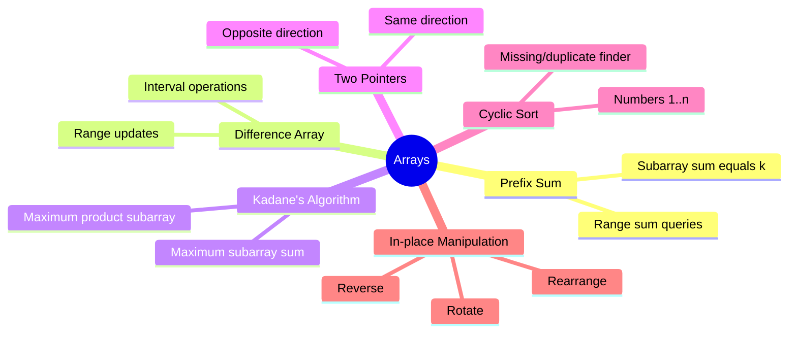

# Arrays

## Overview

Arrays are the most fundamental data structure in Python. Python lists serve as dynamic arrays with O(1) amortized append and O(n) insertion/ deletion.



## When to Use

- Need efficient element access by index
- Problems involving contiguous subarrays
- Problems requiring in-place modifications
- Range sum / range update queries
- Finding duplicates, missing numbers in 1..n

## How to Identify

- Input is a list/array of elements
- Problem asks for subarray/subsequence
- "In-place" constraint mentioned
- Numbers are in range [1, n]
- Need to compute cumulative sums or products
- "Maximum/minimum subarray sum"

## Template/Skeleton

```python
# Prefix Sum Template
def prefix_sum(arr):
    n = len(arr)
    prefix = [0] * (n + 1)
    for i in range(n):
        prefix[i + 1] = prefix[i] + arr[i]
    return prefix

# Kadane's Algorithm Template
def kadane(arr):
    max_ending = max_so_far = arr[0]
    for x in arr[1:]:
        max_ending = max(x, max_ending + x)
        max_so_far = max(max_so_far, max_ending)
    return max_so_far

# Cyclic Sort Template
def cyclic_sort(nums):
    i = 0
    while i < len(nums):
        j = nums[i] - 1
        if 0 <= j < len(nums) and nums[i] != nums[j]:
            nums[i], nums[j] = nums[j], nums[i]
        else:
            i += 1
    return nums
```

## Common Problems

### Problem 1: Two Sum

- **Problem:** Given an array of integers `nums` and an integer `target`, return indices of two numbers that add up to `target`.
- **Approach:** Use hash map to store complement. One pass.
- **Python Solution:**
  ```python
  def two_sum(nums, target):
      seen = {}
      for i, num in enumerate(nums):
          complement = target - num
          if complement in seen:
              return [seen[complement], i]
          seen[num] = i
      return []
  ```
- **Complexity:** O(n) time, O(n) space

### Problem 2: Maximum Subarray Sum (Kadane's)

- **Problem:** Find contiguous subarray with largest sum.
- **Approach:** Kadane's algorithm — maintain max ending at current and global max.
- **Python Solution:**
  ```python
  def max_subarray(nums):
      max_ending = max_so_far = nums[0]
      for x in nums[1:]:
          max_ending = max(x, max_ending + x)
          max_so_far = max(max_so_far, max_ending)
      return max_so_far
  ```
- **Complexity:** O(n) time, O(1) space

### Problem 3: Product of Array Except Self

- **Problem:** Compute product of all elements except self, without division.
- **Approach:** Left pass computes prefix products, right pass multiplies by suffix.
- **Python Solution:**
  ```python
  def product_except_self(nums):
      n = len(nums)
      result = [1] * n
      prefix = 1
      for i in range(n):
          result[i] = prefix
          prefix *= nums[i]
      suffix = 1
      for i in range(n - 1, -1, -1):
          result[i] *= suffix
          suffix *= nums[i]
      return result
  ```
- **Complexity:** O(n) time, O(1) space (excluding output)

### Problem 4: Find All Duplicates in an Array

- **Problem:** Given array of integers 1 ≤ a[i] ≤ n, find all duplicates.
- **Approach:** Use index marking — negate nums[abs(val) - 1]; if already negative, it's duplicate.
- **Python Solution:**
  ```python
  def find_duplicates(nums):
      result = []
      for num in nums:
          idx = abs(num) - 1
          if nums[idx] < 0:
              result.append(abs(num))
          nums[idx] = -nums[idx]
      return result
  ```
- **Complexity:** O(n) time, O(1) space (excluding output)

### Problem 5: Rotate Array

- **Problem:** Rotate array to the right by k steps.
- **Approach:** Reverse whole array, then reverse first k, then reverse rest.
- **Python Solution:**
  ```python
  def rotate(nums, k):
      n = len(nums)
      k %= n
      def reverse(l, r):
          while l < r:
              nums[l], nums[r] = nums[r], nums[l]
              l += 1
              r -= 1
      reverse(0, n - 1)
      reverse(0, k - 1)
      reverse(k, n - 1)
  ```
- **Complexity:** O(n) time, O(1) space

### Problem 6: First Missing Positive

- **Problem:** Find smallest missing positive integer.
- **Approach:** Cyclic sort — place each positive number at its index (val-1), then find first mismatch.
- **Python Solution:**
  ```python
  def first_missing_positive(nums):
      n = len(nums)
      for i in range(n):
          while 1 <= nums[i] <= n and nums[nums[i] - 1] != nums[i]:
              target = nums[i] - 1
              nums[i], nums[target] = nums[target], nums[i]
      for i in range(n):
          if nums[i] != i + 1:
              return i + 1
      return n + 1
  ```
- **Complexity:** O(n) time, O(1) space

## Complexity Analysis Table

| Problem | Time | Space | Difficulty |
|---------|------|-------|-----------|
| Two Sum | O(n) | O(n) | Easy |
| Maximum Subarray | O(n) | O(1) | Medium |
| Product Except Self | O(n) | O(1) | Medium |
| Find Duplicates | O(n) | O(1) | Medium |
| Rotate Array | O(n) | O(1) | Medium |
| First Missing Positive | O(n) | O(1) | Hard |

## Quick Notes

- Prefix sum converts range sum queries to O(1) (with O(n) precompute)
- Kadane's works because max subarray at position i is either the element alone or element + previous max
- For "product except self", left + right pass pattern generalizes to other cumulative operations
- Cyclic sort works when numbers are in [0, n-1] or [1, n]
- Negation marking is a common trick when range is known and we need O(1) space
- The reverse-based rotation trick works because: reverse all → reverse first k → reverse rest

## Common Mistakes

- Off-by-one in prefix sum indices (prefix[i] = sum of first i elements)
- Forgetting k %= n in rotation (k can be larger than n)
- Using extra space when O(1) is required
- Not handling negative numbers in Kadane's correctly (when all numbers are negative)
- Mutable default arguments in Python (use None instead)
- Modifying array while iterating over it

## Remember

- Arrays are the foundation for almost all other data structures
- Master in-place manipulation — many FAANG interviews test this
- Know when to trade space for time (hashmap) vs time for space (negation marking)
- Prefix sum + hashmap is a powerful combo for subarray sum problems
- Always consider the range of values in the problem — it hints at the approach

---
Author: Tamilselvan S
LinkedIn: https://www.linkedin.com/in/tamilselvan-ai/
GitHub: `your-github-username`
---
