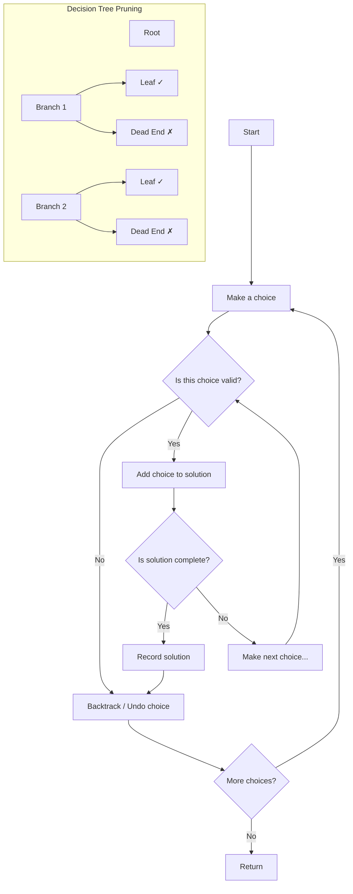

# Backtracking

## Overview

Backtracking incrementally builds candidates and abandons (backtracks from) partial candidates that cannot lead to a valid solution. It's a systematic way to try all possibilities while pruning impossible paths.



## When to Use

- Generating all permutations, combinations, subsets
- Constraint satisfaction (N-Queens, Sudoku)
- Path finding in a maze
- Problems with multiple valid solutions
- Optimization over discrete choices

## How to Identify

- "All possible combinations/permutations/subsets"
- "Generate all solutions"
- "N-Queens", "Sudoku solver"
- "Word search" (grid path)
- "Partition problem", "subset sum"
- "Restore IP addresses", "letter combinations"

## Template/Skeleton

```python
# Backtracking Template
def backtrack(candidate, state, result):
    if is_complete(candidate):
        result.append(candidate[:])  # make a copy!
        return

    for choice in get_choices(state):
        if is_valid(choice, state):
            candidate.append(choice)
            update_state(state, choice)
            backtrack(candidate, state, result)
            candidate.pop()
            restore_state(state, choice)

# Subsets Template
def subsets(nums):
    result = []
    def backtrack(start, path):
        result.append(path[:])
        for i in range(start, len(nums)):
            path.append(nums[i])
            backtrack(i + 1, path)
            path.pop()
    backtrack(0, [])
    return result

# Permutations Template
def permute(nums):
    result = []
    used = [False] * len(nums)
    def backtrack(path):
        if len(path) == len(nums):
            result.append(path[:])
            return
        for i in range(len(nums)):
            if not used[i]:
                used[i] = True
                path.append(nums[i])
                backtrack(path)
                path.pop()
                used[i] = False
    backtrack([])
    return result
```

## Common Problems

### Problem 1: Subsets

- **Problem:** Return all possible subsets (power set).
- **Approach:** At each index, decide to include or exclude.
- **Python Solution:**
  ```python
  def subsets(nums):
      result = []
      def backtrack(start, path):
          result.append(path[:])
          for i in range(start, len(nums)):
              path.append(nums[i])
              backtrack(i + 1, path)
              path.pop()
      backtrack(0, [])
      return result
  ```
- **Complexity:** O(n * 2^n) time, O(n) space

### Problem 2: Permutations

- **Problem:** Return all permutations of array (no duplicates).
- **Approach:** Track used elements, try each unused element.
- **Python Solution:**
  ```python
  def permute(nums):
      result = []
      used = [False] * len(nums)
      def backtrack(path):
          if len(path) == len(nums):
              result.append(path[:])
              return
          for i in range(len(nums)):
              if not used[i]:
                  used[i] = True
                  path.append(nums[i])
                  backtrack(path)
                  path.pop()
                  used[i] = False
      backtrack([])
      return result
  ```
- **Complexity:** O(n * n!) time, O(n) space

### Problem 3: Combination Sum

- **Problem:** Find all combinations summing to target (unlimited use of elements).
- **Approach:** Choose an element, recurse on same index (can reuse).
- **Python Solution:**
  ```python
  def combination_sum(candidates, target):
      result = []
      def backtrack(start, path, remaining):
          if remaining == 0:
              result.append(path[:])
              return
          if remaining < 0:
              return
          for i in range(start, len(candidates)):
              path.append(candidates[i])
              backtrack(i, path, remaining - candidates[i])
              path.pop()
      backtrack(0, [], target)
      return result
  ```
- **Complexity:** O(n^(target/min)) time, O(n) space

### Problem 4: N-Queens

- **Problem:** Place n queens on n x n board without attacks.
- **Approach:** Place queen per row, check columns and diagonals.
- **Python Solution:**
  ```python
  def solve_n_queens(n):
      cols = set()
      diag1 = set()  # r + c
      diag2 = set()  # r - c
      result = []
      board = [['.'] * n for _ in range(n)]

      def backtrack(r):
          if r == n:
              result.append([''.join(row) for row in board])
              return
          for c in range(n):
              if c in cols or (r + c) in diag1 or (r - c) in diag2:
                  continue
              cols.add(c)
              diag1.add(r + c)
              diag2.add(r - c)
              board[r][c] = 'Q'
              backtrack(r + 1)
              cols.remove(c)
              diag1.remove(r + c)
              diag2.remove(r - c)
              board[r][c] = '.'

      backtrack(0)
      return result
  ```
- **Complexity:** O(n!) time, O(n^2) space

### Problem 5: Sudoku Solver

- **Problem:** Fill empty cells in 9x9 Sudoku board.
- **Approach:** Find empty cell, try 1-9, validate row/col/box.
- **Python Solution:**
  ```python
  def solve_sudoku(board):
      def is_valid(r, c, val):
          for i in range(9):
              if board[r][i] == val:
                  return False
              if board[i][c] == val:
                  return False
              box_r, box_c = 3 * (r // 3) + i // 3, 3 * (c // 3) + i % 3
              if board[box_r][box_c] == val:
                  return False
          return True

      def backtrack():
          for r in range(9):
              for c in range(9):
                  if board[r][c] == '.':
                      for val in '123456789':
                          if is_valid(r, c, val):
                              board[r][c] = val
                              if backtrack():
                                  return True
                              board[r][c] = '.'
                      return False
          return True

      backtrack()
      return board
  ```
- **Complexity:** O(9^k) time (k = empty cells), O(1) space

### Problem 6: Word Search

- **Problem:** Find if word exists in 2D grid (adjacent cells).
- **Approach:** DFS + backtracking on grid, marking visited.
- **Python Solution:**
  ```python
  def exist(board, word):
      rows, cols = len(board), len(board[0])
      directions = [(1,0),(-1,0),(0,1),(0,-1)]

      def backtrack(r, c, idx):
          if idx == len(word):
              return True
          if r < 0 or r >= rows or c < 0 or c >= cols or board[r][c] != word[idx]:
              return False
          temp, board[r][c] = board[r][c], '#'
          for dr, dc in directions:
              if backtrack(r + dr, c + dc, idx + 1):
                  return True
          board[r][c] = temp
          return False

      for r in range(rows):
          for c in range(cols):
              if backtrack(r, c, 0):
                  return True
      return False
  ```
- **Complexity:** O(m * n * 4^L) time (L = word length), O(L) space

## Complexity Analysis Table

| Problem | Time | Space | Difficulty |
|---------|------|-------|-----------|
| Subsets | O(n * 2^n) | O(n) | Medium |
| Permutations | O(n * n!) | O(n) | Medium |
| Combination Sum | O(n^(t/min)) | O(n) | Medium |
| N-Queens | O(n!) | O(n^2) | Hard |
| Sudoku Solver | O(9^k) | O(1) | Hard |
| Word Search | O(mn * 4^L) | O(L) | Medium |

## Quick Notes

- Backtracking = DFS over decision tree with pruning
- Always copy the path/solution before adding to results (`path[:]`)
- The order of choices matters for optimization (prune earlier)
- Sorting helps prune in combination problems (stop early when sum exceeds target)
- Use sets for O(1) lookup in constraint checking (N-Queens)
- For grid problems, mark visited cells to avoid revisiting

## Common Mistakes

- Not copying the path when adding to results (mutations corrupt stored results)
- Missing the "undo" step after recursion (backtracking requires symmetry)
- Pruning too aggressively (cutting off valid solutions)
- Not handling duplicates in input (sort + skip same value)
- Forgetting to return after finding a solution (when only one solution is needed)
- Using mutable default arguments in the recursive function

## Remember

- The three pillars: choose, explore, unchoose
- Brute force = generate all. Backtracking = generate and prune.
- The state space is typically exponential — pruning is what makes it feasible
- Subsets use index-based selection (no reuse), permutations use used-flag
- For combination with unlimited reuse, stay at same index instead of i+1
- Backtracking on graphs (Word Search) is DFS visited marking

---
Author: Tamilselvan S
LinkedIn: https://www.linkedin.com/in/tamilselvan-ai/
GitHub: `your-github-username`
---
