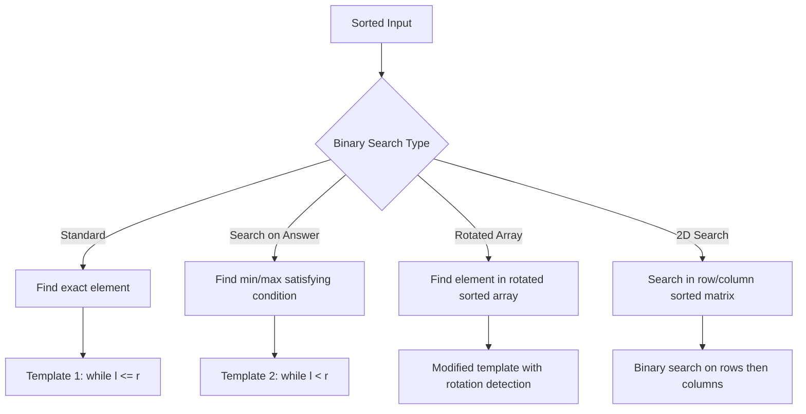

# Binary Search

## Overview

Binary search finds elements in a sorted array in O(log n) time by repeatedly dividing the search space in half. It's also applicable on answer space for optimization problems.



## When to Use

- Input is sorted (or can be sorted)
- Need to search in a monotonic function
- "Find minimum/maximum X such that condition holds"
- Problems with logarithmic time constraints
- Search space can be defined (not just array indices)

## How to Identify

- Input array is sorted
- O(log n) time complexity mentioned or implied
- Need to find boundary between two regions (first bad version, peak element)
- "Minimize max" or "maximize min" problems
- Search in rotated sorted array

## Template/Skeleton

```python
# Template 1: Basic Binary Search (find exact target)
def binary_search(nums, target):
    left, right = 0, len(nums) - 1
    while left <= right:
        mid = left + (right - left) // 2
        if nums[mid] == target:
            return mid
        elif nums[mid] < target:
            left = mid + 1
        else:
            right = mid - 1
    return -1

# Template 2: Lower Bound (first position >= target)
def lower_bound(nums, target):
    left, right = 0, len(nums)
    while left < right:
        mid = left + (right - left) // 2
        if nums[mid] >= target:
            right = mid
        else:
            left = mid + 1
    return left

# Template 3: Upper Bound (first position > target)
def upper_bound(nums, target):
    left, right = 0, len(nums)
    while left < right:
        mid = left + (right - left) // 2
        if nums[mid] <= target:
            left = mid + 1
        else:
            right = mid
    return left

# Search on Answer
def search_on_answer(condition_fn, lo, hi):
    while lo < hi:
        mid = (lo + hi) // 2
        if condition_fn(mid):
            hi = mid
        else:
            lo = mid + 1
    return lo
```

## Common Problems

### Problem 1: Binary Search (Standard)

- **Problem:** Find target in sorted array, return index or -1.
- **Approach:** Standard binary search with left <= right.
- **Python Solution:**
  ```python
  def search(nums, target):
      l, r = 0, len(nums) - 1
      while l <= r:
          m = l + (r - l) // 2
          if nums[m] == target:
              return m
          elif nums[m] < target:
              l = m + 1
          else:
              r = m - 1
      return -1
  ```
- **Complexity:** O(log n) time, O(1) space

### Problem 2: First Bad Version

- **Problem:** Find first version where isBadVersion returns True.
- **Approach:** Binary search on version space.
- **Python Solution:**
  ```python
  def first_bad_version(n):
      l, r = 1, n
      while l < r:
          m = l + (r - l) // 2
          if is_bad_version(m):
              r = m
          else:
              l = m + 1
      return l
  ```
- **Complexity:** O(log n) time, O(1) space

### Problem 3: Search in Rotated Sorted Array

- **Problem:** Find target in rotated sorted array (no duplicates).
- **Approach:** Determine which half is sorted, check if target is in it.
- **Python Solution:**
  ```python
  def search_rotated(nums, target):
      l, r = 0, len(nums) - 1
      while l <= r:
          m = l + (r - l) // 2
          if nums[m] == target:
              return m
          if nums[l] <= nums[m]:  # left half is sorted
              if nums[l] <= target < nums[m]:
                  r = m - 1
              else:
                  l = m + 1
          else:  # right half is sorted
              if nums[m] < target <= nums[r]:
                  l = m + 1
              else:
                  r = m - 1
      return -1
  ```
- **Complexity:** O(log n) time, O(1) space

### Problem 4: Find Minimum in Rotated Sorted Array

- **Problem:** Find minimum element in rotated sorted array.
- **Approach:** Binary search comparing mid with right.
- **Python Solution:**
  ```python
  def find_min(nums):
      l, r = 0, len(nums) - 1
      while l < r:
          m = l + (r - l) // 2
          if nums[m] > nums[r]:
              l = m + 1
          else:
              r = m
      return nums[l]
  ```
- **Complexity:** O(log n) time, O(1) space

### Problem 5: Koko Eating Bananas

- **Problem:** Find minimum eating speed to finish all bananas within h hours.
- **Approach:** Binary search on speed (1 to max bananas).
- **Python Solution:**
  ```python
  def min_eating_speed(piles, h):
      def can_eat(k):
          hours = sum((p + k - 1) // k for p in piles)
          return hours <= h

      l, r = 1, max(piles)
      while l < r:
          m = l + (r - l) // 2
          if can_eat(m):
              r = m
          else:
              l = m + 1
      return l
  ```
- **Complexity:** O(n log m) where m = max(piles), O(1) space

### Problem 6: Search a 2D Matrix

- **Problem:** Search in matrix where each row is sorted and first element > last of previous row.
- **Approach:** Flatten to 1D binary search using row = mid // n, col = mid % n.
- **Python Solution:**
  ```python
  def search_matrix(matrix, target):
      if not matrix or not matrix[0]:
          return False
      m, n = len(matrix), len(matrix[0])
      l, r = 0, m * n - 1
      while l <= r:
          mid = l + (r - l) // 2
          row, col = mid // n, mid % n
          val = matrix[row][col]
          if val == target:
              return True
          elif val < target:
              l = mid + 1
          else:
              r = mid - 1
      return False
  ```
- **Complexity:** O(log(m * n)) time, O(1) space

## Complexity Analysis Table

| Problem | Time | Space | Difficulty |
|---------|------|-------|-----------|
| Binary Search | O(log n) | O(1) | Easy |
| First Bad Version | O(log n) | O(1) | Easy |
| Search Rotated Array | O(log n) | O(1) | Medium |
| Find Min Rotated | O(log n) | O(1) | Medium |
| Koko Eating Bananas | O(n log m) | O(1) | Medium |
| Search 2D Matrix | O(log mn) | O(1) | Medium |

## Quick Notes

- Use `mid = left + (right - left) // 2` to avoid integer overflow (not needed in Python but it's the pattern)
- Template 1 (while left <= right) is for exact match
- Template 2 (while left < right) is for boundary finding
- The condition function in search-on-answer must be monotonic (FFF...TTT or TTT...FFF)
- In rotated array search, at least one half is always sorted
- `(p + k - 1) // k` computes ceiling division without float

## Common Mistakes

- Using `while left <= right` when `while left < right` is needed (infinite loop)
- Integer overflow in `left + right` (safe in Python but habit for other languages)
- Not handling duplicates in rotated array search (the solution breaks)
- Off-by-one in the condition function for search-on-answer
- Forgetting that 2D matrix binary search requires treating it as a flattened 1D array
- Using wrong initialization for left/right (right = len(nums) vs len(nums) - 1)

## Remember

- Binary search reduces O(n) to O(log n) — the biggest improvement in algorithms
- The "search on answer" pattern handles optimization problems: "minimize max" or "maximize min"
- Always verify the condition function is monotonic before using search-on-answer
- For rotated arrays, compare mid with left or right to determine which half is sorted
- In most interview binary search problems, the challenge is writing the condition function, not the search itself
- Practice all three templates — they handle different classes of problems

---
Author: Tamilselvan S
LinkedIn: https://www.linkedin.com/in/tamilselvan-ai/
GitHub: `your-github-username`
---
