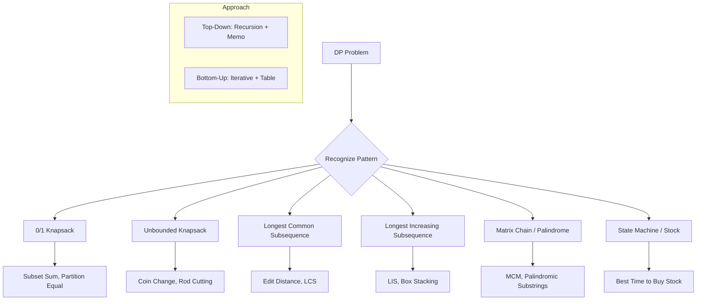

# Dynamic Programming

## Overview

Dynamic programming (DP) solves problems by breaking them into overlapping subproblems and storing results to avoid recomputation. It's optimization over plain recursion — trade space for time.



## When to Use

- Problem asks for minimum/maximum/longest/shortest
- Counting number of ways to do something
- Optimal substructure (optimal solution depends on optimal sub-solutions)
- Overlapping subproblems (same subproblems solved multiple times)

## How to Identify

- "Maximum/minimum/longest/shortest" with constraints
- "Number of ways to..."
- "Partition" or "subset" problems
- Problem mentions "at most k transactions", "at most k operations"
- Naive recursive solution revisits same states

## Template/Skeleton

```python
from functools import lru_cache

# Top-Down (Memoization) Template
def top_down_dp(problem):
    @lru_cache(None)
    def dp(state):
        # Base case
        if is_base(state):
            return base_value
        # Recurrence
        best = INF
        for choice in choices(state):
            best = max(best, dp(next_state(state, choice)) + value)
        return best
    return dp(initial_state)

# Bottom-Up (Tabulation) Template
def bottom_up_dp(arr):
    n = len(arr)
    dp = [0] * (n + 1)
    for i in range(1, n + 1):
        dp[i] = max(dp[i - 1], dp[i - 2] + value(arr[i - 1]))
    return dp[n]

# 1D DP Template (Fibonacci-like)
def fib_dp(n):
    if n <= 1:
        return n
    dp = [0] * (n + 1)
    dp[1] = 1
    for i in range(2, n + 1):
        dp[i] = dp[i - 1] + dp[i - 2]
    return dp[n]

# 2D DP Template (LCS)
def lcs_dp(text1, text2):
    m, n = len(text1), len(text2)
    dp = [[0] * (n + 1) for _ in range(m + 1)]
    for i in range(1, m + 1):
        for j in range(1, n + 1):
            if text1[i - 1] == text2[j - 1]:
                dp[i][j] = dp[i - 1][j - 1] + 1
            else:
                dp[i][j] = max(dp[i - 1][j], dp[i][j - 1])
    return dp[m][n]
```

## Common Problems

### Problem 1: Climbing Stairs

- **Problem:** Ways to climb n stairs, taking 1 or 2 steps at a time.
- **Approach:** dp[i] = dp[i-1] + dp[i-2] (same as Fibonacci).
- **Python Solution:**
  ```python
  def climb_stairs(n):
      if n <= 2:
          return n
      a, b = 1, 2
      for _ in range(3, n + 1):
          a, b = b, a + b
      return b
  ```
- **Complexity:** O(n) time, O(1) space

### Problem 2: Coin Change (Fewest Coins)

- **Problem:** Minimum coins to make amount.
- **Approach:** dp[a] = min(dp[a], dp[a - coin] + 1).
- **Python Solution:**
  ```python
  def coin_change(coins, amount):
      dp = [amount + 1] * (amount + 1)
      dp[0] = 0
      for a in range(1, amount + 1):
          for coin in coins:
              if coin <= a:
                  dp[a] = min(dp[a], dp[a - coin] + 1)
      return dp[amount] if dp[amount] != amount + 1 else -1
  ```
- **Complexity:** O(n * amount) time, O(amount) space

### Problem 3: Longest Common Subsequence

- **Problem:** Length of longest subsequence common to two strings.
- **Approach:** 2D DP — if chars match, extend; else take max of skipping one.
- **Python Solution:**
  ```python
  def longest_common_subsequence(text1, text2):
      m, n = len(text1), len(text2)
      dp = [[0] * (n + 1) for _ in range(m + 1)]
      for i in range(1, m + 1):
          for j in range(1, n + 1):
              if text1[i - 1] == text2[j - 1]:
                  dp[i][j] = dp[i - 1][j - 1] + 1
              else:
                  dp[i][j] = max(dp[i - 1][j], dp[i][j - 1])
      return dp[m][n]
  ```
- **Complexity:** O(m * n) time, O(m * n) space (O(n) optimized)

### Problem 4: 0/1 Knapsack

- **Problem:** Max value with weight capacity, each item used at most once.
- **Approach:** dp[i][w] = max(dp[i-1][w], dp[i-1][w-wt[i]] + val[i]).
- **Python Solution:**
  ```python
  def knapsack(weights, values, capacity):
      n = len(weights)
      dp = [[0] * (capacity + 1) for _ in range(n + 1)]
      for i in range(1, n + 1):
          for w in range(capacity + 1):
              if weights[i - 1] <= w:
                  dp[i][w] = max(dp[i - 1][w],
                                 dp[i - 1][w - weights[i - 1]] + values[i - 1])
              else:
                  dp[i][w] = dp[i - 1][w]
      return dp[n][capacity]
  ```
- **Complexity:** O(n * capacity) time, O(n * capacity) space (O(capacity) optimized)

### Problem 5: Longest Increasing Subsequence

- **Problem:** Length of longest increasing subsequence.
- **Approach:** dp[i] = 1 + max(dp[j]) for j < i and nums[j] < nums[i].
- **Python Solution:**
  ```python
  def length_of_lis(nums):
      tails = []
      for num in nums:
          l, r = 0, len(tails)
          while l < r:
              m = (l + r) // 2
              if tails[m] < num:
                  l = m + 1
              else:
                  r = m
          if l == len(tails):
              tails.append(num)
          else:
              tails[l] = num
      return len(tails)
  ```
- **Complexity:** O(n log n) time, O(n) space

### Problem 6: Edit Distance

- **Problem:** Minimum operations (insert/delete/replace) to convert word1 to word2.
- **Approach:** 2D DP — if chars match, copy diagonal; else 1 + min of 3 operations.
- **Python Solution:**
  ```python
  def min_distance(word1, word2):
      m, n = len(word1), len(word2)
      dp = [[0] * (n + 1) for _ in range(m + 1)]
      for i in range(m + 1):
          dp[i][0] = i
      for j in range(n + 1):
          dp[0][j] = j
      for i in range(1, m + 1):
          for j in range(1, n + 1):
              if word1[i - 1] == word2[j - 1]:
                  dp[i][j] = dp[i - 1][j - 1]
              else:
                  dp[i][j] = 1 + min(dp[i - 1][j],    # delete
                                     dp[i][j - 1],    # insert
                                     dp[i - 1][j - 1])  # replace
      return dp[m][n]
  ```
- **Complexity:** O(m * n) time, O(m * n) space

## Complexity Analysis Table

| Problem | Time | Space | Difficulty |
|---------|------|-------|-----------|
| Climbing Stairs | O(n) | O(1) | Easy |
| Coin Change | O(n * amount) | O(amount) | Medium |
| Longest Common Subsequence | O(mn) | O(mn) | Medium |
| 0/1 Knapsack | O(n * W) | O(nW) | Medium |
| Longest Increasing Subsequence | O(n log n) | O(n) | Medium |
| Edit Distance | O(mn) | O(mn) | Medium |

## Quick Notes

- State definition is the hardest part — "dp[i][j] = answer for first i of A and first j of B"
- The recurrence always relates smaller subproblems to larger ones
- Start with brute force recursion, add memoization, then convert to tabulation
- Space optimization: if dp[i] only depends on dp[i-1], use rolling array (O(1))
- For LIS, the binary search solution uses patience sorting — tails[i] = smallest tail of length i+1
- Not all optimization problems are DP — check for greedy first (Dijkstra, fractional knapsack)

## Common Mistakes

- Not initializing base cases (dp[0], empty prefixes) correctly
- Confusing iteration order (should the loop go from 0 to n or n to 0?)
- Off-by-one in dp array indexing (dp[i] vs dp[i-1])
- Forgetting to handle the "skip" case (dp[i][w] = dp[i-1][w])
- Using recursion without memoization (exponential explosion)
- Missing the "else" branch in 2D DP when chars don't match

## Remember

- DP is recursion + caching — if you can write the recurrence, you can write DP
- Bottom-up starts from smallest subproblems and builds up
- Top-down is easier to reason about, bottom-up is more space-efficient
- The three classic patterns: LCS (2D match), Knapsack (with/without), LIS (sequence)
- Always define dp[i][j] clearly in comments before coding
- For counting problems, dp[i] = sum of dp[choices]; for optimization, dp[i] = min/max of dp[choices]

---
Author: Tamilselvan S
LinkedIn: https://www.linkedin.com/in/tamilselvan-ai/
GitHub: `your-github-username`
---
