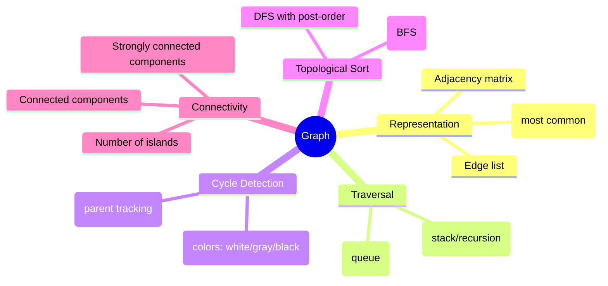

# Graph

## Overview

A graph consists of vertices (nodes) connected by edges. Graphs can be directed or undirected, weighted or unweighted. Graph problems are common in interviews and require understanding of DFS, BFS, and their variants.



## When to Use

- Relationships between entities (nodes → entities, edges → relationships)
- Path finding / shortest path
- Dependency resolution / scheduling
- Connectivity / component analysis

## How to Identify

- Input is explicitly a graph (nodes + edges)
- "Network", "connections", "friends", "cities"
- "Shortest path", "reachable", "connected"
- "Schedule courses", "dependency order"
- Matrix problems where cells are nodes and adjacent cells are edges

## Template/Skeleton

```python
from collections import defaultdict, deque

# Graph from Edge List
def build_graph(edges):
    graph = defaultdict(list)
    for u, v in edges:
        graph[u].append(v)
        graph[v].append(u)  # undirected
    return graph

# DFS Template
def dfs(graph, start):
    visited = set()
    def explore(node):
        if node in visited:
            return
        visited.add(node)
        for neighbor in graph[node]:
            explore(neighbor)
    explore(start)
    return visited

# BFS Template
def bfs(graph, start):
    visited = {start}
    queue = deque([start])
    while queue:
        node = queue.popleft()
        for neighbor in graph[node]:
            if neighbor not in visited:
                visited.add(neighbor)
                queue.append(neighbor)
    return visited

# Topological Sort (Kahn's Algorithm)
def topological_sort(n, prerequisites):
    graph = [[] for _ in range(n)]
    in_degree = [0] * n
    for course, prereq in prerequisites:
        graph[prereq].append(course)
        in_degree[course] += 1
    queue = deque([i for i in range(n) if in_degree[i] == 0])
    result = []
    while queue:
        node = queue.popleft()
        result.append(node)
        for neighbor in graph[node]:
            in_degree[neighbor] -= 1
            if in_degree[neighbor] == 0:
                queue.append(neighbor)
    return result if len(result) == n else []
```

## Common Problems

### Problem 1: Number of Islands

- **Problem:** Count connected islands (1s) in a 2D grid.
- **Approach:** DFS/BFS on each unvisited '1', mark visited.
- **Python Solution:**
  ```python
  def num_islands(grid):
      if not grid:
          return 0
      rows, cols = len(grid), len(grid[0])
      visited = set()
      islands = 0
      def dfs(r, c):
          if (r, c) in visited or r < 0 or r >= rows or c < 0 or c >= cols or grid[r][c] == '0':
              return
          visited.add((r, c))
          dfs(r + 1, c)
          dfs(r - 1, c)
          dfs(r, c + 1)
          dfs(r, c - 1)
      for r in range(rows):
          for c in range(cols):
              if grid[r][c] == '1' and (r, c) not in visited:
                  islands += 1
                  dfs(r, c)
      return islands
  ```
- **Complexity:** O(m * n) time, O(m * n) space

### Problem 2: Course Schedule (Cycle Detection)

- **Problem:** Determine if all courses can be completed (no cycle in prerequisites).
- **Approach:** Topological sort using Kahn's algorithm (BFS).
- **Python Solution:**
  ```python
  def can_finish(num_courses, prerequisites):
      graph = [[] for _ in range(num_courses)]
      in_degree = [0] * num_courses
      for course, prereq in prerequisites:
          graph[prereq].append(course)
          in_degree[course] += 1
      queue = deque([i for i in range(num_courses) if in_degree[i] == 0])
      count = 0
      while queue:
          node = queue.popleft()
          count += 1
          for neighbor in graph[node]:
              in_degree[neighbor] -= 1
              if in_degree[neighbor] == 0:
                  queue.append(neighbor)
      return count == num_courses
  ```
- **Complexity:** O(V + E) time, O(V + E) space

### Problem 3: Clone Graph

- **Problem:** Deep copy of undirected graph.
- **Approach:** DFS/BFS with hashmap mapping original → clone.
- **Python Solution:**
  ```python
  def clone_graph(node):
      if not node:
          return None
      clones = {}
      def dfs(original):
          if original in clones:
              return clones[original]
          clone = Node(original.val)
          clones[original] = clone
          for neighbor in original.neighbors:
              clone.neighbors.append(dfs(neighbor))
          return clone
      return dfs(node)
  ```
- **Complexity:** O(V + E) time, O(V) space

### Problem 4: Word Ladder

- **Problem:** Shortest transformation sequence from beginWord to endWord.
- **Approach:** BFS on implicit graph (words differ by one letter).
- **Python Solution:**
  ```python
  def ladder_length(begin_word, end_word, word_list):
      word_set = set(word_list)
      if end_word not in word_set:
          return 0
      queue = deque([(begin_word, 1)])
      visited = {begin_word}
      while queue:
          word, length = queue.popleft()
          if word == end_word:
              return length
          for i in range(len(word)):
              for c in 'abcdefghijklmnopqrstuvwxyz':
                  next_word = word[:i] + c + word[i+1:]
                  if next_word in word_set and next_word not in visited:
                      visited.add(next_word)
                      queue.append((next_word, length + 1))
      return 0
  ```
- **Complexity:** O(n * L * 26) time, O(n) space

### Problem 5: Pacific Atlantic Water Flow

- **Problem:** Cells where water can flow to both oceans.
- **Approach:** DFS from borders of both oceans inward.
- **Python Solution:**
  ```python
  def pacific_atlantic(heights):
      if not heights:
          return []
      rows, cols = len(heights), len(heights[0])
      pacific = [[False] * cols for _ in range(rows)]
      atlantic = [[False] * cols for _ in range(rows)]

      def dfs(r, c, ocean):
          ocean[r][c] = True
          for dr, dc in [(1,0),(-1,0),(0,1),(0,-1)]:
              nr, nc = r + dr, c + dc
              if 0 <= nr < rows and 0 <= nc < cols and not ocean[nr][nc] and heights[nr][nc] >= heights[r][c]:
                  dfs(nr, nc, ocean)

      for c in range(cols):
          dfs(0, c, pacific)
          dfs(rows - 1, c, atlantic)
      for r in range(rows):
          dfs(r, 0, pacific)
          dfs(r, cols - 1, atlantic)

      return [[r, c] for r in range(rows) for c in range(cols) if pacific[r][c] and atlantic[r][c]]
  ```
- **Complexity:** O(m * n) time, O(m * n) space

### Problem 6: Graph Valid Tree

- **Problem:** Check if graph forms a valid tree (connected + no cycles).
- **Approach:** Union-Find or DFS.
- **Python Solution:**
  ```python
  def valid_tree(n, edges):
      if len(edges) != n - 1:
          return False
      parent = list(range(n))
      rank = [0] * n
      def find(x):
          if parent[x] != x:
              parent[x] = find(parent[x])
          return parent[x]
      def union(x, y):
          px, py = find(x), find(y)
          if px == py:
              return False
          if rank[px] < rank[py]:
              parent[px] = py
          elif rank[px] > rank[py]:
              parent[py] = px
          else:
              parent[py] = px
              rank[px] += 1
          return True
      for u, v in edges:
          if not union(u, v):
              return False
      return True
  ```
- **Complexity:** O(n * α(n)) time, O(n) space

## Complexity Analysis Table

| Problem | Time | Space | Difficulty |
|---------|------|-------|-----------|
| Number of Islands | O(mn) | O(mn) | Medium |
| Course Schedule | O(V+E) | O(V+E) | Medium |
| Clone Graph | O(V+E) | O(V) | Medium |
| Word Ladder | O(n*L*26) | O(n) | Hard |
| Pacific Atlantic | O(mn) | O(mn) | Medium |
| Graph Valid Tree | O(n*α(n)) | O(n) | Medium |

## Quick Notes

- Adjacency list is the most common graph representation in interviews
- BFS finds shortest path in unweighted graphs
- For cycle detection in directed graphs, use 3-color DFS (white/gray/black)
- Topological sort only exists in DAGs (directed acyclic graphs)
- For grid problems, think of each cell as a node connected to 4 neighbors
- DFS uses recursion/stack, BFS uses queue

## Common Mistakes

- Not handling disconnected graphs — DFS/BFS from one start point won't visit everything
- Forgetting visited set causing infinite loops in cyclic graphs
- Confusing directed vs undirected adjacency list construction (add both edges only for undirected)
- Using DFS for shortest path (shorter != faster for unweighted — use BFS)
- Not resetting visited state per path in backtracking problems
- Stack overflow from deep recursion in DFS on large graphs

## Remember

- Graph problems are about choosing the right traversal: BFS for shortest/level, DFS for connectivity/paths
- Topological sort = linear ordering of dependencies
- Union-Find is excellent for connectivity queries (disjoint-set union)
- Grid problems ARE graph problems — each cell is a node
- Adjacency list is almost always better than adjacency matrix (sparse graphs)
- "Visited" is the most important concept — without it, you get infinite loops

---
Author: Tamilselvan S
LinkedIn: https://www.linkedin.com/in/tamilselvan-ai/
GitHub: `your-github-username`
---
