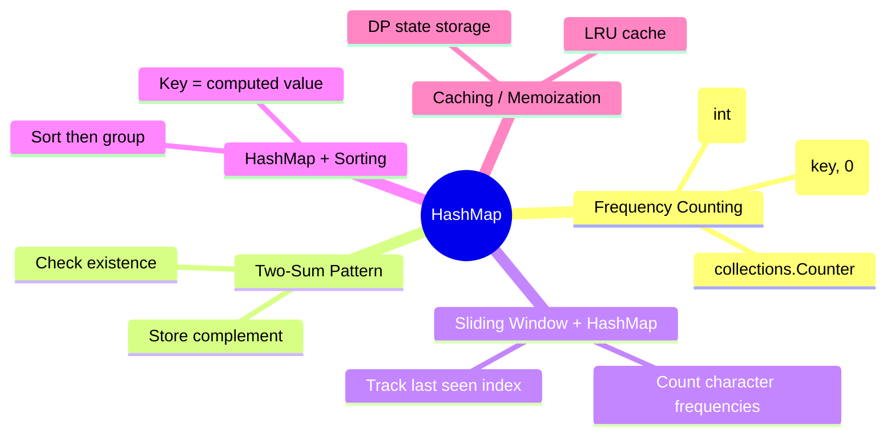

# HashMap

## Overview

Hash maps (dictionaries) are Python's most versatile data structure. They provide O(1) average-case insert, delete, and lookup operations by hashing keys to buckets.



## When to Use

- Need fast lookup by key
- Counting element frequencies
- Grouping elements by computed property
- Detecting duplicates / finding pairs
- Caching expensive computations

## How to Identify

- "Find a pair that sums to target"
- "Count frequency of elements"
- "Group by some property"
- "Check if element exists"
- "Most frequent / least frequent"
- Problem involves O(n^2) naive that could be O(n) with a map

## Template/Skeleton

```python
from collections import Counter, defaultdict

# Frequency Counter
def freq_counter(arr):
    freq = {}
    for x in arr:
        freq[x] = freq.get(x, 0) + 1
    # Or use Counter:
    # return Counter(arr)

# Group By Key
def group_by(arr, key_fn):
    groups = defaultdict(list)
    for item in arr:
        groups[key_fn(item)].append(item)
    return dict(groups)

# Two-Sum Pattern
def find_pair(arr, target):
    seen = {}
    for i, x in enumerate(arr):
        if target - x in seen:
            return [seen[target - x], i]
        seen[x] = i
    return []
```

## defaultdict vs dict vs Counter

| Feature | dict | defaultdict | Counter |
|---------|------|-------------|---------|
| Default value | Manual (.get or setdefault) | Auto (int → 0, list → []) | Auto (missing = 0) |
| Most common | Manual sort | Manual sort | .most_common(n) |
| Count elements | freq.get(x, 0) + 1 | freq[x] += 1 | Counter(arr) |
| Update counts | Manual loop | Manual loop | .update(arr2) |
| Math operations | Manual | Manual | +, -, &, \| operators |
| Use case | General purpose | Grouping, counting | Frequency analysis |

## Common Problems

### Problem 1: Two Sum

- **Problem:** Return indices of two numbers that add to target.
- **Approach:** One pass with hashmap storing complement.
- **Python Solution:**
  ```python
  def two_sum(nums, target):
      seen = {}
      for i, num in enumerate(nums):
          complement = target - num
          if complement in seen:
              return [seen[complement], i]
          seen[num] = i
      return []
  ```
- **Complexity:** O(n) time, O(n) space

### Problem 2: Group Anagrams

- **Problem:** Group strings that are anagrams of each other.
- **Approach:** Use sorted string as key in defaultdict(list).
- **Python Solution:**
  ```python
  def group_anagrams(strs):
      groups = defaultdict(list)
      for s in strs:
          key = "".join(sorted(s))
          groups[key].append(s)
      return list(groups.values())
  ```
- **Complexity:** O(n * k log k) time, O(n * k) space

### Problem 3: Top K Frequent Elements

- **Problem:** Return k most frequent elements.
- **Approach:** Count frequencies, then use bucket sort or heap.
- **Python Solution:**
  ```python
  def top_k_frequent(nums, k):
      freq = Counter(nums)
      bucket = [[] for _ in range(len(nums) + 1)]
      for num, count in freq.items():
          bucket[count].append(num)
      result = []
      for i in range(len(bucket) - 1, 0, -1):
          for num in bucket[i]:
              result.append(num)
              if len(result) == k:
                  return result
      return result
  ```
- **Complexity:** O(n) time, O(n) space (bucket sort variant)

### Problem 4: Longest Consecutive Sequence

- **Problem:** Find length of longest consecutive elements sequence.
- **Approach:** Use set for O(1) lookup, only start counting from smallest in sequence.
- **Python Solution:**
  ```python
  def longest_consecutive(nums):
      num_set = set(nums)
      longest = 0
      for num in num_set:
          if num - 1 not in num_set:  # start of a sequence
              length = 1
              while num + length in num_set:
                  length += 1
              longest = max(longest, length)
      return longest
  ```
- **Complexity:** O(n) time, O(n) space

### Problem 5: Subarray Sum Equals K

- **Problem:** Count subarrays summing to k.
- **Approach:** Prefix sum + hashmap counting frequencies of prefix sums.
- **Python Solution:**
  ```python
  def subarray_sum(nums, k):
      prefix_sum = 0
      count = 0
      sum_freq = {0: 1}
      for num in nums:
          prefix_sum += num
          count += sum_freq.get(prefix_sum - k, 0)
          sum_freq[prefix_sum] = sum_freq.get(prefix_sum, 0) + 1
      return count
  ```
- **Complexity:** O(n) time, O(n) space

### Problem 6: Valid Sudoku

- **Problem:** Determine if Sudoku board is valid.
- **Approach:** Use sets for rows, columns, and 3×3 boxes.
- **Python Solution:**
  ```python
  def is_valid_sudoku(board):
      rows = [set() for _ in range(9)]
      cols = [set() for _ in range(9)]
      boxes = [set() for _ in range(9)]
      for i in range(9):
          for j in range(9):
              val = board[i][j]
              if val == '.':
                  continue
              box_idx = (i // 3) * 3 + (j // 3)
              if val in rows[i] or val in cols[j] or val in boxes[box_idx]:
                  return False
              rows[i].add(val)
              cols[j].add(val)
              boxes[box_idx].add(val)
      return True
  ```
- **Complexity:** O(81) = O(1) time, O(1) space

## Complexity Analysis Table

| Problem | Time | Space | Difficulty |
|---------|------|-------|-----------|
| Two Sum | O(n) | O(n) | Easy |
| Group Anagrams | O(nk log k) | O(nk) | Medium |
| Top K Frequent | O(n) | O(n) | Medium |
| Longest Consecutive | O(n) | O(n) | Medium |
| Subarray Sum Equals K | O(n) | O(n) | Medium |
| Valid Sudoku | O(1) | O(1) | Medium |

## Quick Notes

- Python dicts preserve insertion order (Python 3.7+)
- `defaultdict` and `Counter` reduce boilerplate for counting
- Use `setdefault` sparingly — it always creates the default value
- Counter has `most_common(n)` and supports addition/subtraction
- Dictionary keys must be hashable (lists, dicts, sets are not)
- Use `frozenset` or tuple for hashable composite keys

## Common Mistakes

- Using mutable objects (list, dict) as dictionary keys — use tuple instead
- Forgetting that `defaultdict(lambda: 0)` vs `defaultdict(int)` both work but mean different things
- Assuming Counter preserves insertion order of most_common results
- Not knowing that `dict.get(key)` returns None for missing keys (silent failure)
- Modifying dict while iterating over it (use list(dict.items()) to iterate over snapshot)
- Overusing dict when set would suffice (membership checks)

## Remember

- HashMap trades space for time — O(n) space for O(1) lookup
- The "two-sum" pattern generalizes: store what you've seen, check future
- Prefix sum + hashmap is a top interview pattern for subarray problems
- For grouping, `defaultdict(list)` is cleaner than `dict.setdefault`
- When key range is known and small, use an array instead (faster, less memory)
- Counter is optimized for counting — use it unless you need specialized behavior

---
Author: Tamilselvan S
LinkedIn: https://www.linkedin.com/in/tamilselvan-ai/
GitHub: `your-github-username`
---
