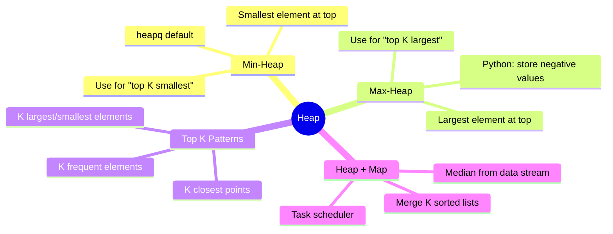

# Heap

## Overview

A heap is a specialized tree-based data structure satisfying the heap property. In a min-heap, the parent is always ≤ its children. Python's `heapq` implements a min-heap. For max-heap, store negative values.



## When to Use

- Need quick access to min/max element
- "Top K" or "K smallest/largest" problems
- Merge K sorted data streams
- Median tracking in data stream
- Priority-based processing

## How to Identify

- "K largest", "K smallest", "K closest"
- "Top K frequent elements"
- "Merge K sorted lists/arrays"
- "Median in a data stream"
- "Find minimum/maximum element dynamically"

## Template/Skeleton

```python
import heapq

# Min-Heap Basic Usage
def min_heap_demo():
    heap = [3, 1, 4, 1, 5]
    heapq.heapify(heap)          # O(n)
    smallest = heapq.heappop(heap)  # O(log n)
    heapq.heappush(heap, 2)      # O(log n)

# Max-Heap (store negatives)
def max_heap_demo(arr):
    max_heap = [-x for x in arr]
    heapq.heapify(max_heap)
    return -heapq.heappop(max_heap)

# Top K Largest Elements
def top_k_largest(nums, k):
    return heapq.nlargest(k, nums)

# Top K Smallest Elements
def top_k_smallest(nums, k):
    return heapq.nsmallest(k, nums)

# K Largest Elements (custom, using min-heap of size k)
def top_k_largest_custom(nums, k):
    heap = nums[:k]
    heapq.heapify(heap)
    for num in nums[k:]:
        if num > heap[0]:
            heapq.heapreplace(heap, num)
    return heap
```

## Common Problems

### Problem 1: Kth Largest Element in an Array

- **Problem:** Find kth largest element.
- **Approach:** Min-heap of size k.
- **Python Solution:**
  ```python
  def find_kth_largest(nums, k):
      heap = nums[:k]
      heapq.heapify(heap)
      for num in nums[k:]:
          if num > heap[0]:
              heapq.heapreplace(heap, num)
      return heap[0]
  ```
- **Complexity:** O(n log k) time, O(k) space

### Problem 2: Top K Frequent Elements

- **Problem:** Return k most frequent elements.
- **Approach:** Count frequencies, then min-heap or bucket sort.
- **Python Solution:**
  ```python
  def top_k_frequent(nums, k):
      freq = Counter(nums)
      heap = []
      for num, count in freq.items():
          heapq.heappush(heap, (count, num))
          if len(heap) > k:
              heapq.heappop(heap)
      return [num for _, num in heap]
  ```
- **Complexity:** O(n log k) time, O(n + k) space

### Problem 3: Find Median from Data Stream

- **Problem:** Return median as numbers are added.
- **Approach:** Two heaps — max-heap for left half, min-heap for right half.
- **Python Solution:**
  ```python
  class MedianFinder:
      def __init__(self):
          self.small = []  # max-heap (store negatives)
          self.large = []  # min-heap

      def add_num(self, num):
          heapq.heappush(self.small, -num)
          # balance
          if self.small and self.large and (-self.small[0]) > self.large[0]:
              val = -heapq.heappop(self.small)
              heapq.heappush(self.large, val)
          # maintain size invariant
          if len(self.small) > len(self.large) + 1:
              val = -heapq.heappop(self.small)
              heapq.heappush(self.large, val)
          if len(self.large) > len(self.small):
              val = heapq.heappop(self.large)
              heapq.heappush(self.small, -val)

      def find_median(self):
          if len(self.small) > len(self.large):
              return -self.small[0]
          return (-self.small[0] + self.large[0]) / 2
  ```
- **Complexity:** O(log n) per add, O(1) median retrieval, O(n) space

### Problem 4: Merge K Sorted Lists

- **Problem:** Merge k sorted linked lists.
- **Approach:** Min-heap of (value, index, node).
- **Python Solution:**
  ```python
  def merge_k_lists(lists):
      heap = []
      for i, lst in enumerate(lists):
          if lst:
              heapq.heappush(heap, (lst.val, i, lst))
      dummy = curr = ListNode()
      while heap:
          val, i, node = heapq.heappop(heap)
          curr.next = ListNode(val)
          curr = curr.next
          if node.next:
              heapq.heappush(heap, (node.next.val, i, node.next))
      return dummy.next
  ```
- **Complexity:** O(n log k) time, O(k) space

### Problem 5: K Closest Points to Origin

- **Problem:** Find k points closest to (0,0).
- **Approach:** Max-heap of k points (negate distance).
- **Python Solution:**
  ```python
  def k_closest(points, k):
      heap = []
      for x, y in points:
          dist = x*x + y*y
          heapq.heappush(heap, (-dist, x, y))
          if len(heap) > k:
              heapq.heappop(heap)
      return [(x, y) for _, x, y in heap]
  ```
- **Complexity:** O(n log k) time, O(k) space

### Problem 6: Task Scheduler

- **Problem:** Minimum interval to execute tasks with cooldown.
- **Approach:** Max-heap for frequency, queue for cooldown.
- **Python Solution:**
  ```python
  def least_interval(tasks, n):
      freq = Counter(tasks)
      max_heap = [-f for f in freq.values()]
      heapq.heapify(max_heap)
      time = 0
      cooldown = deque()
      while max_heap or cooldown:
          time += 1
          if max_heap:
              count = 1 + heapq.heappop(max_heap)
              if count < 0:
                  cooldown.append((count, time + n))
          if cooldown and cooldown[0][1] == time:
              heapq.heappush(max_heap, cooldown.popleft()[0])
      return time
  ```
- **Complexity:** O(n log k) time, O(k) space

## Complexity Analysis Table

| Problem | Time | Space | Difficulty |
|---------|------|-------|-----------|
| Kth Largest Element | O(n log k) | O(k) | Medium |
| Top K Frequent | O(n log k) | O(n) | Medium |
| Median from Stream | O(log n) per add | O(n) | Hard |
| Merge K Sorted Lists | O(n log k) | O(k) | Hard |
| K Closest Points | O(n log k) | O(k) | Medium |
| Task Scheduler | O(n log k) | O(k) | Medium |

## Quick Notes

- Python's heapq is a MIN-heap. For max-heap, negate values.
- `heapify` is O(n), not O(n log n) — it uses Floyd's algorithm
- `heappushpop` and `heapreplace` combine push+pop in optimized single O(log n) operation
- For Top K problems, maintain a heap of size k to get O(n log k) instead of O(n log n)
- `nlargest` and `nsmallest` are optimized for single-use queries
- Two-heap pattern (median finding) generalizes to other streaming quantile problems

## Common Mistakes

- Using heap where a sorted array would be simpler (if data doesn't change)
- Forgetting heapq is min-heap only — no direct max-heap support
- Not including both value and tiebreaker in heap tuple (heapq ties break on second element)
- Modifying heapq elements in-place (heapq doesn't track changes — must push/pop)
- Using heap when you need a monotonic stack (different patterns)
- Forgetting that heap elements are compared lexicographically in tuples

## Remember

- Heap gives O(log n) push/pop with O(1) peek — it's not a sorter
- Top K → use min-heap of size k (pop smallest when exceeding k)
- Bottom K → use max-heap of size k (negate values)
- Two heaps + balance = running median
- If you need both insert and extract-min/max, consider a heap
- Heap + hashmap for dynamic priority updates (like Dijkstra's)
- For static all-at-once queries, sorting is often faster than heap

---
Author: Tamilselvan S
LinkedIn: https://www.linkedin.com/in/tamilselvan-ai/
GitHub: `your-github-username`
---
