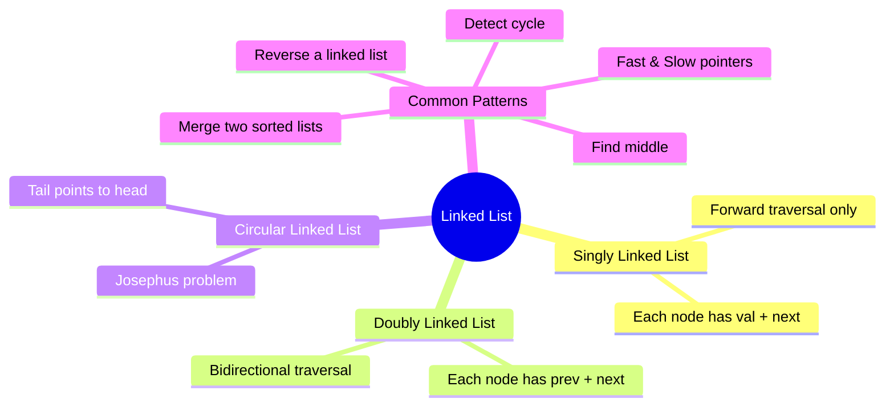

# Linked List

## Overview

A linked list is a linear data structure where elements (nodes) are connected by pointers. Unlike arrays, linked lists allow O(1) insertion/deletion at known positions but require O(n) to access arbitrary elements.



## When to Use

- Frequent insertions/deletions at arbitrary positions
- Size unknown or dynamic
- Implementing LRU cache (doubly linked + hashmap)
- Problems involving list reversal or cycle detection
- Merging sorted lists

## How to Identify

- "Linked list" is explicitly mentioned
- Operations at head/tail are frequent
- Need to reverse or cycle-check
- "Add two numbers" represented as linked list
- "Merge", "intersection", "partition" of lists

## Template/Skeleton

```python
class ListNode:
    def __init__(self, val=0, next=None):
        self.val = val
        self.next = next

# Reverse Linked List
def reverse_list(head):
    prev = None
    curr = head
    while curr:
        next_node = curr.next
        curr.next = prev
        prev = curr
        curr = next_node
    return prev

# Fast & Slow Pointer (Middle of List)
def middle_node(head):
    slow = fast = head
    while fast and fast.next:
        slow = slow.next
        fast = fast.next.next
    return slow

# Detect Cycle
def has_cycle(head):
    slow = fast = head
    while fast and fast.next:
        slow = slow.next
        fast = fast.next.next
        if slow == fast:
            return True
    return False
```

## ASCII Diagram: Linked List Operations

```
Singly Linked List:
   ┌──────┐    ┌──────┐    ┌──────┐    ┌──────┐
   │ 1 │ ─┼───→│ 2 │ ─┼───→│ 3 │ ─┼───→│None │
   └──────┘    └──────┘    └──────┘    └──────┘

Reverse:
   Before: 1 → 2 → 3 → None
           ──────────────────→
   Step 1: None ← 1   2 → 3 → None
                    ─────→
   Step 2: None ← 1 ← 2   3 → None
                         ─────→
   Step 3: None ← 1 ← 2 ← 3
   Result: 3 → 2 → 1 → None

Fast & Slow Pointers (Cycle Detection):
   ┌──────┐    ┌──────┐    ┌──────┐
   │ 1 │ ─┼───→│ 2 │ ─┼───→│ 3 │ ─┼──┐
   └──────┘    └──────┘    └──────┘   │
      ^                                │
      │   ┌──────┐    ┌──────┐         │
      └───│ 5 │ ◄─┼───│ 4 │ ◄─┼────────┘
          └──────┘    └──────┘

   slow: 1 → 2 → 3 → 4 → 5 ... enters cycle
   fast: 1 → 3 → 5 → 3 → 5 ... loops in cycle
   They meet → cycle detected!

Merge Two Sorted Lists:
   List A: 1 → 3 → 5 → 7
   List B: 2 → 4 → 6 → 8
   Result: 1 → 2 → 3 → 4 → 5 → 6 → 7 → 8

   dummy → 1 → 2 → 3 → 4 → 5 → 6 → 7 → 8
           ↑ current pointer picks smaller
```

## Common Problems

### Problem 1: Reverse Linked List

- **Problem:** Reverse a singly linked list.
- **Approach:** Iterative — three pointers (prev, curr, next).
- **Python Solution:**
  ```python
  def reverse_list(head):
      prev = None
      curr = head
      while curr:
          next_node = curr.next
          curr.next = prev
          prev = curr
          curr = next_node
      return prev
  ```
- **Complexity:** O(n) time, O(1) space

### Problem 2: Linked List Cycle

- **Problem:** Detect if linked list has a cycle.
- **Approach:** Floyd's cycle detection (fast & slow pointer).
- **Python Solution:**
  ```python
  def has_cycle(head):
      slow = fast = head
      while fast and fast.next:
          slow = slow.next
          fast = fast.next.next
          if slow == fast:
              return True
      return False
  ```
- **Complexity:** O(n) time, O(1) space

### Problem 3: Merge Two Sorted Lists

- **Problem:** Merge two sorted linked lists.
- **Approach:** Dummy node, pick smaller each step.
- **Python Solution:**
  ```python
  def merge_two_lists(l1, l2):
      dummy = curr = ListNode()
      while l1 and l2:
          if l1.val < l2.val:
              curr.next = l1
              l1 = l1.next
          else:
              curr.next = l2
              l2 = l2.next
          curr = curr.next
      curr.next = l1 or l2
      return dummy.next
  ```
- **Complexity:** O(n + m) time, O(1) space

### Problem 4: Remove Nth Node From End

- **Problem:** Remove nth node from end in one pass.
- **Approach:** Dummy + fast advances n steps, then slow/fast together.
- **Python Solution:**
  ```python
  def remove_nth_from_end(head, n):
      dummy = ListNode(0, head)
      slow = fast = dummy
      for _ in range(n):
          fast = fast.next
      while fast.next:
          slow = slow.next
          fast = fast.next
      slow.next = slow.next.next
      return dummy.next
  ```
- **Complexity:** O(n) time, O(1) space

### Problem 5: Intersection of Two Linked Lists

- **Problem:** Find node where two linked lists intersect.
- **Approach:** Two pointers, align by swapping heads after null.
- **Python Solution:**
  ```python
  def get_intersection_node(headA, headB):
      if not headA or not headB:
          return None
      a, b = headA, headB
      while a is not b:
          a = a.next if a else headB
          b = b.next if b else headA
      return a
  ```
- **Complexity:** O(n + m) time, O(1) space

### Problem 6: Palindrome Linked List

- **Problem:** Check if linked list is palindrome.
- **Approach:** Find middle, reverse second half, compare.
- **Python Solution:**
  ```python
  def is_palindrome(head):
      if not head or not head.next:
          return True
      # Find middle
      slow = fast = head
      while fast.next and fast.next.next:
          slow = slow.next
          fast = fast.next.next
      # Reverse second half
      prev = None
      curr = slow.next
      while curr:
          next_node = curr.next
          curr.next = prev
          prev = curr
          curr = next_node
      # Compare
      first, second = head, prev
      while second:
          if first.val != second.val:
              return False
          first = first.next
          second = second.next
      return True
  ```
- **Complexity:** O(n) time, O(1) space

## Complexity Analysis Table

| Problem | Time | Space | Difficulty |
|---------|------|-------|-----------|
| Reverse Linked List | O(n) | O(1) | Easy |
| Detect Cycle | O(n) | O(1) | Easy |
| Merge Two Sorted Lists | O(n+m) | O(1) | Easy |
| Remove Nth From End | O(n) | O(1) | Medium |
| Intersection of Two Lists | O(n+m) | O(1) | Easy |
| Palindrome Linked List | O(n) | O(1) | Medium |

## Quick Notes

- Dummy node pattern eliminates edge cases (empty list, single node)
- Fast/slow pointer covers cycle detection, finding middle, and finding nth from end
- Reverse linked list is a building block for many harder problems
- Merging two lists uses the same two-pointer idea as merge sort
- For problems involving "nth from end", advance fast by n then walk together
- The intersection algorithm works because both pointers travel the same total distance

## Common Mistakes

- Forgetting to check `fast.next` before `fast.next.next` (None pointer error)
- Losing reference to next node when reassigning pointers
- Not using a dummy node for head-modifying operations
- Off-by-one in the middle-finding logic (to handle even/odd length)
- Creating cycles by forgetting to set terminating node's next to None
- Not handling edge cases (empty list, single node, two nodes)

## Remember

- Linked lists test pointer manipulation skills — draw the pointers first
- Three pointers (prev, curr, next) are essential for reversal
- Fast/slow pointer is also called Floyd's Tortoise and Hare
- Always draw a diagram before coding linked list problems
- Dummy nodes simplify head modification (remove, reverse, merge)
- Space O(1) is a common constraint — avoid converting to array unless allowed

---
Author: Tamilselvan S
LinkedIn: https://www.linkedin.com/in/tamilselvan-ai/
GitHub: `your-github-username`
---
