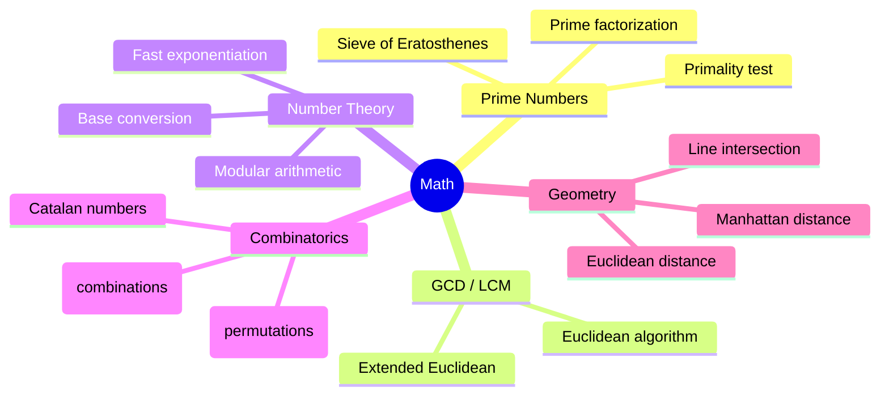

# Math

## Overview

Mathematical patterns appear frequently in coding interviews. Understanding number theory, combinatorics, and basic geometry can give you the edge on problems that don't fit standard data structure patterns.



## When to Use

- Problems involving divisibility, factors, or multiples
- Counting combinations or permutations
- Problems with prime numbers
- Geometry problems (distance, area, intersection)
- Number base conversion
- Large exponentiation with modulo

## How to Identify

- "Prime", "factor", "divisible", "GCD", "LCM"
- "nCr", "nPr", "permutations", "combinations"
- "Modulo 10^9 + 7"
- "Points on a plane", "Manhattan distance"
- "Power", "exponent", "base conversion"

## Template/Skeleton

```python
# Sieve of Eratosthenes
def sieve(n):
    is_prime = [True] * (n + 1)
    is_prime[0] = is_prime[1] = False
    for i in range(2, int(n ** 0.5) + 1):
        if is_prime[i]:
            for j in range(i * i, n + 1, i):
                is_prime[j] = False
    return [i for i in range(n + 1) if is_prime[i]]

# GCD (Euclidean Algorithm)
def gcd(a, b):
    return a if b == 0 else gcd(b, a % b)

# LCM
def lcm(a, b):
    return a * b // gcd(a, b)

# Fast Exponentiation (modular)
def pow_mod(base, exp, mod):
    result = 1
    while exp:
        if exp & 1:
            result = (result * base) % mod
        base = (base * base) % mod
        exp >>= 1
    return result

# nCr using math.comb (Python 3.8+)
from math import comb
def nCr(n, r):
    return comb(n, r)

# nCr using iterative formula
def nCr_iter(n, r):
    if r > n - r:
        r = n - r
    result = 1
    for i in range(r):
        result = result * (n - i) // (i + 1)
    return result
```

## Common Problems

### Problem 1: Count Primes

- **Problem:** Count primes less than n.
- **Approach:** Sieve of Eratosthenes.
- **Python Solution:**
  ```python
  def count_primes(n):
      if n <= 2:
          return 0
      is_prime = [True] * n
      is_prime[0] = is_prime[1] = False
      for i in range(2, int(n ** 0.5) + 1):
          if is_prime[i]:
              is_prime[i * i:n:i] = [False] * ((n - 1 - i * i) // i + 1)
      return sum(is_prime)
  ```
- **Complexity:** O(n log log n) time, O(n) space

### Problem 2: Happy Number

- **Problem:** Determine if number is happy (sum of squares of digits eventually equals 1).
- **Approach:** Use set to detect cycles, or Floyd's cycle detection.
- **Python Solution:**
  ```python
  def is_happy(n):
      def sum_squares(num):
          total = 0
          while num:
              total += (num % 10) ** 2
              num //= 10
          return total

      seen = set()
      while n != 1 and n not in seen:
          seen.add(n)
          n = sum_squares(n)
      return n == 1
  ```
- **Complexity:** O(log n) time per iteration, O(log n) space

### Problem 3: Excel Sheet Column Number

- **Problem:** Convert column title to number (A=1, Z=26, AA=27...).
- **Approach:** Base-26 conversion.
- **Python Solution:**
  ```python
  def title_to_number(column_title):
      result = 0
      for ch in column_title:
          result = result * 26 + (ord(ch) - ord('A') + 1)
      return result
  ```
- **Complexity:** O(n) time, O(1) space

### Problem 4: Pow(x, n)

- **Problem:** Compute x raised to power n (including negative exponents).
- **Approach:** Fast exponentiation (binary exponentiation).
- **Python Solution:**
  ```python
  def my_pow(x, n):
      if n < 0:
          x = 1 / x
          n = -n
      result = 1
      while n:
          if n & 1:
              result *= x
          x *= x
          n >>= 1
      return result
  ```
- **Complexity:** O(log n) time, O(1) space

### Problem 5: Unique Paths (Combinatorics)

- **Problem:** Number of unique paths from top-left to bottom-right in m x n grid.
- **Approach:** Combinatorics — need (m-1) down and (n-1) right moves = C(m+n-2, m-1).
- **Python Solution:**
  ```python
  def unique_paths(m, n):
      # C(m + n - 2, m - 1)
      total = m + n - 2
      k = min(m - 1, n - 1)
      result = 1
      for i in range(1, k + 1):
          result = result * (total - k + i) // i
      return result
  ```
- **Complexity:** O(min(m, n)) time, O(1) space

### Problem 6: Rectangle Overlap

- **Problem:** Determine if two rectangles overlap (axis-aligned).
- **Approach:** Check if one rectangle is to the left/above/below/right of the other.
- **Python Solution:**
  ```python
  def is_rectangle_overlap(rec1, rec2):
      # rec = [x1, y1, x2, y2]
      x1, y1, x2, y2 = rec1
      x3, y3, x4, y4 = rec2
      # No overlap if one is left/right/above/below the other
      if x2 <= x3 or x4 <= x1:
          return False
      if y2 <= y3 or y4 <= y1:
          return False
      return True
  ```
- **Complexity:** O(1) time, O(1) space

## Complexity Analysis Table

| Problem | Time | Space | Difficulty |
|---------|------|-------|-----------|
| Count Primes | O(n log log n) | O(n) | Medium |
| Happy Number | O(log n)* | O(log n) | Easy |
| Excel Column Number | O(n) | O(1) | Easy |
| Pow(x, n) | O(log n) | O(1) | Medium |
| Unique Paths | O(min(m,n)) | O(1) | Medium |
| Rectangle Overlap | O(1) | O(1) | Easy |

## Quick Notes

- Sieve of Eratosthenes marks multiples, not checks divisibility — O(n log log n) is essentially O(n)
- Euclidean GCD is the fastest way to compute GCD — never use factorization
- Binary exponentiation computes x^n in O(log n) by squaring repeatedly
- Python's `math.comb` and `math.perm` are O(n) — use them unless you need to compute modulo
- For modular arithmetic with large numbers, always use `pow(x, n, mod)` (built-in, fast)
- Manhattan distance = |x1-x2| + |y1-y2|; Euclidean distance = sqrt((x1-x2)^2 + (y1-y2)^2)

## Common Mistakes

- Not handling integer overflow in languages without big ints (Python is safe)
- Forgetting to handle negative exponents in pow
- Off-by-one in base conversion (A=1, not 0)
- Using `math.sqrt` for perfect square check can have floating point errors — use integer sqrt
- Not accounting for large numbers in combinatorics (use iterative formula with division at each step)
- Confusing Manhattan distance with Euclidean distance

## Remember

- `math.gcd` and `math.comb` are available in Python 3.8+ — use them
- `pow(x, n, mod)` is the fastest modular exponentiation in Python
- For prime-related problems, sieve is O(n) but for single number check, O(sqrt(n)) trial division is sufficient
- Combinatorics problems often hide behind DP-looking problems (unique paths, Catalan numbers)
- Modular arithmetic: (a + b) % m = ((a % m) + (b % m)) % m
- The factors of n come in pairs (except perfect squares) — use this for divisor counting

---
Author: Tamilselvan S
LinkedIn: https://www.linkedin.com/in/tamilselvan-ai/
GitHub: `your-github-username`
---
