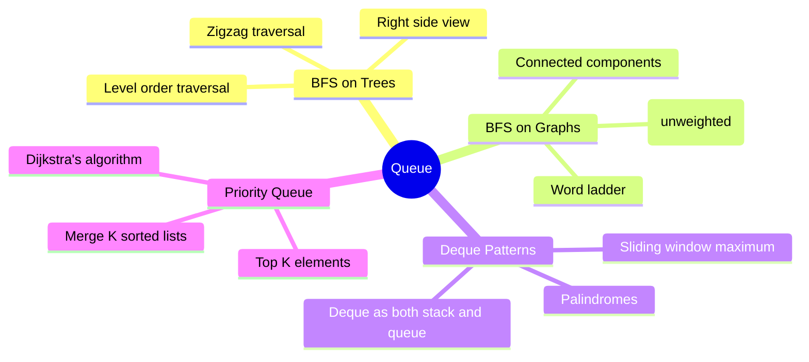

# Queue

## Overview

A queue is a first-in-first-out (FIFO) data structure. Python's `collections.deque` provides O(1) append/pop from both ends. Queues are essential for BFS, level-order traversals, and sliding window operations.



## When to Use

- BFS / level order traversal
- Need to process elements in order of arrival
- Sliding window with max/min tracking
- Task scheduling / buffer management
- Problems requiring both stack and queue behavior (deque)

## How to Identify

- "Level order" traversal of tree/graph
- "Shortest path" in unweighted graph
- "Sliding window maximum/minimum"
- "First occurrence" processing in order
- "Streaming data" problems

## Template/Skeleton

```python
from collections import deque

# BFS on Tree (Level Order)
def level_order(root):
    if not root:
        return []
    result = []
    queue = deque([root])
    while queue:
        level_size = len(queue)
        level = []
        for _ in range(level_size):
            node = queue.popleft()
            level.append(node.val)
            if node.left:
                queue.append(node.left)
            if node.right:
                queue.append(node.right)
        result.append(level)
    return result

# BFS on Graph
def bfs_graph(graph, start):
    visited = {start}
    queue = deque([start])
    while queue:
        node = queue.popleft()
        for neighbor in graph[node]:
            if neighbor not in visited:
                visited.add(neighbor)
                queue.append(neighbor)
    return visited

# Sliding Window Maximum (Deque)
def sliding_window_max(nums, k):
    from collections import deque
    result = []
    dq = deque()  # indices of elements in window
    for i in range(len(nums)):
        while dq and dq[0] < i - k + 1:
            dq.popleft()
        while dq and nums[dq[-1]] < nums[i]:
            dq.pop()
        dq.append(i)
        if i >= k - 1:
            result.append(nums[dq[0]])
    return result
```

## ASCII Diagram: Queue Operations

```
Enqueue 1, 2, 3:
                ┌─────┬─────┬─────┐
   front ───────│  1  │  2  │  3  │─────── rear
                └─────┴─────┴─────┘

Dequeue:
                ┌─────┬─────┐
   front ───────│  2  │  3  │─────── rear
                └─────┴─────┘

Sliding Window Maximum (k=3):
   Array: [1, 3, -1, -3, 5, 3, 6, 7]

   Window [1, 3, -1]: deque = [1 (val=3)] → max = 3
          └──────────┘
           L    M    R
         [1, 3, -1] remove 1 (not max)

   Window [3, -1, -3]: deque = [1 (val=3), 2 (val=-1)] → max = 3
          └──────────┘
              L    M    R
   Window [-1, -3, 5]: 3 out of range, -1 < 5, -3 < 5 → deque = [5 (val=5)]
          └──────────┘
                   L    R

Level Order Traversal:
         1
       /   \
      2     3
     / \   / \
    4   5 6   7

   Queue step by step:
   ┌──────┐  ┌──────┐  ┌──────┐  ┌──────┐
   │  1   │→ │  3   │→ │  5   │→ │  6   │→ ...
   │      │  │  2   │  │  4   │  │  7   │
   └──────┘  └──────┘  └──────┘  └──────┘
   Level 1   Level 2   Level 3
```

## Common Problems

### Problem 1: Binary Tree Level Order Traversal

- **Problem:** Return level-by-level traversal of binary tree.
- **Approach:** BFS with queue, process level by level.
- **Python Solution:**
  ```python
  def level_order(root):
      if not root:
          return []
      result = []
      queue = deque([root])
      while queue:
          level = []
          for _ in range(len(queue)):
              node = queue.popleft()
              level.append(node.val)
              if node.left:
                  queue.append(node.left)
              if node.right:
                  queue.append(node.right)
          result.append(level)
      return result
  ```
- **Complexity:** O(n) time, O(n) space

### Problem 2: Sliding Window Maximum

- **Problem:** Return max in each sliding window of size k.
- **Approach:** Deque storing indices of potential maxima.
- **Python Solution:**
  ```python
  def max_sliding_window(nums, k):
      dq = deque()
      result = []
      for i in range(len(nums)):
          while dq and dq[0] < i - k + 1:
              dq.popleft()
          while dq and nums[dq[-1]] < nums[i]:
              dq.pop()
          dq.append(i)
          if i >= k - 1:
              result.append(nums[dq[0]])
      return result
  ```
- **Complexity:** O(n) time, O(k) space

### Problem 3: Implement Queue Using Stacks

- **Problem:** Implement FIFO queue using two LIFO stacks.
- **Approach:** Two stacks — one for push, one for pop. Transfer when needed.
- **Python Solution:**
  ```python
  class MyQueue:
      def __init__(self):
          self.input = []
          self.output = []

      def push(self, x):
          self.input.append(x)

      def pop(self):
          self._transfer()
          return self.output.pop()

      def peek(self):
          self._transfer()
          return self.output[-1]

      def empty(self):
          return not self.input and not self.output

      def _transfer(self):
          if not self.output:
              while self.input:
                  self.output.append(self.input.pop())
  ```
- **Complexity:** O(1) amortized per operation, O(n) space

### Problem 4: Shortest Path in Binary Matrix

- **Problem:** Find shortest path from (0,0) to (n-1,n-1) in binary matrix.
- **Approach:** BFS, each step moves to 8-direction neighbors.
- **Python Solution:**
  ```python
  def shortest_path_binary_matrix(grid):
      n = len(grid)
      if grid[0][0] == 1 or grid[n-1][n-1] == 1:
          return -1
      directions = [(1,0),(-1,0),(0,1),(0,-1),
                    (1,1),(1,-1),(-1,1),(-1,-1)]
      queue = deque([(0, 0, 1)])
      visited = {(0, 0)}
      while queue:
          r, c, dist = queue.popleft()
          if r == n-1 and c == n-1:
              return dist
          for dr, dc in directions:
              nr, nc = r + dr, c + dc
              if 0 <= nr < n and 0 <= nc < n and (nr,nc) not in visited and grid[nr][nc] == 0:
                  visited.add((nr, nc))
                  queue.append((nr, nc, dist + 1))
      return -1
  ```
- **Complexity:** O(n^2) time, O(n^2) space

### Problem 5: Design Circular Queue

- **Problem:** Implement circular queue with fixed capacity.
- **Approach:** Array with front/rear pointers, wrap around using modulo.
- **Python Solution:**
  ```python
  class MyCircularQueue:
      def __init__(self, k):
          self.queue = [0] * k
          self.capacity = k
          self.front = 0
          self.rear = -1
          self.size = 0

      def en_queue(self, value):
          if self.is_full():
              return False
          self.rear = (self.rear + 1) % self.capacity
          self.queue[self.rear] = value
          self.size += 1
          return True

      def de_queue(self):
          if self.is_empty():
              return False
          self.front = (self.front + 1) % self.capacity
          self.size -= 1
          return True

      def front(self):
          return -1 if self.is_empty() else self.queue[self.front]

      def rear(self):
          return -1 if self.is_empty() else self.queue[self.rear]

      def is_empty(self):
          return self.size == 0

      def is_full(self):
          return self.size == self.capacity
  ```
- **Complexity:** O(1) per operation, O(k) space

### Problem 6: Implement Stack Using Queues

- **Problem:** Implement LIFO stack using two FIFO queues.
- **Approach:** Two queues, push to q2, then transfer q1 to q2, swap.
- **Python Solution:**
  ```python
  class MyStack:
      def __init__(self):
          self.q1 = deque()
          self.q2 = deque()

      def push(self, x):
          self.q2.append(x)
          while self.q1:
              self.q2.append(self.q1.popleft())
          self.q1, self.q2 = self.q2, self.q1

      def pop(self):
          return self.q1.popleft()

      def top(self):
          return self.q1[0]

      def empty(self):
          return not self.q1
  ```
- **Complexity:** O(n) push, O(1) pop, O(n) space

## Complexity Analysis Table

| Problem | Time | Space | Difficulty |
|---------|------|-------|-----------|
| Level Order Traversal | O(n) | O(n) | Medium |
| Sliding Window Max | O(n) | O(k) | Hard |
| Queue Using Stacks | O(1)* | O(n) | Easy |
| Shortest Path Binary Matrix | O(n^2) | O(n^2) | Medium |
| Circular Queue | O(1) per op | O(k) | Medium |
| Stack Using Queues | O(n) push | O(n) | Easy |

## Quick Notes

- `deque` is the default choice for queue/deque in Python
- BFS guarantees shortest path in unweighted graphs
- For sliding window max, deque maintains indices of elements that could be max
- Circular queue avoids waste by reusing space at front of array
- Queue implementation with two stacks gives O(1) amortized push and pop
- Always use `popleft()` for O(1) performance (pop(0) is O(n))

## Common Mistakes

- Using `pop(0)` instead of `popleft()` on list (O(n) vs O(1))
- Forgetting visited set in graph BFS (infinite loop)
- Not resetting front/rear in circular queue correctly
- Confusing front and rear conventions in circular queue
- Not handling empty queue before peek/pop in stack-based queue
- Using list as queue without deque (list pop from front is O(n))

## Remember

- Queue = FIFO, Stack = LIFO — know the difference
- Deque can act as both stack and queue (double-ended)
- BFS uses queue, DFS uses stack (or recursion)
- For shortest path problems in unweighted graphs, BFS is the answer
- Sliding window max with deque is a classic hard problem — master it
- Priority queue (heapq) is for when order matters by priority, not arrival time

---
Author: Tamilselvan S
LinkedIn: https://www.linkedin.com/in/tamilselvan-ai/
GitHub: `your-github-username`
---
