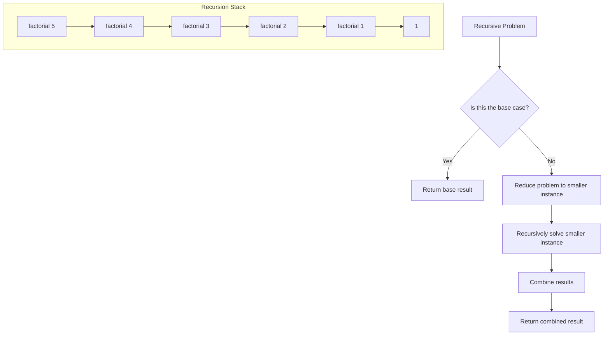

# Recursion

## Overview

Recursion is a technique where a function calls itself to solve smaller instances of the same problem. Every recursive solution has a base case (stopping condition) and a recursive case (problem reduction).



## When to Use

- Problem can be broken into similar subproblems
- Tree/Graph traversal naturally
- Divide and conquer problems
- Backtracking problems
- Mathematical sequences (Fibonacci, factorial)

## How to Identify

- Problem expression is naturally recursive (e.g., tree traversal, file system)
- "All permutations/combinations/subsets"
- Problem can be solved by solving smaller instances of same problem
- "Use recursion" explicitly stated
- Problems that involve branching decisions

## Template/Skeleton

```python
# Basic Recursion Template
def recursive_function(problem):
    # 1. Base case
    if is_base_case(problem):
        return base_value

    # 2. Reduce problem
    smaller_problem = reduce(problem)

    # 3. Recursive call
    result = recursive_function(smaller_problem)

    # 4. Combine results (if needed)
    combined = combine(result, problem)

    return combined

# Factorial (Tail Recursive Pattern)
def factorial(n, accumulator=1):
    if n <= 1:
        return accumulator
    return factorial(n - 1, n * accumulator)

# Divide and Conquer Template
def divide_and_conquer(problem):
    if is_trivial(problem):
        return solve_directly(problem)

    subproblems = divide(problem)
    sub_results = [divide_and_conquer(sub) for sub in subproblems]
    return combine(sub_results)

# Tree Traversal (Recursive)
def traverse(node):
    if not node:
        return
    # pre-order: process node, then left, then right
    traverse(node.left)
    # in-order: process left, then node, then right
    traverse(node.right)
    # post-order: process left, then right, then node
```

## Common Problems

### Problem 1: Factorial

- **Problem:** Compute n!.
- **Approach:** Base case 0! = 1, recursive case n! = n * (n-1)!.
- **Python Solution:**
  ```python
  def factorial(n):
      if n <= 1:
          return 1
      return n * factorial(n - 1)
  ```
- **Complexity:** O(n) time, O(n) space (call stack)

### Problem 2: Fibonacci Number

- **Problem:** Compute nth Fibonacci number.
- **Approach:** Base cases F(0)=0, F(1)=1; F(n)=F(n-1)+F(n-2).
- **Python Solution:**
  ```python
  def fib(n):
      if n <= 1:
          return n
      return fib(n - 1) + fib(n - 2)
  ```
- **Complexity:** O(2^n) time naive, O(n) with memoization, O(n) space

### Problem 3: Reverse a String (Recursive)

- **Problem:** Reverse string recursively.
- **Approach:** Swap first and last characters, recurse on middle.
- **Python Solution:**
  ```python
  def reverse_string(s, left=0, right=None):
      if right is None:
          right = len(s) - 1
      if left >= right:
          return
      s[left], s[right] = s[right], s[left]
      reverse_string(s, left + 1, right - 1)
  ```
- **Complexity:** O(n) time, O(n) space (call stack)

### Problem 4: Tower of Hanoi

- **Problem:** Move n disks from source to destination.
- **Approach:** Move n-1 to auxiliary, move largest, move n-1 to destination.
- **Python Solution:**
  ```python
  def tower_of_hanoi(n, source, destination, auxiliary):
      if n == 1:
          print(f"Move disk 1 from {source} to {destination}")
          return
      tower_of_hanoi(n - 1, source, auxiliary, destination)
      print(f"Move disk {n} from {source} to {destination}")
      tower_of_hanoi(n - 1, auxiliary, destination, source)
  ```
- **Complexity:** O(2^n) time, O(n) space

### Problem 5: Merge Sort (Recursive)

- **Problem:** Sort array using merge sort.
- **Approach:** Divide array in half, sort each half recursively, merge.
- **Python Solution:**
  ```python
  def merge_sort(arr):
      if len(arr) <= 1:
          return arr
      mid = len(arr) // 2
      left = merge_sort(arr[:mid])
      right = merge_sort(arr[mid:])
      return merge(left, right)

  def merge(left, right):
      result = []
      i = j = 0
      while i < len(left) and j < len(right):
          if left[i] <= right[j]:
              result.append(left[i])
              i += 1
          else:
              result.append(right[j])
              j += 1
      result.extend(left[i:])
      result.extend(right[j:])
      return result
  ```
- **Complexity:** O(n log n) time, O(n) space

### Problem 6: Generate Parentheses

- **Problem:** Generate all valid combinations of n parentheses pairs.
- **Approach:** Recursively add '(' or ')' tracking counts.
- **Python Solution:**
  ```python
  def generate_parentheses(n):
      result = []
      def backtrack(s, left, right):
          if len(s) == 2 * n:
              result.append(s)
              return
          if left < n:
              backtrack(s + '(', left + 1, right)
          if right < left:
              backtrack(s + ')', left, right + 1)
      backtrack("", 0, 0)
      return result
  ```
- **Complexity:** O(4^n / sqrt(n)) time (Catalan number), O(n) space

## Complexity Analysis Table

| Problem | Time | Space | Difficulty |
|---------|------|-------|-----------|
| Factorial | O(n) | O(n) | Easy |
| Fibonacci (naive) | O(2^n) | O(n) | Easy |
| Reverse String | O(n) | O(n) | Easy |
| Tower of Hanoi | O(2^n) | O(n) | Medium |
| Merge Sort | O(n log n) | O(n) | Medium |
| Generate Parentheses | O(Catalan) | O(n) | Medium |

## Quick Notes

- Every recursive function needs a base case — without it, infinite recursion → stack overflow
- The call stack has limited depth (~1000 in Python by default)
- Tail recursion optimization doesn't exist in Python — iterative solutions are safer for deep recursion
- Divide and conquer reduces problem size exponentially (merge sort, quick sort)
- Memoization caches recursive results to avoid recomputing the same subproblems
- Recursion depth = size of call stack at any point

## Common Mistakes

- Forgetting base case → infinite recursion → RecursionError
- No progress toward base case → infinite recursion
- Not combining results correctly after recursive calls
- Using recursion when iterative solution is simpler and more efficient
- Stack overflow for deep recursion (>1000 levels in Python)
- Modifying shared mutable state across recursive calls without careful design

## Remember

- Recursion is about expressing the problem, not optimizing it
- The call stack tracks state automatically — use this to your advantage
- For tree problems, recursion is almost always the right approach
- If a recursive solution is too slow, add memoization (top-down DP)
- Every recursive solution can be converted to iterative using an explicit stack
- When in doubt about base case: think about the smallest possible input

## Recursion Tree Example

```
Fibonacci Recursion Tree for n = 5:
                    fib(5)
                   /      \
              fib(4)      fib(3)
             /     \      /    \
         fib(3)   fib(2) fib(2) fib(1)
         /   \     /   \   /  \
     fib(2) fib(1) 1   1  1  1
     /   \
    1    1

Without memoization: 15 calls for fib(5)
With memoization:    5 calls (each computed once)
```

---
Author: Tamilselvan S
LinkedIn: https://www.linkedin.com/in/tamilselvan-ai/
GitHub: `your-github-username`
---
