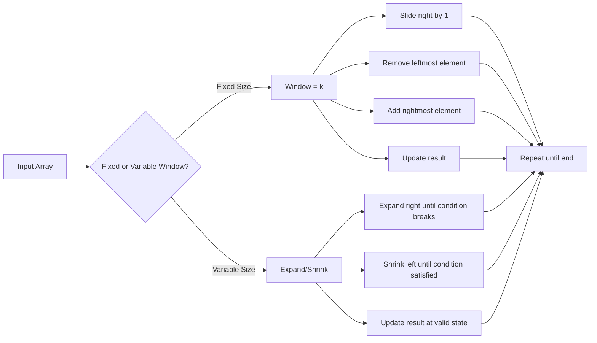

# Sliding Window

## Overview

Sliding window converts nested loops into single passes by maintaining a window of elements and updating it incrementally. Essential for substring/subarray problems.



## When to Use

- Problems involving contiguous subarrays or substrings
- "Maximum/minimum/longest/shortest subarray"
- Subarray with a given condition (sum = k, no repeats, etc.)
- String anagram/permutation substring detection

## How to Identify

- "Contiguous" subarray/substring
- Window size is given (fixed) or based on a condition (variable)
- Need to find maximum/minimum of something within a window
- Keywords: "subarray", "substring", "window", "consecutive"
- Problem can be solved by maintaining a running aggregate

## Template/Skeleton

```python
# Fixed Window Template
def fixed_window(arr, k):
    window_sum = sum(arr[:k])
    result = window_sum
    for i in range(k, len(arr)):
        window_sum += arr[i] - arr[i - k]  # slide window
        result = max(result, window_sum)
    return result

# Variable Window Template
def variable_window(arr, condition_fn):
    left = 0
    result = 0
    current = 0  # window state
    for right in range(len(arr)):
        current += arr[right]  # expand
        while not condition_fn(current):  # shrink while invalid
            current -= arr[left]
            left += 1
        result = max(result, right - left + 1)  # update result
    return result

# Variable Window + HashMap Template
def variable_window_with_map(s):
    from collections import defaultdict
    left = 0
    result = 0
    freq = defaultdict(int)
    for right in range(len(s)):
        freq[s[right]] += 1  # expand
        while not is_valid(freq):  # shrink while invalid
            freq[s[left]] -= 1
            if freq[s[left]] == 0:
                del freq[s[left]]
            left += 1
        result = max(result, right - left + 1)
    return result
```

## Common Problems

### Problem 1: Maximum Sum Subarray of Size K

- **Problem:** Find max sum of any contiguous subarray of size k.
- **Approach:** Fixed window — slide and update sum.
- **Python Solution:**
  ```python
  def max_sum_subarray(arr, k):
      window_sum = sum(arr[:k])
      max_sum = window_sum
      for i in range(k, len(arr)):
          window_sum += arr[i] - arr[i - k]
          max_sum = max(max_sum, window_sum)
      return max_sum
  ```
- **Complexity:** O(n) time, O(1) space

### Problem 2: Longest Substring Without Repeating Characters

- **Problem:** Find length of longest substring with all unique characters.
- **Approach:** Variable window with hashmap tracking last seen index.
- **Python Solution:**
  ```python
  def length_of_longest_substring(s):
      last_seen = {}
      left = max_len = 0
      for right, ch in enumerate(s):
          if ch in last_seen and last_seen[ch] >= left:
              left = last_seen[ch] + 1
          max_len = max(max_len, right - left + 1)
          last_seen[ch] = right
      return max_len
  ```
- **Complexity:** O(n) time, O(min(m, n)) space

### Problem 3: Minimum Window Substring

- **Problem:** Find minimum window in s that contains all chars of t.
- **Approach:** Two hashmaps — need and have. Expand right, shrink left when valid.
- **Python Solution:**
  ```python
  def min_window(s, t):
      from collections import Counter
      need = Counter(t)
      have = {}
      left = 0
      have_count = 0
      min_len = float('inf')
      result = ""
      for right in range(len(s)):
          ch = s[right]
          have[ch] = have.get(ch, 0) + 1
          if ch in need and have[ch] == need[ch]:
              have_count += 1
          while have_count == len(need):
              if right - left + 1 < min_len:
                  min_len = right - left + 1
                  result = s[left:right + 1]
              left_ch = s[left]
              have[left_ch] -= 1
              if left_ch in need and have[left_ch] < need[left_ch]:
                  have_count -= 1
              left += 1
      return result
  ```
- **Complexity:** O(n) time, O(m) space where m is charset

### Problem 4: Permutation in String

- **Problem:** Check if s2 contains permutation of s1.
- **Approach:** Fixed window (size = len(s1)) with frequency comparison.
- **Python Solution:**
  ```python
  def check_inclusion(s1, s2):
      from collections import Counter
      n, m = len(s1), len(s2)
      if n > m:
          return False
      s1_count = Counter(s1)
      window_count = Counter()
      for i in range(m):
          window_count[s2[i]] += 1
          if i >= n:
              if window_count[s2[i - n]] == 1:
                  del window_count[s2[i - n]]
              else:
                  window_count[s2[i - n]] -= 1
          if window_count == s1_count:
              return True
      return False
  ```
- **Complexity:** O(n) time, O(1) space (fixed alphabet)

### Problem 5: Longest Repeating Character Replacement

- **Problem:** Replace at most k chars to get longest uniform substring.
- **Approach:** Variable window tracking most frequent char in window.
- **Python Solution:**
  ```python
  def character_replacement(s, k):
      from collections import defaultdict
      left = 0
      max_freq = 0
      freq = defaultdict(int)
      max_len = 0
      for right in range(len(s)):
          freq[s[right]] += 1
          max_freq = max(max_freq, freq[s[right]])
          while (right - left + 1) - max_freq > k:
              freq[s[left]] -= 1
              left += 1
          max_len = max(max_len, right - left + 1)
      return max_len
  ```
- **Complexity:** O(n) time, O(1) space (26 letters)

### Problem 6: Max Consecutive Ones III

- **Problem:** Max consecutive 1s after flipping at most k 0s.
- **Approach:** Variable window — count zeros in window.
- **Python Solution:**
  ```python
  def longest_ones(nums, k):
      left = 0
      zeros = 0
      max_len = 0
      for right in range(len(nums)):
          if nums[right] == 0:
              zeros += 1
          while zeros > k:
              if nums[left] == 0:
                  zeros -= 1
              left += 1
          max_len = max(max_len, right - left + 1)
      return max_len
  ```
- **Complexity:** O(n) time, O(1) space

## Complexity Analysis Table

| Problem | Time | Space | Difficulty |
|---------|------|-------|-----------|
| Max Sum Subarray of Size K | O(n) | O(1) | Easy |
| Longest Substring w/o Repeat | O(n) | O(min(m,n)) | Medium |
| Minimum Window Substring | O(n) | O(m) | Hard |
| Permutation in String | O(n) | O(1) | Medium |
| Longest Repeating Replacement | O(n) | O(1) | Medium |
| Max Consecutive Ones III | O(n) | O(1) | Medium |

## Quick Notes

- Fixed window: slide by adding right and removing left (O(1) per step)
- Variable window: expand right, shrink left while condition is violated
- The "while" inside the for loop makes some people think O(n^2), but amortized O(n) since left moves at most n times
- Use hashmap when window condition involves element counts
- For min-window problems, you expand until valid, then shrink to find minimum
- For max-window problems, you expand until invalid, then shrink until valid

## Common Mistakes

- Resetting window instead of sliding/shrinking it incrementally
- Not handling the "shrink" phase correctly for variable window (use while, not if)
- Forgetting to check if hashmap keys exist before decrementing (use defaultdict or Counter)
- Using O(n*k) sliding when O(n) is possible
- Not accounting for edge case where window size < k
- Confusing when to use fixed vs variable window

## Remember

- Sliding window is always O(n) — each element is added once and removed at most once
- Fixed window problems are generally easier than variable window
- Variable window follows a consistent pattern: expand → while invalid → shrink → update result
- For minimum window problems, update result while window is valid (during shrink)
- For maximum window problems, update result while window is valid (during expand)
- Sliding window + hashmap is the most common medium-difficulty combo

---
Author: Tamilselvan S
LinkedIn: https://www.linkedin.com/in/tamilselvan-ai/
GitHub: `your-github-username`
---
