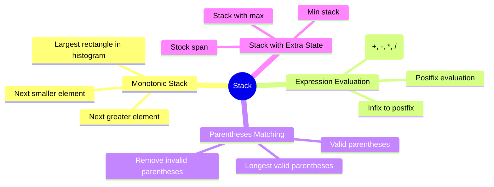

# Stack

## Overview

A stack is a last-in-first-out (LIFO) data structure. Think of a stack of plates — you add to the top and remove from the top. Python lists make excellent stacks with O(1) push/pop.



## When to Use

- LIFO order needed (last seen, most recent)
- Parsing nested structures (parentheses, XML, HTML)
- Reversing elements
- Expression evaluation
- Monotonic properties (next greater/smaller element)
- Undo/Redo operations

## How to Identify

- "Nested" or "matching" (parentheses, brackets)
- "Next greater/smaller element"
- Calculator / expression parsing
- "Undo" or "backtrack" operations
- Problems requiring keeping track of previous elements

## Template/Skeleton

```python
# Valid Parentheses Template
def is_valid(s):
    stack = []
    pairs = {')': '(', '}': '{', ']': '['}
    for ch in s:
        if ch in pairs:
            if not stack or stack.pop() != pairs[ch]:
                return False
        else:
            stack.append(ch)
    return len(stack) == 0

# Monotonic Stack (Next Greater Element)
def next_greater_element(nums):
    stack = []
    result = [-1] * len(nums)
    for i in range(len(nums) - 1, -1, -1):
        while stack and stack[-1] <= nums[i]:
            stack.pop()
        if stack:
            result[i] = stack[-1]
        stack.append(nums[i])
    return result

# Min Stack
class MinStack:
    def __init__(self):
        self.stack = []
        self.min_stack = []

    def push(self, val):
        self.stack.append(val)
        if not self.min_stack or val <= self.min_stack[-1]:
            self.min_stack.append(val)

    def pop(self):
        val = self.stack.pop()
        if val == self.min_stack[-1]:
            self.min_stack.pop()
        return val

    def top(self):
        return self.stack[-1]

    def get_min(self):
        return self.min_stack[-1]
```

## ASCII Diagram: Stack Operations

```
Push 1, 3, 2:
                    ┌─────┐
        ┌─────┐     │  2  │ ← top
        │  3  │     ├─────┤
        ├─────┤     │  3  │
        │  1  │     ├─────┤
        ├─────┤     │  1  │
        │     │     ├─────┤
        └─────┘     │     │
                    └─────┘

Pop:
        ┌─────┐
        │  3  │ ← top
        ├─────┤
        │  1  │
        ├─────┤
        │     │
        └─────┘

Next Greater Element:
        ┌─────────────────────────────────┐
        │ i │ nums[i] │  stack  │ result  │
        ├─────────────────────────────────┤
        │ 2 │    2    │   [2]   │  -1     │
        │ 1 │    3    │   [3]   │  -1     │  (2 popped)
        │ 0 │    1    │  [3,1]  │   3     │  (3 > 1)
        └─────────────────────────────────┘

Monotonic Decreasing Stack (NGE):
             ┌─────┐    ┌─────┐    ┌─────┐
             │  2  │    │  2  │    │  1  │
             ├─────┤    ├─────┤    ├─────┤
             │  3  │    │  3  │    │  3  │
             ├─────┤    ├─────┤    ├─────┤
  nums       │  1  │    │  1  │    │  1  │ ← waiting for NGE
  [1,3,2]    └─────┘    └─────┘    └─────┘
             step 1     step 2     step 3
             1 pushed   3>1 pop    2 pushed
                        1, push 3
```

## Common Problems

### Problem 1: Valid Parentheses

- **Problem:** Determine if string of brackets is valid.
- **Approach:** Stack of opening brackets, check matching pair on close.
- **Python Solution:**
  ```python
  def is_valid(s):
      stack = []
      pairs = {')': '(', ']': '[', '}': '{'}
      for ch in s:
          if ch in pairs:
              if not stack or stack.pop() != pairs[ch]:
                  return False
          else:
              stack.append(ch)
      return not stack
  ```
- **Complexity:** O(n) time, O(n) space

### Problem 2: Min Stack

- **Problem:** Design stack that supports push, pop, top, getMin in O(1).
- **Approach:** Maintain auxiliary stack tracking minimum at each level.
- **Python Solution:**
  ```python
  class MinStack:
      def __init__(self):
          self.stack = []
          self.min_stack = []

      def push(self, val):
          self.stack.append(val)
          if not self.min_stack or val <= self.min_stack[-1]:
              self.min_stack.append(val)

      def pop(self):
          if self.stack.pop() == self.min_stack[-1]:
              self.min_stack.pop()

      def top(self):
          return self.stack[-1]

      def get_min(self):
          return self.min_stack[-1]
  ```
- **Complexity:** O(1) for all operations, O(n) space

### Problem 3: Largest Rectangle in Histogram

- **Problem:** Find largest rectangle in histogram.
- **Approach:** Monotonic stack tracking increasing heights.
- **Python Solution:**
  ```python
  def largest_rectangle_area(heights):
      stack = []
      max_area = 0
      heights.append(0)  # sentinel
      for i, h in enumerate(heights):
          while stack and heights[stack[-1]] > h:
              height = heights[stack.pop()]
              width = i if not stack else i - stack[-1] - 1
              max_area = max(max_area, height * width)
          stack.append(i)
      heights.pop()  # remove sentinel
      return max_area
  ```
- **Complexity:** O(n) time, O(n) space

### Problem 4: Evaluate Reverse Polish Notation

- **Problem:** Evaluate postfix expression.
- **Approach:** Stack of operands, apply operator on pop.
- **Python Solution:**
  ```python
  def eval_rpn(tokens):
      stack = []
      ops = {'+': lambda a,b: a+b,
             '-': lambda a,b: a-b,
             '*': lambda a,b: a*b,
             '/': lambda a,b: int(a/b)}
      for token in tokens:
          if token in ops:
              b = stack.pop()
              a = stack.pop()
              stack.append(ops[token](a, b))
          else:
              stack.append(int(token))
      return stack[0]
  ```
- **Complexity:** O(n) time, O(n) space

### Problem 5: Daily Temperatures

- **Problem:** For each day, days until warmer temperature.
- **Approach:** Monotonic decreasing stack of indices.
- **Python Solution:**
  ```python
  def daily_temperatures(temps):
      n = len(temps)
      result = [0] * n
      stack = []
      for i in range(n):
          while stack and temps[i] > temps[stack[-1]]:
              idx = stack.pop()
              result[idx] = i - idx
          stack.append(i)
      return result
  ```
- **Complexity:** O(n) time, O(n) space

### Problem 6: Remove K Digits

- **Problem:** Remove k digits to form smallest possible number.
- **Approach:** Monotonic increasing stack.
- **Python Solution:**
  ```python
  def remove_k_digits(num, k):
      stack = []
      for digit in num:
          while k > 0 and stack and stack[-1] > digit:
              stack.pop()
              k -= 1
          stack.append(digit)
      while k > 0:
          stack.pop()
          k -= 1
      result = "".join(stack).lstrip('0')
      return result if result else "0"
  ```
- **Complexity:** O(n) time, O(n) space

## Complexity Analysis Table

| Problem | Time | Space | Difficulty |
|---------|------|-------|-----------|
| Valid Parentheses | O(n) | O(n) | Easy |
| Min Stack | O(1) per op | O(n) | Medium |
| Largest Rectangle in Histogram | O(n) | O(n) | Hard |
| Evaluate RPN | O(n) | O(n) | Medium |
| Daily Temperatures | O(n) | O(n) | Medium |
| Remove K Digits | O(n) | O(n) | Medium |

## Quick Notes

- Monotonic stack pattern: process from right/left, maintain sorted order
- Never store elements that can't be answers — stack only keeps "candidates"
- For next greater element (NGE), traverse right to left
- For next greater element to the right, traverse left to right
- Min/Max stack is a common variation — track running min alongside
- Python's list is already a great stack — no need for deque unless using both ends

## Common Mistakes

- Forgetting that stack is empty before popping in parentheses matching
- Storing values instead of indices in histogram problems (width requires index)
- Not handling the case where k digits to remove > len(num)
- Using `a // b` for division in RPN (Python's // floors toward negative) — use int(a/b) instead
- Confusing monotonic increasing vs decreasing stacks
- Not restoring the original data after sentinel modification

## Remember

- Stack problems are often disguised as array problems with "previous/next element" queries
- Monotonic stack reduces O(n^2) to O(n) by maintaining a sorted sequence
- The spaces in parentheses/expression problems are usually hiding a stack requirement
- Min/Max stack is a separate tracking structure, not modification of the value
- For histogram, the sentinel (0 at end) eliminates need for post-loop cleanup
- Stack is also the foundation for recursion simulation (call stack)

---
Author: Tamilselvan S
LinkedIn: https://www.linkedin.com/in/tamilselvan-ai/
GitHub: `your-github-username`
---
