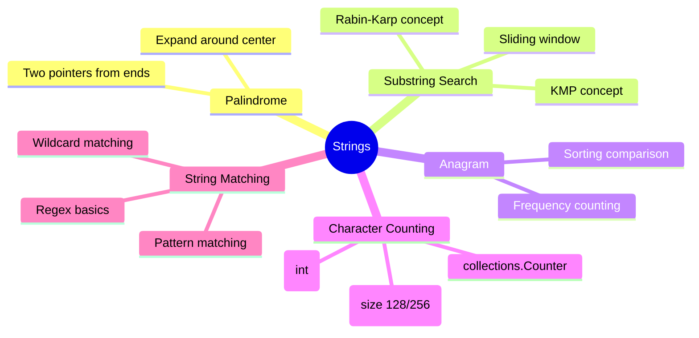

# Strings

## Overview

Strings are sequences of characters. In Python, strings are immutable — any modification creates a new string. Master string manipulation using slicing, joining, and built-in methods.



## When to Use

- Input is a string/array of characters
- Problems involving anagrams, palindromes
- Character frequency comparisons
- Pattern matching / substring search
- String transformations and edits

## How to Identify

- "Anagram", "palindrome", "substring"
- "Rearrange", "permutation" of characters
- Character set is limited (lowercase, digits, ASCII)
- Compare two strings for equivalence after manipulation
- "Longest substring without repeating characters"

## Template/Skeleton

```python
from collections import Counter, defaultdict

# Character Frequency Template
def char_count(s):
    count = [0] * 128  # ASCII range
    for ch in s:
        count[ord(ch)] += 1
    return count

# Palindrome Check (Two Pointers)
def is_palindrome(s):
    l, r = 0, len(s) - 1
    while l < r:
        if s[l] != s[r]:
            return False
        l += 1
            r -= 1
    return True

# Anagram Check (Counter)
def is_anagram(s, t):
    return Counter(s) == Counter(t)

# Expand Around Center (Palindromic Substrings)
def expand_around_center(s, l, r):
    while l >= 0 and r < len(s) and s[l] == s[r]:
        l -= 1
        r += 1
    return r - l - 1  # length of palindrome
```

## Common Problems

### Problem 1: Longest Substring Without Repeating Characters

- **Problem:** Find length of longest substring without repeating characters.
- **Approach:** Sliding window with hashmap tracking last seen index.
- **Python Solution:**
  ```python
  def length_of_longest_substring(s):
      last_seen = {}
      left = max_len = 0
      for right, ch in enumerate(s):
          if ch in last_seen and last_seen[ch] >= left:
              left = last_seen[ch] + 1
          else:
              max_len = max(max_len, right - left + 1)
          last_seen[ch] = right
      return max_len
  ```
- **Complexity:** O(n) time, O(min(m, n)) space where m is charset size

### Problem 2: Valid Anagram

- **Problem:** Check if two strings are anagrams.
- **Approach:** Count characters using Counter or ASCII array.
- **Python Solution:**
  ```python
  def is_anagram(s, t):
      if len(s) != len(t):
          return False
      count = [0] * 26
      for ch in s:
          count[ord(ch) - ord('a')] += 1
      for ch in t:
          count[ord(ch) - ord('a')] -= 1
          if count[ord(ch) - ord('a')] < 0:
              return False
      return True
  ```
- **Complexity:** O(n) time, O(1) space (fixed 26-size array)

### Problem 3: Longest Palindromic Substring

- **Problem:** Find longest palindromic substring.
- **Approach:** Expand around center for each position.
- **Python Solution:**
  ```python
  def longest_palindrome(s):
      def expand(l, r):
          while l >= 0 and r < len(s) and s[l] == s[r]:
              l -= 1
              r += 1
          return s[l + 1:r]
      result = ""
      for i in range(len(s)):
          odd = expand(i, i)
          even = expand(i, i + 1)
          result = max(result, odd, even, key=len)
      return result
  ```
- **Complexity:** O(n^2) time, O(1) space

### Problem 4: Group Anagrams

- **Problem:** Group anagrams together from list of strings.
- **Approach:** Use sorted string as key in hashmap.
- **Python Solution:**
  ```python
  def group_anagrams(strs):
      groups = defaultdict(list)
      for s in strs:
          key = tuple(sorted(s))
          groups[key].append(s)
      return list(groups.values())
  ```
- **Complexity:** O(n * k log k) where k is max string length, O(n * k) space

### Problem 5: String to Integer (atoi)

- **Problem:** Implement atoi conversion.
- **Approach:** Skip whitespace, handle sign, accumulate digits, handle overflow.
- **Python Solution:**
  ```python
  def my_atoi(s):
      s = s.lstrip()
      if not s:
          return 0
      sign = -1 if s[0] == '-' else 1
      if s[0] in '+-':
          s = s[1:]
      result = 0
      for ch in s:
          if not ch.isdigit():
              break
          result = result * 10 + (ord(ch) - ord('0'))
          if sign * result > 2**31 - 1:
              return 2**31 - 1
          if sign * result < -2**31:
              return -2**31
      return sign * result
  ```
- **Complexity:** O(n) time, O(1) space

### Problem 6: Implement strStr() — Find First Occurrence

- **Problem:** Find index of first occurrence of needle in haystack.
- **Approach:** Use built-in find, or sliding window with early exit.
- **Python Solution:**
  ```python
  def str_str(haystack, needle):
      if not needle:
          return 0
      n, m = len(haystack), len(needle)
      for i in range(n - m + 1):
          if haystack[i:i + m] == needle:
              return i
      return -1
  ```
- **Complexity:** O(n * m) naive, O(n + m) with KMP

## Complexity Analysis Table

| Problem | Time | Space | Difficulty |
|---------|------|-------|-----------|
| Longest Substring w/o Repeat | O(n) | O(min(m,n)) | Medium |
| Valid Anagram | O(n) | O(1) | Easy |
| Longest Palindromic Substring | O(n^2) | O(1) | Medium |
| Group Anagrams | O(nk log k) | O(nk) | Medium |
| String to Integer (atoi) | O(n) | O(1) | Medium |
| Implement strStr() | O(n*m) | O(1) | Easy |

## Quick Notes

- Strings are immutable — join() is faster than += for building strings
- For character frequency comparison, ASCII array of size 128 is fastest
- `Counter` is convenient but slower than array for single pass
- `s[::-1]` is the simplest palindrome check
- Sliding window is the go-to for substring problems
- `ord(ch) - ord('a')` maps 'a'-'z' to 0-25

## Common Mistakes

- Modifying string during iteration — strings are immutable, create new ones
- Forgetting case sensitivity / case insensitivity requirements
- Using `is` instead of `==` for string comparison in edge cases (interning only works for small strings)
- Not handling unicode characters properly (use `ord()` carefully)
- Off-by-one in substring slicing (s[i:j] excludes j)
- Performance issues with repeated string concatenation in loops

## Remember

- Python's string slicing is your first tool — it's fast and readable
- For palindrome checks, compare s with s[::-1]
- Character frequency arrays (size 26/128/256) give O(1) space comparison
- Sliding window + hashmap is the most common medium-difficulty pattern
- Sorting strings makes anagram detection trivial
- KMP is rarely needed in interviews — understand it conceptually but focus on sliding window

---
Author: Tamilselvan S
LinkedIn: https://www.linkedin.com/in/tamilselvan-ai/
GitHub: `your-github-username`
---
