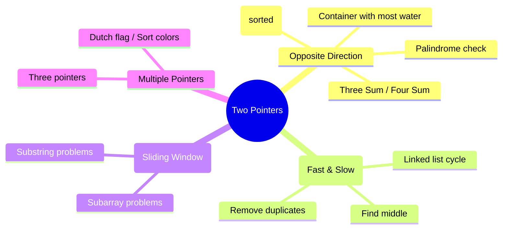

# Two Pointers

## Overview

Two pointers is a technique where two pointer variables traverse the data structure, typically from different positions, to solve problems in O(n) time and O(1) space.



## When to Use

- The input is sorted (or can be sorted without losing answer)
- Problem requires finding pairs/triplets
- Need to compare elements from both ends
- In-place array modification required
- Problem involves partitioning

## How to Identify

- Array/sorted array as input
- "Find a pair that satisfies a condition"
- "Find triplets with sum = 0"
- "Remove duplicates in-place"
- "Palindrome" checking
- "Container with most water"

## Template/Skeleton

```python
# Opposite Direction (pair sum in sorted array)
def two_sum_sorted(arr, target):
    left, right = 0, len(arr) - 1
    while left < right:
        current = arr[left] + arr[right]
        if current == target:
            return [left, right]
        elif current < target:
            left += 1
        else:
            right -= 1
    return []

# Same Direction (remove duplicates in-place)
def remove_duplicates(arr):
    if not arr:
        return 0
    slow = 0
    for fast in range(1, len(arr)):
        if arr[fast] != arr[slow]:
            slow += 1
            arr[slow] = arr[fast]
    return slow + 1

# Three Pointers (Dutch Flag / Sort Colors)
def sort_colors(nums):
    left, mid, right = 0, 0, len(nums) - 1
    while mid <= right:
        if nums[mid] == 0:
            nums[left], nums[mid] = nums[mid], nums[left]
            left += 1
            mid += 1
        elif nums[mid] == 1:
            mid += 1
        else:  # nums[mid] == 2
            nums[mid], nums[right] = nums[right], nums[mid]
            right -= 1
```

## ASCII Diagram: Two Pointer Movement

```
Opposite Direction:
  [1, 2, 3, 4, 5, 7, 9]  target = 10
   L ->                 <- R
   1 + 9 = 10 → found!

  [1, 2, 3, 4, 5, 7, 9]  target = 9
   L ->              <- R
   1 + 9 = 10 > 9 → move R left
   L ->           <- R
   1 + 7 = 8 < 9 → move L right
      L ->        <- R
   2 + 7 = 9 → found!

Same Direction (Remove Duplicates):
  [1, 1, 2, 2, 3, 4, 4, 5]
   S
   F
   1 == 1 → F moves
   S
   F-> (skip)
   1 != 2 → S++, copy
      S
      F
   ...

Three Pointers (Dutch Flag):
  [2, 0, 2, 1, 1, 0]
   L
   M
                      R
   2 == 2 → swap M,R, R--
   [0, 0, 2, 1, 1, 2]
   L
   M
                   R
   0 == 0 → swap L,M, L++, M++
   [0, 0, 2, 1, 1, 2]
      L
      M
                   R
   0 == 0 → swap L,M, L++, M++
   [0, 0, 2, 1, 1, 2]
         L
         M
                   R
   2 == 2 → swap M,R, R--
   [0, 0, 1, 1, 2, 2]
         L
         M
                R
   1 == 1 → M++
   [0, 0, 1, 1, 2, 2]
         L
            M
                R
   1 == 1 → M++
   [0, 0, 1, 1, 2, 2]  ← done when M > R
```

## Common Problems

### Problem 1: Two Sum II — Input Array Is Sorted

- **Problem:** Find two numbers that add to target.
- **Approach:** Opposite-direction two pointers.
- **Python Solution:**
  ```python
  def two_sum(numbers, target):
      l, r = 0, len(numbers) - 1
      while l < r:
          total = numbers[l] + numbers[r]
          if total == target:
              return [l + 1, r + 1]
          elif total < target:
              l += 1
          else:
              r -= 1
      return []
  ```
- **Complexity:** O(n) time, O(1) space

### Problem 2: Three Sum

- **Problem:** Find all triplets summing to 0.
- **Approach:** Sort + fix one element + two pointers on rest.
- **Python Solution:**
  ```python
  def three_sum(nums):
      nums.sort()
      result = []
      for i in range(len(nums) - 2):
          if i > 0 and nums[i] == nums[i - 1]:
              continue
          l, r = i + 1, len(nums) - 1
          while l < r:
              total = nums[i] + nums[l] + nums[r]
              if total == 0:
                  result.append([nums[i], nums[l], nums[r]])
                  while l < r and nums[l] == nums[l + 1]:
                      l += 1
                  while l < r and nums[r] == nums[r - 1]:
                      r -= 1
                  l += 1
                  r -= 1
              elif total < 0:
                  l += 1
              else:
                  r -= 1
      return result
  ```
- **Complexity:** O(n^2) time, O(1) extra space (excluding output)

### Problem 3: Container With Most Water

- **Problem:** Find two lines that form container holding most water.
- **Approach:** Opposite pointers, always move the shorter line.
- **Python Solution:**
  ```python
  def max_area(height):
      l, r = 0, len(height) - 1
      max_water = 0
      while l < r:
          area = min(height[l], height[r]) * (r - l)
          max_water = max(max_water, area)
          if height[l] < height[r]:
              l += 1
          else:
              r -= 1
      return max_water
  ```
- **Complexity:** O(n) time, O(1) space

### Problem 4: Remove Duplicates from Sorted Array

- **Problem:** Remove duplicates in-place, return length.
- **Approach:** Same-direction pointers (slow/fast).
- **Python Solution:**
  ```python
  def remove_duplicates(nums):
      if not nums:
          return 0
      slow = 0
      for fast in range(1, len(nums)):
          if nums[fast] != nums[slow]:
              slow += 1
              nums[slow] = nums[fast]
      return slow + 1
  ```
- **Complexity:** O(n) time, O(1) space

### Problem 5: Sort Colors (Dutch National Flag)

- **Problem:** Sort array of 0s, 1s, 2s in-place.
- **Approach:** Three pointers — left, mid, right.
- **Python Solution:**
  ```python
  def sort_colors(nums):
      left, mid, right = 0, 0, len(nums) - 1
      while mid <= right:
          if nums[mid] == 0:
              nums[left], nums[mid] = nums[mid], nums[left]
              left += 1
              mid += 1
          elif nums[mid] == 1:
              mid += 1
          else:
              nums[mid], nums[right] = nums[right], nums[mid]
              right -= 1
  ```
- **Complexity:** O(n) time, O(1) space

### Problem 6: Trapping Rain Water

- **Problem:** Compute how much water can be trapped.
- **Approach:** Two pointers tracking left/right max heights.
- **Python Solution:**
  ```python
  def trap(height):
      if not height:
          return 0
      l, r = 0, len(height) - 1
      left_max = right_max = 0
      water = 0
      while l < r:
          if height[l] < height[r]:
              if height[l] >= left_max:
                  left_max = height[l]
              else:
                  water += left_max - height[l]
              l += 1
          else:
              if height[r] >= right_max:
                  right_max = height[r]
              else:
                  water += right_max - height[r]
              r -= 1
      return water
  ```
- **Complexity:** O(n) time, O(1) space

## Complexity Analysis Table

| Problem | Time | Space | Difficulty |
|---------|------|-------|-----------|
| Two Sum II | O(n) | O(1) | Medium |
| Three Sum | O(n^2) | O(1) | Medium |
| Container With Most Water | O(n) | O(1) | Medium |
| Remove Duplicates | O(n) | O(1) | Easy |
| Sort Colors | O(n) | O(1) | Medium |
| Trapping Rain Water | O(n) | O(1) | Hard |

## Quick Notes

- Opposite-direction pointers work best on sorted arrays
- Same-direction (slow/fast) is great for in-place deduplication and partitioning
- The slow pointer in dedup problems marks the "last valid position"
- For Three Sum, sort first, then fix one element and two-pointer the rest
- Trapping rain water tracks max from both ends — the lower max determines how much water current cell can hold

## Common Mistakes

- Forgetting to skip duplicates in Three Sum (both the fixed element and after finding a triplet)
- Not sorting before two-pointer if the problem requires it
- Off-by-one errors in slow pointer assignments (slow stays at last valid, slow+1 is count)
- In Dutch flag, not incrementing mid after swapping with left (0 case) but not after swapping with right (2 case)
- Forgetting that the array must be sorted for opposite-direction two pointers

## Remember

- Two pointers turn O(n^2) brute force into O(n) smart solutions
- Always ask: can I sort the input? (If yes, two pointers often works)
- Slow/fast pointers are also useful in linked lists (cycle detection, middle element)
- The technique is deceptively simple — many hard problems use it (trapping rain water)
- For "subarray" problems with two pointers, consider sliding window instead

---
Author: Tamilselvan S
LinkedIn: https://www.linkedin.com/in/tamilselvan-ai/
GitHub: `your-github-username`
---
