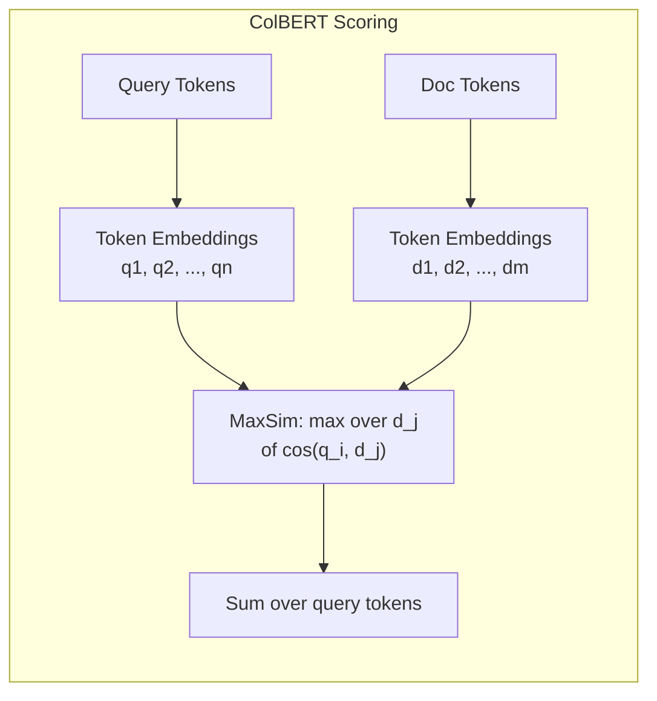
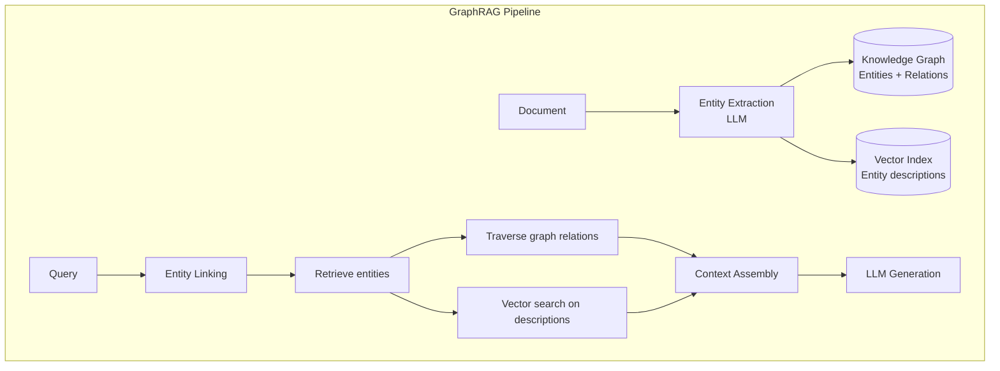
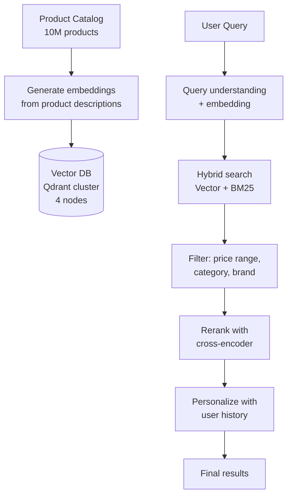

# Advanced Vector Search Patterns

> Author: **Tamilselvan** · ✉️ tamilselvan.sde@gmail.com · 🔗 [LinkedIn](https://www.linkedin.com/in/tamilselvan-ai/)
>


### ColBERT Late Interaction

ColBERT uses token-level embeddings with a "late interaction" scoring mechanism — more accurate than bi-encoders while being much faster than cross-encoders.



```python
# Simplified ColBERT scoring
def colbert_score(query_embs, doc_embs):
    """Late interaction scoring."""
    # query_embs: (num_query_tokens, dim)
    # doc_embs: (num_doc_tokens, dim)
    
    # Compute all pairwise cosine similarities
    similarity = query_embs @ doc_embs.T  # (nq, nd)
    
    # Max over document tokens for each query token
    max_sim = similarity.max(axis=1)  # (nq,)
    
    # Sum over query tokens
    return max_sim.sum()
```

**Tradeoffs:**
- Higher storage: store all token embeddings, not just pooled vector
- Higher accuracy: token-level matching captures fine-grained relevance
- Medium speed: slower than bi-encoder, faster than cross-encoder

---

### GraphRAG: Graph-Based RAG

GraphRAG combines knowledge graphs with vector search for multi-hop reasoning.



**When GraphRAG helps:**
- Multi-hop questions ("What company does the spouse of the CEO of OpenAI work for?")
- Relationship-focused queries
- Structured knowledge extraction

---

### Agentic RAG

Agentic RAG uses an LLM agent to dynamically decide retrieval strategy.

```python
class AgenticRAG:
    def __init__(self):
        self.tools = {
            "vector_search": self.vector_search,
            "keyword_search": self.keyword_search,
            "hybrid_search": self.hybrid_search,
            "code_search": self.code_search,
            "graph_query": self.graph_query,
        }
    
    def answer(self, question):
        # Step 1: Agent decides what tools to use
        plan = self.llm.analyze_question(
            question, 
            available_tools=list(self.tools.keys())
        )
        
        # Step 2: Execute plan (possibly multi-step)
        context = []
        for step in plan:
            tool = self.tools[step["tool"]]
            result = tool(**step["params"])
            context.extend(result)
            
            # Step 3: Check if enough info gathered
            if self.llm.enough_info(question, context):
                break
        
        # Step 4: Generate final answer
        return self.llm.generate(question, context)
```

---

### Self-Querying Retrieval

LLM generates structured queries (filters + search terms) from natural language.

```python
def self_query(user_question: str) -> dict:
    """LLM extracts query components from natural language."""
    prompt = f"""
Extract search query and filters from the user question.
Output JSON with: query_text, filters (date_range, author, category, etc.)

Question: {user_question}
"""
    response = llm.invoke(prompt)
    query_params = json.loads(response)
    
    # Use extracted components for vector search
    query_emb = embedder.encode(query_params["query_text"])
    results = vector_db.search(
        query_vector=query_emb,
        filter=query_params.get("filters", {}),
        k=10
    )
    return results
```

---

## Detailed Case Studies

### Case Study 1: E-commerce Product Search

**Problem:** Traditional keyword search fails for semantic queries like "comfortable shoes for running" — it matches "comfortable," "shoes," and "running" separately but misses the combined intent.

**Solution:**


**Results:**
- Recall improved: 45% → 89%
- Click-through rate: +34%
- Revenue per search: +22%

---

### Case Study 2: Customer Support Chatbot

**Problem:** Support team spends 60% of time answering repetitive questions from documentation.

**Solution:**
```mermaid
graph TB
    A[5000 support docs<br/>PDFs + wikis] --> B[Chunk: 500 tokens<br/>with 50 overlap]
    B --> C[Embed: BGE-large]
    C --> D[(Milvus vector DB<br/>HNSW index)]
    
    E[User Query<br/>"How to reset password?"] --> F[HyDE: Generate<br/>hypothetical answer]
    F --> G[Embed query]
    G --> H[Vector search<br/>+ metadata filter]
    H --> I[Rerank: cross-encoder]
    I --> J[LLM: GPT-4<br/>with context]
    J --> K[Answer + citations]
```

**Results:**
- First-response accuracy: 92%
- Support tickets reduced: 55%
- Average resolution time: 12 min → 2 min

---

### Case Study 3: Code Search for Large Codebase

**Problem:** Developers need to find relevant code across 50M+ lines of code.

```python
# Code embedding strategy
from code_chunker import CodeChunker

chunker = CodeChunker(language="python")

# Chunk by function/class boundaries
chunks = chunker.chunk_code("""
def calculate_embeddings(text, model="bge"):
    \"\"\"Generate embeddings for text.\"\"\"
    return model.encode(text)

class VectorSearch:
    def search(self, query, k=10):
        ...
""")

for chunk in chunks:
    # Each chunk = one function/class + its docstring
    embedding = code_embedder.encode(chunk.full_text)
    vector_db.insert(
        vector=embedding,
        payload={
            "code": chunk.code,
            "signature": chunk.signature,
            "file_path": chunk.file_path,
            "language": chunk.language
        }
    )

# Search: "find all HNSW-related search functions"
results = vector_db.search(
    query_vector=code_embedder.encode("HNSW search function"),
    filter={"language": "python"},
    k=20
)
```

---

## Embedding Fine-tuning

### Why Fine-tune Embeddings?

Domain-specific data has different vocabulary and concepts than general web text. Fine-tuning improves retrieval by 5-20%.

```python
from sentence_transformers import SentenceTransformer, losses
from sentence_transformers import InputExample
from torch.utils.data import DataLoader

model = SentenceTransformer('BAAI/bge-base-en-v1.5')

# Create training data: (anchor, positive, negative) triplets
train_data = [
    InputExample(
        texts=[
            "How do I reset my password?",                    # anchor
            "To reset password, click 'Forgot Password'...",  # positive  
            "The weather is nice today.",                      # negative
        ]
    ),
    # ... more examples
]

# Train with triplet loss
train_dataloader = DataLoader(train_data, shuffle=True, batch_size=16)
train_loss = losses.TripletLoss(model=model)

model.fit(
    train_objectives=[(train_dataloader, train_loss)],
    epochs=5,
    warmup_steps=100,
    show_progress_bar=True
)

# Save fine-tuned model
model.save('./fine-tuned-bge')
```

### Synthetic Data Generation for Fine-tuning

```python
def generate_training_data(documents, num_pairs=1000):
    """Generate (query, relevant_doc) pairs using LLM."""
    training_pairs = []
    
    for doc in documents[:num_pairs]:
        prompt = f"""
Document: {doc}

Generate 3 search queries that this document would be the perfect answer for.
Each query should be a realistic user question.
"""
        response = llm.invoke(prompt)
        queries = parse_queries(response)
        
        for query in queries:
            training_pairs.append((query, doc, "relevant"))
    
    return training_pairs
```

---

